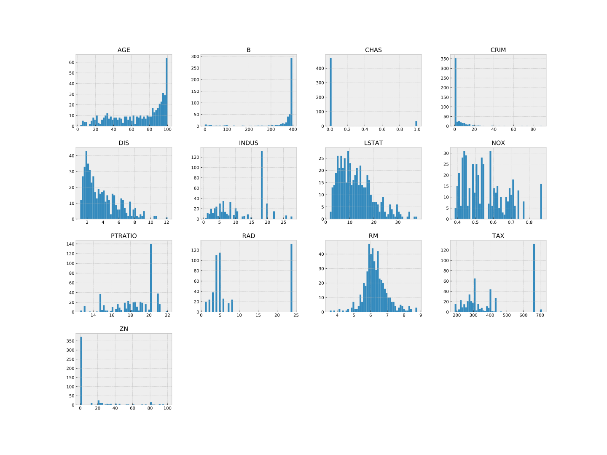
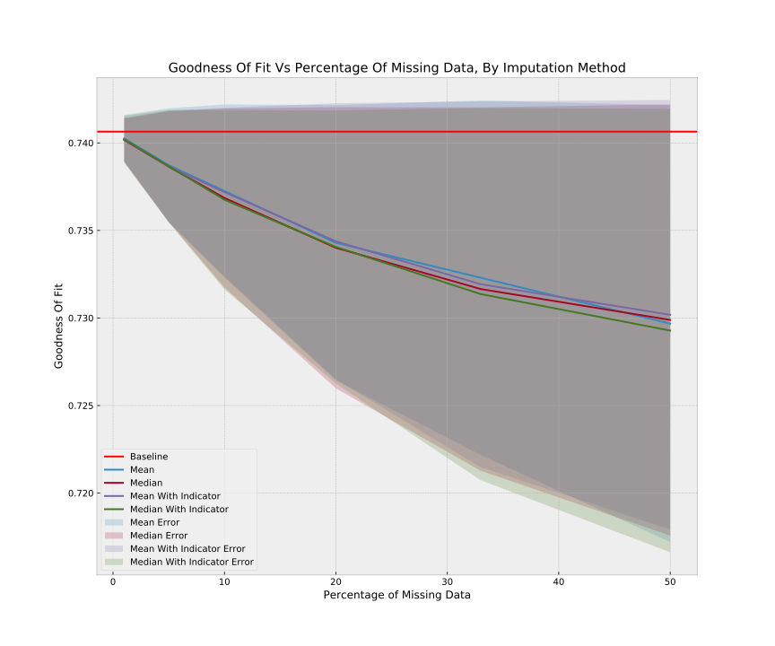

# Introduction

As aspiring data scientists, the first question we must always ask when given a task is: "Do we have the right data?" and "Is our data clean?". We cannot really help it if the data is just not there (we don't have any useful data), but we can help the second question. If data is missing, we must come up with a strategy to impute it, or to replace the missing variables with some other sort of information. In this study, we will demonstrate the utility of such methods, and when they are effective vs when they are not. First, lets set up the environment for this study, importing necessary libraries and other formatting tools:


```python
from sklearn.datasets import load_boston
from sklearn.linear_model import LinearRegression
from sklearn.metrics import mean_squared_error, r2_score
from sklearn.model_selection import train_test_split
from sklearn.preprocessing import Imputer
from sklearn.base import BaseEstimator
import numpy as np
import matplotlib.pyplot as plt
import seaborn as sns
from typing import Callable
from sklearn.impute import SimpleImputer
from pprint import pprint
import pandas as pd
plt.style.use('bmh')
```

# Analysis

## Initial Analysis of the Data

First, we will use pandas to perform a cursory analysis of the data, as this is always good practice:


```python
boston = load_boston()
col_names = boston['feature_names']
bos = pd.DataFrame(data = boston['data'], columns = boston['feature_names'])
bos_target = boston['target']

#Check missing values. 
bos.isnull().sum()
```

```
#> CRIM       0
#> ZN         0
#> INDUS      0
#> CHAS       0
#> NOX        0
#> RM         0
#> AGE        0
#> DIS        0
#> RAD        0
#> TAX        0
#> PTRATIO    0
#> B          0
#> LSTAT      0
#> dtype: int64
```

```python
_ = bos.hist(bins=50, figsize = (20,15))
plt.show()
```

<div class="figure" style="text-align: center">

<p class="caption">**Figure 1**: The columns each seem to have a different distribution. Other than RM, they either have a strong skew or an almost bimodal distribution.</p>
</div>

Looks like we have no missing data to start with, so we will need to create some. This plot does suggest some outliers. We can check those in the following manner:


```python
for k, v in bos.items():
	q1 = v.quantile(0.25)
	q3 = v.quantile(0.75)
	irq = q3 - q1
	v_col = v[(v <= q1 - 1.5 * irq) | (v >= q3 + 1.5 * irq)]
	perc = np.shape(v_col)[0] * 100.0 / np.shape(bos)[0]
	print("%s outliers = %8.2f%%" % (k, perc))
```

```
#> CRIM outliers =    13.04%
#> ZN outliers =    13.44%
#> INDUS outliers =     0.00%
#> CHAS outliers =   100.00%
#> NOX outliers =     0.00%
#> RM outliers =     5.93%
#> AGE outliers =     0.00%
#> DIS outliers =     0.99%
#> RAD outliers =     0.00%
#> TAX outliers =     0.00%
#> PTRATIO outliers =     2.96%
#> B outliers =    15.22%
#> LSTAT outliers =     1.38%
```


Now that we have inspected our data and have soothed our cautious souls, we can go ahead and proceed with our analysis.

## Building a Baseline Model.

In general, it is always best to build a simple baseline model first, before we proceed with our analysis. In the case of our missing data analysis, we will want to know the goodness of fit ($R^2$) and the loss (mean squared error) of our models. The same is true for the baseline. Let us first define a utility function for fitting and getting scores of a model:


```python
X, y = load_boston(return_X_y=True)
# default parameters to use
parameter_dict = {'n_jobs':-1}
# dictionary for results
results_dict = {}


def get_scores(features: np.ndarray,
               targets: np.ndarray,
               model_class: BaseEstimator=LinearRegression,
               pars: dict=parameter_dict) -> dict:
    # initialize model using external pars
    model = model_class(**pars)
    model.fit(features, targets)
    preds = model.predict(features)
    # get the scores
    goodness = r2_score(y, preds)
    loss = mean_squared_error(y, preds)
    return {'goodness_of_fit':goodness, 'mse':loss}
    

pprint(get_scores(X,y))
```

```
#> {'goodness_of_fit': 0.7406426641094095, 'mse': 21.894831181729202}
```

We have a goodness of fit of 0.74 and a loss of 21.89. 

## Missing at Random

Next we will proceed to compare different missing rates and imputation methods. First, lets define a function which replaces a random sample of a random columns values with NaNs:


```python
def random_miss(data: np.ndarray, prop: int) -> np.ndarray:
    # raise an error if our proportion is less than 0 or more than 100
    if type(prop) is not int or prop <= 0 or prop >=100:
        raise ValueError('needs to be an int less than 100 and greater than zero!')
    # sample columns, sample rows
    nrows = data.shape[0]
    idy = np.random.choice(data.shape[-1], 1)
    idx = np.random.choice(nrows, int(nrows*prop/100), replace=False)
    out = data.copy()
    # turn sample into nas
    out[idx, idy] = np.nan
    return out
```

Now, we need to be sure of ourselves, since this is random, so we will define two more functions: one which repeatedly makes columns missing at random and fits an imputer, and one which takes a list of scores and returns the mean and standard deviation of that list:


```python
def _stats_dict(arr: list) -> dict:
    return {'avg': np.mean(arr), 'std': np.std(arr)}

def iterate_stats(features: np.ndarray,
                  targets: np.ndarray,
                  impute_method: str=None,
                  prop: int=0,
                  iters: int=10,
                  model_class: BaseEstimator=LinearRegression,
                  pars: dict=parameter_dict) -> dict:
    r2 = []
    mse = []
    for _ in range(iters):
        # because we raise that valueerror in random_miss. This allows us to iterate our baseline too
        if prop ==  0:
            data = features
        else:
            tmp = random_miss(features, prop)
            data = SimpleImputer(strategy=impute_method).fit_transform(tmp)
            del tmp
        res = get_scores(data, targets, model_class, pars)
        # append scores to list
        r2 += [res['goodness_of_fit']]
        mse += [res['mse']]
    return {'goodness_of_fit': _stats_dict(r2), 'loss': _stats_dict(mse)}
```

With all this defined, we can go ahead and build our dictionary of results:


```python
# baseline model
results_dict['baseline'] = iterate_stats(X,y)

# define iterables
impute_types = ['mean','median']
miss_props = [1, 5, 10, 20, 33, 50]
n_rounds = X.shape[-1]*100

for imp in impute_types:
    results_dict[imp] = {p: iterate_stats(X, y, prop=p, iters=n_rounds, impute_method=imp) for p in miss_props}
pprint(results_dict)
```

```
#> {'baseline': {'goodness_of_fit': {'avg': 0.7406426641094095, 'std': 0.0},
#>               'loss': {'avg': 21.894831181729206,
#>                        'std': 3.552713678800501e-15}},
#>  'mean': {1: {'goodness_of_fit': {'avg': 0.7402070023857972,
#>                                   'std': 0.0013164001203268471},
#>               'loss': {'avg': 21.931609551070785, 'std': 0.11112991388191558}},
#>           5: {'goodness_of_fit': {'avg': 0.7387338251736326,
#>                                   'std': 0.003041232072219056},
#>               'loss': {'avg': 22.055974517461085, 'std': 0.25673946170462836}},
#>           10: {'goodness_of_fit': {'avg': 0.7370276606757076,
#>                                    'std': 0.0048516743545108576},
#>                'loss': {'avg': 22.200008167105327, 'std': 0.4095761956220574}},
#>           20: {'goodness_of_fit': {'avg': 0.7341425705123058,
#>                                    'std': 0.007728430119857383},
#>                'loss': {'avg': 22.443566198170224, 'std': 0.6524306405023015}},
#>           33: {'goodness_of_fit': {'avg': 0.7321928485556575,
#>                                    'std': 0.010272407103329911},
#>                'loss': {'avg': 22.6081608603784, 'std': 0.8671920483185532}},
#>           50: {'goodness_of_fit': {'avg': 0.7292073523737486,
#>                                    'std': 0.012627354711406844},
#>                'loss': {'avg': 22.860195122961088, 'std': 1.0659956801634318}}},
#>  'median': {1: {'goodness_of_fit': {'avg': 0.740213378259955,
#>                                     'std': 0.0012875991303582782},
#>                 'loss': {'avg': 21.931071302604266,
#>                          'std': 0.10869854709191049}},
#>             5: {'goodness_of_fit': {'avg': 0.7385871842394228,
#>                                     'std': 0.003268514698038575},
#>                 'loss': {'avg': 22.06835388004141, 'std': 0.2759265600983201}},
#>             10: {'goodness_of_fit': {'avg': 0.7370421062262125,
#>                                      'std': 0.005060958515099822},
#>                  'loss': {'avg': 22.198788680143267,
#>                           'std': 0.4272438715694937}},
#>             20: {'goodness_of_fit': {'avg': 0.7343297805256054,
#>                                      'std': 0.007675987421167867},
#>                  'loss': {'avg': 22.427762011939492, 'std': 0.648003451155301}},
#>             33: {'goodness_of_fit': {'avg': 0.732229567657035,
#>                                      'std': 0.00976892064708192},
#>                  'loss': {'avg': 22.605061050137664,
#>                           'std': 0.8246879451514574}},
#>             50: {'goodness_of_fit': {'avg': 0.7292628125981028,
#>                                      'std': 0.013014412356963623},
#>                  'loss': {'avg': 22.85551319543678,
#>                           'std': 1.0986709148081857}}}}
```

This ultra nested dict is a bit hard to digest. Next, we will define two more functions: the first will take in a nested dictionary (the results at an imputation method), and get the average and one standard deviation upper and lower bounds of the results. The second will allow us to quickly plot our data:


```python
def results_to_series(res: dict, f_type: str) -> dict:
    upper = []
    lower = []
    avg = []
    x = list(res.keys())
    avg = [res[k][f_type]['avg'] for k in x]
    std = [res[k][f_type]['std'] for k in x]
    # for plotting
    # lower and upper bounds for lovely error on the line plot
    upper = [avg[i] + std[i] for i in range(len(avg))]
    lower = [avg[i] - std[i] for i in range(len(avg))]
    return {'x':x, 'y':avg, 'upper': upper, 'lower':lower}


def make_plotter(f_type: str) -> Callable:
    # returns a plotting function to either plot the goodness or the loss
    def plot_generic_stats(results: dict=results_dict)-> None:
        fig = plt.figure(figsize=(12,10))
        ax = plt.subplot()
        base = results_dict['baseline'][f_type]
        # horizontal line for baseline
        ax.axhline(base['avg'], color='r', xmin=0, xmax=50, label='Baseline')
        keys = [k for k in results.keys() if k != 'baseline']
        for k in keys:
            tmp = results_to_series(results[k], f_type)
            ax.plot(tmp['x'], tmp['y'], label=k.title())
            ax.fill_between(tmp['x'], tmp['lower'], tmp['upper'], alpha=0.1, label=f"{k} error".title())
        ax.legend()
        ax.set_title(f"{f_type} vs Percentage of Missing Data, by Imputation Method".title().replace("_"," "))
        ax.set_xlabel('Percentage of Missing Data')
        ax.set_ylabel(f_type.title().replace("_"," "))
        plt.show()
        plt.clf()

    return plot_generic_stats


plot_goodness = make_plotter('goodness_of_fit')
plot_loss = make_plotter('loss')
```

Now that we have that out of the way, we can go ahead and plot our results. First, lets check out goodness of fit:


```python
plot_goodness()
```

<div class="figure" style="text-align: center">

<p class="caption">**Figure 2**: Mean and Median imputation performed almost identically, and neither was much much worse than the baseline.</p>
</div>

As the amount of missing data grew, the goodness of fit went down (but not by a lot). However, at low missing rates, this did absolutely fine. That means for simple datasets with only a bit of missing data, its likely we can quickly just throw in a simple imputation method and get near the same results as if our data were all there. Lets double check this is the case with loss:


```python
plot_loss()
```

<div class="figure" style="text-align: center">

<p class="caption">**Figure  3**: Mean and Median imputation again performed almost the same. This supports our hypothsis</p>
</div>


