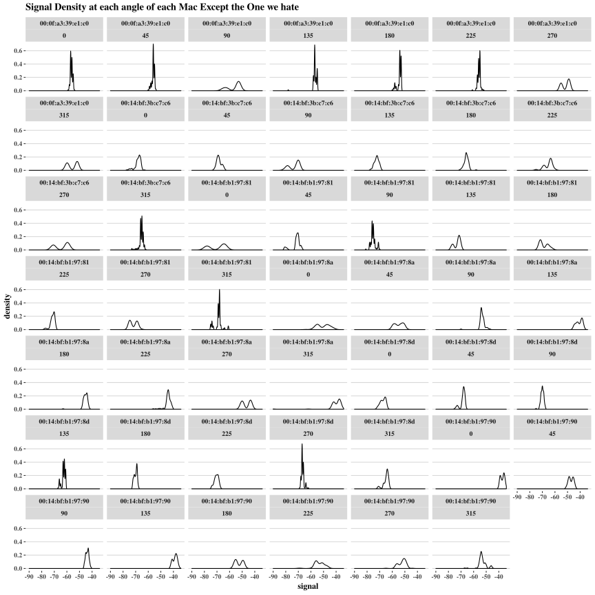
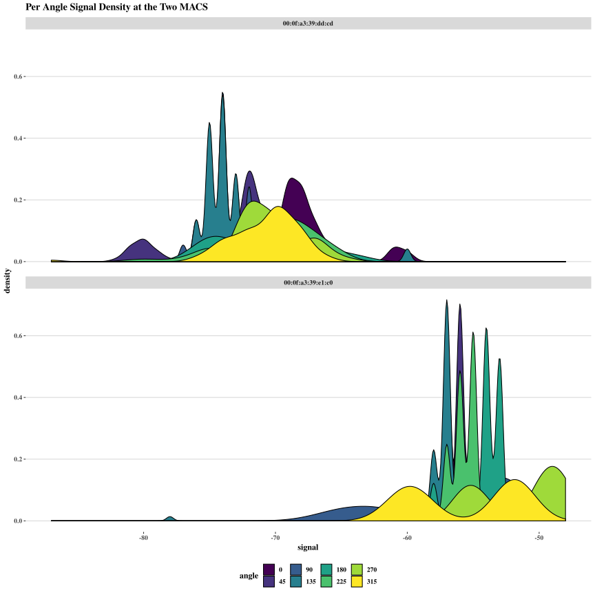

# Introduction

TODO: CLEAN UP
Businesses today often need to know where items (such as people or machinery) at any given point in time, in a specified area.  Tracking items indoors provides an interesting challenge as conventional methods (GPS) for establishing location don’t work well indoors.  Nolan and Lang propose an innovative solution to this problem by combining machine learning techniques (K-Nearest Neighbors), and wifi signals in order to create an indoor map that can locate and estimate where a given object/person/thing by assessing its signal strength at various access points (wifi routers) placed throughout that area.  This information proves vital to optimizing workflows for how objects move throughout a space, and how improve upon their future handling to best accommodate the business’s needs.

Initially researchers mapped the static signal strengths of of 7 access points throughout the desired space.  These routers communicate with a scanning device that was methodically placed at known intervals around the desired space.  This collection of data makes up the offline data.  Which can be found at http://rdatasciencecases.org/Data/offline.final.trace.txt.  The raw data is arranged by router, and each of the variables are described below. 


  * **t**: Time stamp (Milliseconds) since 12:00am, January 1, 1970
  * **Id**: router MAC address
  * **Pos**: Router location
  * **Degree**: Direction scanning device was carried by the researcher, measured in Degrees
  * **MAC**: MAC address of either the accessrouter, or scanning device combined with corresponding values for signal strength (dBm), the mode in which it was operating(adhoc scanner = 1, access router = 3), and its corresponding channel frequency.
  * **Signal**: Received Signal Strength in DbM

<!-- end of list -->

# Data Cleansing
After removing extraneous comments and formatting the data into a tabular form, we rounded the angles into discrete units of 45 degrees. We also removed data which was not pertinent to the study, such as position in the Z axis, as well as the MAC of the scanner. We also removed data from MAC addresses which were similarly not useful to this study. The main MACS we focused on were 5 linksys routers, as well as two additional Alpha routers with the id’s `(00:0f:a3:39:e1:c0 and 00:0f:a3:39:dd:cd)`. 


# Things to do


<div class="figure" style="text-align: center">

<p class="caption">Signal vs Orientation at Nolan and Lang's Selected MAC</p>
</div>

Here is the MAC in question

<div class="figure" style="text-align: center">

<p class="caption">Signal vs Orientation of the much hated bad mac</p>
</div>

Comment on differences fix captions, this mac looks DAMN GOOD TO ME


Recreate that stupid plot, and do it for the other MAC, then improve


<div class="figure" style="text-align: center">

<p class="caption">dumb</p>
</div>


<div class="figure" style="text-align: center">

<p class="caption">dumb</p>
</div>

<div class="figure" style="text-align: center">

<p class="caption">dumb</p>
</div>


# code stops at ipynb chunk 39

We need to do the dumb chunks from 39 to 47, I got the rest

Read in the onlineSummary 

Figure out fig sizes pls

# Appendix


```r
options( digits = 2)
pander::pander(
 list(
      t = "Time stamp (Milliseconds) since 12:00am, January 1, 1970",
      Id = "router MAC address",
      Pos = "Router location",
      Degree = "Direction scanning device was carried by the researcher, measured in Degrees",
      MAC = "MAC address of either the accessrouter, or scanning device combined with corresponding values for signal strength (dBm), the mode in which it was operating(adhoc scanner = 1, access router = 3), and its corresponding channel frequency."
 ,
 Signal = "Received Signal Strength in DbM")
)
# first we define the processline function, 
# which unsurprisingly processes a single line of the offline or online.txt
library(tidyverse)
processLine = function(x) {
  # here we split the line at the weird markers. Strsplit returns a list
  # we take the first item of the list
  tokens = strsplit(x, "[;=,]")[[1]]
  if (length(tokens) == 10){
    return(NULL)
  }
  # now we are going to stack the tokens
  tmp = matrix(tokens[ - (1:10) ], , 4, byrow = TRUE)
  cbind(matrix(tokens[c(2, 4, 6:8, 10)], nrow(tmp), 6,byrow = TRUE),
  tmp)
}
roundOrientation = function(angles) {
  refs = seq(0, by = 45, length  = 9)
  q = sapply(angles, function(o) which.min(abs(o - refs)))
  c(refs[1:8], 0)[q]
}
# this reads in the data
readData <- function(filename, 
                     subMacs = c("00:0f:a3:39:e1:c0", "00:0f:a3:39:dd:cd", "00:14:bf:b1:97:8a",
                                 "00:14:bf:3b:c7:c6", "00:14:bf:b1:97:90", "00:14:bf:b1:97:8d",
                                 "00:14:bf:b1:97:81")) {
  # read it in line by line
  txt = readLines(filename)
  # ignore comments
  lines = txt[ substr(txt, 1, 1) != "#" ]
  # process (tokenize and stack) each line
  tmp = lapply(lines, processLine)
  # rbind each elemnt of the list together
  offline = as.data.frame(do.call(rbind, tmp), 
                          stringsAsFactors= FALSE) 
  # set the names of our matrix
  names(offline) = c("time", "scanMac", 
                     "posX", "posY", "posZ", "orientation", 
                     "mac", "signal", "channel", "type")

  # keep only signals from access points
  offline = offline[ offline$type == "3", ]

  # drop scanMac, posZ, channel, and type - no info in them
  dropVars = c("scanMac", "posZ", "channel", "type")
  offline = offline[ , !( names(offline) %in% dropVars ) ]

  # drop more unwanted access points
  offline = offline[ offline$mac %in% subMacs, ]

  # convert numeric values
  numVars = c("time", "posX", "posY", "orientation", "signal")
  offline[numVars] = lapply(offline[numVars], as.numeric)

  # convert time to POSIX
  offline$rawTime = offline$time
  offline$time = offline$time/1000
  class(offline$time) = c("POSIXt", "POSIXct")

  # round orientations to nearest 45
  offline$angle = roundOrientation(offline$orientation)

  return(offline)
}

offline_original <- readData("../Data/offline.final.trace.txt")
bad_mac <-  "00:0f:a3:39:dd:cd"
good_mac <- "00:0f:a3:39:e1:c0"
fixfonts <- theme(text = element_text(family = "serif", , face = "bold"))
plt_theme <- ggthemes::theme_wsj()  + fixfonts

offline_original %>% mutate(angle = factor(angle)) %>%
  filter(posX == 2 & posY == 12 & mac != bad_mac) %>%
  ggplot() + geom_boxplot(aes(y = signal, x= angle)) + 
  facet_wrap(. ~ mac, ncol = 2) +  
  ggtitle("Signal vs Orientation at 6 of 7 MACs") + plt_theme
offline_original %>% mutate(angle = factor(angle)) %>%
  filter(posX == 2 & posY == 12 & mac == bad_mac) %>%
  ggplot() + geom_boxplot(aes(y = signal, x= angle)) + 
  facet_wrap(. ~ mac)  + 
  ggtitle("Signal vs Orientation at the missing MAC") + plt_theme
offline_original %>% mutate(angle = factor(angle)) %>%
  filter(posX == 2 & posY == 12 & mac != bad_mac) %>%
  ggplot(aes(signal)) + geom_density()+
  facet_wrap(mac ~ angle) +  
  ggtitle("Signal Density at each angle of each Mac Except the One we hate") + plt_theme + ggthemes::scale_fill_hc()
offline_original %>% mutate(angle = factor(angle)) %>%
  filter(posX == 2 & posY == 12 & mac == bad_mac) %>%
  ggplot(aes(signal)) + geom_density()+
  facet_wrap(mac ~ angle) +  
  ggtitle("Signal Density Per angle at the hated MAC") + plt_theme + ggthemes::scale_fill_hc()
offline_original %>% mutate(angle = factor(angle)) %>%
  filter(posX == 2 & posY == 12 & mac != bad_mac) %>%
  ggplot(aes(signal, fill = angle )) + geom_density()+
  facet_wrap(. ~ mac, ncol = 2) +  
  ggtitle("Signal Density per MAC, ") + plt_theme + scale_fill_viridis_d()
offline_original %>% mutate(angle = factor(angle)) %>%
  filter(posX == 2 & posY == 12 & mac == bad_mac) %>%
  ggplot(aes(signal, fill = angle )) + geom_density()+
  facet_wrap(. ~ mac) +
  ggtitle("Signal density per angle at the hated mac") + plt_theme + scale_fill_viridis_d()
```

#
