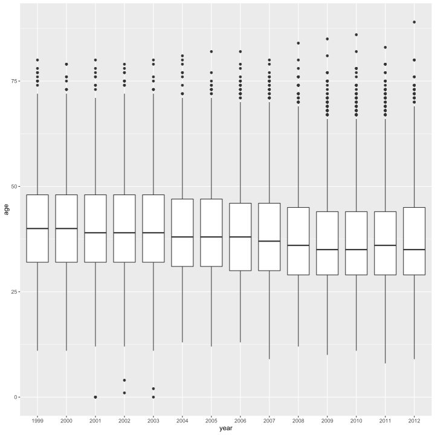
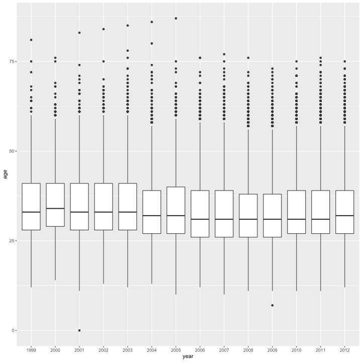

# Introduction

The focus of this Case study is on data cleaning of "messy" data.  The subject of our analysis is focused on the Cherry Blossom 10 mile race held annually in Washington, DC.  The race was created in 1973 as a training event for top-tier runners preparing for the Boston Marathon.  However, its popularity has grown considerably since then and become recognized as its own unique challenge in the racing community.  The website cherryblowssom.org has listed race results since 1973.  We will be examining the years 1999 to 2012 in this case study.  


```r
library(rvest)
ubase <- "http://cherryblossom.org/"
url <- paste0(ubase, "results/2012/2012cucb10m-m.htm")
doc <- read_html(url)
```


```r
library(stringr)
extract_res_table <- function(url) {
    read_html(url) %>% html_nodes("pre") %>% html_text() %>% str_split("\\r\\n") %>% 
        .[[1]]
}
```


```r
men_urls <- c("results/1999/cb99m.html", "results/2000/Cb003m.htm", "results/2001/oof_m.html", 
    "results/2002/oofm.htm", "results/2003/CB03-M.HTM", "results/2004/men.htm", 
    "results/2005/CB05-M.htm", "results/2006/men.htm", "results/2007/men.htm", 
    "results/2008/men.htm", "results/2009/09cucb-M.htm", "results/2010/2010cucb10m-m.htm", 
    "results/2011/2011cucb10m-m.htm", "results/2012/2012cucb10m-m.htm")
```


```r
men_urls <- paste0(ubase, men_urls)
head(men_urls, 3)
```

```
#> [1] "http://cherryblossom.org/results/1999/cb99m.html"
#> [2] "http://cherryblossom.org/results/2000/Cb003m.htm"
#> [3] "http://cherryblossom.org/results/2001/oof_m.html"
```


```r
library(purrr)
men_tables <- map(men_urls, extract_res_table)
```

    


```r
map_int(men_tables, length)
```

```
#>  [1]    1    2 3628 3728 3952 4165 4336 5245 5284 5913    1 6920 7020 7202
```


```r
str_sub(men_tables[[1]], 1, 200)
```

```
#> [1] "\nPLACE DIV /TOT  NAME                  AG HOMETOWN           TIME    PACE  \n===== ========= ===================== == ================== ======= ===== \n    1    1/1584 Worku Bikila          28 Ethiopia"
```


```r
men_tables[[1]] <- str_split(men_tables[[1]], "\\n")[[1]]
map_int(men_tables, length)
```

```
#>  [1] 3194    2 3628 3728 3952 4165 4336 5245 5284 5913    1 6920 7020 7202
```


```r
extract_res_table <- function(url, year = 2001) {
    selector <- if (year == 2000) 
        "font" else "pre"
    regexp <- if (year == 1999) 
        "\\n" else "\\r\\n"
    
    result <- read_html(url) %>% html_nodes(selector)
    
    if (year == 2000) 
        result <- result[[4]]
    
    result <- result %>% html_text()
    
    if (year == 2009) 
        return(result)
    
    result %>% str_split(regexp) %>% .[[1]]
}
```


```r
years <- 1999:2012
men_tables <- map2(men_urls, years, extract_res_table)
names(men_tables) <- years
map_int(men_tables, length)
```

```
#> 1999 2000 2001 2002 2003 2004 2005 2006 2007 2008 2009 2010 2011 2012 
#> 3194 3019 3628 3728 3952 4165 4336 5245 5284 5913 6659 6920 7020 7202
```


```r
women_urls <- c("results/1999/cb99f.html", "results/2000/Cb003f.htm", "results/2001/oof_f.html", 
    "results/2002/ooff.htm", "results/2003/CB03-F.HTM", "results/2004/women.htm", 
    "results/2005/CB05-F.htm", "results/2006/women.htm", "results/2007/women.htm", 
    "results/2008/women.htm", "results/2009/09cucb-F.htm", "results/2010/2010cucb10m-f.htm", 
    "results/2011/2011cucb10m-f.htm", "results/2012/2012cucb10m-f.htm")
```


```r
women_urls <- paste0(ubase, women_urls)
extract_res_table <- function(url, year = 2001, female = TRUE) {
    selector <- if (year == 2000) 
        "font" else "pre"
    regexp <- if (year == 1999) 
        "\\n" else "\\r\\n"
    
    result <- read_html(url) %>% html_nodes(selector)
    
    if (year == 2000) 
        result <- result[[4]]
    
    result <- result %>% html_text()
    
    if (year == 2009 && female == FALSE) 
        return(result)
    
    result %>% str_split(regexp) %>% .[[1]]
}
```


```r
men_tables <- map2(men_urls, years, extract_res_table, female = FALSE)
women_tables <- map2(women_urls, years, extract_res_table, female = TRUE)
names(men_tables) <- years
names(women_tables) <- years
map_int(men_tables, length)
```

```
#> 1999 2000 2001 2002 2003 2004 2005 2006 2007 2008 2009 2010 2011 2012 
#> 3194 3019 3628 3728 3952 4165 4336 5245 5284 5913 6659 6920 7020 7202
```

```r
map_int(women_tables, length)
```

```
#> 1999 2000 2001 2002 2003 2004 2005 2006 2007 2008 2009 2010 2011 2012 
#> 2360 2169 2976 3339 3548 3907 4343 5445 5700 6406 8334 8864 9039 9738
```


```r
dir.create("men")
dir.create("women")

walk2(men_tables, paste("men", paste(years, "txt", sep = "."), sep = "/"), writeLines)
walk2(women_tables, paste("women", paste(years, "txt", sep = "."), sep = "/"), 
    writeLines)
```


```r
findColLocs = function(spacerRow) {
  
  spaceLocs = gregexpr(" ", spacerRow)[[1]]
  rowLength = nchar(spacerRow)
  
  if (substring(spacerRow, rowLength, rowLength) != " ")
    return( c(0, spaceLocs, rowLength + 1))
  else return(c(0, spaceLocs))
}


selectCols = function(shortColNames, headerRow, searchLocs) {
  sapply(shortColNames, function(shortName, headerRow, searchLocs){
    
    startPos = regexpr(shortName, headerRow)[[1]]
    
    if (startPos == -1) return( c(NA, NA) )
    
    index = sum(startPos >= searchLocs)
    c(searchLocs[index] + 1, searchLocs[index + 1])
  }, 
  
  headerRow = headerRow, searchLocs = searchLocs )
}
```


```r
extractVariables = function(file, varNames = c("name", "home", "ag", "gun", 
    "net", "time")) {
    eqIndex = grep("^===", file)
    
    spacerRow = file[eqIndex]
    headerRow = tolower(file[eqIndex - 1])
    body = file[-(1:eqIndex)]
    
    footnotes = grep("^[[:blank:]]*(\\*|\\#)", body)
    if (length(footnotes) > 0) 
        body = body[-footnotes]
    blanks = grep("^[[:blank:]]*$", body)
    if (length(blanks) > 0) 
        body = body[-blanks]
    
    searchLocs = findColLocs(spacerRow)
    locCols = selectCols(varNames, headerRow, searchLocs)
    
    Values = mapply(substr, list(body), start = locCols[1, ], stop = locCols[2, 
        ])
    colnames(Values) = varNames
    
    return(Values)
}
```


```r
wfilenames <- list.files("women", pattern = ".txt$", full.names = TRUE)
women_files <- map(wfilenames, readLines)
names(women_files) <- str_match(wfilenames, "women/(.*).txt")[, 2]
```


```r
mfilenames <- list.files("men", pattern = ".txt$", full.names = TRUE)
men_files <- map(mfilenames, readLines)
names(men_files) <- str_match(mfilenames, "men/(.*).txt")[, 2]
```


```r
men_res_mat <- map(men_files, extractVariables)
length(men_res_mat)
```

```
#> [1] 14
```

```r
map_int(men_res_mat, nrow)
```

```
#> 1999 2000 2001 2002 2003 2004 2005 2006 2007 2008 2009 2010 2011 2012 
#> 3190 3016 3561 3723 3946 4156 4324 5235 5274 5905 6649 6909 7011 7193
```


```r
men_file_2001 <- men_files$`2001`
women_file_2001 <- women_files$`2001`

eq_idx_2001 <- str_which(men_file_2001, "^===")
spacer_row_2001 <- men_file_2001[eq_idx_2001]
header_row_2001 <- men_file_2001[eq_idx_2001 - 1] %>% str_to_lower()

women_files$`2001`[2] <- header_row_2001
women_files$`2001`[3] <- spacer_row_2001
```


```r
women_res_mat <- map(women_files, extractVariables)
length(women_res_mat)
```

```
#> [1] 14
```

```r
map_int(women_res_mat, nrow)
```

```
#> 1999 2000 2001 2002 2003 2004 2005 2006 2007 2008 2009 2010 2011 2012 
#> 2356 2166 2972 3334 3542 3899 4333 5435 5690 6397 8323 8853 9030 9729
```


```r
age <- as.numeric(men_res_mat$`2012`[, "ag"])
```


```r
tail(age)
```

```
#> [1] 41 39 56 35 NA 48
```


```r
age <- map(men_res_mat, ~as.numeric(.x[, "ag"]))
```


```r
library(tibble)
library(tidyr)
library(ggplot2)

age %>% enframe(name = "year", value = "age") %>% unnest() %>% ggplot(aes(year, 
    age)) + geom_boxplot()
```




```r
sapply(women_res_mat, nrow)
```

```
#> 1999 2000 2001 2002 2003 2004 2005 2006 2007 2008 2009 2010 2011 2012 
#> 2356 2166 2972 3334 3542 3899 4333 5435 5690 6397 8323 8853 9030 9729
```


```r
age <- map(women_res_mat, ~as.numeric(.x[, "ag"]))
```


```r
age %>% enframe(name = "year", value = "age") %>% unnest() %>% ggplot(aes(year, 
    age)) + geom_boxplot()
```




```r
sapply(age, function(x) sum(is.na(x)))
```

```
#> 1999 2000 2001 2002 2003 2004 2005 2006 2007 2008 2009 2010 2011 2012 
#>    4    0    0    4    0    0    8    1    2    0    2    0    1    0
```

```r
convert_time <- function(t) {
    time_pieces <- str_split(t, ":")
    map_dbl(time_pieces, function(x) {
        x <- as.numeric(x)
        if (length(x) == 2) 
            x[1] + x[2]/60 else 60 * x[1] + x[2] + x[3]/60
    })
}
```


```r
create_df = function(Res, year, sex) {
    if (!is.na(Res[1, "net"])) 
        useTime = Res[, "net"] else if (!is.na(Res[1, "gun"])) 
        useTime = Res[, "gun"] else useTime = Res[, "time"]
    
    useTime = gsub("[#\\*[:blank:]]", "", useTime)
    runTime = convert_time(useTime[useTime != ""])
    
    Res = Res[useTime != "", ]
    age = gsub("X{2}\\s{1}?|\\s{3}?", "0  ", Res[, "ag"])
    Res[, "ag"] = age
    
    Results = data.frame(year = rep(year, nrow(Res)), sex = rep(sex, nrow(Res)), 
        name = Res[, "name"], home = Res[, "home"], age = as.numeric(Res[, "ag"]), 
        runTime = runTime, stringsAsFactors = FALSE)
    invisible(Results)
}
```


```r
separatorIdx = grep("^===", men_files[["2006"]])
separatorRow = men_files[["2006"]][separatorIdx]
separatorRowX = paste(substring(separatorRow, 1, 63), " ", substring(separatorRow, 
    65, nchar(separatorRow)), sep = "")
men_files[["2006"]][separatorIdx] = separatorRowX

menResMat = sapply(men_files, extractVariables)
menDF = mapply(create_df, menResMat, year = 1999:2012, sex = rep("M", 14), SIMPLIFY = FALSE)

separatorIdx = grep("^===", women_files[["2006"]])
separatorRow = women_files[["2006"]][separatorIdx]
separatorRowX = paste(substring(separatorRow, 1, 63), " ", substring(separatorRow, 
    65, nchar(separatorRow)), sep = "")
women_files[["2006"]][separatorIdx] = separatorRowX

women_files[[3]] = append(women_files[[3]], men_files[[3]][4:5], after = 3)

womenResMat = sapply(women_files, extractVariables)

womenDF = mapply(create_df, womenResMat, year = 1999:2012, sex = rep("W", 14), 
    SIMPLIFY = FALSE)
```


```r
allMen = do.call(rbind, menDF)
allWomen = do.call(rbind, womenDF)
```


```r
head(allWomen)
```

<div data-pagedtable="false">
  <script data-pagedtable-source type="application/json">
{"columns":[{"label":[""],"name":["_rn_"],"type":[""],"align":["left"]},{"label":["year"],"name":[1],"type":["int"],"align":["right"]},{"label":["sex"],"name":[2],"type":["chr"],"align":["left"]},{"label":["name"],"name":[3],"type":["chr"],"align":["left"]},{"label":["home"],"name":[4],"type":["chr"],"align":["left"]},{"label":["age"],"name":[5],"type":["dbl"],"align":["right"]},{"label":["runTime"],"name":[6],"type":["dbl"],"align":["right"]}],"data":[{"1":"1999","2":"W","3":"Jane Omoro","4":"Kenya","5":"26","6":"54","_rn_":"1999.1"},{"1":"1999","2":"W","3":"Jane Ngotho","4":"Kenya","5":"29","6":"54","_rn_":"1999.2"},{"1":"1999","2":"W","3":"Lidiya Grigoryeva","4":"Russia","5":"0","6":"54","_rn_":"1999.3"},{"1":"1999","2":"W","3":"Eunice Sagero","4":"Kenya","5":"20","6":"54","_rn_":"1999.4"},{"1":"1999","2":"W","3":"Alla Zhilyayeva","4":"Russia","5":"29","6":"54","_rn_":"1999.5"},{"1":"1999","2":"W","3":"Teresa Wanjiku","4":"Kenya","5":"24","6":"54","_rn_":"1999.6"}],"options":{"columns":{"min":{},"max":[10]},"rows":{"min":[10],"max":[10]},"pages":{}}}
  </script>
</div>


```r
years = 1999:2012
```

