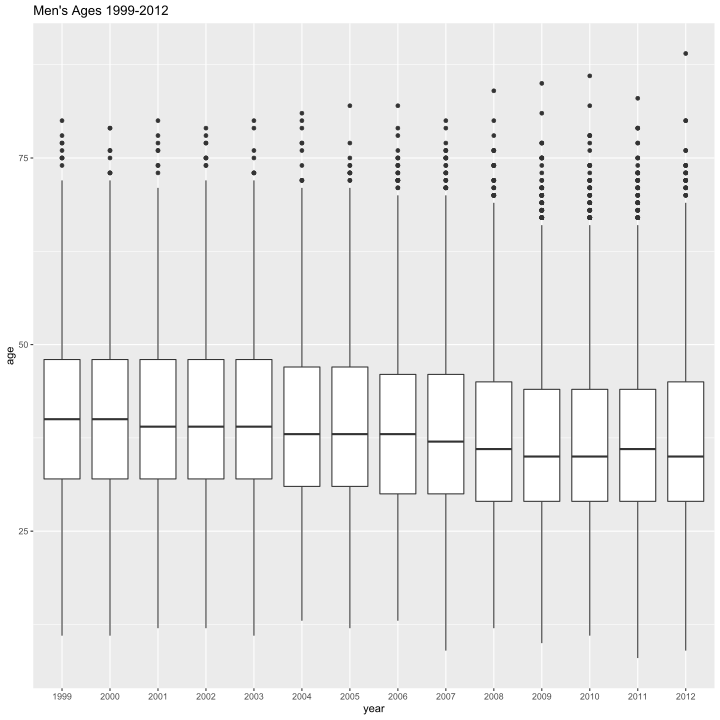
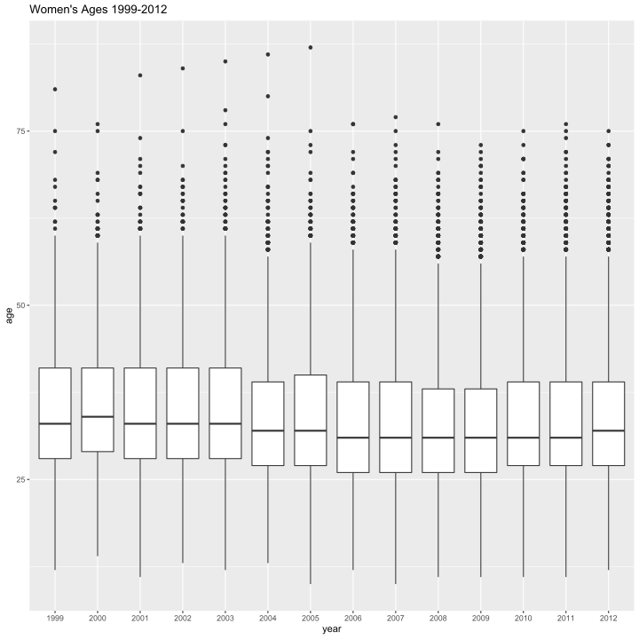
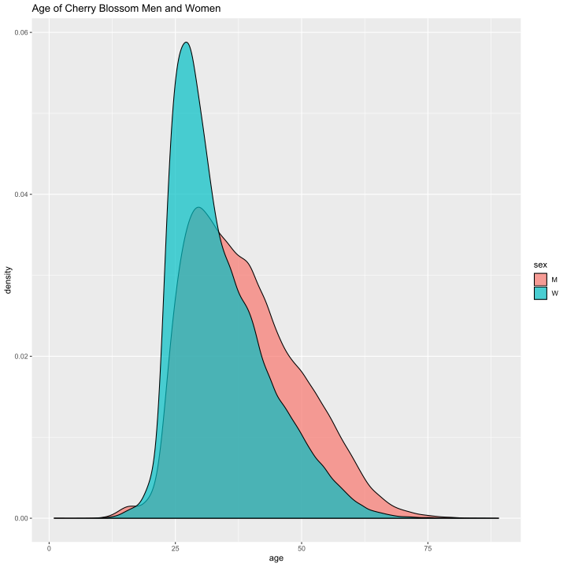
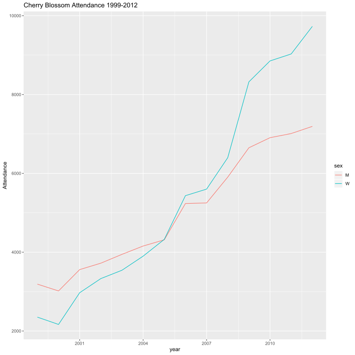

# Introduction/Background

The focus of this Case study is data cleaning of "messy" data.  The focus of our analysis is the Cherry Blossom 10 mile race held annually in Washington, DC.  The race was created in 1973 as a training event for top-tier runners training for the Boston Marathon.  However, its popularity has grown considerably since then and become recognized as its own unique challenge in the racing community.  The website cherryblossom.org has listed race results since 1973.  We will be examining the years 1999 to 2012.  We chose question 7 from Nolan and Lang for our analysis.  Which asks to re-create the men's web scraping and data cleaning process and create a dataframe for the women's race results from 1999-2012.  

# Methodology

Nolan and Lang start us off on the data cleaning process by demonstrating what needed to be done to the mens data in order to transform it into useable data.  They accomplished this through regex functions and data manipulation.   We applied similar techniques with different R libraries to the womens data in order to generate a dataframe of womens results.  We've listed off some of these techniques in a table below.  For more detailed information on data manipulation, we've also commented each code block to give the grader better insight into the actions performed.  


```r
pander::pander(list(DataImport = "Importing using stringr collecting on the pre node and splitting it based on new lines. ", 
    URLS = "Concatenate all URL's with base cherry blossom URL", extract_res_table = "Adding logic for various years different formats.  ie: ", 
    list("If year is 2000, import on head 'font' tag, else import on 'pre' tag", 
        "If year is 1999, split lines by `\\n`, else split by `\\r\\n`", "For year 2001, change index for header/spacer row"), 
    WriteTxtFiles = "Create mens/womens directories and store txt results for each year", 
    findColLocs = "Using the spacer row to isolate columns", selectCols = "Applies names and indexes start position", 
    extractVariables = "Uses findColLocs and SelectCols to format the and collect data", 
    create_df = "Creates dataframe", list(usetime = "Logic for handling gun time, net time and time. Replaces blank rows", 
        runTime = "Converts time to minutes(numeric)")))
```


  * **DataImport**: Importing using stringr collecting on the pre node and splitting it based on new lines.
  * **URLS**: Concatenate all URL's with base cherry blossom URL
  * **extract_res_table**: Adding logic for various years different formats.  ie:
  *

      * If year is 2000, import on head 'font' tag, else import on 'pre' tag
      * If year is 1999, split lines by `\n`, else split by `\r\n`
      * For year 2001, change index for header/spacer row

  * **WriteTxtFiles**: Create mens/womens directories and store txt results for each year
  * **findColLocs**: Using the spacer row to isolate columns
  * **selectCols**: Applies names and indexes start position
  * **extractVariables**: Uses findColLocs and SelectCols to format the and collect data
  * **create_df**: Creates dataframe
  *

      * **usetime**: Logic for handling gun time, net time and time. Replaces blank rows
      * **runTime**: Converts time to minutes(numeric)


<!-- end of list -->


```r
#First we use rvest library to read in results.  
library(rvest)
library(tidyverse)
ubase <- 'http://cherryblossom.org/'
url <- paste0(ubase, 'results/2012/2012cucb10m-m.htm')
doc <- read_html(url)

#Next we'll load up stringr (tidyverse) to create our function that will:
# read in the URLs, read the the table nodes marked with 'pre', 
# then split the strings based on new lines.
library(stringr)
extract_res_table <- function(url) {
  read_html(url) %>% 
    html_nodes('pre') %>% 
    html_text() %>% 
    str_split('\\r\\n') %>% 
    .[[1]]
}

# List of the mens URLS
men_urls <- c(
  'results/1999/cb99m.html',
  'results/2000/Cb003m.htm',
  'results/2001/oof_m.html',
  'results/2002/oofm.htm',
  'results/2003/CB03-M.HTM',
  'results/2004/men.htm',
  'results/2005/CB05-M.htm',
  'results/2006/men.htm',
  'results/2007/men.htm',
  'results/2008/men.htm',
  'results/2009/09cucb-M.htm',
  'results/2010/2010cucb10m-m.htm',
  'results/2011/2011cucb10m-m.htm',
  'results/2012/2012cucb10m-m.htm'
)


#concatenate URLS to the base cherryblossom website.
men_urls <- paste0(ubase, men_urls)


library(purrr)
#Using purr to apply the extract_res_table function to the mens URLS and build a list with each row being a string of the year run.
men_tables <- map(men_urls, extract_res_table)


#Looking at how many lines per year.  Noticing we've got low lengths(counts) on list entry 1 (Yr=1999), 2(Yr=2000), and 11(Yr=2009)
#map_int(men_tables, length)

#Taking a look at 1999 or first entry using str_sub
#str_sub(men_tables[[1]], 1, 200)

#Therefore, need to split on a new line entry for 1999

men_tables[[1]] <- str_split(men_tables[[1]], '\\n')[[1]]
#map_int(men_tables, length)


#Updating our extract_res_table function to recognize 1999 as a new line split.
#Also adding logic for 2000 to look at the font tag for its data.

extract_res_table <- function(url, year = 2001) {
  selector <- if (year == 2000) 'font' else 'pre'
  regexp <- if (year == 1999) '\\n' else '\\r\\n'
  #read urls and respective table tags
  result <- read_html(url) %>% 
    html_nodes(selector)
  
  if (year == 2000) result <- result[[4]]
  #parse the htmltext
  result <- result %>% 
    html_text()
  
  if (year == 2009) return(result)
  #splits the table nodes with respective function for year
  result %>% 
    str_split(regexp) %>% 
    .[[1]]
}


# Time to recheck to see if all the data imported.
years <- 1999:2012
men_tables <- map2(men_urls, years, extract_res_table)
names(men_tables) <- years
#map_int(men_tables, length)
#Looking much better, now to the women!


#List of womens URLS
women_urls <- c(
  'results/1999/cb99f.html',
  'results/2000/Cb003f.htm',
  'results/2001/oof_f.html',
  'results/2002/ooff.htm',
  'results/2003/CB03-F.HTM',
  'results/2004/women.htm',
  'results/2005/CB05-F.htm',
  'results/2006/women.htm',
  'results/2007/women.htm',
  'results/2008/women.htm',
  'results/2009/09cucb-F.htm',
  'results/2010/2010cucb10m-f.htm',
  'results/2011/2011cucb10m-f.htm',
  'results/2012/2012cucb10m-f.htm'
)


#Inputting the same logic as for the mens and seeing what we get.
women_urls <- paste0(ubase, women_urls)
extract_res_table <- function(url, year = 2001, female = TRUE) {
  selector <- if (year == 2000) 'font' else 'pre'
  regexp <- if (year == 1999) '\\n' else '\\r\\n'
  
  result <- read_html(url) %>% 
    html_nodes(selector)
  
  if (year == 2000) result <- result[[4]]
  
  result <- result %>% 
    html_text()
  
  if (year == 2009 && female == FALSE) return(result)
  
  result %>% 
    str_split(regexp) %>% 
    .[[1]]
}


#Now we import URL data for mens and womens and check their length(counts)
men_tables <- map2(men_urls, years, extract_res_table, female = FALSE)
women_tables <- map2(women_urls, years, extract_res_table, female = TRUE)
names(men_tables) <- years
names(women_tables) <- years
#map_int(men_tables, length)
#map_int(women_tables, length)


#Create directories for mens and womens.
dir.create('men')
dir.create('women')

#Writing the text files to the directories for each year
walk2(men_tables,
      paste('men', paste(years, 'txt', sep = '.'), sep = '/'),
      writeLines)
walk2(women_tables,
      paste('women', paste(years, 'txt', sep = '.'), sep = '/'),
      writeLines)

#Implementing column finding function from Nolan and Lang
findColLocs = function(spacerRow) {
  
  spaceLocs = gregexpr(" ", spacerRow)[[1]]
  rowLength = nchar(spacerRow)
  
  if (substring(spacerRow, rowLength, rowLength) != " ")
    return( c(0, spaceLocs, rowLength + 1))
  else return(c(0, spaceLocs))
}


selectCols = function(shortColNames, headerRow, searchLocs) {
  sapply(shortColNames, function(shortName, headerRow, searchLocs){
    
    startPos = regexpr(shortName, headerRow)[[1]]
    
    if (startPos == -1) return( c(NA, NA) )
    
    index = sum(startPos >= searchLocs)
    c(searchLocs[index] + 1, searchLocs[index + 1])
  }, 
  
  headerRow = headerRow, searchLocs = searchLocs )
}


#Creating extact variables function.

extractVariables = 
  function(file, varNames =c("name", "home", "ag", "gun",
                             "net", "time"))
  {
    eqIndex = grep("^===", file)                          #Find the first row of data

    spacerRow = file[eqIndex]                             #locate the spacer row
    headerRow = tolower(file[ eqIndex - 1 ])              #goes one row back for the header
    body = file[ -(1 : eqIndex) ]

    footnotes = grep("^[[:blank:]]*(\\*|\\#)", body)      #Locates a footer, removes if there is one.
    if ( length(footnotes) > 0 ) body = body[ -footnotes ]
    blanks = grep("^[[:blank:]]*$", body)                 #Locates blanks, removes blanks 
    if (length(blanks) > 0 ) body = body[ -blanks ]
    
    searchLocs = findColLocs(spacerRow)                   #Uses FindColLocs function to find columns
    locCols = selectCols(varNames, headerRow, searchLocs) 
    
    Values = mapply(substr, list(body), start = locCols[1, ], 
                    stop = locCols[2, ])
    colnames(Values) = varNames
    
    return(Values)
  }


#Reads in formatted womens text files
wfilenames <- list.files('women', pattern = '.txt$', full.names = TRUE)
women_files <- map(wfilenames, readLines)
names(women_files) <- str_match(wfilenames, 'women/(.*).txt')[ ,2]


#Reads in formatted mens text files
mfilenames <- list.files('men', pattern = '.txt$', full.names = TRUE)
men_files <- map(mfilenames, readLines)
names(men_files) <- str_match(mfilenames, 'men/(.*).txt')[ ,2]


#Looking at mens summary
men_res_mat <- map(men_files, extractVariables)
#length(men_res_mat)
#map_int(men_res_mat, nrow)


#adjusting the import files for header and spacer rows for year = 2001
men_file_2001 <- men_files$`2001`
women_file_2001 <- women_files$`2001`

eq_idx_2001 <- str_which(men_file_2001, '^===')
spacer_row_2001 <- men_file_2001[eq_idx_2001]
header_row_2001 <- men_file_2001[eq_idx_2001 - 1] %>% str_to_lower()

women_files$`2001`[2] <- header_row_2001
women_files$`2001`[3] <- spacer_row_2001


#Looking at female results
women_res_mat <- map(women_files, extractVariables)
#length(women_res_mat)
#map_int(women_res_mat, nrow)


#Formatting age to numeric for 2012
age <- as.numeric(men_res_mat$`2012`[ ,'ag'])


#Get a peek
#tail(age)

#formatting all mens ages as numeric
age <- map(men_res_mat, ~ as.numeric(.x[ ,'ag']))
```


```r
library(tibble)
library(tidyr)
library(ggplot2)
# quick boxplot of mens age distributions

age %>% enframe(name = "year", value = "age") %>% unnest() %>% filter(age, age > 
    7) %>% ggplot(aes(year, age)) + geom_boxplot() + ggtitle("Men's Ages 1999-2012")
```

<div class="figure" style="text-align: center">

<p class="caption">**Figure 1: Mens Age Boxplots from 1999-2012**: *Mens median age looks to be decreasing over time.*</p>
</div>


```r
# Look at womens box plots
age <- map(women_res_mat, ~as.numeric(.x[, "ag"]))
age %>% enframe(name = "year", value = "age") %>% unnest() %>% filter(age, age > 
    7) %>% ggplot(aes(year, age)) + geom_boxplot() + ggtitle("Women's Ages 1999-2012")
```

<div class="figure" style="text-align: center">

<p class="caption">**Figure 2: Womens Age Boxplots from 1999-2012**: *Women's age remains consistent over course of the 13 years.*</p>
</div>


```r
# print('men') Looking at NA's accross womens ages sapply(age, function(x)
# sum(is.na(x)))


# Converting time by str_split, then mapping them to numeric.
convert_time <- function(t) {
    time_pieces <- str_split(t, ":")
    map_dbl(time_pieces, function(x) {
        x <- as.numeric(x)
        if (length(x) == 2) 
            x[1] + x[2]/60 else 60 * x[1] + x[2] + x[3]/60
    })
}


# Creating DF for men/women.
create_df = function(Res, year, sex) {
    if (!is.na(Res[1, "net"])) 
        useTime = Res[, "net"] else if (!is.na(Res[1, "gun"])) 
        useTime = Res[, "gun"] else useTime = Res[, "time"]
    
    useTime = gsub("[#\\*[:blank:]]", "", useTime)
    runTime = convert_time(useTime[useTime != ""])
    
    Res = Res[useTime != "", ]
    age = gsub("X{2}\\s{1}?|\\s{3}?", "0  ", Res[, "ag"])
    Res[, "ag"] = age
    
    Results = data.frame(year = rep(year, nrow(Res)), sex = rep(sex, nrow(Res)), 
        name = Res[, "name"], home = Res[, "home"], age = as.numeric(Res[, "ag"]), 
        runTime = runTime, stringsAsFactors = FALSE)
    invisible(Results)
}


# gets every line that starts with ===
separatorIdx = grep("^===", men_files[["2006"]])
# filters the list to 2006
separatorRow = men_files[["2006"]][separatorIdx]
# makes a separator row
separatorRowX = paste(substring(separatorRow, 1, 63), " ", substring(separatorRow, 
    65, nchar(separatorRow)), sep = "")

# replaces the === with the separator row
men_files[["2006"]][separatorIdx] = separatorRowX

# extracts vars from the files
menResMat = sapply(men_files, extractVariables)
# makes a list of data frames from these things
menDF = mapply(create_df, menResMat, year = 1999:2012, sex = rep("M", 14), SIMPLIFY = FALSE)

# repeats above stuff^^^
separatorIdx = grep("^===", women_files[["2006"]])
separatorRow = women_files[["2006"]][separatorIdx]
separatorRowX = paste(substring(separatorRow, 1, 63), " ", substring(separatorRow, 
    65, nchar(separatorRow)), sep = "")
women_files[["2006"]][separatorIdx] = separatorRowX

women_files[[3]] = append(women_files[[3]], men_files[[3]][4:5], after = 3)

womenResMat = sapply(women_files, extractVariables)

womenDF = mapply(create_df, womenResMat, year = 1999:2012, sex = rep("W", 14), 
    SIMPLIFY = FALSE)

allMen = do.call(rbind, menDF)
allWomen = do.call(rbind, womenDF)
```


As you can see below, we created a dataframe for the womens data from years 1999-2012.  


```r
# names(allWomen)
allWomen <- allWomen %>% dplyr::arrange(year, runTime)
# allWomen

# Removing zero values and NA's for final summary
allWomen <- allWomen[allWomen$age != 0, ]
allWomen %>% group_by(year) %>% summarise(ag_mean = mean(age, na.rm = T), ag_max = max(age, 
    na.rm = T), ag_min = min(age, na.rm = T), ag_median = median(age, na.rm = T), 
    ag_sd = sd(age, na.rm = T)) %>% na.omit
```

<div data-pagedtable="false">
  <script data-pagedtable-source type="application/json">
{"columns":[{"label":["year"],"name":[1],"type":["int"],"align":["right"]},{"label":["ag_mean"],"name":[2],"type":["dbl"],"align":["right"]},{"label":["ag_max"],"name":[3],"type":["dbl"],"align":["right"]},{"label":["ag_min"],"name":[4],"type":["dbl"],"align":["right"]},{"label":["ag_median"],"name":[5],"type":["dbl"],"align":["right"]},{"label":["ag_sd"],"name":[6],"type":["dbl"],"align":["right"]}],"data":[{"1":"1999","2":"35","3":"81","4":"12","5":"33","6":"8.9"},{"1":"2000","2":"36","3":"76","4":"14","5":"34","6":"9.3"},{"1":"2001","2":"35","3":"83","4":"11","5":"33","6":"9.2"},{"1":"2002","2":"35","3":"84","4":"13","5":"33","6":"9.2"},{"1":"2003","2":"35","3":"85","4":"12","5":"33","6":"9.4"},{"1":"2004","2":"34","3":"86","4":"13","5":"32","6":"9.3"},{"1":"2005","2":"34","3":"87","4":"10","5":"32","6":"9.4"},{"1":"2006","2":"34","3":"76","4":"12","5":"31","6":"9.3"},{"1":"2007","2":"33","3":"77","4":"10","5":"31","6":"9.3"},{"1":"2008","2":"33","3":"76","4":"11","5":"31","6":"9.1"},{"1":"2009","2":"33","3":"73","4":"7","5":"31","6":"9.0"},{"1":"2010","2":"33","3":"75","4":"11","5":"31","6":"9.1"},{"1":"2011","2":"34","3":"76","4":"11","5":"31","6":"9.2"},{"1":"2012","2":"34","3":"75","4":"12","5":"32","6":"9.3"}],"options":{"columns":{"min":{},"max":[10]},"rows":{"min":[10],"max":[10]},"pages":{}}}
  </script>
</div>

And a similar data frame for all the mens data:


```r
# names(allWomen)
allMen <- allMen %>% dplyr::arrange(year, runTime)
# allWomen

# Removing zero values and NA's for final summary
allMen <- allMen[allMen$age != 0, ]
allMen %>% group_by(year) %>% summarise(ag_mean = mean(age, na.rm = T), ag_max = max(age, 
    na.rm = T), ag_min = min(age, na.rm = T), ag_median = median(age, na.rm = T), 
    ag_sd = sd(age, na.rm = T)) %>% na.omit
```

<div data-pagedtable="false">
  <script data-pagedtable-source type="application/json">
{"columns":[{"label":["year"],"name":[1],"type":["int"],"align":["right"]},{"label":["ag_mean"],"name":[2],"type":["dbl"],"align":["right"]},{"label":["ag_max"],"name":[3],"type":["dbl"],"align":["right"]},{"label":["ag_min"],"name":[4],"type":["dbl"],"align":["right"]},{"label":["ag_median"],"name":[5],"type":["dbl"],"align":["right"]},{"label":["ag_sd"],"name":[6],"type":["dbl"],"align":["right"]}],"data":[{"1":"1999","2":"40","3":"80","4":"11","5":"40","6":"10"},{"1":"2000","2":"40","3":"79","4":"11","5":"40","6":"11"},{"1":"2001","2":"40","3":"80","4":"12","5":"39","6":"11"},{"1":"2002","2":"40","3":"79","4":"1","5":"39","6":"11"},{"1":"2003","2":"40","3":"80","4":"2","5":"39","6":"11"},{"1":"2004","2":"39","3":"81","4":"13","5":"38","6":"11"},{"1":"2005","2":"40","3":"82","4":"12","5":"38","6":"11"},{"1":"2006","2":"39","3":"82","4":"13","5":"38","6":"11"},{"1":"2007","2":"39","3":"80","4":"9","5":"37","6":"11"},{"1":"2008","2":"38","3":"84","4":"12","5":"36","6":"11"},{"1":"2009","2":"37","3":"85","4":"10","5":"35","6":"11"},{"1":"2010","2":"37","3":"86","4":"11","5":"35","6":"11"},{"1":"2011","2":"38","3":"83","4":"8","5":"36","6":"11"},{"1":"2012","2":"38","3":"89","4":"9","5":"35","6":"11"}],"options":{"columns":{"min":{},"max":[10]},"rows":{"min":[10],"max":[10]},"pages":{}}}
  </script>
</div>


Finally, in the name of equality, we can combine the men and women into a single data frame!


```r
all <- rbind(allMen, allWomen)
all
```

<div data-pagedtable="false">
  <script data-pagedtable-source type="application/json">
{"columns":[{"label":[""],"name":["_rn_"],"type":[""],"align":["left"]},{"label":["year"],"name":[1],"type":["int"],"align":["right"]},{"label":["sex"],"name":[2],"type":["chr"],"align":["left"]},{"label":["name"],"name":[3],"type":["chr"],"align":["left"]},{"label":["home"],"name":[4],"type":["chr"],"align":["left"]},{"label":["age"],"name":[5],"type":["dbl"],"align":["right"]},{"label":["runTime"],"name":[6],"type":["dbl"],"align":["right"]}],"data":[{"1":"1999","2":"M","3":"Worku Bikila","4":"Ethiopia","5":"28","6":"47","_rn_":"1"},{"1":"1999","2":"M","3":"Lazarus Nyakeraka","4":"Kenya","5":"24","6":"47","_rn_":"2"},{"1":"1999","2":"M","3":"James Kariuki","4":"Kenya","5":"27","6":"47","_rn_":"3"},{"1":"1999","2":"M","3":"William Kiptum","4":"Kenya","5":"28","6":"47","_rn_":"4"},{"1":"1999","2":"M","3":"Joseph Kimani","4":"Kenya","5":"26","6":"48","_rn_":"5"},{"1":"1999","2":"M","3":"Josphat Machuka","4":"Kenya","5":"25","6":"48","_rn_":"6"},{"1":"1999","2":"M","3":"Julius Randich","4":"Kenya","5":"26","6":"48","_rn_":"7"},{"1":"1999","2":"M","3":"Leonid Shvetsov","4":"Russia","5":"30","6":"49","_rn_":"8"},{"1":"1999","2":"M","3":"Reuben Chesang","4":"Kenya","5":"38","6":"49","_rn_":"9"},{"1":"1999","2":"M","3":"Daniel Kihara","4":"Kenya","5":"30","6":"49","_rn_":"10"},{"1":"1999","2":"M","3":"Kibet Cherop","4":"Kenya","5":"24","6":"49","_rn_":"11"},{"1":"1999","2":"M","3":"Ben Kimondieu","4":"Kenya","5":"21","6":"50","_rn_":"12"},{"1":"1999","2":"M","3":"Jacob Kirua","4":"Kenya","5":"23","6":"50","_rn_":"13"},{"1":"1999","2":"M","3":"Simon Cherogony","4":"Kenya","5":"27","6":"50","_rn_":"14"},{"1":"1999","2":"M","3":"Eric Morrison","4":"Lakewood CO","5":"28","6":"51","_rn_":"15"},{"1":"1999","2":"M","3":"Mark Gilmore","4":"Columbia MD","5":"31","6":"51","_rn_":"16"},{"1":"1999","2":"M","3":"Phillippe Rolly","4":"France","5":"26","6":"51","_rn_":"17"},{"1":"1999","2":"M","3":"Jason Bodnar","4":"Davie FL","5":"28","6":"51","_rn_":"18"},{"1":"1999","2":"M","3":"Bernard Kitur","4":"Aurora CO","5":"27","6":"51","_rn_":"19"},{"1":"1999","2":"M","3":"Todd Reeser","4":"Canandaigua NY","5":"25","6":"52","_rn_":"20"},{"1":"1999","2":"M","3":"Chris Chattin","4":"Columbia MD","5":"35","6":"52","_rn_":"21"},{"1":"1999","2":"M","3":"Andrew Klemas","4":"Falls Church VA","5":"35","6":"52","_rn_":"22"},{"1":"1999","2":"M","3":"Gerry Clapper","4":"Columbia MD","5":"37","6":"52","_rn_":"23"},{"1":"1999","2":"M","3":"Dave Berardi","4":"Baltimore MD","5":"38","6":"52","_rn_":"24"},{"1":"1999","2":"M","3":"Gary O'donnell","4":"Arlington VA","5":"26","6":"53","_rn_":"25"},{"1":"1999","2":"M","3":"Rob Magin","4":"Gaithersburg MD","5":"28","6":"53","_rn_":"26"},{"1":"1999","2":"M","3":"Luis Del Aguila","4":"State College PA","5":"29","6":"53","_rn_":"27"},{"1":"1999","2":"M","3":"Robert Walker","4":"Silver Spring MD","5":"31","6":"53","_rn_":"28"},{"1":"1999","2":"M","3":"Bill Rodgers","4":"Sherborn MA","5":"51","6":"54","_rn_":"29"},{"1":"1999","2":"M","3":"Mark Hoon","4":"Kensington MD","5":"34","6":"54","_rn_":"30"},{"1":"1999","2":"M","3":"Daniel Wallace","4":"Arlington VA","5":"33","6":"54","_rn_":"31"},{"1":"1999","2":"M","3":"Charlie Andrews","4":"Rochester NY","5":"41","6":"54","_rn_":"32"},{"1":"1999","2":"M","3":"Jon Sushinsky","4":"Bethesda MD","5":"25","6":"54","_rn_":"33"},{"1":"1999","2":"M","3":"Anthony Basile","4":"Columbia MD","5":"40","6":"54","_rn_":"34"},{"1":"1999","2":"M","3":"Mark Thompson","4":"Alexandria VA","5":"30","6":"54","_rn_":"35"},{"1":"1999","2":"M","3":"Patrick Reed","4":"Annapolis MD","5":"29","6":"55","_rn_":"36"},{"1":"1999","2":"M","3":"Anthony Belber","4":"Washington DC","5":"26","6":"55","_rn_":"37"},{"1":"1999","2":"M","3":"Todd Martin","4":"Arlington VA","5":"29","6":"55","_rn_":"38"},{"1":"1999","2":"M","3":"David Mead","4":"Bethesda MD","5":"30","6":"55","_rn_":"39"},{"1":"1999","2":"M","3":"Patrick Schooley","4":"Arlington VA","5":"28","6":"55","_rn_":"40"},{"1":"1999","2":"M","3":"Chuck Moeser","4":"Sterling VA","5":"47","6":"55","_rn_":"41"},{"1":"1999","2":"M","3":"Matt Boyd","4":"Fredericksburg VA","5":"28","6":"55","_rn_":"42"},{"1":"1999","2":"M","3":"Mike Wardian","4":"Mclean VA","5":"24","6":"55","_rn_":"43"},{"1":"1999","2":"M","3":"Trey Cassidy","4":"Silver Spring MD","5":"30","6":"56","_rn_":"44"},{"1":"1999","2":"M","3":"Daniel Holland","4":"Philadelphia PA","5":"29","6":"56","_rn_":"45"},{"1":"1999","2":"M","3":"Philippe Kozub","4":"Bethesda MD","5":"23","6":"56","_rn_":"46"},{"1":"1999","2":"M","3":"James Pryde, Jr.","4":"Churchville MD","5":"45","6":"56","_rn_":"47"},{"1":"1999","2":"M","3":"George Altieri","4":"Columbia MD","5":"41","6":"56","_rn_":"48"},{"1":"1999","2":"M","3":"Peter Kirk","4":"Rockville MD","5":"42","6":"56","_rn_":"49"},{"1":"1999","2":"M","3":"Henry Grossman","4":"Annandale VA","5":"27","6":"56","_rn_":"50"},{"1":"1999","2":"M","3":"David Kent","4":"Arlington VA","5":"27","6":"56","_rn_":"51"},{"1":"1999","2":"M","3":"Terry Mclaughlin","4":"Spotsylvania VA","5":"38","6":"56","_rn_":"52"},{"1":"1999","2":"M","3":"Tim Francis","4":"Rock Port MO","5":"38","6":"56","_rn_":"53"},{"1":"1999","2":"M","3":"Allen Mead","4":"Fairport NY","5":"32","6":"56","_rn_":"54"},{"1":"1999","2":"M","3":"Stephen Koch","4":"Shillington PA","5":"38","6":"56","_rn_":"55"},{"1":"1999","2":"M","3":"Rick Kern","4":"Frederick MD","5":"33","6":"56","_rn_":"56"},{"1":"1999","2":"M","3":"Walter Conrad","4":"Tampa FL","5":"41","6":"56","_rn_":"57"},{"1":"1999","2":"M","3":"Jim Whitnah","4":"Chevy Chase MD","5":"44","6":"57","_rn_":"58"},{"1":"1999","2":"M","3":"Paul Keating","4":"Clarksville MD","5":"38","6":"57","_rn_":"59"},{"1":"1999","2":"M","3":"Kurt Kroemer","4":"Bowie MD","5":"38","6":"57","_rn_":"60"},{"1":"1999","2":"M","3":"Mark Jones","4":"Odenton MD","5":"37","6":"57","_rn_":"61"},{"1":"1999","2":"M","3":"Pierre Martel","4":"Fairfax VA","5":"27","6":"57","_rn_":"62"},{"1":"1999","2":"M","3":"Ted Poulos","4":"Mclean VA","5":"37","6":"57","_rn_":"63"},{"1":"1999","2":"M","3":"Paul Neimeyer","4":"Washington DC","5":"33","6":"57","_rn_":"64"},{"1":"1999","2":"M","3":"Thomas Crandall","4":"Fairfax VA","5":"33","6":"57","_rn_":"65"},{"1":"1999","2":"M","3":"Jim Clelland","4":"Catonsville MD","5":"41","6":"57","_rn_":"66"},{"1":"1999","2":"M","3":"Joe Puopolo","4":"Shelton CT","5":"40","6":"57","_rn_":"67"},{"1":"1999","2":"M","3":"Develand Campbell","4":"Lusby MD","5":"46","6":"57","_rn_":"68"},{"1":"1999","2":"M","3":"Eric Miller","4":"Arlington VA","5":"33","6":"58","_rn_":"69"},{"1":"1999","2":"M","3":"Erik Taylor","4":"Vienna VA","5":"20","6":"58","_rn_":"70"},{"1":"1999","2":"M","3":"Matthew Muspratt","4":"Washington DC","5":"23","6":"58","_rn_":"71"},{"1":"1999","2":"M","3":"Ted Ullyot","4":"Washington DC","5":"31","6":"58","_rn_":"72"},{"1":"1999","2":"M","3":"Rick Katz","4":"Boulder CO","5":"50","6":"58","_rn_":"73"},{"1":"1999","2":"M","3":"Mark Sullivan","4":"Alexandria VA","5":"40","6":"58","_rn_":"74"},{"1":"1999","2":"M","3":"Gregory Cunningham","4":"Stamford CT","5":"34","6":"58","_rn_":"75"},{"1":"1999","2":"M","3":"Jon Eifert","4":"Washington DC","5":"33","6":"58","_rn_":"76"},{"1":"1999","2":"M","3":"Paul M. Peterson","4":"Bethesda MD","5":"44","6":"58","_rn_":"77"},{"1":"1999","2":"M","3":"Matthew Smith","4":"State College PA","5":"34","6":"58","_rn_":"78"},{"1":"1999","2":"M","3":"Ross Newcombe","4":"Wheaton MD","5":"38","6":"58","_rn_":"79"},{"1":"1999","2":"M","3":"Bob Price","4":"Rockville MD","5":"27","6":"58","_rn_":"80"},{"1":"1999","2":"M","3":"David Andrews","4":"Bethesda MD","5":"42","6":"58","_rn_":"81"},{"1":"1999","2":"M","3":"Mike Sinisi","4":"Springfield VA","5":"38","6":"58","_rn_":"82"},{"1":"1999","2":"M","3":"Ron Knepper","4":"Waynesboro PA","5":"47","6":"58","_rn_":"83"},{"1":"1999","2":"M","3":"Craig Fishman","4":"Falls Church VA","5":"38","6":"59","_rn_":"84"},{"1":"1999","2":"M","3":"Mike Precopio","4":"Collegeville PA","5":"38","6":"59","_rn_":"85"},{"1":"1999","2":"M","3":"Damian Kellogg","4":"State College PA","5":"28","6":"59","_rn_":"86"},{"1":"1999","2":"M","3":"Kevin Brewer","4":"Langlorne PA","5":"37","6":"59","_rn_":"87"},{"1":"1999","2":"M","3":"Michael Powell","4":"Springfield VA","5":"35","6":"59","_rn_":"88"},{"1":"1999","2":"M","3":"Michael Gostigian","4":"New York NY","5":"36","6":"59","_rn_":"89"},{"1":"1999","2":"M","3":"Eric Rodkin","4":"Silver Spring MD","5":"26","6":"59","_rn_":"90"},{"1":"1999","2":"M","3":"Robert Macdonald","4":"Hartwood VA","5":"25","6":"59","_rn_":"91"},{"1":"1999","2":"M","3":"Fitzgerald Lee","4":"Brooklyn NY","5":"41","6":"59","_rn_":"92"},{"1":"1999","2":"M","3":"David Lovegrove","4":"Fredericksburg VA","5":"42","6":"59","_rn_":"93"},{"1":"1999","2":"M","3":"Andrew Johnson","4":"Washington DC","5":"34","6":"59","_rn_":"94"},{"1":"1999","2":"M","3":"James Warmowski","4":"Alexandria VA","5":"40","6":"59","_rn_":"95"},{"1":"1999","2":"M","3":"Stephen Kortenkamp","4":"Baltimore MD","5":"31","6":"59","_rn_":"96"},{"1":"1999","2":"M","3":"Dale Christopher","4":"Arlington VA","5":"30","6":"59","_rn_":"97"},{"1":"1999","2":"M","3":"Lorenzo Nelson","4":"District Hgts MD","5":"34","6":"59","_rn_":"98"},{"1":"1999","2":"M","3":"Clay Warner","4":"Falls Church VA","5":"39","6":"59","_rn_":"99"},{"1":"1999","2":"M","3":"Christopher Lipscomb","4":"Sanford FL","5":"26","6":"60","_rn_":"100"},{"1":"1999","2":"M","3":"Tim Martin","4":"Manassas VA","5":"34","6":"60","_rn_":"101"},{"1":"1999","2":"M","3":"Nick Fede","4":"Bear DE","5":"20","6":"60","_rn_":"102"},{"1":"1999","2":"M","3":"David Krosnick","4":"Alexandria VA","5":"30","6":"60","_rn_":"103"},{"1":"1999","2":"M","3":"Joseph Vella","4":"Baltimore MD","5":"25","6":"60","_rn_":"104"},{"1":"1999","2":"M","3":"Mike Rawls","4":"Mountaintop PA","5":"40","6":"60","_rn_":"105"},{"1":"1999","2":"M","3":"David Brightwell","4":"Columbia MD","5":"35","6":"60","_rn_":"106"},{"1":"1999","2":"M","3":"Jamison Parker","4":"Middletown MD","5":"11","6":"60","_rn_":"107"},{"1":"1999","2":"M","3":"Jay Jacob Wind","4":"Arlington VA","5":"49","6":"60","_rn_":"108"},{"1":"1999","2":"M","3":"Douglas Goldblatt","4":"Somerville MA","5":"24","6":"60","_rn_":"109"},{"1":"1999","2":"M","3":"Patrick Mccalley","4":"Kensington MD","5":"30","6":"60","_rn_":"110"},{"1":"1999","2":"M","3":"Greg Nelson","4":"Olney MD","5":"38","6":"60","_rn_":"111"},{"1":"1999","2":"M","3":"Patrick Covert","4":"Bethesda MD","5":"27","6":"60","_rn_":"112"},{"1":"1999","2":"M","3":"Mark Buckwalter","4":"Lancaster PA","5":"29","6":"60","_rn_":"113"},{"1":"1999","2":"M","3":"Bill Peeling","4":"Baltimore MD","5":"43","6":"60","_rn_":"114"},{"1":"1999","2":"M","3":"Terry Fry","4":"Bethesda MD","5":"32","6":"60","_rn_":"115"},{"1":"1999","2":"M","3":"Derik Thomas","4":"Alexandria VA","5":"33","6":"60","_rn_":"116"},{"1":"1999","2":"M","3":"Jerome Meredith","4":"Ann Arbor MI","5":"43","6":"60","_rn_":"117"},{"1":"1999","2":"M","3":"Brian Geary","4":"Bowie MD","5":"31","6":"60","_rn_":"118"},{"1":"1999","2":"M","3":"Dennis Kollai","4":"Brooklyn OH","5":"50","6":"60","_rn_":"119"},{"1":"1999","2":"M","3":"Thomas Ward","4":"Winter Park FL","5":"38","6":"60","_rn_":"120"},{"1":"1999","2":"M","3":"Malcolm Lester","4":"Washington DC","5":"31","6":"60","_rn_":"121"},{"1":"1999","2":"M","3":"Mark Drosky","4":"Alexandria VA","5":"38","6":"61","_rn_":"122"},{"1":"1999","2":"M","3":"Matthew Seybold","4":"College Park MD","5":"25","6":"61","_rn_":"123"},{"1":"1999","2":"M","3":"Mark Misencik","4":"Amherst OH","5":"38","6":"61","_rn_":"124"},{"1":"1999","2":"M","3":"David Buchanan","4":"Bethesda MD","5":"29","6":"61","_rn_":"125"},{"1":"1999","2":"M","3":"Tim Scitti","4":"State College PA","5":"41","6":"61","_rn_":"126"},{"1":"1999","2":"M","3":"Michael Marsh","4":"Leesburg VA","5":"33","6":"61","_rn_":"127"},{"1":"1999","2":"M","3":"Mick Slonaker","4":"Columbia MD","5":"49","6":"61","_rn_":"128"},{"1":"1999","2":"M","3":"Dave Bollinger","4":"Potomac MD","5":"43","6":"61","_rn_":"129"},{"1":"1999","2":"M","3":"Mark Adams","4":"Gaithersburg MD","5":"39","6":"61","_rn_":"130"},{"1":"1999","2":"M","3":"Peter Darmody","4":"Gaithersburg MD","5":"43","6":"61","_rn_":"131"},{"1":"1999","2":"M","3":"Bob Burns","4":"Columbia MD","5":"46","6":"61","_rn_":"132"},{"1":"1999","2":"M","3":"David Whitnah","4":"Washington DC","5":"37","6":"61","_rn_":"133"},{"1":"1999","2":"M","3":"Roberto Rodrigues","4":"Arlington VA","5":"43","6":"61","_rn_":"134"},{"1":"1999","2":"M","3":"Bryan Mcenaney","4":"Springfield VA","5":"30","6":"61","_rn_":"135"},{"1":"1999","2":"M","3":"Joseph Michels","4":"Alexandria VA","5":"34","6":"61","_rn_":"136"},{"1":"1999","2":"M","3":"Hank Levi","4":"Arlington VA","5":"34","6":"61","_rn_":"137"},{"1":"1999","2":"M","3":"Jean-Paul Chretien","4":"Baltimore MD","5":"25","6":"61","_rn_":"138"},{"1":"1999","2":"M","3":"Bruce Blechl","4":"Fairfax VA","5":"30","6":"61","_rn_":"139"},{"1":"1999","2":"M","3":"Evan Weisel","4":"Alexandria VA","5":"27","6":"62","_rn_":"140"},{"1":"1999","2":"M","3":"Marty Horan","4":"Gaithersburg MD","5":"39","6":"62","_rn_":"141"},{"1":"1999","2":"M","3":"Kevin Vanino","4":"Blandon PA","5":"35","6":"62","_rn_":"142"},{"1":"1999","2":"M","3":"Pierre Donahue","4":"Washington DC","5":"36","6":"62","_rn_":"143"},{"1":"1999","2":"M","3":"James Hill","4":"Phoenixville PA","5":"43","6":"62","_rn_":"144"},{"1":"1999","2":"M","3":"Timothy Stockert","4":"Baltimore MD","5":"32","6":"62","_rn_":"145"},{"1":"1999","2":"M","3":"George Mrus","4":"Lambertville NJ","5":"39","6":"62","_rn_":"146"},{"1":"1999","2":"M","3":"Mark Norton","4":"Arnold MD","5":"39","6":"62","_rn_":"147"},{"1":"1999","2":"M","3":"David Porton","4":"Silver Spring MD","5":"26","6":"62","_rn_":"148"},{"1":"1999","2":"M","3":"Bill Ringer","4":"Alexandria VA","5":"33","6":"62","_rn_":"149"},{"1":"1999","2":"M","3":"John Springer","4":"Washington DC","5":"36","6":"62","_rn_":"150"},{"1":"1999","2":"M","3":"Ron Varnum","4":"Westmont NJ","5":"20","6":"62","_rn_":"151"},{"1":"1999","2":"M","3":"Dennis Bierbower","4":"N Huntingdon PA","5":"42","6":"62","_rn_":"152"},{"1":"1999","2":"M","3":"Chris Sinclair","4":"Baltimore MD","5":"31","6":"62","_rn_":"153"},{"1":"1999","2":"M","3":"Bill Abeles","4":"Hagerstown MD","5":"37","6":"62","_rn_":"154"},{"1":"1999","2":"M","3":"Hugh Harris","4":"New Carrollton MD","5":"30","6":"62","_rn_":"155"},{"1":"1999","2":"M","3":"Peter Rushford","4":"Potomac MD","5":"42","6":"62","_rn_":"156"},{"1":"1999","2":"M","3":"Timothy Morgan","4":"Damascus MD","5":"48","6":"62","_rn_":"157"},{"1":"1999","2":"M","3":"Smith Stuart","4":"Media PA","5":"34","6":"62","_rn_":"158"},{"1":"1999","2":"M","3":"Mike Bizal","4":"Exton PA","5":"38","6":"62","_rn_":"159"},{"1":"1999","2":"M","3":"Art Kron","4":"Alexandria VA","5":"44","6":"62","_rn_":"160"},{"1":"1999","2":"M","3":"Christopher Sproule","4":"Columbia MD","5":"33","6":"62","_rn_":"161"},{"1":"1999","2":"M","3":"Graham Anderson","4":"Silver Spring MD","5":"35","6":"62","_rn_":"162"},{"1":"1999","2":"M","3":"Thomas Mccarthy","4":"Alexandria VA","5":"39","6":"62","_rn_":"163"},{"1":"1999","2":"M","3":"Phil Dilmore","4":"Victor NY","5":"40","6":"62","_rn_":"164"},{"1":"1999","2":"M","3":"Peter Bittinger","4":"Plymouth Meetin PA","5":"34","6":"62","_rn_":"165"},{"1":"1999","2":"M","3":"Chris Clark","4":"Washington DC","5":"30","6":"62","_rn_":"166"},{"1":"1999","2":"M","3":"Scott Gibbons","4":"Fairfax VA","5":"30","6":"62","_rn_":"167"},{"1":"1999","2":"M","3":"Ivan Mills","4":"Jamaica NY","5":"43","6":"62","_rn_":"168"},{"1":"1999","2":"M","3":"Dominic Quattrocchi","4":"Baltimore MD","5":"31","6":"62","_rn_":"169"},{"1":"1999","2":"M","3":"Jonathan Gardner","4":"Takoma Park MD","5":"30","6":"63","_rn_":"170"},{"1":"1999","2":"M","3":"Joe Halm","4":"Alexandria VA","5":"35","6":"63","_rn_":"171"},{"1":"1999","2":"M","3":"Michael Doll","4":"Danville PA","5":"33","6":"63","_rn_":"172"},{"1":"1999","2":"M","3":"Thomas Widor","4":"Washington DC","5":"22","6":"63","_rn_":"173"},{"1":"1999","2":"M","3":"Ed Ryan","4":"Washington DC","5":"45","6":"63","_rn_":"174"},{"1":"1999","2":"M","3":"Edward Hoganson","4":"Vienna VA","5":"30","6":"63","_rn_":"175"},{"1":"1999","2":"M","3":"Jack Tosi","4":"Burke VA","5":"39","6":"63","_rn_":"176"},{"1":"1999","2":"M","3":"Fred Myer","4":"Dumfries VA","5":"34","6":"63","_rn_":"177"},{"1":"1999","2":"M","3":"Hector Montesino","4":"Takoma Park MD","5":"34","6":"63","_rn_":"178"},{"1":"1999","2":"M","3":"Matthew Rea","4":"Sterling VA","5":"43","6":"63","_rn_":"179"},{"1":"1999","2":"M","3":"Elam Riehl","4":"Lancaster PA","5":"42","6":"63","_rn_":"180"},{"1":"1999","2":"M","3":"Leif Irgens","4":"Charleston WV","5":"36","6":"63","_rn_":"181"},{"1":"1999","2":"M","3":"Earl Swartzendruber","4":"Cockeysville MD","5":"47","6":"63","_rn_":"182"},{"1":"1999","2":"M","3":"Brian Sink","4":"Washington DC","5":"30","6":"63","_rn_":"183"},{"1":"1999","2":"M","3":"Todd Carpenter","4":"Washington DC","5":"26","6":"63","_rn_":"184"},{"1":"1999","2":"M","3":"John Porton","4":"Gaithersburg MD","5":"29","6":"63","_rn_":"185"},{"1":"1999","2":"M","3":"Gary Tatum","4":"Burtonsville MD","5":"42","6":"63","_rn_":"186"},{"1":"1999","2":"M","3":"Bob Birecree","4":"Rochester NY","5":"40","6":"63","_rn_":"187"},{"1":"1999","2":"M","3":"Richard Abrams","4":"Farmington CT","5":"36","6":"63","_rn_":"188"},{"1":"1999","2":"M","3":"John Dix","4":"Bethesda MD","5":"50","6":"63","_rn_":"189"},{"1":"1999","2":"M","3":"Vernon Loeb","4":"Garret Park MD","5":"43","6":"63","_rn_":"190"},{"1":"1999","2":"M","3":"Milan Basta","4":"Potomac MD","5":"47","6":"63","_rn_":"191"},{"1":"1999","2":"M","3":"Timothy Solema","4":"Youngstown OH","5":"31","6":"63","_rn_":"192"},{"1":"1999","2":"M","3":"Scott Klane","4":"Exton PA","5":"30","6":"64","_rn_":"193"},{"1":"1999","2":"M","3":"Greg Steis","4":"Chevy Chase MD","5":"33","6":"64","_rn_":"194"},{"1":"1999","2":"M","3":"Piriya Pinit","4":"Catonsville MD","5":"53","6":"64","_rn_":"195"},{"1":"1999","2":"M","3":"Larry Frederick","4":"Charlotte NC","5":"50","6":"64","_rn_":"196"},{"1":"1999","2":"M","3":"Terry Carrico","4":"Kingstowne VA","5":"42","6":"64","_rn_":"197"},{"1":"1999","2":"M","3":"Raymond Frankewich","4":"Columbia MD","5":"37","6":"64","_rn_":"198"},{"1":"1999","2":"M","3":"Jim Brewer","4":"Coraopolis PA","5":"44","6":"64","_rn_":"199"},{"1":"1999","2":"M","3":"Roy Castor","4":"Sterling VA","5":"40","6":"64","_rn_":"200"},{"1":"1999","2":"M","3":"Bernard Grant","4":"Alexandria VA","5":"32","6":"64","_rn_":"201"},{"1":"1999","2":"M","3":"Patrick Griffith","4":"Alexandria VA","5":"54","6":"64","_rn_":"202"},{"1":"1999","2":"M","3":"Stuart Schept","4":"Centreville VA","5":"26","6":"64","_rn_":"203"},{"1":"1999","2":"M","3":"Mike Johnson","4":"Fairfax VA","5":"36","6":"64","_rn_":"204"},{"1":"1999","2":"M","3":"Thomas Corrigan","4":"King Of Prussia PA","5":"40","6":"64","_rn_":"205"},{"1":"1999","2":"M","3":"John Devlin","4":"Fairfax VA","5":"49","6":"64","_rn_":"206"},{"1":"1999","2":"M","3":"Tony Shelley","4":"Columbia PA","5":"41","6":"64","_rn_":"207"},{"1":"1999","2":"M","3":"Prasad Gerard","4":"Hughesville MD","5":"40","6":"64","_rn_":"208"},{"1":"1999","2":"M","3":"Greg Chatfield","4":"Frederick MD","5":"36","6":"64","_rn_":"209"},{"1":"1999","2":"M","3":"Gerardo Magat","4":"Columbia MD","5":"34","6":"64","_rn_":"210"},{"1":"1999","2":"M","3":"David Bixler","4":"Hanover PA","5":"46","6":"64","_rn_":"211"},{"1":"1999","2":"M","3":"Richard Morgan","4":"Ellicott City MD","5":"47","6":"64","_rn_":"212"},{"1":"1999","2":"M","3":"Jeff Kramer","4":"Fairfax VA","5":"40","6":"64","_rn_":"213"},{"1":"1999","2":"M","3":"Simon Stephenson","4":"Arlington VA","5":"41","6":"64","_rn_":"214"},{"1":"1999","2":"M","3":"John Haubert","4":"Alexandria VA","5":"56","6":"64","_rn_":"215"},{"1":"1999","2":"M","3":"Ken Stanley","4":"Richmond VA","5":"43","6":"64","_rn_":"216"},{"1":"1999","2":"M","3":"Gerry Ives","4":"Washington DC","5":"59","6":"64","_rn_":"217"},{"1":"1999","2":"M","3":"Mark Grummer","4":"Washington DC","5":"48","6":"64","_rn_":"218"},{"1":"1999","2":"M","3":"Robert Hancock","4":"Springfield VA","5":"38","6":"64","_rn_":"219"},{"1":"1999","2":"M","3":"David Simon","4":"Chicago IL","5":"34","6":"64","_rn_":"220"},{"1":"1999","2":"M","3":"Ben Hetzer","4":"Philadelphia PA","5":"43","6":"64","_rn_":"221"},{"1":"1999","2":"M","3":"John Clark","4":"Washington DC","5":"29","6":"64","_rn_":"222"},{"1":"1999","2":"M","3":"Ben Dyer","4":"Colonial Hghts VA","5":"55","6":"64","_rn_":"223"},{"1":"1999","2":"M","3":"Kevin Damanda","4":"Arlington VA","5":"37","6":"64","_rn_":"224"},{"1":"1999","2":"M","3":"Jim Adams","4":"Towson MD","5":"43","6":"64","_rn_":"225"},{"1":"1999","2":"M","3":"Gershon Shick","4":"Baltimore MD","5":"34","6":"64","_rn_":"226"},{"1":"1999","2":"M","3":"Alexander Guslistov","4":"Washington DC","5":"39","6":"64","_rn_":"227"},{"1":"1999","2":"M","3":"Gary Kramer","4":"Alexandria VA","5":"32","6":"65","_rn_":"228"},{"1":"1999","2":"M","3":"Bill Spencer","4":"Alexandria VA","5":"41","6":"65","_rn_":"229"},{"1":"1999","2":"M","3":"Jd Thomas","4":"Bethesda MD","5":"37","6":"65","_rn_":"230"},{"1":"1999","2":"M","3":"Joseph Panayotte","4":"Alexandria VA","5":"36","6":"65","_rn_":"231"},{"1":"1999","2":"M","3":"Nate Reilly","4":"Washington DC","5":"27","6":"65","_rn_":"232"},{"1":"1999","2":"M","3":"Wendall Brown","4":"Washington DC","5":"32","6":"65","_rn_":"233"},{"1":"1999","2":"M","3":"Jim Didomenico","4":"Minocqua WI","5":"35","6":"65","_rn_":"234"},{"1":"1999","2":"M","3":"John Kusek","4":"Bethesda MD","5":"49","6":"65","_rn_":"235"},{"1":"1999","2":"M","3":"Michael O'connor","4":"Washington DC","5":"28","6":"65","_rn_":"236"},{"1":"1999","2":"M","3":"William Hall","4":"Springfield VA","5":"41","6":"65","_rn_":"237"},{"1":"1999","2":"M","3":"Gregory Price","4":"Washington DC","5":"41","6":"65","_rn_":"238"},{"1":"1999","2":"M","3":"Thomas Martin","4":"Rockville MD","5":"42","6":"65","_rn_":"239"},{"1":"1999","2":"M","3":"Andrew Geiszler","4":"Manassas VA","5":"30","6":"65","_rn_":"240"},{"1":"1999","2":"M","3":"Burt Blackstone","4":"Cherry Hill NJ","5":"46","6":"65","_rn_":"241"},{"1":"1999","2":"M","3":"Aaron Aldridge","4":"Alexandria VA","5":"42","6":"65","_rn_":"242"},{"1":"1999","2":"M","3":"Clifton Moore","4":"Upper Marlboro MD","5":"44","6":"65","_rn_":"243"},{"1":"1999","2":"M","3":"Mark Wightman","4":"Longmont CO","5":"33","6":"65","_rn_":"244"},{"1":"1999","2":"M","3":"Mark Miller","4":"Yacaville CA","5":"40","6":"65","_rn_":"245"},{"1":"1999","2":"M","3":"Glenn Klenk","4":"Arlington VA","5":"46","6":"65","_rn_":"246"},{"1":"1999","2":"M","3":"Douglas Hageman","4":"Lorton VA","5":"38","6":"65","_rn_":"247"},{"1":"1999","2":"M","3":"John Luedke","4":"Arlington VA","5":"30","6":"65","_rn_":"248"},{"1":"1999","2":"M","3":"Daryl Knuth","4":"Kingstowne VA","5":"43","6":"65","_rn_":"249"},{"1":"1999","2":"M","3":"Eric Larsen","4":"College Park MD","5":"23","6":"65","_rn_":"250"},{"1":"1999","2":"M","3":"Paul Cucinotta","4":"Stafford VA","5":"28","6":"66","_rn_":"251"},{"1":"1999","2":"M","3":"Jim Wolfe","4":"New York NY","5":"32","6":"66","_rn_":"252"},{"1":"1999","2":"M","3":"Scott Coyle","4":"Baltimore MD","5":"39","6":"66","_rn_":"253"},{"1":"1999","2":"M","3":"Joseph Volk","4":"Fairfax VA","5":"29","6":"66","_rn_":"254"},{"1":"1999","2":"M","3":"Thomas Morton","4":"Huntington MD","5":"36","6":"66","_rn_":"255"},{"1":"1999","2":"M","3":"Frank Mannarino","4":"Winter Park FL","5":"31","6":"66","_rn_":"256"},{"1":"1999","2":"M","3":"Marty Schaivone","4":"Bridgeport CT","5":"45","6":"66","_rn_":"257"},{"1":"1999","2":"M","3":"Mickey Singer","4":"Owings Mills MD","5":"30","6":"66","_rn_":"258"},{"1":"1999","2":"M","3":"Jeffrey Chandler","4":"Hamilton VA","5":"36","6":"66","_rn_":"259"},{"1":"1999","2":"M","3":"Brian Eckerson","4":"Kingstowne VA","5":"34","6":"66","_rn_":"260"},{"1":"1999","2":"M","3":"John Golinvaux","4":"Arlington VA","5":"25","6":"66","_rn_":"261"},{"1":"1999","2":"M","3":"Pat Bousliman","4":"Washington DC","5":"28","6":"66","_rn_":"262"},{"1":"1999","2":"M","3":"Josh Henson","4":"Washington DC","5":"26","6":"66","_rn_":"263"},{"1":"1999","2":"M","3":"Paul Sandy","4":"Mason Neck VA","5":"39","6":"66","_rn_":"264"},{"1":"1999","2":"M","3":"Mark Becker","4":"Alexandria VA","5":"42","6":"66","_rn_":"265"},{"1":"1999","2":"M","3":"John Jagela","4":"Catonsville MD","5":"41","6":"66","_rn_":"266"},{"1":"1999","2":"M","3":"Ryan Westrick","4":"Alexandria VA","5":"25","6":"66","_rn_":"267"},{"1":"1999","2":"M","3":"Thomas Wiechelt","4":"Bolling Afb DC","5":"40","6":"66","_rn_":"268"},{"1":"1999","2":"M","3":"Charles Broome","4":"Sterling VA","5":"44","6":"66","_rn_":"269"},{"1":"1999","2":"M","3":"Hardy Blanchard","4":"Bethesda MD","5":"30","6":"66","_rn_":"270"},{"1":"1999","2":"M","3":"Jim Porterfield","4":"Germantown MD","5":"51","6":"66","_rn_":"271"},{"1":"1999","2":"M","3":"Donald Shoey","4":"Beltsville MD","5":"32","6":"66","_rn_":"272"},{"1":"1999","2":"M","3":"Thomas George","4":"Washington DC","5":"29","6":"66","_rn_":"273"},{"1":"1999","2":"M","3":"Jim Scheibel","4":"Washington DC","5":"51","6":"66","_rn_":"274"},{"1":"1999","2":"M","3":"Chris Blackshear","4":"Washington DC","5":"42","6":"66","_rn_":"275"},{"1":"1999","2":"M","3":"Matthew Huggins","4":"Washington DC","5":"35","6":"66","_rn_":"276"},{"1":"1999","2":"M","3":"Edward Gerrity","4":"Flushing NY","5":"52","6":"66","_rn_":"277"},{"1":"1999","2":"M","3":"Paul Horn","4":"Bethesda MD","5":"40","6":"66","_rn_":"278"},{"1":"1999","2":"M","3":"Ron Brown","4":"Washington DC","5":"32","6":"66","_rn_":"279"},{"1":"1999","2":"M","3":"George Jacobs","4":"Laurel MD","5":"40","6":"66","_rn_":"280"},{"1":"1999","2":"M","3":"Mike Dahlin","4":"Manassas VA","5":"35","6":"66","_rn_":"281"},{"1":"1999","2":"M","3":"Chris Riley","4":"Annapolis MD","5":"55","6":"66","_rn_":"282"},{"1":"1999","2":"M","3":"Ernest Mossiah","4":"New York NY","5":"38","6":"66","_rn_":"283"},{"1":"1999","2":"M","3":"Michael Harris","4":"Centreville VA","5":"27","6":"66","_rn_":"284"},{"1":"1999","2":"M","3":"Allen Neel","4":"Quincy WA","5":"42","6":"66","_rn_":"285"},{"1":"1999","2":"M","3":"Steven Campbell","4":"Frederick MD","5":"28","6":"66","_rn_":"286"},{"1":"1999","2":"M","3":"Robert Trost","4":"Falls Church VA","5":"52","6":"66","_rn_":"287"},{"1":"1999","2":"M","3":"Joe Herbst","4":"Cary NC","5":"36","6":"66","_rn_":"288"},{"1":"1999","2":"M","3":"Steve Seeger","4":"Bethesda MD","5":"35","6":"66","_rn_":"289"},{"1":"1999","2":"M","3":"Daniel Quinn","4":"Washington DC","5":"31","6":"67","_rn_":"290"},{"1":"1999","2":"M","3":"Alan Zimmel","4":"Alexandria VA","5":"39","6":"67","_rn_":"291"},{"1":"1999","2":"M","3":"John Nelson","4":"Centreville VA","5":"46","6":"67","_rn_":"292"},{"1":"1999","2":"M","3":"Ed Newcomer","4":"Uniontown PA","5":"42","6":"67","_rn_":"293"},{"1":"1999","2":"M","3":"David Topol","4":"Chevy Chase MD","5":"32","6":"67","_rn_":"294"},{"1":"1999","2":"M","3":"Lawrence Todd","4":"Charleston SC","5":"48","6":"67","_rn_":"295"},{"1":"1999","2":"M","3":"Vic Zwolak","4":"Wilmington DE","5":"60","6":"67","_rn_":"296"},{"1":"1999","2":"M","3":"Mark Mccormick","4":"Mclean VA","5":"22","6":"67","_rn_":"297"},{"1":"1999","2":"M","3":"Ray Kitchen","4":"Martinsburg WV","5":"54","6":"67","_rn_":"298"},{"1":"1999","2":"M","3":"Carl Baskerville","4":"Wheaton MD","5":"40","6":"67","_rn_":"299"},{"1":"1999","2":"M","3":"Peter Scacheri","4":"Washington DC","5":"26","6":"67","_rn_":"300"},{"1":"1999","2":"M","3":"Douglas Kennedy","4":"Pasadena MD","5":"39","6":"67","_rn_":"301"},{"1":"1999","2":"M","3":"Bob Chase","4":"Falls Church VA","5":"53","6":"67","_rn_":"302"},{"1":"1999","2":"M","3":"Stephen Swett","4":"Mclean VA","5":"27","6":"67","_rn_":"303"},{"1":"1999","2":"M","3":"Jon Moneyhun","4":"Kingstowne VA","5":"46","6":"67","_rn_":"304"},{"1":"1999","2":"M","3":"Marc Wolfson","4":"Olney MD","5":"49","6":"67","_rn_":"305"},{"1":"1999","2":"M","3":"John Anderson","4":"Vienna VA","5":"36","6":"67","_rn_":"306"},{"1":"1999","2":"M","3":"Daniel Long","4":"Arlington VA","5":"28","6":"67","_rn_":"307"},{"1":"1999","2":"M","3":"Derek Liou","4":"Cary NC","5":"27","6":"67","_rn_":"308"},{"1":"1999","2":"M","3":"James Maybury","4":"Adelphi MD","5":"25","6":"67","_rn_":"309"},{"1":"1999","2":"M","3":"Nelson Arnstein","4":"Rockville MD","5":"46","6":"67","_rn_":"310"},{"1":"1999","2":"M","3":"William Jacobson","4":"Herndon VA","5":"41","6":"67","_rn_":"311"},{"1":"1999","2":"M","3":"Mark Mcintyre","4":"Mclean VA","5":"31","6":"67","_rn_":"312"},{"1":"1999","2":"M","3":"Bob Hersh","4":"Arlington VA","5":"47","6":"67","_rn_":"313"},{"1":"1999","2":"M","3":"Andrew Weiss","4":"Silver Spring MD","5":"39","6":"67","_rn_":"314"},{"1":"1999","2":"M","3":"Eric Singer","4":"Gaithersburg MD","5":"39","6":"67","_rn_":"315"},{"1":"1999","2":"M","3":"Joe Como","4":"N Huntingdon PA","5":"45","6":"67","_rn_":"316"},{"1":"1999","2":"M","3":"Kenneth Weiner","4":"Washington DC","5":"44","6":"67","_rn_":"317"},{"1":"1999","2":"M","3":"Perry Washington","4":"Gaithersburg MD","5":"40","6":"67","_rn_":"318"},{"1":"1999","2":"M","3":"Sean Roche","4":"Chantilly VA","5":"35","6":"67","_rn_":"319"},{"1":"1999","2":"M","3":"Russ Evans","4":"Reston VA","5":"39","6":"67","_rn_":"320"},{"1":"1999","2":"M","3":"Jerry Warfield","4":"Columbia MD","5":"55","6":"67","_rn_":"321"},{"1":"1999","2":"M","3":"Ronald Collins","4":"Westlake OH","5":"47","6":"67","_rn_":"322"},{"1":"1999","2":"M","3":"Matthew Lowe","4":"Gaithersburg MD","5":"15","6":"67","_rn_":"323"},{"1":"1999","2":"M","3":"Tracy Wilson","4":"Alexandria VA","5":"39","6":"67","_rn_":"324"},{"1":"1999","2":"M","3":"Thomas Quinzio","4":"Arlington VA","5":"51","6":"67","_rn_":"325"},{"1":"1999","2":"M","3":"Keith Rousell","4":"Troy NY","5":"35","6":"67","_rn_":"326"},{"1":"1999","2":"M","3":"Travers Garvin","4":"Washington DC","5":"23","6":"68","_rn_":"327"},{"1":"1999","2":"M","3":"Robert Piccerillo","4":"Germantown MD","5":"38","6":"68","_rn_":"328"},{"1":"1999","2":"M","3":"Kurt Hollinger","4":"Kernersville NC","5":"28","6":"68","_rn_":"329"},{"1":"1999","2":"M","3":"Lawrence Tempchin","4":"Rockville MD","5":"39","6":"68","_rn_":"330"},{"1":"1999","2":"M","3":"James Wright","4":"Germantown MD","5":"49","6":"68","_rn_":"331"},{"1":"1999","2":"M","3":"Mark Rakes","4":"Alexandria VA","5":"41","6":"68","_rn_":"332"},{"1":"1999","2":"M","3":"Joseph Shusko","4":"Stafford VA","5":"42","6":"68","_rn_":"333"},{"1":"1999","2":"M","3":"Pierce Mcmanus","4":"Washington DC","5":"28","6":"68","_rn_":"334"},{"1":"1999","2":"M","3":"Jeffrey Furr","4":"Arlington VA","5":"27","6":"68","_rn_":"335"},{"1":"1999","2":"M","3":"Alan Pemberton","4":"Silver Spring MD","5":"46","6":"68","_rn_":"336"},{"1":"1999","2":"M","3":"Michael Obrien","4":"Tenafly NJ","5":"31","6":"68","_rn_":"337"},{"1":"1999","2":"M","3":"Jim Shimberg","4":"Campton NH","5":"41","6":"68","_rn_":"338"},{"1":"1999","2":"M","3":"Keith Janssen","4":"Waldorf MD","5":"39","6":"68","_rn_":"339"},{"1":"1999","2":"M","3":"Will Deroberts","4":"Boonton NJ","5":"42","6":"68","_rn_":"340"},{"1":"1999","2":"M","3":"Steve Lucente","4":"Annapolis MD","5":"38","6":"68","_rn_":"341"},{"1":"1999","2":"M","3":"Jeff Mang","4":"Hyattsville MD","5":"42","6":"68","_rn_":"342"},{"1":"1999","2":"M","3":"Art Rivers","4":"Middletown RI","5":"41","6":"68","_rn_":"343"},{"1":"1999","2":"M","3":"Jeff Harbison","4":"Mclean VA","5":"40","6":"68","_rn_":"344"},{"1":"1999","2":"M","3":"Thomas Russell","4":"Burke VA","5":"35","6":"68","_rn_":"345"},{"1":"1999","2":"M","3":"Jim Kassebaum","4":"Severna Park MD","5":"33","6":"68","_rn_":"346"},{"1":"1999","2":"M","3":"Hal Danoff","4":"Gaithersburg MD","5":"39","6":"68","_rn_":"347"},{"1":"1999","2":"M","3":"Daniel Freiert","4":"Sterling VA","5":"37","6":"68","_rn_":"348"},{"1":"1999","2":"M","3":"Camilo Garzon","4":"N Potomac MD","5":"50","6":"68","_rn_":"349"},{"1":"1999","2":"M","3":"Andrei Zaitsev","4":"Rockville MD","5":"35","6":"68","_rn_":"350"},{"1":"1999","2":"M","3":"David Karlheim","4":"Laurel MD","5":"40","6":"68","_rn_":"351"},{"1":"1999","2":"M","3":"Michael Martin","4":"Rockville MD","5":"29","6":"68","_rn_":"352"},{"1":"1999","2":"M","3":"Ronald Busch","4":"Germantown MD","5":"38","6":"68","_rn_":"353"},{"1":"1999","2":"M","3":"James Moreland","4":"Gaithersburg MD","5":"46","6":"68","_rn_":"354"},{"1":"1999","2":"M","3":"Tim Callahan","4":"Washington DC","5":"32","6":"68","_rn_":"355"},{"1":"1999","2":"M","3":"Peter Lunt","4":"Alexandria VA","5":"49","6":"68","_rn_":"356"},{"1":"1999","2":"M","3":"Michael Fix","4":"Vienna VA","5":"31","6":"68","_rn_":"357"},{"1":"1999","2":"M","3":"Denis Mcdonald","4":"Woodbine MD","5":"44","6":"68","_rn_":"358"},{"1":"1999","2":"M","3":"Steven Rudd","4":"Arlington VA","5":"34","6":"68","_rn_":"359"},{"1":"1999","2":"M","3":"George Ovitt","4":"Washington DC","5":"50","6":"68","_rn_":"360"},{"1":"1999","2":"M","3":"David Connors","4":"Beltsville MD","5":"41","6":"68","_rn_":"361"},{"1":"1999","2":"M","3":"Mykl Weinreich","4":"Arlington VA","5":"29","6":"68","_rn_":"362"},{"1":"1999","2":"M","3":"Ken Georgi","4":"Herndon VA","5":"30","6":"68","_rn_":"363"},{"1":"1999","2":"M","3":"Peter Hemphill","4":"Falls Church VA","5":"40","6":"68","_rn_":"364"},{"1":"1999","2":"M","3":"Mike Woodman","4":"Timonium MD","5":"33","6":"68","_rn_":"365"},{"1":"1999","2":"M","3":"Ed Ayres","4":"Manassas VA","5":"57","6":"68","_rn_":"366"},{"1":"1999","2":"M","3":"James Melisi","4":"Vienna VA","5":"39","6":"68","_rn_":"367"},{"1":"1999","2":"M","3":"Sean Litton","4":"Washington DC","5":"31","6":"68","_rn_":"368"},{"1":"1999","2":"M","3":"Robert Matzner","4":"Alexandria VA","5":"45","6":"68","_rn_":"369"},{"1":"1999","2":"M","3":"Stephen Offutt","4":"Arlington VA","5":"37","6":"68","_rn_":"370"},{"1":"1999","2":"M","3":"Ray Myers","4":"Blacksburg VA","5":"61","6":"68","_rn_":"371"},{"1":"1999","2":"M","3":"James Carbary","4":"Columbia MD","5":"47","6":"68","_rn_":"372"},{"1":"1999","2":"M","3":"Harvey Balser","4":"Leesburg VA","5":"46","6":"68","_rn_":"373"},{"1":"1999","2":"M","3":"Peter Stork","4":"Mclean VA","5":"37","6":"68","_rn_":"374"},{"1":"1999","2":"M","3":"Philip Lang","4":"Columbia MD","5":"31","6":"68","_rn_":"375"},{"1":"1999","2":"M","3":"Jilani Zeribi","4":"Reston VA","5":"26","6":"68","_rn_":"376"},{"1":"1999","2":"M","3":"John Schmidt","4":"Alexandria VA","5":"36","6":"68","_rn_":"377"},{"1":"1999","2":"M","3":"Jon Garfinkel","4":"Alexandria VA","5":"32","6":"68","_rn_":"378"},{"1":"1999","2":"M","3":"Jay Eagen","4":"Alexandria VA","5":"41","6":"68","_rn_":"379"},{"1":"1999","2":"M","3":"Dick Hipp","4":"Lewes DE","5":"59","6":"68","_rn_":"380"},{"1":"1999","2":"M","3":"Lee Norcross","4":"West Chester PA","5":"39","6":"68","_rn_":"381"},{"1":"1999","2":"M","3":"Jeffrey Green","4":"Washington DC","5":"39","6":"69","_rn_":"382"},{"1":"1999","2":"M","3":"Cal Fowler","4":"Springfield VA","5":"60","6":"69","_rn_":"383"},{"1":"1999","2":"M","3":"Thomas Mcmanuels","4":"Columbia MD","5":"26","6":"69","_rn_":"384"},{"1":"1999","2":"M","3":"Robert Karamitsos","4":"Arlington VA","5":"39","6":"69","_rn_":"385"},{"1":"1999","2":"M","3":"Warren Prunella","4":"Rockville MD","5":"57","6":"69","_rn_":"386"},{"1":"1999","2":"M","3":"Blake Selzer","4":"Washington DC","5":"32","6":"69","_rn_":"387"},{"1":"1999","2":"M","3":"Paul Lavan","4":"New Market MD","5":"36","6":"69","_rn_":"388"},{"1":"1999","2":"M","3":"William Beam","4":"Reston VA","5":"33","6":"69","_rn_":"389"},{"1":"1999","2":"M","3":"Preston Read","4":"Washington DC","5":"34","6":"69","_rn_":"390"},{"1":"1999","2":"M","3":"Edward Pague","4":"Harrisburg PA","5":"49","6":"69","_rn_":"391"},{"1":"1999","2":"M","3":"Adam Pitcher","4":"Centreville VA","5":"28","6":"69","_rn_":"392"},{"1":"1999","2":"M","3":"Delanson Crist","4":"Washington DC","5":"33","6":"69","_rn_":"393"},{"1":"1999","2":"M","3":"Malcolm O'hagan","4":"Chevy Chase MD","5":"59","6":"69","_rn_":"394"},{"1":"1999","2":"M","3":"Andy Cocozzella","4":"Germantown MD","5":"43","6":"69","_rn_":"395"},{"1":"1999","2":"M","3":"Bill Laforge","4":"Herndon VA","5":"48","6":"69","_rn_":"396"},{"1":"1999","2":"M","3":"Dan Purdy","4":"Newton PA","5":"38","6":"69","_rn_":"397"},{"1":"1999","2":"M","3":"Tim Appenzeller","4":"Washington DC","5":"39","6":"69","_rn_":"398"},{"1":"1999","2":"M","3":"Parker Morse","4":"Emmaus PA","5":"25","6":"69","_rn_":"399"},{"1":"1999","2":"M","3":"Walter Brown","4":"Gaithersburg MD","5":"55","6":"69","_rn_":"400"},{"1":"1999","2":"M","3":"Bill Tomoff","4":"Crofton MD","5":"40","6":"69","_rn_":"401"},{"1":"1999","2":"M","3":"Charles Hale","4":"Burke VA","5":"32","6":"69","_rn_":"402"},{"1":"1999","2":"M","3":"Seth Dunn","4":"Washington DC","5":"28","6":"69","_rn_":"403"},{"1":"1999","2":"M","3":"Chris Marzullo","4":"Baltimore MD","5":"31","6":"69","_rn_":"404"},{"1":"1999","2":"M","3":"Robert Wright","4":"Hampton VA","5":"58","6":"69","_rn_":"405"},{"1":"1999","2":"M","3":"William O'brien","4":"Washington DC","5":"31","6":"69","_rn_":"406"},{"1":"1999","2":"M","3":"Spencer Jung","4":"Wilmington DE","5":"37","6":"69","_rn_":"407"},{"1":"1999","2":"M","3":"Mohsen Eghtesadi","4":"Germantown MD","5":"36","6":"69","_rn_":"408"},{"1":"1999","2":"M","3":"Joseph Damusis","4":"Sterling VA","5":"44","6":"69","_rn_":"409"},{"1":"1999","2":"M","3":"Brian Sweeney","4":"Timonium MD","5":"24","6":"69","_rn_":"410"},{"1":"1999","2":"M","3":"William Knowlton","4":"Burke VA","5":"51","6":"69","_rn_":"411"},{"1":"1999","2":"M","3":"John Kodadek","4":"Herndon VA","5":"50","6":"69","_rn_":"412"},{"1":"1999","2":"M","3":"Louis Pilsch","4":"Baltimore MD","5":"52","6":"69","_rn_":"413"},{"1":"1999","2":"M","3":"Marty Klanchar","4":"State College PA","5":"41","6":"69","_rn_":"414"},{"1":"1999","2":"M","3":"William Scott","4":"Seabrook MD","5":"51","6":"69","_rn_":"415"},{"1":"1999","2":"M","3":"Don Wilson","4":"Washington DC","5":"41","6":"69","_rn_":"416"},{"1":"1999","2":"M","3":"Michael Mcbierty","4":"Falls Church VA","5":"25","6":"69","_rn_":"417"},{"1":"1999","2":"M","3":"Porter Dunn","4":"Ashburn VA","5":"37","6":"69","_rn_":"418"},{"1":"1999","2":"M","3":"Gary Chidester","4":"Woodbridge VA","5":"51","6":"69","_rn_":"419"},{"1":"1999","2":"M","3":"Paul Mwangi","4":"Ossining NY","5":"31","6":"69","_rn_":"420"},{"1":"1999","2":"M","3":"Charles Raper Jr.","4":"Rockville MD","5":"57","6":"69","_rn_":"421"},{"1":"1999","2":"M","3":"Ron Senosk","4":"Shrewsbury PA","5":"53","6":"69","_rn_":"422"},{"1":"1999","2":"M","3":"Paul Garrard","4":"Arlington VA","5":"45","6":"69","_rn_":"423"},{"1":"1999","2":"M","3":"Sonny Young","4":"Bethesda MD","5":"38","6":"69","_rn_":"424"},{"1":"1999","2":"M","3":"Joe Rubin","4":"Chevy Chase MD","5":"48","6":"69","_rn_":"425"},{"1":"1999","2":"M","3":"Craig Miller","4":"Alexandria VA","5":"40","6":"69","_rn_":"426"},{"1":"1999","2":"M","3":"James Radley","4":"Mclean VA","5":"52","6":"69","_rn_":"427"},{"1":"1999","2":"M","3":"Brian Bowman","4":"Herndon VA","5":"15","6":"69","_rn_":"428"},{"1":"1999","2":"M","3":"Alan Eisler","4":"Potomac MD","5":"32","6":"69","_rn_":"429"},{"1":"1999","2":"M","3":"John Lee","4":"Stillwater PA","5":"32","6":"69","_rn_":"430"},{"1":"1999","2":"M","3":"Chan Robbins","4":"Arlington VA","5":"61","6":"69","_rn_":"431"},{"1":"1999","2":"M","3":"Philip Sarin","4":"Potomac MD","5":"22","6":"69","_rn_":"432"},{"1":"1999","2":"M","3":"Michael Berkman","4":"Ellicott City MD","5":"36","6":"69","_rn_":"433"},{"1":"1999","2":"M","3":"John Barker","4":"Rockville MD","5":"36","6":"69","_rn_":"434"},{"1":"1999","2":"M","3":"Paul Wilder","4":"Alexandria VA","5":"33","6":"69","_rn_":"435"},{"1":"1999","2":"M","3":"Paul Dykewicz","4":"Rockville MD","5":"38","6":"69","_rn_":"436"},{"1":"1999","2":"M","3":"Peter Tracey","4":"Washington DC","5":"38","6":"69","_rn_":"437"},{"1":"1999","2":"M","3":"Andrew Gross","4":"Abingdon MD","5":"32","6":"69","_rn_":"438"},{"1":"1999","2":"M","3":"Matt Fox","4":"Washington DC","5":"24","6":"69","_rn_":"439"},{"1":"1999","2":"M","3":"John Hogan","4":"Cheshire CT","5":"32","6":"69","_rn_":"440"},{"1":"1999","2":"M","3":"Andy Whittington","4":"Sykesville MD","5":"50","6":"69","_rn_":"441"},{"1":"1999","2":"M","3":"Michael Glikes","4":"Alexandria VA","5":"31","6":"69","_rn_":"442"},{"1":"1999","2":"M","3":"Greg Thom","4":"Washington DC","5":"29","6":"70","_rn_":"443"},{"1":"1999","2":"M","3":"Kyle Patterson","4":"Rockville MD","5":"22","6":"70","_rn_":"444"},{"1":"1999","2":"M","3":"John Renzelman","4":"Washington DC","5":"22","6":"70","_rn_":"445"},{"1":"1999","2":"M","3":"Mark Lwin","4":"Bowie MD","5":"29","6":"70","_rn_":"446"},{"1":"1999","2":"M","3":"Jim Strand","4":"Rockville MD","5":"28","6":"70","_rn_":"447"},{"1":"1999","2":"M","3":"Bill Knobloch","4":"Hanover PA","5":"41","6":"70","_rn_":"448"},{"1":"1999","2":"M","3":"Brian Miller","4":"Gaithersburg MD","5":"34","6":"70","_rn_":"449"},{"1":"1999","2":"M","3":"Adam Gordon","4":"Arlington VA","5":"32","6":"70","_rn_":"450"},{"1":"1999","2":"M","3":"John Stanmore","4":"Catonsville MD","5":"36","6":"70","_rn_":"451"},{"1":"1999","2":"M","3":"David Farrisee","4":"Burke VA","5":"42","6":"70","_rn_":"452"},{"1":"1999","2":"M","3":"Robert Sindermann","4":"Arlington VA","5":"45","6":"70","_rn_":"453"},{"1":"1999","2":"M","3":"Ira Leibowitz","4":"Bethesda MD","5":"47","6":"70","_rn_":"454"},{"1":"1999","2":"M","3":"Stephen Fahy","4":"Ft Belvoir VA","5":"40","6":"70","_rn_":"455"},{"1":"1999","2":"M","3":"Marvin Benjamin","4":"Beaufort SC","5":"40","6":"70","_rn_":"456"},{"1":"1999","2":"M","3":"Kevin Giles","4":"Leesburg VA","5":"43","6":"70","_rn_":"457"},{"1":"1999","2":"M","3":"Chris Kyle","4":"Washington DC","5":"25","6":"70","_rn_":"458"},{"1":"1999","2":"M","3":"Ralph Pisani","4":"Bowie MD","5":"33","6":"70","_rn_":"459"},{"1":"1999","2":"M","3":"Robert Platt","4":"Arlington VA","5":"47","6":"70","_rn_":"460"},{"1":"1999","2":"M","3":"Robert Peterson","4":"College Park MD","5":"45","6":"70","_rn_":"461"},{"1":"1999","2":"M","3":"Bryan Jacobs","4":"Vienna VA","5":"26","6":"70","_rn_":"462"},{"1":"1999","2":"M","3":"Robert Ford","4":"Baltimore MD","5":"32","6":"70","_rn_":"463"},{"1":"1999","2":"M","3":"George Snyder","4":"Bethesda MD","5":"45","6":"70","_rn_":"464"},{"1":"1999","2":"M","3":"John Warden","4":"Alexandria VA","5":"28","6":"70","_rn_":"465"},{"1":"1999","2":"M","3":"David Boyd","4":"Stafford VA","5":"34","6":"70","_rn_":"466"},{"1":"1999","2":"M","3":"Brian Hoffman","4":"Alexandria VA","5":"25","6":"70","_rn_":"467"},{"1":"1999","2":"M","3":"Courtney Riordan","4":"Fairfax VA","5":"61","6":"70","_rn_":"468"},{"1":"1999","2":"M","3":"Bruce Pretty","4":"Paeonian Spring VA","5":"41","6":"70","_rn_":"469"},{"1":"1999","2":"M","3":"David Ignall","4":"Alexandria VA","5":"33","6":"70","_rn_":"470"},{"1":"1999","2":"M","3":"Harry Bigham","4":"Ashton MD","5":"43","6":"70","_rn_":"471"},{"1":"1999","2":"M","3":"David Holden","4":"Bethesda MD","5":"39","6":"70","_rn_":"472"},{"1":"1999","2":"M","3":"Peter Noe","4":"Fairfax VA","5":"40","6":"70","_rn_":"473"},{"1":"1999","2":"M","3":"Todd Hostetter","4":"Chambersburg PA","5":"30","6":"70","_rn_":"474"},{"1":"1999","2":"M","3":"Brian Carroll","4":"Silver Spring MD","5":"43","6":"70","_rn_":"475"},{"1":"1999","2":"M","3":"Joe Fodor","4":"Akron OH","5":"61","6":"70","_rn_":"476"},{"1":"1999","2":"M","3":"Thomas Skelly","4":"Arlington VA","5":"47","6":"70","_rn_":"477"},{"1":"1999","2":"M","3":"Matthew Joseph","4":"Washington DC","5":"33","6":"70","_rn_":"478"},{"1":"1999","2":"M","3":"David Moore","4":"Arlington VA","5":"30","6":"70","_rn_":"479"},{"1":"1999","2":"M","3":"John Larkin","4":"Washington DC","5":"30","6":"70","_rn_":"480"},{"1":"1999","2":"M","3":"Brian Harpur","4":"Yonkers NY","5":"25","6":"70","_rn_":"481"},{"1":"1999","2":"M","3":"Ed Rankin","4":"Washington DC","5":"28","6":"70","_rn_":"482"},{"1":"1999","2":"M","3":"Clarence Taylor","4":"Springfield VA","5":"40","6":"70","_rn_":"483"},{"1":"1999","2":"M","3":"Timothy Oldham","4":"Arlington VA","5":"52","6":"70","_rn_":"484"},{"1":"1999","2":"M","3":"Andrew Brinks","4":"Walkersville MD","5":"40","6":"70","_rn_":"485"},{"1":"1999","2":"M","3":"Mark Dumas","4":"Washington DC","5":"34","6":"70","_rn_":"486"},{"1":"1999","2":"M","3":"Rick Loughery","4":"Oak Hill VA","5":"47","6":"70","_rn_":"487"},{"1":"1999","2":"M","3":"Kevin Dopart","4":"Washington DC","5":"42","6":"70","_rn_":"488"},{"1":"1999","2":"M","3":"Chris Wilde","4":"Edgewater MD","5":"27","6":"70","_rn_":"489"},{"1":"1999","2":"M","3":"Jerry Burch","4":"Reston VA","5":"37","6":"70","_rn_":"490"},{"1":"1999","2":"M","3":"Scott Cusimano","4":"Millersville MD","5":"41","6":"70","_rn_":"491"},{"1":"1999","2":"M","3":"Kurt Kuhn","4":"Crofton MD","5":"46","6":"70","_rn_":"492"},{"1":"1999","2":"M","3":"Bryan Scrafford","4":"Clifton VA","5":"15","6":"70","_rn_":"493"},{"1":"1999","2":"M","3":"Michael Rave","4":"Denville NJ","5":"29","6":"70","_rn_":"494"},{"1":"1999","2":"M","3":"Joe Resua","4":"Herndon VA","5":"41","6":"70","_rn_":"495"},{"1":"1999","2":"M","3":"Bradley Harder","4":"Herndon VA","5":"32","6":"70","_rn_":"496"},{"1":"1999","2":"M","3":"Carl Randall","4":"Fredericksburg VA","5":"47","6":"70","_rn_":"497"},{"1":"1999","2":"M","3":"David Johnson","4":"Chantilly VA","5":"22","6":"70","_rn_":"498"},{"1":"1999","2":"M","3":"Bern Robinson","4":"Severn MD","5":"55","6":"70","_rn_":"499"},{"1":"1999","2":"M","3":"Curtis Runyan","4":"Washington DC","5":"27","6":"70","_rn_":"500"},{"1":"1999","2":"M","3":"Stephen Stork","4":"Mclean VA","5":"37","6":"70","_rn_":"501"},{"1":"1999","2":"M","3":"Desi Alston","4":"Alexandria VA","5":"46","6":"70","_rn_":"502"},{"1":"1999","2":"M","3":"Thomas Corcoran","4":"Bethesda MD","5":"46","6":"70","_rn_":"503"},{"1":"1999","2":"M","3":"Jim Grover","4":"Columbia MD","5":"47","6":"71","_rn_":"504"},{"1":"1999","2":"M","3":"Art Morey","4":"Columbia MD","5":"61","6":"71","_rn_":"505"},{"1":"1999","2":"M","3":"Christos Ballas","4":"Westminster MD","5":"39","6":"71","_rn_":"506"},{"1":"1999","2":"M","3":"Marcelo Penafiel","4":"Fairfax VA","5":"36","6":"71","_rn_":"507"},{"1":"1999","2":"M","3":"Eric Olsen","4":"Washington DC","5":"31","6":"71","_rn_":"508"},{"1":"1999","2":"M","3":"Casey Rucker","4":"Arlington VA","5":"42","6":"71","_rn_":"509"},{"1":"1999","2":"M","3":"George Kriesher","4":"Girardville PA","5":"40","6":"71","_rn_":"510"},{"1":"1999","2":"M","3":"Scott Crews","4":"Gaithersburg MD","5":"31","6":"71","_rn_":"511"},{"1":"1999","2":"M","3":"Arthur St Andre","4":"Falls Church VA","5":"50","6":"71","_rn_":"512"},{"1":"1999","2":"M","3":"Harold Paul","4":"Lykens PA","5":"40","6":"71","_rn_":"513"},{"1":"1999","2":"M","3":"Lesley Kirkegaard","4":"Mt Airy MD","5":"32","6":"71","_rn_":"514"},{"1":"1999","2":"M","3":"William Schildknecht","4":"Washington DC","5":"48","6":"71","_rn_":"515"},{"1":"1999","2":"M","3":"Scott Fordyce","4":"Potomac MD","5":"39","6":"71","_rn_":"516"},{"1":"1999","2":"M","3":"George Claude","4":"Ft Meade MD","5":"42","6":"71","_rn_":"517"},{"1":"1999","2":"M","3":"Gregory Fried","4":"Arlington VA","5":"29","6":"71","_rn_":"518"},{"1":"1999","2":"M","3":"John Churchman","4":"Arlington VA","5":"56","6":"71","_rn_":"519"},{"1":"1999","2":"M","3":"Tom Joyce","4":"Arlington VA","5":"35","6":"71","_rn_":"520"},{"1":"1999","2":"M","3":"Jason Miller","4":"Washington DC","5":"28","6":"71","_rn_":"521"},{"1":"1999","2":"M","3":"Douglas Dunlop","4":"Potomac MD","5":"45","6":"71","_rn_":"522"},{"1":"1999","2":"M","3":"John Ridenour","4":"Chevy Chase MD","5":"48","6":"71","_rn_":"523"},{"1":"1999","2":"M","3":"Jim Corbo","4":"Columbia MD","5":"35","6":"71","_rn_":"524"},{"1":"1999","2":"M","3":"Frank Graziano","4":"Leesburg VA","5":"35","6":"71","_rn_":"525"},{"1":"1999","2":"M","3":"John Troy","4":"Fairfax VA","5":"36","6":"71","_rn_":"526"},{"1":"1999","2":"M","3":"Kevin Williams","4":"Leesburg VA","5":"38","6":"71","_rn_":"527"},{"1":"1999","2":"M","3":"Christopher Wirkkala","4":"Washington DC","5":"32","6":"71","_rn_":"528"},{"1":"1999","2":"M","3":"Tom Ray","4":"Kitty Hawk NC","5":"65","6":"71","_rn_":"529"},{"1":"1999","2":"M","3":"Steven Grufferman","4":"Ellicott City MD","5":"46","6":"71","_rn_":"530"},{"1":"1999","2":"M","3":"Ben Pierce","4":"Arlington VA","5":"23","6":"71","_rn_":"531"},{"1":"1999","2":"M","3":"Matt Ledges","4":"Alexandria VA","5":"26","6":"71","_rn_":"532"},{"1":"1999","2":"M","3":"Jan Kool","4":"Vienna VA","5":"43","6":"71","_rn_":"533"},{"1":"1999","2":"M","3":"Devin Evert","4":"Mclean VA","5":"21","6":"71","_rn_":"534"},{"1":"1999","2":"M","3":"David Tomkinson","4":"Woodbridge VA","5":"43","6":"71","_rn_":"535"},{"1":"1999","2":"M","3":"Bill Kartanos","4":"Mastic Beach NY","5":"49","6":"71","_rn_":"536"},{"1":"1999","2":"M","3":"Erik Eslich","4":"Washington DC","5":"28","6":"71","_rn_":"537"},{"1":"1999","2":"M","3":"David Jenkins","4":"Woodbridge VA","5":"33","6":"71","_rn_":"538"},{"1":"1999","2":"M","3":"Steven Wellner","4":"Washington DC","5":"40","6":"71","_rn_":"539"},{"1":"1999","2":"M","3":"Frank Jankoski","4":"Pennington NJ","5":"45","6":"71","_rn_":"540"},{"1":"1999","2":"M","3":"Anstrong Yabar","4":"Arlington VA","5":"29","6":"71","_rn_":"541"},{"1":"1999","2":"M","3":"Malcolm Stewart","4":"Washington DC","5":"41","6":"71","_rn_":"542"},{"1":"1999","2":"M","3":"Jon Palks","4":"Bowie MD","5":"49","6":"71","_rn_":"543"},{"1":"1999","2":"M","3":"Bill Vesey","4":"Alexandria VA","5":"50","6":"71","_rn_":"544"},{"1":"1999","2":"M","3":"David Lippold","4":"Bethesda MD","5":"42","6":"71","_rn_":"545"},{"1":"1999","2":"M","3":"Maxim Greenberg","4":"Washington DC","5":"16","6":"71","_rn_":"546"},{"1":"1999","2":"M","3":"Ray Lake","4":"Ellicott City MD","5":"39","6":"71","_rn_":"547"},{"1":"1999","2":"M","3":"Gerhard Lubitz","4":"Washington DC","5":"22","6":"71","_rn_":"548"},{"1":"1999","2":"M","3":"Mark Beckman","4":"Bethesda MD","5":"30","6":"71","_rn_":"549"},{"1":"1999","2":"M","3":"Norm Whitney","4":"Gaithersburg MD","5":"39","6":"71","_rn_":"550"},{"1":"1999","2":"M","3":"Jason Lachance","4":"Washington DC","5":"24","6":"71","_rn_":"551"},{"1":"1999","2":"M","3":"Dale Shannon","4":"Alexandria VA","5":"38","6":"71","_rn_":"552"},{"1":"1999","2":"M","3":"Andrew Malkin","4":"Washington DC","5":"31","6":"71","_rn_":"553"},{"1":"1999","2":"M","3":"Ted Stitt","4":"Vienna VA","5":"34","6":"71","_rn_":"554"},{"1":"1999","2":"M","3":"Matthew Cornier","4":"Washington DC","5":"26","6":"71","_rn_":"555"},{"1":"1999","2":"M","3":"Doug Baruch","4":"North Potomac MD","5":"36","6":"71","_rn_":"556"},{"1":"1999","2":"M","3":"Umoja-Sincla Harvey","4":"Washington DC","5":"48","6":"71","_rn_":"557"},{"1":"1999","2":"M","3":"Eric Hofmann","4":"Washington DC","5":"27","6":"71","_rn_":"558"},{"1":"1999","2":"M","3":"Christopher Zanetti","4":"Arlington VA","5":"34","6":"72","_rn_":"559"},{"1":"1999","2":"M","3":"Andre Remy","4":"Falls Church VA","5":"50","6":"72","_rn_":"560"},{"1":"1999","2":"M","3":"John Beeman","4":"Arlington VA","5":"45","6":"72","_rn_":"561"},{"1":"1999","2":"M","3":"Chris Davitt","4":"Silver Spring MD","5":"38","6":"72","_rn_":"562"},{"1":"1999","2":"M","3":"Thomas Temin","4":"Potomac MD","5":"44","6":"72","_rn_":"563"},{"1":"1999","2":"M","3":"Christopher Carroll","4":"Sykesville MD","5":"32","6":"72","_rn_":"564"},{"1":"1999","2":"M","3":"David Weston","4":"Silver Spring MD","5":"40","6":"72","_rn_":"565"},{"1":"1999","2":"M","3":"Jerry Solomon","4":"Masontown MA","5":"57","6":"72","_rn_":"566"},{"1":"1999","2":"M","3":"Chris Gust","4":"Arlington VA","5":"32","6":"72","_rn_":"567"},{"1":"1999","2":"M","3":"Michael Kuhne","4":"Washington DC","5":"18","6":"72","_rn_":"568"},{"1":"1999","2":"M","3":"Richard Kearney","4":"Columbia MD","5":"43","6":"72","_rn_":"569"},{"1":"1999","2":"M","3":"Roger Mccleskey","4":"Arlington VA","5":"45","6":"72","_rn_":"570"},{"1":"1999","2":"M","3":"Stephen O'connor","4":"Bronx NY","5":"34","6":"72","_rn_":"571"},{"1":"1999","2":"M","3":"Peter Curry","4":"Kingstowne VA","5":"38","6":"72","_rn_":"572"},{"1":"1999","2":"M","3":"Robert Thorne","4":"Blacksburg VA","5":"25","6":"72","_rn_":"573"},{"1":"1999","2":"M","3":"Geoffrey Macdonald","4":"Columbia MD","5":"40","6":"72","_rn_":"574"},{"1":"1999","2":"M","3":"Ryan Bailey","4":"Timonium MD","5":"32","6":"72","_rn_":"575"},{"1":"1999","2":"M","3":"Louis Cipriani","4":"Hopwood PA","5":"43","6":"72","_rn_":"576"},{"1":"1999","2":"M","3":"Scott Kluckhuhn","4":"Laurel MD","5":"20","6":"72","_rn_":"577"},{"1":"1999","2":"M","3":"Paul Durbin","4":"Arlington VA","5":"34","6":"72","_rn_":"578"},{"1":"1999","2":"M","3":"Dean Roberts","4":"Fairfax VA","5":"35","6":"72","_rn_":"579"},{"1":"1999","2":"M","3":"Ed Silverman","4":"Laurel MD","5":"44","6":"72","_rn_":"580"},{"1":"1999","2":"M","3":"Jared Goldstein","4":"Washington DC","5":"30","6":"72","_rn_":"581"},{"1":"1999","2":"M","3":"Gregg Haifley","4":"Washington DC","5":"43","6":"72","_rn_":"582"},{"1":"1999","2":"M","3":"Ronald Waranowski","4":"Flinksburg MD","5":"39","6":"72","_rn_":"583"},{"1":"1999","2":"M","3":"Robin Samaddar","4":"Arlington VA","5":"25","6":"72","_rn_":"584"},{"1":"1999","2":"M","3":"Richard Ptakowski","4":"Arlington VA","5":"29","6":"72","_rn_":"585"},{"1":"1999","2":"M","3":"Jack Wicks","4":"Montgomery Vill MD","5":"55","6":"72","_rn_":"586"},{"1":"1999","2":"M","3":"James Carey","4":"Alexandria VA","5":"47","6":"72","_rn_":"587"},{"1":"1999","2":"M","3":"Paul Shigley","4":"Alexandria VA","5":"37","6":"72","_rn_":"588"},{"1":"1999","2":"M","3":"Alan Weiss","4":"Great Falls VA","5":"53","6":"72","_rn_":"589"},{"1":"1999","2":"M","3":"Richard Jackson","4":"Cincinnati OH","5":"59","6":"72","_rn_":"590"},{"1":"1999","2":"M","3":"Greg Winkler","4":"Baltimore MD","5":"50","6":"72","_rn_":"591"},{"1":"1999","2":"M","3":"John Renkiewicz","4":"Burke VA","5":"43","6":"72","_rn_":"592"},{"1":"1999","2":"M","3":"Jim Sedor","4":"Ann Arbor MI","5":"41","6":"72","_rn_":"593"},{"1":"1999","2":"M","3":"David Carlson","4":"Hamden CT","5":"44","6":"72","_rn_":"594"},{"1":"1999","2":"M","3":"Gerald Richman","4":"Bethesda MD","5":"46","6":"72","_rn_":"595"},{"1":"1999","2":"M","3":"David Landau","4":"Potomac MD","5":"43","6":"72","_rn_":"596"},{"1":"1999","2":"M","3":"Michael Johnson","4":"Gaithersburg MD","5":"41","6":"72","_rn_":"597"},{"1":"1999","2":"M","3":"Dale Learn","4":"Washington DC","5":"29","6":"72","_rn_":"598"},{"1":"1999","2":"M","3":"Steven Palkovitz","4":"Lake Ridge VA","5":"38","6":"72","_rn_":"599"},{"1":"1999","2":"M","3":"Christian Harriot","4":"Bethesda MD","5":"30","6":"72","_rn_":"600"},{"1":"1999","2":"M","3":"Jeffrey Arbuckle","4":"Hackettstown NJ","5":"42","6":"72","_rn_":"601"},{"1":"1999","2":"M","3":"Jon Kallen","4":"Silver Spring MD","5":"27","6":"72","_rn_":"602"},{"1":"1999","2":"M","3":"Kenneth Buja","4":"Washington DC","5":"35","6":"72","_rn_":"603"},{"1":"1999","2":"M","3":"Stephen Burns","4":"Washington DC","5":"36","6":"72","_rn_":"604"},{"1":"1999","2":"M","3":"Tim Floyd","4":"Lusby MD","5":"43","6":"72","_rn_":"605"},{"1":"1999","2":"M","3":"Eric Austin","4":"Manassas Park VA","5":"29","6":"72","_rn_":"606"},{"1":"1999","2":"M","3":"Glenn Edelstein","4":"Arlington VA","5":"36","6":"72","_rn_":"607"},{"1":"1999","2":"M","3":"Charles Harkless","4":"New York NY","5":"32","6":"72","_rn_":"608"},{"1":"1999","2":"M","3":"Rosamond Gray","4":"Severn MD","5":"46","6":"72","_rn_":"609"},{"1":"1999","2":"M","3":"Christopher Brennan","4":"Baltimore MD","5":"33","6":"72","_rn_":"610"},{"1":"1999","2":"M","3":"Terry Hemminger","4":"Springfield VA","5":"47","6":"72","_rn_":"611"},{"1":"1999","2":"M","3":"Lee Scruggs","4":"Ronceverte WV","5":"40","6":"72","_rn_":"612"},{"1":"1999","2":"M","3":"Neil Tender","4":"Bethesda MD","5":"27","6":"72","_rn_":"613"},{"1":"1999","2":"M","3":"David Barry","4":"Severna Park MD","5":"55","6":"72","_rn_":"614"},{"1":"1999","2":"M","3":"Eugene Holmes","4":"Arlington VA","5":"34","6":"72","_rn_":"615"},{"1":"1999","2":"M","3":"Mark Lukens","4":"Arlington VA","5":"38","6":"72","_rn_":"616"},{"1":"1999","2":"M","3":"John Fitzpatrick","4":"Oak Ridge NJ","5":"46","6":"72","_rn_":"617"},{"1":"1999","2":"M","3":"Lou Lodovico","4":"Ellwood City PA","5":"75","6":"72","_rn_":"618"},{"1":"1999","2":"M","3":"Jerry Groft","4":"Hanover PA","5":"43","6":"72","_rn_":"619"},{"1":"1999","2":"M","3":"Michael Smith","4":"Annapolis MD","5":"42","6":"72","_rn_":"620"},{"1":"1999","2":"M","3":"Leonard Smith","4":"Arlington VA","5":"37","6":"72","_rn_":"621"},{"1":"1999","2":"M","3":"William Pizer","4":"Washington DC","5":"30","6":"72","_rn_":"622"},{"1":"1999","2":"M","3":"Tom Redmond","4":"Arlington VA","5":"45","6":"72","_rn_":"623"},{"1":"1999","2":"M","3":"John Yaldizian","4":"Secaucus NJ","5":"46","6":"72","_rn_":"624"},{"1":"1999","2":"M","3":"John Thomas","4":"Alexandria VA","5":"54","6":"73","_rn_":"625"},{"1":"1999","2":"M","3":"Dave Bradley","4":"Mason Neck VA","5":"42","6":"73","_rn_":"626"},{"1":"1999","2":"M","3":"Paul Encarnacion","4":"Montgomery Vill MD","5":"38","6":"73","_rn_":"627"},{"1":"1999","2":"M","3":"Jaret Seiberg","4":"Silver Spring MD","5":"20","6":"73","_rn_":"628"},{"1":"1999","2":"M","3":"Donald Baker","4":"Topeka KS","5":"52","6":"73","_rn_":"629"},{"1":"1999","2":"M","3":"Kevin Knotts","4":"Fairfax VA","5":"44","6":"73","_rn_":"630"},{"1":"1999","2":"M","3":"Kenneth Mansky","4":"Chevy Chase MD","5":"52","6":"73","_rn_":"631"},{"1":"1999","2":"M","3":"Peter Mackey","4":"Vienna VA","5":"47","6":"73","_rn_":"632"},{"1":"1999","2":"M","3":"Imants Celtnieks","4":"Wheaton MD","5":"54","6":"73","_rn_":"633"},{"1":"1999","2":"M","3":"Walt Rutsky Jr.","4":"Cliffwood Beach NJ","5":"49","6":"73","_rn_":"634"},{"1":"1999","2":"M","3":"Ron Burr","4":"Kensington MD","5":"39","6":"73","_rn_":"635"},{"1":"1999","2":"M","3":"Gregory Chaconas","4":"Washington DC","5":"53","6":"73","_rn_":"636"},{"1":"1999","2":"M","3":"Dan Hoch","4":"Clarksville MD","5":"44","6":"73","_rn_":"637"},{"1":"1999","2":"M","3":"Mike Blinov","4":"Arlington VA","5":"26","6":"73","_rn_":"638"},{"1":"1999","2":"M","3":"John Spirtos","4":"Arlington VA","5":"33","6":"73","_rn_":"639"},{"1":"1999","2":"M","3":"Ignatius Grande","4":"Washington DC","5":"25","6":"73","_rn_":"640"},{"1":"1999","2":"M","3":"Edward Fishman","4":"Arlington VA","5":"29","6":"73","_rn_":"641"},{"1":"1999","2":"M","3":"Chris Steinebert","4":"Arlington VA","5":"40","6":"73","_rn_":"642"},{"1":"1999","2":"M","3":"Eric Johnson","4":"Washington DC","5":"41","6":"73","_rn_":"643"},{"1":"1999","2":"M","3":"Scott Williams","4":"Owings Mills MD","5":"41","6":"73","_rn_":"644"},{"1":"1999","2":"M","3":"Jerry Marty","4":"Chantilly VA","5":"52","6":"73","_rn_":"645"},{"1":"1999","2":"M","3":"Jeff Horowitz","4":"Arlington VA","5":"34","6":"73","_rn_":"646"},{"1":"1999","2":"M","3":"Chris Lamm","4":"Falls Church VA","5":"33","6":"73","_rn_":"647"},{"1":"1999","2":"M","3":"John Sonntag","4":"Arlington VA","5":"31","6":"73","_rn_":"648"},{"1":"1999","2":"M","3":"Emmet Davitt","4":"Catonsville MD","5":"41","6":"73","_rn_":"649"},{"1":"1999","2":"M","3":"Jeffrey Miller","4":"Washington DC","5":"28","6":"73","_rn_":"650"},{"1":"1999","2":"M","3":"James Mcgann","4":"Silver Spring MD","5":"41","6":"73","_rn_":"651"},{"1":"1999","2":"M","3":"Kirk Gustafson","4":"Frederick MD","5":"41","6":"73","_rn_":"652"},{"1":"1999","2":"M","3":"Charles Lord","4":"Arlington VA","5":"49","6":"73","_rn_":"653"},{"1":"1999","2":"M","3":"Mark Hand","4":"Arlington VA","5":"32","6":"73","_rn_":"654"},{"1":"1999","2":"M","3":"Paul Warren","4":"Chappaqua NY","5":"49","6":"73","_rn_":"655"},{"1":"1999","2":"M","3":"Thomas Mcavoy","4":"Warrenton VA","5":"30","6":"73","_rn_":"656"},{"1":"1999","2":"M","3":"Anthony Thomas","4":"Yorktown VA","5":"35","6":"73","_rn_":"657"},{"1":"1999","2":"M","3":"Mark Wolff","4":"Mclean VA","5":"38","6":"73","_rn_":"658"},{"1":"1999","2":"M","3":"Eric Blazer","4":"Pequea PA","5":"37","6":"73","_rn_":"659"},{"1":"1999","2":"M","3":"Randy Huston","4":"White Oak PA","5":"40","6":"73","_rn_":"660"},{"1":"1999","2":"M","3":"David Kass","4":"Forest Hills NY","5":"29","6":"73","_rn_":"661"},{"1":"1999","2":"M","3":"Rich Dyer","4":"Fairfax VA","5":"36","6":"73","_rn_":"662"},{"1":"1999","2":"M","3":"Giovanni Kotoriy","4":"Fort Belvoir VA","5":"32","6":"73","_rn_":"663"},{"1":"1999","2":"M","3":"David Kenny","4":"Falls Church VA","5":"39","6":"73","_rn_":"664"},{"1":"1999","2":"M","3":"Fred Carson","4":"Kensington MD","5":"59","6":"73","_rn_":"665"},{"1":"1999","2":"M","3":"Jim Brinkman","4":"Bethesda MD","5":"30","6":"73","_rn_":"666"},{"1":"1999","2":"M","3":"David Burch","4":"Alexandria VA","5":"27","6":"73","_rn_":"667"},{"1":"1999","2":"M","3":"Vincent Browning","4":"Washington DC","5":"33","6":"73","_rn_":"668"},{"1":"1999","2":"M","3":"Timothy Mcquade","4":"Ayer MA","5":"36","6":"73","_rn_":"669"},{"1":"1999","2":"M","3":"Joe Ector","4":"Washington DC","5":"42","6":"73","_rn_":"670"},{"1":"1999","2":"M","3":"Norman Miller","4":"Carlsbad CA","5":"63","6":"73","_rn_":"671"},{"1":"1999","2":"M","3":"John Burlingame","4":"Arlington VA","5":"33","6":"73","_rn_":"672"},{"1":"1999","2":"M","3":"James Mercer","4":"Annandale VA","5":"30","6":"73","_rn_":"673"},{"1":"1999","2":"M","3":"Robert Nicolio","4":"Mayfield PA","5":"46","6":"73","_rn_":"674"},{"1":"1999","2":"M","3":"Tim O'gwin","4":"Damascus MD","5":"40","6":"73","_rn_":"675"},{"1":"1999","2":"M","3":"Scott Langlois","4":"Upperco MD","5":"37","6":"73","_rn_":"676"},{"1":"1999","2":"M","3":"Chris Hoffman","4":"Arlington VA","5":"29","6":"73","_rn_":"677"},{"1":"1999","2":"M","3":"Vytas Vergeer","4":"Washington DC","5":"33","6":"73","_rn_":"678"},{"1":"1999","2":"M","3":"John Ault","4":"Hanover MD","5":"47","6":"73","_rn_":"679"},{"1":"1999","2":"M","3":"Unknown Runner","4":"Rockville MD","5":"25","6":"73","_rn_":"680"},{"1":"1999","2":"M","3":"Donald Grimm","4":"Springfield VA","5":"45","6":"73","_rn_":"681"},{"1":"1999","2":"M","3":"Sean Gallagher","4":"Arlington VA","5":"32","6":"73","_rn_":"682"},{"1":"1999","2":"M","3":"Neil Simons","4":"Ashton MD","5":"40","6":"73","_rn_":"683"},{"1":"1999","2":"M","3":"Tom Willging","4":"Bethesda MD","5":"58","6":"73","_rn_":"684"},{"1":"1999","2":"M","3":"Dale Howell","4":"Burke VA","5":"46","6":"73","_rn_":"685"},{"1":"1999","2":"M","3":"Patrick Hogeboom","4":"Fayetteville NC","5":"26","6":"73","_rn_":"686"},{"1":"1999","2":"M","3":"John Dami","4":"Arlington VA","5":"43","6":"73","_rn_":"687"},{"1":"1999","2":"M","3":"Ronnie Wong","4":"Catonsville MD","5":"52","6":"73","_rn_":"688"},{"1":"1999","2":"M","3":"Michael Tencate","4":"Alexandria VA","5":"31","6":"73","_rn_":"689"},{"1":"1999","2":"M","3":"Alex Peterson","4":"Washington DC","5":"31","6":"73","_rn_":"690"},{"1":"1999","2":"M","3":"Mike Conte","4":"Vineland NJ","5":"38","6":"73","_rn_":"691"},{"1":"1999","2":"M","3":"George Yannakakis","4":"Baltimore MD","5":"67","6":"73","_rn_":"692"},{"1":"1999","2":"M","3":"Michael Miron","4":"Springfield VA","5":"33","6":"73","_rn_":"693"},{"1":"1999","2":"M","3":"Peter Blank","4":"Annandale VA","5":"44","6":"73","_rn_":"694"},{"1":"1999","2":"M","3":"Chris Chan","4":"Silver Spring MD","5":"40","6":"73","_rn_":"695"},{"1":"1999","2":"M","3":"Max Stier","4":"Washington DC","5":"33","6":"73","_rn_":"696"},{"1":"1999","2":"M","3":"Jamie Newell","4":"Alexandria VA","5":"30","6":"73","_rn_":"697"},{"1":"1999","2":"M","3":"Henry Crawford","4":"Washington DC","5":"47","6":"73","_rn_":"698"},{"1":"1999","2":"M","3":"Richard Leschander","4":"Alexandria VA","5":"27","6":"73","_rn_":"699"},{"1":"1999","2":"M","3":"Alan Sims","4":"Olney MD","5":"42","6":"73","_rn_":"700"},{"1":"1999","2":"M","3":"Glenn Geelhoed","4":"Rockville MD","5":"57","6":"73","_rn_":"701"},{"1":"1999","2":"M","3":"Morgan Wells","4":"Annapolis MD","5":"39","6":"73","_rn_":"702"},{"1":"1999","2":"M","3":"Tom Cariota","4":"Herndon VA","5":"41","6":"73","_rn_":"703"},{"1":"1999","2":"M","3":"Peter Mckeen","4":"Vienna VA","5":"40","6":"73","_rn_":"704"},{"1":"1999","2":"M","3":"William Riggs","4":"Poolesville MD","5":"30","6":"73","_rn_":"705"},{"1":"1999","2":"M","3":"Daniel Croghan","4":"Germantown MD","5":"39","6":"73","_rn_":"706"},{"1":"1999","2":"M","3":"Mike Hower","4":"Arlington VA","5":"36","6":"73","_rn_":"707"},{"1":"1999","2":"M","3":"James Scarborough","4":"Mclean VA","5":"40","6":"73","_rn_":"708"},{"1":"1999","2":"M","3":"Harry Ellison","4":"Arlington VA","5":"43","6":"74","_rn_":"709"},{"1":"1999","2":"M","3":"Donovan Cunningham","4":"Washington DC","5":"47","6":"74","_rn_":"710"},{"1":"1999","2":"M","3":"Chris Obrien","4":"Annandale VA","5":"39","6":"74","_rn_":"711"},{"1":"1999","2":"M","3":"Alan Stiefel","4":"Selinsgrove PA","5":"53","6":"74","_rn_":"712"},{"1":"1999","2":"M","3":"Marc Deangelis","4":"Alexandria VA","5":"42","6":"74","_rn_":"713"},{"1":"1999","2":"M","3":"Richard Walker","4":"Alexandria VA","5":"38","6":"74","_rn_":"714"},{"1":"1999","2":"M","3":"Bryce Heavner","4":"Arlington VA","5":"28","6":"74","_rn_":"715"},{"1":"1999","2":"M","3":"Paul Friedman","4":"Olney MD","5":"44","6":"74","_rn_":"716"},{"1":"1999","2":"M","3":"Richard Carlisle","4":"Springfield VA","5":"48","6":"74","_rn_":"717"},{"1":"1999","2":"M","3":"Christopher Spiroff","4":"Baltimore MD","5":"33","6":"74","_rn_":"718"},{"1":"1999","2":"M","3":"Benjamin Warnke","4":"Brooklyn NY","5":"39","6":"74","_rn_":"719"},{"1":"1999","2":"M","3":"Bennett Johnson","4":"Arlington VA","5":"24","6":"74","_rn_":"720"},{"1":"1999","2":"M","3":"Jeck Lator","4":"Washington DC","5":"24","6":"74","_rn_":"721"},{"1":"1999","2":"M","3":"John Haltiwanger","4":"College Park MD","5":"43","6":"74","_rn_":"722"},{"1":"1999","2":"M","3":"Alvin Marcy","4":"Centreville VA","5":"63","6":"74","_rn_":"723"},{"1":"1999","2":"M","3":"Walker Noland","4":"Arlington VA","5":"23","6":"74","_rn_":"724"},{"1":"1999","2":"M","3":"Andrew Eskin","4":"Bethesda MD","5":"42","6":"74","_rn_":"725"},{"1":"1999","2":"M","3":"Greg Coleman","4":"Alexandria VA","5":"32","6":"74","_rn_":"726"},{"1":"1999","2":"M","3":"Carl Smith","4":"Rockville MD","5":"42","6":"74","_rn_":"727"},{"1":"1999","2":"M","3":"Jeff Lewis","4":"Falls Church VA","5":"24","6":"74","_rn_":"728"},{"1":"1999","2":"M","3":"Radhakisan Baheti","4":"Great Falls VA","5":"54","6":"74","_rn_":"729"},{"1":"1999","2":"M","3":"Eric Williams","4":"Rockville MD","5":"37","6":"74","_rn_":"730"},{"1":"1999","2":"M","3":"Robert Richardson","4":"Arlington VA","5":"28","6":"74","_rn_":"731"},{"1":"1999","2":"M","3":"Khoi Tran","4":"Annandale VA","5":"29","6":"74","_rn_":"732"},{"1":"1999","2":"M","3":"Alpha Nickelberry","4":"Rockaway NJ","5":"46","6":"74","_rn_":"733"},{"1":"1999","2":"M","3":"Michael Bralski","4":"Mays Landing NJ","5":"36","6":"74","_rn_":"734"},{"1":"1999","2":"M","3":"Sean Mcpherson","4":"Buies Creek NC","5":"25","6":"74","_rn_":"735"},{"1":"1999","2":"M","3":"Rick Arrowsmith","4":"Garret Park MD","5":"37","6":"74","_rn_":"736"},{"1":"1999","2":"M","3":"David Poole","4":"Centreville VA","5":"31","6":"74","_rn_":"737"},{"1":"1999","2":"M","3":"Jerry Lewis","4":"Reston VA","5":"65","6":"74","_rn_":"738"},{"1":"1999","2":"M","3":"Sanya Sukduang","4":"Bethesda MD","5":"25","6":"74","_rn_":"739"},{"1":"1999","2":"M","3":"David Stonner","4":"Washington DC","5":"51","6":"74","_rn_":"740"},{"1":"1999","2":"M","3":"Harry Good","4":"Owings Mills MD","5":"48","6":"74","_rn_":"741"},{"1":"1999","2":"M","3":"John Alvanis","4":"Germantown MD","5":"44","6":"74","_rn_":"742"},{"1":"1999","2":"M","3":"Benjamin Boyd","4":"Chevy Chase MD","5":"37","6":"74","_rn_":"743"},{"1":"1999","2":"M","3":"Charles Paxton","4":"Woodbridge VA","5":"49","6":"74","_rn_":"744"},{"1":"1999","2":"M","3":"Jeff Lowe","4":"Gaithersburg MD","5":"46","6":"74","_rn_":"745"},{"1":"1999","2":"M","3":"Daniel Timlen","4":"Frederick MD","5":"33","6":"74","_rn_":"746"},{"1":"1999","2":"M","3":"Brian Murray","4":"Reston VA","5":"30","6":"74","_rn_":"747"},{"1":"1999","2":"M","3":"Steven Johnson","4":"Alexandria VA","5":"42","6":"74","_rn_":"748"},{"1":"1999","2":"M","3":"Christopher Shank","4":"Gaithersburg MD","5":"15","6":"74","_rn_":"749"},{"1":"1999","2":"M","3":"Evan Hirsche","4":"Chevy Chase MD","5":"34","6":"74","_rn_":"750"},{"1":"1999","2":"M","3":"Lewis Hendricks","4":"College Park MD","5":"26","6":"74","_rn_":"751"},{"1":"1999","2":"M","3":"James Tierney","4":"Alexandria VA","5":"28","6":"74","_rn_":"752"},{"1":"1999","2":"M","3":"Joel Kennedy","4":"Rockville MD","5":"25","6":"74","_rn_":"753"},{"1":"1999","2":"M","3":"Richard Morrison","4":"Kensington MD","5":"44","6":"74","_rn_":"754"},{"1":"1999","2":"M","3":"John Harris","4":"Annapolis MD","5":"34","6":"74","_rn_":"755"},{"1":"1999","2":"M","3":"Eric Reinke","4":"Arlington VA","5":"38","6":"74","_rn_":"756"},{"1":"1999","2":"M","3":"Michael Stievater","4":"Sterling VA","5":"40","6":"74","_rn_":"757"},{"1":"1999","2":"M","3":"Patrick Bandy","4":"Alexandria VA","5":"40","6":"74","_rn_":"758"},{"1":"1999","2":"M","3":"John Baxter","4":"Fairfax VA","5":"52","6":"74","_rn_":"759"},{"1":"1999","2":"M","3":"Chad Oppenheimer","4":"Washington DC","5":"30","6":"74","_rn_":"760"},{"1":"1999","2":"M","3":"John O'donnell","4":"Damascus MD","5":"36","6":"74","_rn_":"761"},{"1":"1999","2":"M","3":"Keith Reynolds","4":"Alexandria VA","5":"28","6":"74","_rn_":"762"},{"1":"1999","2":"M","3":"Zareh Payaslian","4":"Washington DC","5":"33","6":"74","_rn_":"763"},{"1":"1999","2":"M","3":"John Smith","4":"Lancaster PA","5":"48","6":"74","_rn_":"764"},{"1":"1999","2":"M","3":"Scott Votey","4":"Gaithersburg MD","5":"49","6":"74","_rn_":"765"},{"1":"1999","2":"M","3":"Dag Wilkinson","4":"Washington DC","5":"43","6":"74","_rn_":"766"},{"1":"1999","2":"M","3":"James Ekdahl","4":"Orrtanna PA","5":"44","6":"74","_rn_":"767"},{"1":"1999","2":"M","3":"Nicholas Clark","4":"Bethesda MD","5":"47","6":"74","_rn_":"768"},{"1":"1999","2":"M","3":"Vince Disandro","4":"Waldorf MD","5":"27","6":"74","_rn_":"769"},{"1":"1999","2":"M","3":"Eric Mountain","4":"Alexandria VA","5":"35","6":"74","_rn_":"770"},{"1":"1999","2":"M","3":"Gary Limon","4":"Ellicott City MD","5":"37","6":"74","_rn_":"771"},{"1":"1999","2":"M","3":"Christopher Minor","4":"Bethel CT","5":"44","6":"74","_rn_":"772"},{"1":"1999","2":"M","3":"James Hamilton","4":"Hummelstown PA","5":"49","6":"74","_rn_":"773"},{"1":"1999","2":"M","3":"Jim Cavanaugh","4":"Arlington VA","5":"57","6":"75","_rn_":"774"},{"1":"1999","2":"M","3":"James Bautch","4":"Valparaiso FL","5":"39","6":"75","_rn_":"775"},{"1":"1999","2":"M","3":"Joseph Bouffard","4":"Baltimore MD","5":"24","6":"75","_rn_":"776"},{"1":"1999","2":"M","3":"Stephen Young","4":"Wernesville PA","5":"52","6":"75","_rn_":"777"},{"1":"1999","2":"M","3":"David Morehead","4":"Alexandria VA","5":"52","6":"75","_rn_":"778"},{"1":"1999","2":"M","3":"Mark Malm","4":"Centreville VA","5":"41","6":"75","_rn_":"779"},{"1":"1999","2":"M","3":"Brian Jolivette","4":"Sterling VA","5":"34","6":"75","_rn_":"780"},{"1":"1999","2":"M","3":"John Mccabe","4":"Silver Spring MD","5":"40","6":"75","_rn_":"781"},{"1":"1999","2":"M","3":"Pete Carnathan","4":"Chevy Chase MD","5":"28","6":"75","_rn_":"782"},{"1":"1999","2":"M","3":"Don Ruschaupt","4":"Great Falls VA","5":"29","6":"75","_rn_":"783"},{"1":"1999","2":"M","3":"Carlos Cruz","4":"Arlington VA","5":"33","6":"75","_rn_":"784"},{"1":"1999","2":"M","3":"Patrick Bradley","4":"Columbia MD","5":"38","6":"75","_rn_":"785"},{"1":"1999","2":"M","3":"Stan Cichinski","4":"Arlington VA","5":"35","6":"75","_rn_":"786"},{"1":"1999","2":"M","3":"Robert Parisi","4":"Potomac MD","5":"38","6":"75","_rn_":"787"},{"1":"1999","2":"M","3":"Tim Meehan","4":"Alexandria VA","5":"26","6":"75","_rn_":"788"},{"1":"1999","2":"M","3":"Brian Halweil","4":"Washington DC","5":"23","6":"75","_rn_":"789"},{"1":"1999","2":"M","3":"Donald Klingenberger","4":"Annapolis MD","5":"39","6":"75","_rn_":"790"},{"1":"1999","2":"M","3":"Mark Harris","4":"Arlington VA","5":"30","6":"75","_rn_":"791"},{"1":"1999","2":"M","3":"Bill Sollers","4":"Silver Spring MD","5":"59","6":"75","_rn_":"792"},{"1":"1999","2":"M","3":"David Gray","4":"Arlington VA","5":"32","6":"75","_rn_":"793"},{"1":"1999","2":"M","3":"Daryl Spencer","4":"Wheaton MD","5":"41","6":"75","_rn_":"794"},{"1":"1999","2":"M","3":"Otto Wiersholm","4":"Warrenton VA","5":"37","6":"75","_rn_":"795"},{"1":"1999","2":"M","3":"Michael Kavanagh","4":"Elkridge MD","5":"39","6":"75","_rn_":"796"},{"1":"1999","2":"M","3":"Daniel Larsen","4":"Rockville MD","5":"24","6":"75","_rn_":"797"},{"1":"1999","2":"M","3":"Ricky Smith","4":"Crofton MD","5":"39","6":"75","_rn_":"798"},{"1":"1999","2":"M","3":"Robert Chee","4":"Columbia MD","5":"26","6":"75","_rn_":"799"},{"1":"1999","2":"M","3":"Francis Schauer Jr","4":"Washington DC","5":"54","6":"75","_rn_":"800"},{"1":"1999","2":"M","3":"Alan Hill","4":"Monroeville PA","5":"47","6":"75","_rn_":"801"},{"1":"1999","2":"M","3":"Joseph Barrett","4":"Camp Hill PA","5":"48","6":"75","_rn_":"802"},{"1":"1999","2":"M","3":"Scott Hunt","4":"Arlington VA","5":"31","6":"75","_rn_":"803"},{"1":"1999","2":"M","3":"Kelly Jason","4":"Atlanta GA","5":"25","6":"75","_rn_":"804"},{"1":"1999","2":"M","3":"Robert Morgan","4":"Laurel MD","5":"41","6":"75","_rn_":"805"},{"1":"1999","2":"M","3":"Dennis Walsh","4":"Springfield VA","5":"32","6":"75","_rn_":"806"},{"1":"1999","2":"M","3":"Aaron Velli","4":"Washington DC","5":"30","6":"75","_rn_":"807"},{"1":"1999","2":"M","3":"Klaus Hirtes","4":"Arlington VA","5":"58","6":"75","_rn_":"808"},{"1":"1999","2":"M","3":"Matthew Hall","4":"Washington DC","5":"38","6":"75","_rn_":"809"},{"1":"1999","2":"M","3":"Scott Dunn","4":"Falls Church VA","5":"33","6":"75","_rn_":"810"},{"1":"1999","2":"M","3":"Hernando Mena","4":"Bethesda MD","5":"55","6":"75","_rn_":"811"},{"1":"1999","2":"M","3":"Dick Stark","4":"Vienna VA","5":"42","6":"75","_rn_":"812"},{"1":"1999","2":"M","3":"David Eikenberg","4":"Baltimore MD","5":"30","6":"75","_rn_":"813"},{"1":"1999","2":"M","3":"Phillip Pickus","4":"Baltimore MD","5":"30","6":"75","_rn_":"814"},{"1":"1999","2":"M","3":"Greg Huson","4":"Mclean VA","5":"41","6":"75","_rn_":"815"},{"1":"1999","2":"M","3":"Robert Josephs","4":"Chevy Chase MD","5":"42","6":"75","_rn_":"816"},{"1":"1999","2":"M","3":"Carlos Cordeiro","4":"Silver Spring MD","5":"38","6":"75","_rn_":"817"},{"1":"1999","2":"M","3":"Charles Demmon","4":"Potomac MD","5":"37","6":"75","_rn_":"818"},{"1":"1999","2":"M","3":"Bill Pastor","4":"Washington DC","5":"45","6":"75","_rn_":"819"},{"1":"1999","2":"M","3":"Joseph Corbett","4":"Potomac MD","5":"39","6":"75","_rn_":"820"},{"1":"1999","2":"M","3":"Craig Royal","4":"Bowie MD","5":"33","6":"75","_rn_":"821"},{"1":"1999","2":"M","3":"Jeremy Butler","4":"Washington DC","5":"25","6":"75","_rn_":"822"},{"1":"1999","2":"M","3":"Norman Foote","4":"Woodbridge VA","5":"50","6":"75","_rn_":"823"},{"1":"1999","2":"M","3":"John Ruddy","4":"Charlotte NC","5":"29","6":"75","_rn_":"824"},{"1":"1999","2":"M","3":"Jesse Bowman","4":"Herndon VA","5":"43","6":"75","_rn_":"825"},{"1":"1999","2":"M","3":"Kevin Lorentsen","4":"Chambersburg PA","5":"38","6":"75","_rn_":"826"},{"1":"1999","2":"M","3":"Chris Decardy","4":"Washington DC","5":"32","6":"75","_rn_":"827"},{"1":"1999","2":"M","3":"David Settles","4":"Springfield VA","5":"32","6":"75","_rn_":"828"},{"1":"1999","2":"M","3":"Tyler Holt","4":"Washington DC","5":"32","6":"75","_rn_":"829"},{"1":"1999","2":"M","3":"Tim Kirkner","4":"Gaithersburg MD","5":"37","6":"75","_rn_":"830"},{"1":"1999","2":"M","3":"Jonathan Wu","4":"Washington DC","5":"22","6":"75","_rn_":"831"},{"1":"1999","2":"M","3":"Eliot Waxman","4":"Washington DC","5":"34","6":"75","_rn_":"832"},{"1":"1999","2":"M","3":"Frank Green","4":"Arlington VA","5":"41","6":"75","_rn_":"833"},{"1":"1999","2":"M","3":"Rod Macdonald","4":"Herndon VA","5":"49","6":"75","_rn_":"834"},{"1":"1999","2":"M","3":"Mitchell Baer","4":"Fairfax VA","5":"47","6":"75","_rn_":"835"},{"1":"1999","2":"M","3":"Daniel Lecloux","4":"Wilmington DE","5":"29","6":"75","_rn_":"836"},{"1":"1999","2":"M","3":"Steven Devlin","4":"College Park MD","5":"25","6":"75","_rn_":"837"},{"1":"1999","2":"M","3":"Jafar Karem","4":"Washington DC","5":"28","6":"75","_rn_":"838"},{"1":"1999","2":"M","3":"James Bilstad","4":"Rockville MD","5":"62","6":"75","_rn_":"839"},{"1":"1999","2":"M","3":"Lawrence Wilson","4":"Silver Spring MD","5":"33","6":"75","_rn_":"840"},{"1":"1999","2":"M","3":"David Gearin","4":"Arlington VA","5":"54","6":"75","_rn_":"841"},{"1":"1999","2":"M","3":"Robert Benway","4":"Fairfax Station VA","5":"37","6":"75","_rn_":"842"},{"1":"1999","2":"M","3":"Kevin Walter","4":"Baltimore MD","5":"30","6":"75","_rn_":"843"},{"1":"1999","2":"M","3":"Greg Hamil","4":"Alexandria VA","5":"38","6":"75","_rn_":"844"},{"1":"1999","2":"M","3":"Guy Neal","4":"Alexandria VA","5":"31","6":"75","_rn_":"845"},{"1":"1999","2":"M","3":"Jonathon Odell","4":"Washington DC","5":"34","6":"75","_rn_":"846"},{"1":"1999","2":"M","3":"David Duvall","4":"Herndon VA","5":"37","6":"75","_rn_":"847"},{"1":"1999","2":"M","3":"Timothy Kennedy","4":"Bel Air MD","5":"38","6":"75","_rn_":"848"},{"1":"1999","2":"M","3":"Timothy Gowen","4":"Mechanicsville MD","5":"34","6":"75","_rn_":"849"},{"1":"1999","2":"M","3":"Charles Sardo","4":"Burke VA","5":"45","6":"75","_rn_":"850"},{"1":"1999","2":"M","3":"Richard Bailey","4":"Silver Spring MD","5":"27","6":"76","_rn_":"851"},{"1":"1999","2":"M","3":"Chris Kim","4":"Washington DC","5":"32","6":"76","_rn_":"852"},{"1":"1999","2":"M","3":"Bob Schmitt","4":"Fairfax VA","5":"40","6":"76","_rn_":"853"},{"1":"1999","2":"M","3":"Marty Jordan","4":"Springfield VA","5":"42","6":"76","_rn_":"854"},{"1":"1999","2":"M","3":"Tucker Echols","4":"Arlington VA","5":"37","6":"76","_rn_":"855"},{"1":"1999","2":"M","3":"Cary Bland","4":"Chevy Chase MD","5":"38","6":"76","_rn_":"856"},{"1":"1999","2":"M","3":"Jeffrey Bortner","4":"Ft Meade MD","5":"30","6":"76","_rn_":"857"},{"1":"1999","2":"M","3":"Alec Evans","4":"Mercersburg PA","5":"45","6":"76","_rn_":"858"},{"1":"1999","2":"M","3":"Steven Kaiser","4":"Bethesda MD","5":"29","6":"76","_rn_":"859"},{"1":"1999","2":"M","3":"Thomas Garver","4":"Arlington VA","5":"28","6":"76","_rn_":"860"},{"1":"1999","2":"M","3":"Michael Gorski","4":"Alexandria VA","5":"24","6":"76","_rn_":"861"},{"1":"1999","2":"M","3":"Colin Eckhart","4":"Cary NC","5":"27","6":"76","_rn_":"862"},{"1":"1999","2":"M","3":"Donald Martin","4":"Arlington VA","5":"34","6":"76","_rn_":"863"},{"1":"1999","2":"M","3":"Jim Verdier","4":"Alexandria VA","5":"57","6":"76","_rn_":"864"},{"1":"1999","2":"M","3":"Peter Oppenheimer","4":"Alexandria VA","5":"35","6":"76","_rn_":"865"},{"1":"1999","2":"M","3":"Charles Ahn","4":"Silver Spring MD","5":"42","6":"76","_rn_":"866"},{"1":"1999","2":"M","3":"Alan Rider","4":"Reston VA","5":"63","6":"76","_rn_":"867"},{"1":"1999","2":"M","3":"Michael Colgan","4":"Burke VA","5":"24","6":"76","_rn_":"868"},{"1":"1999","2":"M","3":"Will Trevillian","4":"Kingstowne VA","5":"37","6":"76","_rn_":"869"},{"1":"1999","2":"M","3":"Kenn Ridley","4":"Abingdon MD","5":"33","6":"76","_rn_":"870"},{"1":"1999","2":"M","3":"Bob Funk","4":"Reston VA","5":"48","6":"76","_rn_":"871"},{"1":"1999","2":"M","3":"Marty Knizner","4":"Kingstowne VA","5":"42","6":"76","_rn_":"872"},{"1":"1999","2":"M","3":"Hugh Hoffman","4":"Burke VA","5":"47","6":"76","_rn_":"873"},{"1":"1999","2":"M","3":"John Smeby","4":"Fairfax VA","5":"52","6":"76","_rn_":"874"},{"1":"1999","2":"M","3":"Mark Wisch","4":"Huntly VA","5":"40","6":"76","_rn_":"875"},{"1":"1999","2":"M","3":"Andrew Foss","4":"Silver Spring MD","5":"36","6":"76","_rn_":"876"},{"1":"1999","2":"M","3":"Tony Studer","4":"Arlington VA","5":"43","6":"76","_rn_":"877"},{"1":"1999","2":"M","3":"Jeff Kennedy","4":"Bristow VA","5":"38","6":"76","_rn_":"878"},{"1":"1999","2":"M","3":"John Mathews","4":"Fairfax Station VA","5":"47","6":"76","_rn_":"879"},{"1":"1999","2":"M","3":"Dale Jordan","4":"Baltimore MD","5":"46","6":"76","_rn_":"880"},{"1":"1999","2":"M","3":"Allen East","4":"Woodbridge VA","5":"39","6":"76","_rn_":"881"},{"1":"1999","2":"M","3":"Robert Smith","4":"Comus MD","5":"65","6":"76","_rn_":"882"},{"1":"1999","2":"M","3":"Robbie Gilmore Jr.","4":"Reston VA","5":"45","6":"76","_rn_":"883"},{"1":"1999","2":"M","3":"David Andreatta","4":"Washington DC","5":"24","6":"76","_rn_":"884"},{"1":"1999","2":"M","3":"Chris Miller","4":"College Park MD","5":"26","6":"76","_rn_":"885"},{"1":"1999","2":"M","3":"Daniel Logan","4":"Arlington VA","5":"29","6":"76","_rn_":"886"},{"1":"1999","2":"M","3":"Pete Gasper","4":"New Market MD","5":"44","6":"76","_rn_":"887"},{"1":"1999","2":"M","3":"Mike Manning","4":"Washington DC","5":"31","6":"76","_rn_":"888"},{"1":"1999","2":"M","3":"Shi-Ling Hsu","4":"Washington DC","5":"38","6":"76","_rn_":"889"},{"1":"1999","2":"M","3":"Gary Spinillo","4":"Gainesville VA","5":"42","6":"76","_rn_":"890"},{"1":"1999","2":"M","3":"Richard Williams","4":"Alexandria VA","5":"63","6":"76","_rn_":"891"},{"1":"1999","2":"M","3":"Mark Knuth","4":"Kingstowne VA","5":"38","6":"76","_rn_":"892"},{"1":"1999","2":"M","3":"David Karp","4":"Springfield VA","5":"41","6":"76","_rn_":"893"},{"1":"1999","2":"M","3":"Doug Brown","4":"Washington DC","5":"24","6":"76","_rn_":"894"},{"1":"1999","2":"M","3":"Otis Mcgregor Iii","4":"Fairfax VA","5":"34","6":"76","_rn_":"895"},{"1":"1999","2":"M","3":"Matthew Goodrich","4":"Washington DC","5":"32","6":"76","_rn_":"896"},{"1":"1999","2":"M","3":"Tim Rowe","4":"Damascus MD","5":"44","6":"76","_rn_":"897"},{"1":"1999","2":"M","3":"Bill Robins","4":"Washington DC","5":"27","6":"76","_rn_":"898"},{"1":"1999","2":"M","3":"Geoffrey Smith","4":"Centreville VA","5":"48","6":"76","_rn_":"899"},{"1":"1999","2":"M","3":"Dave Heintzelman","4":"Hyattsville MD","5":"36","6":"76","_rn_":"900"},{"1":"1999","2":"M","3":"Levon Boyagian","4":"Washington DC","5":"30","6":"76","_rn_":"901"},{"1":"1999","2":"M","3":"Rick Webster","4":"Montclair VA","5":"36","6":"76","_rn_":"902"},{"1":"1999","2":"M","3":"Gustavo Olmedo","4":"Arlington VA","5":"41","6":"76","_rn_":"903"},{"1":"1999","2":"M","3":"Chuck Garrison","4":"Arlington VA","5":"39","6":"76","_rn_":"904"},{"1":"1999","2":"M","3":"Mark West","4":"Arlington VA","5":"28","6":"76","_rn_":"905"},{"1":"1999","2":"M","3":"Thomas Hertz","4":"Bethesda MD","5":"53","6":"76","_rn_":"906"},{"1":"1999","2":"M","3":"Mark Finnical","4":"Reisterstown MD","5":"46","6":"76","_rn_":"907"},{"1":"1999","2":"M","3":"Robert Rowan","4":"Severna Park MD","5":"38","6":"76","_rn_":"908"},{"1":"1999","2":"M","3":"Michael Vincenty","4":"Germantown MD","5":"36","6":"76","_rn_":"909"},{"1":"1999","2":"M","3":"Tom Brown","4":"Vienna VA","5":"39","6":"76","_rn_":"910"},{"1":"1999","2":"M","3":"Richard Waters","4":"Baltimore MD","5":"27","6":"76","_rn_":"911"},{"1":"1999","2":"M","3":"David Moonan","4":"Lakeridge VA","5":"44","6":"76","_rn_":"912"},{"1":"1999","2":"M","3":"Richard Hays","4":"Arlington VA","5":"55","6":"76","_rn_":"913"},{"1":"1999","2":"M","3":"Kevin Smith","4":"Washington DC","5":"45","6":"76","_rn_":"914"},{"1":"1999","2":"M","3":"Adam Stone","4":"New York NY","5":"29","6":"76","_rn_":"915"},{"1":"1999","2":"M","3":"Paul Harrington","4":"Washington DC","5":"48","6":"76","_rn_":"916"},{"1":"1999","2":"M","3":"Bill Allison","4":"Hickory PA","5":"45","6":"76","_rn_":"917"},{"1":"1999","2":"M","3":"David Jones","4":"Kensington MD","5":"41","6":"76","_rn_":"918"},{"1":"1999","2":"M","3":"Leon Bierbower","4":"Chambersburg PA","5":"63","6":"76","_rn_":"919"},{"1":"1999","2":"M","3":"Michael Mades","4":"Severna Park MD","5":"39","6":"76","_rn_":"920"},{"1":"1999","2":"M","3":"Ernest Piscitello","4":"Washington DC","5":"30","6":"76","_rn_":"921"},{"1":"1999","2":"M","3":"Tony Chukwumah","4":"Alexandria VA","5":"36","6":"76","_rn_":"922"},{"1":"1999","2":"M","3":"Bryce Wendel","4":"Washington DC","5":"22","6":"76","_rn_":"923"},{"1":"1999","2":"M","3":"Steve Beatrice","4":"Germantown MD","5":"46","6":"76","_rn_":"924"},{"1":"1999","2":"M","3":"William Packard","4":"Arlington VA","5":"37","6":"76","_rn_":"925"},{"1":"1999","2":"M","3":"Paul Banta","4":"Alexandria VA","5":"44","6":"76","_rn_":"926"},{"1":"1999","2":"M","3":"Norman Tabb","4":"Riverdale MD","5":"37","6":"76","_rn_":"927"},{"1":"1999","2":"M","3":"James Syring","4":"Alexandria VA","5":"35","6":"76","_rn_":"928"},{"1":"1999","2":"M","3":"Bob Goldblatt","4":"New Canaan CT","5":"58","6":"76","_rn_":"929"},{"1":"1999","2":"M","3":"Walter Meslar","4":"Herndon VA","5":"44","6":"76","_rn_":"930"},{"1":"1999","2":"M","3":"Lee Berg","4":"Dumfries VA","5":"44","6":"76","_rn_":"931"},{"1":"1999","2":"M","3":"Robert Lasken","4":"Clifton VA","5":"55","6":"76","_rn_":"932"},{"1":"1999","2":"M","3":"Bob Thornton Jr.","4":"Glen Allen VA","5":"31","6":"76","_rn_":"933"},{"1":"1999","2":"M","3":"Scott Cody","4":"Washington DC","5":"28","6":"77","_rn_":"934"},{"1":"1999","2":"M","3":"Daniel O'connell","4":"Chester MD","5":"49","6":"77","_rn_":"935"},{"1":"1999","2":"M","3":"Roy Perkins","4":"Washington DC","5":"31","6":"77","_rn_":"936"},{"1":"1999","2":"M","3":"Peter Rice","4":"Centreville VA","5":"45","6":"77","_rn_":"937"},{"1":"1999","2":"M","3":"Paul Legler","4":"Rockville MD","5":"43","6":"77","_rn_":"938"},{"1":"1999","2":"M","3":"Michael Riggs","4":"Arlington VA","5":"32","6":"77","_rn_":"939"},{"1":"1999","2":"M","3":"Mark Baldino","4":"Washington DC","5":"21","6":"77","_rn_":"940"},{"1":"1999","2":"M","3":"Ed Stinnette","4":"Herndon VA","5":"51","6":"77","_rn_":"941"},{"1":"1999","2":"M","3":"Houng Soo","4":"Burke VA","5":"49","6":"77","_rn_":"942"},{"1":"1999","2":"M","3":"Andrew Baker","4":"Gaithersburg MD","5":"31","6":"77","_rn_":"943"},{"1":"1999","2":"M","3":"Richard Rowe","4":"Arlington VA","5":"34","6":"77","_rn_":"944"},{"1":"1999","2":"M","3":"Richard Ostrowski","4":"Valley Stream NY","5":"50","6":"77","_rn_":"945"},{"1":"1999","2":"M","3":"Curt Armbruster","4":"Ashburn VA","5":"42","6":"77","_rn_":"946"},{"1":"1999","2":"M","3":"Ernie Goebel","4":"Fairfax VA","5":"36","6":"77","_rn_":"947"},{"1":"1999","2":"M","3":"Scott Borg","4":"Vienna VA","5":"44","6":"77","_rn_":"948"},{"1":"1999","2":"M","3":"David Hackney","4":"Washington DC","5":"33","6":"77","_rn_":"949"},{"1":"1999","2":"M","3":"Paul Shaya","4":"Arlington VA","5":"25","6":"77","_rn_":"950"},{"1":"1999","2":"M","3":"Jaime Brusse","4":"Ellicott City MD","5":"37","6":"77","_rn_":"951"},{"1":"1999","2":"M","3":"Neil Gallagher","4":"Springfield VA","5":"51","6":"77","_rn_":"952"},{"1":"1999","2":"M","3":"Russ Fetting","4":"Gaithersburg MD","5":"35","6":"77","_rn_":"953"},{"1":"1999","2":"M","3":"Ernie Vaile","4":"Baltimore MD","5":"40","6":"77","_rn_":"954"},{"1":"1999","2":"M","3":"Herbert Taylor","4":"Arlington VA","5":"42","6":"77","_rn_":"955"},{"1":"1999","2":"M","3":"Steven Vanderplas","4":"Fairfax VA","5":"39","6":"77","_rn_":"956"},{"1":"1999","2":"M","3":"Allan Perez","4":"Silver Spring MD","5":"42","6":"77","_rn_":"957"},{"1":"1999","2":"M","3":"Jack Spears","4":"Falls Church VA","5":"53","6":"77","_rn_":"958"},{"1":"1999","2":"M","3":"Kevin Mccarthy","4":"Columbia MD","5":"41","6":"77","_rn_":"959"},{"1":"1999","2":"M","3":"Roy Koehn","4":"Gaithersburg MD","5":"55","6":"77","_rn_":"960"},{"1":"1999","2":"M","3":"John Ketterling","4":"Springfield VA","5":"34","6":"77","_rn_":"961"},{"1":"1999","2":"M","3":"Thomas Hennessey","4":"Washington DC","5":"39","6":"77","_rn_":"962"},{"1":"1999","2":"M","3":"James Barnett","4":"Washington DC","5":"53","6":"77","_rn_":"963"},{"1":"1999","2":"M","3":"Lawrence Godwin","4":"Arlington VA","5":"48","6":"77","_rn_":"964"},{"1":"1999","2":"M","3":"Damien Gaul","4":"Chevy Chase MD","5":"29","6":"77","_rn_":"965"},{"1":"1999","2":"M","3":"Richard Schwartz","4":"Gaithersburg MD","5":"40","6":"77","_rn_":"966"},{"1":"1999","2":"M","3":"John Gill","4":"Manchester NH","5":"28","6":"77","_rn_":"967"},{"1":"1999","2":"M","3":"Robert Hayden","4":"Glen Burnie MD","5":"44","6":"77","_rn_":"968"},{"1":"1999","2":"M","3":"Joseph Testa","4":"Alexandria VA","5":"28","6":"77","_rn_":"969"},{"1":"1999","2":"M","3":"Robert Morrison","4":"Baltimore MD","5":"34","6":"77","_rn_":"970"},{"1":"1999","2":"M","3":"Bill Page","4":"Silver Spring MD","5":"43","6":"77","_rn_":"971"},{"1":"1999","2":"M","3":"Jeffery Harrop","4":"Washington DC","5":"37","6":"77","_rn_":"972"},{"1":"1999","2":"M","3":"Arthur Davis","4":"East Brunswick NJ","5":"56","6":"77","_rn_":"973"},{"1":"1999","2":"M","3":"William Wright","4":"Washington DC","5":"37","6":"77","_rn_":"974"},{"1":"1999","2":"M","3":"Dean Jacobs","4":"Damariscotta ME","5":"33","6":"77","_rn_":"975"},{"1":"1999","2":"M","3":"John Milgrim","4":"Fairfax VA","5":"50","6":"77","_rn_":"976"},{"1":"1999","2":"M","3":"Vick Fisher","4":"Arlington VA","5":"35","6":"77","_rn_":"977"},{"1":"1999","2":"M","3":"Marcus Noland","4":"Washington DC","5":"40","6":"77","_rn_":"978"},{"1":"1999","2":"M","3":"Steve Kling","4":"Annapolis MD","5":"40","6":"77","_rn_":"979"},{"1":"1999","2":"M","3":"John Mantz","4":"Falls Church VA","5":"50","6":"77","_rn_":"980"},{"1":"1999","2":"M","3":"Rick Schwab","4":"Clifton VA","5":"48","6":"77","_rn_":"981"},{"1":"1999","2":"M","3":"William Cavanaugh","4":"Reston VA","5":"57","6":"77","_rn_":"982"},{"1":"1999","2":"M","3":"Shaun Laws","4":"Washington DC","5":"35","6":"77","_rn_":"983"},{"1":"1999","2":"M","3":"David O'connor","4":"Washington DC","5":"29","6":"77","_rn_":"984"},{"1":"1999","2":"M","3":"William Murphy","4":"Washington DC","5":"28","6":"77","_rn_":"985"},{"1":"1999","2":"M","3":"Stephen Forman","4":"Mclean VA","5":"58","6":"77","_rn_":"986"},{"1":"1999","2":"M","3":"Peter Gaillard","4":"Potomac MD","5":"46","6":"77","_rn_":"987"},{"1":"1999","2":"M","3":"Jason Singleton","4":"Bowie MD","5":"30","6":"77","_rn_":"988"},{"1":"1999","2":"M","3":"Robin Roberts","4":"Alexandria VA","5":"42","6":"77","_rn_":"989"},{"1":"1999","2":"M","3":"Barry Blomenthal","4":"Centreville VA","5":"46","6":"77","_rn_":"990"},{"1":"1999","2":"M","3":"George O'connor","4":"Sterling VA","5":"34","6":"77","_rn_":"991"},{"1":"1999","2":"M","3":"Kip Owens","4":"Centreville VA","5":"27","6":"77","_rn_":"992"},{"1":"1999","2":"M","3":"Joseph Amon","4":"Washington DC","5":"29","6":"77","_rn_":"993"},{"1":"1999","2":"M","3":"Albert Willner","4":"Annandale VA","5":"39","6":"77","_rn_":"994"},{"1":"1999","2":"M","3":"Joseph Bernard","4":"Washington DC","5":"54","6":"77","_rn_":"995"},{"1":"1999","2":"M","3":"Carlos Mena","4":"Kensington MD","5":"42","6":"77","_rn_":"996"},{"1":"1999","2":"M","3":"Philip Pulaski","4":"Rockville MD","5":"45","6":"77","_rn_":"997"},{"1":"1999","2":"M","3":"Jeffrey Bartos","4":"Arlington VA","5":"33","6":"77","_rn_":"998"},{"1":"1999","2":"M","3":"Jeff Wagner","4":"Vienna VA","5":"38","6":"77","_rn_":"999"},{"1":"1999","2":"M","3":"Skip Fennell","4":"Westminster MD","5":"54","6":"77","_rn_":"1000"},{"1":"1999","2":"M","3":"Dennis Bane","4":"Locust Grove VA","5":"48","6":"77","_rn_":"1001"},{"1":"1999","2":"M","3":"Jonathan Massey","4":"Washington DC","5":"36","6":"77","_rn_":"1002"},{"1":"1999","2":"M","3":"James Comstock","4":"Falls Church VA","5":"31","6":"77","_rn_":"1003"},{"1":"1999","2":"M","3":"David Viertels","4":"Washington DC","5":"43","6":"77","_rn_":"1004"},{"1":"1999","2":"M","3":"Paul Brough","4":"Mclean VA","5":"39","6":"77","_rn_":"1005"},{"1":"1999","2":"M","3":"Bruce Kirch","4":"Stamford CT","5":"39","6":"77","_rn_":"1006"},{"1":"1999","2":"M","3":"David Folds","4":"Washington DC","5":"21","6":"77","_rn_":"1007"},{"1":"1999","2":"M","3":"John Brett","4":"Mclean VA","5":"39","6":"77","_rn_":"1008"},{"1":"1999","2":"M","3":"Robert Hoyt","4":"Bethesda MD","5":"34","6":"77","_rn_":"1009"},{"1":"1999","2":"M","3":"Michael Allen","4":"Arlington VA","5":"20","6":"77","_rn_":"1010"},{"1":"1999","2":"M","3":"Brian Curran","4":"Arlington VA","5":"28","6":"77","_rn_":"1011"},{"1":"1999","2":"M","3":"Kevin Weachter","4":"Lancaster PA","5":"45","6":"77","_rn_":"1012"},{"1":"1999","2":"M","3":"Clifford Jacobs","4":"Arlington VA","5":"56","6":"77","_rn_":"1013"},{"1":"1999","2":"M","3":"Frank Myers","4":"Arlington VA","5":"37","6":"77","_rn_":"1014"},{"1":"1999","2":"M","3":"Manuel Vera","4":"Silver Spring MD","5":"49","6":"77","_rn_":"1015"},{"1":"1999","2":"M","3":"Henry Shelley","4":"Silver Spring MD","5":"44","6":"77","_rn_":"1016"},{"1":"1999","2":"M","3":"Bennett Beach","4":"Bethesda MD","5":"49","6":"77","_rn_":"1017"},{"1":"1999","2":"M","3":"Adam Newman","4":"Washington DC","5":"27","6":"77","_rn_":"1018"},{"1":"1999","2":"M","3":"Mark Savercool","4":"Silver Spring MD","5":"35","6":"77","_rn_":"1019"},{"1":"1999","2":"M","3":"Jonathan Regan","4":"Burke VA","5":"42","6":"77","_rn_":"1020"},{"1":"1999","2":"M","3":"John Alcorta","4":"Annandale VA","5":"35","6":"77","_rn_":"1021"},{"1":"1999","2":"M","3":"Paul Burnett","4":"Silver Spring MD","5":"52","6":"77","_rn_":"1022"},{"1":"1999","2":"M","3":"Todd Burns","4":"Arlington VA","5":"35","6":"77","_rn_":"1023"},{"1":"1999","2":"M","3":"Robert Keenan","4":"Florham Park NJ","5":"54","6":"77","_rn_":"1024"},{"1":"1999","2":"M","3":"Quincy Ken","4":"Vienna VA","5":"61","6":"77","_rn_":"1025"},{"1":"1999","2":"M","3":"Robert Keith","4":"Washington DC","5":"50","6":"77","_rn_":"1026"},{"1":"1999","2":"M","3":"Brady Maddox","4":"Carlisle PA","5":"20","6":"77","_rn_":"1027"},{"1":"1999","2":"M","3":"David Grossweiler","4":"Thurmont MD","5":"30","6":"77","_rn_":"1028"},{"1":"1999","2":"M","3":"David Dragelin","4":"Vienna VA","5":"42","6":"78","_rn_":"1029"},{"1":"1999","2":"M","3":"Wayne Batzer","4":"Kailua HA","5":"43","6":"78","_rn_":"1030"},{"1":"1999","2":"M","3":"Bailey St Clair","4":"Glen Arm MD","5":"60","6":"78","_rn_":"1031"},{"1":"1999","2":"M","3":"Robert Winters","4":"Philadelphia PA","5":"52","6":"78","_rn_":"1032"},{"1":"1999","2":"M","3":"Richard Locastro","4":"Arlington VA","5":"37","6":"78","_rn_":"1033"},{"1":"1999","2":"M","3":"Scott Sheafe","4":"Alexandria VA","5":"28","6":"78","_rn_":"1034"},{"1":"1999","2":"M","3":"Arthur Brown","4":"Media PA","5":"54","6":"78","_rn_":"1035"},{"1":"1999","2":"M","3":"Richard Diefenbeck","4":"Arlington VA","5":"49","6":"78","_rn_":"1036"},{"1":"1999","2":"M","3":"Dick Hoffman","4":"Alexandria VA","5":"50","6":"78","_rn_":"1037"},{"1":"1999","2":"M","3":"John Mctyre","4":"Potomac MD","5":"45","6":"78","_rn_":"1038"},{"1":"1999","2":"M","3":"Robert Toonkel","4":"Washington DC","5":"26","6":"78","_rn_":"1039"},{"1":"1999","2":"M","3":"Al Navidi","4":"N Bethesda MD","5":"39","6":"78","_rn_":"1040"},{"1":"1999","2":"M","3":"Allan Cookson","4":"Crofton MD","5":"37","6":"78","_rn_":"1041"},{"1":"1999","2":"M","3":"Jon Novak","4":"Arlington VA","5":"43","6":"78","_rn_":"1042"},{"1":"1999","2":"M","3":"Lennie Carter","4":"Washington DC","5":"46","6":"78","_rn_":"1043"},{"1":"1999","2":"M","3":"Mark Bennett","4":"Newport News VA","5":"31","6":"78","_rn_":"1044"},{"1":"1999","2":"M","3":"Mike Ritmiller","4":"Ashburn VA","5":"39","6":"78","_rn_":"1045"},{"1":"1999","2":"M","3":"Joseph Marsilii","4":"Falls Church VA","5":"43","6":"78","_rn_":"1046"},{"1":"1999","2":"M","3":"Kevin Mcintyre","4":"Arlington VA","5":"38","6":"78","_rn_":"1047"},{"1":"1999","2":"M","3":"Brian Avin","4":"Silver Spring MD","5":"52","6":"78","_rn_":"1048"},{"1":"1999","2":"M","3":"William Cho","4":"Brookeville MD","5":"41","6":"78","_rn_":"1049"},{"1":"1999","2":"M","3":"Jeffrey Bugler","4":"Arlington VA","5":"37","6":"78","_rn_":"1050"},{"1":"1999","2":"M","3":"Scott Asher","4":"Timonium MD","5":"28","6":"78","_rn_":"1051"},{"1":"1999","2":"M","3":"Martin Doern","4":"Washington DC","5":"25","6":"78","_rn_":"1052"},{"1":"1999","2":"M","3":"Robert Mcdonald","4":"Arlington VA","5":"30","6":"78","_rn_":"1053"},{"1":"1999","2":"M","3":"David Witebsky","4":"Washington DC","5":"30","6":"78","_rn_":"1054"},{"1":"1999","2":"M","3":"Gene Caven","4":"Maple Shade NJ","5":"52","6":"78","_rn_":"1055"},{"1":"1999","2":"M","3":"Kevin Bertha","4":"Baltimore MD","5":"29","6":"78","_rn_":"1056"},{"1":"1999","2":"M","3":"Andy Lazris","4":"Ellicott City MD","5":"34","6":"78","_rn_":"1057"},{"1":"1999","2":"M","3":"Mark Deshayes","4":"Rockville MD","5":"41","6":"78","_rn_":"1058"},{"1":"1999","2":"M","3":"Russell Brown","4":"Swedesboro NJ","5":"38","6":"78","_rn_":"1059"},{"1":"1999","2":"M","3":"Jimmy Ross","4":"Fairfax Station VA","5":"62","6":"78","_rn_":"1060"},{"1":"1999","2":"M","3":"Jay Briggs","4":"Falls Church VA","5":"38","6":"78","_rn_":"1061"},{"1":"1999","2":"M","3":"Ronald Rawls","4":"Mountaintop MA","5":"50","6":"78","_rn_":"1062"},{"1":"1999","2":"M","3":"Frank Roebuck","4":"Rockville MD","5":"54","6":"78","_rn_":"1063"},{"1":"1999","2":"M","3":"Michael Brooks","4":"Southbridge VA","5":"35","6":"78","_rn_":"1064"},{"1":"1999","2":"M","3":"Michael Anastasio","4":"Fairfax VA","5":"53","6":"78","_rn_":"1065"},{"1":"1999","2":"M","3":"Danny Westneat","4":"Washington DC","5":"34","6":"78","_rn_":"1066"},{"1":"1999","2":"M","3":"Thomas Momiyama","4":"Silver Spring MD","5":"67","6":"78","_rn_":"1067"},{"1":"1999","2":"M","3":"Phillip Royalty","4":"Fairfax Station VA","5":"48","6":"78","_rn_":"1068"},{"1":"1999","2":"M","3":"John Mckiernan-Gonzal","4":"Washington DC","5":"31","6":"78","_rn_":"1069"},{"1":"1999","2":"M","3":"Nianxiang Xie","4":"Rockville MD","5":"71","6":"78","_rn_":"1070"},{"1":"1999","2":"M","3":"Brian Lauterbach","4":"Leesburg VA","5":"26","6":"78","_rn_":"1071"},{"1":"1999","2":"M","3":"Douglas Hartwick","4":"Fairfax VA","5":"48","6":"78","_rn_":"1072"},{"1":"1999","2":"M","3":"Robert Brockman","4":"Upper Darby PA","5":"24","6":"78","_rn_":"1073"},{"1":"1999","2":"M","3":"Daniel Austin","4":"Gaithersburg MD","5":"53","6":"78","_rn_":"1074"},{"1":"1999","2":"M","3":"Richard Gallagher","4":"Hingham MA","5":"31","6":"78","_rn_":"1075"},{"1":"1999","2":"M","3":"Terry Guild","4":"Mason Neck VA","5":"32","6":"78","_rn_":"1076"},{"1":"1999","2":"M","3":"Herb Jones","4":"Vienna VA","5":"40","6":"78","_rn_":"1077"},{"1":"1999","2":"M","3":"Gil Langley","4":"Fairfax VA","5":"56","6":"78","_rn_":"1078"},{"1":"1999","2":"M","3":"James Secrist","4":"Arlington VA","5":"30","6":"78","_rn_":"1079"},{"1":"1999","2":"M","3":"Larry Puglisi","4":"Gambrills MD","5":"44","6":"78","_rn_":"1080"},{"1":"1999","2":"M","3":"Larry Floyd","4":"Alexandria VA","5":"41","6":"78","_rn_":"1081"},{"1":"1999","2":"M","3":"Rich Wainwright","4":"Chevy Chase MD","5":"37","6":"78","_rn_":"1082"},{"1":"1999","2":"M","3":"Mark Arnsberger","4":"Gaithersburg MD","5":"40","6":"78","_rn_":"1084"},{"1":"1999","2":"M","3":"Dixon Hemphill","4":"Fairfax Station VA","5":"74","6":"78","_rn_":"1085"},{"1":"1999","2":"M","3":"Christopher Hoffman","4":"Washington DC","5":"29","6":"78","_rn_":"1086"},{"1":"1999","2":"M","3":"Chris Ross","4":"Arlington VA","5":"24","6":"78","_rn_":"1087"},{"1":"1999","2":"M","3":"Jeffrey Cleveland","4":"Ellicott City MD","5":"39","6":"78","_rn_":"1088"},{"1":"1999","2":"M","3":"Francis Cunningham Jr","4":"Chevy Chase MD","5":"44","6":"78","_rn_":"1089"},{"1":"1999","2":"M","3":"Tom Watson","4":"Yorktown VA","5":"42","6":"78","_rn_":"1090"},{"1":"1999","2":"M","3":"Harry Monahan","4":"Vienna VA","5":"53","6":"78","_rn_":"1091"},{"1":"1999","2":"M","3":"Barton Pesavento","4":"Arlington VA","5":"31","6":"78","_rn_":"1092"},{"1":"1999","2":"M","3":"Anthony Flowe","4":"Upper Marlboro MD","5":"41","6":"78","_rn_":"1093"},{"1":"1999","2":"M","3":"Rich Bokansky","4":"New Market MD","5":"52","6":"78","_rn_":"1094"},{"1":"1999","2":"M","3":"Tim Hospodar","4":"Shavertown PA","5":"51","6":"78","_rn_":"1095"},{"1":"1999","2":"M","3":"Mark Kline","4":"Arlington VA","5":"47","6":"78","_rn_":"1096"},{"1":"1999","2":"M","3":"Riyaz Kanji","4":"Bethesda MD","5":"34","6":"78","_rn_":"1097"},{"1":"1999","2":"M","3":"Bryan Smith","4":"Arlington VA","5":"37","6":"78","_rn_":"1098"},{"1":"1999","2":"M","3":"Kenneth Wasch","4":"Washington DC","5":"47","6":"78","_rn_":"1099"},{"1":"1999","2":"M","3":"George Smith","4":"Dumfries VA","5":"41","6":"78","_rn_":"1100"},{"1":"1999","2":"M","3":"Tim Sutlief","4":"Stafford VA","5":"40","6":"78","_rn_":"1101"},{"1":"1999","2":"M","3":"Timothy Finn","4":"Mclean VA","5":"48","6":"78","_rn_":"1102"},{"1":"1999","2":"M","3":"Paul Seltzer","4":"Dix Hills NY","5":"47","6":"78","_rn_":"1103"},{"1":"1999","2":"M","3":"Bruce Damasio","4":"Ellicott City MD","5":"46","6":"78","_rn_":"1104"},{"1":"1999","2":"M","3":"Glen Weinstein","4":"Washington DC","5":"28","6":"78","_rn_":"1105"},{"1":"1999","2":"M","3":"Bo Fernhall","4":"Reston VA","5":"43","6":"78","_rn_":"1106"},{"1":"1999","2":"M","3":"Robert Mascio","4":"Gaithersburg MD","5":"40","6":"78","_rn_":"1107"},{"1":"1999","2":"M","3":"Martin Weinstein","4":"Washington DC","5":"40","6":"78","_rn_":"1108"},{"1":"1999","2":"M","3":"Russ Keeler","4":"Exeter PA","5":"52","6":"79","_rn_":"1109"},{"1":"1999","2":"M","3":"Tom Saulsbery","4":"Reston VA","5":"46","6":"79","_rn_":"1110"},{"1":"1999","2":"M","3":"Mark Mckendry","4":"West Chester PA","5":"42","6":"79","_rn_":"1111"},{"1":"1999","2":"M","3":"David Strauss","4":"Washington DC","5":"49","6":"79","_rn_":"1112"},{"1":"1999","2":"M","3":"Curtis Hunter","4":"Alexandria VA","5":"56","6":"79","_rn_":"1113"},{"1":"1999","2":"M","3":"Giano Cromley","4":"Arlington VA","5":"26","6":"79","_rn_":"1114"},{"1":"1999","2":"M","3":"Donald Carter","4":"Alexandria VA","5":"49","6":"79","_rn_":"1115"},{"1":"1999","2":"M","3":"Jon Scott Hoffman","4":"Alexandria VA","5":"38","6":"79","_rn_":"1116"},{"1":"1999","2":"M","3":"Thomas Boyland","4":"Falls Church VA","5":"39","6":"79","_rn_":"1117"},{"1":"1999","2":"M","3":"John Gross","4":"Arlington VA","5":"43","6":"79","_rn_":"1118"},{"1":"1999","2":"M","3":"Matt Pendleton","4":"Kensington MD","5":"36","6":"79","_rn_":"1119"},{"1":"1999","2":"M","3":"Sean Rhoderick","4":"Falls Church VA","5":"26","6":"79","_rn_":"1120"},{"1":"1999","2":"M","3":"Doug Weeks","4":"Westminster MD","5":"31","6":"79","_rn_":"1121"},{"1":"1999","2":"M","3":"Clifford Cole","4":"Chambersburg PA","5":"50","6":"79","_rn_":"1122"},{"1":"1999","2":"M","3":"Matthew Nau","4":"Silver Spring MD","5":"41","6":"79","_rn_":"1123"},{"1":"1999","2":"M","3":"Joseph Gusmerotti","4":"Norcross GA","5":"38","6":"79","_rn_":"1124"},{"1":"1999","2":"M","3":"Louis Kemp","4":"Falls Church VA","5":"39","6":"79","_rn_":"1125"},{"1":"1999","2":"M","3":"Danny Smith","4":"Onalaska WI","5":"31","6":"79","_rn_":"1126"},{"1":"1999","2":"M","3":"John Sauer","4":"Laurel MD","5":"43","6":"79","_rn_":"1127"},{"1":"1999","2":"M","3":"Daniel Urbina","4":"Fairfax VA","5":"51","6":"79","_rn_":"1128"},{"1":"1999","2":"M","3":"Mark Searles","4":"Rockville MD","5":"27","6":"79","_rn_":"1129"},{"1":"1999","2":"M","3":"Samuel Richman","4":"Annandale VA","5":"41","6":"79","_rn_":"1130"},{"1":"1999","2":"M","3":"David Smith","4":"Washington DC","5":"34","6":"79","_rn_":"1131"},{"1":"1999","2":"M","3":"Stephen Chavez","4":"Silver Spring MD","5":"46","6":"79","_rn_":"1132"},{"1":"1999","2":"M","3":"Philip Rizzi","4":"Arlington VA","5":"35","6":"79","_rn_":"1133"},{"1":"1999","2":"M","3":"Bob Neurath","4":"Germantown MD","5":"39","6":"79","_rn_":"1134"},{"1":"1999","2":"M","3":"Randal Thomas","4":"Alexandria VA","5":"42","6":"79","_rn_":"1135"},{"1":"1999","2":"M","3":"Charles Tomlinson","4":"Ardmore PA","5":"34","6":"79","_rn_":"1136"},{"1":"1999","2":"M","3":"Henry Louie","4":"Washington DC","5":"30","6":"79","_rn_":"1137"},{"1":"1999","2":"M","3":"Gordon Gray","4":"Vienna VA","5":"42","6":"79","_rn_":"1138"},{"1":"1999","2":"M","3":"Patrick Gioffre","4":"Rockville MD","5":"46","6":"79","_rn_":"1139"},{"1":"1999","2":"M","3":"Jon Fryzek","4":"North Potomac MD","5":"35","6":"79","_rn_":"1140"},{"1":"1999","2":"M","3":"Lester Kincaid","4":"Ashburn VA","5":"35","6":"79","_rn_":"1141"},{"1":"1999","2":"M","3":"Ramon Ruiz","4":"New York NY","5":"59","6":"79","_rn_":"1142"},{"1":"1999","2":"M","3":"Steve Brigido","4":"Hagerstown MD","5":"48","6":"79","_rn_":"1143"},{"1":"1999","2":"M","3":"Timothy Vandenberg","4":"Silver Spring MD","5":"30","6":"79","_rn_":"1144"},{"1":"1999","2":"M","3":"Robert Hall","4":"Clarksville MD","5":"40","6":"79","_rn_":"1145"},{"1":"1999","2":"M","3":"Richard Way","4":"Monrovia MD","5":"41","6":"79","_rn_":"1146"},{"1":"1999","2":"M","3":"Bert Maxson","4":"Hagerstown MD","5":"41","6":"79","_rn_":"1147"},{"1":"1999","2":"M","3":"Douglas Schreiber","4":"Reston VA","5":"41","6":"79","_rn_":"1148"},{"1":"1999","2":"M","3":"Joshua Roth","4":"Arlington VA","5":"27","6":"79","_rn_":"1149"},{"1":"1999","2":"M","3":"David Sahnow","4":"Baltimore MD","5":"36","6":"79","_rn_":"1150"},{"1":"1999","2":"M","3":"Bradford Seibert","4":"Oakton VA","5":"42","6":"79","_rn_":"1151"},{"1":"1999","2":"M","3":"Victor Fernandez","4":"Washington DC","5":"33","6":"79","_rn_":"1152"},{"1":"1999","2":"M","3":"Stephen Ellis","4":"Washington DC","5":"29","6":"79","_rn_":"1153"},{"1":"1999","2":"M","3":"Richard Siracusa","4":"Washington DC","5":"56","6":"79","_rn_":"1154"},{"1":"1999","2":"M","3":"Doron Fields","4":"Mclean VA","5":"32","6":"79","_rn_":"1155"},{"1":"1999","2":"M","3":"Stephen Meyer","4":"Silver Spring MD","5":"47","6":"79","_rn_":"1156"},{"1":"1999","2":"M","3":"Noel Vigliotta","4":"Wheaton MD","5":"35","6":"79","_rn_":"1157"},{"1":"1999","2":"M","3":"Carl Cox","4":"Falls Church VA","5":"61","6":"79","_rn_":"1158"},{"1":"1999","2":"M","3":"Lawrence Woodland","4":"Lovettsville VA","5":"45","6":"79","_rn_":"1159"},{"1":"1999","2":"M","3":"Ken Falk","4":"Potomac MD","5":"45","6":"79","_rn_":"1160"},{"1":"1999","2":"M","3":"Shawn Regan","4":"New York NY","5":"29","6":"79","_rn_":"1161"},{"1":"1999","2":"M","3":"Michael Golash","4":"Washington DC","5":"55","6":"79","_rn_":"1162"},{"1":"1999","2":"M","3":"John Burnheimer","4":"Johnstown PA","5":"45","6":"79","_rn_":"1163"},{"1":"1999","2":"M","3":"Robert Hoff","4":"Arlington VA","5":"49","6":"79","_rn_":"1164"},{"1":"1999","2":"M","3":"Archie Holden","4":"Deale MD","5":"46","6":"79","_rn_":"1165"},{"1":"1999","2":"M","3":"John Savercool","4":"Silver Spring MD","5":"40","6":"79","_rn_":"1166"},{"1":"1999","2":"M","3":"Edward Kunz","4":"Laurel MD","5":"45","6":"79","_rn_":"1167"},{"1":"1999","2":"M","3":"William Patten","4":"Richmond VA","5":"31","6":"79","_rn_":"1168"},{"1":"1999","2":"M","3":"Grigorie Rugila","4":"La Plata MD","5":"47","6":"79","_rn_":"1169"},{"1":"1999","2":"M","3":"Stephen Gould","4":"Richmond VA","5":"48","6":"79","_rn_":"1170"},{"1":"1999","2":"M","3":"Bob Schwab","4":"Silver Spring MD","5":"51","6":"79","_rn_":"1171"},{"1":"1999","2":"M","3":"Jeff Leigh","4":"Edgewater MD","5":"27","6":"79","_rn_":"1172"},{"1":"1999","2":"M","3":"Don Meiers","4":"Vienna VA","5":"40","6":"79","_rn_":"1173"},{"1":"1999","2":"M","3":"William Meiers","4":"Richboro PA","5":"42","6":"79","_rn_":"1174"},{"1":"1999","2":"M","3":"Joe Hill","4":"Garland TX","5":"57","6":"79","_rn_":"1175"},{"1":"1999","2":"M","3":"Derrick Chin","4":"Manassas VA","5":"33","6":"79","_rn_":"1176"},{"1":"1999","2":"M","3":"David Danzig","4":"Washington DC","5":"28","6":"79","_rn_":"1177"},{"1":"1999","2":"M","3":"Carl Seagrave","4":"Falls Church VA","5":"32","6":"79","_rn_":"1178"},{"1":"1999","2":"M","3":"Carlton Lavinder","4":"Arlington VA","5":"32","6":"79","_rn_":"1179"},{"1":"1999","2":"M","3":"John Stahr","4":"Arlington VA","5":"51","6":"79","_rn_":"1180"},{"1":"1999","2":"M","3":"Robert Vigorito","4":"Columbia MD","5":"51","6":"79","_rn_":"1181"},{"1":"1999","2":"M","3":"John Davis","4":"Tidewater MD","5":"51","6":"79","_rn_":"1182"},{"1":"1999","2":"M","3":"Frank Nasta","4":"New York NY","5":"34","6":"79","_rn_":"1183"},{"1":"1999","2":"M","3":"Gary Stearns","4":"Rockville MD","5":"47","6":"79","_rn_":"1184"},{"1":"1999","2":"M","3":"Peter Albrecht","4":"Falls Church VA","5":"25","6":"79","_rn_":"1185"},{"1":"1999","2":"M","3":"Michael Gorsky","4":"Potomac MD","5":"41","6":"79","_rn_":"1186"},{"1":"1999","2":"M","3":"Richard Widup","4":"Severn MD","5":"43","6":"79","_rn_":"1187"},{"1":"1999","2":"M","3":"Lowell Schwartz","4":"Washington DC","5":"28","6":"79","_rn_":"1188"},{"1":"1999","2":"M","3":"Greg Werth","4":"Washington DC","5":"41","6":"79","_rn_":"1189"},{"1":"1999","2":"M","3":"Sam Lee","4":"Potomac MD","5":"22","6":"79","_rn_":"1190"},{"1":"1999","2":"M","3":"Donald Nolen","4":"Sterling VA","5":"49","6":"79","_rn_":"1191"},{"1":"1999","2":"M","3":"Bruce Nibbelink","4":"Leesburg VA","5":"32","6":"79","_rn_":"1192"},{"1":"1999","2":"M","3":"James Bernstein","4":"Cape May NJ","5":"22","6":"79","_rn_":"1193"},{"1":"1999","2":"M","3":"David Conover","4":"Great Falls VA","5":"48","6":"79","_rn_":"1194"},{"1":"1999","2":"M","3":"Martin Generous","4":"Falls Church VA","5":"38","6":"79","_rn_":"1195"},{"1":"1999","2":"M","3":"Edward Brunins","4":"Alexandria VA","5":"26","6":"79","_rn_":"1196"},{"1":"1999","2":"M","3":"Daniel Aronowitz","4":"Gaithersburg MD","5":"33","6":"79","_rn_":"1197"},{"1":"1999","2":"M","3":"Ronald Varnum","4":"Westmont NJ","5":"53","6":"79","_rn_":"1198"},{"1":"1999","2":"M","3":"Dennis Darrow","4":"Seven Valleys PA","5":"42","6":"80","_rn_":"1199"},{"1":"1999","2":"M","3":"Rudolph Antonini","4":"Newark DE","5":"49","6":"80","_rn_":"1200"},{"1":"1999","2":"M","3":"Francesco Smith","4":"Laurel MD","5":"44","6":"80","_rn_":"1201"},{"1":"1999","2":"M","3":"John Goode","4":"Lexington Park MD","5":"49","6":"80","_rn_":"1202"},{"1":"1999","2":"M","3":"Daniel Kelley","4":"Los Angeles CA","5":"26","6":"80","_rn_":"1203"},{"1":"1999","2":"M","3":"Paul Evans","4":"Park Hall MD","5":"35","6":"80","_rn_":"1204"},{"1":"1999","2":"M","3":"Mike Long","4":"Arlington VA","5":"44","6":"80","_rn_":"1205"},{"1":"1999","2":"M","3":"Joshua Mahoney","4":"Washington DC","5":"28","6":"80","_rn_":"1206"},{"1":"1999","2":"M","3":"Michael Glover","4":"Falls Church VA","5":"38","6":"80","_rn_":"1207"},{"1":"1999","2":"M","3":"Gerry Halphen","4":"Wheaton MD","5":"30","6":"80","_rn_":"1208"},{"1":"1999","2":"M","3":"Courtney Black","4":"Edgewater MD","5":"24","6":"80","_rn_":"1209"},{"1":"1999","2":"M","3":"Thomas Burton","4":"Severna Park MD","5":"36","6":"80","_rn_":"1210"},{"1":"1999","2":"M","3":"Ray Abell","4":"Newport News VA","5":"58","6":"80","_rn_":"1211"},{"1":"1999","2":"M","3":"George Martin","4":"Atlanta GA","5":"47","6":"80","_rn_":"1212"},{"1":"1999","2":"M","3":"Bob Pomerance","4":"Chevy Chase MD","5":"52","6":"80","_rn_":"1213"},{"1":"1999","2":"M","3":"Bob Mccluskie","4":"Bethesda MD","5":"42","6":"80","_rn_":"1214"},{"1":"1999","2":"M","3":"Adrian Heymer","4":"Manassas VA","5":"49","6":"80","_rn_":"1215"},{"1":"1999","2":"M","3":"John Guice","4":"Manassas VA","5":"37","6":"80","_rn_":"1216"},{"1":"1999","2":"M","3":"Bobby Butler","4":"Bethesda MD","5":"42","6":"80","_rn_":"1217"},{"1":"1999","2":"M","3":"Dennis Hughes","4":"Flemington NJ","5":"48","6":"80","_rn_":"1218"},{"1":"1999","2":"M","3":"John Gandolfo","4":"Bethesda MD","5":"38","6":"80","_rn_":"1219"},{"1":"1999","2":"M","3":"Tom Lewis","4":"Columbia MD","5":"35","6":"80","_rn_":"1220"},{"1":"1999","2":"M","3":"Anthony Romano","4":"Manassas VA","5":"44","6":"80","_rn_":"1221"},{"1":"1999","2":"M","3":"Michael Franchak","4":"Washington DC","5":"30","6":"80","_rn_":"1222"},{"1":"1999","2":"M","3":"Louis Maten Jr.","4":"Pr. Frederick MD","5":"34","6":"80","_rn_":"1223"},{"1":"1999","2":"M","3":"Malcolm Poulin","4":"Silver Spring MD","5":"42","6":"80","_rn_":"1224"},{"1":"1999","2":"M","3":"Victor Lago","4":"Washington DC","5":"33","6":"80","_rn_":"1225"},{"1":"1999","2":"M","3":"Christopher Lee","4":"Takoma Park MD","5":"27","6":"80","_rn_":"1226"},{"1":"1999","2":"M","3":"James Petko","4":"Arlington VA","5":"44","6":"80","_rn_":"1227"},{"1":"1999","2":"M","3":"Michael Crabtree","4":"Baltimore MD","5":"28","6":"80","_rn_":"1228"},{"1":"1999","2":"M","3":"John Gluck","4":"Alexandria VA","5":"61","6":"80","_rn_":"1229"},{"1":"1999","2":"M","3":"John Pecora","4":"Rochester NY","5":"29","6":"80","_rn_":"1230"},{"1":"1999","2":"M","3":"Patrick Cavanagh","4":"Bowie MD","5":"35","6":"80","_rn_":"1231"},{"1":"1999","2":"M","3":"Scott Stirneman","4":"Washington DC","5":"32","6":"80","_rn_":"1232"},{"1":"1999","2":"M","3":"Desmond Coghlan","4":"Lovettsville VA","5":"43","6":"80","_rn_":"1233"},{"1":"1999","2":"M","3":"Brian Mcconville","4":"Fairfax VA","5":"39","6":"80","_rn_":"1234"},{"1":"1999","2":"M","3":"Reginald Trujillo","4":"Fairfax Station VA","5":"50","6":"80","_rn_":"1235"},{"1":"1999","2":"M","3":"Erik Fatemi","4":"Arlington VA","5":"33","6":"80","_rn_":"1236"},{"1":"1999","2":"M","3":"Jim Etchison","4":"Crofton MD","5":"46","6":"80","_rn_":"1237"},{"1":"1999","2":"M","3":"Robert Schlote","4":"Frederick MD","5":"46","6":"80","_rn_":"1238"},{"1":"1999","2":"M","3":"Harri Ihanainen","4":"Chantilly VA","5":"31","6":"80","_rn_":"1239"},{"1":"1999","2":"M","3":"Michael Deck","4":"Landisville PA","5":"31","6":"80","_rn_":"1240"},{"1":"1999","2":"M","3":"Douglas Roth","4":"Annandale VA","5":"30","6":"80","_rn_":"1241"},{"1":"1999","2":"M","3":"Everett Reed","4":"Clinton MD","5":"38","6":"80","_rn_":"1242"},{"1":"1999","2":"M","3":"Peter Comfort","4":"Arlington VA","5":"49","6":"80","_rn_":"1243"},{"1":"1999","2":"M","3":"Simeon Stolzberg","4":"Washington DC","5":"28","6":"80","_rn_":"1244"},{"1":"1999","2":"M","3":"Warren Wordsworth","4":"Clifton VA","5":"35","6":"80","_rn_":"1245"},{"1":"1999","2":"M","3":"George Bokelbeg","4":"Alexandria VA","5":"36","6":"80","_rn_":"1246"},{"1":"1999","2":"M","3":"Jonathan Burns","4":"Vienna VA","5":"34","6":"80","_rn_":"1247"},{"1":"1999","2":"M","3":"Kevin Parker","4":"Washington DC","5":"44","6":"80","_rn_":"1248"},{"1":"1999","2":"M","3":"David Jeo","4":"Wheaton MD","5":"37","6":"80","_rn_":"1249"},{"1":"1999","2":"M","3":"Paul Grosz","4":"Stephens City VA","5":"49","6":"80","_rn_":"1250"},{"1":"1999","2":"M","3":"Neil Shepherd","4":"Arlington VA","5":"41","6":"80","_rn_":"1251"},{"1":"1999","2":"M","3":"Rich Luquette","4":"Eldersburg MD","5":"47","6":"80","_rn_":"1252"},{"1":"1999","2":"M","3":"Paul Warhola","4":"Arlington VA","5":"37","6":"80","_rn_":"1253"},{"1":"1999","2":"M","3":"Gene Loninger","4":"Columbia MD","5":"37","6":"80","_rn_":"1254"},{"1":"1999","2":"M","3":"Patrick Lopez","4":"Rockville MD","5":"37","6":"80","_rn_":"1255"},{"1":"1999","2":"M","3":"Hugh Brooks","4":"Carrollton TX","5":"51","6":"80","_rn_":"1256"},{"1":"1999","2":"M","3":"John Sabelhaus","4":"Silver Spring MD","5":"37","6":"80","_rn_":"1257"},{"1":"1999","2":"M","3":"Robert Cooper","4":"Dunville NJ","5":"37","6":"80","_rn_":"1258"},{"1":"1999","2":"M","3":"Terry Dunbar","4":"Washington DC","5":"41","6":"80","_rn_":"1259"},{"1":"1999","2":"M","3":"David Judson Jr.","4":"Woodbridge VA","5":"32","6":"80","_rn_":"1260"},{"1":"1999","2":"M","3":"Dean Hullings","4":"Woodbridge VA","5":"33","6":"80","_rn_":"1261"},{"1":"1999","2":"M","3":"Joseph Reap","4":"Silver Spring MD","5":"46","6":"80","_rn_":"1262"},{"1":"1999","2":"M","3":"Kurt Landauer","4":"St Germain WI","5":"45","6":"80","_rn_":"1263"},{"1":"1999","2":"M","3":"Lucien Cox","4":"Silver Spring MD","5":"39","6":"80","_rn_":"1264"},{"1":"1999","2":"M","3":"Richard Garrard","4":"Wheaton MD","5":"39","6":"80","_rn_":"1265"},{"1":"1999","2":"M","3":"Michael Ernst","4":"Washington DC","5":"39","6":"80","_rn_":"1266"},{"1":"1999","2":"M","3":"Mark Cross","4":"Alexandria VA","5":"40","6":"80","_rn_":"1267"},{"1":"1999","2":"M","3":"John Beard","4":"Ashburn VA","5":"39","6":"80","_rn_":"1268"},{"1":"1999","2":"M","3":"Tom Callahan","4":"Alexandria VA","5":"29","6":"80","_rn_":"1269"},{"1":"1999","2":"M","3":"Seth Winnick","4":"Chevy Chase MD","5":"28","6":"80","_rn_":"1270"},{"1":"1999","2":"M","3":"Steven Riley","4":"Washington DC","5":"30","6":"80","_rn_":"1271"},{"1":"1999","2":"M","3":"Jeffrey Gutman","4":"Bethesda MD","5":"49","6":"80","_rn_":"1272"},{"1":"1999","2":"M","3":"Micheal Murphy","4":"Arlington VA","5":"28","6":"80","_rn_":"1273"},{"1":"1999","2":"M","3":"Dennis Jenkins","4":"Forestville MD","5":"51","6":"80","_rn_":"1274"},{"1":"1999","2":"M","3":"Edward Hagarty","4":"Silver Spring MD","5":"44","6":"80","_rn_":"1275"},{"1":"1999","2":"M","3":"Neil Baranovitz","4":"Mclean VA","5":"41","6":"80","_rn_":"1276"},{"1":"1999","2":"M","3":"Brian Hyland","4":"Fairfax Station VA","5":"31","6":"80","_rn_":"1277"},{"1":"1999","2":"M","3":"David Zug","4":"Carlisle PA","5":"45","6":"80","_rn_":"1278"},{"1":"1999","2":"M","3":"Aaron Goldberg","4":"Washington DC","5":"24","6":"80","_rn_":"1279"},{"1":"1999","2":"M","3":"Stephen Wheat","4":"Ft Belvoir VA","5":"37","6":"80","_rn_":"1280"},{"1":"1999","2":"M","3":"Matthew Higgs","4":"St Louis MO","5":"32","6":"80","_rn_":"1281"},{"1":"1999","2":"M","3":"Stanley Olson","4":"Kingstowne VA","5":"36","6":"81","_rn_":"1282"},{"1":"1999","2":"M","3":"Alexander Packard","4":"Arlington VA","5":"29","6":"81","_rn_":"1283"},{"1":"1999","2":"M","3":"Robert Davis","4":"Ashburn VA","5":"43","6":"81","_rn_":"1284"},{"1":"1999","2":"M","3":"Michael Coyle","4":"Centreville VA","5":"35","6":"81","_rn_":"1285"},{"1":"1999","2":"M","3":"Michael Shevlin","4":"Fairfax VA","5":"31","6":"81","_rn_":"1286"},{"1":"1999","2":"M","3":"Michael Keegan","4":"Arlington VA","5":"32","6":"81","_rn_":"1287"},{"1":"1999","2":"M","3":"Roger Lark","4":"Ellicott City MD","5":"55","6":"81","_rn_":"1288"},{"1":"1999","2":"M","3":"Adam Klauber","4":"Washington DC","5":"28","6":"81","_rn_":"1289"},{"1":"1999","2":"M","3":"Michael Borrelli","4":"Ft Meade MD","5":"32","6":"81","_rn_":"1290"},{"1":"1999","2":"M","3":"Robert Fine","4":"Rockville MD","5":"45","6":"81","_rn_":"1291"},{"1":"1999","2":"M","3":"Philip Aiken","4":"Silver Spring MD","5":"24","6":"81","_rn_":"1292"},{"1":"1999","2":"M","3":"John Mcavoy","4":"Alexandria VA","5":"35","6":"81","_rn_":"1293"},{"1":"1999","2":"M","3":"Gerald Parker","4":"Middletown MD","5":"45","6":"81","_rn_":"1294"},{"1":"1999","2":"M","3":"John Aguirre","4":"Arlington VA","5":"36","6":"81","_rn_":"1295"},{"1":"1999","2":"M","3":"Randy Russell","4":"Alexandria VA","5":"44","6":"81","_rn_":"1296"},{"1":"1999","2":"M","3":"Orlando Figueroa","4":"Silver Spring MD","5":"43","6":"81","_rn_":"1297"},{"1":"1999","2":"M","3":"Edwin Beckley","4":"Manakin-Sabot VA","5":"48","6":"81","_rn_":"1298"},{"1":"1999","2":"M","3":"Alan Davis","4":"Pen Argyl PA","5":"51","6":"81","_rn_":"1299"},{"1":"1999","2":"M","3":"David Farquhar","4":"East Orleans MA","5":"64","6":"81","_rn_":"1300"},{"1":"1999","2":"M","3":"Shannon Hancock","4":"Alexandria VA","5":"29","6":"81","_rn_":"1301"},{"1":"1999","2":"M","3":"Craig Witmer","4":"Alexandria VA","5":"38","6":"81","_rn_":"1302"},{"1":"1999","2":"M","3":"Andre Choo","4":"Gaithersburg MD","5":"35","6":"81","_rn_":"1303"},{"1":"1999","2":"M","3":"Michael Davitt","4":"Silver Spring MD","5":"45","6":"81","_rn_":"1304"},{"1":"1999","2":"M","3":"Curtis Atkins Jr.","4":"Stafford VA","5":"52","6":"81","_rn_":"1305"},{"1":"1999","2":"M","3":"Michael Breslin","4":"Fairfax VA","5":"37","6":"81","_rn_":"1306"},{"1":"1999","2":"M","3":"John Mcniff","4":"Tappan NY","5":"42","6":"81","_rn_":"1307"},{"1":"1999","2":"M","3":"Bernard Snowden","4":"Mitchellville MD","5":"39","6":"81","_rn_":"1308"},{"1":"1999","2":"M","3":"Dennis Utter","4":"Gaithersburg MD","5":"51","6":"81","_rn_":"1309"},{"1":"1999","2":"M","3":"Kip Baggett","4":"Baltimore MD","5":"29","6":"81","_rn_":"1310"},{"1":"1999","2":"M","3":"Jonathan Adams","4":"Wheaton MD","5":"37","6":"81","_rn_":"1311"},{"1":"1999","2":"M","3":"Kevin Oprey","4":"Bethesda MD","5":"34","6":"81","_rn_":"1312"},{"1":"1999","2":"M","3":"Kenneth Reese","4":"Vienna VA","5":"38","6":"81","_rn_":"1313"},{"1":"1999","2":"M","3":"Jim Hackett","4":"Mclean VA","5":"56","6":"81","_rn_":"1314"},{"1":"1999","2":"M","3":"Mark Connor","4":"Washington DC","5":"37","6":"81","_rn_":"1315"},{"1":"1999","2":"M","3":"Chris Chiam","4":"Arlington VA","5":"48","6":"81","_rn_":"1316"},{"1":"1999","2":"M","3":"George Englert","4":"Springfield VA","5":"50","6":"81","_rn_":"1317"},{"1":"1999","2":"M","3":"Daniel Ryan","4":"Gaithersburg MD","5":"35","6":"81","_rn_":"1318"},{"1":"1999","2":"M","3":"John Buyak","4":"Arlington VA","5":"34","6":"81","_rn_":"1319"},{"1":"1999","2":"M","3":"Charles Daniels","4":"Columbia MD","5":"60","6":"81","_rn_":"1320"},{"1":"1999","2":"M","3":"Dennis Bendorf","4":"Germantown MD","5":"42","6":"81","_rn_":"1321"},{"1":"1999","2":"M","3":"Scott Bensing","4":"Annapolis MD","5":"32","6":"81","_rn_":"1322"},{"1":"1999","2":"M","3":"Niall Conway","4":"Alexandria VA","5":"53","6":"81","_rn_":"1323"},{"1":"1999","2":"M","3":"David Frazier","4":"Indianapolis IN","5":"39","6":"81","_rn_":"1324"},{"1":"1999","2":"M","3":"Binh Tran","4":"Fairfax VA","5":"35","6":"81","_rn_":"1325"},{"1":"1999","2":"M","3":"Kenneth Gaudreau","4":"Salisbury MD","5":"41","6":"81","_rn_":"1326"},{"1":"1999","2":"M","3":"Harry Mccambridge","4":"Timonium MD","5":"59","6":"81","_rn_":"1327"},{"1":"1999","2":"M","3":"David Landis","4":"Bethesda MD","5":"30","6":"81","_rn_":"1328"},{"1":"1999","2":"M","3":"Mark Lippman","4":"Oakton VA","5":"37","6":"81","_rn_":"1329"},{"1":"1999","2":"M","3":"Chadwick Bash","4":"Washington DC","5":"30","6":"81","_rn_":"1330"},{"1":"1999","2":"M","3":"Juan Rivera","4":"Washington DC","5":"26","6":"81","_rn_":"1331"},{"1":"1999","2":"M","3":"Richard Lafleche","4":"Pasadena MD","5":"33","6":"81","_rn_":"1332"},{"1":"1999","2":"M","3":"David Helmer","4":"Mclean VA","5":"34","6":"81","_rn_":"1333"},{"1":"1999","2":"M","3":"William Mears","4":"Villas NJ","5":"37","6":"81","_rn_":"1334"},{"1":"1999","2":"M","3":"Yungki Kim","4":"Gaithersburg MD","5":"44","6":"81","_rn_":"1335"},{"1":"1999","2":"M","3":"Ryan Carlson","4":"Washington DC","5":"24","6":"81","_rn_":"1336"},{"1":"1999","2":"M","3":"Ritchie Sebeniecher","4":"Baltimore MD","5":"54","6":"81","_rn_":"1337"},{"1":"1999","2":"M","3":"Rudy Zadnik","4":"Arlington VA","5":"35","6":"81","_rn_":"1338"},{"1":"1999","2":"M","3":"Robert Bartolo Jr.","4":"Arlington VA","5":"31","6":"81","_rn_":"1339"},{"1":"1999","2":"M","3":"Scott Stamper","4":"Yorktown VA","5":"27","6":"81","_rn_":"1340"},{"1":"1999","2":"M","3":"John Freedman","4":"Washington DC","5":"29","6":"81","_rn_":"1341"},{"1":"1999","2":"M","3":"Michael Greenwalt","4":"Baltimore MD","5":"40","6":"81","_rn_":"1342"},{"1":"1999","2":"M","3":"Timothy Twiss","4":"Baltimore MD","5":"33","6":"81","_rn_":"1343"},{"1":"1999","2":"M","3":"Michael Smith","4":"Bethesda MD","5":"36","6":"81","_rn_":"1344"},{"1":"1999","2":"M","3":"Michael Jeunette","4":"Towson MD","5":"52","6":"81","_rn_":"1345"},{"1":"1999","2":"M","3":"Edward Cox","4":"Towson MD","5":"29","6":"81","_rn_":"1346"},{"1":"1999","2":"M","3":"Mitchell Potter","4":"Arlington VA","5":"45","6":"81","_rn_":"1347"},{"1":"1999","2":"M","3":"Ian Sugarman","4":"New York NY","5":"28","6":"81","_rn_":"1348"},{"1":"1999","2":"M","3":"Brendan Burke","4":"Rockville MD","5":"27","6":"81","_rn_":"1349"},{"1":"1999","2":"M","3":"Warren Miller","4":"Silver Spring MD","5":"41","6":"81","_rn_":"1350"},{"1":"1999","2":"M","3":"Rob Beausoliel","4":"Annandale VA","5":"39","6":"81","_rn_":"1351"},{"1":"1999","2":"M","3":"Matthew Murtagh","4":"Brooklyn NY","5":"12","6":"81","_rn_":"1352"},{"1":"1999","2":"M","3":"Elliott Hamilton","4":"University Park MD","5":"38","6":"81","_rn_":"1353"},{"1":"1999","2":"M","3":"Larry Schultz","4":"Lincoln NE","5":"52","6":"81","_rn_":"1354"},{"1":"1999","2":"M","3":"Bob Adams","4":"Darnestown MD","5":"49","6":"81","_rn_":"1355"},{"1":"1999","2":"M","3":"John Reyle","4":"Fairfax VA","5":"41","6":"81","_rn_":"1356"},{"1":"1999","2":"M","3":"Mike Duncan","4":"Rockville MD","5":"43","6":"81","_rn_":"1357"},{"1":"1999","2":"M","3":"Joe Khalifa","4":"Arlington VA","5":"43","6":"81","_rn_":"1358"},{"1":"1999","2":"M","3":"Scott Eastman","4":"Arlington VA","5":"23","6":"81","_rn_":"1359"},{"1":"1999","2":"M","3":"Chuck Grillo","4":"Rochester NY","5":"44","6":"81","_rn_":"1360"},{"1":"1999","2":"M","3":"James Blalock","4":"Arlington VA","5":"55","6":"81","_rn_":"1361"},{"1":"1999","2":"M","3":"John Quattlebaum","4":"Washington DC","5":"30","6":"81","_rn_":"1362"},{"1":"1999","2":"M","3":"William Mackie","4":"Sterling VA","5":"61","6":"81","_rn_":"1363"},{"1":"1999","2":"M","3":"Jerry Miller","4":"Gaithersburg MD","5":"48","6":"81","_rn_":"1364"},{"1":"1999","2":"M","3":"Jason Mcnutt","4":"Silver Spring MD","5":"22","6":"81","_rn_":"1365"},{"1":"1999","2":"M","3":"Serafin Gomez","4":"Washington DC","5":"22","6":"81","_rn_":"1366"},{"1":"1999","2":"M","3":"William Irvine","4":"Washington DC","5":"31","6":"81","_rn_":"1367"},{"1":"1999","2":"M","3":"Christopher Anderson","4":"Charlotte NC","5":"24","6":"82","_rn_":"1368"},{"1":"1999","2":"M","3":"William Appleby","4":"Chevy Chase MD","5":"44","6":"82","_rn_":"1369"},{"1":"1999","2":"M","3":"Tim Ferriter","4":"Bel Air MD","5":"24","6":"82","_rn_":"1370"},{"1":"1999","2":"M","3":"Pete Nowakowski","4":"Reston VA","5":"41","6":"82","_rn_":"1371"},{"1":"1999","2":"M","3":"Steven Van Wagoner","4":"Rockville MD","5":"40","6":"82","_rn_":"1372"},{"1":"1999","2":"M","3":"Michael Beidler","4":"Woodbridge VA","5":"30","6":"82","_rn_":"1373"},{"1":"1999","2":"M","3":"Augustine Paik","4":"Potomac MD","5":"44","6":"82","_rn_":"1374"},{"1":"1999","2":"M","3":"Frank Korpusik","4":"Burke VA","5":"53","6":"82","_rn_":"1375"},{"1":"1999","2":"M","3":"Al Gordon","4":"Fairfax Station VA","5":"37","6":"82","_rn_":"1376"},{"1":"1999","2":"M","3":"John Borstel","4":"Silver Spring MD","5":"41","6":"82","_rn_":"1377"},{"1":"1999","2":"M","3":"Brian Kelly","4":"West Chester PA","5":"34","6":"82","_rn_":"1378"},{"1":"1999","2":"M","3":"Jeffrey Fadrowski","4":"Baltimore MD","5":"27","6":"82","_rn_":"1379"},{"1":"1999","2":"M","3":"Vincent Militello","4":"Point Pleasant NJ","5":"33","6":"82","_rn_":"1380"},{"1":"1999","2":"M","3":"David Basque","4":"Sutton MA","5":"53","6":"82","_rn_":"1381"},{"1":"1999","2":"M","3":"Donald Warren","4":"Los Gatos CA","5":"46","6":"82","_rn_":"1382"},{"1":"1999","2":"M","3":"Peter Zapple","4":"Falls Church VA","5":"40","6":"82","_rn_":"1383"},{"1":"1999","2":"M","3":"Michael Silverman","4":"New York NY","5":"31","6":"82","_rn_":"1384"},{"1":"1999","2":"M","3":"Robert Erbe","4":"Alexandria VA","5":"30","6":"82","_rn_":"1385"},{"1":"1999","2":"M","3":"Richard Bruno","4":"Arlington VA","5":"48","6":"82","_rn_":"1386"},{"1":"1999","2":"M","3":"Michael Dono","4":"Brookfield CT","5":"48","6":"82","_rn_":"1387"},{"1":"1999","2":"M","3":"Keith Nicol","4":"West Orange NJ","5":"50","6":"82","_rn_":"1388"},{"1":"1999","2":"M","3":"William Furlong","4":"Great Falls VA","5":"44","6":"82","_rn_":"1389"},{"1":"1999","2":"M","3":"David Downin","4":"Sharpsburg MD","5":"53","6":"82","_rn_":"1390"},{"1":"1999","2":"M","3":"Jon Sites","4":"Arlington VA","5":"29","6":"82","_rn_":"1391"},{"1":"1999","2":"M","3":"Hank Kim","4":"Fairfax VA","5":"35","6":"82","_rn_":"1392"},{"1":"1999","2":"M","3":"Ian Smith","4":"Arlington VA","5":"29","6":"82","_rn_":"1393"},{"1":"1999","2":"M","3":"Erich Eiselt","4":"Washington DC","5":"45","6":"82","_rn_":"1394"},{"1":"1999","2":"M","3":"Edward Eitches","4":"Mclean VA","5":"49","6":"82","_rn_":"1395"},{"1":"1999","2":"M","3":"Andrew Bauer","4":"Arnold MD","5":"24","6":"82","_rn_":"1396"},{"1":"1999","2":"M","3":"Eric Lundberg","4":"Reston VA","5":"35","6":"82","_rn_":"1397"},{"1":"1999","2":"M","3":"Paul Foster","4":"Laytonsville MD","5":"43","6":"82","_rn_":"1398"},{"1":"1999","2":"M","3":"Michael Weber","4":"Wheaton IL","5":"44","6":"82","_rn_":"1399"},{"1":"1999","2":"M","3":"Cletus Durkin","4":"Arlington VA","5":"39","6":"82","_rn_":"1400"},{"1":"1999","2":"M","3":"Jon Gilgoff","4":"Washington DC","5":"25","6":"82","_rn_":"1401"},{"1":"1999","2":"M","3":"Owen Lewis","4":"Mclean VA","5":"54","6":"82","_rn_":"1402"},{"1":"1999","2":"M","3":"Steven Breslin","4":"Bethesda MD","5":"40","6":"82","_rn_":"1403"},{"1":"1999","2":"M","3":"Jim Faruki","4":"Alexandria VA","5":"36","6":"82","_rn_":"1404"},{"1":"1999","2":"M","3":"Nat Chua","4":"Jackson Heights NY","5":"55","6":"82","_rn_":"1405"},{"1":"1999","2":"M","3":"Willis Braswell","4":"Arlington VA","5":"54","6":"82","_rn_":"1406"},{"1":"1999","2":"M","3":"Chris Feeney","4":"Alexandria VA","5":"25","6":"82","_rn_":"1407"},{"1":"1999","2":"M","3":"Barry Romberg","4":"Arlington VA","5":"29","6":"82","_rn_":"1408"},{"1":"1999","2":"M","3":"Chele Robertson","4":"Arlington VA","5":"41","6":"82","_rn_":"1409"},{"1":"1999","2":"M","3":"Yochanan Rubinstein","4":"North Potomac MD","5":"46","6":"82","_rn_":"1410"},{"1":"1999","2":"M","3":"Tommy Thompson","4":"Gaithersburg MD","5":"39","6":"82","_rn_":"1411"},{"1":"1999","2":"M","3":"Kieran Gifford","4":"Annandale VA","5":"37","6":"82","_rn_":"1412"},{"1":"1999","2":"M","3":"Daniel Guglielmo","4":"Arlington VA","5":"30","6":"82","_rn_":"1413"},{"1":"1999","2":"M","3":"Michael Koplovsky","4":"Washington DC","5":"34","6":"82","_rn_":"1414"},{"1":"1999","2":"M","3":"Justin Cutlip","4":"Washington DC","5":"29","6":"82","_rn_":"1415"},{"1":"1999","2":"M","3":"An Duong","4":"Annandale VA","5":"66","6":"82","_rn_":"1416"},{"1":"1999","2":"M","3":"Larry Ronk","4":"Fairfax VA","5":"52","6":"82","_rn_":"1417"},{"1":"1999","2":"M","3":"Anthony Grossi","4":"Manassas VA","5":"38","6":"82","_rn_":"1418"},{"1":"1999","2":"M","3":"Jim Roller","4":"Hanover PA","5":"57","6":"82","_rn_":"1419"},{"1":"1999","2":"M","3":"George Billman","4":"Hanover PA","5":"56","6":"82","_rn_":"1420"},{"1":"1999","2":"M","3":"Stephen Kett","4":"Washington DC","5":"40","6":"82","_rn_":"1421"},{"1":"1999","2":"M","3":"Curtis Mccoy","4":"Springfield VA","5":"44","6":"82","_rn_":"1422"},{"1":"1999","2":"M","3":"William Jarvis","4":"Springfield VA","5":"38","6":"82","_rn_":"1423"},{"1":"1999","2":"M","3":"Scott Powell","4":"St Davids PA","5":"28","6":"82","_rn_":"1424"},{"1":"1999","2":"M","3":"Michael Murtagh","4":"Brooklyn NY","5":"48","6":"82","_rn_":"1425"},{"1":"1999","2":"M","3":"John Quale","4":"Bethesda MD","5":"52","6":"82","_rn_":"1426"},{"1":"1999","2":"M","3":"Fred Rathweg","4":"Merritt Island FL","5":"47","6":"82","_rn_":"1427"},{"1":"1999","2":"M","3":"David Skiavo","4":"Falls Church VA","5":"31","6":"82","_rn_":"1428"},{"1":"1999","2":"M","3":"Stephen Bledsoe","4":"Centreville VA","5":"33","6":"82","_rn_":"1429"},{"1":"1999","2":"M","3":"Earle Fingerhut","4":"Potomac MD","5":"56","6":"82","_rn_":"1430"},{"1":"1999","2":"M","3":"Michael Meigs","4":"Potomac MD","5":"49","6":"82","_rn_":"1431"},{"1":"1999","2":"M","3":"William Possiel","4":"Helena MT","5":"46","6":"82","_rn_":"1432"},{"1":"1999","2":"M","3":"Tom Hindes","4":"Washington DC","5":"56","6":"82","_rn_":"1433"},{"1":"1999","2":"M","3":"Klaus Fimmel","4":"Ashburn VA","5":"56","6":"82","_rn_":"1434"},{"1":"1999","2":"M","3":"Joseph Paolucci","4":"Gaithersburg MD","5":"41","6":"82","_rn_":"1435"},{"1":"1999","2":"M","3":"Thomas Nayrhofer","4":"Arlington VA","5":"26","6":"82","_rn_":"1436"},{"1":"1999","2":"M","3":"Thomas O'donnell","4":"Arlington VA","5":"30","6":"83","_rn_":"1437"},{"1":"1999","2":"M","3":"Edward Schrank","4":"Springfield VA","5":"39","6":"83","_rn_":"1438"},{"1":"1999","2":"M","3":"Joseph Mcmullin","4":"Annapolis MD","5":"29","6":"83","_rn_":"1439"},{"1":"1999","2":"M","3":"Doug Lee","4":"Alexandria VA","5":"37","6":"83","_rn_":"1440"},{"1":"1999","2":"M","3":"Phil Heiliger","4":"Columbia MD","5":"46","6":"83","_rn_":"1441"},{"1":"1999","2":"M","3":"Steven Kaufman","4":"Potomac MD","5":"34","6":"83","_rn_":"1442"},{"1":"1999","2":"M","3":"Paul Fehlner","4":"Ridgewood NJ","5":"35","6":"83","_rn_":"1443"},{"1":"1999","2":"M","3":"Joe Simpson","4":"Falls Church VA","5":"41","6":"83","_rn_":"1444"},{"1":"1999","2":"M","3":"John Archer","4":"Washington DC","5":"34","6":"83","_rn_":"1445"},{"1":"1999","2":"M","3":"James Carroll","4":"Alexandria VA","5":"37","6":"83","_rn_":"1446"},{"1":"1999","2":"M","3":"Francisco Cordova","4":"Waldorf MD","5":"39","6":"83","_rn_":"1447"},{"1":"1999","2":"M","3":"Juan Pozo-Olano","4":"Mcclean VA","5":"32","6":"83","_rn_":"1448"},{"1":"1999","2":"M","3":"Donald Mccarten","4":"Falls Church VA","5":"69","6":"83","_rn_":"1449"},{"1":"1999","2":"M","3":"Bob Bolster","4":"Arlington VA","5":"35","6":"83","_rn_":"1450"},{"1":"1999","2":"M","3":"David Ryan","4":"Fairfax VA","5":"52","6":"83","_rn_":"1451"},{"1":"1999","2":"M","3":"Ronald Hauptman","4":"Vienna VA","5":"44","6":"83","_rn_":"1452"},{"1":"1999","2":"M","3":"Charles Both","4":"Washington DC","5":"55","6":"83","_rn_":"1453"},{"1":"1999","2":"M","3":"Brian Carlson","4":"Reston VA","5":"52","6":"83","_rn_":"1454"},{"1":"1999","2":"M","3":"Warren Wolf","4":"Quarryville PA","5":"50","6":"83","_rn_":"1455"},{"1":"1999","2":"M","3":"Andrew Cho","4":"Brookeville MD","5":"13","6":"83","_rn_":"1456"},{"1":"1999","2":"M","3":"Barry Arnold","4":"Vienna VA","5":"32","6":"83","_rn_":"1457"},{"1":"1999","2":"M","3":"Karl Robinson","4":"Carlisle PA","5":"57","6":"83","_rn_":"1458"},{"1":"1999","2":"M","3":"Anton Struntz","4":"Frederick MD","5":"44","6":"83","_rn_":"1459"},{"1":"1999","2":"M","3":"Kevin Shepherd","4":"Ellicott City MD","5":"41","6":"83","_rn_":"1460"},{"1":"1999","2":"M","3":"Ward Penberthy","4":"Mclean VA","5":"43","6":"83","_rn_":"1461"},{"1":"1999","2":"M","3":"David Hexter","4":"Millersville MD","5":"36","6":"83","_rn_":"1462"},{"1":"1999","2":"M","3":"Tim Bartek","4":"Brookeville MD","5":"49","6":"83","_rn_":"1463"},{"1":"1999","2":"M","3":"Lee Jenkins","4":"Falls Church VA","5":"42","6":"83","_rn_":"1464"},{"1":"1999","2":"M","3":"Michael Schuchert","4":"Washington DC","5":"28","6":"83","_rn_":"1465"},{"1":"1999","2":"M","3":"Nathan Greenbaum","4":"Potomac MD","5":"50","6":"83","_rn_":"1466"},{"1":"1999","2":"M","3":"Christopher Rovis","4":"Herndon VA","5":"48","6":"83","_rn_":"1467"},{"1":"1999","2":"M","3":"Joe Stancliff","4":"Owings Mills MD","5":"45","6":"83","_rn_":"1468"},{"1":"1999","2":"M","3":"Charlie Pate","4":"Fairfax Station VA","5":"42","6":"83","_rn_":"1469"},{"1":"1999","2":"M","3":"Charles Rowan","4":"Mclean VA","5":"41","6":"83","_rn_":"1470"},{"1":"1999","2":"M","3":"Scott Gessay","4":"Purcellville VA","5":"39","6":"83","_rn_":"1471"},{"1":"1999","2":"M","3":"Thomas Mira","4":"Bowie MD","5":"42","6":"83","_rn_":"1472"},{"1":"1999","2":"M","3":"Neal Barrett","4":"Annapolis MD","5":"46","6":"83","_rn_":"1473"},{"1":"1999","2":"M","3":"Kevin Fang","4":"Arlington VA","5":"28","6":"83","_rn_":"1474"},{"1":"1999","2":"M","3":"Thomas Ruck","4":"Gaithersburg MD","5":"46","6":"83","_rn_":"1475"},{"1":"1999","2":"M","3":"Robert Ealy","4":"Webster NY","5":"70","6":"83","_rn_":"1476"},{"1":"1999","2":"M","3":"Edgar Wiggins","4":"Baltimore MD","5":"48","6":"83","_rn_":"1477"},{"1":"1999","2":"M","3":"Chris Casteel","4":"Mclean VA","5":"39","6":"83","_rn_":"1478"},{"1":"1999","2":"M","3":"Eugene Elrod","4":"Washington DC","5":"49","6":"83","_rn_":"1479"},{"1":"1999","2":"M","3":"Levon Anderson","4":"Springfield VA","5":"44","6":"83","_rn_":"1480"},{"1":"1999","2":"M","3":"Brett Adams","4":"New York NY","5":"30","6":"83","_rn_":"1481"},{"1":"1999","2":"M","3":"Gregory Gilchrist","4":"Norfolk VA","5":"37","6":"83","_rn_":"1482"},{"1":"1999","2":"M","3":"Fred Escobar","4":"Germantown MD","5":"36","6":"83","_rn_":"1483"},{"1":"1999","2":"M","3":"Ed Chabay","4":"Woodbridge VA","5":"36","6":"83","_rn_":"1484"},{"1":"1999","2":"M","3":"Michael Davis","4":"Vienna VA","5":"52","6":"83","_rn_":"1485"},{"1":"1999","2":"M","3":"Edwin Armistead","4":"Virginia Beach VA","5":"37","6":"83","_rn_":"1486"},{"1":"1999","2":"M","3":"Zack Shariff","4":"Glenwood MD","5":"43","6":"83","_rn_":"1487"},{"1":"1999","2":"M","3":"Christopher Lillis","4":"Arlington VA","5":"24","6":"83","_rn_":"1488"},{"1":"1999","2":"M","3":"Francis Gignac","4":"Washington DC","5":"66","6":"83","_rn_":"1489"},{"1":"1999","2":"M","3":"Terry Rowland","4":"Clifton VA","5":"47","6":"83","_rn_":"1490"},{"1":"1999","2":"M","3":"Gregg Leblanc","4":"Silver Spring MD","5":"35","6":"83","_rn_":"1491"},{"1":"1999","2":"M","3":"Dennis Faust","4":"Mount Joy PA","5":"57","6":"83","_rn_":"1492"},{"1":"1999","2":"M","3":"William Britz","4":"Gaithersburg MD","5":"47","6":"83","_rn_":"1493"},{"1":"1999","2":"M","3":"Anthony Lutkus","4":"Herndon VA","5":"47","6":"83","_rn_":"1494"},{"1":"1999","2":"M","3":"Joe Kasimer","4":"Annandale VA","5":"48","6":"83","_rn_":"1495"},{"1":"1999","2":"M","3":"Rupert Hammond-Chambe","4":"Washington DC","5":"30","6":"83","_rn_":"1496"},{"1":"1999","2":"M","3":"David Harrell","4":"Columbia MD","5":"28","6":"83","_rn_":"1497"},{"1":"1999","2":"M","3":"David Alvarez","4":"Arlington VA","5":"53","6":"83","_rn_":"1498"},{"1":"1999","2":"M","3":"Eric Mugele","4":"Washington DC","5":"35","6":"83","_rn_":"1499"},{"1":"1999","2":"M","3":"Daniel Vanbelleghem","4":"Sterling VA","5":"30","6":"83","_rn_":"1500"},{"1":"1999","2":"M","3":"Charles Gravitz","4":"Silver Spring MD","5":"44","6":"83","_rn_":"1501"},{"1":"1999","2":"M","3":"Charles Orner","4":"Honeoye Falls NY","5":"38","6":"83","_rn_":"1502"},{"1":"1999","2":"M","3":"Chris Dege","4":"Washington DC","5":"35","6":"83","_rn_":"1503"},{"1":"1999","2":"M","3":"James Mabie","4":"Silver Spring MD","5":"38","6":"83","_rn_":"1504"},{"1":"1999","2":"M","3":"Burton Shields","4":"Arlington VA","5":"32","6":"83","_rn_":"1505"},{"1":"1999","2":"M","3":"James Johnson","4":"Centreville VA","5":"38","6":"83","_rn_":"1506"},{"1":"1999","2":"M","3":"William Irwin","4":"Vienna VA","5":"43","6":"83","_rn_":"1507"},{"1":"1999","2":"M","3":"Walt Lukken","4":"Washington DC","5":"32","6":"83","_rn_":"1508"},{"1":"1999","2":"M","3":"George Mulligan","4":"Alexandria VA","5":"34","6":"83","_rn_":"1509"},{"1":"1999","2":"M","3":"Bob Anderson","4":"Mclean VA","5":"55","6":"83","_rn_":"1510"},{"1":"1999","2":"M","3":"Noataka Matsukata","4":"Bethesda MD","5":"34","6":"83","_rn_":"1511"},{"1":"1999","2":"M","3":"Colin Buck","4":"Bethesda MD","5":"46","6":"83","_rn_":"1512"},{"1":"1999","2":"M","3":"Paul Ostrowski","4":"Severna Park MD","5":"36","6":"83","_rn_":"1513"},{"1":"1999","2":"M","3":"Kenneth Caputo","4":"Falls Church VA","5":"39","6":"83","_rn_":"1514"},{"1":"1999","2":"M","3":"Jon Mcneal","4":"Silver Spring MD","5":"58","6":"83","_rn_":"1515"},{"1":"1999","2":"M","3":"Scot Broome","4":"Albemarle NC","5":"32","6":"83","_rn_":"1516"},{"1":"1999","2":"M","3":"Gary Claytor","4":"Richmond VA","5":"48","6":"83","_rn_":"1517"},{"1":"1999","2":"M","3":"Walter Gomez","4":"Potomac MD","5":"55","6":"83","_rn_":"1518"},{"1":"1999","2":"M","3":"Kevin Patterson","4":"Oakton VA","5":"19","6":"83","_rn_":"1519"},{"1":"1999","2":"M","3":"Nathan Sonnenberg","4":"Mclean VA","5":"31","6":"83","_rn_":"1520"},{"1":"1999","2":"M","3":"Charles Ferraro","4":"Fairfax Station VA","5":"44","6":"83","_rn_":"1521"},{"1":"1999","2":"M","3":"William Lynerd","4":"Bowie MD","5":"48","6":"83","_rn_":"1522"},{"1":"1999","2":"M","3":"Richard Mullen","4":"Arlington VA","5":"28","6":"83","_rn_":"1523"},{"1":"1999","2":"M","3":"Paul Kohl","4":"Annandale VA","5":"32","6":"84","_rn_":"1524"},{"1":"1999","2":"M","3":"Samuel Shapiro","4":"Potomac MD","5":"57","6":"84","_rn_":"1525"},{"1":"1999","2":"M","3":"Robert Markovich","4":"Columbia MD","5":"33","6":"84","_rn_":"1526"},{"1":"1999","2":"M","3":"Raymond Vaichus","4":"Watertown CT","5":"48","6":"84","_rn_":"1527"},{"1":"1999","2":"M","3":"Mitchell Schear","4":"Washington DC","5":"40","6":"84","_rn_":"1528"},{"1":"1999","2":"M","3":"Guy Mcneil","4":"Hamarket VA","5":"44","6":"84","_rn_":"1529"},{"1":"1999","2":"M","3":"William Gries","4":"Rockville MD","5":"53","6":"84","_rn_":"1530"},{"1":"1999","2":"M","3":"Parviz Niknam","4":"Arlington VA","5":"52","6":"84","_rn_":"1531"},{"1":"1999","2":"M","3":"Tho Ta","4":"Centreville VA","5":"42","6":"84","_rn_":"1532"},{"1":"1999","2":"M","3":"Miles Haven","4":"Potomac MD","5":"53","6":"84","_rn_":"1533"},{"1":"1999","2":"M","3":"Michael Mcguigan","4":"Alexandria VA","5":"42","6":"84","_rn_":"1534"},{"1":"1999","2":"M","3":"Kunyan Liu","4":"Gaithersburg MD","5":"29","6":"84","_rn_":"1535"},{"1":"1999","2":"M","3":"Pascal Girard","4":"Bethesda MD","5":"38","6":"84","_rn_":"1536"},{"1":"1999","2":"M","3":"Mike Myers","4":"Arlington VA","5":"26","6":"84","_rn_":"1537"},{"1":"1999","2":"M","3":"Richard Soland","4":"Falls Church VA","5":"58","6":"84","_rn_":"1538"},{"1":"1999","2":"M","3":"Raj Kulkarni","4":"Rockville MD","5":"35","6":"84","_rn_":"1539"},{"1":"1999","2":"M","3":"Stephen Kraybill","4":"Leola PA","5":"48","6":"84","_rn_":"1540"},{"1":"1999","2":"M","3":"Herb Yolles","4":"Falls Church VA","5":"46","6":"84","_rn_":"1541"},{"1":"1999","2":"M","3":"Eric Brusoe","4":"Middletown MD","5":"35","6":"84","_rn_":"1542"},{"1":"1999","2":"M","3":"Kevin Kaminski","4":"Olney MD","5":"26","6":"84","_rn_":"1543"},{"1":"1999","2":"M","3":"Michael Ray","4":"Arlington VA","5":"34","6":"84","_rn_":"1544"},{"1":"1999","2":"M","3":"Mark Failor","4":"Ashburn VA","5":"35","6":"84","_rn_":"1545"},{"1":"1999","2":"M","3":"Martin Kolsky","4":"Washington DC","5":"58","6":"84","_rn_":"1546"},{"1":"1999","2":"M","3":"Bruce Ellisen","4":"Washington DC","5":"43","6":"84","_rn_":"1547"},{"1":"1999","2":"M","3":"Michael Kealy","4":"Arlington VA","5":"27","6":"84","_rn_":"1548"},{"1":"1999","2":"M","3":"David Ndlovu","4":"Centreville VA","5":"29","6":"84","_rn_":"1549"},{"1":"1999","2":"M","3":"Alex Hernandez","4":"Warrenton VA","5":"46","6":"84","_rn_":"1550"},{"1":"1999","2":"M","3":"James Mort","4":"Burke VA","5":"52","6":"84","_rn_":"1551"},{"1":"1999","2":"M","3":"Rick Vegh","4":"West Allenhurst NJ","5":"41","6":"84","_rn_":"1552"},{"1":"1999","2":"M","3":"Ronnie Rodriguez","4":"Bealeton VA","5":"37","6":"84","_rn_":"1553"},{"1":"1999","2":"M","3":"James Brown","4":"Rockville MD","5":"35","6":"84","_rn_":"1554"},{"1":"1999","2":"M","3":"John Noble","4":"Rockville MD","5":"59","6":"84","_rn_":"1555"},{"1":"1999","2":"M","3":"Michael Brooker","4":"Alexandria VA","5":"40","6":"84","_rn_":"1556"},{"1":"1999","2":"M","3":"Stuart Ginsburg","4":"Arlington VA","5":"43","6":"84","_rn_":"1557"},{"1":"1999","2":"M","3":"Charlie Sole","4":"Annandale VA","5":"53","6":"84","_rn_":"1558"},{"1":"1999","2":"M","3":"Jeffrey Allen","4":"Washington DC","5":"37","6":"84","_rn_":"1559"},{"1":"1999","2":"M","3":"Michael Upton","4":"Catonsville MD","5":"40","6":"84","_rn_":"1560"},{"1":"1999","2":"M","3":"Edward Morgan","4":"Gaithersburg MD","5":"45","6":"84","_rn_":"1561"},{"1":"1999","2":"M","3":"Kevin Mccrohan","4":"Burke VA","5":"55","6":"84","_rn_":"1562"},{"1":"1999","2":"M","3":"Loren Bussert","4":"Vienna VA","5":"52","6":"84","_rn_":"1563"},{"1":"1999","2":"M","3":"Kevin Keating","4":"Hyattsville MD","5":"47","6":"84","_rn_":"1564"},{"1":"1999","2":"M","3":"Matthew Kinnahan","4":"Washington DC","5":"30","6":"84","_rn_":"1565"},{"1":"1999","2":"M","3":"John Brannock","4":"Herndon VA","5":"41","6":"84","_rn_":"1566"},{"1":"1999","2":"M","3":"Robert Lambert","4":"Chantilly VA","5":"44","6":"84","_rn_":"1567"},{"1":"1999","2":"M","3":"John Gaskins","4":"Manassas VA","5":"47","6":"84","_rn_":"1568"},{"1":"1999","2":"M","3":"Robert Vinson Jr.","4":"Upper Marlboro MD","5":"42","6":"84","_rn_":"1569"},{"1":"1999","2":"M","3":"Michael Hanson","4":"Washington DC","5":"33","6":"84","_rn_":"1570"},{"1":"1999","2":"M","3":"John Murray","4":"Washington DC","5":"32","6":"84","_rn_":"1571"},{"1":"1999","2":"M","3":"Mike Schmidt","4":"Columbia MD","5":"39","6":"84","_rn_":"1572"},{"1":"1999","2":"M","3":"Roger Minor","4":"Salineville OH","5":"46","6":"84","_rn_":"1573"},{"1":"1999","2":"M","3":"Brian Conaghan","4":"Adelphi MD","5":"23","6":"84","_rn_":"1574"},{"1":"1999","2":"M","3":"Daniel Garner","4":"Huntington MD","5":"39","6":"84","_rn_":"1575"},{"1":"1999","2":"M","3":"Timothy Miller","4":"Potomac MD","5":"37","6":"84","_rn_":"1576"},{"1":"1999","2":"M","3":"Victor Arguello","4":"Reston VA","5":"42","6":"84","_rn_":"1577"},{"1":"1999","2":"M","3":"William Senenko","4":"Arlington VA","5":"28","6":"84","_rn_":"1578"},{"1":"1999","2":"M","3":"Sean Burke","4":"Alexandria VA","5":"32","6":"84","_rn_":"1579"},{"1":"1999","2":"M","3":"Mark Hogge","4":"Great Falls VA","5":"45","6":"84","_rn_":"1580"},{"1":"1999","2":"M","3":"James Collier","4":"Washington DC","5":"51","6":"84","_rn_":"1581"},{"1":"1999","2":"M","3":"Charlie Flach","4":"Evans City PA","5":"51","6":"84","_rn_":"1582"},{"1":"1999","2":"M","3":"Bilal Rahill","4":"Glen Echo MD","5":"35","6":"84","_rn_":"1583"},{"1":"1999","2":"M","3":"John Mcinerney","4":"Washington DC","5":"45","6":"84","_rn_":"1584"},{"1":"1999","2":"M","3":"Stevan Keenan","4":"Washington DC","5":"27","6":"84","_rn_":"1585"},{"1":"1999","2":"M","3":"Glen Lyle","4":"Columbia MD","5":"28","6":"84","_rn_":"1586"},{"1":"1999","2":"M","3":"Kelly Gage","4":"Andrews Afb MD","5":"25","6":"84","_rn_":"1587"},{"1":"1999","2":"M","3":"James Jeng","4":"Bethesda MD","5":"37","6":"84","_rn_":"1588"},{"1":"1999","2":"M","3":"Jeffrey Bobich","4":"Alexandria VA","5":"28","6":"84","_rn_":"1589"},{"1":"1999","2":"M","3":"Francois Le Selliers","4":"Washington DC","5":"24","6":"84","_rn_":"1590"},{"1":"1999","2":"M","3":"Kevin Glatstein","4":"Silver Spring MD","5":"19","6":"84","_rn_":"1591"},{"1":"1999","2":"M","3":"Arthur Scott","4":"Springdale MD","5":"39","6":"84","_rn_":"1592"},{"1":"1999","2":"M","3":"Richard Defiore","4":"Rockville MD","5":"27","6":"84","_rn_":"1593"},{"1":"1999","2":"M","3":"Gerard Lacourciere","4":"Silver Spring MD","5":"31","6":"84","_rn_":"1594"},{"1":"1999","2":"M","3":"Milton Vazquez","4":"Baltlimore MD","5":"45","6":"84","_rn_":"1595"},{"1":"1999","2":"M","3":"Walter Mebane","4":"Arlington VA","5":"40","6":"84","_rn_":"1596"},{"1":"1999","2":"M","3":"Fred Wolf","4":"Chambersburg PA","5":"56","6":"84","_rn_":"1597"},{"1":"1999","2":"M","3":"Donald Patterson","4":"Fairfax VA","5":"50","6":"84","_rn_":"1598"},{"1":"1999","2":"M","3":"Steve Waller","4":"Arlington VA","5":"31","6":"84","_rn_":"1599"},{"1":"1999","2":"M","3":"Kenneth Schulz","4":"Manassas VA","5":"38","6":"84","_rn_":"1600"},{"1":"1999","2":"M","3":"John Martin","4":"Chevy Chase MD","5":"45","6":"84","_rn_":"1601"},{"1":"1999","2":"M","3":"Paul Couture","4":"Alexandria VA","5":"57","6":"84","_rn_":"1602"},{"1":"1999","2":"M","3":"Grant Stewart","4":"Mclean VA","5":"28","6":"84","_rn_":"1603"},{"1":"1999","2":"M","3":"Rick Russell","4":"Alexandria VA","5":"46","6":"84","_rn_":"1604"},{"1":"1999","2":"M","3":"David Patterson","4":"Oakton VA","5":"48","6":"84","_rn_":"1605"},{"1":"1999","2":"M","3":"Michael Richlin","4":"Vienna VA","5":"38","6":"84","_rn_":"1606"},{"1":"1999","2":"M","3":"Richmond Berko","4":"Alexandria VA","5":"32","6":"84","_rn_":"1607"},{"1":"1999","2":"M","3":"Jay Adelstein","4":"Washington DC","5":"47","6":"84","_rn_":"1608"},{"1":"1999","2":"M","3":"John Shacka","4":"Silver Spring MD","5":"31","6":"84","_rn_":"1609"},{"1":"1999","2":"M","3":"Patrick Donahue","4":"Gambrills MD","5":"47","6":"84","_rn_":"1610"},{"1":"1999","2":"M","3":"Don Hutzel","4":"Washington DC","5":"35","6":"84","_rn_":"1611"},{"1":"1999","2":"M","3":"Roger Kilgore","4":"New Windsor MD","5":"55","6":"85","_rn_":"1612"},{"1":"1999","2":"M","3":"Buzz Wichmann","4":"Pittsburgh PA","5":"47","6":"85","_rn_":"1613"},{"1":"1999","2":"M","3":"Mitchell Goldberg","4":"Yardley PA","5":"40","6":"85","_rn_":"1614"},{"1":"1999","2":"M","3":"Mark Shinn","4":"Vienna VA","5":"30","6":"85","_rn_":"1615"},{"1":"1999","2":"M","3":"Kim Richards","4":"Wheaton MD","5":"35","6":"85","_rn_":"1616"},{"1":"1999","2":"M","3":"Chris Schiavone","4":"Rockville MD","5":"29","6":"85","_rn_":"1617"},{"1":"1999","2":"M","3":"Sean Donnelly","4":"Annandale VA","5":"33","6":"85","_rn_":"1618"},{"1":"1999","2":"M","3":"David Hagstrom","4":"Endicott NY","5":"39","6":"85","_rn_":"1619"},{"1":"1999","2":"M","3":"Michael Wilhelm","4":"Washington DC","5":"60","6":"85","_rn_":"1620"},{"1":"1999","2":"M","3":"Keith Whited","4":"Alexandria VA","5":"46","6":"85","_rn_":"1621"},{"1":"1999","2":"M","3":"Mark Johnson","4":"Ponte Vedra FL","5":"46","6":"85","_rn_":"1622"},{"1":"1999","2":"M","3":"David Lax","4":"Gaithersburg MD","5":"46","6":"85","_rn_":"1623"},{"1":"1999","2":"M","3":"Daniel Roseberry","4":"Springfield VA","5":"52","6":"85","_rn_":"1624"},{"1":"1999","2":"M","3":"William Koch","4":"Ocean NJ","5":"51","6":"85","_rn_":"1625"},{"1":"1999","2":"M","3":"Tony Santucci","4":"Washington DC","5":"45","6":"85","_rn_":"1626"},{"1":"1999","2":"M","3":"Steve Cappiello","4":"Ashburn VA","5":"58","6":"85","_rn_":"1627"},{"1":"1999","2":"M","3":"Reza Farzin","4":"Ashburn VA","5":"45","6":"85","_rn_":"1628"},{"1":"1999","2":"M","3":"Brian Euerle","4":"Millersville MD","5":"40","6":"85","_rn_":"1629"},{"1":"1999","2":"M","3":"Jae-Yoo Ko","4":"Annandale VA","5":"38","6":"85","_rn_":"1630"},{"1":"1999","2":"M","3":"Paul Bazil","4":"Kensington MD","5":"36","6":"85","_rn_":"1631"},{"1":"1999","2":"M","3":"Julian Angelone","4":"Lincoln RI","5":"55","6":"85","_rn_":"1632"},{"1":"1999","2":"M","3":"Doug Smith","4":"Wheaton MD","5":"37","6":"85","_rn_":"1633"},{"1":"1999","2":"M","3":"Andrew Forbes","4":"Centreville VA","5":"36","6":"85","_rn_":"1634"},{"1":"1999","2":"M","3":"Laurence Salans","4":"Washington DC","5":"38","6":"85","_rn_":"1635"},{"1":"1999","2":"M","3":"David Beier","4":"Falls Church VA","5":"50","6":"85","_rn_":"1636"},{"1":"1999","2":"M","3":"Robert Kaler","4":"Washington DC","5":"34","6":"85","_rn_":"1637"},{"1":"1999","2":"M","3":"Peter Gaaserud","4":"Reston VA","5":"31","6":"85","_rn_":"1638"},{"1":"1999","2":"M","3":"Ronald Raider","4":"Falls Church VA","5":"39","6":"85","_rn_":"1639"},{"1":"1999","2":"M","3":"Dan Callahan","4":"Wethersfield CT","5":"39","6":"85","_rn_":"1640"},{"1":"1999","2":"M","3":"Carl Irwin","4":"Morgantown WV","5":"60","6":"85","_rn_":"1641"},{"1":"1999","2":"M","3":"John Silvas","4":"Mclean VA","5":"27","6":"85","_rn_":"1642"},{"1":"1999","2":"M","3":"David Walker","4":"Arlington VA","5":"55","6":"85","_rn_":"1643"},{"1":"1999","2":"M","3":"Aaron Glahe","4":"Arlington VA","5":"25","6":"85","_rn_":"1644"},{"1":"1999","2":"M","3":"James Russell","4":"Sterling VA","5":"29","6":"85","_rn_":"1645"},{"1":"1999","2":"M","3":"Bradford Bates","4":"Chevy Chase MD","5":"48","6":"85","_rn_":"1646"},{"1":"1999","2":"M","3":"George Edwards","4":"Riderwood MD","5":"61","6":"85","_rn_":"1647"},{"1":"1999","2":"M","3":"Charles Gill","4":"Columbia MD","5":"44","6":"85","_rn_":"1648"},{"1":"1999","2":"M","3":"Brian Ivins","4":"Rockville MD","5":"31","6":"85","_rn_":"1649"},{"1":"1999","2":"M","3":"James Ferguson","4":"Arlington VA","5":"32","6":"85","_rn_":"1650"},{"1":"1999","2":"M","3":"Noah Simon","4":"Alexandria VA","5":"23","6":"85","_rn_":"1651"},{"1":"1999","2":"M","3":"Scott Metzger","4":"New York NY","5":"23","6":"85","_rn_":"1652"},{"1":"1999","2":"M","3":"Brian Baysinger","4":"Washington DC","5":"39","6":"85","_rn_":"1653"},{"1":"1999","2":"M","3":"James Rubin","4":"Washington DC","5":"36","6":"85","_rn_":"1654"},{"1":"1999","2":"M","3":"Robert Ridgeway","4":"Arlington VA","5":"29","6":"85","_rn_":"1655"},{"1":"1999","2":"M","3":"Richard Schwartz","4":"Chevy Chase MD","5":"51","6":"85","_rn_":"1656"},{"1":"1999","2":"M","3":"Rob Colburn","4":"Herndon VA","5":"43","6":"85","_rn_":"1657"},{"1":"1999","2":"M","3":"Allen Findley","4":"Washington DC","5":"41","6":"85","_rn_":"1658"},{"1":"1999","2":"M","3":"David Arthur","4":"Springfield VA","5":"26","6":"85","_rn_":"1659"},{"1":"1999","2":"M","3":"John Smiraglia","4":"Burtonsville MD","5":"36","6":"85","_rn_":"1660"},{"1":"1999","2":"M","3":"Terence Kennedy","4":"Fairfax VA","5":"48","6":"85","_rn_":"1661"},{"1":"1999","2":"M","3":"Charles Divan","4":"Washington DC","5":"48","6":"85","_rn_":"1662"},{"1":"1999","2":"M","3":"Kenneth Hill","4":"Takoma Park MD","5":"53","6":"85","_rn_":"1663"},{"1":"1999","2":"M","3":"Christopher Krusa","4":"Silver Spring MD","5":"58","6":"85","_rn_":"1664"},{"1":"1999","2":"M","3":"John Hannon","4":"Stafford VA","5":"43","6":"85","_rn_":"1665"},{"1":"1999","2":"M","3":"Mark Smith","4":"Washington DC","5":"33","6":"85","_rn_":"1666"},{"1":"1999","2":"M","3":"Robert Anderson","4":"Columbia MD","5":"45","6":"85","_rn_":"1667"},{"1":"1999","2":"M","3":"Joseph White","4":"Bethesda MD","5":"60","6":"85","_rn_":"1668"},{"1":"1999","2":"M","3":"Thomas Bednarz","4":"Richmond VA","5":"56","6":"85","_rn_":"1669"},{"1":"1999","2":"M","3":"Gerard Bautz","4":"Columbia MD","5":"36","6":"85","_rn_":"1670"},{"1":"1999","2":"M","3":"Steven Winnick","4":"Chevy Chase MD","5":"54","6":"85","_rn_":"1671"},{"1":"1999","2":"M","3":"Clarion Johnson","4":"Chevy Chase MD","5":"48","6":"85","_rn_":"1672"},{"1":"1999","2":"M","3":"Matthew Heyman","4":"Potomac MD","5":"47","6":"85","_rn_":"1673"},{"1":"1999","2":"M","3":"Robert Mcandrew Jr","4":"Warrenton VA","5":"22","6":"85","_rn_":"1674"},{"1":"1999","2":"M","3":"Robert Mcandrew Sr","4":"Warrenton VA","5":"44","6":"85","_rn_":"1675"},{"1":"1999","2":"M","3":"Rod Pask","4":"Bethesda MD","5":"53","6":"85","_rn_":"1676"},{"1":"1999","2":"M","3":"Richard Myers","4":"Rockville MD","5":"45","6":"85","_rn_":"1677"},{"1":"1999","2":"M","3":"Thomas Berkey","4":"Burke VA","5":"60","6":"85","_rn_":"1678"},{"1":"1999","2":"M","3":"Karl Schumann","4":"Washington DC","5":"27","6":"85","_rn_":"1679"},{"1":"1999","2":"M","3":"Dale Tutterrow","4":"Winchester VA","5":"39","6":"85","_rn_":"1680"},{"1":"1999","2":"M","3":"Wayne Smithers","4":"Harrisburg PA","5":"52","6":"85","_rn_":"1681"},{"1":"1999","2":"M","3":"Matthew Eig","4":"Washington DC","5":"29","6":"85","_rn_":"1682"},{"1":"1999","2":"M","3":"Richard Behnke","4":"Vienna VA","5":"54","6":"85","_rn_":"1683"},{"1":"1999","2":"M","3":"Andrew Bonwit","4":"Washington DC","5":"40","6":"85","_rn_":"1684"},{"1":"1999","2":"M","3":"Edward Hogan","4":"Burke VA","5":"39","6":"85","_rn_":"1685"},{"1":"1999","2":"M","3":"Scott Schoem","4":"Bethesda MD","5":"41","6":"85","_rn_":"1686"},{"1":"1999","2":"M","3":"Daniel Rittenhouse","4":"Falls Church VA","5":"31","6":"85","_rn_":"1687"},{"1":"1999","2":"M","3":"Harvey Shulman","4":"Washington DC","5":"49","6":"85","_rn_":"1688"},{"1":"1999","2":"M","3":"Daniel Spellacy","4":"Washington DC","5":"28","6":"85","_rn_":"1689"},{"1":"1999","2":"M","3":"Joseph Valenza","4":"Upper Marlboro MD","5":"52","6":"85","_rn_":"1690"},{"1":"1999","2":"M","3":"Joel Symonds","4":"Kingstowne VA","5":"24","6":"85","_rn_":"1691"},{"1":"1999","2":"M","3":"John Maguire","4":"Great Falls VA","5":"55","6":"85","_rn_":"1692"},{"1":"1999","2":"M","3":"Quin Barber","4":"Falls Church VA","5":"58","6":"85","_rn_":"1693"},{"1":"1999","2":"M","3":"Arthur Bronsord","4":"Sterling VA","5":"35","6":"85","_rn_":"1694"},{"1":"1999","2":"M","3":"Joseph Brearley","4":"Ft Meade MD","5":"36","6":"85","_rn_":"1695"},{"1":"1999","2":"M","3":"Anthony Whitson","4":"Alexandria VA","5":"35","6":"85","_rn_":"1696"},{"1":"1999","2":"M","3":"Patrick Crow","4":"Fairfax VA","5":"52","6":"85","_rn_":"1697"},{"1":"1999","2":"M","3":"Jerry Kraisinger","4":"Chevy Chase MD","5":"42","6":"85","_rn_":"1698"},{"1":"1999","2":"M","3":"Jf Huffman","4":"Washington DC","5":"48","6":"85","_rn_":"1699"},{"1":"1999","2":"M","3":"Darrell Hastings","4":"Owings Mills MD","5":"36","6":"85","_rn_":"1700"},{"1":"1999","2":"M","3":"Bruce Ryno","4":"Belle Mead NJ","5":"50","6":"85","_rn_":"1701"},{"1":"1999","2":"M","3":"David Berezansky","4":"Germantown MD","5":"27","6":"85","_rn_":"1702"},{"1":"1999","2":"M","3":"John Faith","4":"Fort Washington MD","5":"50","6":"85","_rn_":"1703"},{"1":"1999","2":"M","3":"Ian Sutherland","4":"Washington DC","5":"42","6":"85","_rn_":"1704"},{"1":"1999","2":"M","3":"John Tully","4":"Burke VA","5":"39","6":"85","_rn_":"1705"},{"1":"1999","2":"M","3":"Joseph Mccloskey","4":"Columbia MD","5":"52","6":"85","_rn_":"1706"},{"1":"1999","2":"M","3":"Andrew Onofray","4":"N Huntingdon PA","5":"44","6":"85","_rn_":"1707"},{"1":"1999","2":"M","3":"Terrence O'rourke","4":"Gaithersburg MD","5":"39","6":"85","_rn_":"1708"},{"1":"1999","2":"M","3":"Peter Mckenna","4":"Washington DC","5":"47","6":"85","_rn_":"1709"},{"1":"1999","2":"M","3":"Christopher O'brien","4":"Gaithersburg MD","5":"42","6":"85","_rn_":"1710"},{"1":"1999","2":"M","3":"Peter Folger","4":"Oakton VA","5":"38","6":"85","_rn_":"1711"},{"1":"1999","2":"M","3":"R Todd Johnson","4":"Greenbelt MD","5":"39","6":"85","_rn_":"1712"},{"1":"1999","2":"M","3":"Gary Knipling","4":"Mason Neck VA","5":"55","6":"85","_rn_":"1713"},{"1":"1999","2":"M","3":"Phillip King","4":"Silver Spring MD","5":"51","6":"85","_rn_":"1714"},{"1":"1999","2":"M","3":"Peter Muller","4":"Washington DC","5":"29","6":"85","_rn_":"1715"},{"1":"1999","2":"M","3":"Richard Rhoads","4":"Arlington VA","5":"59","6":"85","_rn_":"1716"},{"1":"1999","2":"M","3":"Malcolm Frost","4":"Ft Myer VA","5":"32","6":"85","_rn_":"1717"},{"1":"1999","2":"M","3":"Bruce Myers","4":"Washington DC","5":"28","6":"85","_rn_":"1718"},{"1":"1999","2":"M","3":"Jim Maslanka","4":"Alexandria VA","5":"48","6":"85","_rn_":"1719"},{"1":"1999","2":"M","3":"Flint Firestone","4":"Sykesville MD","5":"52","6":"85","_rn_":"1720"},{"1":"1999","2":"M","3":"Rick Lukasik","4":"Hollywood MD","5":"41","6":"85","_rn_":"1721"},{"1":"1999","2":"M","3":"Louis Van Dyck","4":"Baltimore MD","5":"56","6":"85","_rn_":"1722"},{"1":"1999","2":"M","3":"Patrick Kelsay","4":"Vienna VA","5":"32","6":"85","_rn_":"1723"},{"1":"1999","2":"M","3":"John Nash","4":"Alexandria VA","5":"27","6":"85","_rn_":"1724"},{"1":"1999","2":"M","3":"Stephen Barney","4":"Rockville MD","5":"35","6":"85","_rn_":"1725"},{"1":"1999","2":"M","3":"Jay Sitlani","4":"Washington DC","5":"34","6":"85","_rn_":"1726"},{"1":"1999","2":"M","3":"Al Holzinger","4":"Vienna VA","5":"50","6":"85","_rn_":"1727"},{"1":"1999","2":"M","3":"Raymond Agurkis","4":"Charlestown MA","5":"42","6":"86","_rn_":"1728"},{"1":"1999","2":"M","3":"Patrick Kelly","4":"Ellicott City MD","5":"32","6":"86","_rn_":"1729"},{"1":"1999","2":"M","3":"Thomas Estes","4":"Washington DC","5":"32","6":"86","_rn_":"1730"},{"1":"1999","2":"M","3":"Kevin Yam","4":"Arlington VA","5":"29","6":"86","_rn_":"1731"},{"1":"1999","2":"M","3":"Jc Carroll","4":"Germantown MD","5":"30","6":"86","_rn_":"1732"},{"1":"1999","2":"M","3":"Ryan Mcnavage","4":"Bethesda MD","5":"27","6":"86","_rn_":"1733"},{"1":"1999","2":"M","3":"Antonio Tavares","4":"Alexandria VA","5":"47","6":"86","_rn_":"1734"},{"1":"1999","2":"M","3":"Andrew Lochli","4":"Arlington VA","5":"26","6":"86","_rn_":"1735"},{"1":"1999","2":"M","3":"Alan Coe","4":"Bethesda MD","5":"30","6":"86","_rn_":"1736"},{"1":"1999","2":"M","3":"Thomas Finucane","4":"Columbia MD","5":"49","6":"86","_rn_":"1737"},{"1":"1999","2":"M","3":"Fariborz Moazzam","4":"Kingstowne VA","5":"30","6":"86","_rn_":"1738"},{"1":"1999","2":"M","3":"Brad Ryder","4":"Washington DC","5":"45","6":"86","_rn_":"1739"},{"1":"1999","2":"M","3":"Kenneth Cockerill","4":"Greenbelt MD","5":"38","6":"86","_rn_":"1740"},{"1":"1999","2":"M","3":"Andrew Starr","4":"Kensington MD","5":"29","6":"86","_rn_":"1741"},{"1":"1999","2":"M","3":"William Kane","4":"Alexandria VA","5":"52","6":"86","_rn_":"1742"},{"1":"1999","2":"M","3":"William Mclain","4":"Dallas TX","5":"34","6":"86","_rn_":"1743"},{"1":"1999","2":"M","3":"Leonard Morgan","4":"Belcamp MD","5":"62","6":"86","_rn_":"1744"},{"1":"1999","2":"M","3":"Andrew Battiata","4":"Bethesda MD","5":"26","6":"86","_rn_":"1745"},{"1":"1999","2":"M","3":"Anthony Saldana","4":"Bethesda MD","5":"29","6":"86","_rn_":"1746"},{"1":"1999","2":"M","3":"Mark Lambert","4":"Mclean VA","5":"25","6":"86","_rn_":"1747"},{"1":"1999","2":"M","3":"Mike Benesch","4":"Rockville MD","5":"55","6":"86","_rn_":"1748"},{"1":"1999","2":"M","3":"Stephen Mcintyre","4":"Columbus Afb MS","5":"32","6":"86","_rn_":"1749"},{"1":"1999","2":"M","3":"George Waxter","4":"Frederick MD","5":"67","6":"86","_rn_":"1750"},{"1":"1999","2":"M","3":"Paul Kemp","4":"Gaithersburg MD","5":"49","6":"86","_rn_":"1751"},{"1":"1999","2":"M","3":"Howard Sumka","4":"Silver Spring MD","5":"54","6":"86","_rn_":"1752"},{"1":"1999","2":"M","3":"Gregory Chang","4":"Rockville MD","5":"30","6":"86","_rn_":"1753"},{"1":"1999","2":"M","3":"Jason Patlis","4":"Washington DC","5":"35","6":"86","_rn_":"1754"},{"1":"1999","2":"M","3":"John Bosworth","4":"Rockville MD","5":"37","6":"86","_rn_":"1755"},{"1":"1999","2":"M","3":"Daniel Pope","4":"Alexandria VA","5":"34","6":"86","_rn_":"1756"},{"1":"1999","2":"M","3":"David Leopold","4":"Washington DC","5":"28","6":"86","_rn_":"1757"},{"1":"1999","2":"M","3":"Kenneth Tinsley","4":"Arlington VA","5":"47","6":"86","_rn_":"1758"},{"1":"1999","2":"M","3":"Denny Gainer","4":"Arlington VA","5":"47","6":"86","_rn_":"1759"},{"1":"1999","2":"M","3":"Michael Shank","4":"Gaithersburg MD","5":"56","6":"86","_rn_":"1760"},{"1":"1999","2":"M","3":"Larry Jamieson","4":"Arlington VA","5":"46","6":"86","_rn_":"1761"},{"1":"1999","2":"M","3":"Steve Dutil","4":"Damascus MD","5":"38","6":"86","_rn_":"1762"},{"1":"1999","2":"M","3":"David Dingott","4":"Potomac MD","5":"38","6":"86","_rn_":"1763"},{"1":"1999","2":"M","3":"Barry Boss","4":"Washington DC","5":"39","6":"86","_rn_":"1764"},{"1":"1999","2":"M","3":"Kevin Kruger","4":"Baltimore MD","5":"42","6":"86","_rn_":"1765"},{"1":"1999","2":"M","3":"Ronald Roberson","4":"Washington DC","5":"48","6":"86","_rn_":"1766"},{"1":"1999","2":"M","3":"Curtis Yoakum","4":"Washington DC","5":"27","6":"86","_rn_":"1767"},{"1":"1999","2":"M","3":"Shawn Raydo","4":"Alexandria VA","5":"24","6":"86","_rn_":"1768"},{"1":"1999","2":"M","3":"Christopher Frech","4":"Alexandria VA","5":"32","6":"86","_rn_":"1769"},{"1":"1999","2":"M","3":"Bruce Urbon","4":"Woodbridge VA","5":"36","6":"86","_rn_":"1770"},{"1":"1999","2":"M","3":"David Radomski","4":"Springfield VA","5":"31","6":"86","_rn_":"1771"},{"1":"1999","2":"M","3":"Michael Foster","4":"Cockeysville MD","5":"47","6":"86","_rn_":"1772"},{"1":"1999","2":"M","3":"John Kalitka","4":"Arlington VA","5":"35","6":"86","_rn_":"1773"},{"1":"1999","2":"M","3":"Jack Taylor","4":"Vienna VA","5":"54","6":"86","_rn_":"1774"},{"1":"1999","2":"M","3":"Gary Gross","4":"Oakton VA","5":"40","6":"86","_rn_":"1775"},{"1":"1999","2":"M","3":"Eric Haney","4":"Mclean VA","5":"31","6":"86","_rn_":"1776"},{"1":"1999","2":"M","3":"Daniel Walsh","4":"Olney MD","5":"42","6":"86","_rn_":"1777"},{"1":"1999","2":"M","3":"Todd Foust","4":"Madison CT","5":"32","6":"86","_rn_":"1778"},{"1":"1999","2":"M","3":"Ralph Mckinney","4":"Wilmington DE","5":"54","6":"86","_rn_":"1779"},{"1":"1999","2":"M","3":"Jeremy Reyno","4":"Owings Mills MD","5":"18","6":"86","_rn_":"1780"},{"1":"1999","2":"M","3":"Joseph Kender","4":"Clifton VA","5":"33","6":"86","_rn_":"1781"},{"1":"1999","2":"M","3":"Gregory Smith","4":"Vienna VA","5":"55","6":"86","_rn_":"1782"},{"1":"1999","2":"M","3":"Brian Hall","4":"California MD","5":"35","6":"86","_rn_":"1783"},{"1":"1999","2":"M","3":"Larry Spirgel","4":"Arlington VA","5":"36","6":"86","_rn_":"1784"},{"1":"1999","2":"M","3":"Mike Lawrence","4":"Purcellville VA","5":"51","6":"86","_rn_":"1785"},{"1":"1999","2":"M","3":"Doug Kelly","4":"Chapel Hill NC","5":"49","6":"86","_rn_":"1786"},{"1":"1999","2":"M","3":"Roger Kuehnle","4":"Kingstowne VA","5":"43","6":"86","_rn_":"1787"},{"1":"1999","2":"M","3":"John Sabel","4":"Rockville MD","5":"64","6":"86","_rn_":"1788"},{"1":"1999","2":"M","3":"Dennis Crawford","4":"Centreville VA","5":"46","6":"86","_rn_":"1789"},{"1":"1999","2":"M","3":"James Lapierre","4":"Alexandria VA","5":"35","6":"86","_rn_":"1790"},{"1":"1999","2":"M","3":"Jay Schlossberg","4":"Gaithersburg MD","5":"49","6":"86","_rn_":"1791"},{"1":"1999","2":"M","3":"Chad Evans","4":"Glen Mills PA","5":"27","6":"86","_rn_":"1792"},{"1":"1999","2":"M","3":"Frederick White","4":"Washington DC","5":"32","6":"86","_rn_":"1793"},{"1":"1999","2":"M","3":"Kwadwo Boahene","4":"Germantown MD","5":"38","6":"86","_rn_":"1794"},{"1":"1999","2":"M","3":"Paul Snyder","4":"Washington DC","5":"44","6":"86","_rn_":"1795"},{"1":"1999","2":"M","3":"Elton Howerton","4":"Kingstowne VA","5":"39","6":"86","_rn_":"1796"},{"1":"1999","2":"M","3":"Robert Gerstner","4":"Pittsburgh PA","5":"37","6":"86","_rn_":"1797"},{"1":"1999","2":"M","3":"Dennis Bennett","4":"Germantown MD","5":"52","6":"86","_rn_":"1798"},{"1":"1999","2":"M","3":"Thomas O'connor","4":"Carmel NY","5":"32","6":"86","_rn_":"1799"},{"1":"1999","2":"M","3":"Gregory Beach","4":"Reston VA","5":"27","6":"86","_rn_":"1800"},{"1":"1999","2":"M","3":"David Cutter","4":"Washington DC","5":"31","6":"86","_rn_":"1801"},{"1":"1999","2":"M","3":"Daniel Banks","4":"Springfield VA","5":"32","6":"86","_rn_":"1802"},{"1":"1999","2":"M","3":"John Garnett","4":"Columbia MD","5":"51","6":"86","_rn_":"1803"},{"1":"1999","2":"M","3":"Thomas Buck","4":"Washington DC","5":"30","6":"86","_rn_":"1804"},{"1":"1999","2":"M","3":"Keith Drown","4":"Lusby MD","5":"37","6":"86","_rn_":"1805"},{"1":"1999","2":"M","3":"Wesley Mumm","4":"New Market MD","5":"35","6":"86","_rn_":"1806"},{"1":"1999","2":"M","3":"Kenyatta Forrester","4":"Washington DC","5":"27","6":"86","_rn_":"1807"},{"1":"1999","2":"M","3":"John Doyle","4":"Westminster MD","5":"50","6":"86","_rn_":"1808"},{"1":"1999","2":"M","3":"James Fall","4":"Falls Church VA","5":"55","6":"86","_rn_":"1809"},{"1":"1999","2":"M","3":"Bryan Webb","4":"Pasadena MD","5":"41","6":"86","_rn_":"1810"},{"1":"1999","2":"M","3":"Jorge Lopez","4":"Kensington MD","5":"41","6":"86","_rn_":"1811"},{"1":"1999","2":"M","3":"Tom Gill","4":"Hopewell Junct NY","5":"46","6":"86","_rn_":"1812"},{"1":"1999","2":"M","3":"Bill Crossland","4":"Baltimore MD","5":"32","6":"86","_rn_":"1813"},{"1":"1999","2":"M","3":"Michael Lagendyk","4":"Babylon NY","5":"25","6":"86","_rn_":"1814"},{"1":"1999","2":"M","3":"James Moore","4":"Centreville VA","5":"36","6":"86","_rn_":"1815"},{"1":"1999","2":"M","3":"Mark Zimmerman","4":"Pasadena MD","5":"40","6":"86","_rn_":"1816"},{"1":"1999","2":"M","3":"Tim Sloan","4":"Laurel MD","5":"31","6":"86","_rn_":"1817"},{"1":"1999","2":"M","3":"Steven Polansky","4":"Carmichael CA","5":"52","6":"86","_rn_":"1818"},{"1":"1999","2":"M","3":"Andrew Kenneally","4":"Washington DC","5":"23","6":"86","_rn_":"1819"},{"1":"1999","2":"M","3":"Matthew Anzaldi","4":"Arlington VA","5":"27","6":"86","_rn_":"1820"},{"1":"1999","2":"M","3":"Dan Cahoon","4":"Herndon VA","5":"36","6":"86","_rn_":"1821"},{"1":"1999","2":"M","3":"Bill Porton","4":"Silver Spring MD","5":"56","6":"86","_rn_":"1822"},{"1":"1999","2":"M","3":"Mark Jette","4":"Washington DC","5":"24","6":"86","_rn_":"1823"},{"1":"1999","2":"M","3":"Donald Walters","4":"Bethesda MD","5":"44","6":"86","_rn_":"1824"},{"1":"1999","2":"M","3":"Aaron Lowe","4":"Silver Spring MD","5":"42","6":"86","_rn_":"1825"},{"1":"1999","2":"M","3":"Dennis Dingle","4":"Woodbridge VA","5":"43","6":"86","_rn_":"1826"},{"1":"1999","2":"M","3":"Johnson Walthall","4":"Ft Meade MD","5":"45","6":"86","_rn_":"1827"},{"1":"1999","2":"M","3":"Jerry Gaudi","4":"Owings Mills MD","5":"46","6":"86","_rn_":"1828"},{"1":"1999","2":"M","3":"Kenneth Hawkins","4":"Arlington VA","5":"45","6":"86","_rn_":"1829"},{"1":"1999","2":"M","3":"Scott Johnson","4":"Baltimore MD","5":"34","6":"86","_rn_":"1830"},{"1":"1999","2":"M","3":"Mac Mcneil","4":"Dublin OH","5":"50","6":"86","_rn_":"1831"},{"1":"1999","2":"M","3":"Daniel Keany","4":"Alexandria VA","5":"43","6":"86","_rn_":"1832"},{"1":"1999","2":"M","3":"Daniel Nolle","4":"Arlington VA","5":"48","6":"86","_rn_":"1833"},{"1":"1999","2":"M","3":"Lloyd Mustin","4":"Potomac MD","5":"44","6":"86","_rn_":"1834"},{"1":"1999","2":"M","3":"Eric Williams","4":"Washington DC","5":"41","6":"87","_rn_":"1835"},{"1":"1999","2":"M","3":"Tony La Rocca","4":"Staten Island NY","5":"43","6":"87","_rn_":"1836"},{"1":"1999","2":"M","3":"Scott Lewis","4":"Manassas VA","5":"36","6":"87","_rn_":"1837"},{"1":"1999","2":"M","3":"Mark Germann","4":"Centreville VA","5":"34","6":"87","_rn_":"1838"},{"1":"1999","2":"M","3":"Hunter Metz","4":"Cary NC","5":"27","6":"87","_rn_":"1839"},{"1":"1999","2":"M","3":"Tom Levickas","4":"Baltimore MD","5":"55","6":"87","_rn_":"1840"},{"1":"1999","2":"M","3":"Scott Ross","4":"Bronx NY","5":"32","6":"87","_rn_":"1841"},{"1":"1999","2":"M","3":"Jeffrey Seltzer","4":"Bethesda MD","5":"48","6":"87","_rn_":"1842"},{"1":"1999","2":"M","3":"David Fields","4":"Eldersbvurg MD","5":"28","6":"87","_rn_":"1843"},{"1":"1999","2":"M","3":"Carlos Cancel","4":"Arlington VA","5":"36","6":"87","_rn_":"1844"},{"1":"1999","2":"M","3":"Jason Senn","4":"Greenbelt MD","5":"30","6":"87","_rn_":"1845"},{"1":"1999","2":"M","3":"Jose Escarilla","4":"Bridgeport CT","5":"52","6":"87","_rn_":"1846"},{"1":"1999","2":"M","3":"Richard Warrick","4":"Herndon VA","5":"40","6":"87","_rn_":"1847"},{"1":"1999","2":"M","3":"Mark Planning","4":"Alexandria VA","5":"37","6":"87","_rn_":"1848"},{"1":"1999","2":"M","3":"William Quander","4":"Chillum MD","5":"47","6":"87","_rn_":"1849"},{"1":"1999","2":"M","3":"Christopher Sten","4":"Bethesda MD","5":"55","6":"87","_rn_":"1850"},{"1":"1999","2":"M","3":"Paul Luehr","4":"Washington DC","5":"35","6":"87","_rn_":"1851"},{"1":"1999","2":"M","3":"Mike Hearne","4":"Annapolis MD","5":"37","6":"87","_rn_":"1852"},{"1":"1999","2":"M","3":"Alexander Ter Weele","4":"Warrenton VA","5":"60","6":"87","_rn_":"1853"},{"1":"1999","2":"M","3":"Michael Bloomfield","4":"Washington DC","5":"42","6":"87","_rn_":"1854"},{"1":"1999","2":"M","3":"Charles Herbert","4":"Alexandria VA","5":"26","6":"87","_rn_":"1855"},{"1":"1999","2":"M","3":"Barry Clark Jr","4":"Alexandria VA","5":"34","6":"87","_rn_":"1856"},{"1":"1999","2":"M","3":"Gregory Cooke","4":"Kensington MD","5":"48","6":"87","_rn_":"1857"},{"1":"1999","2":"M","3":"Russell Riordon","4":"Fairfax VA","5":"48","6":"87","_rn_":"1858"},{"1":"1999","2":"M","3":"Charles Simon","4":"Washington DC","5":"33","6":"87","_rn_":"1859"},{"1":"1999","2":"M","3":"Robert Fontana","4":"Rockville MD","5":"49","6":"87","_rn_":"1860"},{"1":"1999","2":"M","3":"Tony Pippins","4":"Reston VA","5":"38","6":"87","_rn_":"1861"},{"1":"1999","2":"M","3":"Thomas Newcome","4":"Glen Rock PA","5":"39","6":"87","_rn_":"1862"},{"1":"1999","2":"M","3":"Warren Brown","4":"Washington DC","5":"28","6":"87","_rn_":"1863"},{"1":"1999","2":"M","3":"Frederic Bardot","4":"Washington DC","5":"35","6":"87","_rn_":"1864"},{"1":"1999","2":"M","3":"Jackson Palmer","4":"Washington DC","5":"30","6":"87","_rn_":"1865"},{"1":"1999","2":"M","3":"Ron Martin","4":"Washington DC","5":"29","6":"87","_rn_":"1866"},{"1":"1999","2":"M","3":"Daniel Cummings","4":"Baltimore MD","5":"30","6":"87","_rn_":"1867"},{"1":"1999","2":"M","3":"Stephen Mueller","4":"Woodbridge VA","5":"41","6":"87","_rn_":"1868"},{"1":"1999","2":"M","3":"Stephen Johnson","4":"Springfield VA","5":"54","6":"87","_rn_":"1869"},{"1":"1999","2":"M","3":"Paul Kirk","4":"Leesburg VA","5":"37","6":"87","_rn_":"1870"},{"1":"1999","2":"M","3":"Carl Hankla","4":"Arlington VA","5":"41","6":"87","_rn_":"1871"},{"1":"1999","2":"M","3":"Mike Webb","4":"Arlington VA","5":"31","6":"87","_rn_":"1872"},{"1":"1999","2":"M","3":"James Nimmons","4":"Washington DC","5":"43","6":"87","_rn_":"1873"},{"1":"1999","2":"M","3":"Dan Sloan","4":"Arlington VA","5":"30","6":"87","_rn_":"1874"},{"1":"1999","2":"M","3":"Frank Midgley","4":"Potomac MD","5":"59","6":"87","_rn_":"1875"},{"1":"1999","2":"M","3":"Thomas Ward","4":"Reston VA","5":"30","6":"87","_rn_":"1876"},{"1":"1999","2":"M","3":"Joseph Stubbs","4":"Arlington VA","5":"53","6":"87","_rn_":"1877"},{"1":"1999","2":"M","3":"Richard Pelletier","4":"Bowie MD","5":"46","6":"87","_rn_":"1878"},{"1":"1999","2":"M","3":"Robert Walsh","4":"Washington DC","5":"30","6":"87","_rn_":"1879"},{"1":"1999","2":"M","3":"Scott Nagell","4":"Sterling VA","5":"41","6":"87","_rn_":"1880"},{"1":"1999","2":"M","3":"George Tarrico","4":"Potomac MD","5":"63","6":"87","_rn_":"1881"},{"1":"1999","2":"M","3":"Dale Warfel","4":"Ellicott City MD","5":"36","6":"87","_rn_":"1882"},{"1":"1999","2":"M","3":"Robert Blanchard","4":"Washington DC","5":"31","6":"87","_rn_":"1883"},{"1":"1999","2":"M","3":"Robert Anderson","4":"Centreville VA","5":"52","6":"87","_rn_":"1884"},{"1":"1999","2":"M","3":"Albert Shay","4":"Silver Spring MD","5":"39","6":"87","_rn_":"1885"},{"1":"1999","2":"M","3":"Richard Fox","4":"Ellicott City MD","5":"51","6":"87","_rn_":"1886"},{"1":"1999","2":"M","3":"Roger Hoskin","4":"Falls Church VA","5":"51","6":"87","_rn_":"1887"},{"1":"1999","2":"M","3":"Larry Junkins","4":"Fairfax VA","5":"54","6":"87","_rn_":"1888"},{"1":"1999","2":"M","3":"Carl Lay","4":"Woodbridge VA","5":"55","6":"87","_rn_":"1889"},{"1":"1999","2":"M","3":"Charles Baker","4":"Annandale VA","5":"46","6":"87","_rn_":"1890"},{"1":"1999","2":"M","3":"Mark Panetta","4":"Berwyn PA","5":"38","6":"87","_rn_":"1891"},{"1":"1999","2":"M","3":"Antonier White","4":"Washington DC","5":"35","6":"87","_rn_":"1892"},{"1":"1999","2":"M","3":"Frank Dicarlantonio","4":"Gaithersburg MD","5":"28","6":"87","_rn_":"1893"},{"1":"1999","2":"M","3":"Martin Faigin","4":"Silver Spring MD","5":"55","6":"87","_rn_":"1894"},{"1":"1999","2":"M","3":"Todd Sander","4":"Gaithersburg MD","5":"33","6":"87","_rn_":"1895"},{"1":"1999","2":"M","3":"Christopher Cohl","4":"Owings Mills MD","5":"48","6":"87","_rn_":"1896"},{"1":"1999","2":"M","3":"Bill Maccormack","4":"Ellicott City MD","5":"56","6":"87","_rn_":"1897"},{"1":"1999","2":"M","3":"Peter Sturtevant","4":"Centreville MD","5":"39","6":"87","_rn_":"1898"},{"1":"1999","2":"M","3":"Philip Herner","4":"Bethesda MD","5":"38","6":"87","_rn_":"1899"},{"1":"1999","2":"M","3":"Scott Koogle","4":"Ashburn VA","5":"30","6":"87","_rn_":"1900"},{"1":"1999","2":"M","3":"Andrew Bieniawski","4":"Montgomery Vill MD","5":"31","6":"87","_rn_":"1901"},{"1":"1999","2":"M","3":"James Mchale","4":"Falls Church VA","5":"32","6":"87","_rn_":"1902"},{"1":"1999","2":"M","3":"Richard Corley","4":"Washington DC","5":"38","6":"87","_rn_":"1903"},{"1":"1999","2":"M","3":"Ed Wolf","4":"Chevy Chase MD","5":"42","6":"87","_rn_":"1904"},{"1":"1999","2":"M","3":"John Greene","4":"Springfield VA","5":"48","6":"87","_rn_":"1905"},{"1":"1999","2":"M","3":"Steve Wright","4":"California MD","5":"36","6":"87","_rn_":"1906"},{"1":"1999","2":"M","3":"Eric Katkow","4":"Columbia MD","5":"54","6":"87","_rn_":"1907"},{"1":"1999","2":"M","3":"Edwin Fountain","4":"Arlington VA","5":"34","6":"87","_rn_":"1908"},{"1":"1999","2":"M","3":"Joe Bushman","4":"Herndon VA","5":"52","6":"87","_rn_":"1909"},{"1":"1999","2":"M","3":"John Kaminski","4":"Frederick MD","5":"32","6":"87","_rn_":"1910"},{"1":"1999","2":"M","3":"Jerome Gallagher","4":"Washington DC","5":"26","6":"87","_rn_":"1911"},{"1":"1999","2":"M","3":"John Henry","4":"Rutledge PA","5":"42","6":"87","_rn_":"1912"},{"1":"1999","2":"M","3":"Tony Gorczyca","4":"Rockville MD","5":"37","6":"87","_rn_":"1913"},{"1":"1999","2":"M","3":"Eric Glasgow","4":"Bethesda MD","5":"40","6":"87","_rn_":"1914"},{"1":"1999","2":"M","3":"Joseph Shaffner","4":"Silver Spring MD","5":"35","6":"87","_rn_":"1915"},{"1":"1999","2":"M","3":"David Repko","4":"Baltimore MD","5":"35","6":"87","_rn_":"1916"},{"1":"1999","2":"M","3":"Thomas Katana","4":"Baltimore MD","5":"46","6":"87","_rn_":"1917"},{"1":"1999","2":"M","3":"David Madow","4":"Owings Mills MD","5":"43","6":"87","_rn_":"1918"},{"1":"1999","2":"M","3":"Brian Wells","4":"Arlington VA","5":"25","6":"87","_rn_":"1919"},{"1":"1999","2":"M","3":"Douglas Lunenfeld","4":"Baltimore MD","5":"28","6":"87","_rn_":"1920"},{"1":"1999","2":"M","3":"Robert Irwin","4":"Bethesda MD","5":"36","6":"87","_rn_":"1921"},{"1":"1999","2":"M","3":"David Lafferty","4":"Annandale VA","5":"37","6":"87","_rn_":"1922"},{"1":"1999","2":"M","3":"Timothy Gosnell","4":"Westminster MD","5":"40","6":"87","_rn_":"1923"},{"1":"1999","2":"M","3":"Gary Arabak","4":"Reston VA","5":"45","6":"87","_rn_":"1924"},{"1":"1999","2":"M","3":"Barry Rothman","4":"Gaithersburg MD","5":"48","6":"87","_rn_":"1925"},{"1":"1999","2":"M","3":"Paul Ruud","4":"Springfield VA","5":"38","6":"87","_rn_":"1926"},{"1":"1999","2":"M","3":"Bob Garrant","4":"Ellicott City MD","5":"47","6":"88","_rn_":"1927"},{"1":"1999","2":"M","3":"Tim Johnson","4":"Kingstowne VA","5":"34","6":"88","_rn_":"1928"},{"1":"1999","2":"M","3":"Robert Hussey","4":"Frederick MD","5":"54","6":"88","_rn_":"1929"},{"1":"1999","2":"M","3":"Anthony Smith","4":"Hanover PA","5":"31","6":"88","_rn_":"1930"},{"1":"1999","2":"M","3":"Gerardo Uria","4":"Alexandria VA","5":"34","6":"88","_rn_":"1931"},{"1":"1999","2":"M","3":"Don Wicklin","4":"Perry Hall MD","5":"32","6":"88","_rn_":"1932"},{"1":"1999","2":"M","3":"Robert Hayhurst","4":"Herndon VA","5":"46","6":"88","_rn_":"1933"},{"1":"1999","2":"M","3":"Theodore Lazo","4":"Washington DC","5":"32","6":"88","_rn_":"1934"},{"1":"1999","2":"M","3":"Richard Ossana","4":"Adamstown MD","5":"37","6":"88","_rn_":"1935"},{"1":"1999","2":"M","3":"Kieran Bell","4":"Mclean VA","5":"25","6":"88","_rn_":"1936"},{"1":"1999","2":"M","3":"Edward Timbers","4":"Washington DC","5":"24","6":"88","_rn_":"1937"},{"1":"1999","2":"M","3":"David Mccall","4":"Fairfax VA","5":"56","6":"88","_rn_":"1938"},{"1":"1999","2":"M","3":"Mark Seklecki","4":"Arlington VA","5":"42","6":"88","_rn_":"1939"},{"1":"1999","2":"M","3":"Mark Johnson","4":"Fredericksburg VA","5":"44","6":"88","_rn_":"1940"},{"1":"1999","2":"M","3":"Rick Vanderslice","4":"Hilton Hean Isl SC","5":"38","6":"88","_rn_":"1941"},{"1":"1999","2":"M","3":"David Belsito","4":"Gaithersburg MD","5":"55","6":"88","_rn_":"1942"},{"1":"1999","2":"M","3":"George Poporad","4":"Elkins Park PA","5":"49","6":"88","_rn_":"1943"},{"1":"1999","2":"M","3":"Victor Finnegan","4":"Swarthmore PA","5":"42","6":"88","_rn_":"1944"},{"1":"1999","2":"M","3":"Charles Longfellow","4":"Herndon VA","5":"49","6":"88","_rn_":"1945"},{"1":"1999","2":"M","3":"Matthew Dodge","4":"Washington DC","5":"27","6":"88","_rn_":"1946"},{"1":"1999","2":"M","3":"Michael Schwern","4":"E Northport NY","5":"56","6":"88","_rn_":"1947"},{"1":"1999","2":"M","3":"Karl Gutknecht","4":"Madison WI","5":"57","6":"88","_rn_":"1948"},{"1":"1999","2":"M","3":"John Mcduffie","4":"Silver Spring MD","5":"40","6":"88","_rn_":"1949"},{"1":"1999","2":"M","3":"James Duffy","4":"Arlington VA","5":"49","6":"88","_rn_":"1950"},{"1":"1999","2":"M","3":"Al Moses","4":"Baltimore MD","5":"36","6":"88","_rn_":"1951"},{"1":"1999","2":"M","3":"Alex Medina","4":"Cockeysville MD","5":"55","6":"88","_rn_":"1952"},{"1":"1999","2":"M","3":"Jeff Perry","4":"Washington DC","5":"24","6":"88","_rn_":"1953"},{"1":"1999","2":"M","3":"Jim Natiello","4":"Norfolk VA","5":"28","6":"88","_rn_":"1954"},{"1":"1999","2":"M","3":"Jon Reinhard","4":"University Park MD","5":"36","6":"88","_rn_":"1955"},{"1":"1999","2":"M","3":"Antonio Santos","4":"Darnestown MD","5":"38","6":"88","_rn_":"1956"},{"1":"1999","2":"M","3":"Chuck Harab","4":"Rockville MD","5":"43","6":"88","_rn_":"1957"},{"1":"1999","2":"M","3":"Glenn Smith","4":"Gaithersburg MD","5":"36","6":"88","_rn_":"1958"},{"1":"1999","2":"M","3":"Thomas Brennan","4":"Gaithersburg MD","5":"31","6":"88","_rn_":"1959"},{"1":"1999","2":"M","3":"Nick Burley","4":"Baltimore MD","5":"44","6":"88","_rn_":"1960"},{"1":"1999","2":"M","3":"Anthony Kalloo","4":"Glenn Dale MD","5":"43","6":"88","_rn_":"1961"},{"1":"1999","2":"M","3":"Bernard Wagman","4":"Bethesda MD","5":"47","6":"88","_rn_":"1962"},{"1":"1999","2":"M","3":"Jonathan Shiu","4":"Mclean VA","5":"25","6":"88","_rn_":"1963"},{"1":"1999","2":"M","3":"Duane Ingalsbe","4":"Springfield VA","5":"59","6":"88","_rn_":"1964"},{"1":"1999","2":"M","3":"Boris Cooper","4":"Washington DC","5":"37","6":"88","_rn_":"1965"},{"1":"1999","2":"M","3":"Robert Drother","4":"Bethesda MD","5":"26","6":"88","_rn_":"1966"},{"1":"1999","2":"M","3":"Robert Cassagnol","4":"Silver Spring MD","5":"43","6":"88","_rn_":"1967"},{"1":"1999","2":"M","3":"Paul Stiles","4":"Falls Church VA","5":"40","6":"88","_rn_":"1968"},{"1":"1999","2":"M","3":"Joseph Uviedo","4":"Reston VA","5":"34","6":"88","_rn_":"1969"},{"1":"1999","2":"M","3":"Jay Stone","4":"Alexandria VA","5":"33","6":"88","_rn_":"1970"},{"1":"1999","2":"M","3":"Fred Briggs","4":"Great Falls VA","5":"50","6":"88","_rn_":"1971"},{"1":"1999","2":"M","3":"William Otwell","4":"Arlington VA","5":"29","6":"88","_rn_":"1972"},{"1":"1999","2":"M","3":"John Luria","4":"Arlington VA","5":"33","6":"88","_rn_":"1973"},{"1":"1999","2":"M","3":"Jeffrey Espiritu","4":"Washington DC","5":"34","6":"88","_rn_":"1974"},{"1":"1999","2":"M","3":"Chip Rosencrans","4":"Washington DC","5":"46","6":"88","_rn_":"1975"},{"1":"1999","2":"M","3":"William Murphy","4":"Grasonville MD","5":"52","6":"88","_rn_":"1976"},{"1":"1999","2":"M","3":"James Mctigue","4":"Annandale VA","5":"50","6":"88","_rn_":"1977"},{"1":"1999","2":"M","3":"Joseph Bothwell","4":"Springfield VA","5":"47","6":"88","_rn_":"1978"},{"1":"1999","2":"M","3":"Daniel Kirby","4":"Rockville MD","5":"38","6":"88","_rn_":"1979"},{"1":"1999","2":"M","3":"Rafe Petersen","4":"Washington DC","5":"27","6":"88","_rn_":"1980"},{"1":"1999","2":"M","3":"David Florin","4":"Bethesda MD","5":"47","6":"88","_rn_":"1981"},{"1":"1999","2":"M","3":"Brian Thompson","4":"Owing Mills MD","5":"30","6":"88","_rn_":"1982"},{"1":"1999","2":"M","3":"Eric Waxvik","4":"Fairfax VA","5":"30","6":"88","_rn_":"1983"},{"1":"1999","2":"M","3":"Jeff Barefoot","4":"Centreville VA","5":"38","6":"88","_rn_":"1984"},{"1":"1999","2":"M","3":"Thomas Hickey","4":"Frederick MD","5":"36","6":"88","_rn_":"1985"},{"1":"1999","2":"M","3":"Stephen Karp","4":"Washington DC","5":"24","6":"88","_rn_":"1986"},{"1":"1999","2":"M","3":"Mohammad Alsalihi","4":"Falls Church VA","5":"40","6":"88","_rn_":"1987"},{"1":"1999","2":"M","3":"Robert Van Heuvelen","4":"Bethesda MD","5":"48","6":"88","_rn_":"1988"},{"1":"1999","2":"M","3":"Surinder Virk","4":"Riverdale MD","5":"49","6":"88","_rn_":"1989"},{"1":"1999","2":"M","3":"Tom Allwein","4":"Alexandria VA","5":"44","6":"88","_rn_":"1990"},{"1":"1999","2":"M","3":"Ronald Hager","4":"Manassas VA","5":"36","6":"88","_rn_":"1991"},{"1":"1999","2":"M","3":"Mark Waller","4":"Montclair VA","5":"34","6":"88","_rn_":"1992"},{"1":"1999","2":"M","3":"David Cooper","4":"Fairfax VA","5":"55","6":"88","_rn_":"1993"},{"1":"1999","2":"M","3":"James Clingham","4":"Flemington NJ","5":"29","6":"88","_rn_":"1994"},{"1":"1999","2":"M","3":"Marvin Dubois","4":"Plano TX","5":"52","6":"88","_rn_":"1995"},{"1":"1999","2":"M","3":"Thomas Barritt","4":"Laurel MD","5":"48","6":"88","_rn_":"1996"},{"1":"1999","2":"M","3":"Paul Cohen","4":"Potomac MD","5":"46","6":"88","_rn_":"1997"},{"1":"1999","2":"M","3":"James Rohacik","4":"Washington DC","5":"52","6":"88","_rn_":"1998"},{"1":"1999","2":"M","3":"David Case","4":"Briarwood NY","5":"40","6":"88","_rn_":"1999"},{"1":"1999","2":"M","3":"William Casola","4":"Ashburn VA","5":"42","6":"88","_rn_":"2000"},{"1":"1999","2":"M","3":"Brian Collins","4":"Baltimore MD","5":"28","6":"88","_rn_":"2001"},{"1":"1999","2":"M","3":"Kenneth Pulkkinen","4":"Seabrook MD","5":"51","6":"88","_rn_":"2002"},{"1":"1999","2":"M","3":"Brian Robertson","4":"Alexandria VA","5":"49","6":"88","_rn_":"2003"},{"1":"1999","2":"M","3":"Edward Standley","4":"Alexandria VA","5":"25","6":"88","_rn_":"2004"},{"1":"1999","2":"M","3":"Mike Warren","4":"Silver Spring MD","5":"49","6":"88","_rn_":"2005"},{"1":"1999","2":"M","3":"James French","4":"Alexandria VA","5":"45","6":"88","_rn_":"2006"},{"1":"1999","2":"M","3":"Steven Raab","4":"Silver Spring MD","5":"53","6":"88","_rn_":"2007"},{"1":"1999","2":"M","3":"Stephen Rieve","4":"Fairfax VA","5":"43","6":"88","_rn_":"2008"},{"1":"1999","2":"M","3":"Jeff Smith","4":"Chevy Chase MD","5":"47","6":"88","_rn_":"2009"},{"1":"1999","2":"M","3":"Sean Willson","4":"Arlington VA","5":"25","6":"89","_rn_":"2010"},{"1":"1999","2":"M","3":"Kwai Lam","4":"Washington DC","5":"43","6":"89","_rn_":"2011"},{"1":"1999","2":"M","3":"Robert Plesnarski","4":"Washington DC","5":"34","6":"89","_rn_":"2012"},{"1":"1999","2":"M","3":"Matthew Green","4":"Arlington VA","5":"39","6":"89","_rn_":"2013"},{"1":"1999","2":"M","3":"Michael Yonas","4":"Washington DC","5":"20","6":"89","_rn_":"2014"},{"1":"1999","2":"M","3":"Richard Bethea","4":"Vienna VA","5":"33","6":"89","_rn_":"2015"},{"1":"1999","2":"M","3":"Robert Gonzales","4":"Washington DC","5":"41","6":"89","_rn_":"2016"},{"1":"1999","2":"M","3":"Christopher Isherwood","4":"Woodbridge VA","5":"54","6":"89","_rn_":"2017"},{"1":"1999","2":"M","3":"Floyd Groce","4":"Alexandria VA","5":"49","6":"89","_rn_":"2018"},{"1":"1999","2":"M","3":"Tony Degregorio","4":"Herndon VA","5":"45","6":"89","_rn_":"2019"},{"1":"1999","2":"M","3":"Wayne Berson","4":"Potomac MD","5":"37","6":"89","_rn_":"2020"},{"1":"1999","2":"M","3":"Lance Kotschwar","4":"Arlington VA","5":"33","6":"89","_rn_":"2021"},{"1":"1999","2":"M","3":"Michael Lustig","4":"Arlington VA","5":"32","6":"89","_rn_":"2022"},{"1":"1999","2":"M","3":"James Dougherty","4":"Arlington VA","5":"33","6":"89","_rn_":"2023"},{"1":"1999","2":"M","3":"Wayne Wamer","4":"Silver Spring MD","5":"50","6":"89","_rn_":"2024"},{"1":"1999","2":"M","3":"Richard Josephson","4":"Wheaton MD","5":"46","6":"89","_rn_":"2025"},{"1":"1999","2":"M","3":"Richard Kivett","4":"Indianapolis IN","5":"45","6":"89","_rn_":"2026"},{"1":"1999","2":"M","3":"Robert Campanelli","4":"Washington DC","5":"38","6":"89","_rn_":"2027"},{"1":"1999","2":"M","3":"William Korn","4":"Fairfax VA","5":"53","6":"89","_rn_":"2028"},{"1":"1999","2":"M","3":"David Fish","4":"Olney MD","5":"29","6":"89","_rn_":"2029"},{"1":"1999","2":"M","3":"Joseph Fortuna","4":"Springfield VA","5":"60","6":"89","_rn_":"2030"},{"1":"1999","2":"M","3":"Andrew Polott","4":"Gaithersburg MD","5":"43","6":"89","_rn_":"2031"},{"1":"1999","2":"M","3":"Robert Hickey","4":"Vienna VA","5":"41","6":"89","_rn_":"2032"},{"1":"1999","2":"M","3":"Scott Hubert","4":"Owings Mills MD","5":"41","6":"89","_rn_":"2033"},{"1":"1999","2":"M","3":"Robert Vaughn","4":"Oakton VA","5":"59","6":"89","_rn_":"2034"},{"1":"1999","2":"M","3":"David Boling","4":"Washington DC","5":"34","6":"89","_rn_":"2035"},{"1":"1999","2":"M","3":"Rick Hoye","4":"Fort Washington MD","5":"46","6":"89","_rn_":"2036"},{"1":"1999","2":"M","3":"Bob Bartolo","4":"Columbia MD","5":"58","6":"89","_rn_":"2037"},{"1":"1999","2":"M","3":"John Hopkins","4":"Springfield VA","5":"24","6":"89","_rn_":"2038"},{"1":"1999","2":"M","3":"Phil Sandoe","4":"Gaithersburg MD","5":"39","6":"89","_rn_":"2039"},{"1":"1999","2":"M","3":"Micheline Copland","4":"Rockville MD","5":"49","6":"89","_rn_":"2040"},{"1":"1999","2":"M","3":"Elliot Breslau","4":"Rockville MD","5":"42","6":"89","_rn_":"2041"},{"1":"1999","2":"M","3":"Steve Ericson","4":"Mobile AL","5":"39","6":"89","_rn_":"2042"},{"1":"1999","2":"M","3":"Luis Chinchilla","4":"Alexandria VA","5":"35","6":"89","_rn_":"2043"},{"1":"1999","2":"M","3":"William Upham","4":"Woodbridge VA","5":"53","6":"89","_rn_":"2044"},{"1":"1999","2":"M","3":"Ted Duvall","4":"Alexandria VA","5":"38","6":"89","_rn_":"2045"},{"1":"1999","2":"M","3":"Mark Stadtmueller","4":"Falls Church VA","5":"32","6":"89","_rn_":"2046"},{"1":"1999","2":"M","3":"Robert Sabatier","4":"Springfield VA","5":"45","6":"89","_rn_":"2047"},{"1":"1999","2":"M","3":"Richard Rock","4":"Alexandria VA","5":"64","6":"89","_rn_":"2048"},{"1":"1999","2":"M","3":"Louis Hirsch","4":"Washington DC","5":"31","6":"89","_rn_":"2049"},{"1":"1999","2":"M","3":"Myron Segal","4":"Silver Spring MD","5":"51","6":"89","_rn_":"2050"},{"1":"1999","2":"M","3":"Phil Millard","4":"Sandy Hook VA","5":"39","6":"89","_rn_":"2051"},{"1":"1999","2":"M","3":"Jonathan Shanfield","4":"Potomac MD","5":"33","6":"89","_rn_":"2052"},{"1":"1999","2":"M","3":"James Heg","4":"Vienna VA","5":"47","6":"89","_rn_":"2053"},{"1":"1999","2":"M","3":"Chris Kranick","4":"Washington DC","5":"31","6":"89","_rn_":"2054"},{"1":"1999","2":"M","3":"Matthew Catlin","4":"Rochester NY","5":"28","6":"89","_rn_":"2055"},{"1":"1999","2":"M","3":"Brian Kranick","4":"Washington DC","5":"27","6":"89","_rn_":"2056"},{"1":"1999","2":"M","3":"Barry Goldmeier","4":"Alexandria VA","5":"34","6":"89","_rn_":"2057"},{"1":"1999","2":"M","3":"Robert Schapler","4":"Alexandria VA","5":"45","6":"89","_rn_":"2058"},{"1":"1999","2":"M","3":"Kenneth Kero","4":"Washington DC","5":"28","6":"89","_rn_":"2059"},{"1":"1999","2":"M","3":"Paul Fenn","4":"Annapolis MD","5":"30","6":"89","_rn_":"2060"},{"1":"1999","2":"M","3":"Chas Forsman","4":"Charlottesville VA","5":"45","6":"89","_rn_":"2061"},{"1":"1999","2":"M","3":"Raj Sarin","4":"Potomac MD","5":"59","6":"89","_rn_":"2062"},{"1":"1999","2":"M","3":"Mike Robey","4":"Burke VA","5":"40","6":"89","_rn_":"2063"},{"1":"1999","2":"M","3":"Mario Schiavo","4":"Washington DC","5":"46","6":"89","_rn_":"2064"},{"1":"1999","2":"M","3":"Tom Scott","4":"Washington DC","5":"27","6":"89","_rn_":"2065"},{"1":"1999","2":"M","3":"William Carter","4":"Washington DC","5":"50","6":"89","_rn_":"2066"},{"1":"1999","2":"M","3":"James Forsythe","4":"Fairfax Station VA","5":"41","6":"89","_rn_":"2067"},{"1":"1999","2":"M","3":"William Schwebel","4":"Washington DC","5":"34","6":"89","_rn_":"2068"},{"1":"1999","2":"M","3":"Kee Yoon","4":"Rockville MD","5":"56","6":"89","_rn_":"2069"},{"1":"1999","2":"M","3":"Anthony Forray","4":"Hummelstown PA","5":"41","6":"89","_rn_":"2070"},{"1":"1999","2":"M","3":"Christopher Sager","4":"Oak Hill VA","5":"54","6":"89","_rn_":"2071"},{"1":"1999","2":"M","3":"Jim Mergel","4":"Red Bank NJ","5":"33","6":"89","_rn_":"2072"},{"1":"1999","2":"M","3":"Howard Robertson","4":"Vienna VA","5":"32","6":"89","_rn_":"2073"},{"1":"1999","2":"M","3":"Michael Marrone","4":"Burke VA","5":"46","6":"89","_rn_":"2074"},{"1":"1999","2":"M","3":"Robin Beard","4":"Kingstowne VA","5":"33","6":"89","_rn_":"2075"},{"1":"1999","2":"M","3":"Chip Stewart","4":"Falls Church VA","5":"56","6":"89","_rn_":"2076"},{"1":"1999","2":"M","3":"Peter Shipley","4":"Washington DC","5":"32","6":"89","_rn_":"2077"},{"1":"1999","2":"M","3":"Howard Beirman","4":"Arlington VA","5":"34","6":"89","_rn_":"2078"},{"1":"1999","2":"M","3":"Sean Keely","4":"Babylon NY","5":"27","6":"89","_rn_":"2079"},{"1":"1999","2":"M","3":"John Moeller","4":"Arlington VA","5":"56","6":"89","_rn_":"2080"},{"1":"1999","2":"M","3":"Glenn Scimonelli","4":"Columbia MD","5":"48","6":"89","_rn_":"2081"},{"1":"1999","2":"M","3":"Scott Devine","4":"Fairfax VA","5":"42","6":"89","_rn_":"2082"},{"1":"1999","2":"M","3":"Donald Dechow","4":"Manassas VA","5":"32","6":"89","_rn_":"2083"},{"1":"1999","2":"M","3":"Curtis Backus","4":"Alexandria VA","5":"51","6":"89","_rn_":"2084"},{"1":"1999","2":"M","3":"Paul Groshko","4":"Silver Spring MD","5":"39","6":"89","_rn_":"2085"},{"1":"1999","2":"M","3":"Tim Knobloch","4":"Rockville MD","5":"41","6":"89","_rn_":"2086"},{"1":"1999","2":"M","3":"Robert Haladay","4":"Arlington VA","5":"59","6":"89","_rn_":"2087"},{"1":"1999","2":"M","3":"Joseph Raffetto","4":"Salisbury MD","5":"52","6":"89","_rn_":"2088"},{"1":"1999","2":"M","3":"Eamoww Murtagh","4":"Reston VA","5":"46","6":"89","_rn_":"2089"},{"1":"1999","2":"M","3":"Donald Carter","4":"Kingstowne VA","5":"51","6":"89","_rn_":"2090"},{"1":"1999","2":"M","3":"Wesley Winchell","4":"Lewisburg TN","5":"52","6":"89","_rn_":"2091"},{"1":"1999","2":"M","3":"Paul Meloan","4":"Montgomery Vill MD","5":"31","6":"89","_rn_":"2092"},{"1":"1999","2":"M","3":"Bradley Fountain","4":"Lutherville MD","5":"47","6":"89","_rn_":"2093"},{"1":"1999","2":"M","3":"William Coquelin","4":"Annandale VA","5":"39","6":"89","_rn_":"2094"},{"1":"1999","2":"M","3":"Matthew Griffith","4":"Germantown MD","5":"23","6":"89","_rn_":"2095"},{"1":"1999","2":"M","3":"Jay Manning","4":"Centreville VA","5":"39","6":"89","_rn_":"2096"},{"1":"1999","2":"M","3":"Mark Vieth","4":"Washington DC","5":"32","6":"89","_rn_":"2097"},{"1":"1999","2":"M","3":"Leo Wyne","4":"Falls Church VA","5":"62","6":"89","_rn_":"2098"},{"1":"1999","2":"M","3":"Phillip Schulman","4":"Rockville MD","5":"48","6":"89","_rn_":"2099"},{"1":"1999","2":"M","3":"Steve Wernle","4":"Leesburg VA","5":"48","6":"89","_rn_":"2100"},{"1":"1999","2":"M","3":"Charles Taylor","4":"Falls Church VA","5":"52","6":"89","_rn_":"2101"},{"1":"1999","2":"M","3":"Brian Shannon","4":"Falls Church VA","5":"25","6":"89","_rn_":"2102"},{"1":"1999","2":"M","3":"Daniel Scrafford","4":"Clifton VA","5":"44","6":"89","_rn_":"2103"},{"1":"1999","2":"M","3":"Steve Fischer","4":"Stafford VA","5":"40","6":"89","_rn_":"2104"},{"1":"1999","2":"M","3":"Bill Worthen","4":"Washington DC","5":"27","6":"89","_rn_":"2105"},{"1":"1999","2":"M","3":"Feroz Moideen","4":"Washington DC","5":"27","6":"89","_rn_":"2106"},{"1":"1999","2":"M","3":"Douglas Merkl","4":"Upper Marlboro MD","5":"48","6":"89","_rn_":"2107"},{"1":"1999","2":"M","3":"Chris Sega","4":"White Plains NY","5":"44","6":"90","_rn_":"2108"},{"1":"1999","2":"M","3":"Keith Pisani","4":"Washington DC","5":"32","6":"90","_rn_":"2109"},{"1":"1999","2":"M","3":"Derek Gallardo","4":"Falls Church VA","5":"33","6":"90","_rn_":"2110"},{"1":"1999","2":"M","3":"Kevin Kesecker","4":"Arlington VA","5":"45","6":"90","_rn_":"2111"},{"1":"1999","2":"M","3":"Thomas Repczynski","4":"Fairfax Station VA","5":"29","6":"90","_rn_":"2112"},{"1":"1999","2":"M","3":"James Christ","4":"Laurel MD","5":"40","6":"90","_rn_":"2113"},{"1":"1999","2":"M","3":"Jose Ayala","4":"Kensington MD","5":"56","6":"90","_rn_":"2114"},{"1":"1999","2":"M","3":"Stephen Graefe","4":"Round Hill VA","5":"38","6":"90","_rn_":"2115"},{"1":"1999","2":"M","3":"David Chernicky","4":"Hampton VA","5":"47","6":"90","_rn_":"2116"},{"1":"1999","2":"M","3":"Charles Whitechurch","4":"Fairfax VA","5":"51","6":"90","_rn_":"2117"},{"1":"1999","2":"M","3":"Ned Raynolds","4":"Alexandria VA","5":"35","6":"90","_rn_":"2118"},{"1":"1999","2":"M","3":"Kevin Longacre","4":"Pleasant Valley NY","5":"28","6":"90","_rn_":"2119"},{"1":"1999","2":"M","3":"Mike Dammeyer","4":"Annapolis MD","5":"39","6":"90","_rn_":"2120"},{"1":"1999","2":"M","3":"Wesley Childress","4":"Richmond VA","5":"57","6":"90","_rn_":"2121"},{"1":"1999","2":"M","3":"Bernard Kelly","4":"Ellicott City MD","5":"43","6":"90","_rn_":"2122"},{"1":"1999","2":"M","3":"Jeff Breunig","4":"Burke VA","5":"45","6":"90","_rn_":"2123"},{"1":"1999","2":"M","3":"Les Silverman","4":"Washington DC","5":"52","6":"90","_rn_":"2124"},{"1":"1999","2":"M","3":"Andrew Platt","4":"Fairfax VA","5":"30","6":"90","_rn_":"2125"},{"1":"1999","2":"M","3":"Douglas Stinchcum","4":"Springfield VA","5":"54","6":"90","_rn_":"2126"},{"1":"1999","2":"M","3":"Stanley Vibbert","4":"Annapolis MD","5":"52","6":"90","_rn_":"2127"},{"1":"1999","2":"M","3":"Isaias Lesmes","4":"Annandale VA","5":"55","6":"90","_rn_":"2128"},{"1":"1999","2":"M","3":"Scott Truesdale","4":"Alexandria VA","5":"38","6":"90","_rn_":"2129"},{"1":"1999","2":"M","3":"Michael Cooper","4":"Fairfax VA","5":"39","6":"90","_rn_":"2130"},{"1":"1999","2":"M","3":"Garret Sern","4":"Chevy Chase MD","5":"30","6":"90","_rn_":"2131"},{"1":"1999","2":"M","3":"William Jamieson","4":"Herndon VA","5":"50","6":"90","_rn_":"2132"},{"1":"1999","2":"M","3":"Tom Kemp","4":"Centreville VA","5":"44","6":"90","_rn_":"2133"},{"1":"1999","2":"M","3":"Dennis Truskey","4":"Silver Spring MD","5":"41","6":"90","_rn_":"2134"},{"1":"1999","2":"M","3":"Jim Glick","4":"Baltimore MD","5":"39","6":"90","_rn_":"2135"},{"1":"1999","2":"M","3":"Conrad Bernier","4":"Annandale VA","5":"55","6":"90","_rn_":"2136"},{"1":"1999","2":"M","3":"Edward Wells","4":"Pr. Frederick MD","5":"37","6":"90","_rn_":"2137"},{"1":"1999","2":"M","3":"Patrick Kehoe","4":"Vienna VA","5":"34","6":"90","_rn_":"2138"},{"1":"1999","2":"M","3":"Frank Kemp","4":"Laurel MD","5":"48","6":"90","_rn_":"2139"},{"1":"1999","2":"M","3":"Scott Gibson","4":"Springfield VA","5":"43","6":"90","_rn_":"2140"},{"1":"1999","2":"M","3":"Sam Hananel","4":"Arlington VA","5":"20","6":"90","_rn_":"2141"},{"1":"1999","2":"M","3":"Michael Spaeder","4":"Arlington VA","5":"26","6":"90","_rn_":"2142"},{"1":"1999","2":"M","3":"Eddie Reyes","4":"Stafford VA","5":"33","6":"90","_rn_":"2143"},{"1":"1999","2":"M","3":"John Prichard","4":"Arlington VA","5":"36","6":"90","_rn_":"2144"},{"1":"1999","2":"M","3":"Curtis Dalton","4":"Columbia MD","5":"47","6":"90","_rn_":"2145"},{"1":"1999","2":"M","3":"Douglas Zimmerman","4":"Rockville MD","5":"43","6":"90","_rn_":"2146"},{"1":"1999","2":"M","3":"David Slikker","4":"Bethesda MD","5":"29","6":"90","_rn_":"2147"},{"1":"1999","2":"M","3":"Don Dickstein","4":"Cresskill NJ","5":"55","6":"90","_rn_":"2148"},{"1":"1999","2":"M","3":"Vasilios Stayeas","4":"Olney MD","5":"52","6":"90","_rn_":"2149"},{"1":"1999","2":"M","3":"Fred Grossman","4":"Centreville VA","5":"39","6":"90","_rn_":"2150"},{"1":"1999","2":"M","3":"Christopher Soltis","4":"Bethesda MD","5":"36","6":"90","_rn_":"2151"},{"1":"1999","2":"M","3":"Ronald Edwards","4":"Schuylkill Hvn PA","5":"50","6":"90","_rn_":"2152"},{"1":"1999","2":"M","3":"Russell Brown","4":"Annandale VA","5":"41","6":"90","_rn_":"2153"},{"1":"1999","2":"M","3":"Christopher Walker","4":"Alexandria VA","5":"16","6":"90","_rn_":"2154"},{"1":"1999","2":"M","3":"Tony Brooks","4":"Columbus MS","5":"37","6":"90","_rn_":"2155"},{"1":"1999","2":"M","3":"Fred Mertz","4":"Arlington VA","5":"27","6":"90","_rn_":"2156"},{"1":"1999","2":"M","3":"Daniel Argiro","4":"Stephens City VA","5":"52","6":"90","_rn_":"2157"},{"1":"1999","2":"M","3":"Edward Quackenbush","4":"Arlington VA","5":"27","6":"90","_rn_":"2158"},{"1":"1999","2":"M","3":"Brendon Bowers","4":"Rockville MD","5":"32","6":"90","_rn_":"2159"},{"1":"1999","2":"M","3":"Keith Gibb","4":"Gaithersburg MD","5":"47","6":"90","_rn_":"2160"},{"1":"1999","2":"M","3":"Kevin Nordlie","4":"Fairfax VA","5":"38","6":"90","_rn_":"2161"},{"1":"1999","2":"M","3":"James Little","4":"Woodbridge VA","5":"49","6":"90","_rn_":"2162"},{"1":"1999","2":"M","3":"Michael Pearman","4":"Burke VA","5":"40","6":"90","_rn_":"2163"},{"1":"1999","2":"M","3":"Jon Crane","4":"Fort Stewart GA","5":"42","6":"90","_rn_":"2164"},{"1":"1999","2":"M","3":"Frank Mcdoygald","4":"Gambrills MD","5":"52","6":"90","_rn_":"2165"},{"1":"1999","2":"M","3":"Walter Green","4":"Baltimore MD","5":"26","6":"90","_rn_":"2166"},{"1":"1999","2":"M","3":"Kenneth Kelleher","4":"Alexandria VA","5":"53","6":"90","_rn_":"2167"},{"1":"1999","2":"M","3":"Matthew Jaffe","4":"Rockville MD","5":"58","6":"90","_rn_":"2168"},{"1":"1999","2":"M","3":"Dave Brown","4":"Washington DC","5":"31","6":"90","_rn_":"2169"},{"1":"1999","2":"M","3":"Scott Laborwit","4":"Baltimore MD","5":"30","6":"90","_rn_":"2170"},{"1":"1999","2":"M","3":"Mark Mcdowell","4":"Alexandria VA","5":"33","6":"90","_rn_":"2171"},{"1":"1999","2":"M","3":"Michael Scheurer","4":"Reston VA","5":"50","6":"90","_rn_":"2172"},{"1":"1999","2":"M","3":"Keith Mulrooney","4":"Alexandria VA","5":"66","6":"90","_rn_":"2173"},{"1":"1999","2":"M","3":"Peter Horton","4":"Germantown MD","5":"43","6":"90","_rn_":"2174"},{"1":"1999","2":"M","3":"Tim Riley","4":"Alexandria VA","5":"45","6":"90","_rn_":"2175"},{"1":"1999","2":"M","3":"Stephen Kostorowski","4":"Washington DC","5":"31","6":"90","_rn_":"2176"},{"1":"1999","2":"M","3":"Henry Aszklar","4":"Fairfax VA","5":"39","6":"90","_rn_":"2177"},{"1":"1999","2":"M","3":"Kenneth Nahigian","4":"Arlington VA","5":"27","6":"90","_rn_":"2178"},{"1":"1999","2":"M","3":"Stephen Silberstein","4":"Herndon VA","5":"40","6":"90","_rn_":"2179"},{"1":"1999","2":"M","3":"Walter Baranyk","4":"Manassas VA","5":"46","6":"90","_rn_":"2180"},{"1":"1999","2":"M","3":"Doug Ricci","4":"Arlington VA","5":"32","6":"90","_rn_":"2181"},{"1":"1999","2":"M","3":"Alex Crippen","4":"New York NY","5":"39","6":"90","_rn_":"2182"},{"1":"1999","2":"M","3":"Benjamin Dahl","4":"Washington DC","5":"27","6":"90","_rn_":"2183"},{"1":"1999","2":"M","3":"Richard Alexander","4":"Pearl River NY","5":"37","6":"90","_rn_":"2184"},{"1":"1999","2":"M","3":"Walt Washburn","4":"Vienna VA","5":"76","6":"91","_rn_":"2185"},{"1":"1999","2":"M","3":"Charles Hathway","4":"Silver Spring MD","5":"37","6":"91","_rn_":"2186"},{"1":"1999","2":"M","3":"Matthew Bowen","4":"Falls Church VA","5":"41","6":"91","_rn_":"2187"},{"1":"1999","2":"M","3":"Randy Wentz","4":"Hanover PA","5":"33","6":"91","_rn_":"2188"},{"1":"1999","2":"M","3":"John Kenney","4":"Annandale VA","5":"46","6":"91","_rn_":"2189"},{"1":"1999","2":"M","3":"Stephen Baruch","4":"Arlington VA","5":"36","6":"91","_rn_":"2190"},{"1":"1999","2":"M","3":"Hugh Allen","4":"Washington DC","5":"56","6":"91","_rn_":"2191"},{"1":"1999","2":"M","3":"Roger Hill","4":"Washington DC","5":"33","6":"91","_rn_":"2192"},{"1":"1999","2":"M","3":"Martin Mclean","4":"Potomac MD","5":"54","6":"91","_rn_":"2193"},{"1":"1999","2":"M","3":"Vincent Prada","4":"Bethesda MD","5":"43","6":"91","_rn_":"2194"},{"1":"1999","2":"M","3":"Dave Slade","4":"Springfield VA","5":"36","6":"91","_rn_":"2195"},{"1":"1999","2":"M","3":"James Mueller","4":"Herndon VA","5":"57","6":"91","_rn_":"2196"},{"1":"1999","2":"M","3":"Patrick Reap","4":"Washington DC","5":"38","6":"91","_rn_":"2197"},{"1":"1999","2":"M","3":"David Lavallee","4":"Stamford CT","5":"25","6":"91","_rn_":"2198"},{"1":"1999","2":"M","3":"Japhet Koteen","4":"Washington DC","5":"25","6":"91","_rn_":"2199"},{"1":"1999","2":"M","3":"Marcel Bitoun","4":"Washington DC","5":"72","6":"91","_rn_":"2200"},{"1":"1999","2":"M","3":"Tom Birecree","4":"Rochester NY","5":"43","6":"91","_rn_":"2201"},{"1":"1999","2":"M","3":"Richard Thigpen","4":"Silver Spring MD","5":"59","6":"91","_rn_":"2202"},{"1":"1999","2":"M","3":"Martin Cornett","4":"Vienna VA","5":"32","6":"91","_rn_":"2203"},{"1":"1999","2":"M","3":"Frank Relinan","4":"Brookeville MD","5":"35","6":"91","_rn_":"2204"},{"1":"1999","2":"M","3":"Wallace Christensen","4":"Mclean VA","5":"48","6":"91","_rn_":"2205"},{"1":"1999","2":"M","3":"Douglas Munger","4":"Centreville VA","5":"36","6":"91","_rn_":"2206"},{"1":"1999","2":"M","3":"Tom Hemmer","4":"Arlington VA","5":"32","6":"91","_rn_":"2207"},{"1":"1999","2":"M","3":"Dionisio De Leon Iii","4":"Woodbridge VA","5":"47","6":"91","_rn_":"2208"},{"1":"1999","2":"M","3":"John Del Campo","4":"Falls Church VA","5":"45","6":"91","_rn_":"2209"},{"1":"1999","2":"M","3":"Andrew Semmel","4":"Arlington VA","5":"55","6":"91","_rn_":"2210"},{"1":"1999","2":"M","3":"Kevin Conlon","4":"Catonsville MD","5":"49","6":"91","_rn_":"2211"},{"1":"1999","2":"M","3":"Ed Morris","4":"Centreville VA","5":"51","6":"91","_rn_":"2212"},{"1":"1999","2":"M","3":"David Boggs","4":"Fairfax VA","5":"53","6":"91","_rn_":"2213"},{"1":"1999","2":"M","3":"Walter Smith","4":"Elkridge MD","5":"33","6":"91","_rn_":"2214"},{"1":"1999","2":"M","3":"Carl Hilker","4":"Alexandria VA","5":"28","6":"91","_rn_":"2215"},{"1":"1999","2":"M","3":"Wade Lindsay","4":"Chevy Chase MD","5":"37","6":"91","_rn_":"2216"},{"1":"1999","2":"M","3":"Warren Firschein","4":"Bethesda MD","5":"31","6":"91","_rn_":"2217"},{"1":"1999","2":"M","3":"Tom Williams","4":"University Park MD","5":"40","6":"91","_rn_":"2218"},{"1":"1999","2":"M","3":"Daniel Mostacciuolo","4":"Clifton VA","5":"49","6":"91","_rn_":"2219"},{"1":"1999","2":"M","3":"Sam Maruca","4":"Washington DC","5":"44","6":"91","_rn_":"2220"},{"1":"1999","2":"M","3":"Charles Ris","4":"Arlington VA","5":"57","6":"91","_rn_":"2221"},{"1":"1999","2":"M","3":"Travis Berry","4":"Washington DC","5":"30","6":"91","_rn_":"2222"},{"1":"1999","2":"M","3":"Burt Blackstone","4":"Cherry Hill NJ","5":"46","6":"91","_rn_":"2223"},{"1":"1999","2":"M","3":"Bernard Rice","4":"Arlington VA","5":"60","6":"91","_rn_":"2224"},{"1":"1999","2":"M","3":"Herbert Wilfert","4":"Washington DC","5":"56","6":"91","_rn_":"2225"},{"1":"1999","2":"M","3":"Clinton Schmitt","4":"West Newton PA","5":"42","6":"91","_rn_":"2226"},{"1":"1999","2":"M","3":"Francis Nurthen","4":"Manassas VA","5":"51","6":"91","_rn_":"2227"},{"1":"1999","2":"M","3":"Steven Dobbin","4":"Winchester VA","5":"39","6":"91","_rn_":"2228"},{"1":"1999","2":"M","3":"Joseph Henry","4":"Des Moines IA","5":"42","6":"91","_rn_":"2229"},{"1":"1999","2":"M","3":"Peter Sidle","4":"Alexandria VA","5":"51","6":"91","_rn_":"2230"},{"1":"1999","2":"M","3":"Ed Grassel","4":"Freshmeadows NY","5":"51","6":"91","_rn_":"2231"},{"1":"1999","2":"M","3":"Michael Mische","4":"Vienna VA","5":"49","6":"91","_rn_":"2232"},{"1":"1999","2":"M","3":"John Bowman","4":"Highland MD","5":"48","6":"91","_rn_":"2233"},{"1":"1999","2":"M","3":"Joe Askins","4":"Patuxent River MD","5":"35","6":"91","_rn_":"2234"},{"1":"1999","2":"M","3":"Paul Brylske","4":"Baltimore MD","5":"43","6":"91","_rn_":"2235"},{"1":"1999","2":"M","3":"David Rosengren","4":"Lutherville MD","5":"44","6":"91","_rn_":"2236"},{"1":"1999","2":"M","3":"David Mcduff","4":"Ellicott City MD","5":"46","6":"91","_rn_":"2237"},{"1":"1999","2":"M","3":"Donald Hurt","4":"Alexandria VA","5":"45","6":"91","_rn_":"2238"},{"1":"1999","2":"M","3":"William Smith","4":"Clarksville MD","5":"31","6":"91","_rn_":"2239"},{"1":"1999","2":"M","3":"John Iskander","4":"Ashburn VA","5":"32","6":"91","_rn_":"2240"},{"1":"1999","2":"M","3":"Mark Miller","4":"Washington DC","5":"34","6":"91","_rn_":"2241"},{"1":"1999","2":"M","3":"David Dembo","4":"West Hartford CT","5":"41","6":"91","_rn_":"2242"},{"1":"1999","2":"M","3":"James Wilcox","4":"Fairfax VA","5":"50","6":"91","_rn_":"2243"},{"1":"1999","2":"M","3":"Joshua Lipton","4":"Arlington VA","5":"26","6":"91","_rn_":"2244"},{"1":"1999","2":"M","3":"Richard Miller","4":"Bowie MD","5":"64","6":"91","_rn_":"2245"},{"1":"1999","2":"M","3":"Keith Dunn","4":"Arlington VA","5":"39","6":"91","_rn_":"2246"},{"1":"1999","2":"M","3":"Timothy Muir","4":"Chapel Hill NC","5":"27","6":"91","_rn_":"2247"},{"1":"1999","2":"M","3":"Jong-Man Choi","4":"Centreville VA","5":"44","6":"91","_rn_":"2248"},{"1":"1999","2":"M","3":"Bill Mulvey","4":"Fairfax VA","5":"52","6":"91","_rn_":"2249"},{"1":"1999","2":"M","3":"Jess Blouch","4":"Fairfax VA","5":"16","6":"91","_rn_":"2250"},{"1":"1999","2":"M","3":"Robert Dewey","4":"Bethesda MD","5":"38","6":"91","_rn_":"2251"},{"1":"1999","2":"M","3":"John Evans","4":"California MD","5":"36","6":"91","_rn_":"2252"},{"1":"1999","2":"M","3":"Robert Scavello","4":"Falls Church VA","5":"32","6":"91","_rn_":"2253"},{"1":"1999","2":"M","3":"Michael Brady","4":"Bethesda MD","5":"26","6":"91","_rn_":"2254"},{"1":"1999","2":"M","3":"Kevin Jardine","4":"Frederick MD","5":"37","6":"91","_rn_":"2255"},{"1":"1999","2":"M","3":"Ricardo Terrazas","4":"Arlington VA","5":"28","6":"91","_rn_":"2256"},{"1":"1999","2":"M","3":"Max Baucus","4":"Washington DC","5":"57","6":"91","_rn_":"2257"},{"1":"1999","2":"M","3":"Scott Igoe","4":"Falls Church VA","5":"34","6":"91","_rn_":"2258"},{"1":"1999","2":"M","3":"Andrew Aitken","4":"Wheaton MD","5":"37","6":"91","_rn_":"2259"},{"1":"1999","2":"M","3":"Ted Oberg","4":"Norfolk VA","5":"26","6":"91","_rn_":"2260"},{"1":"1999","2":"M","3":"Irv Newman","4":"Silver Spring MD","5":"68","6":"91","_rn_":"2261"},{"1":"1999","2":"M","3":"Thomas Weithman","4":"Arlington VA","5":"38","6":"91","_rn_":"2262"},{"1":"1999","2":"M","3":"Robert Barry","4":"Washington DC","5":"60","6":"91","_rn_":"2263"},{"1":"1999","2":"M","3":"John Sheehan","4":"Towson MD","5":"29","6":"91","_rn_":"2264"},{"1":"1999","2":"M","3":"Chris Gaylord","4":"Arlington VA","5":"39","6":"91","_rn_":"2265"},{"1":"1999","2":"M","3":"Andrew Gaylord","4":"Arlington VA","5":"36","6":"91","_rn_":"2266"},{"1":"1999","2":"M","3":"Michael Gaeckle","4":"Dumont NJ","5":"47","6":"91","_rn_":"2267"},{"1":"1999","2":"M","3":"Richard Carter","4":"Washington DC","5":"27","6":"91","_rn_":"2268"},{"1":"1999","2":"M","3":"Ray Wertheim","4":"Herndon VA","5":"48","6":"91","_rn_":"2269"},{"1":"1999","2":"M","3":"Dan Maguire","4":"Sterling VA","5":"27","6":"91","_rn_":"2270"},{"1":"1999","2":"M","3":"Richard Jonas","4":"East Northport NY","5":"51","6":"91","_rn_":"2271"},{"1":"1999","2":"M","3":"Peter Henderson","4":"Wheaton MD","5":"39","6":"91","_rn_":"2272"},{"1":"1999","2":"M","3":"Ian Comfort","4":"Arlington VA","5":"16","6":"91","_rn_":"2273"},{"1":"1999","2":"M","3":"Richard Hillman","4":"Annapolis MD","5":"56","6":"91","_rn_":"2274"},{"1":"1999","2":"M","3":"King Adkins","4":"La Plata MD","5":"49","6":"91","_rn_":"2275"},{"1":"1999","2":"M","3":"John Flynn","4":"Stafford VA","5":"43","6":"91","_rn_":"2276"},{"1":"1999","2":"M","3":"Maurice Hebron","4":"Gaithersburg MD","5":"41","6":"91","_rn_":"2277"},{"1":"1999","2":"M","3":"Jim Vollbrecht","4":"Vienna VA","5":"54","6":"91","_rn_":"2278"},{"1":"1999","2":"M","3":"Rob Vollbrecht","4":"Kingstowne VA","5":"28","6":"92","_rn_":"2279"},{"1":"1999","2":"M","3":"Robert Krochalis","4":"Washington DC","5":"29","6":"92","_rn_":"2280"},{"1":"1999","2":"M","3":"James Earnest","4":"Bethesda MD","5":"56","6":"92","_rn_":"2281"},{"1":"1999","2":"M","3":"John Maclean","4":"Bowie MD","5":"46","6":"92","_rn_":"2282"},{"1":"1999","2":"M","3":"Gordon Mckee","4":"Oakton VA","5":"39","6":"92","_rn_":"2283"},{"1":"1999","2":"M","3":"Jim Salmon","4":"Reston VA","5":"35","6":"92","_rn_":"2284"},{"1":"1999","2":"M","3":"Steve Zorn","4":"Alexandria VA","5":"34","6":"92","_rn_":"2285"},{"1":"1999","2":"M","3":"Al Garesche","4":"Arlington VA","5":"30","6":"92","_rn_":"2286"},{"1":"1999","2":"M","3":"John Delzell","4":"Arlington VA","5":"25","6":"92","_rn_":"2287"},{"1":"1999","2":"M","3":"Donald Shaw","4":"Fairfax Station VA","5":"54","6":"92","_rn_":"2288"},{"1":"1999","2":"M","3":"Michael Hart","4":"Mclean VA","5":"37","6":"92","_rn_":"2289"},{"1":"1999","2":"M","3":"Robert Parlato","4":"Alexandria VA","5":"27","6":"92","_rn_":"2290"},{"1":"1999","2":"M","3":"Mike Gadbaw","4":"Potomac MD","5":"51","6":"92","_rn_":"2291"},{"1":"1999","2":"M","3":"David Giroux","4":"Arlington VA","5":"26","6":"92","_rn_":"2292"},{"1":"1999","2":"M","3":"Gregory Sullivan","4":"Arlington VA","5":"29","6":"92","_rn_":"2293"},{"1":"1999","2":"M","3":"Thomas Martin","4":"Arlington VA","5":"56","6":"92","_rn_":"2294"},{"1":"1999","2":"M","3":"Leo Slaggie","4":"Falls Church VA","5":"63","6":"92","_rn_":"2295"},{"1":"1999","2":"M","3":"Chris Lyons","4":"St Inigoes MD","5":"26","6":"92","_rn_":"2296"},{"1":"1999","2":"M","3":"Michael Cruz","4":"Washington DC","5":"33","6":"92","_rn_":"2297"},{"1":"1999","2":"M","3":"Joseph Fletcher","4":"Hampstead MD","5":"30","6":"92","_rn_":"2298"},{"1":"1999","2":"M","3":"Charles Mcmichael","4":"Lawrenceville NJ","5":"46","6":"92","_rn_":"2299"},{"1":"1999","2":"M","3":"Joe Howell","4":"Baltimore MD","5":"49","6":"92","_rn_":"2300"},{"1":"1999","2":"M","3":"John Fleckner","4":"Washington DC","5":"57","6":"92","_rn_":"2301"},{"1":"1999","2":"M","3":"Franklin Ewing","4":"Richmond VA","5":"35","6":"92","_rn_":"2302"},{"1":"1999","2":"M","3":"Robert Pierce","4":"Arlington VA","5":"38","6":"92","_rn_":"2303"},{"1":"1999","2":"M","3":"Sandler Passman","4":"Washington DC","5":"25","6":"92","_rn_":"2304"},{"1":"1999","2":"M","3":"Robert Miller","4":"Alexandria VA","5":"26","6":"92","_rn_":"2305"},{"1":"1999","2":"M","3":"Glenn Petersen","4":"Fairfax VA","5":"35","6":"92","_rn_":"2306"},{"1":"1999","2":"M","3":"Mark Schmit","4":"Washington DC","5":"29","6":"92","_rn_":"2307"},{"1":"1999","2":"M","3":"Frank Mobilio","4":"Washington DC","5":"30","6":"92","_rn_":"2308"},{"1":"1999","2":"M","3":"Michael Pete","4":"Washington DC","5":"54","6":"92","_rn_":"2309"},{"1":"1999","2":"M","3":"Peter Dannemiller","4":"Arlington VA","5":"41","6":"92","_rn_":"2310"},{"1":"1999","2":"M","3":"Joseph Nance","4":"Alexandria VA","5":"27","6":"92","_rn_":"2311"},{"1":"1999","2":"M","3":"Michael Wessels","4":"Salisbury MD","5":"42","6":"92","_rn_":"2312"},{"1":"1999","2":"M","3":"Paul Sharratt","4":"Washington DC","5":"43","6":"92","_rn_":"2313"},{"1":"1999","2":"M","3":"Jay Jacobs","4":"Arlington VA","5":"31","6":"92","_rn_":"2314"},{"1":"1999","2":"M","3":"Jeffrey Lewis","4":"Bethesda MD","5":"44","6":"92","_rn_":"2315"},{"1":"1999","2":"M","3":"Christopher Libeau","4":"Vienna VA","5":"28","6":"92","_rn_":"2316"},{"1":"1999","2":"M","3":"Lloyd Gamble","4":"Manassas VA","5":"36","6":"92","_rn_":"2317"},{"1":"1999","2":"M","3":"Murray Horwitz","4":"Chevy Chase MD","5":"49","6":"92","_rn_":"2318"},{"1":"1999","2":"M","3":"Bob Anderson","4":"Greenbelt MD","5":"51","6":"92","_rn_":"2319"},{"1":"1999","2":"M","3":"Eric Davis","4":"Kingstowne VA","5":"29","6":"92","_rn_":"2320"},{"1":"1999","2":"M","3":"Charles Shewbridge","4":"Arlington VA","5":"30","6":"92","_rn_":"2321"},{"1":"1999","2":"M","3":"Mike Yuhaniak","4":"Bethesda MD","5":"17","6":"92","_rn_":"2322"},{"1":"1999","2":"M","3":"Clarence Williams","4":"Germantown MD","5":"44","6":"92","_rn_":"2323"},{"1":"1999","2":"M","3":"Eric Siegel","4":"Rockville MD","5":"40","6":"92","_rn_":"2324"},{"1":"1999","2":"M","3":"Paul Burke","4":"Clifton VA","5":"37","6":"92","_rn_":"2325"},{"1":"1999","2":"M","3":"Robert Tynan","4":"Rockville MD","5":"51","6":"92","_rn_":"2326"},{"1":"1999","2":"M","3":"Dana Ruggiero","4":"Alexandria VA","5":"49","6":"92","_rn_":"2327"},{"1":"1999","2":"M","3":"Rick Finn","4":"South Riding VA","5":"45","6":"92","_rn_":"2328"},{"1":"1999","2":"M","3":"Geoffrey Peterson","4":"Bethesda MD","5":"53","6":"92","_rn_":"2329"},{"1":"1999","2":"M","3":"Richard Zisek","4":"Greensburg PA","5":"53","6":"92","_rn_":"2330"},{"1":"1999","2":"M","3":"Michael Vedomsky","4":"Easton PA","5":"49","6":"92","_rn_":"2331"},{"1":"1999","2":"M","3":"Daniel Kim","4":"Rockville MD","5":"42","6":"92","_rn_":"2332"},{"1":"1999","2":"M","3":"Richard Muffoletto","4":"Baltimore MD","5":"37","6":"92","_rn_":"2333"},{"1":"1999","2":"M","3":"Keith Gorlen","4":"Chevy Chase MD","5":"50","6":"92","_rn_":"2334"},{"1":"1999","2":"M","3":"Nowell Rush","4":"Mclean VA","5":"52","6":"92","_rn_":"2335"},{"1":"1999","2":"M","3":"Andrew Rosenstein","4":"Washington DC","5":"26","6":"92","_rn_":"2336"},{"1":"1999","2":"M","3":"Peter Videnieks","4":"Rixeyville VA","5":"59","6":"92","_rn_":"2337"},{"1":"1999","2":"M","3":"Phillip Fenty","4":"Washington DC","5":"58","6":"92","_rn_":"2338"},{"1":"1999","2":"M","3":"David Carter","4":"Columbia MD","5":"54","6":"92","_rn_":"2339"},{"1":"1999","2":"M","3":"John Eichhorst","4":"Bolinas CA","5":"36","6":"92","_rn_":"2340"},{"1":"1999","2":"M","3":"Tommie Massey","4":"Columbia PA","5":"56","6":"92","_rn_":"2341"},{"1":"1999","2":"M","3":"Ira Elliott","4":"Frederick MD","5":"45","6":"92","_rn_":"2342"},{"1":"1999","2":"M","3":"Blaise Brennan","4":"Riva MD","5":"29","6":"92","_rn_":"2343"},{"1":"1999","2":"M","3":"Richard Grist","4":"Alexandria VA","5":"40","6":"92","_rn_":"2344"},{"1":"1999","2":"M","3":"Don Daniel","4":"Baltimore MD","5":"29","6":"92","_rn_":"2345"},{"1":"1999","2":"M","3":"John Brennan","4":"Davidsonville MD","5":"59","6":"92","_rn_":"2346"},{"1":"1999","2":"M","3":"Dave Lytle","4":"Alexandria VA","5":"49","6":"92","_rn_":"2347"},{"1":"1999","2":"M","3":"Terp Ward","4":"Washington DC","5":"59","6":"92","_rn_":"2348"},{"1":"1999","2":"M","3":"Steve Loving","4":"Arlington VA","5":"45","6":"92","_rn_":"2349"},{"1":"1999","2":"M","3":"Bruce Leopold","4":"Ruxton MD","5":"55","6":"92","_rn_":"2350"},{"1":"1999","2":"M","3":"John Smink","4":"Rockville MD","5":"52","6":"92","_rn_":"2351"},{"1":"1999","2":"M","3":"Bradford Kirley","4":"Burke VA","5":"53","6":"92","_rn_":"2352"},{"1":"1999","2":"M","3":"Daniel Bowers","4":"Baltimore MD","5":"27","6":"92","_rn_":"2353"},{"1":"1999","2":"M","3":"Brad Leonard","4":"Alexandria VA","5":"64","6":"92","_rn_":"2354"},{"1":"1999","2":"M","3":"Daniel Risley","4":"Baltimore MD","5":"35","6":"92","_rn_":"2355"},{"1":"1999","2":"M","3":"Michael Barnett","4":"Arlington VA","5":"27","6":"92","_rn_":"2356"},{"1":"1999","2":"M","3":"David Steinberg","4":"Alexandria VA","5":"40","6":"92","_rn_":"2357"},{"1":"1999","2":"M","3":"Jerry Smith","4":"Altmar NY","5":"51","6":"92","_rn_":"2358"},{"1":"1999","2":"M","3":"Essex Brown","4":"Germantown MD","5":"32","6":"92","_rn_":"2359"},{"1":"1999","2":"M","3":"Myron Eng","4":"Arlington VA","5":"39","6":"92","_rn_":"2360"},{"1":"1999","2":"M","3":"Michael Ketcham","4":"Vienna VA","5":"40","6":"93","_rn_":"2361"},{"1":"1999","2":"M","3":"Kevin Fitzgerald","4":"Gaithersburg MD","5":"42","6":"93","_rn_":"2362"},{"1":"1999","2":"M","3":"Jacques Gorlin","4":"Wheaton MD","5":"55","6":"93","_rn_":"2363"},{"1":"1999","2":"M","3":"Brian Schuler","4":"Silver Spring MD","5":"28","6":"93","_rn_":"2364"},{"1":"1999","2":"M","3":"John Hammett","4":"College Park MD","5":"34","6":"93","_rn_":"2365"},{"1":"1999","2":"M","3":"Jose Nunez","4":"Fayetteville NC","5":"30","6":"93","_rn_":"2366"},{"1":"1999","2":"M","3":"Stephen Svab","4":"Arlington VA","5":"44","6":"93","_rn_":"2367"},{"1":"1999","2":"M","3":"Bruce Hammer","4":"Muttontown NY","5":"50","6":"93","_rn_":"2368"},{"1":"1999","2":"M","3":"Dave Christopher","4":"Mcclellandtown PA","5":"46","6":"93","_rn_":"2369"},{"1":"1999","2":"M","3":"Gary Hallowell","4":"Burke VA","5":"41","6":"93","_rn_":"2370"},{"1":"1999","2":"M","3":"Justin Adams","4":"Rockville MD","5":"30","6":"93","_rn_":"2371"},{"1":"1999","2":"M","3":"Gordon Long","4":"Alexandria VA","5":"54","6":"93","_rn_":"2372"},{"1":"1999","2":"M","3":"Cliff Beek","4":"Washington DC","5":"41","6":"93","_rn_":"2373"},{"1":"1999","2":"M","3":"Larry Ruggiero","4":"Alexandria VA","5":"37","6":"93","_rn_":"2374"},{"1":"1999","2":"M","3":"Ghirag Patel","4":"Arlington VA","5":"31","6":"93","_rn_":"2375"},{"1":"1999","2":"M","3":"George Williams","4":"Dahlgren VA","5":"56","6":"93","_rn_":"2376"},{"1":"1999","2":"M","3":"Jorge Paredes","4":"Alexandria VA","5":"31","6":"93","_rn_":"2377"},{"1":"1999","2":"M","3":"Roberts Saunders","4":"Annapolis MD","5":"49","6":"93","_rn_":"2378"},{"1":"1999","2":"M","3":"Robert Smart","4":"Washington DC","5":"49","6":"93","_rn_":"2379"},{"1":"1999","2":"M","3":"Scott Beck","4":"Potomac MD","5":"44","6":"93","_rn_":"2380"},{"1":"1999","2":"M","3":"E Antonio Sarrge","4":"Alexandria VA","5":"30","6":"93","_rn_":"2381"},{"1":"1999","2":"M","3":"Rick Berzon","4":"Killingworth CT","5":"46","6":"93","_rn_":"2382"},{"1":"1999","2":"M","3":"William Mascioli","4":"Silver Spring MD","5":"42","6":"93","_rn_":"2383"},{"1":"1999","2":"M","3":"Jim Hemler","4":"La Plata MD","5":"52","6":"93","_rn_":"2384"},{"1":"1999","2":"M","3":"Harold Cohen","4":"East Brunswick NJ","5":"59","6":"93","_rn_":"2385"},{"1":"1999","2":"M","3":"John Corrigan","4":"Silver Spring MD","5":"44","6":"93","_rn_":"2386"},{"1":"1999","2":"M","3":"Chuck Schultz","4":"Arlington VA","5":"43","6":"93","_rn_":"2387"},{"1":"1999","2":"M","3":"Randolph Babbitt","4":"Oakton VA","5":"52","6":"93","_rn_":"2388"},{"1":"1999","2":"M","3":"Chris Kelly","4":"Mclean VA","5":"53","6":"93","_rn_":"2389"},{"1":"1999","2":"M","3":"Don Montuori","4":"Washington DC","5":"35","6":"93","_rn_":"2390"},{"1":"1999","2":"M","3":"Louis Bayard","4":"Washington DC","5":"35","6":"93","_rn_":"2391"},{"1":"1999","2":"M","3":"Christopher Mohr","4":"Arlington VA","5":"29","6":"93","_rn_":"2392"},{"1":"1999","2":"M","3":"Dennis Martin","4":"Mt Joy PA","5":"47","6":"93","_rn_":"2393"},{"1":"1999","2":"M","3":"Tom Fede","4":"Bear DE","5":"49","6":"93","_rn_":"2394"},{"1":"1999","2":"M","3":"John Teyhen","4":"Columbia MD","5":"35","6":"93","_rn_":"2395"},{"1":"1999","2":"M","3":"Phil Mcginnis","4":"Dover DE","5":"41","6":"93","_rn_":"2396"},{"1":"1999","2":"M","3":"Bob Dwyer","4":"Berwyn PA","5":"41","6":"93","_rn_":"2397"},{"1":"1999","2":"M","3":"Robert Carpenter","4":"Stafford VA","5":"37","6":"93","_rn_":"2398"},{"1":"1999","2":"M","3":"Gary Kushner","4":"Potomac MD","5":"49","6":"93","_rn_":"2399"},{"1":"1999","2":"M","3":"Louis Demouy","4":"Chevy Chase MD","5":"59","6":"93","_rn_":"2400"},{"1":"1999","2":"M","3":"Darren Wiggins","4":"Washington DC","5":"31","6":"93","_rn_":"2401"},{"1":"1999","2":"M","3":"Jim O'donnell","4":"Washington DC","5":"35","6":"93","_rn_":"2402"},{"1":"1999","2":"M","3":"Mark Powell","4":"Easton MD","5":"35","6":"93","_rn_":"2403"},{"1":"1999","2":"M","3":"Gerald Thomas","4":"Oakton VA","5":"36","6":"93","_rn_":"2404"},{"1":"1999","2":"M","3":"Bill Osburn","4":"Bethesda MD","5":"75","6":"93","_rn_":"2405"},{"1":"1999","2":"M","3":"Robert Seiter","4":"Alexandria VA","5":"28","6":"93","_rn_":"2406"},{"1":"1999","2":"M","3":"Scott Liddell","4":"Silver Spring MD","5":"53","6":"93","_rn_":"2407"},{"1":"1999","2":"M","3":"Tom Yuhaniak","4":"Bethesda MD","5":"50","6":"93","_rn_":"2408"},{"1":"1999","2":"M","3":"Henry Anderson","4":"Petersburg VA","5":"62","6":"93","_rn_":"2409"},{"1":"1999","2":"M","3":"Philip Browning","4":"Alexandria VA","5":"52","6":"93","_rn_":"2410"},{"1":"1999","2":"M","3":"Rick Westley","4":"Woodbridge VA","5":"51","6":"93","_rn_":"2411"},{"1":"1999","2":"M","3":"Frank Farrow","4":"Alexandria VA","5":"52","6":"93","_rn_":"2412"},{"1":"1999","2":"M","3":"Tony Ingram","4":"Silver Spring MD","5":"46","6":"93","_rn_":"2413"},{"1":"1999","2":"M","3":"James Turchik","4":"Syracuse NY","5":"57","6":"93","_rn_":"2414"},{"1":"1999","2":"M","3":"Thomas Hammer","4":"Falls Church VA","5":"51","6":"93","_rn_":"2415"},{"1":"1999","2":"M","3":"Ken Mathiowetz","4":"Brookfield WI","5":"47","6":"93","_rn_":"2416"},{"1":"1999","2":"M","3":"Stephen Block","4":"Rockville MD","5":"63","6":"93","_rn_":"2417"},{"1":"1999","2":"M","3":"John Heiston","4":"Alexandria VA","5":"38","6":"93","_rn_":"2418"},{"1":"1999","2":"M","3":"Charles Depasquale","4":"Oakton VA","5":"35","6":"93","_rn_":"2419"},{"1":"1999","2":"M","3":"Douglas Donaldson","4":"Salisbury MD","5":"25","6":"93","_rn_":"2420"},{"1":"1999","2":"M","3":"Andrew Shetwell","4":"Washington DC","5":"34","6":"93","_rn_":"2421"},{"1":"1999","2":"M","3":"Timothy Andersen","4":"Burke VA","5":"28","6":"93","_rn_":"2422"},{"1":"1999","2":"M","3":"David Chambers","4":"Columbia MD","5":"34","6":"93","_rn_":"2423"},{"1":"1999","2":"M","3":"John Stoner","4":"Alexandria VA","5":"26","6":"93","_rn_":"2424"},{"1":"1999","2":"M","3":"Brad Hudgens","4":"Arlington VA","5":"35","6":"93","_rn_":"2425"},{"1":"1999","2":"M","3":"Michael Steigerwald","4":"Wilmington NC","5":"39","6":"93","_rn_":"2426"},{"1":"1999","2":"M","3":"William Osborne","4":"Washington DC","5":"50","6":"93","_rn_":"2427"},{"1":"1999","2":"M","3":"Michael Robbins","4":"Wheaton MD","5":"29","6":"93","_rn_":"2428"},{"1":"1999","2":"M","3":"Larry Branch","4":"Fairfax VA","5":"54","6":"93","_rn_":"2429"},{"1":"1999","2":"M","3":"Clyde Coolidge","4":"Rollinsford NJ","5":"60","6":"94","_rn_":"2430"},{"1":"1999","2":"M","3":"Charles Ward","4":"Manassas VA","5":"40","6":"94","_rn_":"2431"},{"1":"1999","2":"M","3":"John Bonner","4":"Alexandria VA","5":"40","6":"94","_rn_":"2432"},{"1":"1999","2":"M","3":"David Coolidge","4":"Alexandria VA","5":"32","6":"94","_rn_":"2433"},{"1":"1999","2":"M","3":"Michael Lamothe","4":"Laurel MD","5":"44","6":"94","_rn_":"2434"},{"1":"1999","2":"M","3":"Jeffrey Goddard","4":"Alexandria VA","5":"26","6":"94","_rn_":"2435"},{"1":"1999","2":"M","3":"Steve Hagedorn","4":"Washington DC","5":"47","6":"94","_rn_":"2436"},{"1":"1999","2":"M","3":"Jay Erazo","4":"Alexandria VA","5":"31","6":"94","_rn_":"2437"},{"1":"1999","2":"M","3":"Michael Flaherty","4":"Silver Spring MD","5":"32","6":"94","_rn_":"2438"},{"1":"1999","2":"M","3":"Lloyd Greenberg","4":"Washington DC","5":"46","6":"94","_rn_":"2439"},{"1":"1999","2":"M","3":"Jon Easley","4":"Bethesda MD","5":"49","6":"94","_rn_":"2440"},{"1":"1999","2":"M","3":"David Nissenson","4":"Arlington VA","5":"31","6":"94","_rn_":"2441"},{"1":"1999","2":"M","3":"David Osborne","4":"Dumont NJ","5":"33","6":"94","_rn_":"2442"},{"1":"1999","2":"M","3":"Mark Lafalce","4":"Arlington VA","5":"38","6":"94","_rn_":"2443"},{"1":"1999","2":"M","3":"Daniel Junker","4":"Chevy Chase MD","5":"11","6":"94","_rn_":"2444"},{"1":"1999","2":"M","3":"Christopher Junker","4":"Chevy Chase MD","5":"43","6":"94","_rn_":"2445"},{"1":"1999","2":"M","3":"John Marsh","4":"Arlington VA","5":"36","6":"94","_rn_":"2446"},{"1":"1999","2":"M","3":"John Conklin","4":"Florida NY","5":"52","6":"94","_rn_":"2447"},{"1":"1999","2":"M","3":"Glenn Rempe","4":"Olney MD","5":"34","6":"94","_rn_":"2448"},{"1":"1999","2":"M","3":"William Young","4":"Hoboken NJ","5":"28","6":"94","_rn_":"2449"},{"1":"1999","2":"M","3":"David Chen","4":"Arlington VA","5":"33","6":"94","_rn_":"2450"},{"1":"1999","2":"M","3":"William Strickler","4":"Rockville MD","5":"46","6":"94","_rn_":"2451"},{"1":"1999","2":"M","3":"David Rubin","4":"Philadelphia PA","5":"27","6":"94","_rn_":"2452"},{"1":"1999","2":"M","3":"Reilly Smith","4":"Laurel MD","5":"13","6":"94","_rn_":"2453"},{"1":"1999","2":"M","3":"Frank Mielenz","4":"Wheaton MD","5":"37","6":"94","_rn_":"2454"},{"1":"1999","2":"M","3":"Roy Hoffman","4":"Burke VA","5":"36","6":"94","_rn_":"2455"},{"1":"1999","2":"M","3":"John Yosaitis","4":"Great Falls VA","5":"36","6":"94","_rn_":"2456"},{"1":"1999","2":"M","3":"Bradley Pearson","4":"Leesburg VA","5":"37","6":"94","_rn_":"2457"},{"1":"1999","2":"M","3":"Tim Bennett","4":"Harrisburg PA","5":"54","6":"94","_rn_":"2458"},{"1":"1999","2":"M","3":"Frank Coleman","4":"Washington DC","5":"47","6":"94","_rn_":"2459"},{"1":"1999","2":"M","3":"Robert Kearney","4":"Waldorf MD","5":"21","6":"94","_rn_":"2460"},{"1":"1999","2":"M","3":"Mitchell Franklin","4":"Germantown MD","5":"39","6":"94","_rn_":"2461"},{"1":"1999","2":"M","3":"John Ruble","4":"Herndon VA","5":"41","6":"94","_rn_":"2462"},{"1":"1999","2":"M","3":"Mark Suskin","4":"Chevy Chase MD","5":"44","6":"94","_rn_":"2463"},{"1":"1999","2":"M","3":"Steven Tompkins","4":"Glenn Dale MD","5":"43","6":"94","_rn_":"2464"},{"1":"1999","2":"M","3":"Bruce Allder","4":"Hamilton VA","5":"40","6":"94","_rn_":"2465"},{"1":"1999","2":"M","3":"Terry Smith","4":"Reston VA","5":"59","6":"94","_rn_":"2466"},{"1":"1999","2":"M","3":"Don Szczepkowski","4":"Olney MD","5":"55","6":"94","_rn_":"2467"},{"1":"1999","2":"M","3":"Randy Watson","4":"Bowie MD","5":"40","6":"94","_rn_":"2468"},{"1":"1999","2":"M","3":"Stephan Miller","4":"Silver Spring MD","5":"51","6":"94","_rn_":"2469"},{"1":"1999","2":"M","3":"Tom Jones","4":"Silver Spring MD","5":"52","6":"94","_rn_":"2470"},{"1":"1999","2":"M","3":"Edward Federico","4":"Herndon VA","5":"49","6":"94","_rn_":"2471"},{"1":"1999","2":"M","3":"James Morelewicz","4":"Avon CT","5":"53","6":"94","_rn_":"2472"},{"1":"1999","2":"M","3":"Chul Wha Kim","4":"Mclean VA","5":"55","6":"94","_rn_":"2473"},{"1":"1999","2":"M","3":"Wally Massenburg","4":"Patuxent River MD","5":"50","6":"94","_rn_":"2474"},{"1":"1999","2":"M","3":"Gordon Cruickshank","4":"Fairfax VA","5":"39","6":"94","_rn_":"2475"},{"1":"1999","2":"M","3":"Steve Schneider","4":"Rockville MD","5":"42","6":"94","_rn_":"2476"},{"1":"1999","2":"M","3":"Charles Williams","4":"Salisbury MD","5":"49","6":"94","_rn_":"2477"},{"1":"1999","2":"M","3":"Jose Luis Goitia","4":"Annandale VA","5":"55","6":"94","_rn_":"2478"},{"1":"1999","2":"M","3":"P Phillips","4":"Alexandria VA","5":"43","6":"94","_rn_":"2479"},{"1":"1999","2":"M","3":"Tony Joe","4":"Forest Hills NY","5":"25","6":"94","_rn_":"2480"},{"1":"1999","2":"M","3":"Joe Lyons","4":"Burke VA","5":"56","6":"94","_rn_":"2481"},{"1":"1999","2":"M","3":"Jacob Goldsmith","4":"Chevy Chase MD","5":"15","6":"94","_rn_":"2482"},{"1":"1999","2":"M","3":"Richard Owen","4":"Charleston WV","5":"40","6":"94","_rn_":"2483"},{"1":"1999","2":"M","3":"Vern Longenecker","4":"Williamsburg VA","5":"40","6":"94","_rn_":"2484"},{"1":"1999","2":"M","3":"Emmett Okeefe","4":"Chevy Chase MD","5":"30","6":"94","_rn_":"2485"},{"1":"1999","2":"M","3":"Norman Schimmel","4":"New York NY","5":"57","6":"94","_rn_":"2486"},{"1":"1999","2":"M","3":"Robert Merritt","4":"Odenton MD","5":"34","6":"94","_rn_":"2487"},{"1":"1999","2":"M","3":"Jae Yang","4":"Burtonsville MD","5":"40","6":"94","_rn_":"2488"},{"1":"1999","2":"M","3":"Stephen Mckinlay","4":"Columbus OH","5":"27","6":"94","_rn_":"2489"},{"1":"1999","2":"M","3":"Bob Hanson","4":"Washington DC","5":"37","6":"94","_rn_":"2490"},{"1":"1999","2":"M","3":"Ric Francke","4":"Mclean VA","5":"51","6":"94","_rn_":"2491"},{"1":"1999","2":"M","3":"Michael Karas","4":"Ellicott City MD","5":"44","6":"94","_rn_":"2492"},{"1":"1999","2":"M","3":"Layne Owens","4":"Washington DC","5":"39","6":"94","_rn_":"2493"},{"1":"1999","2":"M","3":"Joseph Dussault","4":"Springfield VA","5":"37","6":"94","_rn_":"2494"},{"1":"1999","2":"M","3":"Patrick Bernardo","4":"Ellicott City MD","5":"40","6":"94","_rn_":"2495"},{"1":"1999","2":"M","3":"John Ford","4":"Ellicott City MD","5":"58","6":"94","_rn_":"2496"},{"1":"1999","2":"M","3":"Frank Pierce","4":"Bethesda MD","5":"77","6":"94","_rn_":"2497"},{"1":"1999","2":"M","3":"Steven Kaplow","4":"Reston VA","5":"44","6":"94","_rn_":"2498"},{"1":"1999","2":"M","3":"Daniel Seals","4":"Washington DC","5":"27","6":"94","_rn_":"2499"},{"1":"1999","2":"M","3":"Mike Burns","4":"Sayerville NJ","5":"48","6":"94","_rn_":"2500"},{"1":"1999","2":"M","3":"John Gahan","4":"Greencastle PA","5":"54","6":"94","_rn_":"2501"},{"1":"1999","2":"M","3":"Jeff Mckamey","4":"Rockville MD","5":"28","6":"94","_rn_":"2502"},{"1":"1999","2":"M","3":"John Mazur","4":"Springfield VA","5":"39","6":"94","_rn_":"2503"},{"1":"1999","2":"M","3":"Chuck Atkins","4":"Alexandria VA","5":"52","6":"94","_rn_":"2504"},{"1":"1999","2":"M","3":"Barry Rhoads","4":"Falls Church VA","5":"43","6":"94","_rn_":"2505"},{"1":"1999","2":"M","3":"Will Keyser","4":"Washington DC","5":"30","6":"94","_rn_":"2506"},{"1":"1999","2":"M","3":"Jack Crowell","4":"Washington DC","5":"60","6":"94","_rn_":"2507"},{"1":"1999","2":"M","3":"Dan Katz","4":"Columbia MD","5":"45","6":"94","_rn_":"2508"},{"1":"1999","2":"M","3":"Robert Makinen","4":"Silver Spring MD","5":"44","6":"94","_rn_":"2509"},{"1":"1999","2":"M","3":"Donnell Jones","4":"Alexandria VA","5":"30","6":"95","_rn_":"2510"},{"1":"1999","2":"M","3":"Dick Woods","4":"Ellicott City MD","5":"52","6":"95","_rn_":"2511"},{"1":"1999","2":"M","3":"Terry Mayer","4":"Baltimore MD","5":"52","6":"95","_rn_":"2512"},{"1":"1999","2":"M","3":"Duane Erikcson","4":"Sandy Spring MD","5":"47","6":"95","_rn_":"2513"},{"1":"1999","2":"M","3":"Chris Hughes","4":"Sterling VA","5":"29","6":"95","_rn_":"2514"},{"1":"1999","2":"M","3":"Lynn Carlson","4":"Alpharetta GA","5":"40","6":"95","_rn_":"2515"},{"1":"1999","2":"M","3":"Ken Perou","4":"Mclean VA","5":"55","6":"95","_rn_":"2516"},{"1":"1999","2":"M","3":"James Rhodes","4":"Atlanta GA","5":"41","6":"95","_rn_":"2517"},{"1":"1999","2":"M","3":"Veradie Ore","4":"Washington DC","5":"40","6":"95","_rn_":"2518"},{"1":"1999","2":"M","3":"Daniel Simon","4":"Chevy Chase MD","5":"31","6":"95","_rn_":"2519"},{"1":"1999","2":"M","3":"Vincent Mashek","4":"Frederick MD","5":"36","6":"95","_rn_":"2520"},{"1":"1999","2":"M","3":"Arnold Schifferdecker","4":"Washington DC","5":"63","6":"95","_rn_":"2521"},{"1":"1999","2":"M","3":"James Gallatin","4":"Arlington VA","5":"46","6":"95","_rn_":"2522"},{"1":"1999","2":"M","3":"Brian Buchert","4":"Alexandria VA","5":"25","6":"95","_rn_":"2523"},{"1":"1999","2":"M","3":"Vincent Bartolini","4":"New Fairfield CT","5":"44","6":"95","_rn_":"2524"},{"1":"1999","2":"M","3":"Jack Hauber","4":"Gaithersburg MD","5":"55","6":"95","_rn_":"2525"},{"1":"1999","2":"M","3":"Bill Frost","4":"Bethesda MD","5":"26","6":"95","_rn_":"2526"},{"1":"1999","2":"M","3":"Peter Price","4":"Ft Thomas KY","5":"41","6":"95","_rn_":"2527"},{"1":"1999","2":"M","3":"Eric Landree","4":"Washington DC","5":"27","6":"95","_rn_":"2528"},{"1":"1999","2":"M","3":"Lindsey Neas","4":"Alexandria VA","5":"39","6":"95","_rn_":"2529"},{"1":"1999","2":"M","3":"Kevin Billings","4":"Washington DC","5":"43","6":"95","_rn_":"2530"},{"1":"1999","2":"M","3":"Bart Aldridge","4":"Lutherville MD","5":"32","6":"95","_rn_":"2531"},{"1":"1999","2":"M","3":"John Hishta","4":"Kingstowne VA","5":"36","6":"95","_rn_":"2532"},{"1":"1999","2":"M","3":"Thomas Girard","4":"Arlington VA","5":"41","6":"95","_rn_":"2533"},{"1":"1999","2":"M","3":"Ron Carey","4":"Ford City PA","5":"43","6":"95","_rn_":"2534"},{"1":"1999","2":"M","3":"Richard Blackman","4":"Burtonsville MD","5":"47","6":"95","_rn_":"2535"},{"1":"1999","2":"M","3":"Joseph Ingrisano","4":"Reston VA","5":"43","6":"95","_rn_":"2536"},{"1":"1999","2":"M","3":"Larry Halpern","4":"Rochester NY","5":"48","6":"95","_rn_":"2537"},{"1":"1999","2":"M","3":"Roy Osborn","4":"Alexandria VA","5":"55","6":"95","_rn_":"2538"},{"1":"1999","2":"M","3":"Joseph Price","4":"Washington DC","5":"29","6":"95","_rn_":"2539"},{"1":"1999","2":"M","3":"Ed Magain","4":"Silver Spring MD","5":"48","6":"95","_rn_":"2540"},{"1":"1999","2":"M","3":"James Baylen","4":"Woodbridge VA","5":"51","6":"95","_rn_":"2541"},{"1":"1999","2":"M","3":"Eric Viglione","4":"Ashburn VA","5":"26","6":"95","_rn_":"2542"},{"1":"1999","2":"M","3":"Dan Rowland","4":"Reston VA","5":"35","6":"95","_rn_":"2543"},{"1":"1999","2":"M","3":"Shane Ahern","4":"Laurel MD","5":"29","6":"95","_rn_":"2544"},{"1":"1999","2":"M","3":"Kevin Craig","4":"Fairfax VA","5":"40","6":"95","_rn_":"2545"},{"1":"1999","2":"M","3":"Mike Nix","4":"Siler City NC","5":"43","6":"95","_rn_":"2546"},{"1":"1999","2":"M","3":"Christopher Courtney","4":"Fairfax Station VA","5":"44","6":"95","_rn_":"2547"},{"1":"1999","2":"M","3":"Tom Biery","4":"Rockville MD","5":"40","6":"95","_rn_":"2548"},{"1":"1999","2":"M","3":"Kevin Lee","4":"Washington DC","5":"27","6":"95","_rn_":"2549"},{"1":"1999","2":"M","3":"Robert Graham","4":"Hickory NC","5":"33","6":"95","_rn_":"2550"},{"1":"1999","2":"M","3":"Leonard Lee","4":"Gaithersburg MD","5":"33","6":"95","_rn_":"2551"},{"1":"1999","2":"M","3":"Raymond Fitzgerald","4":"Virginia Beach VA","5":"32","6":"95","_rn_":"2552"},{"1":"1999","2":"M","3":"Allen Maxwell","4":"Springfield VA","5":"32","6":"95","_rn_":"2553"},{"1":"1999","2":"M","3":"Marc Robinson","4":"Upper Marlboro MD","5":"30","6":"95","_rn_":"2554"},{"1":"1999","2":"M","3":"Ronald Weaver","4":"Bellefonte PA","5":"55","6":"95","_rn_":"2555"},{"1":"1999","2":"M","3":"Jerry Robinson","4":"Gaithersburg MD","5":"59","6":"95","_rn_":"2556"},{"1":"1999","2":"M","3":"Justin Bourne","4":"Duxbury MA","5":"23","6":"95","_rn_":"2557"},{"1":"1999","2":"M","3":"Richard Fiedorek","4":"Wayne PA","5":"44","6":"95","_rn_":"2558"},{"1":"1999","2":"M","3":"Roy Benear","4":"Kensington MD","5":"41","6":"95","_rn_":"2559"},{"1":"1999","2":"M","3":"Steven Kahn","4":"Chevy Chase MD","5":"56","6":"95","_rn_":"2560"},{"1":"1999","2":"M","3":"Ralph Morgan","4":"Baltimore MD","5":"32","6":"95","_rn_":"2561"},{"1":"1999","2":"M","3":"John Nusbaum","4":"Reston VA","5":"54","6":"95","_rn_":"2562"},{"1":"1999","2":"M","3":"Garrett Williams","4":"Falls Church VA","5":"30","6":"95","_rn_":"2563"},{"1":"1999","2":"M","3":"Russell Erb","4":"Rockville MD","5":"37","6":"95","_rn_":"2564"},{"1":"1999","2":"M","3":"Frederick Carreon","4":"Arlington VA","5":"26","6":"95","_rn_":"2565"},{"1":"1999","2":"M","3":"Jerry Bruns","4":"Annandale VA","5":"59","6":"95","_rn_":"2566"},{"1":"1999","2":"M","3":"Stephen Cleal","4":"Alexandria VA","5":"59","6":"95","_rn_":"2567"},{"1":"1999","2":"M","3":"Wayne Holland","4":"Alexandria VA","5":"56","6":"95","_rn_":"2568"},{"1":"1999","2":"M","3":"James Hughes","4":"Arlington VA","5":"48","6":"95","_rn_":"2569"},{"1":"1999","2":"M","3":"Larry Bailey","4":"Washington DC","5":"49","6":"95","_rn_":"2570"},{"1":"1999","2":"M","3":"Steven Bershader","4":"Oak Hill VA","5":"52","6":"95","_rn_":"2571"},{"1":"1999","2":"M","3":"Dennis Winans","4":"Woodbridge VA","5":"53","6":"95","_rn_":"2572"},{"1":"1999","2":"M","3":"Paul Montalbano","4":"Tampa FL","5":"32","6":"95","_rn_":"2573"},{"1":"1999","2":"M","3":"Greg Mahoney","4":"Centreville VA","5":"44","6":"95","_rn_":"2574"},{"1":"1999","2":"M","3":"Bruce Olson","4":"Reston VA","5":"53","6":"95","_rn_":"2575"},{"1":"1999","2":"M","3":"Quinn Wu","4":"Centreville VA","5":"28","6":"95","_rn_":"2576"},{"1":"1999","2":"M","3":"Daniel Farrow","4":"Silver Spring MD","5":"47","6":"95","_rn_":"2577"},{"1":"1999","2":"M","3":"Ford Jones","4":"Falls Church VA","5":"37","6":"95","_rn_":"2578"},{"1":"1999","2":"M","3":"Todd Rich","4":"Alexandria VA","5":"30","6":"95","_rn_":"2579"},{"1":"1999","2":"M","3":"Brian Monday","4":"Fairfax VA","5":"40","6":"95","_rn_":"2580"},{"1":"1999","2":"M","3":"Michael Farrell","4":"Annapolis MD","5":"51","6":"96","_rn_":"2581"},{"1":"1999","2":"M","3":"Steven Barrick","4":"Hanover PA","5":"47","6":"96","_rn_":"2582"},{"1":"1999","2":"M","3":"Ken Bailey","4":"Vienna VA","5":"39","6":"96","_rn_":"2583"},{"1":"1999","2":"M","3":"John Palmer","4":"Arlington VA","5":"33","6":"96","_rn_":"2584"},{"1":"1999","2":"M","3":"James Mcdermott","4":"Burke VA","5":"47","6":"96","_rn_":"2585"},{"1":"1999","2":"M","3":"Fred Briggs","4":"Solomons MD","5":"52","6":"96","_rn_":"2586"},{"1":"1999","2":"M","3":"Charles Regini","4":"Alexandria VA","5":"39","6":"96","_rn_":"2587"},{"1":"1999","2":"M","3":"George Ware","4":"Dayton MD","5":"49","6":"96","_rn_":"2588"},{"1":"1999","2":"M","3":"Michael Kim","4":"Potomac MD","5":"41","6":"96","_rn_":"2589"},{"1":"1999","2":"M","3":"John Doherty","4":"Williamsport MD","5":"50","6":"96","_rn_":"2590"},{"1":"1999","2":"M","3":"James Desrosiers","4":"Bath NY","5":"55","6":"96","_rn_":"2591"},{"1":"1999","2":"M","3":"Joe Striano","4":"Bath NY","5":"52","6":"96","_rn_":"2592"},{"1":"1999","2":"M","3":"Scot Forbes","4":"Arlington VA","5":"27","6":"96","_rn_":"2593"},{"1":"1999","2":"M","3":"David Padilla","4":"Falls Church VA","5":"55","6":"96","_rn_":"2594"},{"1":"1999","2":"M","3":"Dave Robertson","4":"Gaithersburg MD","5":"56","6":"96","_rn_":"2595"},{"1":"1999","2":"M","3":"James Lauer","4":"Washington DC","5":"49","6":"96","_rn_":"2596"},{"1":"1999","2":"M","3":"Dennis Coulter","4":"Woodbridge VA","5":"49","6":"96","_rn_":"2597"},{"1":"1999","2":"M","3":"John Muth","4":"Arlington VA","5":"34","6":"96","_rn_":"2598"},{"1":"1999","2":"M","3":"Arthur Blume","4":"Laurel MD","5":"56","6":"96","_rn_":"2599"},{"1":"1999","2":"M","3":"Matthew Greene","4":"West Port CT","5":"31","6":"96","_rn_":"2600"},{"1":"1999","2":"M","3":"Sid Kaplan","4":"Alexandria VA","5":"52","6":"96","_rn_":"2601"},{"1":"1999","2":"M","3":"Jacob Yarrow","4":"Gaithersburg MD","5":"27","6":"96","_rn_":"2602"},{"1":"1999","2":"M","3":"Ira Sachs","4":"Rockville MD","5":"40","6":"96","_rn_":"2603"},{"1":"1999","2":"M","3":"Glenn Tolbert","4":"Montclair VA","5":"42","6":"96","_rn_":"2604"},{"1":"1999","2":"M","3":"Robert Rhatigan","4":"East Northport NY","5":"52","6":"96","_rn_":"2605"},{"1":"1999","2":"M","3":"Frank Guido","4":"Gaithersburg MD","5":"44","6":"96","_rn_":"2606"},{"1":"1999","2":"M","3":"William Brooks","4":"Rockville MD","5":"47","6":"96","_rn_":"2607"},{"1":"1999","2":"M","3":"Charles Peters","4":"Marshall VA","5":"39","6":"96","_rn_":"2608"},{"1":"1999","2":"M","3":"William Brown","4":"Washington DC","5":"48","6":"96","_rn_":"2609"},{"1":"1999","2":"M","3":"Chris Huckleberry","4":"Alexandria VA","5":"25","6":"96","_rn_":"2610"},{"1":"1999","2":"M","3":"Max Peterson","4":"Highland MD","5":"37","6":"96","_rn_":"2611"},{"1":"1999","2":"M","3":"Robert Cochran","4":"Reston VA","5":"42","6":"96","_rn_":"2612"},{"1":"1999","2":"M","3":"Robert Moore","4":"Arlington VA","5":"39","6":"96","_rn_":"2613"},{"1":"1999","2":"M","3":"Vincent Russo","4":"Alexandria VA","5":"45","6":"96","_rn_":"2614"},{"1":"1999","2":"M","3":"Mark Spinar","4":"Herndon VA","5":"33","6":"96","_rn_":"2615"},{"1":"1999","2":"M","3":"Orlando Adan","4":"Annandale VA","5":"29","6":"96","_rn_":"2616"},{"1":"1999","2":"M","3":"Joseph Dalverny","4":"Cumberland MD","5":"30","6":"96","_rn_":"2617"},{"1":"1999","2":"M","3":"Jim Frank","4":"Forestville MD","5":"42","6":"96","_rn_":"2618"},{"1":"1999","2":"M","3":"John Solberg","4":"Baltimore MD","5":"46","6":"96","_rn_":"2619"},{"1":"1999","2":"M","3":"Samuel Hernandez","4":"New Baltimore VA","5":"50","6":"96","_rn_":"2620"},{"1":"1999","2":"M","3":"Brian Pullen","4":"Alexandria VA","5":"29","6":"96","_rn_":"2621"},{"1":"1999","2":"M","3":"Ray Wolf","4":"Wheaton MD","5":"55","6":"96","_rn_":"2622"},{"1":"1999","2":"M","3":"Edward Monaco","4":"Washington DC","5":"30","6":"96","_rn_":"2623"},{"1":"1999","2":"M","3":"Earl Skelton","4":"Washington DC","5":"59","6":"96","_rn_":"2624"},{"1":"1999","2":"M","3":"Kevin Sullivan","4":"Bethesda MD","5":"51","6":"96","_rn_":"2625"},{"1":"1999","2":"M","3":"George Jimenez","4":"Bethesda MD","5":"63","6":"96","_rn_":"2626"},{"1":"1999","2":"M","3":"John Werner","4":"Livingston NJ","5":"34","6":"96","_rn_":"2627"},{"1":"1999","2":"M","3":"Bill Frist","4":"Washington DC","5":"47","6":"96","_rn_":"2628"},{"1":"1999","2":"M","3":"Jeffrey Jackson","4":"Baltimore MD","5":"32","6":"96","_rn_":"2629"},{"1":"1999","2":"M","3":"Jeffrey Shand","4":"Morrisville NC","5":"33","6":"96","_rn_":"2630"},{"1":"1999","2":"M","3":"Edward Bacon","4":"Washington DC","5":"45","6":"96","_rn_":"2631"},{"1":"1999","2":"M","3":"Douglas Snably","4":"Manassas VA","5":"50","6":"96","_rn_":"2632"},{"1":"1999","2":"M","3":"David Fitzgerald","4":"Chevy Chase MD","5":"32","6":"96","_rn_":"2633"},{"1":"1999","2":"M","3":"David Epstein","4":"Flushing NY","5":"56","6":"96","_rn_":"2634"},{"1":"1999","2":"M","3":"William Swann","4":"Thurmont MD","5":"46","6":"96","_rn_":"2635"},{"1":"1999","2":"M","3":"Barry Goldsmith","4":"Chevy Chase MD","5":"49","6":"96","_rn_":"2636"},{"1":"1999","2":"M","3":"Patrick Galloway","4":"Centreville VA","5":"41","6":"96","_rn_":"2637"},{"1":"1999","2":"M","3":"John Andrews","4":"Baltimore MD","5":"37","6":"96","_rn_":"2638"},{"1":"1999","2":"M","3":"Terry Hughes","4":"Centreville VA","5":"40","6":"96","_rn_":"2639"},{"1":"1999","2":"M","3":"Abiy Zewde","4":"Gaithersburg MD","5":"32","6":"97","_rn_":"2640"},{"1":"1999","2":"M","3":"Bradley Slaven","4":"Rockville MD","5":"41","6":"97","_rn_":"2641"},{"1":"1999","2":"M","3":"John Dattoli","4":"Wheaton MD","5":"41","6":"97","_rn_":"2642"},{"1":"1999","2":"M","3":"Phil Gaddy","4":"Woodbridge VA","5":"46","6":"97","_rn_":"2643"},{"1":"1999","2":"M","3":"David Benjamin","4":"New Carrollton MD","5":"41","6":"97","_rn_":"2644"},{"1":"1999","2":"M","3":"Michael Discenza","4":"Alexandria VA","5":"31","6":"97","_rn_":"2645"},{"1":"1999","2":"M","3":"Thomas Kelso","4":"Baltimore MD","5":"46","6":"97","_rn_":"2646"},{"1":"1999","2":"M","3":"Matthew Jackson","4":"Lutherville MD","5":"27","6":"97","_rn_":"2647"},{"1":"1999","2":"M","3":"Malcolm Baldwin","4":"Lovettsville VA","5":"59","6":"97","_rn_":"2648"},{"1":"1999","2":"M","3":"Keith Marvka","4":"Vienna VA","5":"32","6":"97","_rn_":"2649"},{"1":"1999","2":"M","3":"Edward Johnson","4":"Shenandoah Junc WV","5":"49","6":"97","_rn_":"2650"},{"1":"1999","2":"M","3":"Kenneth Toth","4":"Olney MD","5":"50","6":"97","_rn_":"2651"},{"1":"1999","2":"M","3":"Glenn Streidel","4":"Gaithersburg MD","5":"43","6":"97","_rn_":"2652"},{"1":"1999","2":"M","3":"Stephen Strain","4":"Arlington VA","5":"26","6":"97","_rn_":"2653"},{"1":"1999","2":"M","3":"Jeff White","4":"Washington DC","5":"26","6":"97","_rn_":"2654"},{"1":"1999","2":"M","3":"Stephen Conner","4":"Centreville VA","5":"29","6":"97","_rn_":"2655"},{"1":"1999","2":"M","3":"Peter Brown","4":"Washington DC","5":"25","6":"97","_rn_":"2656"},{"1":"1999","2":"M","3":"Bruce Routzahn","4":"Baltimore MD","5":"29","6":"97","_rn_":"2657"},{"1":"1999","2":"M","3":"Michael Gravell","4":"Centreville VA","5":"34","6":"97","_rn_":"2658"},{"1":"1999","2":"M","3":"David Bryan","4":"Altoona PA","5":"37","6":"97","_rn_":"2659"},{"1":"1999","2":"M","3":"Mike Drobac","4":"Arlington VA","5":"26","6":"97","_rn_":"2660"},{"1":"1999","2":"M","3":"John Champagne","4":"Fairfax VA","5":"59","6":"97","_rn_":"2661"},{"1":"1999","2":"M","3":"Jerry Watson","4":"Herndon VA","5":"30","6":"97","_rn_":"2662"},{"1":"1999","2":"M","3":"Terrence Conway","4":"Salisbury MD","5":"59","6":"97","_rn_":"2663"},{"1":"1999","2":"M","3":"Hau Mai","4":"Herndon VA","5":"33","6":"97","_rn_":"2664"},{"1":"1999","2":"M","3":"George Facteau","4":"Springfield VA","5":"55","6":"97","_rn_":"2665"},{"1":"1999","2":"M","3":"Tom Levy","4":"Arlington VA","5":"34","6":"97","_rn_":"2666"},{"1":"1999","2":"M","3":"Leonard Barry","4":"Alexandria VA","5":"23","6":"97","_rn_":"2667"},{"1":"1999","2":"M","3":"Ben Highton","4":"Washington DC","5":"30","6":"97","_rn_":"2668"},{"1":"1999","2":"M","3":"John Motz","4":"Vienna VA","5":"30","6":"97","_rn_":"2669"},{"1":"1999","2":"M","3":"Gary Rovner","4":"Washington DC","5":"20","6":"97","_rn_":"2670"},{"1":"1999","2":"M","3":"Marc Rindner","4":"Washington DC","5":"26","6":"97","_rn_":"2671"},{"1":"1999","2":"M","3":"Denton Bliss","4":"Baltimore MD","5":"65","6":"97","_rn_":"2672"},{"1":"1999","2":"M","3":"Francis Fitts","4":"City Island NY","5":"52","6":"97","_rn_":"2673"},{"1":"1999","2":"M","3":"David Hernandez","4":"Derwood MD","5":"33","6":"97","_rn_":"2674"},{"1":"1999","2":"M","3":"Mel Rattiner","4":"Bayside NY","5":"50","6":"97","_rn_":"2675"},{"1":"1999","2":"M","3":"Bryan Bowles","4":"Washington DC","5":"28","6":"97","_rn_":"2676"},{"1":"1999","2":"M","3":"George Moon","4":"Bethesda MD","5":"26","6":"97","_rn_":"2677"},{"1":"1999","2":"M","3":"Michael Graziano","4":"Warrenton VA","5":"38","6":"97","_rn_":"2678"},{"1":"1999","2":"M","3":"Gregory Carr","4":"Upper Marlboro MD","5":"41","6":"97","_rn_":"2679"},{"1":"1999","2":"M","3":"Robert Dupont","4":"Chevy Chase MD","5":"63","6":"97","_rn_":"2680"},{"1":"1999","2":"M","3":"Neal Glickfield","4":"Arlington VA","5":"37","6":"97","_rn_":"2681"},{"1":"1999","2":"M","3":"John Zarkowsky","4":"Annapolis MD","5":"48","6":"97","_rn_":"2682"},{"1":"1999","2":"M","3":"Tom Davis","4":"Falls Church VA","5":"50","6":"97","_rn_":"2683"},{"1":"1999","2":"M","3":"James Mauck Jr.","4":"Alexandria VA","5":"26","6":"97","_rn_":"2684"},{"1":"1999","2":"M","3":"Jay Rosenblum","4":"Bethesda MD","5":"32","6":"97","_rn_":"2685"},{"1":"1999","2":"M","3":"Richard Cys","4":"Chevy Chase MD","5":"54","6":"97","_rn_":"2686"},{"1":"1999","2":"M","3":"Jerry Mullins","4":"Newport News VA","5":"57","6":"97","_rn_":"2687"},{"1":"1999","2":"M","3":"George Kinter","4":"Alexandria VA","5":"25","6":"97","_rn_":"2688"},{"1":"1999","2":"M","3":"Paul Jordan","4":"Alexandria VA","5":"34","6":"97","_rn_":"2689"},{"1":"1999","2":"M","3":"Hugh Carter","4":"Fredericksburg VA","5":"56","6":"97","_rn_":"2690"},{"1":"1999","2":"M","3":"Joe Meyer","4":"Baltimore MD","5":"46","6":"98","_rn_":"2691"},{"1":"1999","2":"M","3":"Thomas Runiewicz","4":"Philadelphia PA","5":"44","6":"98","_rn_":"2692"},{"1":"1999","2":"M","3":"Wayne Lippert","4":"Alexandria VA","5":"28","6":"98","_rn_":"2693"},{"1":"1999","2":"M","3":"Brad Flickinger","4":"Mclean VA","5":"34","6":"98","_rn_":"2694"},{"1":"1999","2":"M","3":"Edward Jefferson","4":"Norfolk VA","5":"65","6":"98","_rn_":"2695"},{"1":"1999","2":"M","3":"Thomas Kennedy","4":"Springfield VA","5":"53","6":"98","_rn_":"2696"},{"1":"1999","2":"M","3":"Crist Delanson","4":"Chevy Chase MD","5":"58","6":"98","_rn_":"2697"},{"1":"1999","2":"M","3":"Christopher Olaes","4":"Arlington VA","5":"27","6":"98","_rn_":"2698"},{"1":"1999","2":"M","3":"Jason Fichtner","4":"Arlington VA","5":"27","6":"98","_rn_":"2699"},{"1":"1999","2":"M","3":"E Gifford Stack","4":"Arlington VA","5":"55","6":"98","_rn_":"2700"},{"1":"1999","2":"M","3":"Robert Gac","4":"Reston VA","5":"51","6":"98","_rn_":"2701"},{"1":"1999","2":"M","3":"Lawrence Sampas","4":"Chevy Chase MD","5":"30","6":"98","_rn_":"2702"},{"1":"1999","2":"M","3":"Philip Oconnor","4":"Arlington VA","5":"58","6":"98","_rn_":"2703"},{"1":"1999","2":"M","3":"John Wheatland","4":"Columbia MD","5":"50","6":"98","_rn_":"2704"},{"1":"1999","2":"M","3":"Matthew Kaiser","4":"Arlington VA","5":"27","6":"98","_rn_":"2705"},{"1":"1999","2":"M","3":"Joe Broderick","4":"Greenbelt MD","5":"61","6":"98","_rn_":"2706"},{"1":"1999","2":"M","3":"Patrick Scott","4":"Waldorf MD","5":"38","6":"98","_rn_":"2707"},{"1":"1999","2":"M","3":"Clarence Stanback Jr.","4":"Cheverly MD","5":"49","6":"98","_rn_":"2708"},{"1":"1999","2":"M","3":"Charles Beck","4":"Brooklyn NY","5":"58","6":"98","_rn_":"2709"},{"1":"1999","2":"M","3":"Dennis Welcher","4":"Fairfax VA","5":"47","6":"98","_rn_":"2710"},{"1":"1999","2":"M","3":"Charles Coleman","4":"Lake Ridge VA","5":"44","6":"98","_rn_":"2711"},{"1":"1999","2":"M","3":"Mike Dayton","4":"Alexandria VA","5":"29","6":"98","_rn_":"2712"},{"1":"1999","2":"M","3":"Matthew Berzok","4":"Washington DC","5":"27","6":"98","_rn_":"2713"},{"1":"1999","2":"M","3":"George Johnson","4":"Germantown MD","5":"33","6":"98","_rn_":"2714"},{"1":"1999","2":"M","3":"Hiram Alfonso","4":"Alexandria VA","5":"37","6":"98","_rn_":"2715"},{"1":"1999","2":"M","3":"Thomas Milkie","4":"Culpeper VA","5":"50","6":"98","_rn_":"2716"},{"1":"1999","2":"M","3":"Vincent Tobin","4":"Washington DC","5":"50","6":"98","_rn_":"2717"},{"1":"1999","2":"M","3":"Thomas Simpson","4":"Alexandria VA","5":"56","6":"98","_rn_":"2718"},{"1":"1999","2":"M","3":"Layne Walker","4":"Alexandria VA","5":"39","6":"98","_rn_":"2719"},{"1":"1999","2":"M","3":"John Abate","4":"Reston VA","5":"49","6":"98","_rn_":"2720"},{"1":"1999","2":"M","3":"Howard Fries","4":"Herndon VA","5":"46","6":"98","_rn_":"2721"},{"1":"1999","2":"M","3":"Jim Rubin","4":"Washington DC","5":"55","6":"98","_rn_":"2722"},{"1":"1999","2":"M","3":"Michael Moscato","4":"Baltimore MD","5":"32","6":"98","_rn_":"2723"},{"1":"1999","2":"M","3":"Roger Roll","4":"Fairfax VA","5":"30","6":"98","_rn_":"2724"},{"1":"1999","2":"M","3":"Chris Ebert","4":"Wyomissing PA","5":"42","6":"98","_rn_":"2725"},{"1":"1999","2":"M","3":"Tony Gartrell","4":"Clinton MD","5":"44","6":"98","_rn_":"2726"},{"1":"1999","2":"M","3":"Richard Edelson","4":"Bethesda MD","5":"57","6":"98","_rn_":"2727"},{"1":"1999","2":"M","3":"Joseph Mach","4":"Laurel MD","5":"45","6":"98","_rn_":"2728"},{"1":"1999","2":"M","3":"Neil Campbell","4":"Washington DC","5":"31","6":"98","_rn_":"2729"},{"1":"1999","2":"M","3":"Franko Simone","4":"Fairfax VA","5":"37","6":"98","_rn_":"2730"},{"1":"1999","2":"M","3":"John Chambers","4":"Arnold MD","5":"63","6":"98","_rn_":"2731"},{"1":"1999","2":"M","3":"Frank Manganiello","4":"Annandale VA","5":"53","6":"98","_rn_":"2732"},{"1":"1999","2":"M","3":"George Fisher","4":"Burke VA","5":"46","6":"98","_rn_":"2733"},{"1":"1999","2":"M","3":"James Hoag","4":"Gaithersburg MD","5":"36","6":"98","_rn_":"2734"},{"1":"1999","2":"M","3":"Joel Rappoport","4":"Washington DC","5":"40","6":"98","_rn_":"2735"},{"1":"1999","2":"M","3":"John Finney","4":"Arlington VA","5":"59","6":"98","_rn_":"2736"},{"1":"1999","2":"M","3":"Scott Jarrell","4":"Alexandria VA","5":"36","6":"98","_rn_":"2737"},{"1":"1999","2":"M","3":"Charles Nelson","4":"Wilmington DE","5":"54","6":"98","_rn_":"2738"},{"1":"1999","2":"M","3":"Jim Colby","4":"Fairfax VA","5":"56","6":"98","_rn_":"2739"},{"1":"1999","2":"M","3":"Michael Gallahger","4":"Alexandria VA","5":"31","6":"98","_rn_":"2740"},{"1":"1999","2":"M","3":"John Mccutchen","4":"Stuart VA","5":"49","6":"98","_rn_":"2741"},{"1":"1999","2":"M","3":"John Sheehan","4":"Binghamton NY","5":"69","6":"98","_rn_":"2742"},{"1":"1999","2":"M","3":"Ryan Horn","4":"Washington DC","5":"23","6":"98","_rn_":"2743"},{"1":"1999","2":"M","3":"Jim Ayotte","4":"Fairfax VA","5":"43","6":"98","_rn_":"2744"},{"1":"1999","2":"M","3":"George Georgallis","4":"Washington DC","5":"26","6":"98","_rn_":"2745"},{"1":"1999","2":"M","3":"Bill Kuta","4":"Rockville MD","5":"53","6":"98","_rn_":"2746"},{"1":"1999","2":"M","3":"Bill Polese","4":"Alexandria VA","5":"29","6":"98","_rn_":"2747"},{"1":"1999","2":"M","3":"Jay Taylor","4":"Birmingham AL","5":"28","6":"98","_rn_":"2748"},{"1":"1999","2":"M","3":"Martin Kirkwood","4":"Washington DC","5":"36","6":"99","_rn_":"2749"},{"1":"1999","2":"M","3":"Edward Parmelee","4":"Germantown MD","5":"35","6":"99","_rn_":"2750"},{"1":"1999","2":"M","3":"David Singmaster","4":"Columbia MD","5":"37","6":"99","_rn_":"2751"},{"1":"1999","2":"M","3":"Michael Novak","4":"Burke VA","5":"43","6":"99","_rn_":"2752"},{"1":"1999","2":"M","3":"Robert Shore","4":"Washington DC","5":"34","6":"99","_rn_":"2753"},{"1":"1999","2":"M","3":"Ellsworth Bergan","4":"Wheaton MD","5":"26","6":"99","_rn_":"2754"},{"1":"1999","2":"M","3":"J.b. Poersch","4":"Arlington VA","5":"36","6":"99","_rn_":"2755"},{"1":"1999","2":"M","3":"Larry Mclemore","4":"Alexandria VA","5":"47","6":"99","_rn_":"2756"},{"1":"1999","2":"M","3":"Karl Moeller","4":"Washington DC","5":"30","6":"99","_rn_":"2757"},{"1":"1999","2":"M","3":"Peter Giblin","4":"Peekskill NY","5":"53","6":"99","_rn_":"2758"},{"1":"1999","2":"M","3":"Edmond Gryder","4":"Silver Spring MD","5":"37","6":"99","_rn_":"2759"},{"1":"1999","2":"M","3":"Joe Quill","4":"Downington PA","5":"42","6":"99","_rn_":"2760"},{"1":"1999","2":"M","3":"Eric Grob","4":"Ellicott City MD","5":"40","6":"99","_rn_":"2761"},{"1":"1999","2":"M","3":"John Stevens","4":"Herndon VA","5":"53","6":"99","_rn_":"2762"},{"1":"1999","2":"M","3":"William Gately","4":"Alexandria VA","5":"36","6":"99","_rn_":"2763"},{"1":"1999","2":"M","3":"Jaime Perez","4":"Alexandria VA","5":"50","6":"99","_rn_":"2764"},{"1":"1999","2":"M","3":"Elliot Wilner","4":"Bethesda MD","5":"61","6":"99","_rn_":"2765"},{"1":"1999","2":"M","3":"Gary Baker","4":"Springfield VA","5":"52","6":"99","_rn_":"2766"},{"1":"1999","2":"M","3":"Peter Fitzmaurice","4":"Springfield VA","5":"45","6":"99","_rn_":"2767"},{"1":"1999","2":"M","3":"Jim Turdici","4":"Centreville VA","5":"52","6":"99","_rn_":"2768"},{"1":"1999","2":"M","3":"Eric Marble","4":"Woodbridge VA","5":"36","6":"99","_rn_":"2769"},{"1":"1999","2":"M","3":"Bruce Brown","4":"Alexandria VA","5":"63","6":"99","_rn_":"2770"},{"1":"1999","2":"M","3":"Stephen Mostow","4":"Alexandria VA","5":"28","6":"99","_rn_":"2771"},{"1":"1999","2":"M","3":"David Serota","4":"Catonsville MD","5":"39","6":"99","_rn_":"2772"},{"1":"1999","2":"M","3":"Lloyd Sitkoff","4":"Alexandria VA","5":"29","6":"99","_rn_":"2773"},{"1":"1999","2":"M","3":"Bill Andresen","4":"Washington DC","5":"45","6":"99","_rn_":"2774"},{"1":"1999","2":"M","3":"Robert Johnston","4":"Arlington VA","5":"35","6":"99","_rn_":"2775"},{"1":"1999","2":"M","3":"Paul Overstreet","4":"Centreville VA","5":"36","6":"99","_rn_":"2776"},{"1":"1999","2":"M","3":"Peter Farley","4":"Arlington VA","5":"26","6":"99","_rn_":"2777"},{"1":"1999","2":"M","3":"Bob Moore","4":"Gaithersburg MD","5":"52","6":"99","_rn_":"2778"},{"1":"1999","2":"M","3":"Scott Mcauliffe","4":"Arlington VA","5":"26","6":"99","_rn_":"2779"},{"1":"1999","2":"M","3":"William Miller","4":"Fairfax Station VA","5":"45","6":"99","_rn_":"2780"},{"1":"1999","2":"M","3":"Bob Hogan","4":"Towson MD","5":"38","6":"99","_rn_":"2781"},{"1":"1999","2":"M","3":"Mathias Serfaty","4":"Silver Spring MD","5":"35","6":"99","_rn_":"2782"},{"1":"1999","2":"M","3":"Sheldon Weisel","4":"Washington DC","5":"53","6":"99","_rn_":"2783"},{"1":"1999","2":"M","3":"Adam Shaw","4":"Woodbridge VA","5":"34","6":"99","_rn_":"2784"},{"1":"1999","2":"M","3":"Robert Morris","4":"Kingstowne VA","5":"40","6":"99","_rn_":"2785"},{"1":"1999","2":"M","3":"Kearney James","4":"Brooklyn NY","5":"54","6":"99","_rn_":"2786"},{"1":"1999","2":"M","3":"Allen Delong","4":"Takoma Park MD","5":"34","6":"99","_rn_":"2787"},{"1":"1999","2":"M","3":"Scott Mcnulty","4":"Bethesda MD","5":"33","6":"99","_rn_":"2788"},{"1":"1999","2":"M","3":"Pat Dimperio","4":"Mt Kisco NY","5":"34","6":"99","_rn_":"2789"},{"1":"1999","2":"M","3":"James Challandes","4":"Plainsboro NJ","5":"56","6":"99","_rn_":"2790"},{"1":"1999","2":"M","3":"William Farah","4":"Arlington VA","5":"41","6":"100","_rn_":"2791"},{"1":"1999","2":"M","3":"David Chung","4":"Washington DC","5":"27","6":"100","_rn_":"2792"},{"1":"1999","2":"M","3":"Ric Andersen","4":"Washington DC","5":"30","6":"100","_rn_":"2793"},{"1":"1999","2":"M","3":"Kamal Singh","4":"Fairfax VA","5":"25","6":"100","_rn_":"2794"},{"1":"1999","2":"M","3":"Robert Mrak","4":"Woodbridge VA","5":"53","6":"100","_rn_":"2795"},{"1":"1999","2":"M","3":"Barry Lloyd","4":"Columbia MD","5":"43","6":"100","_rn_":"2796"},{"1":"1999","2":"M","3":"Randy Foust","4":"Manassas VA","5":"39","6":"100","_rn_":"2797"},{"1":"1999","2":"M","3":"Robert Craft","4":"Washington DC","5":"59","6":"100","_rn_":"2798"},{"1":"1999","2":"M","3":"Gregory Gehlmann","4":"Arlington VA","5":"37","6":"100","_rn_":"2799"},{"1":"1999","2":"M","3":"Vannaver Keane","4":"Arlington VA","5":"37","6":"100","_rn_":"2800"},{"1":"1999","2":"M","3":"Peter Larkin","4":"White Plains NY","5":"32","6":"100","_rn_":"2801"},{"1":"1999","2":"M","3":"Bill Gaeckle","4":"Reston VA","5":"50","6":"100","_rn_":"2802"},{"1":"1999","2":"M","3":"John Hammarlund","4":"Arlington VA","5":"38","6":"100","_rn_":"2803"},{"1":"1999","2":"M","3":"Kevin Meiners","4":"Arlington VA","5":"36","6":"100","_rn_":"2804"},{"1":"1999","2":"M","3":"Owen Barwell","4":"Arlington VA","5":"32","6":"100","_rn_":"2805"},{"1":"1999","2":"M","3":"Jay Greenberg","4":"Rockville MD","5":"39","6":"100","_rn_":"2806"},{"1":"1999","2":"M","3":"Scott Keeton","4":"Burke VA","5":"32","6":"100","_rn_":"2807"},{"1":"1999","2":"M","3":"Celestino Sy","4":"Alexandria VA","5":"50","6":"100","_rn_":"2808"},{"1":"1999","2":"M","3":"Ebenezer Ankuma","4":"Hyattsville MD","5":"40","6":"100","_rn_":"2809"},{"1":"1999","2":"M","3":"John Casciotti","4":"Arlington VA","5":"46","6":"100","_rn_":"2810"},{"1":"1999","2":"M","3":"Stephen Boeckman","4":"Crofton MD","5":"29","6":"100","_rn_":"2811"},{"1":"1999","2":"M","3":"John Nieman","4":"Takoma Park MD","5":"30","6":"100","_rn_":"2812"},{"1":"1999","2":"M","3":"John Neal","4":"Laurel MD","5":"61","6":"100","_rn_":"2813"},{"1":"1999","2":"M","3":"Brett Plano","4":"Baltimore MD","5":"27","6":"100","_rn_":"2814"},{"1":"1999","2":"M","3":"David Falk","4":"Washington DC","5":"61","6":"100","_rn_":"2815"},{"1":"1999","2":"M","3":"Larry Hereth","4":"Alexandria VA","5":"47","6":"100","_rn_":"2816"},{"1":"1999","2":"M","3":"Perryn Ashmore","4":"Alexandria VA","5":"36","6":"100","_rn_":"2817"},{"1":"1999","2":"M","3":"John D'orazio","4":"Springfield VA","5":"50","6":"100","_rn_":"2818"},{"1":"1999","2":"M","3":"Barton Massey","4":"Arlington VA","5":"37","6":"100","_rn_":"2819"},{"1":"1999","2":"M","3":"Harold Ford","4":"Washington DC","5":"53","6":"100","_rn_":"2820"},{"1":"1999","2":"M","3":"Edward Dinnany","4":"Bellows Falls VT","5":"52","6":"100","_rn_":"2821"},{"1":"1999","2":"M","3":"David Wunsch","4":"Columbia MD","5":"49","6":"100","_rn_":"2822"},{"1":"1999","2":"M","3":"Jerry Miller","4":"Silver Spring MD","5":"55","6":"100","_rn_":"2823"},{"1":"1999","2":"M","3":"Paul Obrien","4":"Springfield VA","5":"35","6":"100","_rn_":"2824"},{"1":"1999","2":"M","3":"Richard Wolfe","4":"Bethesda MD","5":"41","6":"100","_rn_":"2825"},{"1":"1999","2":"M","3":"Art Nakas","4":"Bowie MD","5":"42","6":"100","_rn_":"2826"},{"1":"1999","2":"M","3":"John Peeler","4":"Clarksburg MD","5":"44","6":"100","_rn_":"2827"},{"1":"1999","2":"M","3":"Neil Dahlmann","4":"Lake Bluff IL","5":"57","6":"100","_rn_":"2828"},{"1":"1999","2":"M","3":"Ian Spaulding","4":"Arlington VA","5":"27","6":"100","_rn_":"2829"},{"1":"1999","2":"M","3":"Roger Winston","4":"Silver Spring MD","5":"45","6":"100","_rn_":"2830"},{"1":"1999","2":"M","3":"Kenneth Smurzynski","4":"Washington DC","5":"32","6":"101","_rn_":"2831"},{"1":"1999","2":"M","3":"Claude Lair","4":"Arnold MD","5":"54","6":"101","_rn_":"2832"},{"1":"1999","2":"M","3":"William Pulver","4":"Alexandria VA","5":"61","6":"101","_rn_":"2833"},{"1":"1999","2":"M","3":"Ronnie Greenbaum","4":"Potomac MD","5":"45","6":"101","_rn_":"2834"},{"1":"1999","2":"M","3":"Douglas Fiero","4":"Alexandria VA","5":"40","6":"101","_rn_":"2835"},{"1":"1999","2":"M","3":"Sedar Labarre","4":"Washington DC","5":"27","6":"101","_rn_":"2836"},{"1":"1999","2":"M","3":"Marc Gunther","4":"Bethesda MD","5":"48","6":"101","_rn_":"2837"},{"1":"1999","2":"M","3":"William Allbritten","4":"Kingstowne VA","5":"57","6":"101","_rn_":"2838"},{"1":"1999","2":"M","3":"Patrick Hogan","4":"Washington DC","5":"34","6":"101","_rn_":"2839"},{"1":"1999","2":"M","3":"Doug Knittel","4":"Gaithersburg MD","5":"34","6":"101","_rn_":"2840"},{"1":"1999","2":"M","3":"David Cohen","4":"Potomac MD","5":"29","6":"101","_rn_":"2841"},{"1":"1999","2":"M","3":"Ralph Mckracherne","4":"Virginia Beach VA","5":"53","6":"101","_rn_":"2842"},{"1":"1999","2":"M","3":"James Cummings","4":"Silver Spring MD","5":"53","6":"101","_rn_":"2843"},{"1":"1999","2":"M","3":"Patrick Hogeboom","4":"Manassas VA","5":"49","6":"101","_rn_":"2844"},{"1":"1999","2":"M","3":"Mark Bryant","4":"Bethesda MD","5":"41","6":"101","_rn_":"2845"},{"1":"1999","2":"M","3":"Michael Finnegan","4":"Kensington MD","5":"56","6":"101","_rn_":"2846"},{"1":"1999","2":"M","3":"Preston Smith","4":"Fairfax Station VA","5":"52","6":"101","_rn_":"2847"},{"1":"1999","2":"M","3":"Jordan Leiter","4":"Columbia MD","5":"33","6":"101","_rn_":"2848"},{"1":"1999","2":"M","3":"Stanley Osborne","4":"Odenton MD","5":"31","6":"101","_rn_":"2849"},{"1":"1999","2":"M","3":"Ray Tremblay","4":"Arlington VA","5":"47","6":"101","_rn_":"2850"},{"1":"1999","2":"M","3":"Steve O'dell","4":"Quantico VA","5":"28","6":"101","_rn_":"2851"},{"1":"1999","2":"M","3":"Thomas Engle","4":"Washington DC","5":"40","6":"101","_rn_":"2852"},{"1":"1999","2":"M","3":"Andrew Schwartz","4":"Bethesda MD","5":"30","6":"101","_rn_":"2853"},{"1":"1999","2":"M","3":"Jeffrey Serether","4":"New York NY","5":"43","6":"101","_rn_":"2854"},{"1":"1999","2":"M","3":"Jonathon Matz","4":"Columbia MD","5":"37","6":"101","_rn_":"2855"},{"1":"1999","2":"M","3":"David Enzel","4":"Chevy Chase MD","5":"44","6":"101","_rn_":"2856"},{"1":"1999","2":"M","3":"Mark Hagelberg","4":"Easton MD","5":"42","6":"101","_rn_":"2857"},{"1":"1999","2":"M","3":"Leo Andrews","4":"Arlington VA","5":"60","6":"101","_rn_":"2858"},{"1":"1999","2":"M","3":"Robert Yoon","4":"Rockville MD","5":"25","6":"101","_rn_":"2859"},{"1":"1999","2":"M","3":"Stephen Wakeman","4":"Arlington VA","5":"31","6":"101","_rn_":"2860"},{"1":"1999","2":"M","3":"Richard Stephenson","4":"Sterling VA","5":"47","6":"101","_rn_":"2861"},{"1":"1999","2":"M","3":"W. Richard Demario","4":"Manchester MD","5":"38","6":"101","_rn_":"2862"},{"1":"1999","2":"M","3":"Jack Weil","4":"Potomac MD","5":"49","6":"102","_rn_":"2863"},{"1":"1999","2":"M","3":"John Murphy","4":"Washington DC","5":"44","6":"102","_rn_":"2864"},{"1":"1999","2":"M","3":"David Bourgeois","4":"Summerville SC","5":"42","6":"102","_rn_":"2865"},{"1":"1999","2":"M","3":"Thomas Bourgeois","4":"Budd Lake NJ","5":"43","6":"102","_rn_":"2866"},{"1":"1999","2":"M","3":"Albert Young","4":"Alexandria VA","5":"55","6":"102","_rn_":"2867"},{"1":"1999","2":"M","3":"Jack Harding","4":"Potomac MD","5":"53","6":"102","_rn_":"2868"},{"1":"1999","2":"M","3":"Ian Jones","4":"Great Falls VA","5":"55","6":"102","_rn_":"2869"},{"1":"1999","2":"M","3":"Steve Wolfe","4":"Falls Church VA","5":"42","6":"102","_rn_":"2870"},{"1":"1999","2":"M","3":"David Andersen","4":"Baltimore MD","5":"26","6":"102","_rn_":"2871"},{"1":"1999","2":"M","3":"George Dick","4":"Rockville MD","5":"28","6":"102","_rn_":"2872"},{"1":"1999","2":"M","3":"Peter Hurtgen","4":"Potomac MD","5":"57","6":"102","_rn_":"2873"},{"1":"1999","2":"M","3":"Thomas Lupkie","4":"New Cumberland PA","5":"46","6":"102","_rn_":"2874"},{"1":"1999","2":"M","3":"Rodolfo Huici","4":"Fairfax VA","5":"49","6":"102","_rn_":"2875"},{"1":"1999","2":"M","3":"Earl Tolley","4":"Waldorf MD","5":"48","6":"102","_rn_":"2876"},{"1":"1999","2":"M","3":"Paul Gottschalk","4":"Evanston IL","5":"38","6":"102","_rn_":"2877"},{"1":"1999","2":"M","3":"Mark Adams","4":"Alexandria VA","5":"36","6":"102","_rn_":"2878"},{"1":"1999","2":"M","3":"John Harrigan","4":"Yorktown NY","5":"44","6":"102","_rn_":"2879"},{"1":"1999","2":"M","3":"James Tridone","4":"Baltimore MD","5":"29","6":"102","_rn_":"2880"},{"1":"1999","2":"M","3":"Gopal Dharia","4":"Gaithersburg MD","5":"56","6":"102","_rn_":"2881"},{"1":"1999","2":"M","3":"Robert Simpson","4":"Alexandria VA","5":"58","6":"102","_rn_":"2882"},{"1":"1999","2":"M","3":"Ross Kolhonen","4":"Salem MA","5":"53","6":"102","_rn_":"2883"},{"1":"1999","2":"M","3":"J Dean Godbout","4":"Silver Spring MD","5":"36","6":"102","_rn_":"2884"},{"1":"1999","2":"M","3":"Sven Jensen","4":"Lutherville MD","5":"49","6":"102","_rn_":"2885"},{"1":"1999","2":"M","3":"Allen Stallings","4":"Snow Hill MD","5":"64","6":"102","_rn_":"2886"},{"1":"1999","2":"M","3":"Jonathan Cohn","4":"Washington DC","5":"31","6":"102","_rn_":"2887"},{"1":"1999","2":"M","3":"Guy Bateman","4":"Rockville MD","5":"62","6":"102","_rn_":"2888"},{"1":"1999","2":"M","3":"Joe Cassidy","4":"Berlin CT","5":"41","6":"102","_rn_":"2889"},{"1":"1999","2":"M","3":"Raynard Lynch","4":"Temple Hills MD","5":"32","6":"103","_rn_":"2890"},{"1":"1999","2":"M","3":"Terence Noonan","4":"Alexandria VA","5":"62","6":"103","_rn_":"2891"},{"1":"1999","2":"M","3":"Bill Mintz","4":"Houston TX","5":"47","6":"103","_rn_":"2892"},{"1":"1999","2":"M","3":"Richard Licht","4":"Johnstown PA","5":"37","6":"103","_rn_":"2893"},{"1":"1999","2":"M","3":"Kenneth Gray","4":"Woodbridge VA","5":"50","6":"103","_rn_":"2894"},{"1":"1999","2":"M","3":"Ray Gilbarte","4":"Woodbridge VA","5":"61","6":"103","_rn_":"2895"},{"1":"1999","2":"M","3":"Chris Paredes","4":"Arlington VA","5":"32","6":"103","_rn_":"2896"},{"1":"1999","2":"M","3":"Richard Friedman","4":"Clarksville MD","5":"39","6":"103","_rn_":"2897"},{"1":"1999","2":"M","3":"Roger Coe","4":"Herndon VA","5":"35","6":"103","_rn_":"2898"},{"1":"1999","2":"M","3":"John Aller","4":"Dumfries VA","5":"30","6":"103","_rn_":"2899"},{"1":"1999","2":"M","3":"Marshall Cohen","4":"Fairfax VA","5":"54","6":"103","_rn_":"2900"},{"1":"1999","2":"M","3":"Bradford Lee","4":"Waldorf MD","5":"37","6":"103","_rn_":"2901"},{"1":"1999","2":"M","3":"Richard Jorgenson","4":"Burke VA","5":"47","6":"103","_rn_":"2902"},{"1":"1999","2":"M","3":"Jeff Menkin","4":"Arlington VA","5":"40","6":"103","_rn_":"2903"},{"1":"1999","2":"M","3":"John Collins","4":"Columbia MD","5":"56","6":"103","_rn_":"2904"},{"1":"1999","2":"M","3":"Brian Gurnham","4":"West Chester PA","5":"47","6":"103","_rn_":"2905"},{"1":"1999","2":"M","3":"Eric Lai","4":"Washington DC","5":"29","6":"103","_rn_":"2906"},{"1":"1999","2":"M","3":"Robert Miller","4":"Arlington VA","5":"27","6":"103","_rn_":"2907"},{"1":"1999","2":"M","3":"Kevin Nelson","4":"Arlington VA","5":"27","6":"103","_rn_":"2908"},{"1":"1999","2":"M","3":"Elmer Clegg","4":"Vienna VA","5":"62","6":"103","_rn_":"2909"},{"1":"1999","2":"M","3":"Bill Larocque","4":"Arlington VA","5":"56","6":"103","_rn_":"2910"},{"1":"1999","2":"M","3":"George Mccree","4":"Fort Washington MD","5":"32","6":"103","_rn_":"2911"},{"1":"1999","2":"M","3":"Jerry Arnold","4":"Fairfax VA","5":"39","6":"103","_rn_":"2912"},{"1":"1999","2":"M","3":"Edwin Ridout","4":"Stafford VA","5":"49","6":"103","_rn_":"2913"},{"1":"1999","2":"M","3":"Norman Milford","4":"Rockville MD","5":"40","6":"103","_rn_":"2914"},{"1":"1999","2":"M","3":"Joseph Jones","4":"Washington DC","5":"50","6":"104","_rn_":"2915"},{"1":"1999","2":"M","3":"Charles Crout","4":"Washington DC","5":"32","6":"104","_rn_":"2916"},{"1":"1999","2":"M","3":"Anthony Reed","4":"Washington DC","5":"24","6":"104","_rn_":"2917"},{"1":"1999","2":"M","3":"James Wojtasiewicz","4":"Reston VA","5":"47","6":"104","_rn_":"2918"},{"1":"1999","2":"M","3":"Jorn Larsen-Basse","4":"Bethesda MD","5":"64","6":"104","_rn_":"2919"},{"1":"1999","2":"M","3":"Clyde Anderson","4":"Washington DC","5":"49","6":"104","_rn_":"2920"},{"1":"1999","2":"M","3":"Miles Weigold","4":"Columbia MD","5":"55","6":"104","_rn_":"2921"},{"1":"1999","2":"M","3":"Kevin Kirchner","4":"Vienna VA","5":"23","6":"104","_rn_":"2922"},{"1":"1999","2":"M","3":"Doug Newman","4":"Great Falls VA","5":"59","6":"104","_rn_":"2923"},{"1":"1999","2":"M","3":"Doug Traxler","4":"Franklin TN","5":"34","6":"104","_rn_":"2924"},{"1":"1999","2":"M","3":"Rory Vaughan","4":"Middletown MD","5":"14","6":"104","_rn_":"2925"},{"1":"1999","2":"M","3":"Vincent Vaughan","4":"Middletown MD","5":"50","6":"104","_rn_":"2926"},{"1":"1999","2":"M","3":"Lawrence Acker","4":"Mclean VA","5":"49","6":"104","_rn_":"2927"},{"1":"1999","2":"M","3":"Charles Metzgar","4":"Chambersburg PA","5":"61","6":"104","_rn_":"2928"},{"1":"1999","2":"M","3":"Dave Hall","4":"Nokesville VA","5":"55","6":"104","_rn_":"2929"},{"1":"1999","2":"M","3":"Edward Thomas","4":"Brooklyn NY","5":"36","6":"104","_rn_":"2930"},{"1":"1999","2":"M","3":"Jehangir Varzi","4":"Washington DC","5":"26","6":"104","_rn_":"2931"},{"1":"1999","2":"M","3":"Robert Mccann","4":"Hamilton VA","5":"46","6":"104","_rn_":"2932"},{"1":"1999","2":"M","3":"Sean Mcnamara","4":"Annandale VA","5":"39","6":"104","_rn_":"2933"},{"1":"1999","2":"M","3":"Thomas Wozniak","4":"Conyngham PA","5":"58","6":"104","_rn_":"2934"},{"1":"1999","2":"M","3":"Kevin Adams","4":"Bethesda MD","5":"42","6":"104","_rn_":"2935"},{"1":"1999","2":"M","3":"Steve Mann","4":"Silver Spring MD","5":"37","6":"104","_rn_":"2936"},{"1":"1999","2":"M","3":"Gregory Jones","4":"Takoma Park MD","5":"39","6":"104","_rn_":"2937"},{"1":"1999","2":"M","3":"Spence Spencer","4":"Silver Spring MD","5":"35","6":"104","_rn_":"2938"},{"1":"1999","2":"M","3":"Daryl Deprenger","4":"Arlington VA","5":"49","6":"104","_rn_":"2939"},{"1":"1999","2":"M","3":"Leif Johnson","4":"Alexandria VA","5":"46","6":"104","_rn_":"2940"},{"1":"1999","2":"M","3":"Edward Rovetto","4":"Alexandria VA","5":"33","6":"104","_rn_":"2941"},{"1":"1999","2":"M","3":"Chris Twarok","4":"Arlington VA","5":"35","6":"104","_rn_":"2942"},{"1":"1999","2":"M","3":"Dmitry Ponomareff","4":"Arlington VA","5":"49","6":"105","_rn_":"2943"},{"1":"1999","2":"M","3":"Michael Master","4":"Mclean VA","5":"51","6":"105","_rn_":"2944"},{"1":"1999","2":"M","3":"Ken Landauer","4":"Libertyville IL","5":"39","6":"105","_rn_":"2945"},{"1":"1999","2":"M","3":"Bryan Canterbury","4":"Arlington VA","5":"28","6":"105","_rn_":"2946"},{"1":"1999","2":"M","3":"Michael Dudley","4":"Vienna VA","5":"45","6":"105","_rn_":"2947"},{"1":"1999","2":"M","3":"David Morris","4":"Dumfries VA","5":"30","6":"105","_rn_":"2948"},{"1":"1999","2":"M","3":"Eldon Greenberg","4":"Washington DC","5":"54","6":"105","_rn_":"2949"},{"1":"1999","2":"M","3":"John Melnick","4":"Arlington VA","5":"36","6":"105","_rn_":"2950"},{"1":"1999","2":"M","3":"Peter Konisberg","4":"Potomac MD","5":"55","6":"105","_rn_":"2951"},{"1":"1999","2":"M","3":"Robert Schweitzer","4":"Alexandria VA","5":"49","6":"105","_rn_":"2952"},{"1":"1999","2":"M","3":"Charles George","4":"Springfield VA","5":"36","6":"105","_rn_":"2953"},{"1":"1999","2":"M","3":"Albert Galdi","4":"Rockville MD","5":"48","6":"105","_rn_":"2954"},{"1":"1999","2":"M","3":"Edward Brinko","4":"Leesburg VA","5":"32","6":"105","_rn_":"2955"},{"1":"1999","2":"M","3":"Charles Fife","4":"Fredericksburg VA","5":"42","6":"105","_rn_":"2956"},{"1":"1999","2":"M","3":"Mitchell Krasnopoler","4":"Ellicott City MD","5":"41","6":"105","_rn_":"2957"},{"1":"1999","2":"M","3":"Robert Tabb","4":"Lockport NY","5":"38","6":"105","_rn_":"2958"},{"1":"1999","2":"M","3":"Ron Walker","4":"Sterling VA","5":"34","6":"105","_rn_":"2959"},{"1":"1999","2":"M","3":"Glen Caroline","4":"Centreville VA","5":"50","6":"105","_rn_":"2960"},{"1":"1999","2":"M","3":"Daniel Andrews","4":"College Park MD","5":"43","6":"105","_rn_":"2961"},{"1":"1999","2":"M","3":"Chakri Maneechai","4":"Washington DC","5":"44","6":"105","_rn_":"2962"},{"1":"1999","2":"M","3":"Dwight Smith","4":"Thompson Ridge NY","5":"54","6":"105","_rn_":"2963"},{"1":"1999","2":"M","3":"David Pickering","4":"Bowie MD","5":"41","6":"105","_rn_":"2964"},{"1":"1999","2":"M","3":"Timothy Zumwalt","4":"Alexandria VA","5":"38","6":"105","_rn_":"2965"},{"1":"1999","2":"M","3":"William O'reilly","4":"Falls Church VA","5":"40","6":"105","_rn_":"2966"},{"1":"1999","2":"M","3":"Angelo Mascaro","4":"Arlington VA","5":"58","6":"105","_rn_":"2967"},{"1":"1999","2":"M","3":"Lawrence Mizerka","4":"Alexandria VA","5":"44","6":"105","_rn_":"2968"},{"1":"1999","2":"M","3":"Stephen Dorian","4":"Alexandria VA","5":"33","6":"105","_rn_":"2969"},{"1":"1999","2":"M","3":"Maurice Noonan","4":"Nashua NH","5":"55","6":"105","_rn_":"2970"},{"1":"1999","2":"M","3":"Michael Lavanga","4":"Baltimore MD","5":"29","6":"106","_rn_":"2971"},{"1":"1999","2":"M","3":"Todd Lord","4":"Fairfax Station VA","5":"34","6":"106","_rn_":"2972"},{"1":"1999","2":"M","3":"John Dussault","4":"Washington DC","5":"47","6":"106","_rn_":"2973"},{"1":"1999","2":"M","3":"Philip Burkhalter","4":"Fort Washington MD","5":"61","6":"106","_rn_":"2974"},{"1":"1999","2":"M","3":"Pallassana Kannan","4":"Bethesda MD","5":"41","6":"106","_rn_":"2975"},{"1":"1999","2":"M","3":"Jack Smith","4":"Alexandria VA","5":"53","6":"106","_rn_":"2976"},{"1":"1999","2":"M","3":"Kevin Vrieze","4":"Silver Spring MD","5":"51","6":"106","_rn_":"2977"},{"1":"1999","2":"M","3":"Donald Ashley","4":"Mitchellville MD","5":"54","6":"106","_rn_":"2978"},{"1":"1999","2":"M","3":"Jonathon Rose","4":"Carlisle PA","5":"27","6":"106","_rn_":"2979"},{"1":"1999","2":"M","3":"Steven Gonzalez","4":"Alexandria VA","5":"45","6":"106","_rn_":"2980"},{"1":"1999","2":"M","3":"Glenn Dumblauskas","4":"Centreville VA","5":"41","6":"106","_rn_":"2981"},{"1":"1999","2":"M","3":"Steven Zweifach","4":"Alexandria VA","5":"42","6":"106","_rn_":"2982"},{"1":"1999","2":"M","3":"Blair Vietmeyer","4":"Washington DC","5":"29","6":"106","_rn_":"2983"},{"1":"1999","2":"M","3":"Eric Reiser","4":"Vienna VA","5":"31","6":"106","_rn_":"2984"},{"1":"1999","2":"M","3":"Amos Kedem","4":"College Park MD","5":"37","6":"106","_rn_":"2985"},{"1":"1999","2":"M","3":"John Sprecher","4":"Ellicott City MD","5":"53","6":"106","_rn_":"2986"},{"1":"1999","2":"M","3":"Louis Casey","4":"Wheaton MD","5":"43","6":"106","_rn_":"2987"},{"1":"1999","2":"M","3":"James Lampe","4":"Arlington VA","5":"27","6":"106","_rn_":"2988"},{"1":"1999","2":"M","3":"Dennis Simmons","4":"Waynesboro PA","5":"50","6":"106","_rn_":"2989"},{"1":"1999","2":"M","3":"Sacrey Dobbins Jr.","4":"Alexandria VA","5":"38","6":"106","_rn_":"2990"},{"1":"1999","2":"M","3":"James Cotsana","4":"Annandale VA","5":"51","6":"106","_rn_":"2991"},{"1":"1999","2":"M","3":"Brent Gregoire","4":"Arlington VA","5":"33","6":"106","_rn_":"2992"},{"1":"1999","2":"M","3":"Jon Allan","4":"Burke VA","5":"60","6":"106","_rn_":"2993"},{"1":"1999","2":"M","3":"Timothy Kennard","4":"Salisbury MD","5":"42","6":"106","_rn_":"2994"},{"1":"1999","2":"M","3":"David Rose","4":"Carlisle PA","5":"52","6":"106","_rn_":"2995"},{"1":"1999","2":"M","3":"Philippe Gallant","4":"Byfield MA","5":"58","6":"106","_rn_":"2996"},{"1":"1999","2":"M","3":"Garland Williamson","4":"Baltimore MD","5":"52","6":"107","_rn_":"2997"},{"1":"1999","2":"M","3":"John Mercantini","4":"Reston VA","5":"52","6":"107","_rn_":"2998"},{"1":"1999","2":"M","3":"Hubert Morgan","4":"Mountaintop PA","5":"77","6":"107","_rn_":"2999"},{"1":"1999","2":"M","3":"Vince Wojnar","4":"Mountaintop PA","5":"61","6":"107","_rn_":"3000"},{"1":"1999","2":"M","3":"Alan Kraut","4":"Potomac MD","5":"48","6":"107","_rn_":"3001"},{"1":"1999","2":"M","3":"Ray Walker","4":"Alexandria VA","5":"48","6":"107","_rn_":"3002"},{"1":"1999","2":"M","3":"Carl Carey","4":"Fairfax Station VA","5":"60","6":"107","_rn_":"3003"},{"1":"1999","2":"M","3":"Bruce Mehus","4":"Indiana PA","5":"50","6":"107","_rn_":"3004"},{"1":"1999","2":"M","3":"Mark Radcliffe","4":"Sterling VA","5":"35","6":"107","_rn_":"3005"},{"1":"1999","2":"M","3":"David Woodson","4":"Fairfax VA","5":"56","6":"107","_rn_":"3006"},{"1":"1999","2":"M","3":"Martin Michlik","4":"Alexandria VA","5":"56","6":"107","_rn_":"3007"},{"1":"1999","2":"M","3":"Bob Richardson","4":"Silver Spring MD","5":"34","6":"107","_rn_":"3008"},{"1":"1999","2":"M","3":"Paul Devincenti","4":"Washington DC","5":"39","6":"107","_rn_":"3009"},{"1":"1999","2":"M","3":"James Bruff","4":"Burke VA","5":"39","6":"107","_rn_":"3010"},{"1":"1999","2":"M","3":"William Bierlein","4":"Arlington VA","5":"55","6":"107","_rn_":"3011"},{"1":"1999","2":"M","3":"John Farias","4":"Arlington VA","5":"34","6":"107","_rn_":"3012"},{"1":"1999","2":"M","3":"Raymond Johnson","4":"Alexandria VA","5":"54","6":"107","_rn_":"3013"},{"1":"1999","2":"M","3":"Robin Conrad","4":"Sterling VA","5":"28","6":"107","_rn_":"3014"},{"1":"1999","2":"M","3":"Kevin Keany","4":"Alexandria VA","5":"44","6":"107","_rn_":"3015"},{"1":"1999","2":"M","3":"Gerald Schwinn","4":"Washington DC","5":"61","6":"107","_rn_":"3016"},{"1":"1999","2":"M","3":"Robert Hager","4":"Bethesda MD","5":"60","6":"108","_rn_":"3017"},{"1":"1999","2":"M","3":"Charles Brown","4":"Centreville VA","5":"42","6":"108","_rn_":"3018"},{"1":"1999","2":"M","3":"Douglas Barbin","4":"Falls Church VA","5":"23","6":"108","_rn_":"3019"},{"1":"1999","2":"M","3":"Alex Williams","4":"Washington DC","5":"25","6":"108","_rn_":"3020"},{"1":"1999","2":"M","3":"Karl Fingerhood","4":"Potomac MD","5":"34","6":"108","_rn_":"3021"},{"1":"1999","2":"M","3":"Gregory Seidl","4":"Washington DC","5":"37","6":"108","_rn_":"3022"},{"1":"1999","2":"M","3":"James Westcott","4":"Olney MD","5":"50","6":"108","_rn_":"3023"},{"1":"1999","2":"M","3":"Joe Landry","4":"Dallas TX","5":"32","6":"108","_rn_":"3024"},{"1":"1999","2":"M","3":"Bill Brindley","4":"Sterling VA","5":"51","6":"108","_rn_":"3025"},{"1":"1999","2":"M","3":"Brian Kaufman","4":"Arlington VA","5":"28","6":"108","_rn_":"3026"},{"1":"1999","2":"M","3":"Midd Hunt","4":"Reston VA","5":"57","6":"108","_rn_":"3027"},{"1":"1999","2":"M","3":"Edward Kopeck Iii","4":"Wilkes-Barre PA","5":"16","6":"108","_rn_":"3028"},{"1":"1999","2":"M","3":"Edward Kopeck","4":"Wilkes-Barre PA","5":"52","6":"108","_rn_":"3029"},{"1":"1999","2":"M","3":"Richard Griggs","4":"Herndon VA","5":"60","6":"108","_rn_":"3030"},{"1":"1999","2":"M","3":"Gary Bair","4":"Ellicott City MD","5":"48","6":"108","_rn_":"3031"},{"1":"1999","2":"M","3":"William Rea","4":"Eldersburg MD","5":"30","6":"108","_rn_":"3032"},{"1":"1999","2":"M","3":"Josephus Perry","4":"Hyattsville MD","5":"49","6":"108","_rn_":"3033"},{"1":"1999","2":"M","3":"Chuck Owen","4":"Washington DC","5":"47","6":"108","_rn_":"3034"},{"1":"1999","2":"M","3":"Terrance Keany","4":"Alexandria VA","5":"40","6":"109","_rn_":"3035"},{"1":"1999","2":"M","3":"Ed Coll","4":"Silver Spring MD","5":"43","6":"109","_rn_":"3036"},{"1":"1999","2":"M","3":"Daniel Weisman","4":"Germantown MD","5":"34","6":"109","_rn_":"3037"},{"1":"1999","2":"M","3":"Bernard Molenda","4":"Philadelphia PA","5":"61","6":"109","_rn_":"3038"},{"1":"1999","2":"M","3":"Glenn Rosenthal","4":"Vienna VA","5":"45","6":"109","_rn_":"3039"},{"1":"1999","2":"M","3":"Adrian Thompson","4":"Washington DC","5":"50","6":"109","_rn_":"3040"},{"1":"1999","2":"M","3":"Daniel Brandel","4":"Leesburg VA","5":"59","6":"109","_rn_":"3041"},{"1":"1999","2":"M","3":"Chris Guthrie","4":"Kingstowne VA","5":"34","6":"109","_rn_":"3042"},{"1":"1999","2":"M","3":"Chip Ikwild","4":"Philomont VA","5":"43","6":"109","_rn_":"3043"},{"1":"1999","2":"M","3":"Jack Osborn","4":"Takoma Park MD","5":"51","6":"109","_rn_":"3044"},{"1":"1999","2":"M","3":"Richard Seely","4":"Fairfax Station VA","5":"57","6":"109","_rn_":"3045"},{"1":"1999","2":"M","3":"William Trencher","4":"Fairfax VA","5":"52","6":"109","_rn_":"3046"},{"1":"1999","2":"M","3":"Nick Koberstein","4":"Washington DC","5":"30","6":"109","_rn_":"3047"},{"1":"1999","2":"M","3":"Martin Cunniff","4":"Germantown MD","5":"37","6":"109","_rn_":"3048"},{"1":"1999","2":"M","3":"Steve Balistreri","4":"Alexandria VA","5":"30","6":"109","_rn_":"3049"},{"1":"1999","2":"M","3":"Oliver Bragg","4":"Sterling VA","5":"71","6":"109","_rn_":"3050"},{"1":"1999","2":"M","3":"C Patrick Nolan","4":"Potomac MD","5":"61","6":"109","_rn_":"3051"},{"1":"1999","2":"M","3":"Gerald Donegan","4":"Montgomery Vill MD","5":"43","6":"109","_rn_":"3052"},{"1":"1999","2":"M","3":"Antony Jackson","4":"Capitol Heights MD","5":"46","6":"109","_rn_":"3053"},{"1":"1999","2":"M","3":"Bola Oyeleye","4":"Laurel MD","5":"34","6":"110","_rn_":"3054"},{"1":"1999","2":"M","3":"Pattu Durairaj","4":"Rockville MD","5":"60","6":"110","_rn_":"3055"},{"1":"1999","2":"M","3":"Timothy Evans","4":"Potomac MD","5":"29","6":"110","_rn_":"3056"},{"1":"1999","2":"M","3":"Frank Samuels","4":"Washington DC","5":"52","6":"110","_rn_":"3057"},{"1":"1999","2":"M","3":"Dev Murali","4":"Gaithersburg MD","5":"46","6":"110","_rn_":"3058"},{"1":"1999","2":"M","3":"Bob Sanetrik","4":"Sterling VA","5":"36","6":"110","_rn_":"3059"},{"1":"1999","2":"M","3":"James Wehner","4":"Arlington VA","5":"31","6":"110","_rn_":"3060"},{"1":"1999","2":"M","3":"David Dougherty","4":"Oak Hill VA","5":"40","6":"110","_rn_":"3061"},{"1":"1999","2":"M","3":"Russell Frazier","4":"Monkton MD","5":"53","6":"110","_rn_":"3062"},{"1":"1999","2":"M","3":"Robert Hicks","4":"Ipswich MA","5":"52","6":"110","_rn_":"3063"},{"1":"1999","2":"M","3":"Luis Guevara","4":"Gaithersburg MD","5":"46","6":"110","_rn_":"3064"},{"1":"1999","2":"M","3":"Timothy Roesch","4":"Vienna VA","5":"38","6":"110","_rn_":"3065"},{"1":"1999","2":"M","3":"Dariush Mohkami","4":"Vienna VA","5":"28","6":"110","_rn_":"3066"},{"1":"1999","2":"M","3":"Jerome Paige","4":"Washington DC","5":"51","6":"110","_rn_":"3067"},{"1":"1999","2":"M","3":"Jim Carey","4":"Scituate MA","5":"47","6":"110","_rn_":"3068"},{"1":"1999","2":"M","3":"Jonathan Hartness","4":"Kernersville NC","5":"29","6":"110","_rn_":"3069"},{"1":"1999","2":"M","3":"Steve Gary","4":"Gaithersburg MD","5":"52","6":"110","_rn_":"3070"},{"1":"1999","2":"M","3":"John Maloney","4":"Silver Spring MD","5":"35","6":"110","_rn_":"3071"},{"1":"1999","2":"M","3":"Gerry Silverboard","4":"Mobile AL","5":"53","6":"111","_rn_":"3072"},{"1":"1999","2":"M","3":"Harry Segal","4":"Silver Spring MD","5":"43","6":"111","_rn_":"3073"},{"1":"1999","2":"M","3":"Joseph Bradley","4":"Laurel MD","5":"34","6":"111","_rn_":"3074"},{"1":"1999","2":"M","3":"Stephen Sussman","4":"Flinksburg MD","5":"47","6":"111","_rn_":"3075"},{"1":"1999","2":"M","3":"Glenn Morrison","4":"Washington DC","5":"50","6":"111","_rn_":"3076"},{"1":"1999","2":"M","3":"Richard Backe","4":"Silver Spring MD","5":"65","6":"111","_rn_":"3077"},{"1":"1999","2":"M","3":"Max Ranft","4":"Washington DC","5":"28","6":"111","_rn_":"3078"},{"1":"1999","2":"M","3":"James Copio","4":"South Riding VA","5":"41","6":"111","_rn_":"3079"},{"1":"1999","2":"M","3":"William Pritchett","4":"Reston VA","5":"33","6":"111","_rn_":"3080"},{"1":"1999","2":"M","3":"Douglas Schwartz","4":"New York NY","5":"37","6":"111","_rn_":"3081"},{"1":"1999","2":"M","3":"John O'meara","4":"Fairfax VA","5":"40","6":"111","_rn_":"3082"},{"1":"1999","2":"M","3":"Tracy Holt","4":"Centreville VA","5":"36","6":"111","_rn_":"3083"},{"1":"1999","2":"M","3":"Awais Sufi","4":"Washington DC","5":"25","6":"111","_rn_":"3084"},{"1":"1999","2":"M","3":"Eugene Kenney","4":"Washington DC","5":"52","6":"111","_rn_":"3085"},{"1":"1999","2":"M","3":"William Parsons","4":"Olney MD","5":"51","6":"111","_rn_":"3086"},{"1":"1999","2":"M","3":"Rodney Green","4":"Edmonston MD","5":"50","6":"111","_rn_":"3087"},{"1":"1999","2":"M","3":"Dunbar Henri","4":"Beltsville MD","5":"43","6":"111","_rn_":"3088"},{"1":"1999","2":"M","3":"Stephen Copps","4":"Mclean VA","5":"31","6":"111","_rn_":"3089"},{"1":"1999","2":"M","3":"Seth Greenstein","4":"Washington DC","5":"43","6":"111","_rn_":"3090"},{"1":"1999","2":"M","3":"Ed Shirley","4":"Gaithersburg MD","5":"55","6":"112","_rn_":"3091"},{"1":"1999","2":"M","3":"Chip Mills","4":"Salisbury MD","5":"51","6":"112","_rn_":"3092"},{"1":"1999","2":"M","3":"Thomas Crowley","4":"West Barnstable MA","5":"63","6":"112","_rn_":"3093"},{"1":"1999","2":"M","3":"Jack Koletty","4":"Elkridge MD","5":"57","6":"112","_rn_":"3094"},{"1":"1999","2":"M","3":"Charles Jones","4":"Burke VA","5":"45","6":"112","_rn_":"3095"},{"1":"1999","2":"M","3":"Gregory Compton","4":"Highland MD","5":"48","6":"112","_rn_":"3096"},{"1":"1999","2":"M","3":"Timothy Carlstedt","4":"Washington DC","5":"33","6":"112","_rn_":"3097"},{"1":"1999","2":"M","3":"Ed Bond","4":"Arlington VA","5":"27","6":"112","_rn_":"3098"},{"1":"1999","2":"M","3":"Martin Gordon","4":"Chevy Chase MD","5":"53","6":"112","_rn_":"3099"},{"1":"1999","2":"M","3":"Robert Cuce","4":"Kingstowne VA","5":"26","6":"112","_rn_":"3100"},{"1":"1999","2":"M","3":"John Blandford","4":"Alexandria VA","5":"32","6":"112","_rn_":"3101"},{"1":"1999","2":"M","3":"Tod Donhauser","4":"Arlington VA","5":"24","6":"112","_rn_":"3102"},{"1":"1999","2":"M","3":"Sean Spicer","4":"Alexandria VA","5":"27","6":"112","_rn_":"3103"},{"1":"1999","2":"M","3":"Robert Feldner","4":"Springfield VA","5":"27","6":"113","_rn_":"3104"},{"1":"1999","2":"M","3":"Jim Norris","4":"Alexandria VA","5":"37","6":"113","_rn_":"3105"},{"1":"1999","2":"M","3":"Bill Comer","4":"Boston MA","5":"39","6":"113","_rn_":"3106"},{"1":"1999","2":"M","3":"Gary Schaible","4":"Washington DC","5":"51","6":"113","_rn_":"3107"},{"1":"1999","2":"M","3":"Garry Devinger","4":"Waldorf MD","5":"55","6":"113","_rn_":"3108"},{"1":"1999","2":"M","3":"Richard Mitchell","4":"Columbia MD","5":"54","6":"113","_rn_":"3109"},{"1":"1999","2":"M","3":"Timothy O'connell","4":"Cambridge MA","5":"26","6":"113","_rn_":"3110"},{"1":"1999","2":"M","3":"David Hill","4":"W. Hyattsville MD","5":"44","6":"113","_rn_":"3111"},{"1":"1999","2":"M","3":"Joseph Williams","4":"Beltsville MD","5":"49","6":"113","_rn_":"3112"},{"1":"1999","2":"M","3":"Joseph Hines","4":"Bowie MD","5":"31","6":"113","_rn_":"3113"},{"1":"1999","2":"M","3":"Ed Peters","4":"Wilmington NC","5":"72","6":"113","_rn_":"3114"},{"1":"1999","2":"M","3":"James Gray","4":"Carlisle PA","5":"43","6":"113","_rn_":"3115"},{"1":"1999","2":"M","3":"Richard Mcgraw","4":"Columbus OH","5":"30","6":"113","_rn_":"3116"},{"1":"1999","2":"M","3":"Mike Williams","4":"Rockville MD","5":"30","6":"113","_rn_":"3117"},{"1":"1999","2":"M","3":"James Braxton Sr.","4":"Hartwood VA","5":"45","6":"113","_rn_":"3118"},{"1":"1999","2":"M","3":"Daniel Dozier","4":"Bethesda MD","5":"54","6":"114","_rn_":"3119"},{"1":"1999","2":"M","3":"John Durgavich","4":"Falls Church VA","5":"36","6":"114","_rn_":"3120"},{"1":"1999","2":"M","3":"Victor Debord","4":"Stafford VA","5":"50","6":"114","_rn_":"3121"},{"1":"1999","2":"M","3":"Benjamin Buckley","4":"Fairfax VA","5":"61","6":"114","_rn_":"3122"},{"1":"1999","2":"M","3":"Richard Byrne","4":"Washington DC","5":"53","6":"114","_rn_":"3123"},{"1":"1999","2":"M","3":"Michael Menaker","4":"Morris Plains NJ","5":"57","6":"114","_rn_":"3124"},{"1":"1999","2":"M","3":"Bill Strider","4":"Gaithersburg MD","5":"51","6":"114","_rn_":"3125"},{"1":"1999","2":"M","3":"Vincent Patton","4":"Arlington VA","5":"44","6":"114","_rn_":"3126"},{"1":"1999","2":"M","3":"Trent Stroup","4":"Baltimore MD","5":"32","6":"114","_rn_":"3127"},{"1":"1999","2":"M","3":"Dan Easley","4":"League City TX","5":"45","6":"114","_rn_":"3128"},{"1":"1999","2":"M","3":"Ed Tuvin","4":"Bethesda MD","5":"30","6":"114","_rn_":"3129"},{"1":"1999","2":"M","3":"Donell Atkinson","4":"Temple Hills MD","5":"36","6":"115","_rn_":"3130"},{"1":"1999","2":"M","3":"John Damico","4":"Winchester VA","5":"51","6":"115","_rn_":"3131"},{"1":"1999","2":"M","3":"Ricardo Johnson","4":"Riverdale MD","5":"45","6":"115","_rn_":"3132"},{"1":"1999","2":"M","3":"Larry Hume","4":"Arlington VA","5":"43","6":"115","_rn_":"3133"},{"1":"1999","2":"M","3":"Robert Faris","4":"Arlington VA","5":"40","6":"115","_rn_":"3134"},{"1":"1999","2":"M","3":"James Salmon","4":"Seabright NJ","5":"55","6":"115","_rn_":"3135"},{"1":"1999","2":"M","3":"Charles Fleischer","4":"Knoxville TN","5":"65","6":"115","_rn_":"3136"},{"1":"1999","2":"M","3":"Roy Cargiulo","4":"Springfield VA","5":"37","6":"115","_rn_":"3137"},{"1":"1999","2":"M","3":"Karol Krotki","4":"Arlington VA","5":"50","6":"115","_rn_":"3138"},{"1":"1999","2":"M","3":"John Hartel","4":"Arlington VA","5":"36","6":"115","_rn_":"3139"},{"1":"1999","2":"M","3":"John Mcandrews","4":"Sugar Loaf NY","5":"40","6":"116","_rn_":"3140"},{"1":"1999","2":"M","3":"Steven Dileonardo","4":"Fairfax VA","5":"36","6":"116","_rn_":"3141"},{"1":"1999","2":"M","3":"Bob Brammer","4":"Fredericksburg VA","5":"46","6":"116","_rn_":"3142"},{"1":"1999","2":"M","3":"Michael Bennet","4":"Bethesda MD","5":"38","6":"116","_rn_":"3143"},{"1":"1999","2":"M","3":"Barry Elder","4":"Lititz PA","5":"41","6":"116","_rn_":"3144"},{"1":"1999","2":"M","3":"Robert Lawton","4":"Washington DC","5":"51","6":"116","_rn_":"3145"},{"1":"1999","2":"M","3":"Alec Hoon","4":"Ellicott City MD","5":"46","6":"117","_rn_":"3146"},{"1":"1999","2":"M","3":"Robert Hellauer","4":"Ellicott City MD","5":"44","6":"117","_rn_":"3147"},{"1":"1999","2":"M","3":"Stephen Chaikind","4":"Bethesda MD","5":"49","6":"117","_rn_":"3148"},{"1":"1999","2":"M","3":"Charles Mullins","4":"Alexandria VA","5":"50","6":"117","_rn_":"3149"},{"1":"1999","2":"M","3":"Clarence Willams","4":"Beltsville MD","5":"41","6":"117","_rn_":"3150"},{"1":"1999","2":"M","3":"Hugh Macintosh","4":"Timonium MD","5":"59","6":"117","_rn_":"3151"},{"1":"1999","2":"M","3":"William Mease","4":"Boyds MD","5":"33","6":"117","_rn_":"3152"},{"1":"1999","2":"M","3":"Stephen Goldstein","4":"Washington DC","5":"53","6":"118","_rn_":"3153"},{"1":"1999","2":"M","3":"Kevin O'malley","4":"Washington DC","5":"44","6":"118","_rn_":"3154"},{"1":"1999","2":"M","3":"James Cannon","4":"Lexington Park MD","5":"32","6":"118","_rn_":"3155"},{"1":"1999","2":"M","3":"Richard Hyde","4":"Clayton MO","5":"61","6":"118","_rn_":"3156"},{"1":"1999","2":"M","3":"Harrison Tyson Jr","4":"Strafford PA","5":"57","6":"119","_rn_":"3157"},{"1":"1999","2":"M","3":"Kenneth Weissman","4":"New York NY","5":"41","6":"119","_rn_":"3158"},{"1":"1999","2":"M","3":"David Byrnes","4":"Reston VA","5":"61","6":"119","_rn_":"3159"},{"1":"1999","2":"M","3":"James Gittens","4":"Silver Spring MD","5":"46","6":"119","_rn_":"3160"},{"1":"1999","2":"M","3":"Daniel Doonan","4":"Silver Spring MD","5":"23","6":"119","_rn_":"3161"},{"1":"1999","2":"M","3":"Vincent Guerrieri","4":"Kensington MD","5":"56","6":"119","_rn_":"3162"},{"1":"1999","2":"M","3":"Arthur Poston","4":"Severn MD","5":"45","6":"119","_rn_":"3163"},{"1":"1999","2":"M","3":"Israel Gotay","4":"Springfield VA","5":"48","6":"120","_rn_":"3164"},{"1":"1999","2":"M","3":"Donald Youngren","4":"Providence RI","5":"59","6":"120","_rn_":"3165"},{"1":"1999","2":"M","3":"George Kelling","4":"Lakeridge VA","5":"36","6":"121","_rn_":"3166"},{"1":"1999","2":"M","3":"Peter Gilsey","4":"Chevy Chase MD","5":"75","6":"121","_rn_":"3167"},{"1":"1999","2":"M","3":"James Hartneady Jr","4":"Falls Church VA","5":"56","6":"122","_rn_":"3168"},{"1":"1999","2":"M","3":"Robert Wassmann","4":"College Park MD","5":"49","6":"122","_rn_":"3169"},{"1":"1999","2":"M","3":"William Holcombe","4":"Annandale VA","5":"53","6":"122","_rn_":"3170"},{"1":"1999","2":"M","3":"Richard Krueger","4":"Phoenix AZ","5":"45","6":"123","_rn_":"3171"},{"1":"1999","2":"M","3":"Dave Hoffman","4":"Wheaton MD","5":"39","6":"124","_rn_":"3172"},{"1":"1999","2":"M","3":"S. Mohsberg","4":"Annapolis MD","5":"54","6":"124","_rn_":"3173"},{"1":"1999","2":"M","3":"William Lucyshyn","4":"Burke VA","5":"49","6":"124","_rn_":"3174"},{"1":"1999","2":"M","3":"John Young","4":"Flinksburg MD","5":"35","6":"126","_rn_":"3175"},{"1":"1999","2":"M","3":"Carlos Coffman","4":"Mitchellville MD","5":"37","6":"126","_rn_":"3176"},{"1":"1999","2":"M","3":"Tom Char","4":"Fairfax VA","5":"29","6":"128","_rn_":"3177"},{"1":"1999","2":"M","3":"John Blouch","4":"Fairfax VA","5":"58","6":"128","_rn_":"3178"},{"1":"1999","2":"M","3":"George Corey","4":"Bethesda MD","5":"35","6":"129","_rn_":"3179"},{"1":"1999","2":"M","3":"Henry Tomaszewski","4":"Gaithersburg MD","5":"70","6":"129","_rn_":"3180"},{"1":"1999","2":"M","3":"Ronald Peregoy","4":"Linden VA","5":"34","6":"131","_rn_":"3181"},{"1":"1999","2":"M","3":"Daniel Grasso","4":"Waldorf MD","5":"43","6":"136","_rn_":"3182"},{"1":"1999","2":"M","3":"Albert Tyree","4":"Centreville VA","5":"65","6":"136","_rn_":"3183"},{"1":"1999","2":"M","3":"Andrew Margrave","4":"Fairfax VA","5":"36","6":"141","_rn_":"3184"},{"1":"1999","2":"M","3":"John Cork","4":"Newport News VA","5":"51","6":"145","_rn_":"3185"},{"1":"1999","2":"M","3":"Alvin Guttag","4":"Gaithersburg MD","5":"80","6":"148","_rn_":"3186"},{"1":"1999","2":"M","3":"Abraham Przygoda","4":"Vienna VA","5":"43","6":"151","_rn_":"3187"},{"1":"1999","2":"M","3":"David Herlocker","4":"Westminster MD","5":"58","6":"154","_rn_":"3188"},{"1":"1999","2":"M","3":"Bernard Nozick","4":"Bowie MD","5":"71","6":"157","_rn_":"3189"},{"1":"1999","2":"M","3":"Henry Heymann","4":"Washington DC","5":"78","6":"171","_rn_":"3190"},{"1":"2000","2":"M","3":"Reuben Cheruiyot","4":"Kenya","5":"26","6":"46","_rn_":"3191"},{"1":"2000","2":"M","3":"Joseph Kimani","4":"Kenya","5":"27","6":"46","_rn_":"3192"},{"1":"2000","2":"M","3":"John Korir","4":"Kenya","5":"24","6":"46","_rn_":"3193"},{"1":"2000","2":"M","3":"Domenic Kirui","4":"Kenya","5":"32","6":"46","_rn_":"3194"},{"1":"2000","2":"M","3":"Joshua Chelanga","4":"Kenya","5":"26","6":"46","_rn_":"3195"},{"1":"2000","2":"M","3":"David Makori","4":"Kenya","5":"26","6":"47","_rn_":"3196"},{"1":"2000","2":"M","3":"Philip Kurui","4":"Kenya","5":"26","6":"48","_rn_":"3197"},{"1":"2000","2":"M","3":"Felix Limo","4":"Kenya","5":"19","6":"48","_rn_":"3198"},{"1":"2000","2":"M","3":"Jimmy Hearld","4":"Louisville KY","5":"32","6":"48","_rn_":"3199"},{"1":"2000","2":"M","3":"Keith Dowling","4":"Boulder CO","5":"30","6":"48","_rn_":"3200"},{"1":"2000","2":"M","3":"James Kariuki","4":"Kenya","5":"28","6":"48","_rn_":"3201"},{"1":"2000","2":"M","3":"Matthew Birir","4":"Kenya","5":"26","6":"48","_rn_":"3202"},{"1":"2000","2":"M","3":"Joseph Ndirity","4":"Hamilton,ont CN","5":"25","6":"48","_rn_":"3203"},{"1":"2000","2":"M","3":"Janko Bensa","4":"Yugoslavia NM","5":"22","6":"49","_rn_":"3204"},{"1":"2000","2":"M","3":"Gary Giffin","4":"Hopkinton MA","5":"31","6":"49","_rn_":"3205"},{"1":"2000","2":"M","3":"Geoffrey Kanuthu","4":"Kenya","5":"30","6":"49","_rn_":"3206"},{"1":"2000","2":"M","3":"Fred Kieser","4":"Lakewood OH","5":"29","6":"49","_rn_":"3207"},{"1":"2000","2":"M","3":"David Ndungu","4":"Kenya","5":"21","6":"49","_rn_":"3208"},{"1":"2000","2":"M","3":"Danny Gough","4":"Newport RI","5":"31","6":"50","_rn_":"3209"},{"1":"2000","2":"M","3":"Philippe Rolly","4":"Arlington VA","5":"27","6":"50","_rn_":"3210"},{"1":"2000","2":"M","3":"Jeffrey Leuenberger","4":"Annapolis MD","5":"27","6":"50","_rn_":"3211"},{"1":"2000","2":"M","3":"Chris Magill","4":"Albion RI","5":"27","6":"50","_rn_":"3212"},{"1":"2000","2":"M","3":"Ben Kinodieu","4":"Kenya","5":"22","6":"50","_rn_":"3213"},{"1":"2000","2":"M","3":"Wynston Alberts","4":"Boulder CO","5":"28","6":"51","_rn_":"3214"},{"1":"2000","2":"M","3":"Steve Swift","4":"Albuquerque NM","5":"29","6":"51","_rn_":"3215"},{"1":"2000","2":"M","3":"Erik Kean","4":"Cheyenne WY","5":"22","6":"51","_rn_":"3216"},{"1":"2000","2":"M","3":"Jonathan Hume","4":"Lakewood CO","5":"32","6":"51","_rn_":"3217"},{"1":"2000","2":"M","3":"Paul Zimmerman","4":"Beaverton OR","5":"39","6":"51","_rn_":"3218"},{"1":"2000","2":"M","3":"Darrell General","4":"Mitchellville MD","5":"34","6":"52","_rn_":"3219"},{"1":"2000","2":"M","3":"Craig Lawson","4":"Sandy UT","5":"29","6":"52","_rn_":"3220"},{"1":"2000","2":"M","3":"Theo Martin","4":"Colorado Spring CO","5":"25","6":"52","_rn_":"3221"},{"1":"2000","2":"M","3":"Donal O'sullivan","4":"Providence RI","5":"26","6":"52","_rn_":"3222"},{"1":"2000","2":"M","3":"Mark Gilmore","4":"Columbia MD","5":"32","6":"52","_rn_":"3223"},{"1":"2000","2":"M","3":"Scott Winnier","4":"St Petersburg FL","5":"32","6":"53","_rn_":"3224"},{"1":"2000","2":"M","3":"Brad Hudson","4":"San Francisco CA","5":"33","6":"53","_rn_":"3225"},{"1":"2000","2":"M","3":"John Carson","4":"Arlington VA","5":"24","6":"53","_rn_":"3226"},{"1":"2000","2":"M","3":"Eric Morrison","4":"Lakewood CO","5":"29","6":"53","_rn_":"3227"},{"1":"2000","2":"M","3":"Chris Chattin","4":"Columbia MD","5":"36","6":"53","_rn_":"3228"},{"1":"2000","2":"M","3":"Matt Green","4":"Greenbelt MD","5":"23","6":"53","_rn_":"3229"},{"1":"2000","2":"M","3":"Rob Magin","4":"Gaithersburg MD","5":"29","6":"54","_rn_":"3230"},{"1":"2000","2":"M","3":"Reuben Chesang","4":"Chapel Hill NC","5":"37","6":"54","_rn_":"3231"},{"1":"2000","2":"M","3":"Josphat Machuka","4":"Kenya","5":"25","6":"54","_rn_":"3232"},{"1":"2000","2":"M","3":"Robert Walker","4":"Silver Spring MD","5":"32","6":"54","_rn_":"3233"},{"1":"2000","2":"M","3":"Jimmy Blackmon","4":"Woodbridge VA","5":"31","6":"54","_rn_":"3234"},{"1":"2000","2":"M","3":"Steve Hedgespeth","4":"College Park MD","5":"21","6":"54","_rn_":"3235"},{"1":"2000","2":"M","3":"Gary Odonnell","4":"Arlington VA","5":"27","6":"54","_rn_":"3236"},{"1":"2000","2":"M","3":"Greg Shute","4":"Arnold MD","5":"26","6":"55","_rn_":"3237"},{"1":"2000","2":"M","3":"Charlie Andrews","4":"Rochester NY","5":"42","6":"55","_rn_":"3238"},{"1":"2000","2":"M","3":"Dave Berardi","4":"Baltimore MD","5":"39","6":"55","_rn_":"3239"},{"1":"2000","2":"M","3":"Steve Cammisa","4":"Vestal NY","5":"32","6":"55","_rn_":"3240"},{"1":"2000","2":"M","3":"Robert Marino","4":"Annapolis MD","5":"42","6":"55","_rn_":"3241"},{"1":"2000","2":"M","3":"Chuck Moeser","4":"Sterling VA","5":"48","6":"56","_rn_":"3242"},{"1":"2000","2":"M","3":"Russ Fiebig","4":"Winston-Salem NC","5":"29","6":"56","_rn_":"3243"},{"1":"2000","2":"M","3":"Aron Kahsay","4":"Kensington MD","5":"23","6":"56","_rn_":"3244"},{"1":"2000","2":"M","3":"Rick Kern","4":"Frederick MD","5":"34","6":"56","_rn_":"3245"},{"1":"2000","2":"M","3":"Stephen Koch","4":"Shellington PA","5":"39","6":"56","_rn_":"3246"},{"1":"2000","2":"M","3":"Gary Sullivan","4":"Annapolis MD","5":"27","6":"56","_rn_":"3247"},{"1":"2000","2":"M","3":"Todd Collins","4":"Andover MA","5":"21","6":"56","_rn_":"3248"},{"1":"2000","2":"M","3":"Ted Poulos","4":"Mclean VA","5":"38","6":"56","_rn_":"3249"},{"1":"2000","2":"M","3":"Chris Hertz","4":"Washington DC","5":"23","6":"56","_rn_":"3250"},{"1":"2000","2":"M","3":"Eric Sorensen","4":"Dunn Loring VA","5":"30","6":"56","_rn_":"3251"},{"1":"2000","2":"M","3":"Daniel Murphy","4":"Chevy Chase MD","5":"35","6":"56","_rn_":"3252"},{"1":"2000","2":"M","3":"Dustin Sweeney","4":"Berryville VA","5":"16","6":"56","_rn_":"3253"},{"1":"2000","2":"M","3":"Andy Klemas","4":"Falls Church VA","5":"36","6":"56","_rn_":"3254"},{"1":"2000","2":"M","3":"Bill Rodgers","4":"Sherborn MA","5":"52","6":"56","_rn_":"3255"},{"1":"2000","2":"M","3":"Jeff Walcoff","4":"Annapolis MD","5":"31","6":"56","_rn_":"3256"},{"1":"2000","2":"M","3":"James Pryde Jr","4":"Churchville MD","5":"46","6":"56","_rn_":"3257"},{"1":"2000","2":"M","3":"Gary Moore","4":"Alfred Station NY","5":"44","6":"56","_rn_":"3258"},{"1":"2000","2":"M","3":"Terry Mclaughlin","4":"Spotsylvania VA","5":"39","6":"56","_rn_":"3259"},{"1":"2000","2":"M","3":"Anthony Basile","4":"Columbia MD","5":"41","6":"56","_rn_":"3260"},{"1":"2000","2":"M","3":"Cliff Volpe","4":"Washington DC","5":"27","6":"57","_rn_":"3261"},{"1":"2000","2":"M","3":"Jacob Kirwa","4":"Chapel Hill NC","5":"24","6":"57","_rn_":"3262"},{"1":"2000","2":"M","3":"George Buckheit","4":"Reston VA","5":"42","6":"57","_rn_":"3263"},{"1":"2000","2":"M","3":"Mark Stenbeck","4":"Littlelton CO","5":"21","6":"57","_rn_":"3264"},{"1":"2000","2":"M","3":"Bryan Mcenaney","4":"Springfield VA","5":"31","6":"57","_rn_":"3265"},{"1":"2000","2":"M","3":"Tom Bowmaster","4":"Morristown NJ","5":"40","6":"57","_rn_":"3266"},{"1":"2000","2":"M","3":"Jim Clelland","4":"Catonsville MD","5":"41","6":"57","_rn_":"3267"},{"1":"2000","2":"M","3":"Mark Malander","4":"Oak Hill VA","5":"42","6":"57","_rn_":"3268"},{"1":"2000","2":"M","3":"Anthony Belber","4":"Washington DC","5":"27","6":"57","_rn_":"3269"},{"1":"2000","2":"M","3":"Jon Sushinsky","4":"Silver Spring MD","5":"26","6":"58","_rn_":"3270"},{"1":"2000","2":"M","3":"Bill Martin","4":"Washington DC","5":"23","6":"58","_rn_":"3271"},{"1":"2000","2":"M","3":"David Glover","4":"Sterling VA","5":"28","6":"58","_rn_":"3272"},{"1":"2000","2":"M","3":"Alan Evans","4":"Beaver Dams NY","5":"36","6":"58","_rn_":"3273"},{"1":"2000","2":"M","3":"Kevin Brewer","4":"Langhoren PA","5":"38","6":"58","_rn_":"3274"},{"1":"2000","2":"M","3":"Daniel Wallace","4":"Arlington VA","5":"34","6":"58","_rn_":"3275"},{"1":"2000","2":"M","3":"Trey Cassidy","4":"Silver Spring MD","5":"31","6":"58","_rn_":"3276"},{"1":"2000","2":"M","3":"Michael Sullivan","4":"Millburn NJ","5":"37","6":"58","_rn_":"3277"},{"1":"2000","2":"M","3":"Rich Gizzie","4":"Springfield VA","5":"30","6":"58","_rn_":"3278"},{"1":"2000","2":"M","3":"William Haskins","4":"New York NY","5":"30","6":"58","_rn_":"3279"},{"1":"2000","2":"M","3":"Michael Mchale","4":"Fairfax Station VA","5":"49","6":"59","_rn_":"3280"},{"1":"2000","2":"M","3":"Philip Ponder","4":"Winston-Salem NC","5":"35","6":"59","_rn_":"3281"},{"1":"2000","2":"M","3":"Neil Mclaughlin","4":"Reston VA","5":"36","6":"59","_rn_":"3282"},{"1":"2000","2":"M","3":"Bruce Blechl","4":"Fairfax VA","5":"31","6":"59","_rn_":"3283"},{"1":"2000","2":"M","3":"David Lovegrove","4":"Fredericksburg VA","5":"43","6":"59","_rn_":"3284"},{"1":"2000","2":"M","3":"Marty Horan","4":"Gaithersburg MD","5":"40","6":"59","_rn_":"3285"},{"1":"2000","2":"M","3":"Rick Katz","4":"Boulder CO","5":"51","6":"59","_rn_":"3286"},{"1":"2000","2":"M","3":"Brian Davis","4":"Rockville MD","5":"29","6":"59","_rn_":"3287"},{"1":"2000","2":"M","3":"Paul Keating","4":"Clarksville MD","5":"39","6":"59","_rn_":"3288"},{"1":"2000","2":"M","3":"Timothy Frederick","4":"Alexandria VA","5":"31","6":"59","_rn_":"3289"},{"1":"2000","2":"M","3":"Todd Martin","4":"Arlington VA","5":"30","6":"59","_rn_":"3290"},{"1":"2000","2":"M","3":"Jason Van Horn","4":"Fredericksburg VA","5":"26","6":"59","_rn_":"3291"},{"1":"2000","2":"M","3":"Sam Stephens","4":"Ft Wayne IN","5":"36","6":"59","_rn_":"3292"},{"1":"2000","2":"M","3":"Patrick Garvey","4":"Washington DC","5":"33","6":"59","_rn_":"3293"},{"1":"2000","2":"M","3":"Jeffrey Stratton","4":"College Park MD","5":"25","6":"59","_rn_":"3294"},{"1":"2000","2":"M","3":"Robert Udewitz","4":"New York NY","5":"33","6":"59","_rn_":"3295"},{"1":"2000","2":"M","3":"Matt Quitkin, Md","4":"Alexandria VA","5":"32","6":"59","_rn_":"3296"},{"1":"2000","2":"M","3":"David Lowe","4":"Gaithersburg MD","5":"52","6":"59","_rn_":"3297"},{"1":"2000","2":"M","3":"Eric Rodkin","4":"Silver Spring MD","5":"27","6":"60","_rn_":"3298"},{"1":"2000","2":"M","3":"Charles Brady","4":"Silver Spring MD","5":"33","6":"60","_rn_":"3299"},{"1":"2000","2":"M","3":"Ted Ullyot","4":"Washington DC","5":"32","6":"60","_rn_":"3300"},{"1":"2000","2":"M","3":"Tim Kennedy","4":"Bel Air MD","5":"39","6":"60","_rn_":"3301"},{"1":"2000","2":"M","3":"Tim Scitti","4":"State College PA","5":"42","6":"60","_rn_":"3302"},{"1":"2000","2":"M","3":"Mike Precopio","4":"Collegeville PA","5":"39","6":"60","_rn_":"3303"},{"1":"2000","2":"M","3":"Steven Giorgis","4":"Herndon VA","5":"45","6":"60","_rn_":"3304"},{"1":"2000","2":"M","3":"Art Drisko","4":"Bethesda MD","5":"31","6":"60","_rn_":"3305"},{"1":"2000","2":"M","3":"Craig Olson","4":"Bolling Afb DC","5":"38","6":"60","_rn_":"3306"},{"1":"2000","2":"M","3":"Scott Reeder","4":"Baltimore MD","5":"30","6":"60","_rn_":"3307"},{"1":"2000","2":"M","3":"Thomas Widor","4":"Washington DC","5":"23","6":"60","_rn_":"3308"},{"1":"2000","2":"M","3":"Andrew Smythe","4":"Falls Church VA","5":"40","6":"60","_rn_":"3309"},{"1":"2000","2":"M","3":"Todd Henry","4":"Baltimore MD","5":"36","6":"60","_rn_":"3310"},{"1":"2000","2":"M","3":"Matt Kirk","4":"Springfield VA","5":"16","6":"60","_rn_":"3311"},{"1":"2000","2":"M","3":"Keith Olson","4":"Fort Belvoir VA","5":"34","6":"60","_rn_":"3312"},{"1":"2000","2":"M","3":"Hector Montesinos","4":"Takoma Park MD","5":"37","6":"60","_rn_":"3313"},{"1":"2000","2":"M","3":"Malcolm Lester","4":"Washington DC","5":"32","6":"60","_rn_":"3314"},{"1":"2000","2":"M","3":"Andrew Landry","4":"Phoenixville PA","5":"29","6":"61","_rn_":"3315"},{"1":"2000","2":"M","3":"Dan Isleib","4":"Bedford NY","5":"30","6":"61","_rn_":"3316"},{"1":"2000","2":"M","3":"David Webster","4":"Stevensville MD","5":"47","6":"61","_rn_":"3317"},{"1":"2000","2":"M","3":"David Brightwell","4":"Columbia MD","5":"36","6":"61","_rn_":"3318"},{"1":"2000","2":"M","3":"Brian Tresp","4":"Rockville MD","5":"28","6":"61","_rn_":"3319"},{"1":"2000","2":"M","3":"Jeffrey Welker","4":"Washington DC","5":"25","6":"61","_rn_":"3320"},{"1":"2000","2":"M","3":"Scott Klane","4":"Downingtown PA","5":"31","6":"61","_rn_":"3321"},{"1":"2000","2":"M","3":"James Zoldy Jr","4":"Watertown CT","5":"37","6":"61","_rn_":"3322"},{"1":"2000","2":"M","3":"Lorenzo Nelson","4":"District Height MD","5":"35","6":"61","_rn_":"3323"},{"1":"2000","2":"M","3":"Andrew Johnson","4":"Washington DC","5":"35","6":"61","_rn_":"3324"},{"1":"2000","2":"M","3":"Gary Presuhn","4":"Burke VA","5":"45","6":"61","_rn_":"3325"},{"1":"2000","2":"M","3":"Peter Schultz","4":"Reston VA","5":"33","6":"61","_rn_":"3326"},{"1":"2000","2":"M","3":"James Warmowski","4":"Alexandria VA","5":"41","6":"61","_rn_":"3327"},{"1":"2000","2":"M","3":"Bob Price","4":"Rockville MD","5":"28","6":"61","_rn_":"3328"},{"1":"2000","2":"M","3":"Bill Peeling","4":"Baltimore MD","5":"44","6":"61","_rn_":"3329"},{"1":"2000","2":"M","3":"Elias Tinta","4":"Rockville MD","5":"41","6":"61","_rn_":"3330"},{"1":"2000","2":"M","3":"Jascha Fields","4":"Potomac MD","5":"22","6":"62","_rn_":"3331"},{"1":"2000","2":"M","3":"Raymond Frankewich","4":"Columbia MD","5":"38","6":"62","_rn_":"3332"},{"1":"2000","2":"M","3":"Hank Levi","4":"Arlington VA","5":"35","6":"62","_rn_":"3333"},{"1":"2000","2":"M","3":"Jack Harbaugh","4":"Gettysburg PA","5":"44","6":"62","_rn_":"3334"},{"1":"2000","2":"M","3":"David Whitnah","4":"Washington DC","5":"38","6":"62","_rn_":"3335"},{"1":"2000","2":"M","3":"Roberto Rodriguez","4":"Arlington VA","5":"44","6":"62","_rn_":"3336"},{"1":"2000","2":"M","3":"Phil Young","4":"Reston VA","5":"37","6":"62","_rn_":"3337"},{"1":"2000","2":"M","3":"Timothy Smith","4":"Edison NJ","5":"39","6":"62","_rn_":"3338"},{"1":"2000","2":"M","3":"Mark Thompson","4":"Alexandria VA","5":"31","6":"62","_rn_":"3339"},{"1":"2000","2":"M","3":"Jon Paul Fiening","4":"Derwood MD","5":"28","6":"62","_rn_":"3340"},{"1":"2000","2":"M","3":"Bob Burns","4":"Columbia MD","5":"47","6":"62","_rn_":"3341"},{"1":"2000","2":"M","3":"Jay Jacob Wind","4":"Arlington VA","5":"50","6":"62","_rn_":"3342"},{"1":"2000","2":"M","3":"Matthew Fox","4":"Washington DC","5":"25","6":"62","_rn_":"3343"},{"1":"2000","2":"M","3":"Gregory Sieczkiewicz","4":"Bethesda MD","5":"29","6":"62","_rn_":"3344"},{"1":"2000","2":"M","3":"Douglas Roth","4":"Annandale VA","5":"31","6":"62","_rn_":"3345"},{"1":"2000","2":"M","3":"Seth Dunn","4":"Washington DC","5":"29","6":"62","_rn_":"3346"},{"1":"2000","2":"M","3":"Christopher Spiroff","4":"Parkville MD","5":"34","6":"62","_rn_":"3347"},{"1":"2000","2":"M","3":"Tim Martin","4":"Manassas VA","5":"35","6":"62","_rn_":"3348"},{"1":"2000","2":"M","3":"George Jacobs","4":"Laurel MD","5":"41","6":"62","_rn_":"3349"},{"1":"2000","2":"M","3":"Robert Dozoretz","4":"Ft. Lauderdale FL","5":"50","6":"62","_rn_":"3350"},{"1":"2000","2":"M","3":"Richard Joseph","4":"Katonah NY","5":"36","6":"62","_rn_":"3351"},{"1":"2000","2":"M","3":"Peter Bittinger","4":"West Conshohock PA","5":"35","6":"62","_rn_":"3352"},{"1":"2000","2":"M","3":"Peter Hibbs","4":"College Park MD","5":"29","6":"63","_rn_":"3353"},{"1":"2000","2":"M","3":"Patrick Griffith","4":"Alexandria VA","5":"55","6":"63","_rn_":"3354"},{"1":"2000","2":"M","3":"Donald Shuey","4":"Beltsville MD","5":"33","6":"63","_rn_":"3355"},{"1":"2000","2":"M","3":"Patrick Covert","4":"Rockville MD","5":"29","6":"63","_rn_":"3356"},{"1":"2000","2":"M","3":"Dennis Bierbower","4":"N. Huntingdon PA","5":"43","6":"63","_rn_":"3357"},{"1":"2000","2":"M","3":"Mike Johnson","4":"Fairfax VA","5":"37","6":"63","_rn_":"3358"},{"1":"2000","2":"M","3":"David Porton","4":"Silver Spring MD","5":"27","6":"63","_rn_":"3359"},{"1":"2000","2":"M","3":"Marc Parlange","4":"Baltimore MD","5":"37","6":"63","_rn_":"3360"},{"1":"2000","2":"M","3":"David Simon","4":"Chicago IL","5":"35","6":"63","_rn_":"3361"},{"1":"2000","2":"M","3":"Gregory Price","4":"Washington DC","5":"44","6":"63","_rn_":"3362"},{"1":"2000","2":"M","3":"Joe Como","4":"North Huntingdo PA","5":"46","6":"63","_rn_":"3363"},{"1":"2000","2":"M","3":"Scott Barnacle","4":"Silver Spring MD","5":"25","6":"63","_rn_":"3364"},{"1":"2000","2":"M","3":"Art Kron","4":"Alexandria VA","5":"45","6":"63","_rn_":"3365"},{"1":"2000","2":"M","3":"Steve Cartwright","4":"Strafford PA","5":"47","6":"63","_rn_":"3366"},{"1":"2000","2":"M","3":"Graham Anderson","4":"Silver Spring MD","5":"36","6":"63","_rn_":"3367"},{"1":"2000","2":"M","3":"Ernest Mossiah","4":"New York NY","5":"38","6":"63","_rn_":"3368"},{"1":"2000","2":"M","3":"Elan Riehl","4":"Lancaster PA","5":"43","6":"63","_rn_":"3369"},{"1":"2000","2":"M","3":"Jon Cohen","4":"Washington DC","5":"36","6":"63","_rn_":"3370"},{"1":"2000","2":"M","3":"David Buchanan","4":"Bethesda MD","5":"30","6":"63","_rn_":"3371"},{"1":"2000","2":"M","3":"Timothy Stockert","4":"Silver Spring MD","5":"33","6":"63","_rn_":"3372"},{"1":"2000","2":"M","3":"Bruce Underwood","4":"Washington DC","5":"33","6":"63","_rn_":"3373"},{"1":"2000","2":"M","3":"Bennett Beach","4":"Bethesda MD","5":"50","6":"64","_rn_":"3374"},{"1":"2000","2":"M","3":"Hung Pho","4":"Fairfax VA","5":"29","6":"64","_rn_":"3375"},{"1":"2000","2":"M","3":"Ivan Mills","4":"Jamaica NY","5":"44","6":"64","_rn_":"3376"},{"1":"2000","2":"M","3":"John Jordan","4":"Springfield VA","5":"29","6":"64","_rn_":"3377"},{"1":"2000","2":"M","3":"Edward Grant","4":"Oak Hill VA","5":"43","6":"64","_rn_":"3378"},{"1":"2000","2":"M","3":"Prasad Gerard","4":"Hughesville MD","5":"41","6":"64","_rn_":"3379"},{"1":"2000","2":"M","3":"Clifton Moore","4":"Largo MD","5":"45","6":"64","_rn_":"3380"},{"1":"2000","2":"M","3":"Jay Sweet","4":"Laurel MD","5":"38","6":"64","_rn_":"3381"},{"1":"2000","2":"M","3":"Thomas Mccarthy","4":"Falls Church VA","5":"40","6":"64","_rn_":"3382"},{"1":"2000","2":"M","3":"Gordon Smith","4":"Alexandria VA","5":"41","6":"64","_rn_":"3383"},{"1":"2000","2":"M","3":"Douglas Dunlop","4":"Potomac MD","5":"46","6":"64","_rn_":"3384"},{"1":"2000","2":"M","3":"Paul Pelletier","4":"Richmond VA","5":"34","6":"64","_rn_":"3385"},{"1":"2000","2":"M","3":"Ben Dyer","4":"Colonial Height VA","5":"56","6":"64","_rn_":"3386"},{"1":"2000","2":"M","3":"Pierce Mcmanus","4":"Washington DC","5":"29","6":"64","_rn_":"3387"},{"1":"2000","2":"M","3":"Timothy Graham","4":"Washington DC","5":"25","6":"64","_rn_":"3388"},{"1":"2000","2":"M","3":"William Selby","4":"Gaithersburg MD","5":"42","6":"64","_rn_":"3389"},{"1":"2000","2":"M","3":"Jeffrey Sherman","4":"Winston-Salem NC","5":"30","6":"64","_rn_":"3390"},{"1":"2000","2":"M","3":"Andre Kiebuzinski","4":"Bethesda MD","5":"39","6":"64","_rn_":"3391"},{"1":"2000","2":"M","3":"Mark Wilcox","4":"Alexandria VA","5":"32","6":"64","_rn_":"3392"},{"1":"2000","2":"M","3":"John Lonsdale","4":"Ft Collins CO","5":"52","6":"64","_rn_":"3393"},{"1":"2000","2":"M","3":"Ryan Carlson","4":"Washington DC","5":"25","6":"64","_rn_":"3394"},{"1":"2000","2":"M","3":"Gerardo Magat","4":"Baltimore MD","5":"35","6":"64","_rn_":"3395"},{"1":"2000","2":"M","3":"Steven Holden","4":"Washington DC","5":"29","6":"64","_rn_":"3396"},{"1":"2000","2":"M","3":"Stephen Bledsoe","4":"Chantilly VA","5":"34","6":"64","_rn_":"3397"},{"1":"2000","2":"M","3":"Alexander Nehls","4":"Germantown MD","5":"22","6":"64","_rn_":"3398"},{"1":"2000","2":"M","3":"Lou Kennedy","4":"Columbia MD","5":"38","6":"64","_rn_":"3399"},{"1":"2000","2":"M","3":"Frank White","4":"Washington DC","5":"25","6":"64","_rn_":"3400"},{"1":"2000","2":"M","3":"Douglas Goldblatt","4":"Waltham MA","5":"25","6":"64","_rn_":"3401"},{"1":"2000","2":"M","3":"Ricky Welborn","4":"Alexandria VA","5":"29","6":"64","_rn_":"3402"},{"1":"2000","2":"M","3":"Michael Wilding","4":"Herndon VA","5":"36","6":"64","_rn_":"3403"},{"1":"2000","2":"M","3":"Ronald Mcgraw","4":"Laurel MD","5":"31","6":"65","_rn_":"3404"},{"1":"2000","2":"M","3":"Matt Rea","4":"Sterling VA","5":"44","6":"65","_rn_":"3405"},{"1":"2000","2":"M","3":"Darin Ohlandt","4":"Washington DC","5":"31","6":"65","_rn_":"3406"},{"1":"2000","2":"M","3":"Bill Ringer","4":"Alexandria VA","5":"34","6":"65","_rn_":"3407"},{"1":"2000","2":"M","3":"Dominic Quattrocchi","4":"Gaithersburg MD","5":"32","6":"65","_rn_":"3408"},{"1":"2000","2":"M","3":"David Turner","4":"Arlington VA","5":"25","6":"65","_rn_":"3409"},{"1":"2000","2":"M","3":"Matt Glendinning","4":"Philadelphia PA","5":"35","6":"65","_rn_":"3410"},{"1":"2000","2":"M","3":"Matt Buck","4":"Baltimore MD","5":"25","6":"65","_rn_":"3411"},{"1":"2000","2":"M","3":"Brian Mcconville","4":"Fairfax VA","5":"40","6":"65","_rn_":"3412"},{"1":"2000","2":"M","3":"Arthur Noland","4":"Staten Island NY","5":"47","6":"65","_rn_":"3413"},{"1":"2000","2":"M","3":"Ken Shipp","4":"Great Falls VA","5":"51","6":"65","_rn_":"3414"},{"1":"2000","2":"M","3":"Arthur Vendryes","4":"Jamaica NY","5":"31","6":"65","_rn_":"3415"},{"1":"2000","2":"M","3":"Terry Fry","4":"Bethesda MD","5":"33","6":"65","_rn_":"3416"},{"1":"2000","2":"M","3":"Jeff Campbell","4":"Perry Hall MD","5":"31","6":"65","_rn_":"3417"},{"1":"2000","2":"M","3":"Mark Becker","4":"Alexandria VA","5":"43","6":"65","_rn_":"3418"},{"1":"2000","2":"M","3":"Rick Bingham","4":"Parkville MD","5":"45","6":"65","_rn_":"3419"},{"1":"2000","2":"M","3":"Matthew Huggins","4":"Washington DC","5":"36","6":"65","_rn_":"3420"},{"1":"2000","2":"M","3":"Bernard Grant","4":"Alexandria VA","5":"33","6":"65","_rn_":"3421"},{"1":"2000","2":"M","3":"Perry Washington","4":"Gaithersburg MD","5":"41","6":"65","_rn_":"3422"},{"1":"2000","2":"M","3":"Michael Andersen","4":"Reston VA","5":"28","6":"65","_rn_":"3423"},{"1":"2000","2":"M","3":"Brad Johnston","4":"Washington DC","5":"24","6":"65","_rn_":"3424"},{"1":"2000","2":"M","3":"Lonnie Richmond","4":"Baltimore MD","5":"52","6":"65","_rn_":"3425"},{"1":"2000","2":"M","3":"H Anthony Troche","4":"Apo AA","5":"41","6":"65","_rn_":"3426"},{"1":"2000","2":"M","3":"Patrick Mccalley","4":"Kensington MD","5":"31","6":"65","_rn_":"3427"},{"1":"2000","2":"M","3":"Douglas Pickett","4":"Annandale VA","5":"49","6":"65","_rn_":"3428"},{"1":"2000","2":"M","3":"Marc Wolfson","4":"Olney MD","5":"50","6":"65","_rn_":"3429"},{"1":"2000","2":"M","3":"Jon Thoren","4":"Washington DC","5":"44","6":"65","_rn_":"3430"},{"1":"2000","2":"M","3":"Scott Votey","4":"Gaithersburg MD","5":"50","6":"66","_rn_":"3431"},{"1":"2000","2":"M","3":"Ronnie Wong","4":"Baltimore MD","5":"53","6":"66","_rn_":"3432"},{"1":"2000","2":"M","3":"Tedd Buelow","4":"Alexandria VA","5":"28","6":"66","_rn_":"3433"},{"1":"2000","2":"M","3":"Jim Grace","4":"Elkridge MD","5":"30","6":"66","_rn_":"3434"},{"1":"2000","2":"M","3":"Robert Stephens","4":"Wellington","5":"55","6":"66","_rn_":"3435"},{"1":"2000","2":"M","3":"Jason Mckay","4":"Fairfax VA","5":"27","6":"66","_rn_":"3436"},{"1":"2000","2":"M","3":"David Spinak","4":"Baltimore MD","5":"25","6":"66","_rn_":"3437"},{"1":"2000","2":"M","3":"Robert Mcandrews","4":"Colorado Spring CO","5":"60","6":"66","_rn_":"3438"},{"1":"2000","2":"M","3":"Phillip Radzikowski","4":"Bethesda MD","5":"22","6":"66","_rn_":"3439"},{"1":"2000","2":"M","3":"Gary St Onge","4":"Westminster MD","5":"49","6":"66","_rn_":"3440"},{"1":"2000","2":"M","3":"Brian Diepold","4":"Rockville MD","5":"22","6":"66","_rn_":"3441"},{"1":"2000","2":"M","3":"Jonathan Eskin","4":"Henderson NV","5":"18","6":"66","_rn_":"3442"},{"1":"2000","2":"M","3":"Jesse Malkin","4":"N. Bethesda MD","5":"30","6":"66","_rn_":"3443"},{"1":"2000","2":"M","3":"Martin Appenzeller","4":"Pueblo West CO","5":"37","6":"66","_rn_":"3444"},{"1":"2000","2":"M","3":"Vincent Morton","4":"Jamaica NY","5":"43","6":"66","_rn_":"3445"},{"1":"2000","2":"M","3":"Jerry Solomon","4":"Masontown PA","5":"58","6":"66","_rn_":"3446"},{"1":"2000","2":"M","3":"Jeff Aronis","4":"Rockville MD","5":"30","6":"66","_rn_":"3447"},{"1":"2000","2":"M","3":"Eric Myers","4":"Washington DC","5":"24","6":"66","_rn_":"3448"},{"1":"2000","2":"M","3":"Jeff Ferry","4":"Derwood MD","5":"33","6":"66","_rn_":"3449"},{"1":"2000","2":"M","3":"Robert Walsh","4":"Washington DC","5":"31","6":"66","_rn_":"3450"},{"1":"2000","2":"M","3":"Jack Tosi","4":"Burke VA","5":"40","6":"66","_rn_":"3451"},{"1":"2000","2":"M","3":"William Jacobson","4":"Herndon VA","5":"42","6":"66","_rn_":"3452"},{"1":"2000","2":"M","3":"Robert Donahue","4":"Alexandria VA","5":"34","6":"66","_rn_":"3453"},{"1":"2000","2":"M","3":"Tom Moriarty","4":"Vienna VA","5":"40","6":"66","_rn_":"3454"},{"1":"2000","2":"M","3":"Brian Klippenstein","4":"Washington DC","5":"36","6":"66","_rn_":"3455"},{"1":"2000","2":"M","3":"Martin Begley","4":"Silver Spring MD","5":"29","6":"66","_rn_":"3456"},{"1":"2000","2":"M","3":"Kerry Green","4":"Mansfield OH","5":"46","6":"66","_rn_":"3457"},{"1":"2000","2":"M","3":"Ed Newcomer","4":"Uniontown PA","5":"43","6":"66","_rn_":"3458"},{"1":"2000","2":"M","3":"James Carville","4":"Baltimore MD","5":"30","6":"66","_rn_":"3459"},{"1":"2000","2":"M","3":"Paul Sandy","4":"Lorton VA","5":"40","6":"66","_rn_":"3460"},{"1":"2000","2":"M","3":"Michael Glikes","4":"Alexandria VA","5":"32","6":"66","_rn_":"3461"},{"1":"2000","2":"M","3":"John Haubert","4":"Alexandria VA","5":"57","6":"66","_rn_":"3462"},{"1":"2000","2":"M","3":"Ethan Corey","4":"Potomac MD","5":"36","6":"67","_rn_":"3463"},{"1":"2000","2":"M","3":"Timothy Dowse","4":"Germantown MD","5":"44","6":"67","_rn_":"3464"},{"1":"2000","2":"M","3":"Kenyon Erickson","4":"Falls Church VA","5":"46","6":"67","_rn_":"3465"},{"1":"2000","2":"M","3":"Gregory Thom","4":"Washington DC","5":"30","6":"67","_rn_":"3466"},{"1":"2000","2":"M","3":"Michael Anson","4":"Fayetteville NC","5":"39","6":"67","_rn_":"3467"},{"1":"2000","2":"M","3":"Charles Clark","4":"Washington DC","5":"37","6":"67","_rn_":"3468"},{"1":"2000","2":"M","3":"James Carbary","4":"Columbia MD","5":"48","6":"67","_rn_":"3469"},{"1":"2000","2":"M","3":"Brian Bowman","4":"Herndon VA","5":"16","6":"67","_rn_":"3470"},{"1":"2000","2":"M","3":"Bob Hersh","4":"Arlington VA","5":"48","6":"67","_rn_":"3471"},{"1":"2000","2":"M","3":"Stephen Seeger","4":"Bethesda MD","5":"36","6":"67","_rn_":"3472"},{"1":"2000","2":"M","3":"Michael Gorman","4":"Towson MD","5":"28","6":"67","_rn_":"3473"},{"1":"2000","2":"M","3":"Frank Mannarino","4":"Baltimore MD","5":"32","6":"67","_rn_":"3474"},{"1":"2000","2":"M","3":"Brian Halweil","4":"Washington DC","5":"24","6":"67","_rn_":"3475"},{"1":"2000","2":"M","3":"Charles Manahan","4":"Falls Church VA","5":"32","6":"67","_rn_":"3476"},{"1":"2000","2":"M","3":"David Singer","4":"Baltimore MD","5":"30","6":"67","_rn_":"3477"},{"1":"2000","2":"M","3":"Thomas Martin","4":"Rockville MD","5":"43","6":"67","_rn_":"3478"},{"1":"2000","2":"M","3":"William Clem","4":"Silver Spring MD","5":"40","6":"67","_rn_":"3479"},{"1":"2000","2":"M","3":"Richard Murphy","4":"Severna Park MD","5":"39","6":"67","_rn_":"3480"},{"1":"2000","2":"M","3":"Steve Tyndall","4":"Yorktown VA","5":"52","6":"67","_rn_":"3481"},{"1":"2000","2":"M","3":"Kyle Burke","4":"Alexandria VA","5":"37","6":"67","_rn_":"3482"},{"1":"2000","2":"M","3":"Steven Bennett","4":"Rural Hall NC","5":"46","6":"67","_rn_":"3483"},{"1":"2000","2":"M","3":"Brian Ruberry","4":"Gaithersburg MD","5":"44","6":"67","_rn_":"3484"},{"1":"2000","2":"M","3":"Michael Russell","4":"Silver Spring MD","5":"37","6":"67","_rn_":"3485"},{"1":"2000","2":"M","3":"Robert Degemmis","4":"Alexandria VA","5":"23","6":"67","_rn_":"3486"},{"1":"2000","2":"M","3":"Russ Evans","4":"Mclean VA","5":"41","6":"67","_rn_":"3487"},{"1":"2000","2":"M","3":"Martin Rater","4":"Greenbelt MD","5":"31","6":"67","_rn_":"3488"},{"1":"2000","2":"M","3":"Scott Coyle","4":"Baltimore MD","5":"40","6":"67","_rn_":"3489"},{"1":"2000","2":"M","3":"Mike Schwartz","4":"Washington DC","5":"50","6":"67","_rn_":"3490"},{"1":"2000","2":"M","3":"Cal Fowler","4":"Springfield VA","5":"61","6":"67","_rn_":"3491"},{"1":"2000","2":"M","3":"Michael Howard","4":"Alexandria VA","5":"28","6":"67","_rn_":"3492"},{"1":"2000","2":"M","3":"Harvey Balser","4":"Leesburg VA","5":"47","6":"67","_rn_":"3493"},{"1":"2000","2":"M","3":"Brian Carroll","4":"Silver Spring MD","5":"44","6":"67","_rn_":"3494"},{"1":"2000","2":"M","3":"David Zaring","4":"Washington DC","5":"30","6":"67","_rn_":"3495"},{"1":"2000","2":"M","3":"Paul Warren","4":"Chappaqua NY","5":"50","6":"67","_rn_":"3496"},{"1":"2000","2":"M","3":"Tracy Wilson","4":"Alexandria VA","5":"40","6":"67","_rn_":"3497"},{"1":"2000","2":"M","3":"Stephen Gaines","4":"Bel Air MD","5":"35","6":"67","_rn_":"3498"},{"1":"2000","2":"M","3":"Denis Buxton","4":"Kensington MD","5":"43","6":"67","_rn_":"3499"},{"1":"2000","2":"M","3":"Josh Treadwell","4":"New York NY","5":"30","6":"67","_rn_":"3500"},{"1":"2000","2":"M","3":"Paul Horn","4":"Bethesda MD","5":"41","6":"67","_rn_":"3501"},{"1":"2000","2":"M","3":"Daryl Knuth","4":"Kingstowne VA","5":"44","6":"68","_rn_":"3502"},{"1":"2000","2":"M","3":"Larry Harris","4":"Silver Spring MD","5":"46","6":"68","_rn_":"3503"},{"1":"2000","2":"M","3":"Greg Chatfield","4":"Frederick MD","5":"37","6":"68","_rn_":"3504"},{"1":"2000","2":"M","3":"Mark Wisch","4":"Dale City VA","5":"41","6":"68","_rn_":"3505"},{"1":"2000","2":"M","3":"Tim Fay","4":"Alexandria VA","5":"40","6":"68","_rn_":"3506"},{"1":"2000","2":"M","3":"Charlie Farrington","4":"Methuen MA","5":"55","6":"68","_rn_":"3507"},{"1":"2000","2":"M","3":"John Lange","4":"Hunt Valley MD","5":"52","6":"68","_rn_":"3508"},{"1":"2000","2":"M","3":"Tim Appenzeller","4":"Washington DC","5":"40","6":"68","_rn_":"3509"},{"1":"2000","2":"M","3":"Eric Reiser","4":"Vienna VA","5":"32","6":"68","_rn_":"3510"},{"1":"2000","2":"M","3":"Timothy Solema","4":"Austintown OH","5":"32","6":"68","_rn_":"3511"},{"1":"2000","2":"M","3":"Gregory Fried","4":"Arlington VA","5":"30","6":"68","_rn_":"3512"},{"1":"2000","2":"M","3":"Stephen Hurlbut","4":"Head Of Chezzet NO","5":"50","6":"68","_rn_":"3513"},{"1":"2000","2":"M","3":"Joshua Busby","4":"Washington DC","5":"29","6":"68","_rn_":"3514"},{"1":"2000","2":"M","3":"Geoff Macdonald","4":"Columbia MD","5":"41","6":"68","_rn_":"3515"},{"1":"2000","2":"M","3":"George Sewell 3rd","4":"Manassas VA","5":"38","6":"68","_rn_":"3516"},{"1":"2000","2":"M","3":"Hal Danoff","4":"North Potomac MD","5":"40","6":"68","_rn_":"3517"},{"1":"2000","2":"M","3":"Nicholas Serenyi","4":"Bethesda MD","5":"30","6":"68","_rn_":"3518"},{"1":"2000","2":"M","3":"John Hricay","4":"New York NY","5":"31","6":"68","_rn_":"3519"},{"1":"2000","2":"M","3":"Jeff Sillman","4":"Arlington VA","5":"22","6":"68","_rn_":"3520"},{"1":"2000","2":"M","3":"Paul Ouellette","4":"Alexandria VA","5":"28","6":"68","_rn_":"3521"},{"1":"2000","2":"M","3":"Jim Bradford","4":"Vienna A","5":"37","6":"68","_rn_":"3522"},{"1":"2000","2":"M","3":"Thom Ruppert","4":"Silver Spring MD","5":"48","6":"68","_rn_":"3523"},{"1":"2000","2":"M","3":"Robert Langkammerer","4":"Ellicott MD","5":"41","6":"68","_rn_":"3524"},{"1":"2000","2":"M","3":"David Topol","4":"Chevy Chase MD","5":"33","6":"68","_rn_":"3525"},{"1":"2000","2":"M","3":"John Jancy","4":"Takoma Park MD","5":"27","6":"68","_rn_":"3526"},{"1":"2000","2":"M","3":"Neil Cantor","4":"Rockville MD","5":"27","6":"68","_rn_":"3527"},{"1":"2000","2":"M","3":"Brian Gebhardt","4":"Fredericksburg VA","5":"23","6":"68","_rn_":"3528"},{"1":"2000","2":"M","3":"Joe Giunta","4":"Warrenton VA","5":"51","6":"68","_rn_":"3529"},{"1":"2000","2":"M","3":"Douglas Baruch","4":"Gaithersburg MD","5":"37","6":"68","_rn_":"3530"},{"1":"2000","2":"M","3":"Christian Clark","4":"Washington DC","5":"29","6":"68","_rn_":"3531"},{"1":"2000","2":"M","3":"Dave Milzman","4":"Bethesda MD","5":"39","6":"68","_rn_":"3532"},{"1":"2000","2":"M","3":"Michael Golash","4":"Washington DC","5":"56","6":"68","_rn_":"3533"},{"1":"2000","2":"M","3":"Michael Bell","4":"Rockville MD","5":"34","6":"68","_rn_":"3534"},{"1":"2000","2":"M","3":"Ron Busch","4":"Germantown MD","5":"39","6":"68","_rn_":"3535"},{"1":"2000","2":"M","3":"Greg Nelson","4":"Olney MD","5":"39","6":"68","_rn_":"3536"},{"1":"2000","2":"M","3":"Steve Knight","4":"Fort Belvoir VA","5":"34","6":"68","_rn_":"3537"},{"1":"2000","2":"M","3":"Scott Williams","4":"Owings MD","5":"42","6":"68","_rn_":"3538"},{"1":"2000","2":"M","3":"Tim Kirkner","4":"Gaithersburg MD","5":"38","6":"68","_rn_":"3539"},{"1":"2000","2":"M","3":"Thomas Herr","4":"Arlington VA","5":"26","6":"68","_rn_":"3540"},{"1":"2000","2":"M","3":"Dan Freiert","4":"Sterling VA","5":"38","6":"68","_rn_":"3541"},{"1":"2000","2":"M","3":"Alex Bognar","4":"Hagerstown MD","5":"45","6":"68","_rn_":"3542"},{"1":"2000","2":"M","3":"Bryan Scrafford","4":"Clifton VA","5":"16","6":"68","_rn_":"3543"},{"1":"2000","2":"M","3":"Peter Stork","4":"Mclean VA","5":"38","6":"68","_rn_":"3544"},{"1":"2000","2":"M","3":"Roger Mccleskey","4":"Arlington VA","5":"46","6":"69","_rn_":"3545"},{"1":"2000","2":"M","3":"Francisco Sanches","4":"Arlington VA","5":"57","6":"69","_rn_":"3546"},{"1":"2000","2":"M","3":"Lewis Lukens","4":"Arlington VA","5":"36","6":"69","_rn_":"3547"},{"1":"2000","2":"M","3":"Desi Alston","4":"Alexandria VA","5":"47","6":"69","_rn_":"3548"},{"1":"2000","2":"M","3":"John Andre","4":"Kensington MD","5":"43","6":"69","_rn_":"3549"},{"1":"2000","2":"M","3":"Steve Guggenmos","4":"Washington DC","5":"30","6":"69","_rn_":"3550"},{"1":"2000","2":"M","3":"Jeffrey Gelfand","4":"Severna Park MD","5":"34","6":"69","_rn_":"3551"},{"1":"2000","2":"M","3":"Denis Forsha","4":"Alexandria VA","5":"44","6":"69","_rn_":"3552"},{"1":"2000","2":"M","3":"Michael Mcbrierty","4":"Falls Church VA","5":"26","6":"69","_rn_":"3553"},{"1":"2000","2":"M","3":"David Svetz","4":"Alexandria VA","5":"48","6":"69","_rn_":"3554"},{"1":"2000","2":"M","3":"Sean Litton","4":"Washington DC","5":"32","6":"69","_rn_":"3555"},{"1":"2000","2":"M","3":"Stephen Keck","4":"Arlington VA","5":"30","6":"69","_rn_":"3556"},{"1":"2000","2":"M","3":"Will Trevillian","4":"Vienna VA","5":"37","6":"69","_rn_":"3557"},{"1":"2000","2":"M","3":"Kenneth Weiner","4":"Washington DC","5":"45","6":"69","_rn_":"3558"},{"1":"2000","2":"M","3":"Marvin Benjamin","4":"Beaufort SC","5":"41","6":"69","_rn_":"3559"},{"1":"2000","2":"M","3":"James Webster","4":"Washington DC","5":"32","6":"69","_rn_":"3560"},{"1":"2000","2":"M","3":"Andrew Fitzgerald","4":"Potomac MD","5":"42","6":"69","_rn_":"3561"},{"1":"2000","2":"M","3":"Frank Lopez","4":"Columbia MD","5":"29","6":"69","_rn_":"3562"},{"1":"2000","2":"M","3":"Steve Boyd","4":"Eden MD","5":"25","6":"69","_rn_":"3563"},{"1":"2000","2":"M","3":"James Freeman","4":"Baltimore MD","5":"25","6":"69","_rn_":"3564"},{"1":"2000","2":"M","3":"Chan Robbins","4":"Arlington VA","5":"62","6":"69","_rn_":"3565"},{"1":"2000","2":"M","3":"Andre Fiebig","4":"Chicago IL","5":"35","6":"69","_rn_":"3566"},{"1":"2000","2":"M","3":"Ray Kitchen","4":"Martinsburg WV","5":"55","6":"69","_rn_":"3567"},{"1":"2000","2":"M","3":"Mike Ricker","4":"Arlington VA","5":"38","6":"69","_rn_":"3568"},{"1":"2000","2":"M","3":"Robert Trost","4":"Falls Church VA","5":"53","6":"69","_rn_":"3569"},{"1":"2000","2":"M","3":"Antonio Panizza","4":"Reston VA","5":"61","6":"69","_rn_":"3570"},{"1":"2000","2":"M","3":"John Barker","4":"Derwood MD","5":"38","6":"69","_rn_":"3571"},{"1":"2000","2":"M","3":"Gregory Kmiecik","4":"Alexandria VA","5":"42","6":"69","_rn_":"3572"},{"1":"2000","2":"M","3":"John Kusek","4":"Bethesda MD","5":"50","6":"69","_rn_":"3573"},{"1":"2000","2":"M","3":"John Sonntag","4":"Arlington VA","5":"32","6":"69","_rn_":"3574"},{"1":"2000","2":"M","3":"Bobby Grohs","4":"Chevy Chase MD","5":"26","6":"69","_rn_":"3575"},{"1":"2000","2":"M","3":"George Myers","4":"Millersville MD","5":"53","6":"69","_rn_":"3576"},{"1":"2000","2":"M","3":"Roger Burnette","4":"Richmond VA","5":"27","6":"69","_rn_":"3577"},{"1":"2000","2":"M","3":"Peter Lunt","4":"Alexandria VA","5":"50","6":"69","_rn_":"3578"},{"1":"2000","2":"M","3":"Charles Ward","4":"Manassas VA","5":"41","6":"69","_rn_":"3579"},{"1":"2000","2":"M","3":"Andy Cocozzella","4":"Darnestown MD","5":"45","6":"69","_rn_":"3580"},{"1":"2000","2":"M","3":"David Karlheim","4":"Scaggsville MD","5":"41","6":"69","_rn_":"3581"},{"1":"2000","2":"M","3":"Neil Tender","4":"Bethesda MD","5":"28","6":"69","_rn_":"3582"},{"1":"2000","2":"M","3":"John Major","4":"Huntingtown MD","5":"51","6":"69","_rn_":"3583"},{"1":"2000","2":"M","3":"John Pelton","4":"W Rupert VT","5":"60","6":"69","_rn_":"3584"},{"1":"2000","2":"M","3":"Peter Hemphill","4":"Falls Church VA","5":"41","6":"69","_rn_":"3585"},{"1":"2000","2":"M","3":"Kevin Dix","4":"Manassas VA","5":"41","6":"69","_rn_":"3586"},{"1":"2000","2":"M","3":"James Craig","4":"Somerville MA","5":"28","6":"69","_rn_":"3587"},{"1":"2000","2":"M","3":"John Coogan","4":"Vienna VA","5":"33","6":"69","_rn_":"3588"},{"1":"2000","2":"M","3":"Ivan Kaplan","4":"Washington DC","5":"22","6":"69","_rn_":"3589"},{"1":"2000","2":"M","3":"Jim Corbo","4":"Columbia MD","5":"36","6":"70","_rn_":"3590"},{"1":"2000","2":"M","3":"Hugues Sicotte","4":"Bethesda MD","5":"32","6":"70","_rn_":"3591"},{"1":"2000","2":"M","3":"Tim Jenkins","4":"Baltimore MD","5":"24","6":"70","_rn_":"3592"},{"1":"2000","2":"M","3":"James Farber","4":"Alexandria VA","5":"30","6":"70","_rn_":"3593"},{"1":"2000","2":"M","3":"Peter Pfaffenroth","4":"Washington DC","5":"25","6":"70","_rn_":"3594"},{"1":"2000","2":"M","3":"Dean Baker","4":"Washington DC","5":"41","6":"70","_rn_":"3595"},{"1":"2000","2":"M","3":"Jose Costa","4":"Columbia MD","5":"44","6":"70","_rn_":"3596"},{"1":"2000","2":"M","3":"Andrew Eskin","4":"Bethesda MD","5":"43","6":"70","_rn_":"3597"},{"1":"2000","2":"M","3":"Ken Buja","4":"Washington DC","5":"36","6":"70","_rn_":"3598"},{"1":"2000","2":"M","3":"Charles Both","4":"Washington DC","5":"56","6":"70","_rn_":"3599"},{"1":"2000","2":"M","3":"Louis Pilsch","4":"Baltimore MD","5":"53","6":"70","_rn_":"3600"},{"1":"2000","2":"M","3":"Dale Learn","4":"Washington DC","5":"30","6":"70","_rn_":"3601"},{"1":"2000","2":"M","3":"Myron Sidloski","4":"Clarks Summit PA","5":"49","6":"70","_rn_":"3602"},{"1":"2000","2":"M","3":"Matt Davin","4":"Annapolis MD","5":"19","6":"70","_rn_":"3603"},{"1":"2000","2":"M","3":"Spencer Jung","4":"Wilmington DE","5":"38","6":"70","_rn_":"3604"},{"1":"2000","2":"M","3":"Francisco Hamm","4":"Alexandria VA","5":"34","6":"70","_rn_":"3605"},{"1":"2000","2":"M","3":"Mark Anderson","4":"Columbia MD","5":"44","6":"70","_rn_":"3606"},{"1":"2000","2":"M","3":"Anthony Gargano","4":"Brewster NY","5":"37","6":"70","_rn_":"3607"},{"1":"2000","2":"M","3":"Gustavo Olmedo","4":"Arlington VA","5":"42","6":"70","_rn_":"3608"},{"1":"2000","2":"M","3":"Les Graber","4":"Washington DC","5":"38","6":"70","_rn_":"3609"},{"1":"2000","2":"M","3":"Robert Hagan","4":"Springfield VA","5":"32","6":"70","_rn_":"3610"},{"1":"2000","2":"M","3":"Eric Austin","4":"Manassas Park VA","5":"30","6":"70","_rn_":"3611"},{"1":"2000","2":"M","3":"Daniel Jonas","4":"Silver Spring MD","5":"38","6":"70","_rn_":"3612"},{"1":"2000","2":"M","3":"Guy Raymond","4":"Alexandria VA","5":"45","6":"70","_rn_":"3613"},{"1":"2000","2":"M","3":"Kevin Carney","4":"Chicago IL","5":"47","6":"70","_rn_":"3614"},{"1":"2000","2":"M","3":"Robert Platt","4":"Arlington VA","5":"48","6":"70","_rn_":"3615"},{"1":"2000","2":"M","3":"Joseph Mallard Iii","4":"Arlington VA","5":"32","6":"70","_rn_":"3616"},{"1":"2000","2":"M","3":"Scott Cusimano","4":"Millersville MD","5":"42","6":"70","_rn_":"3617"},{"1":"2000","2":"M","3":"Glenn Gable","4":"Lake Ridge VA","5":"42","6":"70","_rn_":"3618"},{"1":"2000","2":"M","3":"John Ianno","4":"Laurel MD","5":"44","6":"70","_rn_":"3619"},{"1":"2000","2":"M","3":"Dylan Carson","4":"Washington DC","5":"27","6":"70","_rn_":"3620"},{"1":"2000","2":"M","3":"Arya Akmal","4":"Bethesda MD","5":"32","6":"70","_rn_":"3621"},{"1":"2000","2":"M","3":"Daniel Packer","4":"Olney MD","5":"39","6":"70","_rn_":"3622"},{"1":"2000","2":"M","3":"Leonardo Palacios","4":"Hyattsville MD","5":"36","6":"70","_rn_":"3623"},{"1":"2000","2":"M","3":"Marty Knizner","4":"Forestville MD","5":"43","6":"70","_rn_":"3624"},{"1":"2000","2":"M","3":"Mark Kucharski","4":"Tonawanda NY","5":"42","6":"70","_rn_":"3625"},{"1":"2000","2":"M","3":"Jeffrey Wagner","4":"Baltimore MD","5":"29","6":"70","_rn_":"3626"},{"1":"2000","2":"M","3":"Eric Hamblet","4":"E Brunswick NJ","5":"32","6":"70","_rn_":"3627"},{"1":"2000","2":"M","3":"Juan Carlos Escobedo","4":"New York NY","5":"30","6":"70","_rn_":"3628"},{"1":"2000","2":"M","3":"Glen Button","4":"Alexandria VA","5":"33","6":"70","_rn_":"3629"},{"1":"2000","2":"M","3":"Paul Hughes","4":"Arlington VA","5":"39","6":"70","_rn_":"3630"},{"1":"2000","2":"M","3":"James Seip","4":"Alexandria VA","5":"23","6":"70","_rn_":"3631"},{"1":"2000","2":"M","3":"Marc De Angelis","4":"Arlington VA","5":"43","6":"70","_rn_":"3632"},{"1":"2000","2":"M","3":"Richard Beck","4":"Westminster MD","5":"41","6":"70","_rn_":"3633"},{"1":"2000","2":"M","3":"Max Stier","4":"Washington DC","5":"34","6":"70","_rn_":"3634"},{"1":"2000","2":"M","3":"Robert Richardson","4":"South Riding VA","5":"29","6":"70","_rn_":"3635"},{"1":"2000","2":"M","3":"Scott Wallace","4":"Washington DC","5":"32","6":"70","_rn_":"3636"},{"1":"2000","2":"M","3":"Tom Mcavoy","4":"Warrenton VA","5":"31","6":"70","_rn_":"3637"},{"1":"2000","2":"M","3":"David Ignall","4":"Alexandria VA","5":"34","6":"70","_rn_":"3638"},{"1":"2000","2":"M","3":"Adam Gordon","4":"Arlington VA","5":"33","6":"70","_rn_":"3639"},{"1":"2000","2":"M","3":"Michael Dicarlo","4":"Gaithersburg MD","5":"29","6":"70","_rn_":"3640"},{"1":"2000","2":"M","3":"Dick Hipp","4":"Lewes DE","5":"60","6":"70","_rn_":"3641"},{"1":"2000","2":"M","3":"David Mumford","4":"Germantown MD","5":"35","6":"70","_rn_":"3642"},{"1":"2000","2":"M","3":"Michael Simpson","4":"Silver Spring MD","5":"32","6":"70","_rn_":"3643"},{"1":"2000","2":"M","3":"Paul Garrard","4":"Arlington VA","5":"44","6":"70","_rn_":"3644"},{"1":"2000","2":"M","3":"David Senft","4":"Gaithersburg MD","5":"46","6":"70","_rn_":"3645"},{"1":"2000","2":"M","3":"Mike Gehrke","4":"Washington DC","5":"32","6":"70","_rn_":"3646"},{"1":"2000","2":"M","3":"Timothy Mcquade","4":"Alexandria VA","5":"37","6":"70","_rn_":"3647"},{"1":"2000","2":"M","3":"Rick Morris","4":"Reston VA","5":"41","6":"70","_rn_":"3648"},{"1":"2000","2":"M","3":"Stephen Hays","4":"University Park MD","5":"32","6":"71","_rn_":"3649"},{"1":"2000","2":"M","3":"Mike Farber","4":"Bethesda MD","5":"30","6":"71","_rn_":"3650"},{"1":"2000","2":"M","3":"Yusef Perry","4":"Baltimore MD","5":"41","6":"71","_rn_":"3651"},{"1":"2000","2":"M","3":"William Knowlton","4":"Burke VA","5":"52","6":"71","_rn_":"3652"},{"1":"2000","2":"M","3":"Scott Fordyce","4":"Rockville MD","5":"40","6":"71","_rn_":"3653"},{"1":"2000","2":"M","3":"Steven Vaughn","4":"Poolesville MD","5":"41","6":"71","_rn_":"3654"},{"1":"2000","2":"M","3":"Michael Lohr","4":"Fairfax Station VA","5":"47","6":"71","_rn_":"3655"},{"1":"2000","2":"M","3":"Michael Lyons","4":"Alexandria VA","5":"45","6":"71","_rn_":"3656"},{"1":"2000","2":"M","3":"Walt Rutsky Jr","4":"Cliffwood Beach NJ","5":"50","6":"71","_rn_":"3657"},{"1":"2000","2":"M","3":"Jay Clarke","4":"Indian Head MD","5":"32","6":"71","_rn_":"3658"},{"1":"2000","2":"M","3":"Joseph Cassidy","4":"Berlin CT","5":"42","6":"71","_rn_":"3659"},{"1":"2000","2":"M","3":"James Radley","4":"Mclean VA","5":"53","6":"71","_rn_":"3660"},{"1":"2000","2":"M","3":"Christopher Johnson","4":"Arlington VA","5":"24","6":"71","_rn_":"3661"},{"1":"2000","2":"M","3":"Ken Krehbiel","4":"Washington DC","5":"46","6":"71","_rn_":"3662"},{"1":"2000","2":"M","3":"Kevin Willliams","4":"Leesburg VA","5":"39","6":"71","_rn_":"3663"},{"1":"2000","2":"M","3":"Eric Beech","4":"Silver Spring MD","5":"39","6":"71","_rn_":"3664"},{"1":"2000","2":"M","3":"Jae-Yoo Ko","4":"Annandale VA","5":"39","6":"71","_rn_":"3665"},{"1":"2000","2":"M","3":"Ed Silverman","4":"Laurel MD","5":"45","6":"71","_rn_":"3666"},{"1":"2000","2":"M","3":"Fernando Boccanera","4":"Reston VA","5":"43","6":"71","_rn_":"3667"},{"1":"2000","2":"M","3":"Lee Norcross","4":"West Chester PA","5":"40","6":"71","_rn_":"3668"},{"1":"2000","2":"M","3":"John Holt","4":"Reston VA","5":"50","6":"71","_rn_":"3669"},{"1":"2000","2":"M","3":"Morris Kletzkin","4":"Bethesta MD","5":"53","6":"71","_rn_":"3670"},{"1":"2000","2":"M","3":"Robert Peterson","4":"College Park MD","5":"46","6":"71","_rn_":"3671"},{"1":"2000","2":"M","3":"Art Morey","4":"Columbia MD","5":"62","6":"71","_rn_":"3672"},{"1":"2000","2":"M","3":"Donald Meiers","4":"Vienna VA","5":"41","6":"71","_rn_":"3673"},{"1":"2000","2":"M","3":"Stephen Forman","4":"Mclean VA","5":"59","6":"71","_rn_":"3674"},{"1":"2000","2":"M","3":"Andrew Brinks","4":"Walkersville MD","5":"41","6":"71","_rn_":"3675"},{"1":"2000","2":"M","3":"Tom Luby","4":"Baltimore MD","5":"51","6":"71","_rn_":"3676"},{"1":"2000","2":"M","3":"Tommy Brauneis","4":"Waukesha WI","5":"60","6":"71","_rn_":"3677"},{"1":"2000","2":"M","3":"Nic Lanzetta","4":"Woodbridge VA","5":"47","6":"71","_rn_":"3678"},{"1":"2000","2":"M","3":"Ryan Westrick","4":"Alexandria VA","5":"26","6":"71","_rn_":"3679"},{"1":"2000","2":"M","3":"Juan Montermoso","4":"New York NY","5":"27","6":"71","_rn_":"3680"},{"1":"2000","2":"M","3":"John Ruddy","4":"Charlotte NC","5":"30","6":"71","_rn_":"3681"},{"1":"2000","2":"M","3":"Juan Acosta","4":"Washington DC","5":"38","6":"71","_rn_":"3682"},{"1":"2000","2":"M","3":"Mark Grummer","4":"Washington DC","5":"49","6":"71","_rn_":"3683"},{"1":"2000","2":"M","3":"Craig Dewolfe","4":"Washington DC","5":"28","6":"71","_rn_":"3684"},{"1":"2000","2":"M","3":"Carlos Martinez","4":"Wheaton MD","5":"47","6":"71","_rn_":"3685"},{"1":"2000","2":"M","3":"Jason Hunter","4":"Washington DC","5":"29","6":"71","_rn_":"3686"},{"1":"2000","2":"M","3":"Allen Greenberg","4":"Washington DC","5":"34","6":"71","_rn_":"3687"},{"1":"2000","2":"M","3":"Timothy Bartek","4":"Brookeville MD","5":"50","6":"71","_rn_":"3688"},{"1":"2000","2":"M","3":"John Thomas","4":"Alexandria VA","5":"55","6":"71","_rn_":"3689"},{"1":"2000","2":"M","3":"Dan Mcclenathan","4":"St Petersburg FL","5":"48","6":"71","_rn_":"3690"},{"1":"2000","2":"M","3":"Philip Schwab","4":"Washington DC","5":"32","6":"71","_rn_":"3691"},{"1":"2000","2":"M","3":"Dale Moilanen","4":"Springfield VA","5":"39","6":"71","_rn_":"3692"},{"1":"2000","2":"M","3":"Carleton Fox","4":"Bowie MD","5":"31","6":"71","_rn_":"3693"},{"1":"2000","2":"M","3":"David Landau","4":"Potomac MD","5":"44","6":"71","_rn_":"3694"},{"1":"2000","2":"M","3":"Andrew Keyser","4":"Washington DC","5":"35","6":"71","_rn_":"3695"},{"1":"2000","2":"M","3":"Jon Reinhard","4":"University Park MD","5":"37","6":"71","_rn_":"3696"},{"1":"2000","2":"M","3":"Warren J Prunella","4":"Rockville MD","5":"58","6":"71","_rn_":"3697"},{"1":"2000","2":"M","3":"Ron Bach","4":"Reston VA","5":"39","6":"71","_rn_":"3698"},{"1":"2000","2":"M","3":"Richard Coughlin","4":"Philadelphia PA","5":"44","6":"71","_rn_":"3699"},{"1":"2000","2":"M","3":"Robert Costanza","4":"Sterling VA","5":"43","6":"72","_rn_":"3700"},{"1":"2000","2":"M","3":"Delanson Crist","4":"Washington DC","5":"34","6":"72","_rn_":"3701"},{"1":"2000","2":"M","3":"Gifford Krivak","4":"Fairfax VA","5":"32","6":"72","_rn_":"3702"},{"1":"2000","2":"M","3":"David Burch","4":"Alexandria VA","5":"28","6":"72","_rn_":"3703"},{"1":"2000","2":"M","3":"Gregory Breen","4":"Falls Church VA","5":"40","6":"72","_rn_":"3704"},{"1":"2000","2":"M","3":"Carl Thorsen","4":"Washington DC","5":"32","6":"72","_rn_":"3705"},{"1":"2000","2":"M","3":"Allen Garneau","4":"Lusby MD","5":"29","6":"72","_rn_":"3706"},{"1":"2000","2":"M","3":"Alan Hill","4":"Monroeville PA","5":"47","6":"72","_rn_":"3707"},{"1":"2000","2":"M","3":"Ira Leibowitz","4":"Bethesda MD","5":"48","6":"72","_rn_":"3708"},{"1":"2000","2":"M","3":"Michael Kraft","4":"Louisa VA","5":"32","6":"72","_rn_":"3709"},{"1":"2000","2":"M","3":"Jason Tama","4":"Bethesda MD","5":"26","6":"72","_rn_":"3710"},{"1":"2000","2":"M","3":"Devin O'connell","4":"Chevy Chase MD","5":"37","6":"72","_rn_":"3711"},{"1":"2000","2":"M","3":"Daniel Radack","4":"Washington DC","5":"34","6":"72","_rn_":"3712"},{"1":"2000","2":"M","3":"Steven Grufferman","4":"Ellicott City MD","5":"47","6":"72","_rn_":"3713"},{"1":"2000","2":"M","3":"David Keating","4":"Arlington VA","5":"40","6":"72","_rn_":"3714"},{"1":"2000","2":"M","3":"Michael Miron","4":"Springfield VA","5":"34","6":"72","_rn_":"3715"},{"1":"2000","2":"M","3":"Todd Waltze","4":"Warrenton VA","5":"36","6":"72","_rn_":"3716"},{"1":"2000","2":"M","3":"Les Kirkegaard","4":"Mt. Airy MD","5":"33","6":"72","_rn_":"3717"},{"1":"2000","2":"M","3":"Jim Ashworth","4":"Sterling VA","5":"37","6":"72","_rn_":"3718"},{"1":"2000","2":"M","3":"Umoja-Sincla Harvey","4":"Washington DC","5":"49","6":"72","_rn_":"3719"},{"1":"2000","2":"M","3":"Jimmie Treadwell","4":"Bowie MD","5":"49","6":"72","_rn_":"3720"},{"1":"2000","2":"M","3":"Lawrence Tempchin","4":"Rockville MD","5":"40","6":"72","_rn_":"3721"},{"1":"2000","2":"M","3":"Jeffrey Horowitz","4":"Arlington VA","5":"35","6":"72","_rn_":"3722"},{"1":"2000","2":"M","3":"Michael Berkman","4":"Ellicott City MD","5":"37","6":"72","_rn_":"3723"},{"1":"2000","2":"M","3":"Steven Stichter","4":"Washington DC","5":"36","6":"72","_rn_":"3724"},{"1":"2000","2":"M","3":"John Alcorta","4":"Annandale VA","5":"36","6":"72","_rn_":"3725"},{"1":"2000","2":"M","3":"Alec Zacaroli","4":"Springfield VA","5":"30","6":"72","_rn_":"3726"},{"1":"2000","2":"M","3":"Rob Marney","4":"Vienna VA","5":"42","6":"72","_rn_":"3727"},{"1":"2000","2":"M","3":"Bob Book","4":"Bel Air MD","5":"38","6":"72","_rn_":"3728"},{"1":"2000","2":"M","3":"Tim O'gwin","4":"Damascus MD","5":"42","6":"72","_rn_":"3729"},{"1":"2000","2":"M","3":"Dean Roberts","4":"Fairfax VA","5":"35","6":"72","_rn_":"3730"},{"1":"2000","2":"M","3":"Casey Hanewall","4":"Arlington VA","5":"26","6":"72","_rn_":"3731"},{"1":"2000","2":"M","3":"Stephen Stork","4":"Mclean VA","5":"38","6":"72","_rn_":"3732"},{"1":"2000","2":"M","3":"Darin Conkright","4":"Fort Belvoir VA","5":"33","6":"72","_rn_":"3733"},{"1":"2000","2":"M","3":"Dan Rice","4":"Takoma Park MD","5":"37","6":"72","_rn_":"3734"},{"1":"2000","2":"M","3":"Gregory Gilchrist","4":"Norfolk VA","5":"38","6":"72","_rn_":"3735"},{"1":"2000","2":"M","3":"Jeffrey Watern","4":"Centerville OH","5":"38","6":"72","_rn_":"3736"},{"1":"2000","2":"M","3":"Jeffrey Symmes","4":"Centreville VA","5":"38","6":"72","_rn_":"3737"},{"1":"2000","2":"M","3":"Art Brown","4":"Media PA","5":"55","6":"72","_rn_":"3738"},{"1":"2000","2":"M","3":"Shayne Young","4":"Jessup MD","5":"25","6":"72","_rn_":"3739"},{"1":"2000","2":"M","3":"Eric Hoffman","4":"Washington DC","5":"32","6":"72","_rn_":"3740"},{"1":"2000","2":"M","3":"Zareh Payaslian","4":"Washington DC","5":"34","6":"72","_rn_":"3741"},{"1":"2000","2":"M","3":"John Stanmore","4":"Baltimore MD","5":"37","6":"72","_rn_":"3742"},{"1":"2000","2":"M","3":"Mark Wolff","4":"Mclean VA","5":"39","6":"72","_rn_":"3743"},{"1":"2000","2":"M","3":"Jo Iannuzzi","4":"Marriotsville MD","5":"39","6":"72","_rn_":"3744"},{"1":"2000","2":"M","3":"Justin Carter","4":"Alexandria VA","5":"27","6":"72","_rn_":"3745"},{"1":"2000","2":"M","3":"Bryan Davis","4":"New Market MD","5":"30","6":"72","_rn_":"3746"},{"1":"2000","2":"M","3":"Mike Duncan","4":"Rockville MD","5":"44","6":"72","_rn_":"3747"},{"1":"2000","2":"M","3":"David Settles","4":"Springfield VA","5":"33","6":"72","_rn_":"3748"},{"1":"2000","2":"M","3":"Mark Aaby","4":"Chevy Chase MD","5":"25","6":"72","_rn_":"3749"},{"1":"2000","2":"M","3":"Andrew Weiss","4":"Silver Spring MD","5":"40","6":"72","_rn_":"3750"},{"1":"2000","2":"M","3":"Adam Feinberg","4":"Washington DC","5":"30","6":"72","_rn_":"3751"},{"1":"2000","2":"M","3":"Robert Gibson","4":"Vienna VA","5":"38","6":"72","_rn_":"3752"},{"1":"2000","2":"M","3":"Jonathan Wu","4":"Chicago IL","5":"23","6":"72","_rn_":"3753"},{"1":"2000","2":"M","3":"Josh Henson","4":"Washington DC","5":"27","6":"72","_rn_":"3754"},{"1":"2000","2":"M","3":"Adam Stolzberg","4":"Arlington VA","5":"24","6":"72","_rn_":"3755"},{"1":"2000","2":"M","3":"Bob Oravetz","4":"Great Falls VA","5":"42","6":"72","_rn_":"3756"},{"1":"2000","2":"M","3":"Peter Mackey","4":"Vienna VA","5":"48","6":"72","_rn_":"3757"},{"1":"2000","2":"M","3":"Tim Meehan","4":"Alexandria VA","5":"27","6":"72","_rn_":"3758"},{"1":"2000","2":"M","3":"Donald Harris","4":"Fairfax VA","5":"34","6":"72","_rn_":"3759"},{"1":"2000","2":"M","3":"Dan Larsen","4":"Washington DC","5":"25","6":"72","_rn_":"3760"},{"1":"2000","2":"M","3":"Donald Jensen","4":"Woodbridge VA","5":"38","6":"72","_rn_":"3761"},{"1":"2000","2":"M","3":"Norman Tabb","4":"Riverdale MD","5":"38","6":"72","_rn_":"3762"},{"1":"2000","2":"M","3":"Keith Foery","4":"Washington DC","5":"38","6":"72","_rn_":"3763"},{"1":"2000","2":"M","3":"Thomas Skelly","4":"Arlington VA","5":"48","6":"72","_rn_":"3764"},{"1":"2000","2":"M","3":"Christos Ballas","4":"Finksburg MD","5":"40","6":"72","_rn_":"3765"},{"1":"2000","2":"M","3":"Bill Nicholas","4":"Frederick MD","5":"41","6":"72","_rn_":"3766"},{"1":"2000","2":"M","3":"Donald Dechow","4":"Manassas VA","5":"33","6":"72","_rn_":"3767"},{"1":"2000","2":"M","3":"Brent Hankey","4":"York PA","5":"41","6":"72","_rn_":"3768"},{"1":"2000","2":"M","3":"Mark Nicholson","4":"Ellicott City MD","5":"40","6":"72","_rn_":"3769"},{"1":"2000","2":"M","3":"Lewyn Garrett","4":"Baltimore MD","5":"44","6":"72","_rn_":"3770"},{"1":"2000","2":"M","3":"Vikram Gowda","4":"Vienna VA","5":"28","6":"72","_rn_":"3771"},{"1":"2000","2":"M","3":"Michael Cippel","4":"Vienna VA","5":"41","6":"72","_rn_":"3772"},{"1":"2000","2":"M","3":"Jeremy Gauld","4":"Brookline MA","5":"23","6":"72","_rn_":"3773"},{"1":"2000","2":"M","3":"William Coquelin","4":"Annandale VA","5":"40","6":"72","_rn_":"3774"},{"1":"2000","2":"M","3":"Jack Wicks","4":"Montgomery Vill MD","5":"56","6":"72","_rn_":"3775"},{"1":"2000","2":"M","3":"Gerald Richman","4":"Bethesda MD","5":"47","6":"72","_rn_":"3776"},{"1":"2000","2":"M","3":"Steve Lucente","4":"Annapolis MD","5":"39","6":"72","_rn_":"3777"},{"1":"2000","2":"M","3":"Jose Trejo","4":"Wheaton MD","5":"43","6":"72","_rn_":"3778"},{"1":"2000","2":"M","3":"Leonel Parra","4":"Gaithersburg MD","5":"35","6":"72","_rn_":"3779"},{"1":"2000","2":"M","3":"Laurence Anderson","4":"Springfield VA","5":"44","6":"72","_rn_":"3780"},{"1":"2000","2":"M","3":"Francis Muthoka","4":"Washington DC","5":"32","6":"72","_rn_":"3781"},{"1":"2000","2":"M","3":"Benjamin Cohen","4":"Fairfax VA","5":"24","6":"72","_rn_":"3782"},{"1":"2000","2":"M","3":"Michael Mcroberts","4":"Herndon VA","5":"37","6":"72","_rn_":"3783"},{"1":"2000","2":"M","3":"Jim Ekdahl","4":"Orrtanna PA","5":"45","6":"72","_rn_":"3784"},{"1":"2000","2":"M","3":"Chris Riley","4":"Annapolis MD","5":"56","6":"73","_rn_":"3785"},{"1":"2000","2":"M","3":"Edward Cox","4":"Towson MD","5":"30","6":"73","_rn_":"3786"},{"1":"2000","2":"M","3":"Jonathan Bush","4":"Philadelphia PA","5":"26","6":"73","_rn_":"3787"},{"1":"2000","2":"M","3":"Thomas Buck","4":"Washington DC","5":"31","6":"73","_rn_":"3788"},{"1":"2000","2":"M","3":"Robert Toonkel","4":"Washington DC","5":"25","6":"73","_rn_":"3789"},{"1":"2000","2":"M","3":"James Melisi","4":"Vienna VA","5":"40","6":"73","_rn_":"3790"},{"1":"2000","2":"M","3":"Jeff Lowe","4":"Gaithersburg MD","5":"47","6":"73","_rn_":"3791"},{"1":"2000","2":"M","3":"Paul Shaya","4":"Arlington VA","5":"26","6":"73","_rn_":"3792"},{"1":"2000","2":"M","3":"Kyle Kreider","4":"Colmar PA","5":"24","6":"73","_rn_":"3793"},{"1":"2000","2":"M","3":"Kurt Kuhn","4":"Crofton MD","5":"47","6":"73","_rn_":"3794"},{"1":"2000","2":"M","3":"Mike Fisher","4":"Germantown MD","5":"51","6":"73","_rn_":"3795"},{"1":"2000","2":"M","3":"Kevin Dopart","4":"Washington DC","5":"43","6":"73","_rn_":"3796"},{"1":"2000","2":"M","3":"Fred Streb Jr","4":"Chantilly VA","5":"36","6":"73","_rn_":"3797"},{"1":"2000","2":"M","3":"Michael Dilauro","4":"Reston VA","5":"38","6":"73","_rn_":"3798"},{"1":"2000","2":"M","3":"Samuel Steiman","4":"Alexandria VA","5":"31","6":"73","_rn_":"3799"},{"1":"2000","2":"M","3":"Ron Griswold","4":"Arlington VA","5":"52","6":"73","_rn_":"3800"},{"1":"2000","2":"M","3":"Peter Rice","4":"Centreville VA","5":"46","6":"73","_rn_":"3801"},{"1":"2000","2":"M","3":"Chris Manning","4":"Chevy Chase MD","5":"26","6":"73","_rn_":"3802"},{"1":"2000","2":"M","3":"Chuck Raper Jr","4":"Rockville MD","5":"58","6":"73","_rn_":"3803"},{"1":"2000","2":"M","3":"John Dami","4":"Arlington VA","5":"44","6":"73","_rn_":"3804"},{"1":"2000","2":"M","3":"David Gearin","4":"Arlington VA","5":"55","6":"73","_rn_":"3805"},{"1":"2000","2":"M","3":"Charles Conway","4":"New York NY","5":"30","6":"73","_rn_":"3806"},{"1":"2000","2":"M","3":"Gregory Kallaur","4":"Timonium MD","5":"35","6":"73","_rn_":"3807"},{"1":"2000","2":"M","3":"Bill Lewis","4":"Dumfries VA","5":"39","6":"73","_rn_":"3808"},{"1":"2000","2":"M","3":"Rudy Gil","4":"Columbia MD","5":"44","6":"73","_rn_":"3809"},{"1":"2000","2":"M","3":"Henry Mcdonald Iii","4":"Columbia MD","5":"36","6":"73","_rn_":"3810"},{"1":"2000","2":"M","3":"Charles Harkless","4":"New York NY","5":"33","6":"73","_rn_":"3811"},{"1":"2000","2":"M","3":"Stephen Foley","4":"Oceanport NJ","5":"44","6":"73","_rn_":"3812"},{"1":"2000","2":"M","3":"David Holden","4":"Bethesda MD","5":"40","6":"73","_rn_":"3813"},{"1":"2000","2":"M","3":"Josef Fodor","4":"Akron OH","5":"62","6":"73","_rn_":"3814"},{"1":"2000","2":"M","3":"Scott Langlois","4":"Upperco MD","5":"38","6":"73","_rn_":"3815"},{"1":"2000","2":"M","3":"Brian Reich","4":"Arlington VA","5":"22","6":"73","_rn_":"3816"},{"1":"2000","2":"M","3":"Christian Harriot","4":"Bethesda MD","5":"31","6":"73","_rn_":"3817"},{"1":"2000","2":"M","3":"Orrick Nepomuceno","4":"Washington DC","5":"30","6":"73","_rn_":"3818"},{"1":"2000","2":"M","3":"Emmet Davitt","4":"Catonsville MD","5":"42","6":"73","_rn_":"3819"},{"1":"2000","2":"M","3":"Pat Piscitelli","4":"Liverpool NY","5":"44","6":"73","_rn_":"3820"},{"1":"2000","2":"M","3":"Paul Parry","4":"Fairfax Station VA","5":"39","6":"73","_rn_":"3821"},{"1":"2000","2":"M","3":"Mike Conte","4":"Vineland NJ","5":"39","6":"73","_rn_":"3822"},{"1":"2000","2":"M","3":"George Yannakakis","4":"Baltimore MD","5":"67","6":"73","_rn_":"3823"},{"1":"2000","2":"M","3":"Lou Lodovico","4":"Ellwood City PA","5":"76","6":"73","_rn_":"3824"},{"1":"2000","2":"M","3":"Michael Mades","4":"Towson MD","5":"40","6":"73","_rn_":"3825"},{"1":"2000","2":"M","3":"Kevin Kunkel","4":"Reston VA","5":"28","6":"73","_rn_":"3826"},{"1":"2000","2":"M","3":"David Ribar","4":"Burke VA","5":"38","6":"73","_rn_":"3827"},{"1":"2000","2":"M","3":"Allan Cookson","4":"Crofton MD","5":"38","6":"73","_rn_":"3828"},{"1":"2000","2":"M","3":"Jafar Karim","4":"Washington DC","5":"29","6":"73","_rn_":"3829"},{"1":"2000","2":"M","3":"Daniel Levin","4":"Washington DC","5":"24","6":"73","_rn_":"3830"},{"1":"2000","2":"M","3":"Thomas Tone","4":"Moorestown NJ","5":"32","6":"73","_rn_":"3831"},{"1":"2000","2":"M","3":"Gerald Royston","4":"Bethesda MD","5":"48","6":"73","_rn_":"3832"},{"1":"2000","2":"M","3":"Gerard Cabrol","4":"Washington DC","5":"51","6":"73","_rn_":"3833"},{"1":"2000","2":"M","3":"Michael Healey","4":"Washington DC","5":"28","6":"73","_rn_":"3834"},{"1":"2000","2":"M","3":"Rickie Calzada","4":"Laurel MD","5":"45","6":"73","_rn_":"3835"},{"1":"2000","2":"M","3":"Jim Ampe","4":"Silver Spring MD","5":"35","6":"73","_rn_":"3836"},{"1":"2000","2":"M","3":"Al Navidi","4":"North Bethesda MD","5":"40","6":"73","_rn_":"3837"},{"1":"2000","2":"M","3":"Dave Hollar","4":"Washington DC","5":"33","6":"73","_rn_":"3838"},{"1":"2000","2":"M","3":"Thomas Hertz","4":"Bethesda MD","5":"54","6":"73","_rn_":"3839"},{"1":"2000","2":"M","3":"Chris Hayday","4":"Silver Spring MD","5":"30","6":"73","_rn_":"3840"},{"1":"2000","2":"M","3":"Sean Rhoderick","4":"Arlington VA","5":"27","6":"73","_rn_":"3841"},{"1":"2000","2":"M","3":"Peter Carnathan","4":"Chevy Chase MD","5":"29","6":"73","_rn_":"3842"},{"1":"2000","2":"M","3":"Christopher Zanetti","4":"Falls Church VA","5":"35","6":"73","_rn_":"3843"},{"1":"2000","2":"M","3":"Joseph Thomas","4":"Uniontown PA","5":"58","6":"73","_rn_":"3844"},{"1":"2000","2":"M","3":"Joe Khalifa","4":"Arlington VA","5":"44","6":"73","_rn_":"3845"},{"1":"2000","2":"M","3":"Thomas Hayes","4":"Washington DC","5":"26","6":"73","_rn_":"3846"},{"1":"2000","2":"M","3":"Michael Stamboly","4":"Dewitt NY","5":"43","6":"73","_rn_":"3847"},{"1":"2000","2":"M","3":"Jesse Bowman","4":"Herndon VA","5":"44","6":"73","_rn_":"3848"},{"1":"2000","2":"M","3":"Jr Nolen Jr","4":"Springfield VA","5":"44","6":"73","_rn_":"3849"},{"1":"2000","2":"M","3":"Kyle Barton","4":"Harrisonburg VA","5":"21","6":"73","_rn_":"3850"},{"1":"2000","2":"M","3":"Joseph Corbett","4":"Potomac MD","5":"40","6":"73","_rn_":"3851"},{"1":"2000","2":"M","3":"Mark Andress","4":"Washington DC","5":"33","6":"73","_rn_":"3852"},{"1":"2000","2":"M","3":"Eric Bilsky","4":"Silver Spring MD","5":"37","6":"74","_rn_":"3853"},{"1":"2000","2":"M","3":"Matthew Anderson Sr","4":"Ft Lee VA","5":"39","6":"74","_rn_":"3854"},{"1":"2000","2":"M","3":"Robert Bartolo Jr.","4":"Arlington VA","5":"32","6":"74","_rn_":"3855"},{"1":"2000","2":"M","3":"Bruce Nibbelink","4":"Leesburg VA","5":"33","6":"74","_rn_":"3856"},{"1":"2000","2":"M","3":"Joseph Zielinski","4":"Richmond VA","5":"37","6":"74","_rn_":"3857"},{"1":"2000","2":"M","3":"Gregory Wood","4":"Arlington VA","5":"33","6":"74","_rn_":"3858"},{"1":"2000","2":"M","3":"Robert Fleshner","4":"Bethesda MD","5":"45","6":"74","_rn_":"3859"},{"1":"2000","2":"M","3":"Kevin Bertha","4":"Baltimore MD","5":"30","6":"74","_rn_":"3860"},{"1":"2000","2":"M","3":"Frank Korpusik","4":"Burke VA","5":"54","6":"74","_rn_":"3861"},{"1":"2000","2":"M","3":"Eric Strausbaugh","4":"Baltimore MD","5":"29","6":"74","_rn_":"3862"},{"1":"2000","2":"M","3":"Stephen Young","4":"Wernersville PA","5":"53","6":"74","_rn_":"3863"},{"1":"2000","2":"M","3":"Peter Uimonen","4":"Laurel MD","5":"41","6":"74","_rn_":"3864"},{"1":"2000","2":"M","3":"Thomas Graham","4":"Arlington VA","5":"33","6":"74","_rn_":"3865"},{"1":"2000","2":"M","3":"Stephen Alpern","4":"Columbia MD","5":"52","6":"74","_rn_":"3866"},{"1":"2000","2":"M","3":"John Schroeder","4":"Dunwoody GA","5":"55","6":"74","_rn_":"3867"},{"1":"2000","2":"M","3":"Gerald Meyer","4":"Baltimore MD","5":"37","6":"74","_rn_":"3868"},{"1":"2000","2":"M","3":"Dennis Bane","4":"Locust Grove VA","5":"49","6":"74","_rn_":"3869"},{"1":"2000","2":"M","3":"Daniel Kallaur","4":"Long Beach NY","5":"31","6":"74","_rn_":"3870"},{"1":"2000","2":"M","3":"Paul Greenberg","4":"Springfield VA","5":"64","6":"74","_rn_":"3871"},{"1":"2000","2":"M","3":"Nicholas Clark","4":"Bethesda MD","5":"48","6":"74","_rn_":"3872"},{"1":"2000","2":"M","3":"Donald Warren","4":"Cambridge MA","5":"47","6":"74","_rn_":"3873"},{"1":"2000","2":"M","3":"David Ashby","4":"Springfield VA","5":"28","6":"74","_rn_":"3874"},{"1":"2000","2":"M","3":"Raul Fainchtein","4":"Potomac MD","5":"44","6":"74","_rn_":"3875"},{"1":"2000","2":"M","3":"James Cavanaugh","4":"Arlington VA","5":"58","6":"74","_rn_":"3876"},{"1":"2000","2":"M","3":"Michael Step Phillips","4":"Severn MD","5":"28","6":"74","_rn_":"3877"},{"1":"2000","2":"M","3":"Paul Brough","4":"Mclean VA","5":"40","6":"74","_rn_":"3878"},{"1":"2000","2":"M","3":"Christopher Sperl","4":"College Park MD","5":"32","6":"74","_rn_":"3879"},{"1":"2000","2":"M","3":"Bruce Goldberg","4":"Stafford VA","5":"34","6":"74","_rn_":"3880"},{"1":"2000","2":"M","3":"Richard Glenn","4":"Lancaster PA","5":"31","6":"74","_rn_":"3881"},{"1":"2000","2":"M","3":"Daniel Timlen","4":"Frederick MD","5":"34","6":"74","_rn_":"3882"},{"1":"2000","2":"M","3":"Ronnie Stehlin","4":"Gaithersburg MD","5":"17","6":"74","_rn_":"3883"},{"1":"2000","2":"M","3":"Jake Jacob","4":"Springfield VA","5":"34","6":"74","_rn_":"3884"},{"1":"2000","2":"M","3":"Christopher Flynn","4":"Arlington VA","5":"35","6":"74","_rn_":"3885"},{"1":"2000","2":"M","3":"John Sauer","4":"Greenbelt MD","5":"44","6":"74","_rn_":"3886"},{"1":"2000","2":"M","3":"Daniel O'brien","4":"Washington DC","5":"37","6":"74","_rn_":"3887"},{"1":"2000","2":"M","3":"Paul Friedman","4":"Olney MD","5":"45","6":"74","_rn_":"3888"},{"1":"2000","2":"M","3":"Prashant Desai","4":"Owings Mills MD","5":"37","6":"74","_rn_":"3889"},{"1":"2000","2":"M","3":"Michael Greenwalt","4":"Baltimore MD","5":"41","6":"74","_rn_":"3890"},{"1":"2000","2":"M","3":"Bret Bayliss","4":"Washington DC","5":"40","6":"74","_rn_":"3891"},{"1":"2000","2":"M","3":"Michael Christensen","4":"Mclean VA","5":"17","6":"74","_rn_":"3892"},{"1":"2000","2":"M","3":"Daniel Carayiannis","4":"Centreville VA","5":"44","6":"74","_rn_":"3893"},{"1":"2000","2":"M","3":"Terry Mcknight","4":"Fairfax Station VA","5":"45","6":"74","_rn_":"3894"},{"1":"2000","2":"M","3":"Stanley Cichinski","4":"Arlington VA","5":"36","6":"74","_rn_":"3895"},{"1":"2000","2":"M","3":"James Scarborough","4":"Mclean VA","5":"41","6":"74","_rn_":"3896"},{"1":"2000","2":"M","3":"Franz Yanagawa","4":"Alexandria VA","5":"18","6":"74","_rn_":"3897"},{"1":"2000","2":"M","3":"Vern Robinson","4":"Severn MD","5":"56","6":"74","_rn_":"3898"},{"1":"2000","2":"M","3":"Michael Smith","4":"Bethesda MD","5":"37","6":"74","_rn_":"3899"},{"1":"2000","2":"M","3":"Phil Evans","4":"Alexandria VA","5":"41","6":"74","_rn_":"3900"},{"1":"2000","2":"M","3":"David Bobzien","4":"Reston VA","5":"53","6":"74","_rn_":"3901"},{"1":"2000","2":"M","3":"Gary Clark","4":"Wheeling WV","5":"42","6":"74","_rn_":"3902"},{"1":"2000","2":"M","3":"John Beeman","4":"Arlington VA","5":"46","6":"74","_rn_":"3903"},{"1":"2000","2":"M","3":"Ralph Paul","4":"Alexandria VA","5":"30","6":"74","_rn_":"3904"},{"1":"2000","2":"M","3":"John Haltiwanger","4":"Chevy Chase MD","5":"44","6":"74","_rn_":"3905"},{"1":"2000","2":"M","3":"David Morris","4":"Dumfries VA","5":"31","6":"74","_rn_":"3906"},{"1":"2000","2":"M","3":"Norm Coleman","4":"Chevy Chase MD","5":"55","6":"74","_rn_":"3907"},{"1":"2000","2":"M","3":"Timothy Bringardner","4":"Gettysburg PA","5":"45","6":"74","_rn_":"3908"},{"1":"2000","2":"M","3":"Don Ruschaupt","4":"Arlington VA","5":"30","6":"74","_rn_":"3909"},{"1":"2000","2":"M","3":"Mark West","4":"Arlington VA","5":"29","6":"74","_rn_":"3910"},{"1":"2000","2":"M","3":"Paul Wilder","4":"Alexandria VA","5":"34","6":"74","_rn_":"3911"},{"1":"2000","2":"M","3":"David Sahnow","4":"Baltimore MD","5":"37","6":"74","_rn_":"3912"},{"1":"2000","2":"M","3":"Des Coghlan","4":"Lovettsville VA","5":"44","6":"74","_rn_":"3913"},{"1":"2000","2":"M","3":"Sean Hagerty","4":"Arnold MD","5":"32","6":"74","_rn_":"3914"},{"1":"2000","2":"M","3":"Charles Sardo","4":"Burke VA","5":"46","6":"74","_rn_":"3915"},{"1":"2000","2":"M","3":"Michael Adams","4":"Annandale VA","5":"34","6":"74","_rn_":"3916"},{"1":"2000","2":"M","3":"Jason Heinberg","4":"Falls Church VA","5":"30","6":"74","_rn_":"3917"},{"1":"2000","2":"M","3":"Mohsen Eghtesadi","4":"Germantown MD","5":"37","6":"74","_rn_":"3918"},{"1":"2000","2":"M","3":"Thomas Bonner","4":"Catonsville MD","5":"53","6":"74","_rn_":"3919"},{"1":"2000","2":"M","3":"Brian King","4":"Evans City PA","5":"35","6":"74","_rn_":"3920"},{"1":"2000","2":"M","3":"William Wright","4":"Washington DC","5":"37","6":"74","_rn_":"3921"},{"1":"2000","2":"M","3":"Mervin Schoolfield","4":"Clinton MD","5":"37","6":"74","_rn_":"3922"},{"1":"2000","2":"M","3":"Leonard Smith Jr","4":"Arlington VA","5":"38","6":"74","_rn_":"3923"},{"1":"2000","2":"M","3":"Robert Schwab","4":"Silver Spring MD","5":"52","6":"75","_rn_":"3924"},{"1":"2000","2":"M","3":"Ray Lake","4":"Ellicott City MD","5":"40","6":"75","_rn_":"3925"},{"1":"2000","2":"M","3":"Mark Lombard","4":"Annapolis MD","5":"45","6":"75","_rn_":"3926"},{"1":"2000","2":"M","3":"Richard Leschander","4":"Alexandria VA","5":"28","6":"75","_rn_":"3927"},{"1":"2000","2":"M","3":"Jonathan Byers","4":"Rockville MD","5":"24","6":"75","_rn_":"3928"},{"1":"2000","2":"M","3":"Kevin Dworak","4":"Washington DC","5":"29","6":"75","_rn_":"3929"},{"1":"2000","2":"M","3":"Clint Henderson","4":"Glen Burnie MD","5":"44","6":"75","_rn_":"3930"},{"1":"2000","2":"M","3":"Patrick Finn","4":"Fairfax VA","5":"47","6":"75","_rn_":"3931"},{"1":"2000","2":"M","3":"Michael Stievater","4":"Sterling VA","5":"41","6":"75","_rn_":"3932"},{"1":"2000","2":"M","3":"Dan Barton","4":"State College PA","5":"21","6":"75","_rn_":"3933"},{"1":"2000","2":"M","3":"James Carey","4":"Alexandria VA","5":"48","6":"75","_rn_":"3934"},{"1":"2000","2":"M","3":"Gregory Walter","4":"Frederick MD","5":"41","6":"75","_rn_":"3935"},{"1":"2000","2":"M","3":"Richard Jackson","4":"Cincinnati OH","5":"60","6":"75","_rn_":"3936"},{"1":"2000","2":"M","3":"Jeffrey Kaelin","4":"Silver Spring MD","5":"29","6":"75","_rn_":"3937"},{"1":"2000","2":"M","3":"Stephen Kett","4":"Washington Ave DC","5":"41","6":"75","_rn_":"3938"},{"1":"2000","2":"M","3":"Duncan Austin","4":"Washington DC","5":"29","6":"75","_rn_":"3939"},{"1":"2000","2":"M","3":"Bill Costa","4":"Silver Spring MD","5":"36","6":"75","_rn_":"3940"},{"1":"2000","2":"M","3":"Jon Fryzek","4":"North Potomac MD","5":"36","6":"75","_rn_":"3941"},{"1":"2000","2":"M","3":"James Mcgann","4":"Silver Spring MD","5":"42","6":"75","_rn_":"3942"},{"1":"2000","2":"M","3":"Paul Harrington","4":"Washington DC","5":"49","6":"75","_rn_":"3943"},{"1":"2000","2":"M","3":"David Tomkinson","4":"Woodbridge VA","5":"44","6":"75","_rn_":"3944"},{"1":"2000","2":"M","3":"Todd Lexer","4":"Washington DC","5":"27","6":"75","_rn_":"3945"},{"1":"2000","2":"M","3":"William Jarvis","4":"Springfield VA","5":"39","6":"75","_rn_":"3946"},{"1":"2000","2":"M","3":"Don Smaltz","4":"Ashburn VA","5":"39","6":"75","_rn_":"3947"},{"1":"2000","2":"M","3":"Kevin Fitzpatrick","4":"Bethesda MD","5":"33","6":"75","_rn_":"3948"},{"1":"2000","2":"M","3":"Eugene Suzuki","4":"Bethesda MD","5":"25","6":"75","_rn_":"3949"},{"1":"2000","2":"M","3":"Malcolm Poulin","4":"Silver Spring MD","5":"43","6":"75","_rn_":"3950"},{"1":"2000","2":"M","3":"Todd Sullivan","4":"Ridgefield CT","5":"28","6":"75","_rn_":"3951"},{"1":"2000","2":"M","3":"Michael Wu","4":"Mclean VA","5":"33","6":"75","_rn_":"3952"},{"1":"2000","2":"M","3":"Eugene Holmes","4":"Arlington VA","5":"35","6":"75","_rn_":"3953"},{"1":"2000","2":"M","3":"Matthew Morrison","4":"Alexandria VA","5":"39","6":"75","_rn_":"3954"},{"1":"2000","2":"M","3":"James Jacobsjr","4":"Lancaster PA","5":"30","6":"75","_rn_":"3955"},{"1":"2000","2":"M","3":"Philip Rizzi","4":"Arlington VA","5":"36","6":"75","_rn_":"3956"},{"1":"2000","2":"M","3":"Frank Myers","4":"Arlington VA","5":"38","6":"75","_rn_":"3957"},{"1":"2000","2":"M","3":"Wayne Henry","4":"Pittsburgh PA","5":"46","6":"75","_rn_":"3958"},{"1":"2000","2":"M","3":"Bryan Bowles","4":"Bethesda MD","5":"29","6":"75","_rn_":"3959"},{"1":"2000","2":"M","3":"Winn Gaynor","4":"Gaithersburg MD","5":"42","6":"75","_rn_":"3960"},{"1":"2000","2":"M","3":"Larry Dickerson","4":"Burke VA","5":"68","6":"75","_rn_":"3961"},{"1":"2000","2":"M","3":"Ramon Ruiz","4":"New York NY","5":"60","6":"75","_rn_":"3962"},{"1":"2000","2":"M","3":"Clark Wagner","4":"Gaithersburg MD","5":"38","6":"75","_rn_":"3963"},{"1":"2000","2":"M","3":"David Stonner","4":"Washington DC","5":"52","6":"75","_rn_":"3964"},{"1":"2000","2":"M","3":"Mark Cross","4":"Alexandria VA","5":"41","6":"75","_rn_":"3965"},{"1":"2000","2":"M","3":"Rich Barkand","4":"Hoboken NJ","5":"32","6":"75","_rn_":"3966"},{"1":"2000","2":"M","3":"Mark Smith","4":"Washington DC","5":"34","6":"75","_rn_":"3967"},{"1":"2000","2":"M","3":"Greg Mastel","4":"Washington DC","5":"36","6":"75","_rn_":"3968"},{"1":"2000","2":"M","3":"Craig Schroeter","4":"Putnam Valley NY","5":"43","6":"75","_rn_":"3969"},{"1":"2000","2":"M","3":"Klaus Hirtes","4":"Arlington VA","5":"59","6":"75","_rn_":"3970"},{"1":"2000","2":"M","3":"Eric Bond","4":"Takoma Park MD","5":"37","6":"75","_rn_":"3971"},{"1":"2000","2":"M","3":"Terrell Blanchard","4":"Silver Spring MD","5":"39","6":"75","_rn_":"3972"},{"1":"2000","2":"M","3":"Martin Generous","4":"Falls Church VA","5":"39","6":"75","_rn_":"3973"},{"1":"2000","2":"M","3":"Robert Markovich","4":"Washington DC","5":"34","6":"75","_rn_":"3974"},{"1":"2000","2":"M","3":"Michael Lenn","4":"Arlington VA","5":"23","6":"75","_rn_":"3975"},{"1":"2000","2":"M","3":"Kevin Giles","4":"Leesburg VA","5":"44","6":"75","_rn_":"3976"},{"1":"2000","2":"M","3":"Jerry Marty","4":"Chantilly VA","5":"53","6":"75","_rn_":"3977"},{"1":"2000","2":"M","3":"John Bell","4":"Lake Ridge VA","5":"53","6":"75","_rn_":"3978"},{"1":"2000","2":"M","3":"Ron Waranowski","4":"Finksburg MD","5":"40","6":"75","_rn_":"3979"},{"1":"2000","2":"M","3":"Allen Flanigan","4":"Alexandria VA","5":"40","6":"75","_rn_":"3980"},{"1":"2000","2":"M","3":"David J Palmer","4":"Laurel MD","5":"39","6":"75","_rn_":"3981"},{"1":"2000","2":"M","3":"Steve Odell","4":"Quantico VA","5":"29","6":"75","_rn_":"3982"},{"1":"2000","2":"M","3":"William Menda","4":"Mclean VA","5":"48","6":"75","_rn_":"3983"},{"1":"2000","2":"M","3":"Steve Allen","4":"New Market MD","5":"44","6":"75","_rn_":"3984"},{"1":"2000","2":"M","3":"Peter Bourgeois","4":"Severna Park MD","5":"41","6":"75","_rn_":"3985"},{"1":"2000","2":"M","3":"Christopher Rider","4":"Washington DC","5":"24","6":"75","_rn_":"3986"},{"1":"2000","2":"M","3":"Clarence Taylor Jr.","4":"Springfield VA","5":"41","6":"75","_rn_":"3987"},{"1":"2000","2":"M","3":"Darrell Metcalf","4":"Omaha NE","5":"37","6":"75","_rn_":"3988"},{"1":"2000","2":"M","3":"Gene Hoover","4":"Mechanicsburg PA","5":"48","6":"75","_rn_":"3989"},{"1":"2000","2":"M","3":"Mark Finnical","4":"Resiterstown MD","5":"47","6":"75","_rn_":"3990"},{"1":"2000","2":"M","3":"David Reider","4":"Jessup MD","5":"42","6":"75","_rn_":"3991"},{"1":"2000","2":"M","3":"Christopher Minor","4":"Bethel CT","5":"45","6":"75","_rn_":"3992"},{"1":"2000","2":"M","3":"Farouk Elkassed","4":"Fairfax VA","5":"50","6":"75","_rn_":"3993"},{"1":"2000","2":"M","3":"Kenneth Gaudreau","4":"Salisbury MD","5":"42","6":"75","_rn_":"3994"},{"1":"2000","2":"M","3":"Jonathan Fishburn","4":"Washington DC","5":"28","6":"75","_rn_":"3995"},{"1":"2000","2":"M","3":"John Mctyre","4":"Potomac MD","5":"46","6":"75","_rn_":"3996"},{"1":"2000","2":"M","3":"Glenn Geelhoed","4":"Derwood MD","5":"58","6":"75","_rn_":"3997"},{"1":"2000","2":"M","3":"Tony Santucci","4":"Washington DC","5":"46","6":"75","_rn_":"3998"},{"1":"2000","2":"M","3":"Kevin Vanino","4":"West Lawn PA","5":"36","6":"75","_rn_":"3999"},{"1":"2000","2":"M","3":"Christopher Beard","4":"Annapolis MD","5":"48","6":"75","_rn_":"4000"},{"1":"2000","2":"M","3":"Lon Loken","4":"Severna Park MD","5":"50","6":"75","_rn_":"4001"},{"1":"2000","2":"M","3":"Robert Tucker","4":"Alexandria VA","5":"52","6":"75","_rn_":"4002"},{"1":"2000","2":"M","3":"Scott Thomas","4":"Arlington VA","5":"36","6":"75","_rn_":"4003"},{"1":"2000","2":"M","3":"Jim Sedor","4":"Ann Arbor MI","5":"42","6":"75","_rn_":"4004"},{"1":"2000","2":"M","3":"Levon Boyagian","4":"Washington DC","5":"31","6":"75","_rn_":"4005"},{"1":"2000","2":"M","3":"Steve Dutil","4":"Damascus MD","5":"39","6":"75","_rn_":"4006"},{"1":"2000","2":"M","3":"William O'brien","4":"Ellicott City MD","5":"45","6":"75","_rn_":"4007"},{"1":"2000","2":"M","3":"Rob Ehrich","4":"Washington DC","5":"24","6":"75","_rn_":"4008"},{"1":"2000","2":"M","3":"Larry Thompson","4":"Woodbridge VA","5":"39","6":"75","_rn_":"4009"},{"1":"2000","2":"M","3":"Ernie Vaile","4":"Baltimore MD","5":"41","6":"76","_rn_":"4010"},{"1":"2000","2":"M","3":"Francisco Cordova","4":"Waldorf MD","5":"40","6":"76","_rn_":"4011"},{"1":"2000","2":"M","3":"Tim Moore","4":"Holyoke MA","5":"40","6":"76","_rn_":"4012"},{"1":"2000","2":"M","3":"Bert Maxson","4":"Hagerstown MD","5":"42","6":"76","_rn_":"4013"},{"1":"2000","2":"M","3":"Kevin Knotts","4":"Fairfax VA","5":"45","6":"76","_rn_":"4014"},{"1":"2000","2":"M","3":"Dick Stark","4":"Vienna VA","5":"43","6":"76","_rn_":"4015"},{"1":"2000","2":"M","3":"Kevin Mcmahon","4":"Oak Hill VA","5":"40","6":"76","_rn_":"4016"},{"1":"2000","2":"M","3":"Greg Garcia","4":"Washington DC","5":"25","6":"76","_rn_":"4017"},{"1":"2000","2":"M","3":"Mark Arnsberger","4":"Gaithersburg MD","5":"41","6":"76","_rn_":"4018"},{"1":"2000","2":"M","3":"Robert Rowan","4":"Severna Park MD","5":"39","6":"76","_rn_":"4019"},{"1":"2000","2":"M","3":"Kent Hyatt","4":"Ashburn VA","5":"38","6":"76","_rn_":"4020"},{"1":"2000","2":"M","3":"Eliot Waxman","4":"Washington DC","5":"35","6":"76","_rn_":"4021"},{"1":"2000","2":"M","3":"John Gluck","4":"Alexandria VA","5":"62","6":"76","_rn_":"4022"},{"1":"2000","2":"M","3":"Mark Searles","4":"Rockville MD","5":"28","6":"76","_rn_":"4023"},{"1":"2000","2":"M","3":"Christopher Miller","4":"Mt. Rainer MD","5":"27","6":"76","_rn_":"4024"},{"1":"2000","2":"M","3":"Doug Hovland","4":"Fairfax VA","5":"44","6":"76","_rn_":"4025"},{"1":"2000","2":"M","3":"Michael Vincenty","4":"Germantown MD","5":"37","6":"76","_rn_":"4026"},{"1":"2000","2":"M","3":"David Young","4":"Vienna VA","5":"32","6":"76","_rn_":"4027"},{"1":"2000","2":"M","3":"Timothy Rowe","4":"Damascus MD","5":"45","6":"76","_rn_":"4028"},{"1":"2000","2":"M","3":"Kevin Oprey","4":"Bethesda MD","5":"35","6":"76","_rn_":"4029"},{"1":"2000","2":"M","3":"Mark Tramont","4":"West Caldwell NJ","5":"40","6":"76","_rn_":"4030"},{"1":"2000","2":"M","3":"Clarion Johnson","4":"Chevy Chase MD","5":"49","6":"76","_rn_":"4031"},{"1":"2000","2":"M","3":"Barry Grossarth","4":"Monroe NY","5":"50","6":"76","_rn_":"4032"},{"1":"2000","2":"M","3":"Jonathan Burns","4":"Vienna VA","5":"35","6":"76","_rn_":"4033"},{"1":"2000","2":"M","3":"Kevin Nestor","4":"Washington DC","5":"31","6":"76","_rn_":"4034"},{"1":"2000","2":"M","3":"George Meekins","4":"Silver Spring MD","5":"38","6":"76","_rn_":"4035"},{"1":"2000","2":"M","3":"Jim Grover","4":"Columbia MD","5":"48","6":"76","_rn_":"4036"},{"1":"2000","2":"M","3":"Rick Schwab","4":"Clifton VA","5":"49","6":"76","_rn_":"4037"},{"1":"2000","2":"M","3":"Richard Schwartz","4":"Gaithersburg MD","5":"41","6":"76","_rn_":"4038"},{"1":"2000","2":"M","3":"Peter Zapple","4":"Falls Church VA","5":"41","6":"76","_rn_":"4039"},{"1":"2000","2":"M","3":"Lawson Wilder","4":"Bethesda MD","5":"34","6":"76","_rn_":"4040"},{"1":"2000","2":"M","3":"Neil Levin","4":"Potomac MD","5":"43","6":"76","_rn_":"4041"},{"1":"2000","2":"M","3":"Andrew Onofray","4":"N Huntington PA","5":"45","6":"76","_rn_":"4042"},{"1":"2000","2":"M","3":"Chad See","4":"Washington DC","5":"23","6":"76","_rn_":"4043"},{"1":"2000","2":"M","3":"Joseph Stevenson","4":"Bel Air MD","5":"51","6":"76","_rn_":"4044"},{"1":"2000","2":"M","3":"Jeffrey Vogel","4":"Arlington VA","5":"29","6":"76","_rn_":"4045"},{"1":"2000","2":"M","3":"Scott Macbean","4":"Fairfax VA","5":"26","6":"76","_rn_":"4046"},{"1":"2000","2":"M","3":"Brian Mccarthy","4":"Arlington VA","5":"28","6":"76","_rn_":"4047"},{"1":"2000","2":"M","3":"Robert Youngman","4":"Washington DC","5":"32","6":"76","_rn_":"4048"},{"1":"2000","2":"M","3":"Garrick Groves","4":"Arlington VA","5":"28","6":"76","_rn_":"4049"},{"1":"2000","2":"M","3":"Mark Dumas","4":"Washington DC","5":"35","6":"76","_rn_":"4050"},{"1":"2000","2":"M","3":"Stanley Spence","4":"Burke VA","5":"44","6":"76","_rn_":"4051"},{"1":"2000","2":"M","3":"Matthew Dalkiewicz","4":"Ashburn VA","5":"28","6":"76","_rn_":"4052"},{"1":"2000","2":"M","3":"Michael Stierstorfer","4":"Rosemont PA","5":"41","6":"76","_rn_":"4053"},{"1":"2000","2":"M","3":"John Cardon","4":"Gaithersburg MD","5":"48","6":"76","_rn_":"4054"},{"1":"2000","2":"M","3":"Kenneth Swinwerton","4":"Washington DC","5":"36","6":"76","_rn_":"4055"},{"1":"2000","2":"M","3":"Vick Fisher","4":"Arlington VA","5":"36","6":"76","_rn_":"4056"},{"1":"2000","2":"M","3":"David Jeo","4":"Silver Spring MD","5":"38","6":"76","_rn_":"4057"},{"1":"2000","2":"M","3":"Joseph Kielb","4":"Alden NY","5":"43","6":"76","_rn_":"4058"},{"1":"2000","2":"M","3":"Timothy Brockett","4":"Washington DC","5":"33","6":"76","_rn_":"4059"},{"1":"2000","2":"M","3":"Steve Beatrice","4":"Germantown MD","5":"47","6":"76","_rn_":"4060"},{"1":"2000","2":"M","3":"Robert Keith","4":"Washington DC","5":"51","6":"76","_rn_":"4061"},{"1":"2000","2":"M","3":"Joseph Sheffo","4":"Washington DC","5":"29","6":"76","_rn_":"4062"},{"1":"2000","2":"M","3":"Harry Bigham","4":"Ashton MD","5":"44","6":"76","_rn_":"4063"},{"1":"2000","2":"M","3":"George Englert","4":"Springfield VA","5":"51","6":"76","_rn_":"4064"},{"1":"2000","2":"M","3":"Seth Winnick","4":"Silver Spring MD","5":"29","6":"76","_rn_":"4065"},{"1":"2000","2":"M","3":"Herbert Taylor","4":"Arlington VA","5":"43","6":"76","_rn_":"4066"},{"1":"2000","2":"M","3":"Kelly Lundstrom","4":"Silver Spring MD","5":"36","6":"76","_rn_":"4067"},{"1":"2000","2":"M","3":"Berkey Thomas","4":"Burke VA","5":"61","6":"76","_rn_":"4068"},{"1":"2000","2":"M","3":"Carl Knoettner","4":"Falls Church VA","5":"54","6":"76","_rn_":"4069"},{"1":"2000","2":"M","3":"Frederick Beata","4":"Washington DC","5":"41","6":"76","_rn_":"4070"},{"1":"2000","2":"M","3":"Michael Broderick","4":"Gaithersburg MD","5":"43","6":"76","_rn_":"4071"},{"1":"2000","2":"M","3":"Christopher Davitt","4":"Silver Spring MD","5":"39","6":"76","_rn_":"4072"},{"1":"2000","2":"M","3":"Gilles Barbeau","4":"Vancouver BC","5":"44","6":"76","_rn_":"4073"},{"1":"2000","2":"M","3":"Chuck Naegeli","4":"Potomac MD","5":"51","6":"76","_rn_":"4074"},{"1":"2000","2":"M","3":"Andrew Baker","4":"N Potomac MD","5":"32","6":"76","_rn_":"4075"},{"1":"2000","2":"M","3":"Todd Hostetter","4":"Chambersburg PA","5":"31","6":"76","_rn_":"4076"},{"1":"2000","2":"M","3":"Tom Watson","4":"Yorktown VA","5":"43","6":"76","_rn_":"4077"},{"1":"2000","2":"M","3":"Christopher Chiappett","4":"Arlington VA","5":"30","6":"76","_rn_":"4078"},{"1":"2000","2":"M","3":"Gary Knipling","4":"Mason Neck VA","5":"56","6":"76","_rn_":"4079"},{"1":"2000","2":"M","3":"Nathan Hottle","4":"Arlington VA","5":"23","6":"76","_rn_":"4080"},{"1":"2000","2":"M","3":"Larry Hart","4":"Mechanicsville MD","5":"49","6":"76","_rn_":"4081"},{"1":"2000","2":"M","3":"Francis Cunningham Jr","4":"Chevy Chase MD","5":"45","6":"76","_rn_":"4082"},{"1":"2000","2":"M","3":"Ryan Westrick","4":"Alexandria VA","5":"26","6":"76","_rn_":"4083"},{"1":"2000","2":"M","3":"Brooke Maury","4":"Berkeley CA","5":"27","6":"76","_rn_":"4084"},{"1":"2000","2":"M","3":"Jeffrey Bobich","4":"Alexandria VA","5":"29","6":"76","_rn_":"4085"},{"1":"2000","2":"M","3":"Jeff Gaylord","4":"Severna Park MD","5":"36","6":"76","_rn_":"4086"},{"1":"2000","2":"M","3":"Jerry Morgan","4":"Alexandria VA","5":"31","6":"76","_rn_":"4087"},{"1":"2000","2":"M","3":"David Strauss","4":"Washington DC","5":"50","6":"76","_rn_":"4088"},{"1":"2000","2":"M","3":"Haeng-Shik Kim","4":"Potomac MD","5":"52","6":"76","_rn_":"4089"},{"1":"2000","2":"M","3":"Arthur Bronsord","4":"Sterling VA","5":"36","6":"76","_rn_":"4090"},{"1":"2000","2":"M","3":"Robert Crangle Jr","4":"Washington DC","5":"30","6":"76","_rn_":"4091"},{"1":"2000","2":"M","3":"Yung Kim","4":"Herndon VA","5":"36","6":"76","_rn_":"4092"},{"1":"2000","2":"M","3":"Walter Bergman","4":"Old Bethpage NY","5":"46","6":"76","_rn_":"4093"},{"1":"2000","2":"M","3":"George Stanley","4":"Norwell MA","5":"43","6":"76","_rn_":"4094"},{"1":"2000","2":"M","3":"Rudiger Ruckmann","4":"Baltimore MD","5":"35","6":"76","_rn_":"4095"},{"1":"2000","2":"M","3":"David Terao","4":"Silver Spring MD","5":"50","6":"76","_rn_":"4096"},{"1":"2000","2":"M","3":"Andrew Bartley","4":"Bethesda MD","5":"36","6":"76","_rn_":"4097"},{"1":"2000","2":"M","3":"Larry Deutchki","4":"Germantown MD","5":"40","6":"76","_rn_":"4098"},{"1":"2000","2":"M","3":"Joseph Bothwell","4":"Springfield VA","5":"48","6":"76","_rn_":"4099"},{"1":"2000","2":"M","3":"Bob Neurath","4":"Germantown MD","5":"40","6":"77","_rn_":"4100"},{"1":"2000","2":"M","3":"Steven Vanderplas","4":"Fairfax VA","5":"40","6":"77","_rn_":"4101"},{"1":"2000","2":"M","3":"Rob Scharpf","4":"Baltimore MD","5":"28","6":"77","_rn_":"4102"},{"1":"2000","2":"M","3":"Chris Krusa","4":"Silver Spring MD","5":"59","6":"77","_rn_":"4103"},{"1":"2000","2":"M","3":"Roger Kurrus","4":"Chantilly VA","5":"52","6":"77","_rn_":"4104"},{"1":"2000","2":"M","3":"John Pack","4":"Frederick MD","5":"60","6":"77","_rn_":"4105"},{"1":"2000","2":"M","3":"Benjamin Boyd","4":"Chevy Chase MD","5":"38","6":"77","_rn_":"4106"},{"1":"2000","2":"M","3":"Dean Hullings","4":"Woodbridge VA","5":"33","6":"77","_rn_":"4107"},{"1":"2000","2":"M","3":"Matthew Haskins","4":"Potomac MD","5":"32","6":"77","_rn_":"4108"},{"1":"2000","2":"M","3":"James Rubin","4":"Washington DC","5":"37","6":"77","_rn_":"4109"},{"1":"2000","2":"M","3":"Erik Cohen","4":"Owings Mills MD","5":"32","6":"77","_rn_":"4110"},{"1":"2000","2":"M","3":"Douglas Tillett","4":"Jacksonville FL","5":"46","6":"77","_rn_":"4111"},{"1":"2000","2":"M","3":"Sj Rafferty","4":"Washington DC","5":"44","6":"77","_rn_":"4112"},{"1":"2000","2":"M","3":"David Wiesenhahn","4":"Springfield VA","5":"38","6":"77","_rn_":"4113"},{"1":"2000","2":"M","3":"Wayne Batzer","4":"Kailua HI","5":"44","6":"77","_rn_":"4114"},{"1":"2000","2":"M","3":"Ron Hauptman","4":"Vienna VA","5":"45","6":"77","_rn_":"4115"},{"1":"2000","2":"M","3":"Charles Ahn","4":"Silver Spring MD","5":"43","6":"77","_rn_":"4116"},{"1":"2000","2":"M","3":"Barry Clements","4":"Severna Park MD","5":"36","6":"77","_rn_":"4117"},{"1":"2000","2":"M","3":"Barton Pesavento","4":"Arlington VA","5":"32","6":"77","_rn_":"4118"},{"1":"2000","2":"M","3":"Matthew Pendleton","4":"Kensington MD","5":"37","6":"77","_rn_":"4119"},{"1":"2000","2":"M","3":"Tony Studer","4":"Arlington VA","5":"44","6":"77","_rn_":"4120"},{"1":"2000","2":"M","3":"James Mort","4":"Burke VA","5":"53","6":"77","_rn_":"4121"},{"1":"2000","2":"M","3":"Alan Klevan","4":"Villanova PA","5":"44","6":"77","_rn_":"4122"},{"1":"2000","2":"M","3":"Aloysius Yoon","4":"Silver Spring MD","5":"33","6":"77","_rn_":"4123"},{"1":"2000","2":"M","3":"Rufus Decker","4":"Arlington VA","5":"28","6":"77","_rn_":"4124"},{"1":"2000","2":"M","3":"Porty Costello","4":"Arlington VA","5":"39","6":"77","_rn_":"4125"},{"1":"2000","2":"M","3":"Whit Davis","4":"Springfield VA","5":"29","6":"77","_rn_":"4126"},{"1":"2000","2":"M","3":"David Basque","4":"Sutton MA","5":"54","6":"77","_rn_":"4127"},{"1":"2000","2":"M","3":"Richard Weiss","4":"Potomac MD","5":"58","6":"77","_rn_":"4128"},{"1":"2000","2":"M","3":"James Erickson","4":"Arlington VA","5":"58","6":"77","_rn_":"4129"},{"1":"2000","2":"M","3":"Robert Smith","4":"Comus MD","5":"66","6":"77","_rn_":"4130"},{"1":"2000","2":"M","3":"Glen Lyle","4":"Centreville VA","5":"29","6":"77","_rn_":"4131"},{"1":"2000","2":"M","3":"Tom Larned","4":"Clarksburg MD","5":"38","6":"77","_rn_":"4132"},{"1":"2000","2":"M","3":"Dean Walter","4":"Alexandria VA","5":"34","6":"77","_rn_":"4133"},{"1":"2000","2":"M","3":"Stuart Walker","4":"Washington DC","5":"35","6":"77","_rn_":"4134"},{"1":"2000","2":"M","3":"Hugh Richardson Jr","4":"Herndon VA","5":"48","6":"77","_rn_":"4135"},{"1":"2000","2":"M","3":"David Downin","4":"Sharpsburg MD","5":"54","6":"77","_rn_":"4136"},{"1":"2000","2":"M","3":"Jason Meier","4":"Washington DC","5":"30","6":"77","_rn_":"4137"},{"1":"2000","2":"M","3":"Dale Jordan","4":"Baldwin MD","5":"47","6":"77","_rn_":"4138"},{"1":"2000","2":"M","3":"William Cho","4":"Brookeville MD","5":"42","6":"77","_rn_":"4139"},{"1":"2000","2":"M","3":"Thomas Moore","4":"Annandale VA","5":"41","6":"77","_rn_":"4140"},{"1":"2000","2":"M","3":"Arthur St Andre","4":"Falls Church VA","5":"51","6":"77","_rn_":"4141"},{"1":"2000","2":"M","3":"Jonathon Massey","4":"Washington DC","5":"37","6":"77","_rn_":"4142"},{"1":"2000","2":"M","3":"Stephen Smith","4":"Vienna VA","5":"30","6":"77","_rn_":"4143"},{"1":"2000","2":"M","3":"Richard Bokansky","4":"New Mark MD","5":"53","6":"77","_rn_":"4144"},{"1":"2000","2":"M","3":"Barry Blumenthal","4":"Centreville VA","5":"47","6":"77","_rn_":"4145"},{"1":"2000","2":"M","3":"Daniel Dalio","4":"Springfield VA","5":"45","6":"77","_rn_":"4146"},{"1":"2000","2":"M","3":"Skip Fennell","4":"Westminster MD","5":"55","6":"77","_rn_":"4147"},{"1":"2000","2":"M","3":"Jeffrey Moye","4":"Arlington VA","5":"32","6":"77","_rn_":"4148"},{"1":"2000","2":"M","3":"Jerry Lewis","4":"Reston VA","5":"66","6":"77","_rn_":"4149"},{"1":"2000","2":"M","3":"Robert Schlote","4":"Frederick MD","5":"47","6":"77","_rn_":"4150"},{"1":"2000","2":"M","3":"Crandall Brown","4":"Sherrill NY","5":"46","6":"77","_rn_":"4151"},{"1":"2000","2":"M","3":"Brian Avin","4":"Silver Spring MD","5":"53","6":"77","_rn_":"4152"},{"1":"2000","2":"M","3":"Jim Kinnamont","4":"Fairfax VA","5":"34","6":"77","_rn_":"4153"},{"1":"2000","2":"M","3":"James Barnett","4":"Washington DC","5":"54","6":"77","_rn_":"4154"},{"1":"2000","2":"M","3":"Kyle Colclough","4":"Herndon VA","5":"34","6":"77","_rn_":"4155"},{"1":"2000","2":"M","3":"George Constantine","4":"Millersville MD","5":"33","6":"77","_rn_":"4156"},{"1":"2000","2":"M","3":"David Johnson","4":"W. Hartford Ct CT","5":"34","6":"77","_rn_":"4157"},{"1":"2000","2":"M","3":"Charles Simon","4":"Washington DC","5":"34","6":"77","_rn_":"4158"},{"1":"2000","2":"M","3":"Robert Nicolio","4":"Mayfield PA","5":"47","6":"77","_rn_":"4159"},{"1":"2000","2":"M","3":"Dennis Darrow","4":"Seven Valleys PA","5":"43","6":"77","_rn_":"4160"},{"1":"2000","2":"M","3":"Howard Scruggs","4":"Ronceverte WV","5":"41","6":"77","_rn_":"4161"},{"1":"2000","2":"M","3":"Thomas Webb","4":"Washington DC","5":"42","6":"77","_rn_":"4162"},{"1":"2000","2":"M","3":"David Poole","4":"Sterling VA","5":"32","6":"77","_rn_":"4163"},{"1":"2000","2":"M","3":"Keth Towns","4":"Laurel MD","5":"41","6":"77","_rn_":"4164"},{"1":"2000","2":"M","3":"Daniel Sheerin","4":"Washington DC","5":"29","6":"77","_rn_":"4165"},{"1":"2000","2":"M","3":"Aaron Lowe","4":"Silver Spring MD","5":"43","6":"77","_rn_":"4166"},{"1":"2000","2":"M","3":"Bill Kelly","4":"Waldorf MD","5":"34","6":"77","_rn_":"4167"},{"1":"2000","2":"M","3":"Omar Idris","4":"Manassas VA","5":"29","6":"77","_rn_":"4168"},{"1":"2000","2":"M","3":"Jag Bhalla","4":"Washington DC","5":"36","6":"77","_rn_":"4169"},{"1":"2000","2":"M","3":"John Yendt","4":"Herndon VA","5":"42","6":"77","_rn_":"4170"},{"1":"2000","2":"M","3":"Matthew Bowen","4":"Falls Church VA","5":"42","6":"77","_rn_":"4171"},{"1":"2000","2":"M","3":"Mark Ramstrom","4":"Columbia MD","5":"40","6":"77","_rn_":"4172"},{"1":"2000","2":"M","3":"Richard Barton","4":"Little Rock AR","5":"52","6":"77","_rn_":"4173"},{"1":"2000","2":"M","3":"John Carey","4":"Bedford NH","5":"34","6":"77","_rn_":"4174"},{"1":"2000","2":"M","3":"Richard Morrison","4":"Kensington MD","5":"45","6":"77","_rn_":"4175"},{"1":"2000","2":"M","3":"Steven Hannuksela","4":"Rockville MD","5":"47","6":"77","_rn_":"4176"},{"1":"2000","2":"M","3":"Robert Bodey","4":"Greenwich CT","5":"38","6":"77","_rn_":"4177"},{"1":"2000","2":"M","3":"Jason Leadbetter","4":"Montgomery Vill MD","5":"31","6":"77","_rn_":"4178"},{"1":"2000","2":"M","3":"Stephen Mccarron","4":"Washington DC","5":"48","6":"77","_rn_":"4179"},{"1":"2000","2":"M","3":"Jim Vollbrecht","4":"Vienna VA","5":"55","6":"77","_rn_":"4180"},{"1":"2000","2":"M","3":"Ken Green","4":"Columbia MD","5":"38","6":"77","_rn_":"4181"},{"1":"2000","2":"M","3":"Louis Kemp","4":"Falls Church VA","5":"40","6":"77","_rn_":"4182"},{"1":"2000","2":"M","3":"William Schmidt","4":"Herndon VA","5":"33","6":"77","_rn_":"4183"},{"1":"2000","2":"M","3":"Brad Washabaugh","4":"Springfield VA","5":"45","6":"77","_rn_":"4184"},{"1":"2000","2":"M","3":"Grant Stewart","4":"Mclean VA","5":"29","6":"78","_rn_":"4185"},{"1":"2000","2":"M","3":"Lawrence Koscivlek","4":"Gaithersburg MD","5":"48","6":"78","_rn_":"4186"},{"1":"2000","2":"M","3":"Joseph Hanle","4":"Joppa Town MD","5":"42","6":"78","_rn_":"4187"},{"1":"2000","2":"M","3":"Rick Walsh","4":"Springfield VA","5":"34","6":"78","_rn_":"4188"},{"1":"2000","2":"M","3":"Joseph Zaniello","4":"Mahwah NJ","5":"60","6":"78","_rn_":"4189"},{"1":"2000","2":"M","3":"Andrew Cho","4":"Brookeville MD","5":"14","6":"78","_rn_":"4190"},{"1":"2000","2":"M","3":"Barry Clark","4":"Alexandria VA","5":"35","6":"78","_rn_":"4191"},{"1":"2000","2":"M","3":"Gary Fahle","4":"Silver Spring MD","5":"36","6":"78","_rn_":"4192"},{"1":"2000","2":"M","3":"Rudolph Antonini Jr","4":"Newark DE","5":"50","6":"78","_rn_":"4193"},{"1":"2000","2":"M","3":"John Komoroske","4":"Alexandria VA","5":"51","6":"78","_rn_":"4194"},{"1":"2000","2":"M","3":"Dennis Utter","4":"Gaithersburg MD","5":"52","6":"78","_rn_":"4195"},{"1":"2000","2":"M","3":"Bill Dougherty","4":"Abingdon MD","5":"34","6":"78","_rn_":"4196"},{"1":"2000","2":"M","3":"Edward Kunz","4":"Laurel MD","5":"46","6":"78","_rn_":"4197"},{"1":"2000","2":"M","3":"Paul Glaudemans","4":"Baltimore MD","5":"40","6":"78","_rn_":"4198"},{"1":"2000","2":"M","3":"Mark Hamelburg","4":"Rockville MD","5":"36","6":"78","_rn_":"4199"},{"1":"2000","2":"M","3":"Alan Weiss","4":"Great Falls VA","5":"54","6":"78","_rn_":"4200"},{"1":"2000","2":"M","3":"Michael Gallagher","4":"Bethesda MD","5":"40","6":"78","_rn_":"4201"},{"1":"2000","2":"M","3":"Samuel Richman","4":"Annandale VA","5":"42","6":"78","_rn_":"4202"},{"1":"2000","2":"M","3":"Jeffrey Gish","4":"Hagerstown MD","5":"38","6":"78","_rn_":"4203"},{"1":"2000","2":"M","3":"David Fish","4":"North Bethesda MD","5":"30","6":"78","_rn_":"4204"},{"1":"2000","2":"M","3":"Matthew Kaness","4":"Arlington VA","5":"27","6":"78","_rn_":"4205"},{"1":"2000","2":"M","3":"Kurt Kehl","4":"Washington DC","5":"44","6":"78","_rn_":"4206"},{"1":"2000","2":"M","3":"Pat Bousliman","4":"Washington DC","5":"29","6":"78","_rn_":"4207"},{"1":"2000","2":"M","3":"Brian Mcneill","4":"Frederick MD","5":"41","6":"78","_rn_":"4208"},{"1":"2000","2":"M","3":"Greg Winkler","4":"Baltimore MD","5":"51","6":"78","_rn_":"4209"},{"1":"2000","2":"M","3":"Michael Mcdermott","4":"Washington DC","5":"30","6":"78","_rn_":"4210"},{"1":"2000","2":"M","3":"Patrick Gioffre","4":"Rockville MD","5":"47","6":"78","_rn_":"4211"},{"1":"2000","2":"M","3":"Bruce Herring","4":"Falls Church VA","5":"37","6":"78","_rn_":"4212"},{"1":"2000","2":"M","3":"Michael Anderson","4":"Arlington VA","5":"37","6":"78","_rn_":"4213"},{"1":"2000","2":"M","3":"Brodie Remington","4":"Glenn Dale MD","5":"51","6":"78","_rn_":"4214"},{"1":"2000","2":"M","3":"Marcus Noland","4":"Washington DC","5":"41","6":"78","_rn_":"4215"},{"1":"2000","2":"M","3":"Glenn Winchell","4":"Triangle VA","5":"34","6":"78","_rn_":"4216"},{"1":"2000","2":"M","3":"Brian Bulloch","4":"Bethesda MD","5":"26","6":"78","_rn_":"4217"},{"1":"2000","2":"M","3":"James Keesling","4":"Potomac MD","5":"36","6":"78","_rn_":"4218"},{"1":"2000","2":"M","3":"Steven Graybill","4":"Adelphi MD","5":"29","6":"78","_rn_":"4219"},{"1":"2000","2":"M","3":"Alan Rider","4":"Reston VA","5":"64","6":"78","_rn_":"4220"},{"1":"2000","2":"M","3":"Thomas Wellington","4":"Washington DC","5":"35","6":"78","_rn_":"4221"},{"1":"2000","2":"M","3":"Andrew Marsden","4":"Arlington VA","5":"41","6":"78","_rn_":"4222"},{"1":"2000","2":"M","3":"Gary Faigen","4":"Potomac MD","5":"46","6":"78","_rn_":"4223"},{"1":"2000","2":"M","3":"Charles Lord","4":"Arlington VA","5":"50","6":"78","_rn_":"4224"},{"1":"2000","2":"M","3":"German Rios","4":"Washington DC","5":"34","6":"78","_rn_":"4225"},{"1":"2000","2":"M","3":"Joseph Mirarchi","4":"Ellicott City MD","5":"33","6":"78","_rn_":"4226"},{"1":"2000","2":"M","3":"Harri Ihanainen","4":"Chantilly VA","5":"32","6":"78","_rn_":"4227"},{"1":"2000","2":"M","3":"Gordon Gray","4":"Vienna VA","5":"43","6":"78","_rn_":"4228"},{"1":"2000","2":"M","3":"Frank Redner","4":"Woodbridge VA","5":"38","6":"78","_rn_":"4229"},{"1":"2000","2":"M","3":"Scott Lewis","4":"Interlaken NJ","5":"35","6":"78","_rn_":"4230"},{"1":"2000","2":"M","3":"Michael Ray","4":"Arlington VA","5":"35","6":"78","_rn_":"4231"},{"1":"2000","2":"M","3":"Michael Connor","4":"Hagerstown MD","5":"46","6":"78","_rn_":"4232"},{"1":"2000","2":"M","3":"James Byles","4":"Washington DC","5":"30","6":"78","_rn_":"4233"},{"1":"2000","2":"M","3":"Michael Kletter","4":"Avondale PA","5":"44","6":"78","_rn_":"4234"},{"1":"2000","2":"M","3":"Jeff Wessel","4":"Fredericksburg VA","5":"38","6":"78","_rn_":"4235"},{"1":"2000","2":"M","3":"Richard Maltz","4":"Newton MA","5":"41","6":"78","_rn_":"4236"},{"1":"2000","2":"M","3":"William Mckain","4":"Havelock NC","5":"42","6":"78","_rn_":"4237"},{"1":"2000","2":"M","3":"Bruce Campbell","4":"Washington DC","5":"28","6":"78","_rn_":"4238"},{"1":"2000","2":"M","3":"Terry Rowland","4":"Clifton VA","5":"48","6":"78","_rn_":"4239"},{"1":"2000","2":"M","3":"John Saberhaus","4":"Silver Spring MD","5":"38","6":"78","_rn_":"4240"},{"1":"2000","2":"M","3":"Jack Nimble","4":"Washington DC","5":"43","6":"78","_rn_":"4241"},{"1":"2000","2":"M","3":"Mark Schade","4":"Washington DC","5":"26","6":"78","_rn_":"4242"},{"1":"2000","2":"M","3":"Steve Kling","4":"Annapolis MD","5":"41","6":"78","_rn_":"4243"},{"1":"2000","2":"M","3":"Dennis Dimauro","4":"Herndon VA","5":"35","6":"78","_rn_":"4244"},{"1":"2000","2":"M","3":"Steven Kaufman","4":"Potomac MD","5":"35","6":"78","_rn_":"4245"},{"1":"2000","2":"M","3":"Stephen Lukan","4":"Arlington VA","5":"29","6":"78","_rn_":"4246"},{"1":"2000","2":"M","3":"Stephen Cohen","4":"Alexandria VA","5":"30","6":"78","_rn_":"4247"},{"1":"2000","2":"M","3":"Tom Momiyama","4":"Silver Spring MD","5":"68","6":"78","_rn_":"4248"},{"1":"2000","2":"M","3":"Patrick Transue","4":"Springfield VA","5":"44","6":"78","_rn_":"4249"},{"1":"2000","2":"M","3":"Tanguy De Carbonniere","4":"Washington DC","5":"33","6":"78","_rn_":"4250"},{"1":"2000","2":"M","3":"Larry Spencer","4":"Alexandria VA","5":"56","6":"78","_rn_":"4251"},{"1":"2000","2":"M","3":"Frank Fitzpatrick","4":"Catonsville MD","5":"60","6":"78","_rn_":"4252"},{"1":"2000","2":"M","3":"Michael Davis","4":"Alexandria VA","5":"41","6":"78","_rn_":"4253"},{"1":"2000","2":"M","3":"Matt Weber","4":"Arlington VA","5":"25","6":"78","_rn_":"4254"},{"1":"2000","2":"M","3":"Andrew Shotwell","4":"Washington DC","5":"35","6":"78","_rn_":"4255"},{"1":"2000","2":"M","3":"Gerard Lacourciere","4":"Silver Spring MD","5":"32","6":"78","_rn_":"4256"},{"1":"2000","2":"M","3":"Kevin Black","4":"Fairfax VA","5":"40","6":"78","_rn_":"4257"},{"1":"2000","2":"M","3":"Richard Edmunds","4":"Alexandria VA","5":"35","6":"78","_rn_":"4258"},{"1":"2000","2":"M","3":"Thomas O'donnell","4":"Arlington VA","5":"31","6":"78","_rn_":"4259"},{"1":"2000","2":"M","3":"Michael Glover","4":"Falls Church VA","5":"39","6":"78","_rn_":"4260"},{"1":"2000","2":"M","3":"Mihai Sirbu","4":"Germantown MD","5":"37","6":"78","_rn_":"4261"},{"1":"2000","2":"M","3":"David Lax","4":"Gaithersburg MD","5":"47","6":"78","_rn_":"4262"},{"1":"2000","2":"M","3":"David Lippold","4":"Bethesda MD","5":"43","6":"78","_rn_":"4263"},{"1":"2000","2":"M","3":"Erick Lermo","4":"Springfield VA","5":"38","6":"78","_rn_":"4264"},{"1":"2000","2":"M","3":"Jeffrey Gutman","4":"Bethesda MD","5":"50","6":"78","_rn_":"4265"},{"1":"2000","2":"M","3":"Joseph Welch","4":"Kensington MD","5":"50","6":"78","_rn_":"4266"},{"1":"2000","2":"M","3":"Rod Macdonald","4":"Herndon VA","5":"50","6":"78","_rn_":"4267"},{"1":"2000","2":"M","3":"Jacob Ritting","4":"Washington DC","5":"26","6":"78","_rn_":"4268"},{"1":"2000","2":"M","3":"Scott Wallace","4":"Annapolis MD","5":"35","6":"78","_rn_":"4269"},{"1":"2000","2":"M","3":"Richard Wainwright","4":"Chevy Chase MD","5":"38","6":"78","_rn_":"4270"},{"1":"2000","2":"M","3":"Douglas Weeks","4":"Westminster MD","5":"32","6":"78","_rn_":"4271"},{"1":"2000","2":"M","3":"Jon Haveman","4":"Alexandria VA","5":"35","6":"78","_rn_":"4272"},{"1":"2000","2":"M","3":"Tim Eubanks","4":"Annapolis MD","5":"34","6":"78","_rn_":"4273"},{"1":"2000","2":"M","3":"David Durham","4":"Potomac MD","5":"43","6":"78","_rn_":"4274"},{"1":"2000","2":"M","3":"Paul Westbrook","4":"Burke VA","5":"45","6":"78","_rn_":"4275"},{"1":"2000","2":"M","3":"Keith Kellogg","4":"Ft Myer VA","5":"55","6":"78","_rn_":"4276"},{"1":"2000","2":"M","3":"William Perry","4":"Rockville MD","5":"46","6":"78","_rn_":"4277"},{"1":"2000","2":"M","3":"Rob Droter","4":"Arlington VA","5":"28","6":"78","_rn_":"4278"},{"1":"2000","2":"M","3":"Wendell Yee","4":"Gaithersburg MD","5":"35","6":"78","_rn_":"4279"},{"1":"2000","2":"M","3":"Rick Pulley","4":"Frederick MD","5":"42","6":"78","_rn_":"4280"},{"1":"2000","2":"M","3":"Hank Kim","4":"Fairfax VA","5":"37","6":"78","_rn_":"4281"},{"1":"2000","2":"M","3":"John Buechler","4":"Springfield VA","5":"32","6":"78","_rn_":"4282"},{"1":"2000","2":"M","3":"Houng Soo","4":"Burke VA","5":"50","6":"78","_rn_":"4283"},{"1":"2000","2":"M","3":"Patrick Mcnamee","4":"Vienna VA","5":"41","6":"78","_rn_":"4284"},{"1":"2000","2":"M","3":"Mike Strong","4":"Wilmington DE","5":"31","6":"78","_rn_":"4285"},{"1":"2000","2":"M","3":"Denny Gainer","4":"Arlington VA","5":"48","6":"79","_rn_":"4286"},{"1":"2000","2":"M","3":"Steven Dunn","4":"Washington DC","5":"44","6":"79","_rn_":"4287"},{"1":"2000","2":"M","3":"Dan Vamos","4":"Alexandria A","5":"31","6":"79","_rn_":"4288"},{"1":"2000","2":"M","3":"Yochanan Rubinstein","4":"Rockville MD","5":"48","6":"79","_rn_":"4289"},{"1":"2000","2":"M","3":"W Ralph Eubanks","4":"Washington DC","5":"42","6":"79","_rn_":"4290"},{"1":"2000","2":"M","3":"Mark Kitchell","4":"Arlington VA","5":"31","6":"79","_rn_":"4291"},{"1":"2000","2":"M","3":"Binh Tran","4":"Fairfax VA","5":"36","6":"79","_rn_":"4292"},{"1":"2000","2":"M","3":"Steve Loving","4":"Arlington VA","5":"46","6":"79","_rn_":"4293"},{"1":"2000","2":"M","3":"Eric Bucsela","4":"Washington DC","5":"38","6":"79","_rn_":"4294"},{"1":"2000","2":"M","3":"John Goode","4":"Lexington Park MD","5":"50","6":"79","_rn_":"4295"},{"1":"2000","2":"M","3":"Philip Wolstenholme","4":"Arlington VA","5":"44","6":"79","_rn_":"4296"},{"1":"2000","2":"M","3":"Mike Albright","4":"Burke VA","5":"43","6":"79","_rn_":"4297"},{"1":"2000","2":"M","3":"Edward Bestic","4":"Washington DC","5":"30","6":"79","_rn_":"4298"},{"1":"2000","2":"M","3":"Paul Harrity","4":"Arlington VA","5":"33","6":"79","_rn_":"4299"},{"1":"2000","2":"M","3":"David Uy","4":"Fairfax VA","5":"31","6":"79","_rn_":"4300"},{"1":"2000","2":"M","3":"Andrew Ryder","4":"Arlington VA","5":"26","6":"79","_rn_":"4301"},{"1":"2000","2":"M","3":"Henry Garrard","4":"Arlington VA","5":"25","6":"79","_rn_":"4302"},{"1":"2000","2":"M","3":"William Wendler","4":"Baltimore MD","5":"38","6":"79","_rn_":"4303"},{"1":"2000","2":"M","3":"Thomas Figlio","4":"Pittsgrove NJ","5":"50","6":"79","_rn_":"4304"},{"1":"2000","2":"M","3":"Keith Mcconnell","4":"Damascus MD","5":"50","6":"79","_rn_":"4305"},{"1":"2000","2":"M","3":"Fred Carson","4":"Kensington MD","5":"60","6":"79","_rn_":"4306"},{"1":"2000","2":"M","3":"Thomas Hennessey","4":"Washington DC","5":"40","6":"79","_rn_":"4307"},{"1":"2000","2":"M","3":"Brian Lane","4":"Vienna VA","5":"25","6":"79","_rn_":"4308"},{"1":"2000","2":"M","3":"James Butler","4":"Pittsburgh PA","5":"46","6":"79","_rn_":"4309"},{"1":"2000","2":"M","3":"Daniel Ernst","4":"Washington DC","5":"32","6":"79","_rn_":"4310"},{"1":"2000","2":"M","3":"Stephen Porricolo","4":"Pelham Manor NY","5":"36","6":"79","_rn_":"4311"},{"1":"2000","2":"M","3":"Kevin Glatstein","4":"Silver Spring MD","5":"20","6":"79","_rn_":"4312"},{"1":"2000","2":"M","3":"Brian Ledell","4":"Alexandria VA","5":"29","6":"79","_rn_":"4313"},{"1":"2000","2":"M","3":"Sean Owens","4":"Vienna VA","5":"26","6":"79","_rn_":"4314"},{"1":"2000","2":"M","3":"Peter Merena","4":"Harleysville PA","5":"40","6":"79","_rn_":"4315"},{"1":"2000","2":"M","3":"Richard Carter","4":"Washington DC","5":"28","6":"79","_rn_":"4316"},{"1":"2000","2":"M","3":"William Noonan","4":"Hunt Valley MD","5":"28","6":"79","_rn_":"4317"},{"1":"2000","2":"M","3":"Timothy Berry","4":"Washington DC","5":"32","6":"79","_rn_":"4318"},{"1":"2000","2":"M","3":"Vic Palinchik","4":"Washington DC","5":"37","6":"79","_rn_":"4319"},{"1":"2000","2":"M","3":"Michael Johnson","4":"Bethesda MD","5":"42","6":"79","_rn_":"4320"},{"1":"2000","2":"M","3":"Frank Principe","4":"Annapolis MD","5":"32","6":"79","_rn_":"4321"},{"1":"2000","2":"M","3":"Benjamin Markle","4":"Hanover PA","5":"17","6":"79","_rn_":"4322"},{"1":"2000","2":"M","3":"Jan Cook","4":"Baltimore MD","5":"35","6":"79","_rn_":"4323"},{"1":"2000","2":"M","3":"Maury Shenk","4":"Washington DC","5":"34","6":"79","_rn_":"4324"},{"1":"2000","2":"M","3":"Fred White","4":"Waldorf MD","5":"39","6":"79","_rn_":"4325"},{"1":"2000","2":"M","3":"Rich Waxman","4":"Bethesda MD","5":"39","6":"79","_rn_":"4326"},{"1":"2000","2":"M","3":"Lee Barrett","4":"Alexandria VA","5":"50","6":"79","_rn_":"4327"},{"1":"2000","2":"M","3":"Harry Good","4":"Owings Mills MD","5":"49","6":"79","_rn_":"4328"},{"1":"2000","2":"M","3":"John Miller","4":"Chambersburg PA","5":"46","6":"79","_rn_":"4329"},{"1":"2000","2":"M","3":"Rick Seipp","4":"Stafford VA","5":"36","6":"79","_rn_":"4330"},{"1":"2000","2":"M","3":"Billy Bettas","4":"Washington DC","5":"29","6":"79","_rn_":"4331"},{"1":"2000","2":"M","3":"John Smeby","4":"Herndon VA","5":"53","6":"79","_rn_":"4332"},{"1":"2000","2":"M","3":"Gerry Hanken","4":"Huntingtown MD","5":"42","6":"79","_rn_":"4333"},{"1":"2000","2":"M","3":"Mike Webb","4":"Arlington VA","5":"32","6":"79","_rn_":"4334"},{"1":"2000","2":"M","3":"Tony Garrison","4":"Fayetteville NC","5":"28","6":"79","_rn_":"4335"},{"1":"2000","2":"M","3":"Keith Mcdaniel","4":"Olney MD","5":"44","6":"79","_rn_":"4336"},{"1":"2000","2":"M","3":"G Brown","4":"Atlanta GA","5":"15","6":"79","_rn_":"4337"},{"1":"2000","2":"M","3":"John Milgrim","4":"Fairfax VA","5":"51","6":"79","_rn_":"4338"},{"1":"2000","2":"M","3":"Michael Geertson","4":"Alexandria VA","5":"24","6":"79","_rn_":"4339"},{"1":"2000","2":"M","3":"Marvin Klemovitch-Rho","4":"Fairfax Station VA","5":"40","6":"79","_rn_":"4340"},{"1":"2000","2":"M","3":"John Beard","4":"Ashburn VA","5":"40","6":"79","_rn_":"4341"},{"1":"2000","2":"M","3":"Mike Spaeder","4":"Arlington VA","5":"27","6":"79","_rn_":"4342"},{"1":"2000","2":"M","3":"Bill Koch","4":"Ocean NJ","5":"52","6":"79","_rn_":"4343"},{"1":"2000","2":"M","3":"Jeffrey Leonard","4":"Chevy Chase MD","5":"45","6":"79","_rn_":"4344"},{"1":"2000","2":"M","3":"Peter Comfort","4":"Arlington VA","5":"50","6":"79","_rn_":"4345"},{"1":"2000","2":"M","3":"Mark Mcgovern","4":"Burtonsville MD","5":"35","6":"79","_rn_":"4346"},{"1":"2000","2":"M","3":"Chris Carbone","4":"Arlington VA","5":"28","6":"79","_rn_":"4347"},{"1":"2000","2":"M","3":"Geoffrey Pickett","4":"Bel Air MD","5":"25","6":"79","_rn_":"4348"},{"1":"2000","2":"M","3":"Tom Bednar","4":"New Brighton MN","5":"45","6":"79","_rn_":"4349"},{"1":"2000","2":"M","3":"Larry Park","4":"Fairfax Station VA","5":"36","6":"79","_rn_":"4350"},{"1":"2000","2":"M","3":"Christopher Courtney","4":"Fairfax Station VA","5":"45","6":"79","_rn_":"4351"},{"1":"2000","2":"M","3":"Christopher Brennan","4":"Baltimore MD","5":"34","6":"79","_rn_":"4352"},{"1":"2000","2":"M","3":"Craig Powell","4":"Alexandria VA","5":"30","6":"79","_rn_":"4353"},{"1":"2000","2":"M","3":"Eric Brusoe","4":"Owings MD","5":"36","6":"79","_rn_":"4354"},{"1":"2000","2":"M","3":"James Kren","4":"Arlington VA","5":"35","6":"79","_rn_":"4355"},{"1":"2000","2":"M","3":"Robert Dreeke","4":"Hoboken NJ","5":"29","6":"79","_rn_":"4356"},{"1":"2000","2":"M","3":"Christopher Perron","4":"Mt Holly NJ","5":"59","6":"79","_rn_":"4357"},{"1":"2000","2":"M","3":"Mark Shaughnessy","4":"Alexandria VA","5":"38","6":"79","_rn_":"4358"},{"1":"2000","2":"M","3":"In Kim","4":"Potomac MD","5":"36","6":"79","_rn_":"4359"},{"1":"2000","2":"M","3":"Raymond Berube","4":"Lancaster VA","5":"65","6":"79","_rn_":"4360"},{"1":"2000","2":"M","3":"Paul Foster","4":"Laytonsville MD","5":"44","6":"79","_rn_":"4361"},{"1":"2000","2":"M","3":"John Glessner","4":"Vienna VA","5":"27","6":"79","_rn_":"4362"},{"1":"2000","2":"M","3":"Josh Farrelman","4":"Alexandria VA","5":"23","6":"79","_rn_":"4363"},{"1":"2000","2":"M","3":"Nathan Greenbaum","4":"Potomac MD","5":"51","6":"79","_rn_":"4364"},{"1":"2000","2":"M","3":"Andrew Cooke","4":"Arlington VA","5":"37","6":"79","_rn_":"4365"},{"1":"2000","2":"M","3":"Gregory Bryan","4":"Washington DC","5":"21","6":"79","_rn_":"4366"},{"1":"2000","2":"M","3":"Joel Sunshine","4":"Potomac MD","5":"14","6":"79","_rn_":"4367"},{"1":"2000","2":"M","3":"Gregory Harris","4":"Arlington VA","5":"34","6":"79","_rn_":"4368"},{"1":"2000","2":"M","3":"Brian Craig","4":"Bethesda MD","5":"35","6":"79","_rn_":"4369"},{"1":"2000","2":"M","3":"Tom Miner","4":"Rockville MD","5":"45","6":"80","_rn_":"4370"},{"1":"2000","2":"M","3":"William Smith","4":"Arlington VA","5":"36","6":"80","_rn_":"4371"},{"1":"2000","2":"M","3":"Michael Lustig","4":"Arlington VA","5":"33","6":"80","_rn_":"4372"},{"1":"2000","2":"M","3":"Nianxiang Xie","4":"Rockville MD","5":"72","6":"80","_rn_":"4373"},{"1":"2000","2":"M","3":"William Riggs","4":"Poolesville MD","5":"31","6":"80","_rn_":"4374"},{"1":"2000","2":"M","3":"Stephen Meyer","4":"Silver Spring MD","5":"48","6":"80","_rn_":"4375"},{"1":"2000","2":"M","3":"J F Huffman","4":"Washington DC","5":"49","6":"80","_rn_":"4376"},{"1":"2000","2":"M","3":"Neil Sullivan","4":"Falls Church VA","5":"28","6":"80","_rn_":"4377"},{"1":"2000","2":"M","3":"Adam Beck","4":"Baltimore MD","5":"28","6":"80","_rn_":"4378"},{"1":"2000","2":"M","3":"Daniel Austin","4":"Montgomery Vill MD","5":"54","6":"80","_rn_":"4379"},{"1":"2000","2":"M","3":"Thomas Hicks Sr","4":"Washington DC","5":"36","6":"80","_rn_":"4380"},{"1":"2000","2":"M","3":"Howard Brown","4":"Averill Park NY","5":"56","6":"80","_rn_":"4381"},{"1":"2000","2":"M","3":"Gordon Brenne","4":"Silver Spring MD","5":"52","6":"80","_rn_":"4382"},{"1":"2000","2":"M","3":"Chris Richey","4":"Gaithersburg MD","5":"29","6":"80","_rn_":"4383"},{"1":"2000","2":"M","3":"Stephen Brigido","4":"Hagerstown MD","5":"49","6":"80","_rn_":"4384"},{"1":"2000","2":"M","3":"Chip Bernards","4":"Washington DC","5":"24","6":"80","_rn_":"4385"},{"1":"2000","2":"M","3":"Darin Waylett","4":"Arlington VA","5":"30","6":"80","_rn_":"4386"},{"1":"2000","2":"M","3":"Richard Siracusa","4":"Washington DC","5":"57","6":"80","_rn_":"4387"},{"1":"2000","2":"M","3":"Jim Faruki","4":"Alexandria VA","5":"37","6":"80","_rn_":"4388"},{"1":"2000","2":"M","3":"Dan Sharkey","4":"Fairfax VA","5":"35","6":"80","_rn_":"4389"},{"1":"2000","2":"M","3":"Doug Camp","4":"Columbus OH","5":"39","6":"80","_rn_":"4390"},{"1":"2000","2":"M","3":"Geoffrey Smith","4":"Centreville VA","5":"49","6":"80","_rn_":"4391"},{"1":"2000","2":"M","3":"Daniel Urbina","4":"Fairfax VA","5":"52","6":"80","_rn_":"4392"},{"1":"2000","2":"M","3":"Martin Doern","4":"Washington DC","5":"26","6":"80","_rn_":"4393"},{"1":"2000","2":"M","3":"Alexander Fuqua","4":"Nashville TN","5":"35","6":"80","_rn_":"4394"},{"1":"2000","2":"M","3":"David Ryan","4":"Fairfax VA","5":"53","6":"80","_rn_":"4395"},{"1":"2000","2":"M","3":"Devin Paden","4":"Vienna VA","5":"35","6":"80","_rn_":"4396"},{"1":"2000","2":"M","3":"Joseph Valenza","4":"Upper Marlboro MD","5":"53","6":"80","_rn_":"4397"},{"1":"2000","2":"M","3":"Brian Carlson","4":"Reston VA","5":"53","6":"80","_rn_":"4398"},{"1":"2000","2":"M","3":"Kenneth Doane","4":"Gaithersburg MD","5":"57","6":"80","_rn_":"4399"},{"1":"2000","2":"M","3":"Russ Cooke","4":"Williston VT","5":"48","6":"80","_rn_":"4400"},{"1":"2000","2":"M","3":"John Seibert","4":"Columbia MD","5":"45","6":"80","_rn_":"4401"},{"1":"2000","2":"M","3":"Jon Hann","4":"Fairfax VA","5":"38","6":"80","_rn_":"4402"},{"1":"2000","2":"M","3":"Yancey Quigley","4":"Arnold MD","5":"23","6":"80","_rn_":"4403"},{"1":"2000","2":"M","3":"Mark Hoover","4":"Chandler AZ","5":"37","6":"80","_rn_":"4404"},{"1":"2000","2":"M","3":"Alex Hernandez","4":"Warrenton VA","5":"47","6":"80","_rn_":"4405"},{"1":"2000","2":"M","3":"Will Patten","4":"Richmond VA","5":"33","6":"80","_rn_":"4406"},{"1":"2000","2":"M","3":"Stephen Gould","4":"Richmond VA","5":"49","6":"80","_rn_":"4407"},{"1":"2000","2":"M","3":"Paul Sheehy","4":"Laurel MD","5":"45","6":"80","_rn_":"4408"},{"1":"2000","2":"M","3":"Brian Montoya","4":"Stafford VA","5":"36","6":"80","_rn_":"4409"},{"1":"2000","2":"M","3":"Milton Reid","4":"Rockville MD","5":"31","6":"80","_rn_":"4410"},{"1":"2000","2":"M","3":"Samuel Carlson","4":"Arlington VA","5":"39","6":"80","_rn_":"4411"},{"1":"2000","2":"M","3":"Michael Crabtree","4":"Baltimore MD","5":"29","6":"80","_rn_":"4412"},{"1":"2000","2":"M","3":"David Leopold","4":"Washington DC","5":"29","6":"80","_rn_":"4413"},{"1":"2000","2":"M","3":"Brian Sard","4":"Baltimore MD","5":"29","6":"80","_rn_":"4414"},{"1":"2000","2":"M","3":"David Helmer","4":"Mclean VA","5":"35","6":"80","_rn_":"4415"},{"1":"2000","2":"M","3":"Ben Conroy","4":"Stephens City VA","5":"19","6":"80","_rn_":"4416"},{"1":"2000","2":"M","3":"Jim Monroe","4":"Mclean VA","5":"34","6":"80","_rn_":"4417"},{"1":"2000","2":"M","3":"Clemente Soares","4":"Arlington VA","5":"41","6":"80","_rn_":"4418"},{"1":"2000","2":"M","3":"Evan Bayh","4":"Washington DC","5":"40","6":"80","_rn_":"4419"},{"1":"2000","2":"M","3":"Adrian Heymer","4":"Manassas VA","5":"50","6":"80","_rn_":"4420"},{"1":"2000","2":"M","3":"George Strawn","4":"Vienna VA","5":"59","6":"80","_rn_":"4421"},{"1":"2000","2":"M","3":"Genilson Brandao","4":"Washington DC","5":"27","6":"80","_rn_":"4422"},{"1":"2000","2":"M","3":"Chad Bash","4":"Washington DC","5":"31","6":"80","_rn_":"4423"},{"1":"2000","2":"M","3":"Nao Matsukata","4":"Washington DC","5":"36","6":"80","_rn_":"4424"},{"1":"2000","2":"M","3":"Theodore Hoppock","4":"Chevy Chase MD","5":"54","6":"80","_rn_":"4425"},{"1":"2000","2":"M","3":"James Renehan","4":"Glen Allen VA","5":"39","6":"80","_rn_":"4426"},{"1":"2000","2":"M","3":"Mark Cole","4":"Alexandria VA","5":"38","6":"80","_rn_":"4427"},{"1":"2000","2":"M","3":"Curtis Hunter","4":"Alexandria VA","5":"57","6":"80","_rn_":"4428"},{"1":"2000","2":"M","3":"Tim Johnson","4":"Annandale VA","5":"36","6":"80","_rn_":"4429"},{"1":"2000","2":"M","3":"Sam Torrey","4":"Woodbridge VA","5":"40","6":"80","_rn_":"4430"},{"1":"2000","2":"M","3":"Lawrence Junkins","4":"Fairfax VA","5":"55","6":"80","_rn_":"4431"},{"1":"2000","2":"M","3":"James Ford","4":"Woodbridge VA","5":"52","6":"80","_rn_":"4432"},{"1":"2000","2":"M","3":"Thomas Finucane","4":"Columbia MD","5":"50","6":"80","_rn_":"4433"},{"1":"2000","2":"M","3":"Albert Depietro","4":"Coraopolis PA","5":"52","6":"80","_rn_":"4434"},{"1":"2000","2":"M","3":"Donald Derrenbacher J","4":"Gaithersburg MD","5":"30","6":"80","_rn_":"4435"},{"1":"2000","2":"M","3":"Tom Hindes","4":"Washington DC","5":"57","6":"80","_rn_":"4436"},{"1":"2000","2":"M","3":"David Eberling","4":"Baltimore MD","5":"26","6":"80","_rn_":"4437"},{"1":"2000","2":"M","3":"Tucker Echols","4":"Arlington VA","5":"37","6":"80","_rn_":"4438"},{"1":"2000","2":"M","3":"Steven Forman","4":"New York NY","5":"47","6":"80","_rn_":"4439"},{"1":"2000","2":"M","3":"Joseph Aucoin","4":"Herndon VA","5":"42","6":"80","_rn_":"4440"},{"1":"2000","2":"M","3":"Arthur Davis","4":"East Brunswick NJ","5":"57","6":"80","_rn_":"4441"},{"1":"2000","2":"M","3":"Lorin Randall","4":"Arlington VA","5":"34","6":"80","_rn_":"4442"},{"1":"2000","2":"M","3":"Matthew Mitchell","4":"Phoenix MD","5":"41","6":"80","_rn_":"4443"},{"1":"2000","2":"M","3":"Kevin Weachter","4":"Lancaster PA","5":"46","6":"80","_rn_":"4444"},{"1":"2000","2":"M","3":"Richard Craney","4":"Palm Beach Gard FL","5":"36","6":"80","_rn_":"4445"},{"1":"2000","2":"M","3":"Edward Eitches","4":"Mclean VA","5":"50","6":"80","_rn_":"4446"},{"1":"2000","2":"M","3":"Tony Schloss","4":"Falls Church VA","5":"39","6":"80","_rn_":"4447"},{"1":"2000","2":"M","3":"Kevin Smith","4":"Washington DC","5":"46","6":"80","_rn_":"4448"},{"1":"2000","2":"M","3":"Bob Cochran","4":"Reston VA","5":"43","6":"80","_rn_":"4449"},{"1":"2000","2":"M","3":"Warren Miller","4":"Silver Spring MD","5":"42","6":"80","_rn_":"4450"},{"1":"2000","2":"M","3":"Earle Fingerhut","4":"Potomac MD","5":"57","6":"80","_rn_":"4451"},{"1":"2000","2":"M","3":"David Hahn","4":"Fairfax VA","5":"37","6":"80","_rn_":"4452"},{"1":"2000","2":"M","3":"Joseph Bernard","4":"Washington DC","5":"55","6":"80","_rn_":"4453"},{"1":"2000","2":"M","3":"Warren Frick","4":"Sterling VA","5":"38","6":"80","_rn_":"4454"},{"1":"2000","2":"M","3":"Kenneth Blank","4":"Potomac MD","5":"43","6":"81","_rn_":"4455"},{"1":"2000","2":"M","3":"Keith Emery","4":"Kensington MD","5":"43","6":"81","_rn_":"4456"},{"1":"2000","2":"M","3":"Andrew Foss","4":"Silver Spring MD","5":"37","6":"81","_rn_":"4457"},{"1":"2000","2":"M","3":"Todd Kane","4":"Groton MA","5":"49","6":"81","_rn_":"4458"},{"1":"2000","2":"M","3":"Stephen Sussman","4":"Finksburg MD","5":"48","6":"81","_rn_":"4459"},{"1":"2000","2":"M","3":"Ritchie Sebeniecher","4":"Baltimore MD","5":"55","6":"81","_rn_":"4460"},{"1":"2000","2":"M","3":"Barry Dehlin","4":"Washington DC","5":"28","6":"81","_rn_":"4461"},{"1":"2000","2":"M","3":"Howard Parris","4":"Bethesda MD","5":"42","6":"81","_rn_":"4462"},{"1":"2000","2":"M","3":"Patrick Carome","4":"Washington DC","5":"42","6":"81","_rn_":"4463"},{"1":"2000","2":"M","3":"Clifford Jacobs","4":"Arlington VA","5":"57","6":"81","_rn_":"4464"},{"1":"2000","2":"M","3":"Chris Clark","4":"Alexandria VA","5":"26","6":"81","_rn_":"4465"},{"1":"2000","2":"M","3":"Joseph Fortuna","4":"Springfield VA","5":"61","6":"81","_rn_":"4466"},{"1":"2000","2":"M","3":"Scott Mcnulty","4":"Bethesda MD","5":"34","6":"81","_rn_":"4467"},{"1":"2000","2":"M","3":"William Seneko","4":"Arlington VA","5":"29","6":"81","_rn_":"4468"},{"1":"2000","2":"M","3":"Anthony Hedlesky","4":"Waldorf MD","5":"50","6":"81","_rn_":"4469"},{"1":"2000","2":"M","3":"Kenneth Hill","4":"Takoma Park MD","5":"54","6":"81","_rn_":"4470"},{"1":"2000","2":"M","3":"Ward Penberthy","4":"Mclean VA","5":"44","6":"81","_rn_":"4471"},{"1":"2000","2":"M","3":"Bud Rubenstein","4":"Gaithersburg MD","5":"50","6":"81","_rn_":"4472"},{"1":"2000","2":"M","3":"J Michael Dopp","4":"Bethesda MD","5":"43","6":"81","_rn_":"4473"},{"1":"2000","2":"M","3":"Dr Scott Hubert","4":"Owings Mills MD","5":"42","6":"81","_rn_":"4474"},{"1":"2000","2":"M","3":"Gary Boyd","4":"Abingdon MD","5":"45","6":"81","_rn_":"4475"},{"1":"2000","2":"M","3":"William Furlong","4":"Great Falls VA","5":"45","6":"81","_rn_":"4476"},{"1":"2000","2":"M","3":"Jimmy Ross","4":"Fairfax Station VA","5":"63","6":"81","_rn_":"4477"},{"1":"2000","2":"M","3":"Joe Jozefczyk","4":"Burke VA","5":"53","6":"81","_rn_":"4478"},{"1":"2000","2":"M","3":"Rob Simonds","4":"Potomac MD","5":"40","6":"81","_rn_":"4479"},{"1":"2000","2":"M","3":"David Landis","4":"Bethesda MD","5":"31","6":"81","_rn_":"4480"},{"1":"2000","2":"M","3":"Richard Perkins","4":"Centreville VA","5":"52","6":"81","_rn_":"4481"},{"1":"2000","2":"M","3":"H Richard Alexander","4":"Potomac MD","5":"46","6":"81","_rn_":"4482"},{"1":"2000","2":"M","3":"Jay Adelstein","4":"Washington DC","5":"48","6":"81","_rn_":"4483"},{"1":"2000","2":"M","3":"John Lariccia","4":"Alexandria VA","5":"30","6":"81","_rn_":"4484"},{"1":"2000","2":"M","3":"Daniel Simon","4":"Chevy Chase MD","5":"32","6":"81","_rn_":"4485"},{"1":"2000","2":"M","3":"Roman Iwachiw","4":"Washington DC","5":"23","6":"81","_rn_":"4486"},{"1":"2000","2":"M","3":"John Flaherty","4":"Silver Spring MD","5":"41","6":"81","_rn_":"4487"},{"1":"2000","2":"M","3":"Michael Meigs","4":"Potomac MD","5":"50","6":"81","_rn_":"4488"},{"1":"2000","2":"M","3":"Thomas Bullock Iii","4":"Washington DC","5":"26","6":"81","_rn_":"4489"},{"1":"2000","2":"M","3":"Bill Parris","4":"Manassas VA","5":"16","6":"81","_rn_":"4490"},{"1":"2000","2":"M","3":"Robert Milstead","4":"Burke VA","5":"48","6":"81","_rn_":"4491"},{"1":"2000","2":"M","3":"Richard Wall","4":"Rockville MD","5":"31","6":"81","_rn_":"4492"},{"1":"2000","2":"M","3":"James Nimmons Jr","4":"Washington DC","5":"44","6":"81","_rn_":"4493"},{"1":"2000","2":"M","3":"Jim Chamberlain","4":"Gaithersburg MD","5":"42","6":"81","_rn_":"4494"},{"1":"2000","2":"M","3":"Jim Verdier","4":"Alexandria VA","5":"57","6":"81","_rn_":"4495"},{"1":"2000","2":"M","3":"Daniel Banks","4":"Springfield VA","5":"33","6":"81","_rn_":"4496"},{"1":"2000","2":"M","3":"Chris Assaid","4":"Elkton MD","5":"30","6":"81","_rn_":"4497"},{"1":"2000","2":"M","3":"David Lavallee","4":"Stamford CT","5":"25","6":"81","_rn_":"4498"},{"1":"2000","2":"M","3":"David Harrell","4":"Columbia MD","5":"29","6":"81","_rn_":"4499"},{"1":"2000","2":"M","3":"Steven Van Wagoner","4":"Rockville MD","5":"41","6":"81","_rn_":"4500"},{"1":"2000","2":"M","3":"Darrell Zimbelman","4":"Columbia MD","5":"36","6":"81","_rn_":"4501"},{"1":"2000","2":"M","3":"Jeffrey Baines","4":"Washington DC","5":"28","6":"81","_rn_":"4502"},{"1":"2000","2":"M","3":"Eric Youngren","4":"Providence RI","5":"27","6":"81","_rn_":"4503"},{"1":"2000","2":"M","3":"John Hannon","4":"Stafford VA","5":"44","6":"81","_rn_":"4504"},{"1":"2000","2":"M","3":"Paul Over","4":"Germantown MD","5":"50","6":"81","_rn_":"4505"},{"1":"2000","2":"M","3":"Edward Zerkle","4":"Reston VA","5":"28","6":"81","_rn_":"4506"},{"1":"2000","2":"M","3":"Bill Vesey","4":"Alexandria VA","5":"51","6":"81","_rn_":"4507"},{"1":"2000","2":"M","3":"William Holochwost","4":"Alexandria VA","5":"24","6":"81","_rn_":"4508"},{"1":"2000","2":"M","3":"Robert Mordkin","4":"Washington DC","5":"34","6":"81","_rn_":"4509"},{"1":"2000","2":"M","3":"Peter Gaaserud","4":"Reston VA","5":"32","6":"81","_rn_":"4510"},{"1":"2000","2":"M","3":"Robert Lacount","4":"Washington DC","5":"30","6":"81","_rn_":"4511"},{"1":"2000","2":"M","3":"Thomas Ruck","4":"Gaithersburg MD","5":"46","6":"81","_rn_":"4512"},{"1":"2000","2":"M","3":"Marc Levinson","4":"Washington DC","5":"31","6":"81","_rn_":"4513"},{"1":"2000","2":"M","3":"Stephen Rieve","4":"Fairfax VA","5":"44","6":"81","_rn_":"4514"},{"1":"2000","2":"M","3":"John Kenney","4":"Rockville MD","5":"49","6":"81","_rn_":"4515"},{"1":"2000","2":"M","3":"Kevin Kreutner","4":"Arlington VA","5":"26","6":"81","_rn_":"4516"},{"1":"2000","2":"M","3":"Curtis Runyan","4":"Washington DC","5":"28","6":"81","_rn_":"4517"},{"1":"2000","2":"M","3":"Peter Francescon","4":"Dumfries VA","5":"48","6":"81","_rn_":"4518"},{"1":"2000","2":"M","3":"Neil Shepherd","4":"Arlington VA","5":"42","6":"81","_rn_":"4519"},{"1":"2000","2":"M","3":"Chet Coates","4":"Silver Spring MD","5":"59","6":"81","_rn_":"4520"},{"1":"2000","2":"M","3":"Scott Mabry","4":"Arlington VA","5":"38","6":"81","_rn_":"4521"},{"1":"2000","2":"M","3":"Andrew Mclaren","4":"Pittsburgh PA","5":"36","6":"81","_rn_":"4522"},{"1":"2000","2":"M","3":"John Burnheimer","4":"Johnstown PA","5":"46","6":"81","_rn_":"4523"},{"1":"2000","2":"M","3":"Brian Mcmullan","4":"Laurel MD","5":"37","6":"81","_rn_":"4524"},{"1":"2000","2":"M","3":"Andrew O'hare","4":"Bethesda MD","5":"41","6":"81","_rn_":"4525"},{"1":"2000","2":"M","3":"Thomas Carter","4":"Arlington VA","5":"40","6":"81","_rn_":"4526"},{"1":"2000","2":"M","3":"Steven Breslin","4":"Bethesda MD","5":"41","6":"81","_rn_":"4527"},{"1":"2000","2":"M","3":"Richard Fultz","4":"Mclean VA","5":"46","6":"81","_rn_":"4528"},{"1":"2000","2":"M","3":"Brad Seibert","4":"Oakton VA","5":"43","6":"81","_rn_":"4529"},{"1":"2000","2":"M","3":"Doug Whalen","4":"Springfield VA","5":"49","6":"81","_rn_":"4530"},{"1":"2000","2":"M","3":"John Freedman","4":"Washington DC","5":"30","6":"81","_rn_":"4531"},{"1":"2000","2":"M","3":"Steven Dell'orto","4":"Arlington VA","5":"27","6":"81","_rn_":"4532"},{"1":"2000","2":"M","3":"Ronald Greenbaum","4":"Potomac MD","5":"46","6":"81","_rn_":"4533"},{"1":"2000","2":"M","3":"Stephen Lakner","4":"Rockville MD","5":"47","6":"81","_rn_":"4534"},{"1":"2000","2":"M","3":"Kyle Lauver","4":"Baltimore MD","5":"33","6":"81","_rn_":"4535"},{"1":"2000","2":"M","3":"Anthony Kavanagh","4":"Arlington VA","5":"40","6":"81","_rn_":"4536"},{"1":"2000","2":"M","3":"Stephen Lord","4":"Vienna VA","5":"44","6":"81","_rn_":"4537"},{"1":"2000","2":"M","3":"Richard Mann","4":"Falls Church VA","5":"43","6":"81","_rn_":"4538"},{"1":"2000","2":"M","3":"Joseph Brenner","4":"Washington DC","5":"43","6":"81","_rn_":"4539"},{"1":"2000","2":"M","3":"Graham Goodrich","4":"Arlington VA","5":"26","6":"81","_rn_":"4540"},{"1":"2000","2":"M","3":"Ron Burr","4":"Kensington MD","5":"40","6":"81","_rn_":"4541"},{"1":"2000","2":"M","3":"Daniel Assad","4":"Gaithersburg MD","5":"50","6":"81","_rn_":"4542"},{"1":"2000","2":"M","3":"David Chandler","4":"Leonardtown MD","5":"34","6":"81","_rn_":"4543"},{"1":"2000","2":"M","3":"Dan Conroy","4":"Stephens City VA","5":"45","6":"81","_rn_":"4544"},{"1":"2000","2":"M","3":"Gerhard Lubitz","4":"Washington DC","5":"23","6":"81","_rn_":"4545"},{"1":"2000","2":"M","3":"John Horrigan","4":"Arlington VA","5":"39","6":"81","_rn_":"4546"},{"1":"2000","2":"M","3":"Jonathan Fraller","4":"Vienna VA","5":"31","6":"81","_rn_":"4547"},{"1":"2000","2":"M","3":"Brad Sklare","4":"Alexandria VA","5":"31","6":"82","_rn_":"4548"},{"1":"2000","2":"M","3":"Gene Gallagher","4":"Gaithersburg MD","5":"47","6":"82","_rn_":"4549"},{"1":"2000","2":"M","3":"Charles Lowery","4":"Washington DC","5":"46","6":"82","_rn_":"4550"},{"1":"2000","2":"M","3":"Rob Faye","4":"Vienna VA","5":"34","6":"82","_rn_":"4551"},{"1":"2000","2":"M","3":"Hugh Waters","4":"Sanger TX","5":"36","6":"82","_rn_":"4552"},{"1":"2000","2":"M","3":"Jeffrey Howard","4":"Mclean VA","5":"55","6":"82","_rn_":"4553"},{"1":"2000","2":"M","3":"Brian Mcgovern","4":"Whitestone NY","5":"36","6":"82","_rn_":"4554"},{"1":"2000","2":"M","3":"Wallace Christensen","4":"Mclean VA","5":"49","6":"82","_rn_":"4555"},{"1":"2000","2":"M","3":"Robert Keenan","4":"Florham Park NJ","5":"55","6":"82","_rn_":"4556"},{"1":"2000","2":"M","3":"Martin Lowen","4":"Arlington VA","5":"35","6":"82","_rn_":"4557"},{"1":"2000","2":"M","3":"Robert Lambert","4":"Chantilly VA","5":"45","6":"82","_rn_":"4558"},{"1":"2000","2":"M","3":"Christopher Benjamin","4":"Alexandria VA","5":"30","6":"82","_rn_":"4559"},{"1":"2000","2":"M","3":"Edgar Wiggins","4":"Baltimore MD","5":"49","6":"82","_rn_":"4560"},{"1":"2000","2":"M","3":"Tom Brown","4":"Vienna VA","5":"40","6":"82","_rn_":"4561"},{"1":"2000","2":"M","3":"Kenneth Flanz","4":"Washington DC","5":"31","6":"82","_rn_":"4562"},{"1":"2000","2":"M","3":"Anthony Smith","4":"Hanover PA","5":"32","6":"82","_rn_":"4563"},{"1":"2000","2":"M","3":"Cletus Durkin","4":"Arlington VA","5":"40","6":"82","_rn_":"4564"},{"1":"2000","2":"M","3":"Peter Folger","4":"Oakton VA","5":"39","6":"82","_rn_":"4565"},{"1":"2000","2":"M","3":"Christopher Heiler","4":"Potomac MD","5":"33","6":"82","_rn_":"4566"},{"1":"2000","2":"M","3":"Matthew Kim","4":"Silver Spring MD","5":"38","6":"82","_rn_":"4567"},{"1":"2000","2":"M","3":"Matthew Brown","4":"Alexandria VA","5":"42","6":"82","_rn_":"4568"},{"1":"2000","2":"M","3":"Michael Cassidy","4":"Herndon VA","5":"51","6":"82","_rn_":"4569"},{"1":"2000","2":"M","3":"Thomas Ruggieri","4":"Washington DC","5":"23","6":"82","_rn_":"4570"},{"1":"2000","2":"M","3":"Jeffrey Allen","4":"Washington DC","5":"38","6":"82","_rn_":"4571"},{"1":"2000","2":"M","3":"Louis Maten Jr","4":"Prince Frederic MD","5":"35","6":"82","_rn_":"4572"},{"1":"2000","2":"M","3":"Stuart White","4":"Phoenix MD","5":"36","6":"82","_rn_":"4573"},{"1":"2000","2":"M","3":"Larry Jamieson","4":"Arlington VA","5":"47","6":"82","_rn_":"4574"},{"1":"2000","2":"M","3":"John Taylor","4":"Vienna VA","5":"37","6":"82","_rn_":"4575"},{"1":"2000","2":"M","3":"Griff Thompson","4":"Gaithersburg MD","5":"45","6":"82","_rn_":"4576"},{"1":"2000","2":"M","3":"Mitchell Murphy","4":"Arlington VA","5":"32","6":"82","_rn_":"4577"},{"1":"2000","2":"M","3":"William Fields","4":"Baltimore MD","5":"33","6":"82","_rn_":"4578"},{"1":"2000","2":"M","3":"Anthony Flowe","4":"Upper Marlboro MD","5":"42","6":"82","_rn_":"4579"},{"1":"2000","2":"M","3":"Walter Baranyk","4":"Manassas VA","5":"47","6":"82","_rn_":"4580"},{"1":"2000","2":"M","3":"Sean Regan","4":"Falls Church VA","5":"36","6":"82","_rn_":"4581"},{"1":"2000","2":"M","3":"Mark Lenhart","4":"Arlington VA","5":"32","6":"82","_rn_":"4582"},{"1":"2000","2":"M","3":"Charles Koeneke","4":"Crofton MD","5":"28","6":"82","_rn_":"4583"},{"1":"2000","2":"M","3":"John Maguire","4":"Great Falls VA","5":"56","6":"82","_rn_":"4584"},{"1":"2000","2":"M","3":"Tom Ivey","4":"Herndon VA","5":"41","6":"82","_rn_":"4585"},{"1":"2000","2":"M","3":"Carlos Jose Mena","4":"Kensington MD","5":"43","6":"82","_rn_":"4586"},{"1":"2000","2":"M","3":"Don Mcintyre","4":"Silver Spring MD","5":"40","6":"82","_rn_":"4587"},{"1":"2000","2":"M","3":"Mike Gerber","4":"Port Matilda PA","5":"42","6":"82","_rn_":"4588"},{"1":"2000","2":"M","3":"Raymond Hess","4":"Alexandria VA","5":"32","6":"82","_rn_":"4589"},{"1":"2000","2":"M","3":"Al Delgado","4":"Lorton VA","5":"40","6":"82","_rn_":"4590"},{"1":"2000","2":"M","3":"Jerry Graham","4":"Spokane WA","5":"56","6":"82","_rn_":"4591"},{"1":"2000","2":"M","3":"Roland Engdahl","4":"Woodbridge VA","5":"39","6":"82","_rn_":"4592"},{"1":"2000","2":"M","3":"Bob Bolster","4":"Arlington VA","5":"36","6":"82","_rn_":"4593"},{"1":"2000","2":"M","3":"Richard Hays","4":"Arlington VA","5":"56","6":"82","_rn_":"4594"},{"1":"2000","2":"M","3":"Ricky Smith","4":"Crofton MD","5":"40","6":"82","_rn_":"4595"},{"1":"2000","2":"M","3":"Scott Maguire","4":"Reston VA","5":"36","6":"82","_rn_":"4596"},{"1":"2000","2":"M","3":"Carl Lay","4":"Woodbridge VA","5":"56","6":"82","_rn_":"4597"},{"1":"2000","2":"M","3":"Scott Nagell","4":"Sterling VA","5":"42","6":"82","_rn_":"4598"},{"1":"2000","2":"M","3":"Kevin Kirlin","4":"Fairfax VA","5":"48","6":"82","_rn_":"4599"},{"1":"2000","2":"M","3":"Adam Woo","4":"Washington DC","5":"27","6":"82","_rn_":"4600"},{"1":"2000","2":"M","3":"Jim Gianiny","4":"Arlington VA","5":"32","6":"82","_rn_":"4601"},{"1":"2000","2":"M","3":"Sam Hananel","4":"Arlington VA","5":"30","6":"82","_rn_":"4602"},{"1":"2000","2":"M","3":"Adam Vertlieb","4":"Arlington VA","5":"37","6":"82","_rn_":"4603"},{"1":"2000","2":"M","3":"John Yosaitis","4":"Great Falls VA","5":"37","6":"82","_rn_":"4604"},{"1":"2000","2":"M","3":"Mike Shannon","4":"Fairfax Station VA","5":"58","6":"82","_rn_":"4605"},{"1":"2000","2":"M","3":"James Gibson","4":"Stephens City VA","5":"37","6":"82","_rn_":"4606"},{"1":"2000","2":"M","3":"John Mantz","4":"Falls Church VA","5":"51","6":"82","_rn_":"4607"},{"1":"2000","2":"M","3":"Tom Boyland","4":"Falls Church VA","5":"40","6":"82","_rn_":"4608"},{"1":"2000","2":"M","3":"Grigorie Rugila","4":"Laplata MD","5":"48","6":"82","_rn_":"4609"},{"1":"2000","2":"M","3":"Phillip Royalty","4":"Fairfax Station A","5":"49","6":"82","_rn_":"4610"},{"1":"2000","2":"M","3":"Jim Worthington","4":"Alexandria VA","5":"59","6":"82","_rn_":"4611"},{"1":"2000","2":"M","3":"Augustine Paik","4":"Potomac MD","5":"46","6":"82","_rn_":"4612"},{"1":"2000","2":"M","3":"Brian Murphy","4":"Baltimore MD","5":"28","6":"82","_rn_":"4613"},{"1":"2000","2":"M","3":"Phillip King","4":"Silver Spring MD","5":"52","6":"82","_rn_":"4614"},{"1":"2000","2":"M","3":"Brian Chabot","4":"Rockville MD","5":"35","6":"82","_rn_":"4615"},{"1":"2000","2":"M","3":"David Craig","4":"New York NY","5":"39","6":"82","_rn_":"4616"},{"1":"2000","2":"M","3":"Michael Rayne","4":"Salisbury MD","5":"44","6":"82","_rn_":"4617"},{"1":"2000","2":"M","3":"Richard Garrard","4":"Silver Spring MD","5":"40","6":"82","_rn_":"4618"},{"1":"2000","2":"M","3":"Shane Hebert","4":"Damascus MD","5":"28","6":"82","_rn_":"4619"},{"1":"2000","2":"M","3":"Robert Scavello","4":"Falls Church VA","5":"33","6":"82","_rn_":"4620"},{"1":"2000","2":"M","3":"Oliver Kilburg","4":"Arlington VA","5":"28","6":"82","_rn_":"4621"},{"1":"2000","2":"M","3":"David Dingott","4":"Potomac MD","5":"39","6":"82","_rn_":"4622"},{"1":"2000","2":"M","3":"Charles Gravitz","4":"Silver Spring MD","5":"45","6":"82","_rn_":"4623"},{"1":"2000","2":"M","3":"Dominic Legasto","4":"Centreville VA","5":"35","6":"82","_rn_":"4624"},{"1":"2000","2":"M","3":"Alan Buie","4":"Arlington VA","5":"34","6":"82","_rn_":"4625"},{"1":"2000","2":"M","3":"Michael Rachel","4":"Kansas City MO","5":"49","6":"82","_rn_":"4626"},{"1":"2000","2":"M","3":"Peter Clapp","4":"Los Angeles CA","5":"53","6":"82","_rn_":"4627"},{"1":"2000","2":"M","3":"Wayne Berson","4":"Potomac MD","5":"38","6":"82","_rn_":"4628"},{"1":"2000","2":"M","3":"Nick Curran","4":"Washington DC","5":"27","6":"82","_rn_":"4629"},{"1":"2000","2":"M","3":"Paul Hedrick","4":"Falls Church VA","5":"35","6":"82","_rn_":"4630"},{"1":"2000","2":"M","3":"Douglas Gaibler","4":"Oak Hill VA","5":"50","6":"82","_rn_":"4631"},{"1":"2000","2":"M","3":"Richard Soland","4":"Falls Church VA","5":"59","6":"82","_rn_":"4632"},{"1":"2000","2":"M","3":"Dennis Jenkins","4":"Forestville MD","5":"52","6":"82","_rn_":"4633"},{"1":"2000","2":"M","3":"Andre Williamson","4":"Silver Spring MD","5":"31","6":"82","_rn_":"4634"},{"1":"2000","2":"M","3":"Robert Gauvin","4":"Stafford VA","5":"44","6":"82","_rn_":"4635"},{"1":"2000","2":"M","3":"John Schwabe","4":"Kensington MD","5":"52","6":"82","_rn_":"4636"},{"1":"2000","2":"M","3":"Michael O'connor","4":"Washington DC","5":"29","6":"82","_rn_":"4637"},{"1":"2000","2":"M","3":"Matthew Kaiser","4":"Arlington VA","5":"28","6":"82","_rn_":"4638"},{"1":"2000","2":"M","3":"Paul Groshko","4":"Silver Spring MD","5":"40","6":"82","_rn_":"4639"},{"1":"2000","2":"M","3":"Joongyul Oh","4":"Burtonsville MD","5":"38","6":"82","_rn_":"4640"},{"1":"2000","2":"M","3":"Steven Winnick","4":"Chevy Chase MD","5":"55","6":"82","_rn_":"4641"},{"1":"2000","2":"M","3":"John Nason","4":"Salisbury MD","5":"54","6":"82","_rn_":"4642"},{"1":"2000","2":"M","3":"Archie Holden","4":"Deale MD","5":"47","6":"82","_rn_":"4643"},{"1":"2000","2":"M","3":"Len Gemma","4":"Parkton MD","5":"40","6":"82","_rn_":"4644"},{"1":"2000","2":"M","3":"Brian Ivins","4":"Rockville MD","5":"32","6":"82","_rn_":"4645"},{"1":"2000","2":"M","3":"Marc Siegel","4":"Washington DC","5":"29","6":"83","_rn_":"4646"},{"1":"2000","2":"M","3":"David Alvarez","4":"Arlington VA","5":"53","6":"83","_rn_":"4647"},{"1":"2000","2":"M","3":"Donald Hinrichs","4":"Northport NY","5":"34","6":"83","_rn_":"4648"},{"1":"2000","2":"M","3":"Thomas O'connor","4":"Carmel NY","5":"33","6":"83","_rn_":"4649"},{"1":"2000","2":"M","3":"Joe Greene","4":"Dumfries VA","5":"57","6":"83","_rn_":"4650"},{"1":"2000","2":"M","3":"Charles Fraenkel","4":"Naperville IL","5":"52","6":"83","_rn_":"4651"},{"1":"2000","2":"M","3":"Walter Lukken","4":"Washington DC","5":"33","6":"83","_rn_":"4652"},{"1":"2000","2":"M","3":"Danny Spellancy","4":"Washington DC","5":"29","6":"83","_rn_":"4653"},{"1":"2000","2":"M","3":"Douglas Deal","4":"Arlington VA","5":"29","6":"83","_rn_":"4654"},{"1":"2000","2":"M","3":"James Hodge","4":"Gaithersburg MD","5":"32","6":"83","_rn_":"4655"},{"1":"2000","2":"M","3":"R David Brophy","4":"Montgomery Vill MD","5":"38","6":"83","_rn_":"4656"},{"1":"2000","2":"M","3":"Douglas Kelly","4":"Chapel Hill NC","5":"50","6":"83","_rn_":"4657"},{"1":"2000","2":"M","3":"Bruce Kirch","4":"Santa Monica CA","5":"40","6":"83","_rn_":"4658"},{"1":"2000","2":"M","3":"Christopher Hickey","4":"Washington DC","5":"30","6":"83","_rn_":"4659"},{"1":"2000","2":"M","3":"Donald Mccarten","4":"Falls Church VA","5":"70","6":"83","_rn_":"4660"},{"1":"2000","2":"M","3":"Paul Uhrig","4":"Washington DC","5":"38","6":"83","_rn_":"4661"},{"1":"2000","2":"M","3":"Douglas Mollenauer","4":"Washington DC","5":"30","6":"83","_rn_":"4662"},{"1":"2000","2":"M","3":"James Mcgrath","4":"Washington DC","5":"48","6":"83","_rn_":"4663"},{"1":"2000","2":"M","3":"Roger Minor","4":"Salineville OH","5":"47","6":"83","_rn_":"4664"},{"1":"2000","2":"M","3":"Dan Sisas","4":"Annapolis MD","5":"27","6":"83","_rn_":"4665"},{"1":"2000","2":"M","3":"Jeffrey Blumberg","4":"Washington DC","5":"34","6":"83","_rn_":"4666"},{"1":"2000","2":"M","3":"Matthew Regan","4":"Wayne PA","5":"36","6":"83","_rn_":"4667"},{"1":"2000","2":"M","3":"Matthew Ferraguto","4":"Washington DC","5":"23","6":"83","_rn_":"4668"},{"1":"2000","2":"M","3":"Michael Davitt","4":"Silver Spring MD","5":"46","6":"83","_rn_":"4669"},{"1":"2000","2":"M","3":"Scott Gossett","4":"Washington DC","5":"30","6":"83","_rn_":"4670"},{"1":"2000","2":"M","3":"Dale Keiger","4":"Reisterstown MD","5":"46","6":"83","_rn_":"4671"},{"1":"2000","2":"M","3":"Carlos Lozada","4":"Washington DC","5":"28","6":"83","_rn_":"4672"},{"1":"2000","2":"M","3":"Serey Kiman","4":"Montgomery Vill MD","5":"46","6":"83","_rn_":"4673"},{"1":"2000","2":"M","3":"James Jarrett","4":"Arlington VA","5":"25","6":"83","_rn_":"4674"},{"1":"2000","2":"M","3":"Vasilios Stayeas","4":"Onley MD","5":"53","6":"83","_rn_":"4675"},{"1":"2000","2":"M","3":"Chris Coogan","4":"Annandale VA","5":"39","6":"83","_rn_":"4676"},{"1":"2000","2":"M","3":"Mark Bloomfield","4":"Washington DC","5":"50","6":"83","_rn_":"4677"},{"1":"2000","2":"M","3":"Scott Mcgleish","4":"Germantown MD","5":"31","6":"83","_rn_":"4678"},{"1":"2000","2":"M","3":"Larry Ronk","4":"Fairfax VA","5":"53","6":"83","_rn_":"4679"},{"1":"2000","2":"M","3":"Franz Lerch","4":"Jacksonville Be FL","5":"37","6":"83","_rn_":"4680"},{"1":"2000","2":"M","3":"Wes Medley","4":"Alexandria VA","5":"35","6":"83","_rn_":"4681"},{"1":"2000","2":"M","3":"Fred Wolf","4":"Chambersburg PA","5":"57","6":"83","_rn_":"4682"},{"1":"2000","2":"M","3":"Deno Pantelakos","4":"Wilkes-Barre PA","5":"52","6":"83","_rn_":"4683"},{"1":"2000","2":"M","3":"Charles Sears","4":"Baltimore MD","5":"31","6":"83","_rn_":"4684"},{"1":"2000","2":"M","3":"Hezekiah White","4":"Washington DC","5":"31","6":"83","_rn_":"4685"},{"1":"2000","2":"M","3":"Paul Grosz","4":"Stephens City VA","5":"50","6":"83","_rn_":"4686"},{"1":"2000","2":"M","3":"Chris Cifelli","4":"Arlington VA","5":"34","6":"83","_rn_":"4687"},{"1":"2000","2":"M","3":"Kevin Egan","4":"Burke VA","5":"52","6":"83","_rn_":"4688"},{"1":"2000","2":"M","3":"Brian Walker","4":"Annapolis MD","5":"53","6":"83","_rn_":"4689"},{"1":"2000","2":"M","3":"Jay Brandes","4":"N.potomac MD","5":"51","6":"83","_rn_":"4690"},{"1":"2000","2":"M","3":"William Britz","4":"Montgomery Vill MD","5":"48","6":"83","_rn_":"4691"},{"1":"2000","2":"M","3":"Dallas Harrison","4":"Laurel MD","5":"34","6":"83","_rn_":"4692"},{"1":"2000","2":"M","3":"Bob Mccall","4":"Richmond VA","5":"31","6":"83","_rn_":"4693"},{"1":"2000","2":"M","3":"Ken Milliken Jr","4":"Mcclellandtown PA","5":"57","6":"83","_rn_":"4694"},{"1":"2000","2":"M","3":"Chris Mancinone","4":"Waterbury CT","5":"31","6":"83","_rn_":"4695"},{"1":"2000","2":"M","3":"Rick Vanderslice","4":"Hilton Head Isl SC","5":"39","6":"83","_rn_":"4696"},{"1":"2000","2":"M","3":"Rodney Campbell","4":"Hagerstown MD","5":"41","6":"83","_rn_":"4697"},{"1":"2000","2":"M","3":"Arthur Scott","4":"Springdale MD","5":"40","6":"83","_rn_":"4698"},{"1":"2000","2":"M","3":"Marc Leager","4":"Bethesda MD","5":"54","6":"83","_rn_":"4699"},{"1":"2000","2":"M","3":"Barry Raymond","4":"Alexandria VA","5":"29","6":"83","_rn_":"4700"},{"1":"2000","2":"M","3":"Todd Jacobsen","4":"Alexandria VA","5":"34","6":"83","_rn_":"4701"},{"1":"2000","2":"M","3":"Chris Cohl","4":"Owings MD","5":"49","6":"83","_rn_":"4702"},{"1":"2000","2":"M","3":"Craig Kettler","4":"Waldorf MD","5":"36","6":"83","_rn_":"4703"},{"1":"2000","2":"M","3":"Clay Schofield","4":"Philadelphia PA","5":"48","6":"83","_rn_":"4704"},{"1":"2000","2":"M","3":"Edward Wolf","4":"Chevy Chase MD","5":"43","6":"83","_rn_":"4705"},{"1":"2000","2":"M","3":"Vincent Mashek","4":"Germantown MD","5":"37","6":"83","_rn_":"4706"},{"1":"2000","2":"M","3":"Mark Vieth","4":"Washington DC","5":"33","6":"83","_rn_":"4707"},{"1":"2000","2":"M","3":"Peter Mckenna","4":"Washington DC","5":"48","6":"83","_rn_":"4708"},{"1":"2000","2":"M","3":"Brad Eldridge","4":"Great Falls VA","5":"25","6":"83","_rn_":"4709"},{"1":"2000","2":"M","3":"Josh Pepin","4":"Arlington VA","5":"29","6":"83","_rn_":"4710"},{"1":"2000","2":"M","3":"Daniel Vanbelleghem","4":"Sterling VA","5":"31","6":"83","_rn_":"4711"},{"1":"2000","2":"M","3":"Patrick Burke","4":"Washington DC","5":"34","6":"83","_rn_":"4712"},{"1":"2000","2":"M","3":"Russell Krivak","4":"Sterling VA","5":"31","6":"83","_rn_":"4713"},{"1":"2000","2":"M","3":"Robert Mcmanus","4":"Arlington VA","5":"26","6":"83","_rn_":"4714"},{"1":"2000","2":"M","3":"Andy Polott","4":"N Potomac MD","5":"44","6":"83","_rn_":"4715"},{"1":"2000","2":"M","3":"Raj Kulkarni","4":"Rockville MD","5":"36","6":"83","_rn_":"4716"},{"1":"2000","2":"M","3":"Michael Scheurer","4":"Reston VA","5":"51","6":"83","_rn_":"4717"},{"1":"2000","2":"M","3":"Gil Langley","4":"Fairfax VA","5":"57","6":"83","_rn_":"4718"},{"1":"2000","2":"M","3":"Ed Morgan","4":"Gaithersburg MD","5":"46","6":"83","_rn_":"4719"},{"1":"2000","2":"M","3":"Kevin Yam","4":"Mclean VA","5":"30","6":"83","_rn_":"4720"},{"1":"2000","2":"M","3":"Willoughby Sheane Jr","4":"Arlington VA","5":"59","6":"83","_rn_":"4721"},{"1":"2000","2":"M","3":"Steve Aptheker","4":"Viuenna VA","5":"50","6":"83","_rn_":"4722"},{"1":"2000","2":"M","3":"Terry Schnarrs","4":"Fairfax VA","5":"42","6":"83","_rn_":"4723"},{"1":"2000","2":"M","3":"Jon Malis","4":"Washington DC","5":"30","6":"83","_rn_":"4724"},{"1":"2000","2":"M","3":"Matt Gallagher","4":"Murrells Inlet SC","5":"32","6":"84","_rn_":"4725"},{"1":"2000","2":"M","3":"Scott Edwards","4":"Alexandria VA","5":"41","6":"84","_rn_":"4726"},{"1":"2000","2":"M","3":"Kevin Burke","4":"Denbigh VA","5":"48","6":"84","_rn_":"4727"},{"1":"2000","2":"M","3":"Steven Phillips","4":"Oakton VA","5":"53","6":"84","_rn_":"4728"},{"1":"2000","2":"M","3":"Richard Josephson","4":"Silver Spring MD","5":"47","6":"84","_rn_":"4729"},{"1":"2000","2":"M","3":"Richard Fishburn","4":"Corning NY","5":"54","6":"84","_rn_":"4730"},{"1":"2000","2":"M","3":"Monty Oppenheim","4":"Washington DC","5":"36","6":"84","_rn_":"4731"},{"1":"2000","2":"M","3":"Michael Neumann","4":"Washington DC","5":"29","6":"84","_rn_":"4732"},{"1":"2000","2":"M","3":"Yungki Kim","4":"Gaithersburg MD","5":"45","6":"84","_rn_":"4733"},{"1":"2000","2":"M","3":"Andrew Starr","4":"Silver Spring MD","5":"30","6":"84","_rn_":"4734"},{"1":"2000","2":"M","3":"Frank Spaulding","4":"Camp Springs MD","5":"55","6":"84","_rn_":"4735"},{"1":"2000","2":"M","3":"Demetris Christou","4":"Washington DC","5":"30","6":"84","_rn_":"4736"},{"1":"2000","2":"M","3":"Vincent Browning","4":"Washington DC","5":"34","6":"84","_rn_":"4737"},{"1":"2000","2":"M","3":"David Spoerl","4":"Arnold MD","5":"40","6":"84","_rn_":"4738"},{"1":"2000","2":"M","3":"Robert Arco","4":"Ithaca NY","5":"33","6":"84","_rn_":"4739"},{"1":"2000","2":"M","3":"David Farquhar","4":"East Orleans MA","5":"65","6":"84","_rn_":"4740"},{"1":"2000","2":"M","3":"Joe Marhoefer","4":"Reston VA","5":"64","6":"84","_rn_":"4741"},{"1":"2000","2":"M","3":"Matt Kinnahan","4":"Washington DC","5":"31","6":"84","_rn_":"4742"},{"1":"2000","2":"M","3":"Joseph White","4":"Bethesda MD","5":"61","6":"84","_rn_":"4743"},{"1":"2000","2":"M","3":"George Degnon","4":"Ashburn Village VA","5":"34","6":"84","_rn_":"4744"},{"1":"2000","2":"M","3":"Kenneth Korenblatt","4":"Clarksburg MD","5":"41","6":"84","_rn_":"4745"},{"1":"2000","2":"M","3":"Mark Fraley","4":"Salineville OH","5":"43","6":"84","_rn_":"4746"},{"1":"2000","2":"M","3":"Todd Harmening","4":"Arlington VA","5":"29","6":"84","_rn_":"4747"},{"1":"2000","2":"M","3":"Will Keyser","4":"Washington DC","5":"31","6":"84","_rn_":"4748"},{"1":"2000","2":"M","3":"Steven White","4":"Rockville MD","5":"55","6":"84","_rn_":"4749"},{"1":"2000","2":"M","3":"Alexander Liebowitz","4":"Washington DC","5":"59","6":"84","_rn_":"4750"},{"1":"2000","2":"M","3":"Guy Mcneil","4":"Haymarket VA","5":"45","6":"84","_rn_":"4751"},{"1":"2000","2":"M","3":"Gregory Rockett","4":"Chevy Chase MD","5":"37","6":"84","_rn_":"4752"},{"1":"2000","2":"M","3":"Bob Reinhold","4":"Reston VA","5":"38","6":"84","_rn_":"4753"},{"1":"2000","2":"M","3":"John Churchill","4":"Calais ME","5":"52","6":"84","_rn_":"4754"},{"1":"2000","2":"M","3":"Mitchell Lax","4":"Ellicott City MD","5":"49","6":"84","_rn_":"4755"},{"1":"2000","2":"M","3":"Gary Kushner","4":"Potomac MD","5":"50","6":"84","_rn_":"4756"},{"1":"2000","2":"M","3":"Thomas Carty","4":"Kensington MD","5":"44","6":"84","_rn_":"4757"},{"1":"2000","2":"M","3":"Jack Tozier","4":"Oakton VA","5":"57","6":"84","_rn_":"4758"},{"1":"2000","2":"M","3":"Joseph Kasimer","4":"Annandale VA","5":"49","6":"84","_rn_":"4759"},{"1":"2000","2":"M","3":"Morris Masinter","4":"Roanoke VA","5":"26","6":"84","_rn_":"4760"},{"1":"2000","2":"M","3":"Jeffrey Espiritu","4":"Washington DC","5":"35","6":"84","_rn_":"4761"},{"1":"2000","2":"M","3":"Ronald Steele","4":"Fairfax VA","5":"61","6":"84","_rn_":"4762"},{"1":"2000","2":"M","3":"Rodney Markle","4":"Hanover PA","5":"48","6":"84","_rn_":"4763"},{"1":"2000","2":"M","3":"Matthew Oetgen","4":"Washington DC","5":"26","6":"84","_rn_":"4764"},{"1":"2000","2":"M","3":"Rudy Barnes","4":"Arlington VA","5":"31","6":"84","_rn_":"4765"},{"1":"2000","2":"M","3":"Stewart Meyer","4":"Washington DC","5":"25","6":"84","_rn_":"4766"},{"1":"2000","2":"M","3":"James Little","4":"Oak Hill VA","5":"38","6":"84","_rn_":"4767"},{"1":"2000","2":"M","3":"Mark Sabath","4":"Washington DC","5":"24","6":"84","_rn_":"4768"},{"1":"2000","2":"M","3":"Peter Blank","4":"Annandale VA","5":"45","6":"84","_rn_":"4769"},{"1":"2000","2":"M","3":"Kevin Conlon","4":"Baltimore MD","5":"50","6":"84","_rn_":"4770"},{"1":"2000","2":"M","3":"Reilly Smith","4":"Scaggsville MD","5":"14","6":"84","_rn_":"4771"},{"1":"2000","2":"M","3":"Thomas Plemmons","4":"Portsmouth VA","5":"32","6":"84","_rn_":"4772"},{"1":"2000","2":"M","3":"Allen Maxwell","4":"Springfield VA","5":"33","6":"84","_rn_":"4773"},{"1":"2000","2":"M","3":"John Whitmore","4":"Springfield VA","5":"45","6":"84","_rn_":"4774"},{"1":"2000","2":"M","3":"Bryan Tung","4":"Bethesda MD","5":"30","6":"84","_rn_":"4775"},{"1":"2000","2":"M","3":"William Portugal","4":"Washington DC","5":"27","6":"84","_rn_":"4776"},{"1":"2000","2":"M","3":"Francesco Smith","4":"Scaggsville MD","5":"45","6":"84","_rn_":"4777"},{"1":"2000","2":"M","3":"Daniel Guglielmo","4":"Arlington VA","5":"31","6":"84","_rn_":"4778"},{"1":"2000","2":"M","3":"Michael Mische","4":"Vienna VA","5":"50","6":"84","_rn_":"4779"},{"1":"2000","2":"M","3":"Tim Dehan","4":"Arlington VA","5":"49","6":"84","_rn_":"4780"},{"1":"2000","2":"M","3":"David Patton","4":"Dallas TX","5":"33","6":"84","_rn_":"4781"},{"1":"2000","2":"M","3":"Sean Keely","4":"Babylon NY","5":"28","6":"84","_rn_":"4782"},{"1":"2000","2":"M","3":"Robert Greger","4":"Alexandria VA","5":"37","6":"84","_rn_":"4783"},{"1":"2000","2":"M","3":"Jim Glick","4":"Baltimore MD","5":"40","6":"84","_rn_":"4784"},{"1":"2000","2":"M","3":"William Younger Jr","4":"Washington DC","5":"38","6":"84","_rn_":"4785"},{"1":"2000","2":"M","3":"J Mathys","4":"Wooster OH","5":"54","6":"84","_rn_":"4786"},{"1":"2000","2":"M","3":"Jon Boley","4":"Chicago IL","5":"29","6":"84","_rn_":"4787"},{"1":"2000","2":"M","3":"Gene Caven","4":"Maple Shade NJ","5":"53","6":"84","_rn_":"4788"},{"1":"2000","2":"M","3":"Chris Chiam","4":"Arlington VA","5":"49","6":"84","_rn_":"4789"},{"1":"2000","2":"M","3":"Jon Crane","4":"Ft Stewart GA","5":"43","6":"84","_rn_":"4790"},{"1":"2000","2":"M","3":"Joel Reiser","4":"Vienna VA","5":"32","6":"84","_rn_":"4791"},{"1":"2000","2":"M","3":"Geoff Schwartzman","4":"Washington DC","5":"27","6":"84","_rn_":"4792"},{"1":"2000","2":"M","3":"Derrick Chin","4":"Manassas VA","5":"34","6":"84","_rn_":"4793"},{"1":"2000","2":"M","3":"Jeffrey Seltzer","4":"Bethesda MD","5":"49","6":"84","_rn_":"4794"},{"1":"2000","2":"M","3":"Paul Sharratt","4":"Takoma Park MD","5":"44","6":"84","_rn_":"4795"},{"1":"2000","2":"M","3":"Sam Parris","4":"Manassas VA","5":"40","6":"84","_rn_":"4796"},{"1":"2000","2":"M","3":"Christopher Sten","4":"Bethesda MD","5":"56","6":"84","_rn_":"4797"},{"1":"2000","2":"M","3":"Andrew Cohen","4":"Woodbridge VA","5":"41","6":"84","_rn_":"4798"},{"1":"2000","2":"M","3":"Steven Markley","4":"Kimberton PA","5":"43","6":"84","_rn_":"4799"},{"1":"2000","2":"M","3":"Alexander Packard","4":"Arlington VA","5":"30","6":"84","_rn_":"4800"},{"1":"2000","2":"M","3":"Hugh Allen","4":"Washington DC","5":"57","6":"84","_rn_":"4801"},{"1":"2000","2":"M","3":"Scott Brody","4":"Potomac MD","5":"38","6":"84","_rn_":"4802"},{"1":"2000","2":"M","3":"Robert Friedman","4":"Ashburn VA","5":"43","6":"84","_rn_":"4803"},{"1":"2000","2":"M","3":"Darren Robbins","4":"Alexandria VA","5":"29","6":"84","_rn_":"4804"},{"1":"2000","2":"M","3":"Robert Campanelli","4":"Washington DC","5":"39","6":"84","_rn_":"4805"},{"1":"2000","2":"M","3":"Larry Schultz","4":"Lincoln NE","5":"52","6":"84","_rn_":"4806"},{"1":"2000","2":"M","3":"Martin Mclean","4":"Potomac MD","5":"55","6":"84","_rn_":"4807"},{"1":"2000","2":"M","3":"John Dunlave Dunlavey","4":"Frederick MD","5":"28","6":"84","_rn_":"4808"},{"1":"2000","2":"M","3":"Chris Friberg","4":"Ashburn VA","5":"38","6":"84","_rn_":"4809"},{"1":"2000","2":"M","3":"Bob Dyer","4":"Annapolis MD","5":"53","6":"84","_rn_":"4810"},{"1":"2000","2":"M","3":"Douglas Parrish","4":"Vienna VA","5":"45","6":"84","_rn_":"4811"},{"1":"2000","2":"M","3":"Ray Celeste","4":"Alexandria VA","5":"41","6":"84","_rn_":"4812"},{"1":"2000","2":"M","3":"Alfred Gordon","4":"Fairfax Station VA","5":"38","6":"84","_rn_":"4813"},{"1":"2000","2":"M","3":"Luther Hajek","4":"Washington DC","5":"30","6":"84","_rn_":"4814"},{"1":"2000","2":"M","3":"John Swope","4":"Silver Spring MD","5":"32","6":"84","_rn_":"4815"},{"1":"2000","2":"M","3":"John Wanders","4":"Vienna VA","5":"40","6":"84","_rn_":"4816"},{"1":"2000","2":"M","3":"Thomas Davies","4":"Fairfax VA","5":"48","6":"84","_rn_":"4817"},{"1":"2000","2":"M","3":"Mark Karpe","4":"Arlington VA","5":"31","6":"85","_rn_":"4818"},{"1":"2000","2":"M","3":"Bill Porton","4":"Silver Spring MD","5":"57","6":"85","_rn_":"4819"},{"1":"2000","2":"M","3":"Michael Barclay","4":"Bethesda MD","5":"35","6":"85","_rn_":"4820"},{"1":"2000","2":"M","3":"Walter Smith","4":"Elkridge MD","5":"34","6":"85","_rn_":"4821"},{"1":"2000","2":"M","3":"William Mcgraw","4":"Beltsville MD","5":"28","6":"85","_rn_":"4822"},{"1":"2000","2":"M","3":"Christopher O'brien","4":"Gaithersburg MD","5":"43","6":"85","_rn_":"4823"},{"1":"2000","2":"M","3":"Christopher Schiavone","4":"Rockville MD","5":"30","6":"85","_rn_":"4824"},{"1":"2000","2":"M","3":"Jeffrey Cleveland","4":"Ellicott City MD","5":"40","6":"85","_rn_":"4825"},{"1":"2000","2":"M","3":"Michael Kelleher","4":"Salisbury MD","5":"43","6":"85","_rn_":"4826"},{"1":"2000","2":"M","3":"Victor Arguello","4":"Reston VA","5":"43","6":"85","_rn_":"4827"},{"1":"2000","2":"M","3":"Hoi Leung","4":"Silver Spring MD","5":"59","6":"85","_rn_":"4828"},{"1":"2000","2":"M","3":"Charles Demmon","4":"Potomac MD","5":"38","6":"85","_rn_":"4829"},{"1":"2000","2":"M","3":"Daniel Kirby","4":"Rockville MD","5":"39","6":"85","_rn_":"4830"},{"1":"2000","2":"M","3":"Richard Fox","4":"Ellicott City MD","5":"52","6":"85","_rn_":"4831"},{"1":"2000","2":"M","3":"Ryan Murphy","4":"Silver Spring MD","5":"27","6":"85","_rn_":"4832"},{"1":"2000","2":"M","3":"Julian Angelone","4":"Lincoln RI","5":"56","6":"85","_rn_":"4833"},{"1":"2000","2":"M","3":"Kieran Bustamante","4":"Clifton VA","5":"38","6":"85","_rn_":"4834"},{"1":"2000","2":"M","3":"Richard Healing","4":"Alexandria VA","5":"58","6":"85","_rn_":"4835"},{"1":"2000","2":"M","3":"Dave Szurek","4":"Reston VA","5":"44","6":"85","_rn_":"4836"},{"1":"2000","2":"M","3":"S Jin","4":"Alexandria VA","5":"28","6":"85","_rn_":"4837"},{"1":"2000","2":"M","3":"Jeffrey Schilling","4":"Milwaukee WI","5":"46","6":"85","_rn_":"4838"},{"1":"2000","2":"M","3":"Robert Bennett","4":"Alexandria VA","5":"31","6":"85","_rn_":"4839"},{"1":"2000","2":"M","3":"Craig Fisher","4":"Washington DC","5":"29","6":"85","_rn_":"4840"},{"1":"2000","2":"M","3":"Porter Coggeshall","4":"Vienna VA","5":"54","6":"85","_rn_":"4841"},{"1":"2000","2":"M","3":"Russell Riordon","4":"Fairfax VA","5":"49","6":"85","_rn_":"4842"},{"1":"2000","2":"M","3":"Anthony Pippins","4":"Reston VA","5":"39","6":"85","_rn_":"4843"},{"1":"2000","2":"M","3":"Christopher Frech","4":"Alexandria VA","5":"33","6":"85","_rn_":"4844"},{"1":"2000","2":"M","3":"Patrick Vedra","4":"Bowie MD","5":"29","6":"85","_rn_":"4845"},{"1":"2000","2":"M","3":"Seth Edmondson","4":"Springfield VA","5":"29","6":"85","_rn_":"4846"},{"1":"2000","2":"M","3":"John Gibb","4":"Alexandria VA","5":"31","6":"85","_rn_":"4847"},{"1":"2000","2":"M","3":"David Bruns","4":"Washington, DC","5":"38","6":"85","_rn_":"4848"},{"1":"2000","2":"M","3":"Michael Ketcham","4":"Vienna VA","5":"41","6":"85","_rn_":"4849"},{"1":"2000","2":"M","3":"Steven Schooner","4":"Arlington VA","5":"39","6":"85","_rn_":"4850"},{"1":"2000","2":"M","3":"Robert Brauneis","4":"Washington DC","5":"39","6":"85","_rn_":"4851"},{"1":"2000","2":"M","3":"John Bechill","4":"Severna Park MD","5":"41","6":"85","_rn_":"4852"},{"1":"2000","2":"M","3":"Todd Hland","4":"Leesburg VA","5":"38","6":"85","_rn_":"4853"},{"1":"2000","2":"M","3":"Matthew Lutz","4":"Alexandria VA","5":"29","6":"85","_rn_":"4854"},{"1":"2000","2":"M","3":"John Eaves","4":"Albuquerque NM","5":"34","6":"85","_rn_":"4855"},{"1":"2000","2":"M","3":"Claude Craig Jr","4":"Alexandria VA","5":"32","6":"85","_rn_":"4856"},{"1":"2000","2":"M","3":"Brian Hyland","4":"Fairfax Station VA","5":"32","6":"85","_rn_":"4857"},{"1":"2000","2":"M","3":"Reginald Trujillo","4":"Fairfax Station VA","5":"51","6":"85","_rn_":"4858"},{"1":"2000","2":"M","3":"Larry Slade","4":"Springfield VA","5":"34","6":"85","_rn_":"4859"},{"1":"2000","2":"M","3":"Gary Rogers","4":"Herndon VA","5":"43","6":"85","_rn_":"4860"},{"1":"2000","2":"M","3":"Maurice Ornstein","4":"Lynbrook NY","5":"65","6":"85","_rn_":"4861"},{"1":"2000","2":"M","3":"Andrew Gaylord","4":"Arlington VA","5":"37","6":"85","_rn_":"4862"},{"1":"2000","2":"M","3":"Chris Gaylord","4":"Arlington VA","5":"40","6":"85","_rn_":"4863"},{"1":"2000","2":"M","3":"Albert Del Negro","4":"Washington DC","5":"57","6":"85","_rn_":"4864"},{"1":"2000","2":"M","3":"Peter Horton","4":"Germantown MD","5":"44","6":"85","_rn_":"4865"},{"1":"2000","2":"M","3":"Michael Breslin","4":"Fairfax VA","5":"38","6":"85","_rn_":"4866"},{"1":"2000","2":"M","3":"Richard Coley","4":"Edgewood MD","5":"39","6":"85","_rn_":"4867"},{"1":"2000","2":"M","3":"Steve Pinkos","4":"Washington DC","5":"30","6":"85","_rn_":"4868"},{"1":"2000","2":"M","3":"Ronald Raider","4":"Falls Church VA","5":"40","6":"85","_rn_":"4869"},{"1":"2000","2":"M","3":"Cary Greenberg","4":"Mclean VA","5":"40","6":"85","_rn_":"4870"},{"1":"2000","2":"M","3":"David Anderson","4":"Dunn Loring VA","5":"46","6":"85","_rn_":"4871"},{"1":"2000","2":"M","3":"Ralph Massella","4":"Glenelg MD","5":"49","6":"85","_rn_":"4872"},{"1":"2000","2":"M","3":"Joseph May","4":"Rockville MD","5":"46","6":"85","_rn_":"4873"},{"1":"2000","2":"M","3":"Gregory Dombchik","4":"Falls Church VA","5":"25","6":"85","_rn_":"4874"},{"1":"2000","2":"M","3":"Samuel Hernandez","4":"Warrenton VA","5":"50","6":"85","_rn_":"4875"},{"1":"2000","2":"M","3":"Sanjay Trivedi","4":"Baltimore MD","5":"32","6":"85","_rn_":"4876"},{"1":"2000","2":"M","3":"Mike Benesch","4":"Rockville MD","5":"56","6":"85","_rn_":"4877"},{"1":"2000","2":"M","3":"Mark Sanders","4":"La Plata MD","5":"36","6":"85","_rn_":"4878"},{"1":"2000","2":"M","3":"Mark Kuhr","4":"Fairfax VA","5":"16","6":"85","_rn_":"4879"},{"1":"2000","2":"M","3":"William English","4":"Fairfax VA","5":"35","6":"85","_rn_":"4880"},{"1":"2000","2":"M","3":"Bill Reamer","4":"Fairfax VA","5":"54","6":"85","_rn_":"4881"},{"1":"2000","2":"M","3":"Ryan Washburn","4":"Washington DC","5":"27","6":"85","_rn_":"4882"},{"1":"2000","2":"M","3":"Malcolm Baldwin","4":"Lovettsville VA","5":"60","6":"85","_rn_":"4883"},{"1":"2000","2":"M","3":"Brian Jozefczyk","4":"Burke VA","5":"22","6":"85","_rn_":"4884"},{"1":"2000","2":"M","3":"David Nason","4":"Arlington VA","5":"29","6":"85","_rn_":"4885"},{"1":"2000","2":"M","3":"Dominic Denio","4":"Arlington VA","5":"49","6":"85","_rn_":"4886"},{"1":"2000","2":"M","3":"Dan Weintraub","4":"Newark DE","5":"42","6":"85","_rn_":"4887"},{"1":"2000","2":"M","3":"Bill Borchardt","4":"Gaithersburg MD","5":"44","6":"85","_rn_":"4888"},{"1":"2000","2":"M","3":"Francis Gignac","4":"Washington DC","5":"67","6":"85","_rn_":"4889"},{"1":"2000","2":"M","3":"Eric Ries","4":"Bethesda MD","5":"41","6":"85","_rn_":"4890"},{"1":"2000","2":"M","3":"Greg Kuhr","4":"Fairfax VA","5":"44","6":"85","_rn_":"4891"},{"1":"2000","2":"M","3":"Dan Ring","4":"Manassas VA","5":"49","6":"85","_rn_":"4892"},{"1":"2000","2":"M","3":"Christopher Bergamini","4":"Annapolis MD","5":"44","6":"85","_rn_":"4893"},{"1":"2000","2":"M","3":"Michael Thomas","4":"Newport News VA","5":"33","6":"85","_rn_":"4894"},{"1":"2000","2":"M","3":"Philip Herner","4":"Bethesda MD","5":"40","6":"85","_rn_":"4895"},{"1":"2000","2":"M","3":"Mark Hogge","4":"Great Falls VA","5":"46","6":"85","_rn_":"4896"},{"1":"2000","2":"M","3":"Nak Chong","4":"Springfield VA","5":"32","6":"85","_rn_":"4897"},{"1":"2000","2":"M","3":"Richard Myers","4":"Rockville MD","5":"46","6":"85","_rn_":"4898"},{"1":"2000","2":"M","3":"Francisco Negron","4":"Baltimore MD","5":"34","6":"85","_rn_":"4899"},{"1":"2000","2":"M","3":"Ray Fitzgerald","4":"Alexandria VA","5":"28","6":"85","_rn_":"4900"},{"1":"2000","2":"M","3":"Christian Myers","4":"Shady Side MD","5":"27","6":"85","_rn_":"4901"},{"1":"2000","2":"M","3":"Rodney Stowers","4":"Washington DC","5":"30","6":"85","_rn_":"4902"},{"1":"2000","2":"M","3":"Kenneth Tinsley","4":"Arlington VA","5":"48","6":"86","_rn_":"4903"},{"1":"2000","2":"M","3":"Ronald Hooker","4":"Severn MD","5":"37","6":"86","_rn_":"4904"},{"1":"2000","2":"M","3":"Brent Calhoon","4":"Ashburn VA","5":"30","6":"86","_rn_":"4905"},{"1":"2000","2":"M","3":"Greig Stewart","4":"Washington DC","5":"48","6":"86","_rn_":"4906"},{"1":"2000","2":"M","3":"Trevor Miller","4":"Laurel MD","5":"27","6":"86","_rn_":"4907"},{"1":"2000","2":"M","3":"Kelly Gage","4":"Andrews Air For MD","5":"26","6":"86","_rn_":"4908"},{"1":"2000","2":"M","3":"Chris Casteel","4":"Arlington VA","5":"40","6":"86","_rn_":"4909"},{"1":"2000","2":"M","3":"Robert Owsiak","4":"Washington DC","5":"45","6":"86","_rn_":"4910"},{"1":"2000","2":"M","3":"Scott Zamer","4":"Arlington VA","5":"28","6":"86","_rn_":"4911"},{"1":"2000","2":"M","3":"John Wilde","4":"Washington DC","5":"23","6":"86","_rn_":"4912"},{"1":"2000","2":"M","3":"Andrew Bernstein","4":"Potomac MD","5":"27","6":"86","_rn_":"4913"},{"1":"2000","2":"M","3":"Leon Burton Wiseman","4":"Chesapeake Beac MD","5":"51","6":"86","_rn_":"4914"},{"1":"2000","2":"M","3":"Chris Anderson","4":"Oakton VA","5":"44","6":"86","_rn_":"4915"},{"1":"2000","2":"M","3":"Bob Anderson","4":"Centreville VA","5":"53","6":"86","_rn_":"4916"},{"1":"2000","2":"M","3":"Robert Dorosz","4":"Columbia MD","5":"53","6":"86","_rn_":"4917"},{"1":"2000","2":"M","3":"Robert Vinson Jr","4":"Springdale MD","5":"43","6":"86","_rn_":"4918"},{"1":"2000","2":"M","3":"Tim Hirt","4":"Washington, Dc DC","5":"42","6":"86","_rn_":"4919"},{"1":"2000","2":"M","3":"Patrick O'connor","4":"Gaithersburg MD","5":"44","6":"86","_rn_":"4920"},{"1":"2000","2":"M","3":"Jason Sutherlin","4":"Washington DC","5":"30","6":"86","_rn_":"4921"},{"1":"2000","2":"M","3":"Constantine Lizas","4":"Washington DC","5":"28","6":"86","_rn_":"4922"},{"1":"2000","2":"M","3":"William Kane","4":"Alexandria VA","5":"53","6":"86","_rn_":"4923"},{"1":"2000","2":"M","3":"Ian Pilling","4":"Arlington VA","5":"27","6":"86","_rn_":"4924"},{"1":"2000","2":"M","3":"John Maclean","4":"Bowie MD","5":"47","6":"86","_rn_":"4925"},{"1":"2000","2":"M","3":"Robert Dewey","4":"Bethesda MD","5":"39","6":"86","_rn_":"4926"},{"1":"2000","2":"M","3":"Daniel Jarman","4":"Alexandria VA","5":"34","6":"86","_rn_":"4927"},{"1":"2000","2":"M","3":"Curtis Backus","4":"Alexandria VA","5":"52","6":"86","_rn_":"4928"},{"1":"2000","2":"M","3":"Chris Read","4":"Baldwinsville NY","5":"47","6":"86","_rn_":"4929"},{"1":"2000","2":"M","3":"James Ballou","4":"Washington DC","5":"36","6":"86","_rn_":"4930"},{"1":"2000","2":"M","3":"Randall Bartlett","4":"Woodbridge VA","5":"39","6":"86","_rn_":"4931"},{"1":"2000","2":"M","3":"William Granger","4":"Woodbridge VA","5":"33","6":"86","_rn_":"4932"},{"1":"2000","2":"M","3":"Henry Shelley Jr","4":"Silver Spring MD","5":"45","6":"86","_rn_":"4933"},{"1":"2000","2":"M","3":"George Mccree","4":"Ft Washington MD","5":"33","6":"86","_rn_":"4934"},{"1":"2000","2":"M","3":"Leonard Ciangiulli","4":"East Windsor NJ","5":"54","6":"86","_rn_":"4935"},{"1":"2000","2":"M","3":"Sedar Labarre","4":"Bethesda MD","5":"28","6":"86","_rn_":"4936"},{"1":"2000","2":"M","3":"Steve Farrow","4":"Salisbury MD","5":"56","6":"86","_rn_":"4937"},{"1":"2000","2":"M","3":"Kevin Mckenna","4":"Olney MD","5":"32","6":"86","_rn_":"4938"},{"1":"2000","2":"M","3":"Richard Stone","4":"Washington DC","5":"33","6":"86","_rn_":"4939"},{"1":"2000","2":"M","3":"Robert Carl","4":"Laurel MD","5":"35","6":"86","_rn_":"4940"},{"1":"2000","2":"M","3":"Edward Coyle","4":"N Springfield VA","5":"22","6":"86","_rn_":"4941"},{"1":"2000","2":"M","3":"Brian Robertson","4":"Alexandria VA","5":"50","6":"86","_rn_":"4942"},{"1":"2000","2":"M","3":"Bradley Orschel","4":"Washington DC","5":"23","6":"86","_rn_":"4943"},{"1":"2000","2":"M","3":"Wayne Wamer","4":"Silver Spring MD","5":"51","6":"86","_rn_":"4944"},{"1":"2000","2":"M","3":"Richard Ptakowski","4":"Arlington VA","5":"30","6":"86","_rn_":"4945"},{"1":"2000","2":"M","3":"Daniel Lopez","4":"Arlington VA","5":"36","6":"86","_rn_":"4946"},{"1":"2000","2":"M","3":"Samuel Shapiro","4":"Potomac MD","5":"58","6":"86","_rn_":"4947"},{"1":"2000","2":"M","3":"Gary Gross","4":"Oakton VA","5":"41","6":"86","_rn_":"4948"},{"1":"2000","2":"M","3":"Jerald White","4":"Ft Meade MD","5":"31","6":"86","_rn_":"4949"},{"1":"2000","2":"M","3":"John Kim","4":"Silver Spring MD","5":"34","6":"86","_rn_":"4950"},{"1":"2000","2":"M","3":"Neil Simons","4":"Ashton MD","5":"41","6":"86","_rn_":"4951"},{"1":"2000","2":"M","3":"Ken Falk","4":"Potomac MD","5":"46","6":"86","_rn_":"4952"},{"1":"2000","2":"M","3":"Ben Bunyard","4":"Atlanta GA","5":"41","6":"86","_rn_":"4953"},{"1":"2000","2":"M","3":"William Hudock","4":"Clarksville MD","5":"49","6":"86","_rn_":"4954"},{"1":"2000","2":"M","3":"Kevin Mccarthy","4":"Columbia MD","5":"42","6":"86","_rn_":"4955"},{"1":"2000","2":"M","3":"John Penman","4":"Lorton VA","5":"54","6":"86","_rn_":"4956"},{"1":"2000","2":"M","3":"Ross Wilhelm","4":"Springfield VA","5":"38","6":"86","_rn_":"4957"},{"1":"2000","2":"M","3":"Patrick Lee","4":"Potomac MD","5":"37","6":"86","_rn_":"4958"},{"1":"2000","2":"M","3":"Eric Katkow","4":"Columbia MD","5":"55","6":"86","_rn_":"4959"},{"1":"2000","2":"M","3":"John Garnett","4":"Columbia MD","5":"53","6":"86","_rn_":"4960"},{"1":"2000","2":"M","3":"Mathew Haarsager","4":"Washington DC","5":"32","6":"86","_rn_":"4961"},{"1":"2000","2":"M","3":"Bruce Hansen","4":"Fairfax Station VA","5":"44","6":"86","_rn_":"4962"},{"1":"2000","2":"M","3":"Alan Melvin","4":"Springfield VA","5":"62","6":"86","_rn_":"4963"},{"1":"2000","2":"M","3":"John Tobe","4":"Alexandria VA","5":"39","6":"86","_rn_":"4964"},{"1":"2000","2":"M","3":"Dave Rosengren","4":"Lutherville MD","5":"45","6":"86","_rn_":"4965"},{"1":"2000","2":"M","3":"Jack Dusek","4":"Annandale VA","5":"40","6":"86","_rn_":"4966"},{"1":"2000","2":"M","3":"Iggy Dinardo","4":"Salisbury MD","5":"42","6":"86","_rn_":"4967"},{"1":"2000","2":"M","3":"Kevin Ellis","4":"Chevy Chase MD","5":"39","6":"86","_rn_":"4968"},{"1":"2000","2":"M","3":"Andrew Ehrlich","4":"Washington DC","5":"36","6":"86","_rn_":"4969"},{"1":"2000","2":"M","3":"Richard Wolfe","4":"Bethesda MD","5":"43","6":"86","_rn_":"4970"},{"1":"2000","2":"M","3":"Richard Miller","4":"Bowie MD","5":"65","6":"86","_rn_":"4971"},{"1":"2000","2":"M","3":"Elliott Alman","4":"Gaithersburg MD","5":"51","6":"86","_rn_":"4972"},{"1":"2000","2":"M","3":"Richard Freeman","4":"Alexandria VA","5":"41","6":"86","_rn_":"4973"},{"1":"2000","2":"M","3":"Wally Massenburg","4":"Patuxent River MD","5":"51","6":"86","_rn_":"4974"},{"1":"2000","2":"M","3":"William Edick","4":"Washington DC","5":"33","6":"86","_rn_":"4975"},{"1":"2000","2":"M","3":"Robert Warmkessel","4":"Arlington VA","5":"39","6":"86","_rn_":"4976"},{"1":"2000","2":"M","3":"Terry Shen","4":"North Potomac MD","5":"40","6":"86","_rn_":"4977"},{"1":"2000","2":"M","3":"Mark Rosing","4":"New Rochelle NY","5":"34","6":"86","_rn_":"4978"},{"1":"2000","2":"M","3":"Charles Bowman","4":"Silver Spring MD","5":"57","6":"86","_rn_":"4979"},{"1":"2000","2":"M","3":"Herb Yolles","4":"Falls Church VA","5":"47","6":"86","_rn_":"4980"},{"1":"2000","2":"M","3":"Gary Glueckert","4":"Mclean VA","5":"48","6":"86","_rn_":"4981"},{"1":"2000","2":"M","3":"Robert Daniels","4":"Bowie MD","5":"39","6":"86","_rn_":"4982"},{"1":"2000","2":"M","3":"Thomas Stripling","4":"Reston VA","5":"58","6":"86","_rn_":"4983"},{"1":"2000","2":"M","3":"Timothy Sampson","4":"Arlington VA","5":"31","6":"86","_rn_":"4984"},{"1":"2000","2":"M","3":"John Cable","4":"Wilmette IL","5":"42","6":"86","_rn_":"4985"},{"1":"2000","2":"M","3":"Richard Behnke","4":"Vienna VA","5":"55","6":"86","_rn_":"4986"},{"1":"2000","2":"M","3":"Don Singer","4":"Annapolis MD","5":"64","6":"86","_rn_":"4987"},{"1":"2000","2":"M","3":"James Snee","4":"Montgomery Vill MD","5":"39","6":"86","_rn_":"4988"},{"1":"2000","2":"M","3":"Timothy Fitzpatrick","4":"Arlington VA","5":"36","6":"86","_rn_":"4989"},{"1":"2000","2":"M","3":"Anthony Jackson","4":"Bowie MD","5":"40","6":"86","_rn_":"4990"},{"1":"2000","2":"M","3":"Michael Wilhelm","4":"Washington DC","5":"61","6":"86","_rn_":"4991"},{"1":"2000","2":"M","3":"Allen Delong","4":"Columbus OH","5":"35","6":"86","_rn_":"4992"},{"1":"2000","2":"M","3":"Brad Flickinger","4":"Mclean VA","5":"35","6":"86","_rn_":"4993"},{"1":"2000","2":"M","3":"Michael Rosenthal","4":"Arlington VA","5":"32","6":"86","_rn_":"4994"},{"1":"2000","2":"M","3":"Frank Abel","4":"Salisbury MD","5":"50","6":"86","_rn_":"4995"},{"1":"2000","2":"M","3":"M Carter Hurd","4":"Richmond VA","5":"11","6":"86","_rn_":"4996"},{"1":"2000","2":"M","3":"Ward Sandler","4":"Gaithersburg MD","5":"28","6":"86","_rn_":"4997"},{"1":"2000","2":"M","3":"Ed Chabay","4":"Woodbridge VA","5":"37","6":"86","_rn_":"4998"},{"1":"2000","2":"M","3":"Stan Vibbert","4":"Annapolis MD","5":"53","6":"86","_rn_":"4999"},{"1":"2000","2":"M","3":"Kenneth Black","4":"Arlington VA","5":"51","6":"87","_rn_":"5000"},{"1":"2000","2":"M","3":"Michael Gurdak","4":"Vienna VA","5":"37","6":"87","_rn_":"5001"},{"1":"2000","2":"M","3":"Michael Robey","4":"Burke VA","5":"41","6":"87","_rn_":"5002"},{"1":"2000","2":"M","3":"Karl Robinson","4":"Carlisle PA","5":"58","6":"87","_rn_":"5003"},{"1":"2000","2":"M","3":"Stephen Sweeney","4":"Clarksville MD","5":"40","6":"87","_rn_":"5004"},{"1":"2000","2":"M","3":"Doug Miller","4":"Derwood MD","5":"39","6":"87","_rn_":"5005"},{"1":"2000","2":"M","3":"Brendon Bowers","4":"Rockville MD","5":"33","6":"87","_rn_":"5006"},{"1":"2000","2":"M","3":"Erick Rivera","4":"Dix Hills NY","5":"31","6":"87","_rn_":"5007"},{"1":"2000","2":"M","3":"Art North","4":"Salisbury MD","5":"59","6":"87","_rn_":"5008"},{"1":"2000","2":"M","3":"Charles Hottenstein","4":"Paoli PA","5":"33","6":"87","_rn_":"5009"},{"1":"2000","2":"M","3":"Richard Albert","4":"Granite Springs NY","5":"44","6":"87","_rn_":"5010"},{"1":"2000","2":"M","3":"Joseph Fortier","4":"Abingdon MD","5":"31","6":"87","_rn_":"5011"},{"1":"2000","2":"M","3":"Ken Schoppmann","4":"Washington DC","5":"35","6":"87","_rn_":"5012"},{"1":"2000","2":"M","3":"Steve Meyerson","4":"Alexandria VA","5":"50","6":"87","_rn_":"5013"},{"1":"2000","2":"M","3":"Daniel Keany","4":"Landover MD","5":"44","6":"87","_rn_":"5014"},{"1":"2000","2":"M","3":"Leslie Pang","4":"Silver Spring MD","5":"47","6":"87","_rn_":"5015"},{"1":"2000","2":"M","3":"Brian Marshall","4":"Bethesda MD","5":"59","6":"87","_rn_":"5016"},{"1":"2000","2":"M","3":"Russell Brown","4":"Annandale VA","5":"43","6":"87","_rn_":"5017"},{"1":"2000","2":"M","3":"Michael Wessels","4":"Salisbury MD","5":"43","6":"87","_rn_":"5018"},{"1":"2000","2":"M","3":"Edward Traub","4":"Potomac MD","5":"43","6":"87","_rn_":"5019"},{"1":"2000","2":"M","3":"Michael Upton","4":"Catonsville MD","5":"41","6":"87","_rn_":"5020"},{"1":"2000","2":"M","3":"Sean Toomey Md","4":"Laurel MD","5":"33","6":"87","_rn_":"5021"},{"1":"2000","2":"M","3":"James Breslin  Jr","4":"Manassas VA","5":"41","6":"87","_rn_":"5022"},{"1":"2000","2":"M","3":"David Koller","4":"Jericho VT","5":"35","6":"87","_rn_":"5023"},{"1":"2000","2":"M","3":"Jeffrey Meyer","4":"Washington DC","5":"29","6":"87","_rn_":"5024"},{"1":"2000","2":"M","3":"John Morgan","4":"Bethesda MD","5":"34","6":"87","_rn_":"5025"},{"1":"2000","2":"M","3":"Lee Young","4":"Hyattsville MD","5":"58","6":"87","_rn_":"5026"},{"1":"2000","2":"M","3":"Allen Findley","4":"Washington DC","5":"43","6":"87","_rn_":"5027"},{"1":"2000","2":"M","3":"William Rooney","4":"Alexandria VA","5":"30","6":"87","_rn_":"5028"},{"1":"2000","2":"M","3":"Ed Morris","4":"Centreville VA","5":"52","6":"87","_rn_":"5029"},{"1":"2000","2":"M","3":"Ian Sutherland","4":"Washington DC","5":"43","6":"87","_rn_":"5030"},{"1":"2000","2":"M","3":"Dennis Kellagher","4":"Abingdon MD","5":"34","6":"87","_rn_":"5031"},{"1":"2000","2":"M","3":"Harry Ellison","4":"Arlington VA","5":"44","6":"87","_rn_":"5032"},{"1":"2000","2":"M","3":"Dan Callahan","4":"Wethersfield CT","5":"40","6":"87","_rn_":"5033"},{"1":"2000","2":"M","3":"Rod Stark","4":"Falls Church VA","5":"28","6":"87","_rn_":"5034"},{"1":"2000","2":"M","3":"Alan Giusti","4":"Spotsylvania VA","5":"39","6":"87","_rn_":"5035"},{"1":"2000","2":"M","3":"Edward Martin","4":"Alexandria VA","5":"37","6":"87","_rn_":"5036"},{"1":"2000","2":"M","3":"Pete Reilly","4":"Landover MD","5":"43","6":"87","_rn_":"5037"},{"1":"2000","2":"M","3":"Michael Foster","4":"Cockeysville MD","5":"48","6":"87","_rn_":"5038"},{"1":"2000","2":"M","3":"Paul Marmora","4":"Arlington VA","5":"35","6":"87","_rn_":"5039"},{"1":"2000","2":"M","3":"Tom Mccloskey","4":"Branchburg NJ","5":"42","6":"87","_rn_":"5040"},{"1":"2000","2":"M","3":"Ralph Cavuoto","4":"Centreville VA","5":"43","6":"87","_rn_":"5041"},{"1":"2000","2":"M","3":"Andrew Bonwit","4":"Washington DC","5":"41","6":"87","_rn_":"5042"},{"1":"2000","2":"M","3":"Peter Wagner","4":"Olney MD","5":"44","6":"87","_rn_":"5043"},{"1":"2000","2":"M","3":"Vincent Vaughan","4":"Middletown MD","5":"51","6":"87","_rn_":"5044"},{"1":"2000","2":"M","3":"Chester Char","4":"Fairfax Station VA","5":"37","6":"87","_rn_":"5045"},{"1":"2000","2":"M","3":"Charles Clark","4":"Neshanic Statio NJ","5":"64","6":"87","_rn_":"5046"},{"1":"2000","2":"M","3":"Tom Kennedy","4":"Springfield VA","5":"54","6":"87","_rn_":"5047"},{"1":"2000","2":"M","3":"Bernard Wagman","4":"Bethesda MD","5":"48","6":"87","_rn_":"5048"},{"1":"2000","2":"M","3":"Scott Johnson","4":"Durham NC","5":"44","6":"87","_rn_":"5049"},{"1":"2000","2":"M","3":"Steven Egli","4":"Arlington VA","5":"25","6":"87","_rn_":"5050"},{"1":"2000","2":"M","3":"Joe Kobylski","4":"Gaithersburg MD","5":"38","6":"87","_rn_":"5051"},{"1":"2000","2":"M","3":"Les Silverman","4":"Washington DC","5":"53","6":"87","_rn_":"5052"},{"1":"2000","2":"M","3":"Eric Larsen","4":"College Park MD","5":"24","6":"87","_rn_":"5053"},{"1":"2000","2":"M","3":"Don Larsen","4":"Laplata MD","5":"51","6":"87","_rn_":"5054"},{"1":"2000","2":"M","3":"James Gage","4":"Crofton MD","5":"36","6":"87","_rn_":"5055"},{"1":"2000","2":"M","3":"Larry Reyna","4":"St Inigoes MD","5":"39","6":"87","_rn_":"5056"},{"1":"2000","2":"M","3":"David Lashway","4":"Dc DC","5":"29","6":"87","_rn_":"5057"},{"1":"2000","2":"M","3":"Wally Hsueh","4":"Alexandria VA","5":"28","6":"87","_rn_":"5058"},{"1":"2000","2":"M","3":"Phil Burkhalter","4":"Fort Washington MD","5":"62","6":"87","_rn_":"5059"},{"1":"2000","2":"M","3":"Kevin Crouch","4":"Arlington VA","5":"28","6":"87","_rn_":"5060"},{"1":"2000","2":"M","3":"Jorge Paredes","4":"Landover MD","5":"33","6":"87","_rn_":"5061"},{"1":"2000","2":"M","3":"Paul Driscoll","4":"Everett MA","5":"37","6":"87","_rn_":"5062"},{"1":"2000","2":"M","3":"Conrad Bernier","4":"Annandale VA","5":"56","6":"87","_rn_":"5063"},{"1":"2000","2":"M","3":"Thomas Jones","4":"Alexandria VA","5":"39","6":"87","_rn_":"5064"},{"1":"2000","2":"M","3":"Robert Fabia","4":"Washington DC","5":"47","6":"87","_rn_":"5065"},{"1":"2000","2":"M","3":"Charles Banks","4":"Ashburn VA","5":"39","6":"87","_rn_":"5066"},{"1":"2000","2":"M","3":"Mark Seklecki","4":"Arlington VA","5":"43","6":"87","_rn_":"5067"},{"1":"2000","2":"M","3":"Eugene Byrne","4":"Somerset NJ","5":"33","6":"87","_rn_":"5068"},{"1":"2000","2":"M","3":"Stephen Silberstein","4":"Herndon VA","5":"41","6":"87","_rn_":"5069"},{"1":"2000","2":"M","3":"Christopher Thompson","4":"Washington DC","5":"28","6":"87","_rn_":"5070"},{"1":"2000","2":"M","3":"Daniel Sanchez","4":"Alexandria VA","5":"31","6":"87","_rn_":"5071"},{"1":"2000","2":"M","3":"Steve Oberholtzer","4":"Arlington VA","5":"36","6":"87","_rn_":"5072"},{"1":"2000","2":"M","3":"Keith Dunn","4":"Arlington VA","5":"40","6":"87","_rn_":"5073"},{"1":"2000","2":"M","3":"Loren Bussert","4":"Vienna VA","5":"53","6":"87","_rn_":"5074"},{"1":"2000","2":"M","3":"Boyd Steward","4":"Rockville MD","5":"47","6":"87","_rn_":"5075"},{"1":"2000","2":"M","3":"Dennis Faust","4":"Mt Joy PA","5":"58","6":"87","_rn_":"5076"},{"1":"2000","2":"M","3":"Steve Zients","4":"Columbia MD","5":"45","6":"87","_rn_":"5077"},{"1":"2000","2":"M","3":"John Del Campo","4":"Falls Church VA","5":"46","6":"87","_rn_":"5078"},{"1":"2000","2":"M","3":"Phillip Fenty","4":"Washington DC","5":"59","6":"87","_rn_":"5079"},{"1":"2000","2":"M","3":"Tom Higgs","4":"Alexandria VA","5":"36","6":"87","_rn_":"5080"},{"1":"2000","2":"M","3":"Brian Brodfuehrer","4":"Springfield VA","5":"43","6":"87","_rn_":"5081"},{"1":"2000","2":"M","3":"Joe Sobhani","4":"Reston VA","5":"30","6":"87","_rn_":"5082"},{"1":"2000","2":"M","3":"Matthew Schneider","4":"Washington DC","5":"26","6":"87","_rn_":"5083"},{"1":"2000","2":"M","3":"Marc Gunther","4":"Bethesda MD","5":"49","6":"88","_rn_":"5084"},{"1":"2000","2":"M","3":"Richard Mcmanus","4":"Potomac MD","5":"42","6":"88","_rn_":"5085"},{"1":"2000","2":"M","3":"Patrick Hilbert","4":"Silver Spring DC","5":"27","6":"88","_rn_":"5086"},{"1":"2000","2":"M","3":"Mario Schiavo","4":"Washington DC","5":"47","6":"88","_rn_":"5087"},{"1":"2000","2":"M","3":"Jeffrey Dobbins","4":"Silver Spring MD","5":"32","6":"88","_rn_":"5088"},{"1":"2000","2":"M","3":"Jeremy Hekhuis","4":"Washington DC","5":"26","6":"88","_rn_":"5089"},{"1":"2000","2":"M","3":"Daniel Peter","4":"Rockville MD","5":"29","6":"88","_rn_":"5090"},{"1":"2000","2":"M","3":"Linden Webber","4":"Sterling VA","5":"38","6":"88","_rn_":"5091"},{"1":"2000","2":"M","3":"Bob Malik","4":"Coatesville PA","5":"53","6":"88","_rn_":"5092"},{"1":"2000","2":"M","3":"William Kosky","4":"Medway MA","5":"57","6":"88","_rn_":"5093"},{"1":"2000","2":"M","3":"Ralph Mckinney","4":"Wilmington DE","5":"55","6":"88","_rn_":"5094"},{"1":"2000","2":"M","3":"Matthew Greene","4":"Westport CT","5":"33","6":"88","_rn_":"5095"},{"1":"2000","2":"M","3":"Thomas Joseph","4":"Chevy Chase MD","5":"43","6":"88","_rn_":"5096"},{"1":"2000","2":"M","3":"Ray Wolf","4":"Wheaton MD","5":"56","6":"88","_rn_":"5097"},{"1":"2000","2":"M","3":"Donald Carter","4":"Alexandria VA","5":"50","6":"88","_rn_":"5098"},{"1":"2000","2":"M","3":"Jed D'ercole","4":"Washington DC","5":"23","6":"88","_rn_":"5099"},{"1":"2000","2":"M","3":"Charles Crout","4":"Washington DC","5":"33","6":"88","_rn_":"5100"},{"1":"2000","2":"M","3":"Ken Kero","4":"Washington DC","5":"29","6":"88","_rn_":"5101"},{"1":"2000","2":"M","3":"Dan Evans","4":"Fairfax VA","5":"57","6":"88","_rn_":"5102"},{"1":"2000","2":"M","3":"Dag Alstad","4":"Ft Meade MD","5":"32","6":"88","_rn_":"5103"},{"1":"2000","2":"M","3":"Newton Klements","4":"Rockville MD","5":"53","6":"88","_rn_":"5104"},{"1":"2000","2":"M","3":"Todd Rich","4":"Alexandria VA","5":"31","6":"88","_rn_":"5105"},{"1":"2000","2":"M","3":"Murray Horwitz","4":"Chevy Chase MD","5":"50","6":"88","_rn_":"5106"},{"1":"2000","2":"M","3":"Tim Gallagher","4":"Dumfries VA","5":"44","6":"88","_rn_":"5107"},{"1":"2000","2":"M","3":"Brian Buchert","4":"Washington DC","5":"26","6":"88","_rn_":"5108"},{"1":"2000","2":"M","3":"Sandler Passman","4":"Washington DC","5":"26","6":"88","_rn_":"5109"},{"1":"2000","2":"M","3":"Dirk Schavemaker","4":"Rockville MD","5":"33","6":"88","_rn_":"5110"},{"1":"2000","2":"M","3":"Frank Mcdougaid","4":"Gambrills MD","5":"53","6":"88","_rn_":"5111"},{"1":"2000","2":"M","3":"Jeff Fiedler","4":"Washington DC","5":"30","6":"88","_rn_":"5112"},{"1":"2000","2":"M","3":"Todd Vician","4":"Alexandria VA","5":"32","6":"88","_rn_":"5113"},{"1":"2000","2":"M","3":"Brian Camarote","4":"Falls Church VA","5":"27","6":"88","_rn_":"5114"},{"1":"2000","2":"M","3":"James Gaul","4":"Salisbury MD","5":"45","6":"88","_rn_":"5115"},{"1":"2000","2":"M","3":"Tom Goddard","4":"Falls Church VA","5":"44","6":"88","_rn_":"5116"},{"1":"2000","2":"M","3":"Shawn Whitman","4":"Arlington VA","5":"29","6":"88","_rn_":"5117"},{"1":"2000","2":"M","3":"Brady Hayek","4":"Arlington VA","5":"26","6":"88","_rn_":"5118"},{"1":"2000","2":"M","3":"Mark Harris","4":"Arlington VA","5":"31","6":"88","_rn_":"5119"},{"1":"2000","2":"M","3":"Carl Irwin","4":"Morgantown WV","5":"61","6":"88","_rn_":"5120"},{"1":"2000","2":"M","3":"Robert Schwartz","4":"Washington DC","5":"58","6":"88","_rn_":"5121"},{"1":"2000","2":"M","3":"Michael Kim","4":"Potomac MD","5":"42","6":"88","_rn_":"5122"},{"1":"2000","2":"M","3":"David Cosson","4":"Potomac MD","5":"58","6":"88","_rn_":"5123"},{"1":"2000","2":"M","3":"Brian Jendryka","4":"Brooklyn NY","5":"29","6":"88","_rn_":"5124"},{"1":"2000","2":"M","3":"Myron Segal","4":"Silver Spring MD","5":"52","6":"88","_rn_":"5125"},{"1":"2000","2":"M","3":"Ray Gentilella","4":"Vienna VA","5":"35","6":"88","_rn_":"5126"},{"1":"2000","2":"M","3":"William Jones Jr","4":"Bowie MD","5":"43","6":"88","_rn_":"5127"},{"1":"2000","2":"M","3":"Daniel Scrafford","4":"Clifton VA","5":"45","6":"88","_rn_":"5128"},{"1":"2000","2":"M","3":"Louis Demouy","4":"Chevy Chase MD","5":"60","6":"88","_rn_":"5129"},{"1":"2000","2":"M","3":"Anthony Grossi","4":"Manassas VA","5":"39","6":"88","_rn_":"5130"},{"1":"2000","2":"M","3":"Mark Birk","4":"Woodbridge VA","5":"38","6":"88","_rn_":"5131"},{"1":"2000","2":"M","3":"Thomas Harding","4":"Simpsonville SC","5":"40","6":"88","_rn_":"5132"},{"1":"2000","2":"M","3":"Don Cooper","4":"Fruitland MD","5":"44","6":"88","_rn_":"5133"},{"1":"2000","2":"M","3":"Mark Shinn","4":"Arlington VA","5":"31","6":"88","_rn_":"5134"},{"1":"2000","2":"M","3":"Christopher Walker","4":"Alexandria VA","5":"16","6":"88","_rn_":"5135"},{"1":"2000","2":"M","3":"Layne Walker","4":"Alexandria VA","5":"40","6":"88","_rn_":"5136"},{"1":"2000","2":"M","3":"Rod Carson","4":"Alexandria VA","5":"29","6":"88","_rn_":"5137"},{"1":"2000","2":"M","3":"Mike Kajder","4":"Gaithersburg MD","5":"24","6":"88","_rn_":"5138"},{"1":"2000","2":"M","3":"Patrick Kreuser","4":"Hershey PA","5":"46","6":"88","_rn_":"5139"},{"1":"2000","2":"M","3":"David Fee","4":"Centreville VA","5":"35","6":"88","_rn_":"5140"},{"1":"2000","2":"M","3":"Gary Schaible","4":"Silver Spring MD","5":"52","6":"88","_rn_":"5141"},{"1":"2000","2":"M","3":"Anthony Lutkus","4":"Herndon VA","5":"48","6":"88","_rn_":"5142"},{"1":"2000","2":"M","3":"Matt Dembicki","4":"Fairfax VA","5":"29","6":"88","_rn_":"5143"},{"1":"2000","2":"M","3":"John Murphy","4":"Washington DC","5":"45","6":"88","_rn_":"5144"},{"1":"2000","2":"M","3":"Edwin Roessler Jr","4":"Centreville VA","5":"36","6":"88","_rn_":"5145"},{"1":"2000","2":"M","3":"Robert Valer","4":"Washington DC","5":"49","6":"88","_rn_":"5146"},{"1":"2000","2":"M","3":"Tony Ingram","4":"Silver Spring MD","5":"47","6":"88","_rn_":"5147"},{"1":"2000","2":"M","3":"John Bullington","4":"Bel Air MD","5":"35","6":"88","_rn_":"5148"},{"1":"2000","2":"M","3":"Richard Alexander","4":"Pearl River NY","5":"38","6":"88","_rn_":"5149"},{"1":"2000","2":"M","3":"Peter Friedman","4":"Washington DC","5":"27","6":"88","_rn_":"5150"},{"1":"2000","2":"M","3":"Richard Sizer","4":"Forest Hill MD","5":"55","6":"88","_rn_":"5151"},{"1":"2000","2":"M","3":"Brian Leslie","4":"Alexandria VA","5":"37","6":"88","_rn_":"5152"},{"1":"2000","2":"M","3":"John Iskander","4":"Ashburn VA","5":"33","6":"88","_rn_":"5153"},{"1":"2000","2":"M","3":"Robert Makinen","4":"Olney MD","5":"45","6":"88","_rn_":"5154"},{"1":"2000","2":"M","3":"Douglas Lunenfeld","4":"Edgewater MD","5":"29","6":"88","_rn_":"5155"},{"1":"2000","2":"M","3":"Bill Vasilopoulos","4":"Arlington VA","5":"37","6":"88","_rn_":"5156"},{"1":"2000","2":"M","3":"Michael Maruca","4":"Richmond VA","5":"42","6":"88","_rn_":"5157"},{"1":"2000","2":"M","3":"Sam Maruca","4":"Washington DC","5":"45","6":"88","_rn_":"5158"},{"1":"2000","2":"M","3":"Paul Anderson","4":"Bethesda MD","5":"43","6":"88","_rn_":"5159"},{"1":"2000","2":"M","3":"Dathan Roos","4":"Baltimore MD","5":"32","6":"88","_rn_":"5160"},{"1":"2000","2":"M","3":"Mark Shulman","4":"Washington DC","5":"24","6":"88","_rn_":"5161"},{"1":"2000","2":"M","3":"Greg Werth","4":"Washington DC","5":"42","6":"88","_rn_":"5162"},{"1":"2000","2":"M","3":"Tim Riley","4":"Alexandria VA","5":"46","6":"88","_rn_":"5163"},{"1":"2000","2":"M","3":"David Walker","4":"Arlington VA","5":"56","6":"88","_rn_":"5164"},{"1":"2000","2":"M","3":"Daniel Cummings","4":"Towson MD","5":"31","6":"88","_rn_":"5165"},{"1":"2000","2":"M","3":"Richard Stone","4":"Kensington MD","5":"33","6":"88","_rn_":"5166"},{"1":"2000","2":"M","3":"Thomas Jones","4":"Bowie MD","5":"67","6":"88","_rn_":"5167"},{"1":"2000","2":"M","3":"Tom Gill","4":"Hopewell Juncti NY","5":"47","6":"88","_rn_":"5168"},{"1":"2000","2":"M","3":"Jonathan Sack","4":"Falls Church VA","5":"34","6":"88","_rn_":"5169"},{"1":"2000","2":"M","3":"Jeffrey Lewis","4":"Bethesda MD","5":"45","6":"89","_rn_":"5170"},{"1":"2000","2":"M","3":"Chas Taylor","4":"Falls Church VA","5":"14","6":"89","_rn_":"5171"},{"1":"2000","2":"M","3":"Charles Williams","4":"Temple Hills MD","5":"38","6":"89","_rn_":"5172"},{"1":"2000","2":"M","3":"Craig Atchison","4":"Midland TX","5":"40","6":"89","_rn_":"5173"},{"1":"2000","2":"M","3":"Ed Novak","4":"Washington DC","5":"42","6":"89","_rn_":"5174"},{"1":"2000","2":"M","3":"Chet Rogers","4":"Hollis NH","5":"61","6":"89","_rn_":"5175"},{"1":"2000","2":"M","3":"Charles Gill","4":"Columbia MD","5":"45","6":"89","_rn_":"5176"},{"1":"2000","2":"M","3":"Daniel Nolle","4":"Arlington VA","5":"49","6":"89","_rn_":"5177"},{"1":"2000","2":"M","3":"Rich Luquette","4":"Eldersburg MD","5":"48","6":"89","_rn_":"5178"},{"1":"2000","2":"M","3":"Alex Medina","4":"Cockeysville MD","5":"56","6":"89","_rn_":"5179"},{"1":"2000","2":"M","3":"David Elseroad Sr","4":"Cloverly MD","5":"49","6":"89","_rn_":"5180"},{"1":"2000","2":"M","3":"James Mathers","4":"St Leonard MD","5":"44","6":"89","_rn_":"5181"},{"1":"2000","2":"M","3":"Christopher Lovrien","4":"Arlington VA","5":"27","6":"89","_rn_":"5182"},{"1":"2000","2":"M","3":"Patrick Scott","4":"Waldorf MD","5":"39","6":"89","_rn_":"5183"},{"1":"2000","2":"M","3":"Kent Willard","4":"Washington DC","5":"29","6":"89","_rn_":"5184"},{"1":"2000","2":"M","3":"Henry Whay","4":"Alexandria VA","5":"31","6":"89","_rn_":"5185"},{"1":"2000","2":"M","3":"John Tinger","4":"Washington DC","5":"31","6":"89","_rn_":"5186"},{"1":"2000","2":"M","3":"Isaias Lesmes","4":"Annandale VA","5":"56","6":"89","_rn_":"5187"},{"1":"2000","2":"M","3":"David Perry","4":"Washington DC","5":"23","6":"89","_rn_":"5188"},{"1":"2000","2":"M","3":"Bill Sollers","4":"Silver Spring MD","5":"60","6":"89","_rn_":"5189"},{"1":"2000","2":"M","3":"Gregory Mcginley","4":"Westwood NJ","5":"36","6":"89","_rn_":"5190"},{"1":"2000","2":"M","3":"Matthew Valli","4":"Zionsville IN","5":"34","6":"89","_rn_":"5191"},{"1":"2000","2":"M","3":"Dave Holm","4":"Prince Frederic MD","5":"46","6":"89","_rn_":"5192"},{"1":"2000","2":"M","3":"John Hishta","4":"Alexandria VA","5":"37","6":"89","_rn_":"5193"},{"1":"2000","2":"M","3":"Edward Boyce","4":"Washington DC","5":"37","6":"89","_rn_":"5194"},{"1":"2000","2":"M","3":"Walt Chalmers","4":"Camp Springs MD","5":"53","6":"89","_rn_":"5195"},{"1":"2000","2":"M","3":"Peter Brunelli","4":"Burke VA","5":"35","6":"89","_rn_":"5196"},{"1":"2000","2":"M","3":"Ricardo Lasso","4":"Washington DC","5":"31","6":"89","_rn_":"5197"},{"1":"2000","2":"M","3":"Jack Osborn","4":"Takoma Park MD","5":"52","6":"89","_rn_":"5198"},{"1":"2000","2":"M","3":"Marc Siegel","4":"Rockville MD","5":"31","6":"89","_rn_":"5199"},{"1":"2000","2":"M","3":"Steve Pyles","4":"Fort Washington MD","5":"51","6":"89","_rn_":"5200"},{"1":"2000","2":"M","3":"Victor Rienzo","4":"Liverpool NY","5":"49","6":"89","_rn_":"5201"},{"1":"2000","2":"M","3":"Ronald Stehlin","4":"Gaithersburg MD","5":"47","6":"89","_rn_":"5202"},{"1":"2000","2":"M","3":"Stephen Pribut","4":"Washington DC","5":"48","6":"89","_rn_":"5203"},{"1":"2000","2":"M","3":"Alfred Moses Jr","4":"Baltimore MD","5":"38","6":"89","_rn_":"5204"},{"1":"2000","2":"M","3":"Paul Roche","4":"Spring TX","5":"52","6":"89","_rn_":"5205"},{"1":"2000","2":"M","3":"Stanton Buchanan","4":"Potomac MD","5":"30","6":"89","_rn_":"5206"},{"1":"2000","2":"M","3":"John Borstel","4":"Silver Spring MD","5":"42","6":"89","_rn_":"5207"},{"1":"2000","2":"M","3":"Richard Gross","4":"Alexandria VA","5":"37","6":"89","_rn_":"5208"},{"1":"2000","2":"M","3":"John Miller Ii","4":"Annandale VA","5":"38","6":"89","_rn_":"5209"},{"1":"2000","2":"M","3":"Jayson Crabtree","4":"Owings Mills MD","5":"28","6":"89","_rn_":"5210"},{"1":"2000","2":"M","3":"Dennis Truskey","4":"Chevy Chase MD","5":"42","6":"89","_rn_":"5211"},{"1":"2000","2":"M","3":"William Fescenmeyer","4":"Frederick MD","5":"52","6":"89","_rn_":"5212"},{"1":"2000","2":"M","3":"Victor Hinton","4":"Alexandria VA","5":"39","6":"89","_rn_":"5213"},{"1":"2000","2":"M","3":"Dan Farrow","4":"Silver Spring MD","5":"48","6":"89","_rn_":"5214"},{"1":"2000","2":"M","3":"John Brennan","4":"Davidsonville MD","5":"60","6":"89","_rn_":"5215"},{"1":"2000","2":"M","3":"Dennis Ryan","4":"Arlington VA","5":"31","6":"89","_rn_":"5216"},{"1":"2000","2":"M","3":"Larry Bailey","4":"Washington DC","5":"49","6":"89","_rn_":"5217"},{"1":"2000","2":"M","3":"David Beason","4":"Arlington VA","5":"31","6":"89","_rn_":"5218"},{"1":"2000","2":"M","3":"Mark Miller","4":"Washington DC","5":"35","6":"89","_rn_":"5219"},{"1":"2000","2":"M","3":"Jon Wolfsthal","4":"Washington DC","5":"33","6":"89","_rn_":"5220"},{"1":"2000","2":"M","3":"Edward Quackenbush","4":"Arlington VA","5":"28","6":"89","_rn_":"5221"},{"1":"2000","2":"M","3":"Keith Gibb","4":"Laytonsville MD","5":"48","6":"89","_rn_":"5222"},{"1":"2000","2":"M","3":"Robert Hughes","4":"Columbia MD","5":"36","6":"89","_rn_":"5223"},{"1":"2000","2":"M","3":"Donald Comis","4":"Greenbelt MD","5":"51","6":"89","_rn_":"5224"},{"1":"2000","2":"M","3":"Ronald Sann","4":"Washington DC","5":"38","6":"89","_rn_":"5225"},{"1":"2000","2":"M","3":"Keith Rea","4":"Fairfax Station VA","5":"44","6":"89","_rn_":"5226"},{"1":"2000","2":"M","3":"Ray Wertheim","4":"Oak Hill VA","5":"49","6":"89","_rn_":"5227"},{"1":"2000","2":"M","3":"Daniel Barr","4":"Laurel MD","5":"37","6":"89","_rn_":"5228"},{"1":"2000","2":"M","3":"Hunter Metz","4":"Apex NC","5":"28","6":"89","_rn_":"5229"},{"1":"2000","2":"M","3":"Steven Moore","4":"Reston VA","5":"32","6":"89","_rn_":"5230"},{"1":"2000","2":"M","3":"Rick Hoye","4":"Fort Washington MD","5":"47","6":"89","_rn_":"5231"},{"1":"2000","2":"M","3":"Thomas Engle","4":"Alexandria VA","5":"41","6":"89","_rn_":"5232"},{"1":"2000","2":"M","3":"Dwight Keating","4":"Pittsburgh PA","5":"57","6":"89","_rn_":"5233"},{"1":"2000","2":"M","3":"Mike Johnson","4":"Woodbridge VA","5":"50","6":"89","_rn_":"5234"},{"1":"2000","2":"M","3":"Robert Fontana","4":"Rockville MD","5":"50","6":"89","_rn_":"5235"},{"1":"2000","2":"M","3":"C Harry Mccambridge","4":"Timonium MD","5":"60","6":"89","_rn_":"5236"},{"1":"2000","2":"M","3":"David Roberts","4":"Woodbridge VA","5":"41","6":"89","_rn_":"5237"},{"1":"2000","2":"M","3":"Paul Meloan","4":"Montgomery Vill MD","5":"32","6":"89","_rn_":"5238"},{"1":"2000","2":"M","3":"Allan Silberstein","4":"Fort George G. MD","5":"44","6":"89","_rn_":"5239"},{"1":"2000","2":"M","3":"Phu Ngo","4":"Arlington VA","5":"31","6":"89","_rn_":"5240"},{"1":"2000","2":"M","3":"R Johnson","4":"Greenbelt MD","5":"40","6":"89","_rn_":"5241"},{"1":"2000","2":"M","3":"David Lorrain-Hale","4":"Silver Spring MD","5":"43","6":"89","_rn_":"5242"},{"1":"2000","2":"M","3":"David Padilla","4":"Falls Church VA","5":"56","6":"89","_rn_":"5243"},{"1":"2000","2":"M","3":"Steven Kahn","4":"Chevy Chase MD","5":"57","6":"89","_rn_":"5244"},{"1":"2000","2":"M","3":"Bart Berkowitz","4":"Framingham MA","5":"45","6":"89","_rn_":"5245"},{"1":"2000","2":"M","3":"Bud Gontkovic","4":"Manassas VA","5":"43","6":"89","_rn_":"5246"},{"1":"2000","2":"M","3":"David Ardner","4":"Springfield VA","5":"46","6":"89","_rn_":"5247"},{"1":"2000","2":"M","3":"James Barry","4":"Reston VA","5":"59","6":"89","_rn_":"5248"},{"1":"2000","2":"M","3":"Scott Laborwit","4":"Baltimore MD","5":"31","6":"89","_rn_":"5249"},{"1":"2000","2":"M","3":"Marc Hirschbein","4":"Baltimore MD","5":"31","6":"89","_rn_":"5250"},{"1":"2000","2":"M","3":"Michael Pete","4":"Washington DC","5":"55","6":"90","_rn_":"5251"},{"1":"2000","2":"M","3":"Tom Salyers","4":"Takoma Park MD","5":"36","6":"90","_rn_":"5252"},{"1":"2000","2":"M","3":"Steven Raab","4":"Silver Spring MD","5":"54","6":"90","_rn_":"5253"},{"1":"2000","2":"M","3":"Will Chipps","4":"Oakton VA","5":"64","6":"90","_rn_":"5254"},{"1":"2000","2":"M","3":"8illiam Maury","4":"Kensington MD","5":"60","6":"90","_rn_":"5255"},{"1":"2000","2":"M","3":"Christopher Gonzales","4":"Washington DC","5":"37","6":"90","_rn_":"5256"},{"1":"2000","2":"M","3":"Brian Cooper","4":"Washington DC","5":"31","6":"90","_rn_":"5257"},{"1":"2000","2":"M","3":"David Chernicky","4":"Hampton VA","5":"48","6":"90","_rn_":"5258"},{"1":"2000","2":"M","3":"Keith Whited","4":"Alexandria VA","5":"47","6":"90","_rn_":"5259"},{"1":"2000","2":"M","3":"Steven Iooss","4":"Alexandria VA","5":"35","6":"90","_rn_":"5260"},{"1":"2000","2":"M","3":"Patrick Scanzillo","4":"Toms River NJ","5":"49","6":"90","_rn_":"5261"},{"1":"2000","2":"M","3":"John Zeller","4":"Rockville MD","5":"52","6":"90","_rn_":"5262"},{"1":"2000","2":"M","3":"Louis Schoff","4":"Baltimore MD","5":"38","6":"90","_rn_":"5263"},{"1":"2000","2":"M","3":"Kent Del Carmen","4":"Reisterstown MD","5":"35","6":"90","_rn_":"5264"},{"1":"2000","2":"M","3":"Tom Regensburger","4":"North Potomac MD","5":"50","6":"90","_rn_":"5265"},{"1":"2000","2":"M","3":"David Heiby","4":"Alexandria VA","5":"40","6":"90","_rn_":"5266"},{"1":"2000","2":"M","3":"Steve Cota","4":"Manassas VA","5":"40","6":"90","_rn_":"5267"},{"1":"2000","2":"M","3":"William Randolph Jr","4":"Germantown MD","5":"38","6":"90","_rn_":"5268"},{"1":"2000","2":"M","3":"David Mccall","4":"Fairfax VA","5":"57","6":"90","_rn_":"5269"},{"1":"2000","2":"M","3":"Nathaniel Jones","4":"Baltimore MD","5":"50","6":"90","_rn_":"5270"},{"1":"2000","2":"M","3":"Wilbur Jones","4":"Herndon VA","5":"44","6":"90","_rn_":"5271"},{"1":"2000","2":"M","3":"Philip Mclaughlin","4":"Hagerstown MD","5":"38","6":"90","_rn_":"5272"},{"1":"2000","2":"M","3":"King Adkins","4":"La Plata MD","5":"50","6":"90","_rn_":"5273"},{"1":"2000","2":"M","3":"Raphael Rose","4":"New York NY","5":"33","6":"90","_rn_":"5274"},{"1":"2000","2":"M","3":"Duane Erickson","4":"Sandy Spring MD","5":"48","6":"90","_rn_":"5275"},{"1":"2000","2":"M","3":"Pariz Niknam","4":"Arlington VA","5":"51","6":"90","_rn_":"5276"},{"1":"2000","2":"M","3":"Patrick Helm","4":"Baltimore MD","5":"26","6":"90","_rn_":"5277"},{"1":"2000","2":"M","3":"Charlie Sole","4":"Annandale VA","5":"54","6":"90","_rn_":"5278"},{"1":"2000","2":"M","3":"Ian Moar","4":"Arlington VA","5":"48","6":"90","_rn_":"5279"},{"1":"2000","2":"M","3":"Richard Saunders","4":"Germantown MD","5":"48","6":"90","_rn_":"5280"},{"1":"2000","2":"M","3":"Michael Paolisso","4":"Washington DC","5":"45","6":"90","_rn_":"5281"},{"1":"2000","2":"M","3":"Fred Wagner","4":"Rockville MD","5":"38","6":"90","_rn_":"5282"},{"1":"2000","2":"M","3":"Gary Sutton","4":"Pittsburgh PA","5":"44","6":"90","_rn_":"5283"},{"1":"2000","2":"M","3":"Craig Berkey","4":"Arlington VA","5":"32","6":"90","_rn_":"5284"},{"1":"2000","2":"M","3":"Charles Hathway","4":"Silver Spring MD","5":"38","6":"90","_rn_":"5285"},{"1":"2000","2":"M","3":"Ross Moir","4":"Arlington VA","5":"21","6":"90","_rn_":"5286"},{"1":"2000","2":"M","3":"Thomas Connelly","4":"Arlington VA","5":"31","6":"90","_rn_":"5287"},{"1":"2000","2":"M","3":"Adam Cohen","4":"Arlington VA","5":"29","6":"90","_rn_":"5288"},{"1":"2000","2":"M","3":"Rick Engdahl","4":"Herndon VA","5":"38","6":"90","_rn_":"5289"},{"1":"2000","2":"M","3":"Ngai Pindell","4":"Silver Spring MD","5":"28","6":"90","_rn_":"5290"},{"1":"2000","2":"M","3":"Robert Hoffman","4":"Washington DC","5":"35","6":"90","_rn_":"5291"},{"1":"2000","2":"M","3":"Glen Weinstein","4":"Washington DC","5":"29","6":"90","_rn_":"5292"},{"1":"2000","2":"M","3":"Michael Vardac","4":"Alexandria VA","5":"36","6":"90","_rn_":"5293"},{"1":"2000","2":"M","3":"Peter Shipley","4":"Washington DC","5":"33","6":"90","_rn_":"5294"},{"1":"2000","2":"M","3":"K C Carraghan","4":"Virginia Beach VA","5":"40","6":"90","_rn_":"5295"},{"1":"2000","2":"M","3":"Raymond Fitzgerald","4":"Virginia Beach VA","5":"33","6":"90","_rn_":"5296"},{"1":"2000","2":"M","3":"Peter Farley","4":"Bethesda MD","5":"27","6":"90","_rn_":"5297"},{"1":"2000","2":"M","3":"Harold Cohen","4":"E Brunswick NJ","5":"60","6":"90","_rn_":"5298"},{"1":"2000","2":"M","3":"Roger Burkhart","4":"Gaithersburg MD","5":"62","6":"90","_rn_":"5299"},{"1":"2000","2":"M","3":"David Jones","4":"Kensington MD","5":"42","6":"90","_rn_":"5300"},{"1":"2000","2":"M","3":"John Foresto","4":"Medway MA","5":"54","6":"90","_rn_":"5301"},{"1":"2000","2":"M","3":"Bob Anderson","4":"Mclean VA","5":"56","6":"90","_rn_":"5302"},{"1":"2000","2":"M","3":"Douglas Raber","4":"Washington DC","5":"57","6":"90","_rn_":"5303"},{"1":"2000","2":"M","3":"Miles Haven","4":"Potomac MD","5":"54","6":"90","_rn_":"5304"},{"1":"2000","2":"M","3":"Edward Jimenez","4":"Potomac MD","5":"33","6":"90","_rn_":"5305"},{"1":"2000","2":"M","3":"Chad Wolf","4":"Washington DC","5":"24","6":"90","_rn_":"5306"},{"1":"2000","2":"M","3":"William Maccormack","4":"Ellicott City MD","5":"57","6":"90","_rn_":"5307"},{"1":"2000","2":"M","3":"William Strickler","4":"Rockville MD","5":"47","6":"90","_rn_":"5308"},{"1":"2000","2":"M","3":"Anthony Colangelo","4":"Fairfax VA","5":"36","6":"90","_rn_":"5309"},{"1":"2000","2":"M","3":"Ken Fujikura","4":"Gaithersburg MD","5":"39","6":"90","_rn_":"5310"},{"1":"2000","2":"M","3":"Curtis Dalton","4":"Columbia MD","5":"48","6":"90","_rn_":"5311"},{"1":"2000","2":"M","3":"William Quander","4":"Chillum MD","5":"48","6":"90","_rn_":"5312"},{"1":"2000","2":"M","3":"Kenneth Caputo","4":"Falls Church VA","5":"40","6":"90","_rn_":"5313"},{"1":"2000","2":"M","3":"Michael Sherman","4":"N. Potomac MD","5":"52","6":"90","_rn_":"5314"},{"1":"2000","2":"M","3":"Thomas Murphy","4":"Rockville MD","5":"53","6":"90","_rn_":"5315"},{"1":"2000","2":"M","3":"Matthew Travis","4":"Washington DC","5":"30","6":"90","_rn_":"5316"},{"1":"2000","2":"M","3":"Terrence Conway","4":"Salisbury MD","5":"60","6":"90","_rn_":"5317"},{"1":"2000","2":"M","3":"Jim Ayotte","4":"Fairfax VA","5":"44","6":"90","_rn_":"5318"},{"1":"2000","2":"M","3":"Jim Guinessey","4":"Finksburg MD","5":"42","6":"90","_rn_":"5319"},{"1":"2000","2":"M","3":"Simon Hu","4":"Virginia Beach VA","5":"38","6":"90","_rn_":"5320"},{"1":"2000","2":"M","3":"Richard Bates","4":"Herndon VA","5":"43","6":"90","_rn_":"5321"},{"1":"2000","2":"M","3":"Michael Deblois","4":"Arlington VA","5":"49","6":"90","_rn_":"5322"},{"1":"2000","2":"M","3":"Lester Brown","4":"Washington DC","5":"66","6":"90","_rn_":"5323"},{"1":"2000","2":"M","3":"James Fall","4":"Falls Church VA","5":"56","6":"90","_rn_":"5324"},{"1":"2000","2":"M","3":"Ray Gorham","4":"Alexandria VA","5":"32","6":"90","_rn_":"5325"},{"1":"2000","2":"M","3":"Chris Mccarrick","4":"Alexandria VA","5":"35","6":"90","_rn_":"5326"},{"1":"2000","2":"M","3":"Rob Wyte","4":"Fairfax VA","5":"29","6":"90","_rn_":"5327"},{"1":"2000","2":"M","3":"Ken Dorflaufer","4":"Monroe Turnpike NJ","5":"53","6":"90","_rn_":"5328"},{"1":"2000","2":"M","3":"Rodney Dunlap","4":"Longwood FL","5":"44","6":"91","_rn_":"5329"},{"1":"2000","2":"M","3":"Ralph Busch","4":"Olney MD","5":"34","6":"91","_rn_":"5330"},{"1":"2000","2":"M","3":"Peter Hastings","4":"Kensington MD","5":"32","6":"91","_rn_":"5331"},{"1":"2000","2":"M","3":"Richard Lukasik","4":"Hollywood MD","5":"41","6":"91","_rn_":"5332"},{"1":"2000","2":"M","3":"Joseph Gusmerotti","4":"Norcross GA","5":"39","6":"91","_rn_":"5333"},{"1":"2000","2":"M","3":"Terry Helwig","4":"Sherwood MD","5":"31","6":"91","_rn_":"5334"},{"1":"2000","2":"M","3":"Dogan Razon","4":"Washington DC","5":"25","6":"91","_rn_":"5335"},{"1":"2000","2":"M","3":"William Schwabenbauer","4":"Springfiled VA","5":"39","6":"91","_rn_":"5336"},{"1":"2000","2":"M","3":"Tyrone Morrow","4":"Stafford VA","5":"36","6":"91","_rn_":"5337"},{"1":"2000","2":"M","3":"Rob Feldner","4":"Alexandria VA","5":"28","6":"91","_rn_":"5338"},{"1":"2000","2":"M","3":"William Brown","4":"Washington DC","5":"49","6":"91","_rn_":"5339"},{"1":"2000","2":"M","3":"Greg Kubiak","4":"Washington DC","5":"39","6":"91","_rn_":"5340"},{"1":"2000","2":"M","3":"Quinn Wu","4":"Centreville VA","5":"29","6":"91","_rn_":"5341"},{"1":"2000","2":"M","3":"William Weber","4":"Washington DC","5":"29","6":"91","_rn_":"5342"},{"1":"2000","2":"M","3":"Bob Amani","4":"Arlington VA","5":"32","6":"91","_rn_":"5343"},{"1":"2000","2":"M","3":"John Wade","4":"Washington DC","5":"38","6":"91","_rn_":"5344"},{"1":"2000","2":"M","3":"J K Mckay","4":"Manassas Park VA","5":"40","6":"91","_rn_":"5345"},{"1":"2000","2":"M","3":"Peter Troedsson","4":"Crofton MD","5":"38","6":"91","_rn_":"5346"},{"1":"2000","2":"M","3":"Mike Lawrence","4":"Keuka Park NY","5":"46","6":"91","_rn_":"5347"},{"1":"2000","2":"M","3":"Tom Hammer","4":"Falls Church VA","5":"52","6":"91","_rn_":"5348"},{"1":"2000","2":"M","3":"Albert Weber","4":"Springfield VA","5":"36","6":"91","_rn_":"5349"},{"1":"2000","2":"M","3":"Jeffrey Randles","4":"Alexandria VA","5":"32","6":"91","_rn_":"5350"},{"1":"2000","2":"M","3":"John Donoghue","4":"Washington DC","5":"34","6":"91","_rn_":"5351"},{"1":"2000","2":"M","3":"Edward Jefferson","4":"Norfolk VA","5":"66","6":"91","_rn_":"5352"},{"1":"2000","2":"M","3":"Bob Kalchthaler","4":"Lakeville MA","5":"62","6":"91","_rn_":"5353"},{"1":"2000","2":"M","3":"Robert Kalchthaler","4":"Arlington VA","5":"33","6":"91","_rn_":"5354"},{"1":"2000","2":"M","3":"John Nieman","4":"Takoma Park MD","5":"31","6":"91","_rn_":"5355"},{"1":"2000","2":"M","3":"Jim Maslanka","4":"Alexandria VA","5":"49","6":"91","_rn_":"5356"},{"1":"2000","2":"M","3":"Jeff Hamond","4":"Washington DC","5":"32","6":"91","_rn_":"5357"},{"1":"2000","2":"M","3":"James Mcdermott","4":"Burke VA","5":"48","6":"91","_rn_":"5358"},{"1":"2000","2":"M","3":"Max Peterson","4":"Highland MD","5":"38","6":"91","_rn_":"5359"},{"1":"2000","2":"M","3":"Will Buss","4":"Bethesda MD","5":"29","6":"91","_rn_":"5360"},{"1":"2000","2":"M","3":"Paul Morris","4":"Washington DC","5":"26","6":"91","_rn_":"5361"},{"1":"2000","2":"M","3":"Brian Thompson","4":"Owings Mills MD","5":"31","6":"91","_rn_":"5362"},{"1":"2000","2":"M","3":"Lorenzo Sanz","4":"Baltimore MD","5":"33","6":"91","_rn_":"5363"},{"1":"2000","2":"M","3":"James Spoo","4":"Lake Ridge VA","5":"52","6":"91","_rn_":"5364"},{"1":"2000","2":"M","3":"Martin Braun","4":"Andrews Afb MD","5":"38","6":"91","_rn_":"5365"},{"1":"2000","2":"M","3":"James Earnest","4":"Bethesda MD","5":"57","6":"91","_rn_":"5366"},{"1":"2000","2":"M","3":"Scott Sandell","4":"Washington DC","5":"34","6":"91","_rn_":"5367"},{"1":"2000","2":"M","3":"Michael Whybrew","4":"Silver Spring MD","5":"42","6":"91","_rn_":"5368"},{"1":"2000","2":"M","3":"Jim O'donnell","4":"Washington DC","5":"36","6":"91","_rn_":"5369"},{"1":"2000","2":"M","3":"John O'shea","4":"N. Bethesda MD","5":"47","6":"91","_rn_":"5370"},{"1":"2000","2":"M","3":"Robert Jenkins","4":"Dunwoody GA","5":"48","6":"91","_rn_":"5371"},{"1":"2000","2":"M","3":"Jacques Gorlin","4":"Silver Spring MD","5":"56","6":"91","_rn_":"5372"},{"1":"2000","2":"M","3":"Young Tae Kim","4":"Centreville VA","5":"35","6":"91","_rn_":"5373"},{"1":"2000","2":"M","3":"Jerome Pitts","4":"Bethesda MD","5":"38","6":"91","_rn_":"5374"},{"1":"2000","2":"M","3":"Michael Perry","4":"Bethesda MD","5":"38","6":"91","_rn_":"5375"},{"1":"2000","2":"M","3":"Thomas Simms","4":"Lexington Park MD","5":"37","6":"91","_rn_":"5376"},{"1":"2000","2":"M","3":"Gavin Clingham","4":"Washington DC","5":"31","6":"91","_rn_":"5377"},{"1":"2000","2":"M","3":"David Cooper","4":"Fairfax VA","5":"56","6":"91","_rn_":"5378"},{"1":"2000","2":"M","3":"Jamal Kadri","4":"Takoma Park MD","5":"35","6":"91","_rn_":"5379"},{"1":"2000","2":"M","3":"Andrew Aitken","4":"Silver Spring MD","5":"38","6":"91","_rn_":"5380"},{"1":"2000","2":"M","3":"Dennis Dingle","4":"Woodbridge VA","5":"44","6":"91","_rn_":"5381"},{"1":"2000","2":"M","3":"Jonathan Berke","4":"West Orange NJ","5":"24","6":"91","_rn_":"5382"},{"1":"2000","2":"M","3":"Floyd Groce","4":"Alexandria VA","5":"50","6":"91","_rn_":"5383"},{"1":"2000","2":"M","3":"William Brooks","4":"Rockville MD","5":"48","6":"91","_rn_":"5384"},{"1":"2000","2":"M","3":"Robert Lutz","4":"Oakhurst NJ","5":"53","6":"91","_rn_":"5385"},{"1":"2000","2":"M","3":"Lloyd Gamble","4":"Manassas VA","5":"37","6":"91","_rn_":"5386"},{"1":"2000","2":"M","3":"Ken Pickoff","4":"Bethesda MD","5":"42","6":"91","_rn_":"5387"},{"1":"2000","2":"M","3":"Jeff Holtmeier","4":"Arlington VA","5":"46","6":"91","_rn_":"5388"},{"1":"2000","2":"M","3":"James Syring","4":"Alexandria VA","5":"36","6":"91","_rn_":"5389"},{"1":"2000","2":"M","3":"Joseph Schreier","4":"Columbia MD","5":"50","6":"91","_rn_":"5390"},{"1":"2000","2":"M","3":"Kenneth Pulkkinen","4":"Lanham MD","5":"52","6":"91","_rn_":"5391"},{"1":"2000","2":"M","3":"Christopher Melling","4":"Alexandria VA","5":"34","6":"91","_rn_":"5392"},{"1":"2000","2":"M","3":"Leo Slaggie","4":"Falls Church VA","5":"64","6":"91","_rn_":"5393"},{"1":"2000","2":"M","3":"Kevin Ryan","4":"Centreville VA","5":"37","6":"91","_rn_":"5394"},{"1":"2000","2":"M","3":"William Henley Jr","4":"Silver Spring MD","5":"32","6":"91","_rn_":"5395"},{"1":"2000","2":"M","3":"Bill Morrison","4":"Rockville MD","5":"73","6":"91","_rn_":"5396"},{"1":"2000","2":"M","3":"Robert Reilly","4":"Wayne NJ","5":"36","6":"91","_rn_":"5397"},{"1":"2000","2":"M","3":"Douglas Stinchcum","4":"Springfield VA","5":"55","6":"91","_rn_":"5398"},{"1":"2000","2":"M","3":"Ed Crosby","4":"Williamsburg VA","5":"44","6":"91","_rn_":"5399"},{"1":"2000","2":"M","3":"Jeff Schanz","4":"Alexandria VA","5":"47","6":"91","_rn_":"5400"},{"1":"2000","2":"M","3":"Fred Wierman","4":"Salisbury MD","5":"62","6":"91","_rn_":"5401"},{"1":"2000","2":"M","3":"Bruce Allder","4":"Hamilton VA","5":"50","6":"91","_rn_":"5402"},{"1":"2000","2":"M","3":"Donald Carter","4":"Alexandria VA","5":"52","6":"91","_rn_":"5403"},{"1":"2000","2":"M","3":"Eric Leonard","4":"Washington DC","5":"27","6":"91","_rn_":"5404"},{"1":"2000","2":"M","3":"Josh Cornhelson","4":"Washington DC","5":"25","6":"91","_rn_":"5405"},{"1":"2000","2":"M","3":"David Dutton","4":"Springfield VA","5":"38","6":"91","_rn_":"5406"},{"1":"2000","2":"M","3":"Michael Wajsgras","4":"Potomac Falls VA","5":"35","6":"92","_rn_":"5407"},{"1":"2000","2":"M","3":"Henry Hawkins","4":"Huntsville AL","5":"50","6":"92","_rn_":"5408"},{"1":"2000","2":"M","3":"Jose Diaz-Luna","4":"Virginia Beach VA","5":"38","6":"92","_rn_":"5409"},{"1":"2000","2":"M","3":"Jerry Gutierrez","4":"College Park MD","5":"38","6":"92","_rn_":"5410"},{"1":"2000","2":"M","3":"Jeremy Kinstlinger","4":"Columbia MD","5":"29","6":"92","_rn_":"5411"},{"1":"2000","2":"M","3":"Stephen Pryplesh","4":"Spotsylvania VA","5":"52","6":"92","_rn_":"5412"},{"1":"2000","2":"M","3":"Rob Nabors","4":"Washington DC","5":"29","6":"92","_rn_":"5413"},{"1":"2000","2":"M","3":"Darin Slade","4":"Falls Church VA","5":"33","6":"92","_rn_":"5414"},{"1":"2000","2":"M","3":"Charles Moran","4":"Arlington VA","5":"61","6":"92","_rn_":"5415"},{"1":"2000","2":"M","3":"Rob Vilim","4":"Mclean VA","5":"31","6":"92","_rn_":"5416"},{"1":"2000","2":"M","3":"Larry Holden","4":"Washington DC","5":"29","6":"92","_rn_":"5417"},{"1":"2000","2":"M","3":"David Fitzgerald","4":"Washington DC","5":"33","6":"92","_rn_":"5418"},{"1":"2000","2":"M","3":"Chris Mckinney","4":"Washington DC","5":"31","6":"92","_rn_":"5419"},{"1":"2000","2":"M","3":"Robert Miller","4":"Arlington VA","5":"27","6":"92","_rn_":"5420"},{"1":"2000","2":"M","3":"Ronald Clarke","4":"Hyattsville MD","5":"53","6":"92","_rn_":"5421"},{"1":"2000","2":"M","3":"Curtis Simmers","4":"Barrington NJ","5":"46","6":"92","_rn_":"5422"},{"1":"2000","2":"M","3":"John Smink","4":"Rockville MD","5":"53","6":"92","_rn_":"5423"},{"1":"2000","2":"M","3":"Matthew Mccauley","4":"Doylestown PA","5":"28","6":"92","_rn_":"5424"},{"1":"2000","2":"M","3":"Paul Zaremba","4":"Hoboken NJ","5":"28","6":"92","_rn_":"5425"},{"1":"2000","2":"M","3":"Kevin Corrigan","4":"Arlington VA","5":"46","6":"92","_rn_":"5426"},{"1":"2000","2":"M","3":"Darren Bearson","4":"Arlington VA","5":"27","6":"92","_rn_":"5427"},{"1":"2000","2":"M","3":"Charles Murray","4":"Philomont VA","5":"36","6":"92","_rn_":"5428"},{"1":"2000","2":"M","3":"Joseph Henneberger","4":"Richardson TX","5":"35","6":"92","_rn_":"5429"},{"1":"2000","2":"M","3":"Robert Calaff","4":"Arlington VA","5":"36","6":"92","_rn_":"5430"},{"1":"2000","2":"M","3":"Jonathan Mcmullen","4":"Alexandria VA","5":"48","6":"92","_rn_":"5431"},{"1":"2000","2":"M","3":"Matthew Bauer","4":"Washington DC","5":"33","6":"92","_rn_":"5432"},{"1":"2000","2":"M","3":"William Hurley","4":"Beltsville MD","5":"52","6":"92","_rn_":"5433"},{"1":"2000","2":"M","3":"Bob Thomas","4":"Lancaster PA","5":"50","6":"92","_rn_":"5434"},{"1":"2000","2":"M","3":"Dennis Reynolds","4":"Rockville MD","5":"29","6":"92","_rn_":"5435"},{"1":"2000","2":"M","3":"David Boggs","4":"Fairfax VA","5":"54","6":"92","_rn_":"5436"},{"1":"2000","2":"M","3":"Murray Bloom","4":"Fairfax VA","5":"50","6":"92","_rn_":"5437"},{"1":"2000","2":"M","3":"Charles Royse","4":"Nashville TN","5":"35","6":"92","_rn_":"5438"},{"1":"2000","2":"M","3":"Scott Thiell","4":"Alexandria VA","5":"43","6":"92","_rn_":"5439"},{"1":"2000","2":"M","3":"Daniel Blumenthal","4":"Washington DC","5":"36","6":"92","_rn_":"5440"},{"1":"2000","2":"M","3":"French Reid","4":"Dumfries VA","5":"29","6":"92","_rn_":"5441"},{"1":"2000","2":"M","3":"Bill Warren","4":"Fairfax VA","5":"56","6":"92","_rn_":"5442"},{"1":"2000","2":"M","3":"James Heg","4":"Vienna VA","5":"48","6":"92","_rn_":"5443"},{"1":"2000","2":"M","3":"Steven Diaczuk","4":"Sayreville NJ","5":"43","6":"92","_rn_":"5444"},{"1":"2000","2":"M","3":"John Caprio","4":"Goffstown NH","5":"53","6":"92","_rn_":"5445"},{"1":"2000","2":"M","3":"Paul Dobson","4":"Montgomery Vill MD","5":"42","6":"92","_rn_":"5446"},{"1":"2000","2":"M","3":"Charles Pede","4":"Herndon VA","5":"38","6":"92","_rn_":"5447"},{"1":"2000","2":"M","3":"Charles Ris","4":"Arlington VA","5":"58","6":"92","_rn_":"5448"},{"1":"2000","2":"M","3":"Martin Brown","4":"Kensington MD","5":"31","6":"92","_rn_":"5449"},{"1":"2000","2":"M","3":"Lynn Collyar","4":"Alexandria VA","5":"43","6":"92","_rn_":"5450"},{"1":"2000","2":"M","3":"Gopal Dharia","4":"Gaithersburg MD","5":"57","6":"92","_rn_":"5451"},{"1":"2000","2":"M","3":"David Bowman","4":"Alexandria VA","5":"32","6":"92","_rn_":"5452"},{"1":"2000","2":"M","3":"Jordan Lewis","4":"Centreville VA","5":"31","6":"92","_rn_":"5453"},{"1":"2000","2":"M","3":"Douglas Munger","4":"Centreville VA","5":"37","6":"92","_rn_":"5454"},{"1":"2000","2":"M","3":"Bart Farrell","4":"Alexandria VA","5":"40","6":"92","_rn_":"5455"},{"1":"2000","2":"M","3":"John Harrigan","4":"Yorktown NY","5":"45","6":"92","_rn_":"5456"},{"1":"2000","2":"M","3":"Mark Johnson","4":"Fredericksburg VA","5":"45","6":"92","_rn_":"5457"},{"1":"2000","2":"M","3":"John Teyhen","4":"Columbia MD","5":"36","6":"92","_rn_":"5458"},{"1":"2000","2":"M","3":"Peter Hui","4":"Silver Spring MD","5":"69","6":"92","_rn_":"5459"},{"1":"2000","2":"M","3":"Christopher Libertell","4":"Washington DC","5":"31","6":"92","_rn_":"5460"},{"1":"2000","2":"M","3":"Bob Cochran","4":"Reston VA","5":"52","6":"92","_rn_":"5461"},{"1":"2000","2":"M","3":"Andrew Cosgrove","4":"Washington DC","5":"31","6":"92","_rn_":"5462"},{"1":"2000","2":"M","3":"John Pappajohn","4":"Washington DC","5":"36","6":"92","_rn_":"5463"},{"1":"2000","2":"M","3":"Mark Haase","4":"Arlington VA","5":"29","6":"92","_rn_":"5464"},{"1":"2000","2":"M","3":"Anthony Whitson","4":"Alexandria VA","5":"36","6":"92","_rn_":"5465"},{"1":"2000","2":"M","3":"Alfred Del Grosso","4":"Kensington MD","5":"46","6":"92","_rn_":"5466"},{"1":"2000","2":"M","3":"Tom Monheim","4":"Springfield VA","5":"32","6":"92","_rn_":"5467"},{"1":"2000","2":"M","3":"John Silvas","4":"Warrenton VA","5":"29","6":"92","_rn_":"5468"},{"1":"2000","2":"M","3":"Christopher Mirabello","4":"Arlington VA","5":"28","6":"92","_rn_":"5469"},{"1":"2000","2":"M","3":"James Merriam","4":"Potomac MD","5":"40","6":"92","_rn_":"5470"},{"1":"2000","2":"M","3":"Daniel Miller","4":"Alexandria VA","5":"30","6":"92","_rn_":"5471"},{"1":"2000","2":"M","3":"Mark Lwin","4":"Bowie MD","5":"30","6":"92","_rn_":"5472"},{"1":"2000","2":"M","3":"Pete Barrett","4":"Great Falls VA","5":"59","6":"92","_rn_":"5473"},{"1":"2000","2":"M","3":"Rene Costales","4":"Arlington VA","5":"30","6":"92","_rn_":"5474"},{"1":"2000","2":"M","3":"Miki Kasai","4":"Columbia MD","5":"36","6":"92","_rn_":"5475"},{"1":"2000","2":"M","3":"John Mcduffie","4":"Silver Spring MD","5":"41","6":"92","_rn_":"5476"},{"1":"2000","2":"M","3":"Leonard Gordon","4":"Washington DC","5":"37","6":"92","_rn_":"5477"},{"1":"2000","2":"M","3":"Tony Zukas","4":"Fairfax VA","5":"46","6":"92","_rn_":"5478"},{"1":"2000","2":"M","3":"Robert Mccann","4":"Hamilton VA","5":"47","6":"92","_rn_":"5479"},{"1":"2000","2":"M","3":"Robert Vaughn","4":"Oakton VA","5":"60","6":"92","_rn_":"5480"},{"1":"2000","2":"M","3":"Brian Conroy","4":"Vienna VA","5":"30","6":"92","_rn_":"5481"},{"1":"2000","2":"M","3":"Albert Galdi","4":"Rockville MD","5":"49","6":"92","_rn_":"5482"},{"1":"2000","2":"M","3":"John Mccarthy","4":"Severn MD","5":"35","6":"92","_rn_":"5483"},{"1":"2000","2":"M","3":"Michael Shaw","4":"Katy TX","5":"46","6":"93","_rn_":"5484"},{"1":"2000","2":"M","3":"Kenneth Smurzynski","4":"Washington DC","5":"33","6":"93","_rn_":"5485"},{"1":"2000","2":"M","3":"Alfredo James","4":"Landover MD","5":"31","6":"93","_rn_":"5486"},{"1":"2000","2":"M","3":"Gene Oleary","4":"Fairfax VA","5":"52","6":"93","_rn_":"5487"},{"1":"2000","2":"M","3":"John Moeller","4":"Arlington VA","5":"57","6":"93","_rn_":"5488"},{"1":"2000","2":"M","3":"Keith Gorlen","4":"Chevy Chase MD","5":"51","6":"93","_rn_":"5489"},{"1":"2000","2":"M","3":"Jacob Geesing","4":"Bethesda MD","5":"42","6":"93","_rn_":"5490"},{"1":"2000","2":"M","3":"Anthony Blaylock","4":"Alexandria VA","5":"38","6":"93","_rn_":"5491"},{"1":"2000","2":"M","3":"James Ferguson","4":"Falls Church VA","5":"33","6":"93","_rn_":"5492"},{"1":"2000","2":"M","3":"Mark Luker","4":"No. Potomac MD","5":"53","6":"93","_rn_":"5493"},{"1":"2000","2":"M","3":"David Nye","4":"Stafford VA","5":"41","6":"93","_rn_":"5494"},{"1":"2000","2":"M","3":"James Myers","4":"Frederick MD","5":"40","6":"93","_rn_":"5495"},{"1":"2000","2":"M","3":"William Driscoll","4":"Washington DC","5":"28","6":"93","_rn_":"5496"},{"1":"2000","2":"M","3":"John Solberg","4":"Baltimore MD","5":"47","6":"93","_rn_":"5497"},{"1":"2000","2":"M","3":"John Conley","4":"Arlington VA","5":"41","6":"93","_rn_":"5498"},{"1":"2000","2":"M","3":"John Thompson","4":"North Potomac MD","5":"40","6":"93","_rn_":"5499"},{"1":"2000","2":"M","3":"Mark Mcfall","4":"Glenwood MD","5":"42","6":"93","_rn_":"5500"},{"1":"2000","2":"M","3":"Jim Turdici","4":"Centreville VA","5":"53","6":"93","_rn_":"5501"},{"1":"2000","2":"M","3":"Scott Dinapoli","4":"Alexandria VA","5":"40","6":"93","_rn_":"5502"},{"1":"2000","2":"M","3":"Michael Flanigan","4":"College Park MD","5":"26","6":"93","_rn_":"5503"},{"1":"2000","2":"M","3":"S Ruffin Maddox Jr","4":"Chevy Chase MD","5":"58","6":"93","_rn_":"5504"},{"1":"2000","2":"M","3":"Luis Shaw","4":"Fairfax VA","5":"36","6":"93","_rn_":"5505"},{"1":"2000","2":"M","3":"William Pulver","4":"Alexandria VA","5":"62","6":"93","_rn_":"5506"},{"1":"2000","2":"M","3":"James Eagleton","4":"Bethesda MD","5":"48","6":"93","_rn_":"5507"},{"1":"2000","2":"M","3":"Scott Graham","4":"Cockeysville MD","5":"41","6":"93","_rn_":"5508"},{"1":"2000","2":"M","3":"Jerry Mullins","4":"Newport News VA","5":"58","6":"93","_rn_":"5509"},{"1":"2000","2":"M","3":"Rob Coombs","4":"Ellicott City MD","5":"30","6":"93","_rn_":"5510"},{"1":"2000","2":"M","3":"Thinh Vu","4":"Falls Church VA","5":"38","6":"93","_rn_":"5511"},{"1":"2000","2":"M","3":"Ken Mathiowetz","4":"Brookfield WI","5":"48","6":"93","_rn_":"5512"},{"1":"2000","2":"M","3":"Anurag Varma","4":"Washington DC","5":"27","6":"93","_rn_":"5513"},{"1":"2000","2":"M","3":"Edward Hollander","4":"Washington DC","5":"59","6":"93","_rn_":"5514"},{"1":"2000","2":"M","3":"Gary Jacobs","4":"Silver Spring MD","5":"38","6":"93","_rn_":"5515"},{"1":"2000","2":"M","3":"Michael Gadbaw","4":"Potomac MD","5":"53","6":"93","_rn_":"5516"},{"1":"2000","2":"M","3":"Jay Treadwell","4":"Chevy Chase MD","5":"61","6":"93","_rn_":"5517"},{"1":"2000","2":"M","3":"Ira Brown","4":"Falls Church VA","5":"46","6":"93","_rn_":"5518"},{"1":"2000","2":"M","3":"Bill Scanlon","4":"Alexandria VA","5":"57","6":"93","_rn_":"5519"},{"1":"2000","2":"M","3":"Jerry Bruns","4":"Annandale VA","5":"60","6":"93","_rn_":"5520"},{"1":"2000","2":"M","3":"Bibhu Mohanty","4":"Arlington VA","5":"35","6":"93","_rn_":"5521"},{"1":"2000","2":"M","3":"Steve Gutterman","4":"Washington DC","5":"30","6":"93","_rn_":"5522"},{"1":"2000","2":"M","3":"Tom Barrett","4":"Bethesda MD","5":"43","6":"93","_rn_":"5523"},{"1":"2000","2":"M","3":"Vinyard Cooke","4":"Alexandria VA","5":"39","6":"93","_rn_":"5524"},{"1":"2000","2":"M","3":"Stephen Svab","4":"Arlington VA","5":"45","6":"93","_rn_":"5525"},{"1":"2000","2":"M","3":"Christopher Micci","4":"Fairfax VA","5":"23","6":"93","_rn_":"5526"},{"1":"2000","2":"M","3":"Steven Kutscher","4":"Alexandria VA","5":"31","6":"93","_rn_":"5527"},{"1":"2000","2":"M","3":"Matt Bonaiuto","4":"Arlington VA","5":"28","6":"93","_rn_":"5528"},{"1":"2000","2":"M","3":"David Guo","4":"Cranberry Twp PA","5":"47","6":"93","_rn_":"5529"},{"1":"2000","2":"M","3":"George Westlake","4":"Levittown NY","5":"56","6":"93","_rn_":"5530"},{"1":"2000","2":"M","3":"Mark Gatto","4":"Lorton VA","5":"35","6":"93","_rn_":"5531"},{"1":"2000","2":"M","3":"Ron Trowbridge","4":"Potomac MD","5":"55","6":"93","_rn_":"5532"},{"1":"2000","2":"M","3":"John Winkert","4":"S Riding VA","5":"43","6":"93","_rn_":"5533"},{"1":"2000","2":"M","3":"Scott Bruce","4":"Alexandria VA","5":"33","6":"93","_rn_":"5534"},{"1":"2000","2":"M","3":"Thaddeus Ficarra","4":"Rockville MD","5":"32","6":"93","_rn_":"5535"},{"1":"2000","2":"M","3":"George Facteau","4":"Springfield VA","5":"56","6":"93","_rn_":"5536"},{"1":"2000","2":"M","3":"Colin Warren","4":"Chevy Chase MD","5":"51","6":"93","_rn_":"5537"},{"1":"2000","2":"M","3":"Lo I Yin","4":"Silver Spring MD","5":"69","6":"93","_rn_":"5538"},{"1":"2000","2":"M","3":"Kenneth Ogan","4":"Washington DC","5":"30","6":"93","_rn_":"5539"},{"1":"2000","2":"M","3":"Jolin Warren","4":"Chevy Chase MD","5":"23","6":"93","_rn_":"5540"},{"1":"2000","2":"M","3":"Jeffrey Rodgers","4":"Springfield VA","5":"38","6":"93","_rn_":"5541"},{"1":"2000","2":"M","3":"Jun Park","4":"Burke VA","5":"35","6":"93","_rn_":"5542"},{"1":"2000","2":"M","3":"Paul Kemp","4":"Laytonsville MD","5":"50","6":"94","_rn_":"5543"},{"1":"2000","2":"M","3":"Jim Gray","4":"Salisbury MD","5":"45","6":"94","_rn_":"5544"},{"1":"2000","2":"M","3":"Paul Brownell","4":"Washington DC","5":"34","6":"94","_rn_":"5545"},{"1":"2000","2":"M","3":"Steve Hagedorn","4":"Washington DC","5":"49","6":"94","_rn_":"5546"},{"1":"2000","2":"M","3":"David Witebsky","4":"Arlington VA","5":"31","6":"94","_rn_":"5547"},{"1":"2000","2":"M","3":"Kenneth Kelleher","4":"Alexandria VA","5":"53","6":"94","_rn_":"5548"},{"1":"2000","2":"M","3":"John Muth","4":"Clarksville MD","5":"36","6":"94","_rn_":"5549"},{"1":"2000","2":"M","3":"John Nusbaum","4":"Reston VA","5":"55","6":"94","_rn_":"5550"},{"1":"2000","2":"M","3":"James Cunningham Jr","4":"Bethlehem PA","5":"54","6":"94","_rn_":"5551"},{"1":"2000","2":"M","3":"Ajit Gupte","4":"Fairfax VA","5":"47","6":"94","_rn_":"5552"},{"1":"2000","2":"M","3":"Ravindra Athale","4":"Burke VA","5":"47","6":"94","_rn_":"5553"},{"1":"2000","2":"M","3":"Ted Lutkus","4":"Westtown PA","5":"34","6":"94","_rn_":"5554"},{"1":"2000","2":"M","3":"Robert Sloan","4":"Washington DC","5":"53","6":"94","_rn_":"5555"},{"1":"2000","2":"M","3":"Michael Coleman","4":"Falls Church VA","5":"48","6":"94","_rn_":"5556"},{"1":"2000","2":"M","3":"Mike Mitchell","4":"Baltimore MD","5":"29","6":"94","_rn_":"5557"},{"1":"2000","2":"M","3":"Jerome Jones","4":"Ellicott MD","5":"47","6":"94","_rn_":"5558"},{"1":"2000","2":"M","3":"Paul Olenyn","4":"Burke VA","5":"51","6":"94","_rn_":"5559"},{"1":"2000","2":"M","3":"Steven Keenan","4":"Washington DC","5":"28","6":"94","_rn_":"5560"},{"1":"2000","2":"M","3":"Bruce Leopoldo","4":"Ruxton MD","5":"56","6":"94","_rn_":"5561"},{"1":"2000","2":"M","3":"Ian Comfort","4":"Arlington VA","5":"17","6":"94","_rn_":"5562"},{"1":"2000","2":"M","3":"David Darby","4":"Newton MA","5":"33","6":"94","_rn_":"5563"},{"1":"2000","2":"M","3":"Eric Marx","4":"Chevy Chase MD","5":"40","6":"94","_rn_":"5564"},{"1":"2000","2":"M","3":"Jurij Mojsiak","4":"Potomac MD","5":"48","6":"94","_rn_":"5565"},{"1":"2000","2":"M","3":"Chris Quasebarth","4":"Winchester VA","5":"40","6":"94","_rn_":"5566"},{"1":"2000","2":"M","3":"Stephan Miller","4":"Silver Spring MD","5":"52","6":"94","_rn_":"5567"},{"1":"2000","2":"M","3":"Alex Owen","4":"Frederick MD","5":"31","6":"94","_rn_":"5568"},{"1":"2000","2":"M","3":"Pallassana Kannan","4":"Bethesda MD","5":"42","6":"94","_rn_":"5569"},{"1":"2000","2":"M","3":"Daniel Gradishar","4":"Vienna VA","5":"23","6":"94","_rn_":"5570"},{"1":"2000","2":"M","3":"Michael Kellogg","4":"Washington DC","5":"45","6":"94","_rn_":"5571"},{"1":"2000","2":"M","3":"Philip O'connor","4":"Arlington VA","5":"59","6":"94","_rn_":"5572"},{"1":"2000","2":"M","3":"George Barber","4":"Carlisle PA","5":"51","6":"94","_rn_":"5573"},{"1":"2000","2":"M","3":"William Miller","4":"Fairfax Station VA","5":"46","6":"94","_rn_":"5574"},{"1":"2000","2":"M","3":"Tommie Adams Jr","4":"Burtonsville MD","5":"34","6":"94","_rn_":"5575"},{"1":"2000","2":"M","3":"Samuel Duncan","4":"Lorton VA","5":"50","6":"94","_rn_":"5576"},{"1":"2000","2":"M","3":"William Hiatt","4":"Reston VA","5":"49","6":"94","_rn_":"5577"},{"1":"2000","2":"M","3":"Frederick Cook","4":"Arlington VA","5":"54","6":"94","_rn_":"5578"},{"1":"2000","2":"M","3":"Dashiell Waugh-Quaseb","4":"Winchester VA","5":"13","6":"94","_rn_":"5579"},{"1":"2000","2":"M","3":"Edward Bacon","4":"Washington DC","5":"46","6":"94","_rn_":"5580"},{"1":"2000","2":"M","3":"William Gately","4":"Alexandria VA","5":"37","6":"94","_rn_":"5581"},{"1":"2000","2":"M","3":"John Dean","4":"Alexandria VA","5":"55","6":"94","_rn_":"5582"},{"1":"2000","2":"M","3":"John Corrigan","4":"Silver Spring MD","5":"45","6":"94","_rn_":"5583"},{"1":"2000","2":"M","3":"Barry Lloyd","4":"Columbia MD","5":"44","6":"94","_rn_":"5584"},{"1":"2000","2":"M","3":"Kevin Green","4":"Washington DC","5":"47","6":"94","_rn_":"5585"},{"1":"2000","2":"M","3":"Andrew Hirshey","4":"Annandale VA","5":"29","6":"94","_rn_":"5586"},{"1":"2000","2":"M","3":"Edwin Zimmet","4":"Cabin John MD","5":"56","6":"94","_rn_":"5587"},{"1":"2000","2":"M","3":"Andrew Nickle","4":"Arlington VA","5":"41","6":"94","_rn_":"5588"},{"1":"2000","2":"M","3":"Peter Hurtgen","4":"Potomac MD","5":"58","6":"94","_rn_":"5589"},{"1":"2000","2":"M","3":"Jordan Wish","4":"Rockville MD","5":"15","6":"94","_rn_":"5590"},{"1":"2000","2":"M","3":"Mark Van Kirk","4":"Vienna VA","5":"40","6":"94","_rn_":"5591"},{"1":"2000","2":"M","3":"John Brinkley","4":"Silver Spring MD","5":"45","6":"94","_rn_":"5592"},{"1":"2000","2":"M","3":"Shane Levasseur","4":"Middletown MD","5":"27","6":"94","_rn_":"5593"},{"1":"2000","2":"M","3":"Wesley Childress","4":"Richmond VA","5":"58","6":"94","_rn_":"5594"},{"1":"2000","2":"M","3":"Howie Bierman","4":"Bethesda MD","5":"35","6":"94","_rn_":"5595"},{"1":"2000","2":"M","3":"Gregory Jackson","4":"Woodbridge VA","5":"36","6":"94","_rn_":"5596"},{"1":"2000","2":"M","3":"Kevin Seymour","4":"Baldock Hertfor UK","5":"40","6":"94","_rn_":"5597"},{"1":"2000","2":"M","3":"Frank Vlossak","4":"Arlington VA","5":"32","6":"94","_rn_":"5598"},{"1":"2000","2":"M","3":"Brian Fee","4":"Mifflingburg PA","5":"29","6":"94","_rn_":"5599"},{"1":"2000","2":"M","3":"Keith Hering","4":"Washington DC","5":"30","6":"94","_rn_":"5600"},{"1":"2000","2":"M","3":"Michael Mcguire","4":"Beltsville MD","5":"38","6":"94","_rn_":"5601"},{"1":"2000","2":"M","3":"Marcel Bitoun","4":"Washington DC","5":"73","6":"94","_rn_":"5602"},{"1":"2000","2":"M","3":"P Phillips","4":"Alexandria VA","5":"44","6":"94","_rn_":"5603"},{"1":"2000","2":"M","3":"Walter Moore","4":"Salisbury MD","5":"47","6":"94","_rn_":"5604"},{"1":"2000","2":"M","3":"Kit-Keung Kan","4":"Bethesda MD","5":"56","6":"94","_rn_":"5605"},{"1":"2000","2":"M","3":"Bill Parady","4":"Crofton MD","5":"44","6":"94","_rn_":"5606"},{"1":"2000","2":"M","3":"John Ritchie","4":"Arlington VA","5":"51","6":"94","_rn_":"5607"},{"1":"2000","2":"M","3":"Doug Traxler","4":"Franklin TN","5":"35","6":"94","_rn_":"5608"},{"1":"2000","2":"M","3":"Claude Lair","4":"Arnold MD","5":"55","6":"94","_rn_":"5609"},{"1":"2000","2":"M","3":"Nova Demoney","4":"Arlington VA","5":"66","6":"94","_rn_":"5610"},{"1":"2000","2":"M","3":"Jon Mcneal","4":"Silver Spring MD","5":"59","6":"94","_rn_":"5611"},{"1":"2000","2":"M","3":"David Gillespie","4":"Potomac MD","5":"40","6":"94","_rn_":"5612"},{"1":"2000","2":"M","3":"Rick Westley","4":"Woodbridge VA","5":"52","6":"94","_rn_":"5613"},{"1":"2000","2":"M","3":"Karl Viehe","4":"Washington DC","5":"56","6":"94","_rn_":"5614"},{"1":"2000","2":"M","3":"Thomas Wozniak","4":"Conyngham PA","5":"59","6":"94","_rn_":"5615"},{"1":"2000","2":"M","3":"Vince Juric","4":"Falls Church VA","5":"60","6":"95","_rn_":"5616"},{"1":"2000","2":"M","3":"Randall Anderson","4":"Fort George G. MD","5":"37","6":"95","_rn_":"5617"},{"1":"2000","2":"M","3":"Nathan Padgett","4":"Silver Spring MD","5":"17","6":"95","_rn_":"5618"},{"1":"2000","2":"M","3":"An Luong","4":"Columbia MD","5":"30","6":"95","_rn_":"5619"},{"1":"2000","2":"M","3":"Michael Hensley","4":"Washington DC","5":"36","6":"95","_rn_":"5620"},{"1":"2000","2":"M","3":"Jay Rosenblum","4":"Bethesda MD","5":"33","6":"95","_rn_":"5621"},{"1":"2000","2":"M","3":"John Fisher","4":"Washington DC","5":"29","6":"95","_rn_":"5622"},{"1":"2000","2":"M","3":"Steven Zweifach","4":"Alexandria VA","5":"43","6":"95","_rn_":"5623"},{"1":"2000","2":"M","3":"Daniel Ennis","4":"Washington DC","5":"26","6":"95","_rn_":"5624"},{"1":"2000","2":"M","3":"Douglas Knittel","4":"Gaithersburg MD","5":"35","6":"95","_rn_":"5625"},{"1":"2000","2":"M","3":"Allen Lockwood","4":"Arlington VA","5":"33","6":"95","_rn_":"5626"},{"1":"2000","2":"M","3":"David Pollock","4":"Alexandria VA","5":"38","6":"95","_rn_":"5627"},{"1":"2000","2":"M","3":"William Sznakowski","4":"South Mills NC","5":"48","6":"95","_rn_":"5628"},{"1":"2000","2":"M","3":"Tommie Massey","4":"Columbia PA","5":"57","6":"95","_rn_":"5629"},{"1":"2000","2":"M","3":"Greg Mahoney","4":"Centreville VA","5":"45","6":"95","_rn_":"5630"},{"1":"2000","2":"M","3":"Craig Thompson","4":"Arlington VA","5":"30","6":"95","_rn_":"5631"},{"1":"2000","2":"M","3":"Frank Manganiello","4":"Annandale VA","5":"54","6":"95","_rn_":"5632"},{"1":"2000","2":"M","3":"Frank Coleman","4":"Alexandria VA","5":"49","6":"95","_rn_":"5633"},{"1":"2000","2":"M","3":"Steve Werner","4":"Washington DC","5":"36","6":"95","_rn_":"5634"},{"1":"2000","2":"M","3":"Gregory Carr","4":"Upper Marlboro MD","5":"42","6":"95","_rn_":"5635"},{"1":"2000","2":"M","3":"Karl Riber","4":"Washington DC","5":"26","6":"95","_rn_":"5636"},{"1":"2000","2":"M","3":"David Guistwite","4":"Fort Lee VA","5":"20","6":"95","_rn_":"5637"},{"1":"2000","2":"M","3":"Vincent Russo","4":"Alexandria VA","5":"46","6":"95","_rn_":"5638"},{"1":"2000","2":"M","3":"Pat Brescia","4":"Lovettsville VA","5":"49","6":"95","_rn_":"5639"},{"1":"2000","2":"M","3":"David Singmaster","4":"Columbia MD","5":"38","6":"95","_rn_":"5640"},{"1":"2000","2":"M","3":"Nick Trivento","4":"Staten Island NY","5":"49","6":"95","_rn_":"5641"},{"1":"2000","2":"M","3":"Michael Webb","4":"Annapolis MD","5":"36","6":"95","_rn_":"5642"},{"1":"2000","2":"M","3":"William Farah","4":"Arlington VA","5":"42","6":"95","_rn_":"5643"},{"1":"2000","2":"M","3":"David Harrington","4":"Queensbury NY","5":"59","6":"95","_rn_":"5644"},{"1":"2000","2":"M","3":"Anthony Revenis","4":"Chevy Chase MD","5":"47","6":"95","_rn_":"5645"},{"1":"2000","2":"M","3":"Paul Kaplun","4":"Chevy Chase MD","5":"44","6":"95","_rn_":"5646"},{"1":"2000","2":"M","3":"Thomas Lupkie","4":"New Cumberland PA","5":"47","6":"95","_rn_":"5647"},{"1":"2000","2":"M","3":"Gary Ledman","4":"Jacksonville F","5":"46","6":"95","_rn_":"5648"},{"1":"2000","2":"M","3":"Douglas Gordon","4":"Granville OH","5":"45","6":"95","_rn_":"5649"},{"1":"2000","2":"M","3":"Bob Bartolo","4":"Columbia MD","5":"59","6":"95","_rn_":"5650"},{"1":"2000","2":"M","3":"Everett Poore","4":"Raleigh NC","5":"41","6":"95","_rn_":"5651"},{"1":"2000","2":"M","3":"Rajesh Chilakapati","4":"Falls Church VA","5":"30","6":"95","_rn_":"5652"},{"1":"2000","2":"M","3":"Andrew Ortner","4":"Bethesda MD","5":"22","6":"95","_rn_":"5653"},{"1":"2000","2":"M","3":"Charles Burnham","4":"Hickory NC","5":"26","6":"95","_rn_":"5654"},{"1":"2000","2":"M","3":"Michael Ortner","4":"Bethesda MD","5":"26","6":"95","_rn_":"5655"},{"1":"2000","2":"M","3":"Jehn Johnson","4":"Washington DC","5":"42","6":"95","_rn_":"5656"},{"1":"2000","2":"M","3":"Daniel Dellorto","4":"Springfield VA","5":"50","6":"95","_rn_":"5657"},{"1":"2000","2":"M","3":"Sean Mullis","4":"Sterling VA","5":"32","6":"95","_rn_":"5658"},{"1":"2000","2":"M","3":"Errol Fields","4":"Washington DC","5":"23","6":"95","_rn_":"5659"},{"1":"2000","2":"M","3":"Jack Sheehan","4":"Binghamton NY","5":"70","6":"95","_rn_":"5660"},{"1":"2000","2":"M","3":"Kevin Vaillant","4":"Rockville MD","5":"39","6":"95","_rn_":"5661"},{"1":"2000","2":"M","3":"Dave Dembo","4":"West Hartford CT","5":"42","6":"95","_rn_":"5662"},{"1":"2000","2":"M","3":"Larry Hanby","4":"Malvern PA","5":"45","6":"95","_rn_":"5663"},{"1":"2000","2":"M","3":"Jerome Andersen","4":"Alexandria VA","5":"60","6":"95","_rn_":"5664"},{"1":"2000","2":"M","3":"Ronald Bessette","4":"Bow NH","5":"42","6":"95","_rn_":"5665"},{"1":"2000","2":"M","3":"John Feehery","4":"Alexandria VA","5":"36","6":"95","_rn_":"5666"},{"1":"2000","2":"M","3":"Edward Rovetto","4":"Alexandria VA","5":"34","6":"95","_rn_":"5667"},{"1":"2000","2":"M","3":"Robert Mrak","4":"Woodbridge VA","5":"54","6":"95","_rn_":"5668"},{"1":"2000","2":"M","3":"Christopher Cullen","4":"Phoenix MD","5":"42","6":"95","_rn_":"5669"},{"1":"2000","2":"M","3":"Mark Baratz","4":"North Potomac MD","5":"32","6":"95","_rn_":"5670"},{"1":"2000","2":"M","3":"Steven Lopes","4":"Arlington VA","5":"34","6":"95","_rn_":"5671"},{"1":"2000","2":"M","3":"Larry Clark","4":"Washington DC","5":"54","6":"95","_rn_":"5672"},{"1":"2000","2":"M","3":"Donald Chung","4":"Potomac MD","5":"44","6":"95","_rn_":"5673"},{"1":"2000","2":"M","3":"Eric Schauer","4":"Maurertown VA","5":"31","6":"95","_rn_":"5674"},{"1":"2000","2":"M","3":"Stuart White","4":"Springfield VA","5":"53","6":"95","_rn_":"5675"},{"1":"2000","2":"M","3":"Harvey Fox","4":"Bethesda MD","5":"58","6":"96","_rn_":"5676"},{"1":"2000","2":"M","3":"Marc Wish","4":"Rockville MD","5":"45","6":"96","_rn_":"5677"},{"1":"2000","2":"M","3":"Steve Castor","4":"Washington DC","5":"27","6":"96","_rn_":"5678"},{"1":"2000","2":"M","3":"Charles Taylor","4":"Falls Church VA","5":"53","6":"96","_rn_":"5679"},{"1":"2000","2":"M","3":"Ed Coll","4":"Silver Spring MD","5":"44","6":"96","_rn_":"5680"},{"1":"2000","2":"M","3":"Michael Verdu","4":"Oakton VA","5":"60","6":"96","_rn_":"5681"},{"1":"2000","2":"M","3":"Kenneth Kelley","4":"Barnesville MD","5":"61","6":"96","_rn_":"5682"},{"1":"2000","2":"M","3":"Geary Katz","4":"Potomac MD","5":"35","6":"96","_rn_":"5683"},{"1":"2000","2":"M","3":"Kevin Meiners","4":"Arlington VA","5":"36","6":"96","_rn_":"5684"},{"1":"2000","2":"M","3":"Bola Oyeleye","4":"Laurel MD","5":"35","6":"96","_rn_":"5685"},{"1":"2000","2":"M","3":"Clifford Astill","4":"Silver Spring MD","5":"64","6":"96","_rn_":"5686"},{"1":"2000","2":"M","3":"Steven Van Rees","4":"Bowie MD","5":"53","6":"96","_rn_":"5687"},{"1":"2000","2":"M","3":"Dale Stout","4":"Ashburn VA","5":"37","6":"96","_rn_":"5688"},{"1":"2000","2":"M","3":"Brad Smith","4":"Norristown PA","5":"26","6":"96","_rn_":"5689"},{"1":"2000","2":"M","3":"Bernard Kelly","4":"Ellicott City MD","5":"44","6":"96","_rn_":"5690"},{"1":"2000","2":"M","3":"Patrick Kelly","4":"Ellicott City MD","5":"33","6":"96","_rn_":"5691"},{"1":"2000","2":"M","3":"William Crump","4":"Arlington VA","5":"32","6":"96","_rn_":"5692"},{"1":"2000","2":"M","3":"Jon Freedman","4":"Rockville MD","5":"29","6":"96","_rn_":"5693"},{"1":"2000","2":"M","3":"Denton Bliss","4":"Baltimore MD","5":"66","6":"96","_rn_":"5694"},{"1":"2000","2":"M","3":"Marc Michaels","4":"Arlington VA","5":"33","6":"96","_rn_":"5695"},{"1":"2000","2":"M","3":"Michael Cruz","4":"Washington DC","5":"34","6":"96","_rn_":"5696"},{"1":"2000","2":"M","3":"Michael Dutton","4":"White Plains MD","5":"30","6":"96","_rn_":"5697"},{"1":"2000","2":"M","3":"Charles Mertz","4":"Landover MD","5":"28","6":"96","_rn_":"5698"},{"1":"2000","2":"M","3":"Charles Steensland","4":"Springfield VA","5":"61","6":"96","_rn_":"5699"},{"1":"2000","2":"M","3":"Gerald Royce","4":"Dahlgren VA","5":"58","6":"96","_rn_":"5700"},{"1":"2000","2":"M","3":"Edward Miller","4":"Germantown MD","5":"45","6":"96","_rn_":"5701"},{"1":"2000","2":"M","3":"Mark Sells","4":"Centreville VA","5":"36","6":"96","_rn_":"5702"},{"1":"2000","2":"M","3":"Ray Aragon","4":"Bethesda MD","5":"40","6":"96","_rn_":"5703"},{"1":"2000","2":"M","3":"Patrick Dunckhorst","4":"Fairfax VA","5":"48","6":"96","_rn_":"5704"},{"1":"2000","2":"M","3":"Kamran Khan","4":"Falls Church VA","5":"41","6":"96","_rn_":"5705"},{"1":"2000","2":"M","3":"Michael Evans","4":"Cheverly MD","5":"45","6":"96","_rn_":"5706"},{"1":"2000","2":"M","3":"Tom Jones","4":"Silver Spring MD","5":"53","6":"96","_rn_":"5707"},{"1":"2000","2":"M","3":"Stephen Maness","4":"Fairfax Station VA","5":"53","6":"96","_rn_":"5708"},{"1":"2000","2":"M","3":"Lee Cohoon","4":"Ft Meade MD","5":"34","6":"96","_rn_":"5709"},{"1":"2000","2":"M","3":"John Horak","4":"Charlestown MA","5":"29","6":"96","_rn_":"5710"},{"1":"2000","2":"M","3":"David Moore","4":"Greenwich NY","5":"47","6":"96","_rn_":"5711"},{"1":"2000","2":"M","3":"Scott Lee","4":"Burke VA","5":"44","6":"96","_rn_":"5712"},{"1":"2000","2":"M","3":"James Christina","4":"Cockeysville MD","5":"42","6":"96","_rn_":"5713"},{"1":"2000","2":"M","3":"Roy Lewis","4":"Arlington VA","5":"51","6":"96","_rn_":"5714"},{"1":"2000","2":"M","3":"Woo Kim","4":"Springfield VA","5":"38","6":"96","_rn_":"5715"},{"1":"2000","2":"M","3":"Senator Bill Frist","4":"Washington, Dc DC","5":"48","6":"96","_rn_":"5716"},{"1":"2000","2":"M","3":"Joseph Bouffard Sr","4":"Fallson MD","5":"50","6":"96","_rn_":"5717"},{"1":"2000","2":"M","3":"Robert Jt Moore","4":"Arlington VA","5":"40","6":"96","_rn_":"5718"},{"1":"2000","2":"M","3":"William Taylor","4":"Burke VA","5":"52","6":"96","_rn_":"5719"},{"1":"2000","2":"M","3":"Antony Jackson","4":"Capitol Heights MD","5":"47","6":"96","_rn_":"5720"},{"1":"2000","2":"M","3":"Stephen Block","4":"Rockville MD","5":"64","6":"96","_rn_":"5721"},{"1":"2000","2":"M","3":"Reginald Mccauley","4":"Mitchellville MD","5":"42","6":"96","_rn_":"5722"},{"1":"2000","2":"M","3":"Kwan Shik Yung","4":"Potomac MD","5":"43","6":"96","_rn_":"5723"},{"1":"2000","2":"M","3":"Jim Pearson","4":"Manassas VA","5":"37","6":"96","_rn_":"5724"},{"1":"2000","2":"M","3":"Ellery Samuels","4":"Rockville Centr NY","5":"54","6":"96","_rn_":"5725"},{"1":"2000","2":"M","3":"Jerold Linn","4":"Severn MD","5":"42","6":"96","_rn_":"5726"},{"1":"2000","2":"M","3":"Michael Elkonoh","4":"Laurel MD","5":"39","6":"96","_rn_":"5727"},{"1":"2000","2":"M","3":"William Allbritten","4":"Kingstowne VA","5":"58","6":"96","_rn_":"5728"},{"1":"2000","2":"M","3":"Scot Evans","4":"Annandale VA","5":"32","6":"96","_rn_":"5729"},{"1":"2000","2":"M","3":"Michael Hughes","4":"Alexandria VA","5":"34","6":"96","_rn_":"5730"},{"1":"2000","2":"M","3":"Fred Sachs","4":"Alexandria VA","5":"55","6":"96","_rn_":"5731"},{"1":"2000","2":"M","3":"Gary Glaser","4":"Lexington Park MD","5":"54","6":"96","_rn_":"5732"},{"1":"2000","2":"M","3":"John Salentine","4":"Landover MD","5":"34","6":"96","_rn_":"5733"},{"1":"2000","2":"M","3":"Daniel Crisafulli","4":"Washington DC","5":"34","6":"96","_rn_":"5734"},{"1":"2000","2":"M","3":"Kenneth Mcghie","4":"Alexandria VA","5":"40","6":"96","_rn_":"5735"},{"1":"2000","2":"M","3":"James Mozell","4":"Hampton VA","5":"54","6":"96","_rn_":"5736"},{"1":"2000","2":"M","3":"Donald Shaw","4":"Fairfax Station VA","5":"55","6":"96","_rn_":"5737"},{"1":"2000","2":"M","3":"Bill Decker","4":"Burke VA","5":"48","6":"97","_rn_":"5738"},{"1":"2000","2":"M","3":"Terry Scherer","4":"Medical Lake WA","5":"51","6":"97","_rn_":"5739"},{"1":"2000","2":"M","3":"Larry Keeling","4":"Fairfax VA","5":"55","6":"97","_rn_":"5740"},{"1":"2000","2":"M","3":"Thomas Mcguire","4":"New York NY","5":"31","6":"97","_rn_":"5741"},{"1":"2000","2":"M","3":"Andrew Croll","4":"Catonsville MD","5":"40","6":"97","_rn_":"5742"},{"1":"2000","2":"M","3":"Thomas Mcguire","4":"Princeton NJ","5":"57","6":"97","_rn_":"5743"},{"1":"2000","2":"M","3":"Donald Leichtweis","4":"Vienna VA","5":"62","6":"97","_rn_":"5744"},{"1":"2000","2":"M","3":"John Stevens","4":"Oak Hill VA","5":"53","6":"97","_rn_":"5745"},{"1":"2000","2":"M","3":"Hampton Nager","4":"Arlington VA","5":"31","6":"97","_rn_":"5746"},{"1":"2000","2":"M","3":"George Jimenez","4":"Bethesda MD","5":"64","6":"97","_rn_":"5747"},{"1":"2000","2":"M","3":"Abiy Zewde","4":"Montgomery Vill MD","5":"33","6":"97","_rn_":"5748"},{"1":"2000","2":"M","3":"Michael Jones","4":"Vienna VA","5":"53","6":"97","_rn_":"5749"},{"1":"2000","2":"M","3":"Henry Anderson","4":"Silver Spring MD","5":"53","6":"97","_rn_":"5750"},{"1":"2000","2":"M","3":"Michael Deagle","4":"Alexandria VA","5":"33","6":"97","_rn_":"5751"},{"1":"2000","2":"M","3":"John Dussault","4":"Washington DC","5":"47","6":"97","_rn_":"5752"},{"1":"2000","2":"M","3":"Ariel Rodriguez","4":"Alexandria VA","5":"28","6":"97","_rn_":"5753"},{"1":"2000","2":"M","3":"Kristofer Singleton","4":"Ellicott City MD","5":"38","6":"97","_rn_":"5754"},{"1":"2000","2":"M","3":"Edward Dinnany","4":"Bellows Falls VT","5":"53","6":"97","_rn_":"5755"},{"1":"2000","2":"M","3":"Edward Hagarty","4":"Silver Spring MD","5":"45","6":"97","_rn_":"5756"},{"1":"2000","2":"M","3":"Michael Brown","4":"Tucson AZ","5":"61","6":"97","_rn_":"5757"},{"1":"2000","2":"M","3":"Mark Travis","4":"Sterling VA","5":"43","6":"97","_rn_":"5758"},{"1":"2000","2":"M","3":"Barry Goldsmith","4":"Chevy Chase MD","5":"50","6":"97","_rn_":"5759"},{"1":"2000","2":"M","3":"Donald Walters","4":"Bethesda MD","5":"45","6":"97","_rn_":"5760"},{"1":"2000","2":"M","3":"Hedrick Belin","4":"Silver Spring MD","5":"32","6":"97","_rn_":"5761"},{"1":"2000","2":"M","3":"Steve Mann","4":"Rockville MD","5":"38","6":"97","_rn_":"5762"},{"1":"2000","2":"M","3":"Nicholas Koberstein","4":"Washington DC","5":"31","6":"97","_rn_":"5763"},{"1":"2000","2":"M","3":"Joel Fine","4":"Yorktown VA","5":"35","6":"97","_rn_":"5764"},{"1":"2000","2":"M","3":"James Hyland","4":"Linden PA","5":"36","6":"97","_rn_":"5765"},{"1":"2000","2":"M","3":"Genedino Jaurigue","4":"Washington DC","5":"43","6":"97","_rn_":"5766"},{"1":"2000","2":"M","3":"Thomas Natoli","4":"Red Bank NJ","5":"48","6":"97","_rn_":"5767"},{"1":"2000","2":"M","3":"John Carter","4":"Arlington VA","5":"32","6":"97","_rn_":"5768"},{"1":"2000","2":"M","3":"Fred True","4":"Alexandria VA","5":"64","6":"97","_rn_":"5769"},{"1":"2000","2":"M","3":"Lenard Boss","4":"Washington DC","5":"40","6":"97","_rn_":"5770"},{"1":"2000","2":"M","3":"Tim Kennard","4":"Salisbury MD","5":"44","6":"97","_rn_":"5771"},{"1":"2000","2":"M","3":"Frank Loy","4":"Fairfax VA","5":"41","6":"97","_rn_":"5772"},{"1":"2000","2":"M","3":"Gerald Frazee","4":"Manasquan NJ","5":"51","6":"97","_rn_":"5773"},{"1":"2000","2":"M","3":"Michael O'connor","4":"Chevy Chase MD","5":"30","6":"97","_rn_":"5774"},{"1":"2000","2":"M","3":"Joseph Musella","4":"Arlington VA","5":"26","6":"97","_rn_":"5775"},{"1":"2000","2":"M","3":"Jerome Paige","4":"Washington DC","5":"52","6":"97","_rn_":"5776"},{"1":"2000","2":"M","3":"Richard Jorgenson","4":"Burke VA","5":"48","6":"97","_rn_":"5777"},{"1":"2000","2":"M","3":"Raymond Vaichus","4":"Watertown CT","5":"49","6":"97","_rn_":"5778"},{"1":"2000","2":"M","3":"P J Raack","4":"Falls Church VA","5":"35","6":"97","_rn_":"5779"},{"1":"2000","2":"M","3":"Brad Ryder","4":"Washington DC","5":"46","6":"98","_rn_":"5780"},{"1":"2000","2":"M","3":"Bill Wnek","4":"Reston VA","5":"29","6":"98","_rn_":"5781"},{"1":"2000","2":"M","3":"Edward Kopeck Iii","4":"Wilkes Barre PA","5":"17","6":"98","_rn_":"5782"},{"1":"2000","2":"M","3":"Earl Tolley","4":"Waldorf MD","5":"49","6":"98","_rn_":"5783"},{"1":"2000","2":"M","3":"Ralph Mckracherne","4":"Virginia Beach VA","5":"54","6":"98","_rn_":"5784"},{"1":"2000","2":"M","3":"Donald Youngren","4":"Providence RI","5":"60","6":"98","_rn_":"5785"},{"1":"2000","2":"M","3":"Thomas Carney","4":"Clifton VA","5":"54","6":"98","_rn_":"5786"},{"1":"2000","2":"M","3":"Stephen Mostow","4":"Alexandria VA","5":"29","6":"98","_rn_":"5787"},{"1":"2000","2":"M","3":"Stephen Szeremeta","4":"Vienna VA","5":"43","6":"98","_rn_":"5788"},{"1":"2000","2":"M","3":"Denis Mitchell","4":"Baltimore MD","5":"29","6":"98","_rn_":"5789"},{"1":"2000","2":"M","3":"Joel Seeger","4":"Washington DC","5":"28","6":"98","_rn_":"5790"},{"1":"2000","2":"M","3":"Mark Leventhal","4":"Washington DC","5":"31","6":"98","_rn_":"5791"},{"1":"2000","2":"M","3":"Edwin Ridout","4":"Stafford VA","5":"50","6":"98","_rn_":"5792"},{"1":"2000","2":"M","3":"Raphael Johnson","4":"Burke VA","5":"33","6":"98","_rn_":"5793"},{"1":"2000","2":"M","3":"Doug Snably","4":"Manassas VA","5":"51","6":"98","_rn_":"5794"},{"1":"2000","2":"M","3":"David Scott","4":"Bethesda MD","5":"57","6":"98","_rn_":"5795"},{"1":"2000","2":"M","3":"Rob Ochall","4":"Columbia MD","5":"38","6":"98","_rn_":"5796"},{"1":"2000","2":"M","3":"Terence Kennedy","4":"Fairfax VA","5":"49","6":"98","_rn_":"5797"},{"1":"2000","2":"M","3":"Mark Kennedy","4":"Fairfax VA","5":"25","6":"98","_rn_":"5798"},{"1":"2000","2":"M","3":"Todd Gardner","4":"Arlington VA","5":"37","6":"98","_rn_":"5799"},{"1":"2000","2":"M","3":"David Rasdorf","4":"Alexandria VA","5":"39","6":"98","_rn_":"5800"},{"1":"2000","2":"M","3":"Dennis Quigley","4":"Annapolis MD","5":"50","6":"98","_rn_":"5801"},{"1":"2000","2":"M","3":"Chakri Maneechai","4":"Washington DC","5":"45","6":"98","_rn_":"5802"},{"1":"2000","2":"M","3":"Eric Weiner","4":"Baltimore MD","5":"32","6":"98","_rn_":"5803"},{"1":"2000","2":"M","3":"David Bleil","4":"Gambrills MD","5":"58","6":"98","_rn_":"5804"},{"1":"2000","2":"M","3":"Christopher Simmons","4":"Washington DC","5":"29","6":"98","_rn_":"5805"},{"1":"2000","2":"M","3":"John Zarkowsky","4":"Annapolis MD","5":"49","6":"98","_rn_":"5806"},{"1":"2000","2":"M","3":"Chris Yianilos","4":"Arlington VA","5":"28","6":"98","_rn_":"5807"},{"1":"2000","2":"M","3":"Abraham Przygoda","4":"Vienna VA","5":"44","6":"98","_rn_":"5808"},{"1":"2000","2":"M","3":"John Lako","4":"Alexandria VA","5":"47","6":"98","_rn_":"5809"},{"1":"2000","2":"M","3":"Kenneth Ridley","4":"Abingdon MD","5":"34","6":"98","_rn_":"5810"},{"1":"2000","2":"M","3":"Gary Fee","4":"Churchton MD","5":"32","6":"98","_rn_":"5811"},{"1":"2000","2":"M","3":"Alan Banov","4":"Kensington MD","5":"54","6":"98","_rn_":"5812"},{"1":"2000","2":"M","3":"Barry Keaton","4":"Annapolis MD","5":"34","6":"98","_rn_":"5813"},{"1":"2000","2":"M","3":"Van Keane","4":"Washington DC","5":"38","6":"98","_rn_":"5814"},{"1":"2000","2":"M","3":"William Pesek","4":"Washington DC","5":"31","6":"98","_rn_":"5815"},{"1":"2000","2":"M","3":"Robert Hawkins","4":"Washington DC","5":"32","6":"98","_rn_":"5816"},{"1":"2000","2":"M","3":"Richard Hawkins","4":"Washington DC","5":"38","6":"98","_rn_":"5817"},{"1":"2000","2":"M","3":"Carl Ek","4":"Vienna VA","5":"52","6":"98","_rn_":"5818"},{"1":"2000","2":"M","3":"R Negron","4":"Midlothian VA","5":"34","6":"98","_rn_":"5819"},{"1":"2000","2":"M","3":"Jack Smith","4":"Alexandria VA","5":"54","6":"98","_rn_":"5820"},{"1":"2000","2":"M","3":"Bruce Olson","4":"Reston VA","5":"54","6":"98","_rn_":"5821"},{"1":"2000","2":"M","3":"Al Garesche","4":"Washington DC","5":"31","6":"98","_rn_":"5822"},{"1":"2000","2":"M","3":"Donald Stevenson","4":"Alexandria VA","5":"40","6":"98","_rn_":"5823"},{"1":"2000","2":"M","3":"Thomas Simpson","4":"Alexandria VA","5":"57","6":"98","_rn_":"5824"},{"1":"2000","2":"M","3":"David Glade","4":"Falls Church VA","5":"26","6":"98","_rn_":"5825"},{"1":"2000","2":"M","3":"Victor Fernandez","4":"Washington DC","5":"34","6":"98","_rn_":"5826"},{"1":"2000","2":"M","3":"Sang Hoon Shin","4":"Bethesda MD","5":"35","6":"98","_rn_":"5827"},{"1":"2000","2":"M","3":"Charles Kallenbach","4":"Olney MD","5":"36","6":"98","_rn_":"5828"},{"1":"2000","2":"M","3":"Jim Kohlmoos","4":"Arlington VA","5":"50","6":"98","_rn_":"5829"},{"1":"2000","2":"M","3":"Michael Krishnan","4":"Washington DC","5":"24","6":"98","_rn_":"5830"},{"1":"2000","2":"M","3":"Rick Berzon","4":"Killingworth CT","5":"47","6":"98","_rn_":"5831"},{"1":"2000","2":"M","3":"Harvey Golomb","4":"Potomac MD","5":"53","6":"98","_rn_":"5832"},{"1":"2000","2":"M","3":"Kevin Craig","4":"Fairfax VA","5":"41","6":"98","_rn_":"5833"},{"1":"2000","2":"M","3":"David Angus Reeve","4":"Kensington MD","5":"41","6":"98","_rn_":"5834"},{"1":"2000","2":"M","3":"Jody Martin","4":"Falls Church VA","5":"38","6":"98","_rn_":"5835"},{"1":"2000","2":"M","3":"Louis Demarino","4":"Short Hills NJ","5":"51","6":"98","_rn_":"5836"},{"1":"2000","2":"M","3":"Michael Moses","4":"Silver Spring MD","5":"43","6":"99","_rn_":"5837"},{"1":"2000","2":"M","3":"Jim Wyble","4":"Potomac MD","5":"51","6":"99","_rn_":"5838"},{"1":"2000","2":"M","3":"Jason Grinnell","4":"Arlington VA","5":"29","6":"99","_rn_":"5839"},{"1":"2000","2":"M","3":"Gary Rovner","4":"Arlington VA","5":"30","6":"99","_rn_":"5840"},{"1":"2000","2":"M","3":"Michael Burita","4":"Alexandria VA","5":"30","6":"99","_rn_":"5841"},{"1":"2000","2":"M","3":"Stewart Forman","4":"Bellmore NY","5":"65","6":"99","_rn_":"5842"},{"1":"2000","2":"M","3":"Langston Brooks","4":"Landover MD","5":"41","6":"99","_rn_":"5843"},{"1":"2000","2":"M","3":"Jim Starr","4":"Bethesda MD","5":"58","6":"99","_rn_":"5844"},{"1":"2000","2":"M","3":"John Poersch","4":"Alexandria VA","5":"37","6":"99","_rn_":"5845"},{"1":"2000","2":"M","3":"David Mccollam","4":"Fairfax VA","5":"29","6":"99","_rn_":"5846"},{"1":"2000","2":"M","3":"David Hill","4":"Hyattsville MD","5":"45","6":"99","_rn_":"5847"},{"1":"2000","2":"M","3":"Robert Meyers","4":"Alexandria VA","5":"45","6":"99","_rn_":"5848"},{"1":"2000","2":"M","3":"Michael Raspa","4":"Plainsboro NJ","5":"39","6":"99","_rn_":"5849"},{"1":"2000","2":"M","3":"Neil Gillott","4":"Rockville MD","5":"27","6":"99","_rn_":"5850"},{"1":"2000","2":"M","3":"Dmitry Ponomareff","4":"Arlington VA","5":"50","6":"99","_rn_":"5851"},{"1":"2000","2":"M","3":"Lawrence Hyman","4":"Ellicott City MD","5":"59","6":"99","_rn_":"5852"},{"1":"2000","2":"M","3":"William Trible","4":"Vienna VA","5":"61","6":"99","_rn_":"5853"},{"1":"2000","2":"M","3":"Peter Dohlman","4":"Washington DC","5":"36","6":"99","_rn_":"5854"},{"1":"2000","2":"M","3":"Joe North","4":"Alexandria VA","5":"39","6":"99","_rn_":"5855"},{"1":"2000","2":"M","3":"Daniel Rabin","4":"Washington DC","5":"29","6":"99","_rn_":"5856"},{"1":"2000","2":"M","3":"Aaron Moore","4":"Washington DC","5":"23","6":"99","_rn_":"5857"},{"1":"2000","2":"M","3":"Jerry Sabath","4":"Andover MA","5":"53","6":"99","_rn_":"5858"},{"1":"2000","2":"M","3":"David Meyers","4":"Stevensville MD","5":"40","6":"99","_rn_":"5859"},{"1":"2000","2":"M","3":"Chris Lingenfelder","4":"Fairfax VA","5":"48","6":"99","_rn_":"5860"},{"1":"2000","2":"M","3":"Jonathon Rose","4":"Carlisle PA","5":"28","6":"99","_rn_":"5861"},{"1":"2000","2":"M","3":"Keith Hewitt","4":"Kensington MD","5":"60","6":"99","_rn_":"5862"},{"1":"2000","2":"M","3":"John Falconer","4":"Reston VA","5":"31","6":"99","_rn_":"5863"},{"1":"2000","2":"M","3":"John Mazur","4":"Springfield VA","5":"40","6":"99","_rn_":"5864"},{"1":"2000","2":"M","3":"Larry Michel","4":"Arlington VA","5":"37","6":"99","_rn_":"5865"},{"1":"2000","2":"M","3":"Frank Noto","4":"Rockville MD","5":"47","6":"99","_rn_":"5866"},{"1":"2000","2":"M","3":"Christopher Delacy","4":"Falls Church VA","5":"27","6":"99","_rn_":"5867"},{"1":"2000","2":"M","3":"Rich Mccann","4":"Salisbury MD","5":"44","6":"99","_rn_":"5868"},{"1":"2000","2":"M","3":"Dave Lytle","4":"Alexandria VA","5":"50","6":"99","_rn_":"5869"},{"1":"2000","2":"M","3":"Ryan Coudon","4":"Baltimore MD","5":"28","6":"99","_rn_":"5870"},{"1":"2000","2":"M","3":"Peter Hommel","4":"Berlin MD","5":"40","6":"99","_rn_":"5871"},{"1":"2000","2":"M","3":"Ralph Siefken","4":"Orrtanna PA","5":"57","6":"99","_rn_":"5872"},{"1":"2000","2":"M","3":"David Fields","4":"Eldersburg MD","5":"29","6":"99","_rn_":"5873"},{"1":"2000","2":"M","3":"Philip Ruedi","4":"Bethesda MD","5":"28","6":"99","_rn_":"5874"},{"1":"2000","2":"M","3":"Mark Gramelspacher","4":"Indianapolis IN","5":"35","6":"99","_rn_":"5875"},{"1":"2000","2":"M","3":"Adam Hurst","4":"Rockville MD","5":"35","6":"99","_rn_":"5876"},{"1":"2000","2":"M","3":"Martin Kneller","4":"Potomac MD","5":"58","6":"99","_rn_":"5877"},{"1":"2000","2":"M","3":"Howard Fries","4":"Herndon VA","5":"47","6":"99","_rn_":"5878"},{"1":"2000","2":"M","3":"Dick Woods","4":"Ellicott City MD","5":"53","6":"100","_rn_":"5879"},{"1":"2000","2":"M","3":"James Hill","4":"Accokeek MD","5":"50","6":"100","_rn_":"5880"},{"1":"2000","2":"M","3":"Scott Malcolm","4":"Kensington MD","5":"36","6":"100","_rn_":"5881"},{"1":"2000","2":"M","3":"Dennis Simmons","4":"Waynesboro PA","5":"51","6":"100","_rn_":"5882"},{"1":"2000","2":"M","3":"Kevin Adams","4":"Bethesda MD","5":"43","6":"100","_rn_":"5883"},{"1":"2000","2":"M","3":"Terrence Fitzpatrick","4":"Rockville MD","5":"35","6":"100","_rn_":"5884"},{"1":"2000","2":"M","3":"Mike Richlin","4":"Vienna VA","5":"39","6":"100","_rn_":"5885"},{"1":"2000","2":"M","3":"Paul Barnhart","4":"Marlton NJ","5":"56","6":"100","_rn_":"5886"},{"1":"2000","2":"M","3":"Gregory Loftin","4":"Mitchellville MD","5":"39","6":"100","_rn_":"5887"},{"1":"2000","2":"M","3":"Mario Rodriguez","4":"Fairfax Station VA","5":"42","6":"100","_rn_":"5888"},{"1":"2000","2":"M","3":"Amir Tabdili","4":"Arlington VA","5":"26","6":"100","_rn_":"5889"},{"1":"2000","2":"M","3":"Edward Johnson","4":"Shenandoah Junc WV","5":"50","6":"100","_rn_":"5890"},{"1":"2000","2":"M","3":"Richard Byrne","4":"Washington DC","5":"54","6":"100","_rn_":"5891"},{"1":"2000","2":"M","3":"Timothy O'connell","4":"Washington, Dc DC","5":"27","6":"100","_rn_":"5892"},{"1":"2000","2":"M","3":"Charles Aponte","4":"Alexandria VA","5":"42","6":"100","_rn_":"5893"},{"1":"2000","2":"M","3":"David Fraser","4":"Kensington MD","5":"30","6":"100","_rn_":"5894"},{"1":"2000","2":"M","3":"Joe Bushman","4":"Herndon VA","5":"53","6":"100","_rn_":"5895"},{"1":"2000","2":"M","3":"Glenn Dumblauskas","4":"Centreville VA","5":"42","6":"100","_rn_":"5896"},{"1":"2000","2":"M","3":"Brennan Kessner","4":"Washington DC","5":"31","6":"100","_rn_":"5897"},{"1":"2000","2":"M","3":"Mike Glover","4":"Huntingtown MD","5":"32","6":"100","_rn_":"5898"},{"1":"2000","2":"M","3":"Richard Horn","4":"West Friendship MD","5":"43","6":"100","_rn_":"5899"},{"1":"2000","2":"M","3":"Robert Vanasek","4":"Washington DC","5":"25","6":"100","_rn_":"5900"},{"1":"2000","2":"M","3":"John Higginbotham","4":"Washington DC","5":"56","6":"100","_rn_":"5901"},{"1":"2000","2":"M","3":"Allie Peek","4":"Randallstown MD","5":"52","6":"100","_rn_":"5902"},{"1":"2000","2":"M","3":"Gregory Haugan Jr","4":"Arlington VA","5":"41","6":"100","_rn_":"5903"},{"1":"2000","2":"M","3":"Edward Lucente","4":"Mobile AL","5":"60","6":"100","_rn_":"5904"},{"1":"2000","2":"M","3":"Mike Long","4":"Arlington VA","5":"45","6":"100","_rn_":"5905"},{"1":"2000","2":"M","3":"Dana Watson","4":"New York NY","5":"41","6":"100","_rn_":"5906"},{"1":"2000","2":"M","3":"William Dickerson","4":"West Chester PA","5":"43","6":"100","_rn_":"5907"},{"1":"2000","2":"M","3":"Tom Mcauliffe","4":"Potomac Falls VA","5":"46","6":"100","_rn_":"5908"},{"1":"2000","2":"M","3":"Matt Russell","4":"Vienna VA","5":"25","6":"100","_rn_":"5909"},{"1":"2000","2":"M","3":"David Enzel","4":"Chevy Chase MD","5":"45","6":"100","_rn_":"5910"},{"1":"2000","2":"M","3":"Clifford Gaddy","4":"Kensington MD","5":"53","6":"100","_rn_":"5911"},{"1":"2000","2":"M","3":"Steven Barrick","4":"Hanover PA","5":"48","6":"100","_rn_":"5912"},{"1":"2000","2":"M","3":"Bruce Brown","4":"Alexandria VA","5":"64","6":"101","_rn_":"5913"},{"1":"2000","2":"M","3":"Tim Ahern","4":"Arlington VA","5":"51","6":"101","_rn_":"5914"},{"1":"2000","2":"M","3":"Miles Weigold","4":"Columbia MD","5":"56","6":"101","_rn_":"5915"},{"1":"2000","2":"M","3":"Chip Mills","4":"Salisbury MD","5":"52","6":"101","_rn_":"5916"},{"1":"2000","2":"M","3":"Kee Yoon","4":"Rockville MD","5":"56","6":"101","_rn_":"5917"},{"1":"2000","2":"M","3":"Wayne Black","4":"Mclean VA","5":"62","6":"101","_rn_":"5918"},{"1":"2000","2":"M","3":"Owen Barwell","4":"Arlington VA","5":"33","6":"101","_rn_":"5919"},{"1":"2000","2":"M","3":"Edward Kopeck","4":"Wilkes Barre PA","5":"53","6":"101","_rn_":"5920"},{"1":"2000","2":"M","3":"Thomas Allwein","4":"Alexandria VA","5":"45","6":"101","_rn_":"5921"},{"1":"2000","2":"M","3":"Michael Bennett","4":"Bethesda MD","5":"39","6":"101","_rn_":"5922"},{"1":"2000","2":"M","3":"Joe Broderict","4":"Greenbelt MD","5":"62","6":"101","_rn_":"5923"},{"1":"2000","2":"M","3":"Herbert Wilfert","4":"Washington DC","5":"57","6":"101","_rn_":"5924"},{"1":"2000","2":"M","3":"Stewart Perim","4":"Salisbury MD","5":"43","6":"101","_rn_":"5925"},{"1":"2000","2":"M","3":"Brian Sullivan","4":"Washington DC","5":"23","6":"101","_rn_":"5926"},{"1":"2000","2":"M","3":"Thomas Morales Jr.","4":"Severn MD","5":"44","6":"101","_rn_":"5927"},{"1":"2000","2":"M","3":"Michael Tatman","4":"Hatboro PA","5":"39","6":"101","_rn_":"5928"},{"1":"2000","2":"M","3":"Tom Davis","4":"Falls Church VA","5":"51","6":"101","_rn_":"5929"},{"1":"2000","2":"M","3":"Tony Hoffman","4":"Arlington VA","5":"35","6":"101","_rn_":"5930"},{"1":"2000","2":"M","3":"Jim Frank","4":"Forestville MD","5":"43","6":"101","_rn_":"5931"},{"1":"2000","2":"M","3":"Chris Love","4":"Arlington VA","5":"24","6":"101","_rn_":"5932"},{"1":"2000","2":"M","3":"Bill Schwarz","4":"Manchester CT","5":"56","6":"101","_rn_":"5933"},{"1":"2000","2":"M","3":"Laurence Freiheit","4":"Ashburn VA","5":"55","6":"101","_rn_":"5934"},{"1":"2000","2":"M","3":"Andrew Tuck","4":"Washington DC","5":"29","6":"101","_rn_":"5935"},{"1":"2000","2":"M","3":"Jon Hixson","4":"Washington DC","5":"29","6":"102","_rn_":"5936"},{"1":"2000","2":"M","3":"Tom Hemmer","4":"Washington DC","5":"33","6":"102","_rn_":"5937"},{"1":"2000","2":"M","3":"Paul Shigley","4":"Alexandria VA","5":"38","6":"102","_rn_":"5938"},{"1":"2000","2":"M","3":"Raymond Johnson","4":"Alexandria VA","5":"55","6":"102","_rn_":"5939"},{"1":"2000","2":"M","3":"Charles Frizzelle Jr","4":"Mason Neck VA","5":"41","6":"102","_rn_":"5940"},{"1":"2000","2":"M","3":"Mark Srere","4":"Washington DC","5":"40","6":"102","_rn_":"5941"},{"1":"2000","2":"M","3":"Arlen Lancaster","4":"Washington DC","5":"27","6":"102","_rn_":"5942"},{"1":"2000","2":"M","3":"Tim Roesch","4":"Vienna VA","5":"39","6":"102","_rn_":"5943"},{"1":"2000","2":"M","3":"Pattu Durairaj","4":"Rockville MD","5":"61","6":"102","_rn_":"5944"},{"1":"2000","2":"M","3":"Robert Yoon","4":"Rockville MD","5":"26","6":"102","_rn_":"5945"},{"1":"2000","2":"M","3":"David Withrow","4":"Germantown MD","5":"40","6":"102","_rn_":"5946"},{"1":"2000","2":"M","3":"Dan Hoch","4":"Clarksville MD","5":"45","6":"102","_rn_":"5947"},{"1":"2000","2":"M","3":"Kevin Worm","4":"Jessup MD","5":"34","6":"102","_rn_":"5948"},{"1":"2000","2":"M","3":"George Martin","4":"Atlanta GA","5":"48","6":"102","_rn_":"5949"},{"1":"2000","2":"M","3":"Gary Raphael","4":"Falls Church VA","5":"34","6":"102","_rn_":"5950"},{"1":"2000","2":"M","3":"John Ford","4":"Ellicott City MD","5":"59","6":"102","_rn_":"5951"},{"1":"2000","2":"M","3":"Charles Herbert","4":"Rockville MD","5":"43","6":"102","_rn_":"5952"},{"1":"2000","2":"M","3":"Greg Farias","4":"Centreville VA","5":"35","6":"102","_rn_":"5953"},{"1":"2000","2":"M","3":"Ronald Katz","4":"Potomac MD","5":"57","6":"102","_rn_":"5954"},{"1":"2000","2":"M","3":"Roman Matijkiw","4":"Herndon VA","5":"42","6":"102","_rn_":"5955"},{"1":"2000","2":"M","3":"Paul Dent","4":"Bel Air MD","5":"45","6":"102","_rn_":"5956"},{"1":"2000","2":"M","3":"Evan Field","4":"Washington DC","5":"24","6":"102","_rn_":"5957"},{"1":"2000","2":"M","3":"Thanh Truong","4":"Willowbrook IL","5":"38","6":"102","_rn_":"5958"},{"1":"2000","2":"M","3":"Ron Gibson","4":"Alexandria VA","5":"44","6":"102","_rn_":"5959"},{"1":"2000","2":"M","3":"Benno Gerson","4":"Washington DC","5":"62","6":"102","_rn_":"5960"},{"1":"2000","2":"M","3":"John Mercantini","4":"Reston VA","5":"53","6":"102","_rn_":"5961"},{"1":"2000","2":"M","3":"Miguel Quintanilla","4":"Landover MD","5":"33","6":"102","_rn_":"5962"},{"1":"2000","2":"M","3":"Ernesto Lanza","4":"Silver Spring MD","5":"37","6":"102","_rn_":"5963"},{"1":"2000","2":"M","3":"Robert Shore","4":"Washington DC","5":"35","6":"102","_rn_":"5964"},{"1":"2000","2":"M","3":"Daniel Kim","4":"Rockville MD","5":"43","6":"102","_rn_":"5965"},{"1":"2000","2":"M","3":"Rex Friedlander","4":"New York NY","5":"31","6":"102","_rn_":"5966"},{"1":"2000","2":"M","3":"Dave Tait","4":"Landover MD","5":"42","6":"103","_rn_":"5967"},{"1":"2000","2":"M","3":"Kenneth Ninala","4":"Silver Spring MD","5":"28","6":"103","_rn_":"5968"},{"1":"2000","2":"M","3":"Monty Jacobs","4":"Laurel MD","5":"34","6":"103","_rn_":"5969"},{"1":"2000","2":"M","3":"Thomas Runiewicz","4":"Philadelphia PA","5":"45","6":"103","_rn_":"5970"},{"1":"2000","2":"M","3":"Robert Tabb","4":"Lockport NY","5":"39","6":"103","_rn_":"5971"},{"1":"2000","2":"M","3":"Rick Dunham","4":"Arlington VA","5":"43","6":"103","_rn_":"5972"},{"1":"2000","2":"M","3":"John Metzler","4":"Mclean VA","5":"52","6":"103","_rn_":"5973"},{"1":"2000","2":"M","3":"Paul Sherry","4":"Annandale VA","5":"53","6":"103","_rn_":"5974"},{"1":"2000","2":"M","3":"Pete Hirsch","4":"Alexandria VA","5":"34","6":"103","_rn_":"5975"},{"1":"2000","2":"M","3":"Kevin Keany","4":"Landover MD","5":"45","6":"103","_rn_":"5976"},{"1":"2000","2":"M","3":"Howard Markman","4":"Baltimore MD","5":"43","6":"103","_rn_":"5977"},{"1":"2000","2":"M","3":"Donald Ashley","4":"Mitchelville MD","5":"55","6":"103","_rn_":"5978"},{"1":"2000","2":"M","3":"Mark Daley","4":"Washington DC","5":"23","6":"103","_rn_":"5979"},{"1":"2000","2":"M","3":"William Meiers","4":"Richboro PA","5":"43","6":"103","_rn_":"5980"},{"1":"2000","2":"M","3":"John Chambers","4":"Arnold MD","5":"64","6":"103","_rn_":"5981"},{"1":"2000","2":"M","3":"Patrick Keen","4":"Midlothian VA","5":"27","6":"103","_rn_":"5982"},{"1":"2000","2":"M","3":"Richard Dean","4":"Arlington VA","5":"53","6":"103","_rn_":"5983"},{"1":"2000","2":"M","3":"Peter Yun","4":"Potomac MD","5":"51","6":"103","_rn_":"5984"},{"1":"2000","2":"M","3":"Paul Bichler","4":"Chicago IL","5":"27","6":"103","_rn_":"5985"},{"1":"2000","2":"M","3":"Keith Green","4":"Washington DC","5":"27","6":"103","_rn_":"5986"},{"1":"2000","2":"M","3":"Michael Jury","4":"Arlington VA","5":"24","6":"103","_rn_":"5987"},{"1":"2000","2":"M","3":"Gerald Allan Schwinn","4":"Washington DC","5":"62","6":"103","_rn_":"5988"},{"1":"2000","2":"M","3":"Irv Newman","4":"Silver Spring MD","5":"69","6":"103","_rn_":"5989"},{"1":"2000","2":"M","3":"Thomas Lear","4":"Jeffersonton VA","5":"42","6":"103","_rn_":"5990"},{"1":"2000","2":"M","3":"Dale Dunn","4":"Springfield VA","5":"43","6":"103","_rn_":"5991"},{"1":"2000","2":"M","3":"Robert Lawrence","4":"Bethesda MD","5":"44","6":"103","_rn_":"5992"},{"1":"2000","2":"M","3":"Ronald Roy","4":"Silver Spring MD","5":"49","6":"103","_rn_":"5993"},{"1":"2000","2":"M","3":"John Callaghan","4":"Reston VA","5":"54","6":"103","_rn_":"5994"},{"1":"2000","2":"M","3":"Eric Anderson","4":"Washington DC","5":"28","6":"103","_rn_":"5995"},{"1":"2000","2":"M","3":"Scott Senich","4":"Carbondale CO","5":"35","6":"103","_rn_":"5996"},{"1":"2000","2":"M","3":"Richard Kaelin","4":"Silver Spring MD","5":"25","6":"103","_rn_":"5997"},{"1":"2000","2":"M","3":"Andrew Sobering","4":"Baltimore MD","5":"32","6":"103","_rn_":"5998"},{"1":"2000","2":"M","3":"Sunil Nayak","4":"Baltimore MD","5":"28","6":"103","_rn_":"5999"},{"1":"2000","2":"M","3":"Daniel Bruun","4":"Princeton NJ","5":"43","6":"103","_rn_":"6000"},{"1":"2000","2":"M","3":"Patrick Pearson","4":"Lorton VA","5":"50","6":"103","_rn_":"6001"},{"1":"2000","2":"M","3":"William Harpster","4":"Silver Spring MD","5":"55","6":"103","_rn_":"6002"},{"1":"2000","2":"M","3":"Fred Briggs","4":"Solomons MD","5":"53","6":"103","_rn_":"6003"},{"1":"2000","2":"M","3":"John Dixon","4":"Lexington Park MD","5":"48","6":"103","_rn_":"6004"},{"1":"2000","2":"M","3":"Daniel Andrews","4":"College Park MD","5":"44","6":"104","_rn_":"6005"},{"1":"2000","2":"M","3":"Daryl Deprenger","4":"Arlington VA","5":"50","6":"104","_rn_":"6006"},{"1":"2000","2":"M","3":"Michael Finnegan","4":"Kensington MD","5":"57","6":"104","_rn_":"6007"},{"1":"2000","2":"M","3":"R Greeson Jr","4":"Alexandria VA","5":"40","6":"104","_rn_":"6008"},{"1":"2000","2":"M","3":"C Patrick Nolan","4":"Potomac MD","5":"62","6":"104","_rn_":"6009"},{"1":"2000","2":"M","3":"Johnson Ricardo","4":"Riverdale MD","5":"46","6":"104","_rn_":"6010"},{"1":"2000","2":"M","3":"Paul Tabler","4":"Fairfax VA","5":"42","6":"104","_rn_":"6011"},{"1":"2000","2":"M","3":"Peter Giblin","4":"Peekskill NY","5":"54","6":"104","_rn_":"6012"},{"1":"2000","2":"M","3":"Jerry Greenfield","4":"Reston VA","5":"35","6":"104","_rn_":"6013"},{"1":"2000","2":"M","3":"Chris Basar","4":"Mcmurray PA","5":"34","6":"104","_rn_":"6014"},{"1":"2000","2":"M","3":"Andrew Howard","4":"Warrenton VA","5":"15","6":"104","_rn_":"6015"},{"1":"2000","2":"M","3":"Michael Gallagher","4":"Alexandria VA","5":"32","6":"104","_rn_":"6016"},{"1":"2000","2":"M","3":"Charles Johnson","4":"Sterling VA","5":"29","6":"104","_rn_":"6017"},{"1":"2000","2":"M","3":"Brad Mcdonald","4":"Arlington VA","5":"31","6":"104","_rn_":"6018"},{"1":"2000","2":"M","3":"Tim Schaffer","4":"Crofton MD","5":"50","6":"104","_rn_":"6019"},{"1":"2000","2":"M","3":"James Wilson","4":"Washington DC","5":"36","6":"104","_rn_":"6020"},{"1":"2000","2":"M","3":"Peter Howard","4":"Warrenton VA","5":"34","6":"104","_rn_":"6021"},{"1":"2000","2":"M","3":"Jack Harding","4":"Potomac MD","5":"54","6":"104","_rn_":"6022"},{"1":"2000","2":"M","3":"Ted Keany","4":"Landover MD","5":"41","6":"104","_rn_":"6023"},{"1":"2000","2":"M","3":"Eric Dupaul","4":"Sterling VA","5":"29","6":"104","_rn_":"6024"},{"1":"2000","2":"M","3":"Albert Young","4":"Alexandria VA","5":"56","6":"104","_rn_":"6025"},{"1":"2000","2":"M","3":"Bill Osburn","4":"Bethesda MD","5":"76","6":"104","_rn_":"6026"},{"1":"2000","2":"M","3":"Eugene Fox","4":"Mclean VA","5":"67","6":"104","_rn_":"6027"},{"1":"2000","2":"M","3":"Colin Pitcairn","4":"Gaithersburg MD","5":"42","6":"105","_rn_":"6028"},{"1":"2000","2":"M","3":"Allen Stallings","4":"Snow Hill MD","5":"65","6":"105","_rn_":"6029"},{"1":"2000","2":"M","3":"Terp Ward","4":"Washington DC","5":"60","6":"105","_rn_":"6030"},{"1":"2000","2":"M","3":"John Cason","4":"Alexandria VA","5":"49","6":"105","_rn_":"6031"},{"1":"2000","2":"M","3":"Dan Michaels","4":"Arlington VA","5":"28","6":"105","_rn_":"6032"},{"1":"2000","2":"M","3":"Steve Berry","4":"Arlington VA","5":"30","6":"105","_rn_":"6033"},{"1":"2000","2":"M","3":"Jeffrey Embry","4":"Gaithersburg MD","5":"42","6":"105","_rn_":"6034"},{"1":"2000","2":"M","3":"Charles Metzgar","4":"Chambersburg PA","5":"62","6":"105","_rn_":"6035"},{"1":"2000","2":"M","3":"Roger Coe","4":"Oak Hill VA","5":"36","6":"105","_rn_":"6036"},{"1":"2000","2":"M","3":"Rob Matson","4":"Ashburn VA","5":"36","6":"105","_rn_":"6037"},{"1":"2000","2":"M","3":"Cliff Dickey","4":"Chevy Chase MD","5":"31","6":"105","_rn_":"6038"},{"1":"2000","2":"M","3":"Paul Murray","4":"Kensington MD","5":"35","6":"105","_rn_":"6039"},{"1":"2000","2":"M","3":"John Erb","4":"Alexandria VA","5":"49","6":"105","_rn_":"6040"},{"1":"2000","2":"M","3":"Matthew Aylward","4":"Arlington VA","5":"39","6":"105","_rn_":"6041"},{"1":"2000","2":"M","3":"Russell Martenson","4":"Bethesda MD","5":"61","6":"105","_rn_":"6042"},{"1":"2000","2":"M","3":"Michael Flynn","4":"California MD","5":"38","6":"105","_rn_":"6043"},{"1":"2000","2":"M","3":"Bruce Seibold","4":"Jersey City NJ","5":"60","6":"105","_rn_":"6044"},{"1":"2000","2":"M","3":"Glen Tait","4":"Potomac DC","5":"42","6":"105","_rn_":"6045"},{"1":"2000","2":"M","3":"Brian Krakower","4":"Potomac MD","5":"38","6":"105","_rn_":"6046"},{"1":"2000","2":"M","3":"Douglas Barbin","4":"Falls Church VA","5":"24","6":"106","_rn_":"6047"},{"1":"2000","2":"M","3":"Andrew Mcfadden","4":"Silver Spring MD","5":"30","6":"106","_rn_":"6048"},{"1":"2000","2":"M","3":"Terry Hughes","4":"Fairfax VA","5":"41","6":"106","_rn_":"6049"},{"1":"2000","2":"M","3":"Chris Jerussi","4":"Fairfax VA","5":"35","6":"106","_rn_":"6050"},{"1":"2000","2":"M","3":"Stephen Taylor","4":"Bethesda MD","5":"52","6":"106","_rn_":"6051"},{"1":"2000","2":"M","3":"Alan Kotok","4":"Arlington VA","5":"54","6":"106","_rn_":"6052"},{"1":"2000","2":"M","3":"Midd Hunt","4":"Reston VA","5":"58","6":"106","_rn_":"6053"},{"1":"2000","2":"M","3":"Tom Sprouse","4":"Temple Hills MD","5":"40","6":"106","_rn_":"6054"},{"1":"2000","2":"M","3":"Daniel Kaplan","4":"Arlington VA","5":"30","6":"106","_rn_":"6055"},{"1":"2000","2":"M","3":"Michael Fay","4":"Arlington VA","5":"27","6":"106","_rn_":"6056"},{"1":"2000","2":"M","3":"Ted Purnell","4":"Fairfax VA","5":"25","6":"106","_rn_":"6057"},{"1":"2000","2":"M","3":"Terry Elling","4":"Fairfax VA","5":"42","6":"106","_rn_":"6058"},{"1":"2000","2":"M","3":"Richard Harris","4":"Philadelphia PA","5":"50","6":"106","_rn_":"6059"},{"1":"2000","2":"M","3":"George Watland","4":"Washington DC","5":"46","6":"106","_rn_":"6060"},{"1":"2000","2":"M","3":"Ron Wolak","4":"Hagerstown MD","5":"53","6":"106","_rn_":"6061"},{"1":"2000","2":"M","3":"Victor Springer","4":"Alexandria VA","5":"71","6":"106","_rn_":"6062"},{"1":"2000","2":"M","3":"Demetri Koutrouvelis","4":"Vienna VA","5":"32","6":"106","_rn_":"6063"},{"1":"2000","2":"M","3":"Rami Kandel","4":"Rockville MD","5":"30","6":"106","_rn_":"6064"},{"1":"2000","2":"M","3":"Michael Jury","4":"Grand Ledge MI","5":"48","6":"106","_rn_":"6065"},{"1":"2000","2":"M","3":"Daniel Mostacciuolo","4":"Clifton VA","5":"50","6":"106","_rn_":"6066"},{"1":"2000","2":"M","3":"Jim Wojtasiewicz","4":"Reston VA","5":"48","6":"107","_rn_":"6067"},{"1":"2000","2":"M","3":"Alan Sims","4":"Olney MD","5":"43","6":"107","_rn_":"6068"},{"1":"2000","2":"M","3":"Frank Rhodes","4":"Chestertown MD","5":"41","6":"107","_rn_":"6069"},{"1":"2000","2":"M","3":"Frank Oropeza","4":"Alexandria VA","5":"53","6":"107","_rn_":"6070"},{"1":"2000","2":"M","3":"Frank Thomason","4":"Alexandria VA","5":"28","6":"107","_rn_":"6071"},{"1":"2000","2":"M","3":"Matthew Anderson Jr","4":"Ft Lee VA","5":"19","6":"107","_rn_":"6072"},{"1":"2000","2":"M","3":"Oliver Bragg","4":"Sterling VA","5":"72","6":"107","_rn_":"6073"},{"1":"2000","2":"M","3":"Tony Gartrell","4":"Clinton MD","5":"45","6":"107","_rn_":"6074"},{"1":"2000","2":"M","3":"Robert Gurtler","4":"The Plains VA","5":"65","6":"107","_rn_":"6075"},{"1":"2000","2":"M","3":"Randy Waldron","4":"Arlington VA","5":"38","6":"107","_rn_":"6076"},{"1":"2000","2":"M","3":"Rick Terrazas","4":"Arlington VA","5":"29","6":"107","_rn_":"6077"},{"1":"2000","2":"M","3":"Adam Lowe","4":"Washington DC","5":"26","6":"107","_rn_":"6078"},{"1":"2000","2":"M","3":"Dick Coogan","4":"Mclean VA","5":"68","6":"107","_rn_":"6079"},{"1":"2000","2":"M","3":"Alex Beckles","4":"Arlington VA","5":"45","6":"107","_rn_":"6080"},{"1":"2000","2":"M","3":"James Padgett","4":"Silver Spring MD","5":"51","6":"107","_rn_":"6081"},{"1":"2000","2":"M","3":"Matthew Padgett","4":"Silver Spring MD","5":"13","6":"107","_rn_":"6082"},{"1":"2000","2":"M","3":"Jim Adams","4":"Towson MD","5":"44","6":"108","_rn_":"6083"},{"1":"2000","2":"M","3":"James Bosley","4":"Burke VA","5":"51","6":"108","_rn_":"6084"},{"1":"2000","2":"M","3":"Don Clay","4":"Bethesda MD","5":"62","6":"108","_rn_":"6085"},{"1":"2000","2":"M","3":"Wayne Burridge","4":"Herndon VA","5":"61","6":"108","_rn_":"6086"},{"1":"2000","2":"M","3":"Ronald Rogers","4":"Gaithersburg MD","5":"53","6":"108","_rn_":"6087"},{"1":"2000","2":"M","3":"Dev Murali","4":"Gaithersburg MD","5":"48","6":"108","_rn_":"6088"},{"1":"2000","2":"M","3":"Chris Baliko","4":"Mclean VA","5":"31","6":"108","_rn_":"6089"},{"1":"2000","2":"M","3":"Michael Bucca","4":"Scottsdale AZ","5":"44","6":"109","_rn_":"6090"},{"1":"2000","2":"M","3":"Bill Zanoff","4":"Potomac MD","5":"52","6":"109","_rn_":"6091"},{"1":"2000","2":"M","3":"Andrew Cleary","4":"Washington DC","5":"24","6":"109","_rn_":"6092"},{"1":"2000","2":"M","3":"Douglas Schreiber","4":"Reston VA","5":"42","6":"109","_rn_":"6093"},{"1":"2000","2":"M","3":"Bob Sanetrik","4":"Sterling VA","5":"37","6":"109","_rn_":"6094"},{"1":"2000","2":"M","3":"Richard Mitchell","4":"Columbia MD","5":"55","6":"109","_rn_":"6095"},{"1":"2000","2":"M","3":"Ray Gilbarte","4":"Woodbridge VA","5":"62","6":"109","_rn_":"6096"},{"1":"2000","2":"M","3":"Philip Dubois","4":"Arlington VA","5":"29","6":"109","_rn_":"6097"},{"1":"2000","2":"M","3":"John Dunbar","4":"Washington DC","5":"36","6":"109","_rn_":"6098"},{"1":"2000","2":"M","3":"William Lucyshyn","4":"Burke VA","5":"50","6":"109","_rn_":"6099"},{"1":"2000","2":"M","3":"Maurice Noonan","4":"Nashua NH","5":"56","6":"109","_rn_":"6100"},{"1":"2000","2":"M","3":"Joseph Neale","4":"Bethesda MD","5":"55","6":"109","_rn_":"6101"},{"1":"2000","2":"M","3":"Brian Swank","4":"Alexandria VA","5":"32","6":"109","_rn_":"6102"},{"1":"2000","2":"M","3":"James Turchik","4":"Syracuse NY","5":"58","6":"109","_rn_":"6103"},{"1":"2000","2":"M","3":"Bill Crosby","4":"Hastings-On-Hud NY","5":"66","6":"109","_rn_":"6104"},{"1":"2000","2":"M","3":"Dan Mullins","4":"Woodbridge VA","5":"34","6":"110","_rn_":"6105"},{"1":"2000","2":"M","3":"Terry Gearhart","4":"Hagerstown MD","5":"49","6":"110","_rn_":"6106"},{"1":"2000","2":"M","3":"Stuart Minor","4":"Falls Church VA","5":"29","6":"110","_rn_":"6107"},{"1":"2000","2":"M","3":"Gary Stearns","4":"Rockville MD","5":"48","6":"110","_rn_":"6108"},{"1":"2000","2":"M","3":"Ruff Fant","4":"Washington DC","5":"59","6":"110","_rn_":"6109"},{"1":"2000","2":"M","3":"John Moysey","4":"Mclean VA","5":"57","6":"110","_rn_":"6110"},{"1":"2000","2":"M","3":"David Parina","4":"Bethesda MD","5":"54","6":"110","_rn_":"6111"},{"1":"2000","2":"M","3":"Robert Creedon","4":"Washington DC","5":"62","6":"110","_rn_":"6112"},{"1":"2000","2":"M","3":"Roy Cargiulo","4":"Landover MD","5":"38","6":"111","_rn_":"6113"},{"1":"2000","2":"M","3":"Brian Brown","4":"Gaithersburg MD","5":"29","6":"111","_rn_":"6114"},{"1":"2000","2":"M","3":"Chris Twarok","4":"Arlington VA","5":"36","6":"111","_rn_":"6115"},{"1":"2000","2":"M","3":"Peter Kelly","4":"Bethesda MD","5":"34","6":"111","_rn_":"6116"},{"1":"2000","2":"M","3":"Robert Tack","4":"Chicago IL","5":"34","6":"111","_rn_":"6117"},{"1":"2000","2":"M","3":"Don Grigg","4":"Bethesda MD","5":"55","6":"111","_rn_":"6118"},{"1":"2000","2":"M","3":"Jun-Gyu Choi","4":"Potomac MD","5":"33","6":"111","_rn_":"6119"},{"1":"2000","2":"M","3":"William Keen","4":"Dunbar WV","5":"65","6":"111","_rn_":"6120"},{"1":"2000","2":"M","3":"Bruce Loveless","4":"Alexandria VA","5":"36","6":"111","_rn_":"6121"},{"1":"2000","2":"M","3":"Neil Hyman","4":"Olney MD","5":"45","6":"111","_rn_":"6122"},{"1":"2000","2":"M","3":"Michael Ward","4":"Forestville MD","5":"36","6":"111","_rn_":"6123"},{"1":"2000","2":"M","3":"Robert Woodall","4":"Washington, Dc DC","5":"30","6":"111","_rn_":"6124"},{"1":"2000","2":"M","3":"Daniel Hicok","4":"Alexandria VA","5":"28","6":"111","_rn_":"6125"},{"1":"2000","2":"M","3":"Victor Soohoo","4":"New Rochelle NY","5":"58","6":"111","_rn_":"6126"},{"1":"2000","2":"M","3":"Joe Wren","4":"Blakely PA","5":"48","6":"111","_rn_":"6127"},{"1":"2000","2":"M","3":"Edward Leiby","4":"Brookeville MD","5":"55","6":"112","_rn_":"6128"},{"1":"2000","2":"M","3":"Guy Bateman","4":"Rockville MD","5":"63","6":"112","_rn_":"6129"},{"1":"2000","2":"M","3":"Eric Thompson","4":"Chevy Chase MD","5":"58","6":"112","_rn_":"6130"},{"1":"2000","2":"M","3":"Keith Cole","4":"Mount Air VA","5":"53","6":"112","_rn_":"6131"},{"1":"2000","2":"M","3":"Matthew Wulf","4":"Bethesda MD","5":"28","6":"112","_rn_":"6132"},{"1":"2000","2":"M","3":"Duy Vu","4":"Falls Church VA","5":"33","6":"112","_rn_":"6133"},{"1":"2000","2":"M","3":"Donald Rappaport","4":"Washington DC","5":"73","6":"112","_rn_":"6134"},{"1":"2000","2":"M","3":"John Ominski","4":"Silver Spring MD","5":"48","6":"112","_rn_":"6135"},{"1":"2000","2":"M","3":"David Dechants","4":"Stafford VA","5":"26","6":"113","_rn_":"6136"},{"1":"2000","2":"M","3":"Chip Lavender","4":"Cary NC","5":"30","6":"113","_rn_":"6137"},{"1":"2000","2":"M","3":"Thomas Keely","4":"Hauppauge NY","5":"54","6":"113","_rn_":"6138"},{"1":"2000","2":"M","3":"Mark Hooker","4":"Arlington VA","5":"38","6":"113","_rn_":"6139"},{"1":"2000","2":"M","3":"Arnold Punaro","4":"Mclean VA","5":"53","6":"113","_rn_":"6140"},{"1":"2000","2":"M","3":"Kenneth Bell","4":"Pasadena MD","5":"44","6":"113","_rn_":"6141"},{"1":"2000","2":"M","3":"John Niemiec","4":"Fairfax VA","5":"35","6":"113","_rn_":"6142"},{"1":"2000","2":"M","3":"Brian Henderson","4":"Dumfries VA","5":"42","6":"113","_rn_":"6143"},{"1":"2000","2":"M","3":"Vincent Guerrieri","4":"Kensington MD","5":"57","6":"114","_rn_":"6144"},{"1":"2000","2":"M","3":"Rupert Hammond-Chambe","4":"Washington DC","5":"31","6":"114","_rn_":"6145"},{"1":"2000","2":"M","3":"Stephen Kostorowski","4":"Washington DC","5":"33","6":"114","_rn_":"6146"},{"1":"2000","2":"M","3":"Brian Hecht","4":"Washington DC","5":"29","6":"114","_rn_":"6147"},{"1":"2000","2":"M","3":"Eddie Tuvin","4":"Bethesda MD","5":"40","6":"114","_rn_":"6148"},{"1":"2000","2":"M","3":"Chester Stello","4":"Rockville MD","5":"32","6":"114","_rn_":"6149"},{"1":"2000","2":"M","3":"Josephus Perry","4":"Hyattsville MD","5":"50","6":"114","_rn_":"6150"},{"1":"2000","2":"M","3":"Bernard Molenda","4":"Philadelphia PA","5":"62","6":"114","_rn_":"6151"},{"1":"2000","2":"M","3":"Vincent Wojnar","4":"Mountaintop PA","5":"62","6":"114","_rn_":"6152"},{"1":"2000","2":"M","3":"James Bruff","4":"Burke VA","5":"40","6":"114","_rn_":"6153"},{"1":"2000","2":"M","3":"Rolf Winch","4":"Rockville MD","5":"46","6":"114","_rn_":"6154"},{"1":"2000","2":"M","3":"Kevin Williams","4":"Washington DC","5":"32","6":"114","_rn_":"6155"},{"1":"2000","2":"M","3":"Charles Mullins","4":"Alexandria VA","5":"51","6":"115","_rn_":"6156"},{"1":"2000","2":"M","3":"Sanford Kramer","4":"Gaithersburg MD","5":"40","6":"115","_rn_":"6157"},{"1":"2000","2":"M","3":"David Baseheart Jr","4":"Gaithersburg MD","5":"30","6":"116","_rn_":"6158"},{"1":"2000","2":"M","3":"Gary Bair","4":"Ellicott City MD","5":"49","6":"116","_rn_":"6159"},{"1":"2000","2":"M","3":"Neal Quinones","4":"Gaithersburg MD","5":"38","6":"116","_rn_":"6160"},{"1":"2000","2":"M","3":"Jack Weil","4":"Potomac MD","5":"50","6":"116","_rn_":"6161"},{"1":"2000","2":"M","3":"Raymond Tremblay","4":"Oakton VA","5":"48","6":"116","_rn_":"6162"},{"1":"2000","2":"M","3":"James Bushee","4":"Vienna VA","5":"65","6":"116","_rn_":"6163"},{"1":"2000","2":"M","3":"James Jeng","4":"Bethesda MD","5":"38","6":"116","_rn_":"6164"},{"1":"2000","2":"M","3":"Gilmer Burdette","4":"Richmond VA","5":"44","6":"116","_rn_":"6165"},{"1":"2000","2":"M","3":"Jorn Larsen-Basse","4":"Bethesda MD","5":"65","6":"116","_rn_":"6166"},{"1":"2000","2":"M","3":"Curt Hughitt","4":"Reston VA","5":"50","6":"116","_rn_":"6167"},{"1":"2000","2":"M","3":"Robert Hager","4":"Bethesda MD","5":"61","6":"116","_rn_":"6168"},{"1":"2000","2":"M","3":"Richard Smith","4":"Rockville MD","5":"64","6":"116","_rn_":"6169"},{"1":"2000","2":"M","3":"John Damico","4":"Winchester VA","5":"52","6":"117","_rn_":"6170"},{"1":"2000","2":"M","3":"Bob Kraabel","4":"South Bend IN","5":"55","6":"117","_rn_":"6171"},{"1":"2000","2":"M","3":"Lawrence Acker","4":"Mclean VA","5":"50","6":"117","_rn_":"6172"},{"1":"2000","2":"M","3":"Carl Stitz","4":"Silver Spring MD","5":"63","6":"117","_rn_":"6173"},{"1":"2000","2":"M","3":"Robert Mcswain","4":"Olney MD","5":"54","6":"117","_rn_":"6174"},{"1":"2000","2":"M","3":"Edmond Gryder","4":"Silver Spring MD","5":"38","6":"117","_rn_":"6175"},{"1":"2000","2":"M","3":"Aaron Wyman","4":"Baltimore MD","5":"25","6":"118","_rn_":"6176"},{"1":"2000","2":"M","3":"Frank Carmone","4":"Farmington Hill MI","5":"59","6":"118","_rn_":"6177"},{"1":"2000","2":"M","3":"Thomas Crowley","4":"W Barnstable MA","5":"64","6":"118","_rn_":"6178"},{"1":"2000","2":"M","3":"Chip Smith","4":"Fairfax VA","5":"49","6":"118","_rn_":"6179"},{"1":"2000","2":"M","3":"Joseph Alexander","4":"Laurel MD","5":"60","6":"118","_rn_":"6180"},{"1":"2000","2":"M","3":"Douglas Leary","4":"Arlington VA","5":"36","6":"119","_rn_":"6181"},{"1":"2000","2":"M","3":"Bob Macdonald","4":"Fredericksburg VA","5":"26","6":"119","_rn_":"6182"},{"1":"2000","2":"M","3":"Harrison Tyson Jr","4":"Strafford PA","5":"58","6":"121","_rn_":"6183"},{"1":"2000","2":"M","3":"Emmanuel Betinis","4":"Ellicott City MD","5":"59","6":"121","_rn_":"6184"},{"1":"2000","2":"M","3":"Michael Berard","4":"Fairfax Station VA","5":"57","6":"121","_rn_":"6185"},{"1":"2000","2":"M","3":"James Wehner","4":"Arlington VA","5":"32","6":"122","_rn_":"6186"},{"1":"2000","2":"M","3":"Jeffrey Dienno","4":"Alexandria VA","5":"50","6":"122","_rn_":"6187"},{"1":"2000","2":"M","3":"Kenneth Weissman","4":"New York NY","5":"42","6":"122","_rn_":"6188"},{"1":"2000","2":"M","3":"Leonard Wagman","4":"Silver Spring MD","5":"71","6":"122","_rn_":"6189"},{"1":"2000","2":"M","3":"Alan Neil","4":"Marengo IL","5":"51","6":"122","_rn_":"6190"},{"1":"2000","2":"M","3":"James Hartneady Jr","4":"Falls Church VA","5":"57","6":"123","_rn_":"6191"},{"1":"2000","2":"M","3":"Craig Astrich","4":"Arlington VA","5":"27","6":"126","_rn_":"6192"},{"1":"2000","2":"M","3":"Sean Popen","4":"Fairfax VA","5":"25","6":"127","_rn_":"6193"},{"1":"2000","2":"M","3":"George Corey","4":"Washington DC","5":"36","6":"128","_rn_":"6194"},{"1":"2000","2":"M","3":"Daniel Grasso","4":"Waldorf MD","5":"44","6":"128","_rn_":"6195"},{"1":"2000","2":"M","3":"Albert Tyree","4":"Centreville VA","5":"66","6":"128","_rn_":"6196"},{"1":"2000","2":"M","3":"Daniel Dozier","4":"Bethesda MD","5":"55","6":"129","_rn_":"6197"},{"1":"2000","2":"M","3":"Alan Antopol","4":"Ny NY","5":"50","6":"131","_rn_":"6198"},{"1":"2000","2":"M","3":"Carl Stout","4":"Arlington VA","5":"57","6":"131","_rn_":"6199"},{"1":"2000","2":"M","3":"Mel Freidel","4":"Dix Hills NY","5":"79","6":"131","_rn_":"6200"},{"1":"2000","2":"M","3":"Alan Landay","4":"Rockville MD","5":"52","6":"134","_rn_":"6201"},{"1":"2000","2":"M","3":"James Glassco","4":"Mclean VA","5":"75","6":"137","_rn_":"6202"},{"1":"2000","2":"M","3":"Mike Luderitz","4":"Westmont NJ","5":"49","6":"137","_rn_":"6203"},{"1":"2000","2":"M","3":"William Mease","4":"Clarksburg MD","5":"34","6":"138","_rn_":"6204"},{"1":"2000","2":"M","3":"Robert Deck","4":"York PA","5":"56","6":"144","_rn_":"6205"},{"1":"2000","2":"M","3":"Henry Heymann","4":"Washington DC","5":"79","6":"155","_rn_":"6206"},{"1":"2001","2":"M","3":"Reuben CHERUIYOT","4":"Kenya","5":"27","6":"46","_rn_":"6207"},{"1":"2001","2":"M","3":"John KORIR","4":"Kenya","5":"26","6":"46","_rn_":"6208"},{"1":"2001","2":"M","3":"Evans RUTTO","4":"Kenya","5":"23","6":"46","_rn_":"6209"},{"1":"2001","2":"M","3":"Enock MITEI","4":"Kenya","5":"21","6":"47","_rn_":"6210"},{"1":"2001","2":"M","3":"Felix LIMO","4":"Kenya","5":"21","6":"47","_rn_":"6211"},{"1":"2001","2":"M","3":"El Arbi KHATTABI","4":"Morocco","5":"34","6":"47","_rn_":"6212"},{"1":"2001","2":"M","3":"Fita BAYESA","4":"Ethiopia","5":"28","6":"47","_rn_":"6213"},{"1":"2001","2":"M","3":"Gabriel MUCHIRI","4":"Kenya","5":"22","6":"47","_rn_":"6214"},{"1":"2001","2":"M","3":"Daniel GACHARA","4":"Kenya","5":"28","6":"47","_rn_":"6215"},{"1":"2001","2":"M","3":"Christopher GRAFF","4":"Washington DC","5":"25","6":"47","_rn_":"6216"},{"1":"2001","2":"M","3":"Ronald MOGAKA","4":"Kenya","5":"22","6":"47","_rn_":"6217"},{"1":"2001","2":"M","3":"Daniel KIWRA TOO","4":"Kenya","5":"25","6":"48","_rn_":"6218"},{"1":"2001","2":"M","3":"Paul MWANGI","4":"Kenya","5":"33","6":"48","_rn_":"6219"},{"1":"2001","2":"M","3":"Ben KIMUTAI KOSGEI","4":"Kenya","5":"29","6":"48","_rn_":"6220"},{"1":"2001","2":"M","3":"Patrick KIPTUM","4":"Kenya","5":"29","6":"48","_rn_":"6221"},{"1":"2001","2":"M","3":"Leonid SHVETSOV","4":"Russia","5":"32","6":"48","_rn_":"6222"},{"1":"2001","2":"M","3":"Ronnie HOLASSIE","4":"Trinidad","5":"29","6":"48","_rn_":"6223"},{"1":"2001","2":"M","3":"Michael MYKYTOK","4":"Usa","5":"30","6":"48","_rn_":"6224"},{"1":"2001","2":"M","3":"Andre WILLIAMS","4":"Washington DC","5":"29","6":"49","_rn_":"6225"},{"1":"2001","2":"M","3":"Benson BARUS","4":"Kenya","5":"19","6":"49","_rn_":"6226"},{"1":"2001","2":"M","3":"Toshihiro IWASA","4":"Naruto","5":"24","6":"50","_rn_":"6227"},{"1":"2001","2":"M","3":"Philippe ROLLY","4":"Arlington VA","5":"28","6":"50","_rn_":"6228"},{"1":"2001","2":"M","3":"Jeffrey LEUENBERGER","4":"Annapolis MD","5":"28","6":"50","_rn_":"6229"},{"1":"2001","2":"M","3":"Christopher BANKS","4":"Usa","5":"22","6":"50","_rn_":"6230"},{"1":"2001","2":"M","3":"Erik KEAN","4":"Usa","5":"23","6":"50","_rn_":"6231"},{"1":"2001","2":"M","3":"John TUTTLE","4":"Douglasville GA","5":"42","6":"50","_rn_":"6232"},{"1":"2001","2":"M","3":"Edmund BURKE","4":"Burtonsville MD","5":"31","6":"50","_rn_":"6233"},{"1":"2001","2":"M","3":"Tadayuki HASHIMOTO","4":"Naruto","5":"33","6":"51","_rn_":"6234"},{"1":"2001","2":"M","3":"Nick GRAMSKY","4":"Unknown","5":"23","6":"51","_rn_":"6235"},{"1":"2001","2":"M","3":"Araya BIRHANE","4":"Ethiopia","5":"20","6":"52","_rn_":"6236"},{"1":"2001","2":"M","3":"Ben KIMONDIU","4":"Kenya","5":"23","6":"52","_rn_":"6237"},{"1":"2001","2":"M","3":"Mark GILMORE","4":"Columbia MD","5":"33","6":"52","_rn_":"6238"},{"1":"2001","2":"M","3":"Chris CHATTIN","4":"Columbia MD","5":"37","6":"52","_rn_":"6239"},{"1":"2001","2":"M","3":"Michael CRESCENZI","4":"Chicago IL","5":"32","6":"53","_rn_":"6240"},{"1":"2001","2":"M","3":"Mike PAYSON","4":"Falmouth ME","5":"37","6":"53","_rn_":"6241"},{"1":"2001","2":"M","3":"Frank SPRTEL","4":"Takoma Park MD","5":"28","6":"53","_rn_":"6242"},{"1":"2001","2":"M","3":"Dan COURTNEY","4":"Owings Mills MD","5":"23","6":"53","_rn_":"6243"},{"1":"2001","2":"M","3":"Lowell LADD","4":"Carlisle PA","5":"25","6":"54","_rn_":"6244"},{"1":"2001","2":"M","3":"Mike COLAIACOVO","4":"Chesapeake VA","5":"31","6":"54","_rn_":"6245"},{"1":"2001","2":"M","3":"Rob MAGIN","4":"Gaithersburg MD","5":"30","6":"54","_rn_":"6246"},{"1":"2001","2":"M","3":"Robert WALKER","4":"Silver Spring MD","5":"33","6":"54","_rn_":"6247"},{"1":"2001","2":"M","3":"Lindsey STEELE","4":"Bethesda MD","5":"26","6":"54","_rn_":"6248"},{"1":"2001","2":"M","3":"Mike GREIWE","4":"Tampa FL","5":"22","6":"54","_rn_":"6249"},{"1":"2001","2":"M","3":"Michael WARDIAN","4":"Oakton VA","5":"26","6":"55","_rn_":"6250"},{"1":"2001","2":"M","3":"David MEAD","4":"Bethesda MD","5":"32","6":"55","_rn_":"6251"},{"1":"2001","2":"M","3":"Brian SCHMIDT","4":"Ashburn VA","5":"32","6":"55","_rn_":"6252"},{"1":"2001","2":"M","3":"Russ FIEBIG","4":"Winston-Salem NC","5":"30","6":"55","_rn_":"6253"},{"1":"2001","2":"M","3":"Philippe KOZUB","4":"Bethesda MD","5":"25","6":"55","_rn_":"6254"},{"1":"2001","2":"M","3":"Robert LOTWIS","4":"Fairfax VA","5":"28","6":"55","_rn_":"6255"},{"1":"2001","2":"M","3":"Ted POULOS","4":"Mclean VA","5":"39","6":"55","_rn_":"6256"},{"1":"2001","2":"M","3":"Tim SILVA","4":"Washington DC","5":"39","6":"56","_rn_":"6257"},{"1":"2001","2":"M","3":"Stephen KOCH","4":"Shillington PA","5":"40","6":"56","_rn_":"6258"},{"1":"2001","2":"M","3":"Jim WHITNAH","4":"Chevy Chase MD","5":"46","6":"56","_rn_":"6259"},{"1":"2001","2":"M","3":"Darrell GENERAL","4":"Mitchellville MD","5":"35","6":"56","_rn_":"6260"},{"1":"2001","2":"M","3":"Mark HOON","4":"Kensington MD","5":"36","6":"56","_rn_":"6261"},{"1":"2001","2":"M","3":"Eric ZANDER","4":"Arlington VA","5":"31","6":"56","_rn_":"6262"},{"1":"2001","2":"M","3":"Anthony BASILE","4":"Columbia MD","5":"42","6":"56","_rn_":"6263"},{"1":"2001","2":"M","3":"Dan LAWSON","4":"Gaithersburg MD","5":"45","6":"56","_rn_":"6264"},{"1":"2001","2":"M","3":"Glenn VOELZ","4":"Charlottesville VA","5":"31","6":"56","_rn_":"6265"},{"1":"2001","2":"M","3":"Allen MEAD","4":"Fairport NY","5":"34","6":"56","_rn_":"6266"},{"1":"2001","2":"M","3":"Jeffrey DELIE","4":"Palm Harbor FL","5":"44","6":"56","_rn_":"6267"},{"1":"2001","2":"M","3":"Mark WILCOX","4":"Alexandria VA","5":"33","6":"56","_rn_":"6268"},{"1":"2001","2":"M","3":"Mark MALANDER","4":"Oak Hill VA","5":"43","6":"57","_rn_":"6269"},{"1":"2001","2":"M","3":"Charlie ANDREWS","4":"Rochester QN","5":"43","6":"57","_rn_":"6270"},{"1":"2001","2":"M","3":"Chris GALATY","4":"Washington DC","5":"29","6":"57","_rn_":"6271"},{"1":"2001","2":"M","3":"Gary PETERS","4":"Plant City FL","5":"40","6":"57","_rn_":"6272"},{"1":"2001","2":"M","3":"Aron KAHSAY","4":"Reston VA","5":"25","6":"57","_rn_":"6273"},{"1":"2001","2":"M","3":"Bryan MCENANEY","4":"Springfield VA","5":"32","6":"57","_rn_":"6274"},{"1":"2001","2":"M","3":"Terry MCLAUGHLIN","4":"Spotsylvania VA","5":"40","6":"57","_rn_":"6275"},{"1":"2001","2":"M","3":"Mick SLONAKER","4":"Columbia MD","5":"52","6":"57","_rn_":"6276"},{"1":"2001","2":"M","3":"Keir MCLAUGHLN","4":"Atlanta GA","5":"33","6":"58","_rn_":"6277"},{"1":"2001","2":"M","3":"Robert WOLFE","4":"Alexandria VA","5":"29","6":"58","_rn_":"6278"},{"1":"2001","2":"M","3":"Greg DIAMOND","4":"Cortlandt Manor NY","5":"43","6":"58","_rn_":"6279"},{"1":"2001","2":"M","3":"Dan ISLEIB","4":"Bedford NY","5":"31","6":"58","_rn_":"6280"},{"1":"2001","2":"M","3":"Rich GIZZIE","4":"Springfield VA","5":"31","6":"58","_rn_":"6281"},{"1":"2001","2":"M","3":"David GLOVER","4":"Sterling VA","5":"29","6":"58","_rn_":"6282"},{"1":"2001","2":"M","3":"Timothy FREDERICK","4":"Washington DC","5":"32","6":"58","_rn_":"6283"},{"1":"2001","2":"M","3":"David WEBSTER","4":"Stevensville MD","5":"48","6":"58","_rn_":"6284"},{"1":"2001","2":"M","3":"Trey CASSIDY","4":"Ellicott City MD","5":"32","6":"58","_rn_":"6285"},{"1":"2001","2":"M","3":"Kevin BREWER","4":"Langhorne PA","5":"39","6":"58","_rn_":"6286"},{"1":"2001","2":"M","3":"Jonathan GARDNER","4":"Alexandria VA","5":"32","6":"58","_rn_":"6287"},{"1":"2001","2":"M","3":"Develand CAMPBELL","4":"Lusby MD","5":"48","6":"59","_rn_":"6288"},{"1":"2001","2":"M","3":"Craig FISHMAN","4":"Falls Church VA","5":"40","6":"59","_rn_":"6289"},{"1":"2001","2":"M","3":"Jason COX","4":"Baltimore MD","5":"29","6":"59","_rn_":"6290"},{"1":"2001","2":"M","3":"Todd BROWN","4":"Rocky Hill CT","5":"37","6":"59","_rn_":"6291"},{"1":"2001","2":"M","3":"Steve JAEGER","4":"Alexandria VA","5":"36","6":"59","_rn_":"6292"},{"1":"2001","2":"M","3":"Michael SHEEHY","4":"Chevy Chase MD","5":"28","6":"59","_rn_":"6293"},{"1":"2001","2":"M","3":"Roger HOWELL","4":"Columbia MD","5":"41","6":"59","_rn_":"6294"},{"1":"2001","2":"M","3":"Ronald MCGRAW","4":"Laurel MD","5":"32","6":"59","_rn_":"6295"},{"1":"2001","2":"M","3":"Mike PRECOPIO","4":"Collegeville PA","5":"40","6":"59","_rn_":"6296"},{"1":"2001","2":"M","3":"James RUSSELBURG","4":"Alexandria VA","5":"39","6":"59","_rn_":"6297"},{"1":"2001","2":"M","3":"Matthew DEAN","4":"Falls Church VA","5":"32","6":"59","_rn_":"6298"},{"1":"2001","2":"M","3":"Ronnie KNEPPER","4":"Waynesboro PA","5":"49","6":"59","_rn_":"6299"},{"1":"2001","2":"M","3":"Tom NOWICKI","4":"Centreville VA","5":"39","6":"59","_rn_":"6300"},{"1":"2001","2":"M","3":"Greg CISNEROS","4":"Akron OH","5":"33","6":"59","_rn_":"6301"},{"1":"2001","2":"M","3":"Jeff ARONIS","4":"Washington DC","5":"31","6":"59","_rn_":"6302"},{"1":"2001","2":"M","3":"Michael MULLANE","4":"Alexandria VA","5":"32","6":"59","_rn_":"6303"},{"1":"2001","2":"M","3":"Marty HORAN","4":"Gaithersburg MD","5":"41","6":"59","_rn_":"6304"},{"1":"2001","2":"M","3":"Jeff MELLO","4":"Washington DC","5":"41","6":"59","_rn_":"6305"},{"1":"2001","2":"M","3":"Michael KAJDER","4":"Ellicott City MD","5":"25","6":"60","_rn_":"6306"},{"1":"2001","2":"M","3":"Stephen LEWIA","4":"Chantilly VA","5":"40","6":"60","_rn_":"6307"},{"1":"2001","2":"M","3":"David CASCIO","4":"Sterling VA","5":"38","6":"60","_rn_":"6308"},{"1":"2001","2":"M","3":"Steve COHEN","4":"Brooklyn NY","5":"36","6":"60","_rn_":"6309"},{"1":"2001","2":"M","3":"Peter BITTINGER","4":"West Conshohock PA","5":"36","6":"60","_rn_":"6310"},{"1":"2001","2":"M","3":"Andrew SMYTHE","4":"Falls Church VA","5":"41","6":"60","_rn_":"6311"},{"1":"2001","2":"M","3":"Clay SCHOFIELD","4":"Philadelphia PA","5":"49","6":"60","_rn_":"6312"},{"1":"2001","2":"M","3":"Paul RADES","4":"Washington DC","5":"28","6":"60","_rn_":"6313"},{"1":"2001","2":"M","3":"Christopher BAIN","4":"Rockville MD","5":"23","6":"60","_rn_":"6314"},{"1":"2001","2":"M","3":"Ben NICHOLSON","4":"Derwood MD","5":"27","6":"60","_rn_":"6315"},{"1":"2001","2":"M","3":"David LOWE","4":"Chevy Chase MD","5":"53","6":"60","_rn_":"6316"},{"1":"2001","2":"M","3":"Steve DAY","4":"Silver Spring MD","5":"24","6":"60","_rn_":"6317"},{"1":"2001","2":"M","3":"Stephen HEIFETZ","4":"Washington DC","5":"30","6":"60","_rn_":"6318"},{"1":"2001","2":"M","3":"Robert BURNS","4":"Columbia MD","5":"48","6":"60","_rn_":"6319"},{"1":"2001","2":"M","3":"Jerome MEREDITH","4":"Ann Arbor MI","5":"45","6":"60","_rn_":"6320"},{"1":"2001","2":"M","3":"Matthew CATLIN","4":"Rochester NY","5":"30","6":"61","_rn_":"6321"},{"1":"2001","2":"M","3":"Frank WHITE","4":"Washington DC","5":"26","6":"61","_rn_":"6322"},{"1":"2001","2":"M","3":"Kevin GRASMICK","4":"Arlington VA","5":"30","6":"61","_rn_":"6323"},{"1":"2001","2":"M","3":"William WALKER","4":"Winston-Salem NC","5":"52","6":"61","_rn_":"6324"},{"1":"2001","2":"M","3":"Jeremy BALIAN","4":"Washington DC","5":"28","6":"61","_rn_":"6325"},{"1":"2001","2":"M","3":"John JORDAN","4":"Springfield VA","5":"30","6":"61","_rn_":"6326"},{"1":"2001","2":"M","3":"William BRAY","4":"Fairfax VA","5":"36","6":"61","_rn_":"6327"},{"1":"2001","2":"M","3":"Daniel GENOVA","4":"Brooklyn NY","5":"44","6":"61","_rn_":"6328"},{"1":"2001","2":"M","3":"Kevin VANINO","4":"West Lawn PA","5":"37","6":"61","_rn_":"6329"},{"1":"2001","2":"M","3":"Gary PRESUHN","4":"Burke VA","5":"46","6":"61","_rn_":"6330"},{"1":"2001","2":"M","3":"Doug GOODHUE","4":"Highland MI","5":"59","6":"61","_rn_":"6331"},{"1":"2001","2":"M","3":"Steve MOYER","4":"Reston VA","5":"43","6":"61","_rn_":"6332"},{"1":"2001","2":"M","3":"Danny SHEA, JR","4":"Midlothian VA","5":"39","6":"61","_rn_":"6333"},{"1":"2001","2":"M","3":"John YOW","4":"Newport RI","5":"23","6":"61","_rn_":"6334"},{"1":"2001","2":"M","3":"Richard JOSEPH","4":"Katonah NY","5":"37","6":"61","_rn_":"6335"},{"1":"2001","2":"M","3":"Joshua SEIDMAN","4":"Silver Spring MD","5":"32","6":"61","_rn_":"6336"},{"1":"2001","2":"M","3":"Roberto RODRIGUEZ","4":"Arlington VA","5":"45","6":"61","_rn_":"6337"},{"1":"2001","2":"M","3":"Chai ENGTRAKUL","4":"Lanham MD","5":"24","6":"61","_rn_":"6338"},{"1":"2001","2":"M","3":"Timothy TENNE","4":"Springfield VA","5":"31","6":"62","_rn_":"6339"},{"1":"2001","2":"M","3":"Mark DROSKY","4":"Alexandria VA","5":"40","6":"62","_rn_":"6340"},{"1":"2001","2":"M","3":"Andrew JOHNSON","4":"Washington DC","5":"36","6":"62","_rn_":"6341"},{"1":"2001","2":"M","3":"Brad NORMAN","4":"Silver Spring MD","5":"42","6":"62","_rn_":"6342"},{"1":"2001","2":"M","3":"Timothy STOCKERT","4":"Silver Spring MD","5":"34","6":"62","_rn_":"6343"},{"1":"2001","2":"M","3":"Alan PEMBERTON","4":"Silver Spring MD","5":"48","6":"62","_rn_":"6344"},{"1":"2001","2":"M","3":"Tim MARTIN","4":"Manassas VA","5":"36","6":"62","_rn_":"6345"},{"1":"2001","2":"M","3":"Jascha FIELDS","4":"Potomac MD","5":"23","6":"62","_rn_":"6346"},{"1":"2001","2":"M","3":"David SIMON","4":"Chicago IL","5":"36","6":"62","_rn_":"6347"},{"1":"2001","2":"M","3":"Thomas KASTNER","4":"Fort Meade MD","5":"41","6":"62","_rn_":"6348"},{"1":"2001","2":"M","3":"Roland RUST","4":"Bethesda MD","5":"48","6":"62","_rn_":"6349"},{"1":"2001","2":"M","3":"Patrick HAGARTY","4":"Silver Spring MD","5":"22","6":"62","_rn_":"6350"},{"1":"2001","2":"M","3":"Dave BIXLER","4":"Hanover PA","5":"48","6":"62","_rn_":"6351"},{"1":"2001","2":"M","3":"Michael HARRIS","4":"Alexandria VA","5":"29","6":"62","_rn_":"6352"},{"1":"2001","2":"M","3":"Keith OLSON","4":"Fort Belvoir VA","5":"35","6":"62","_rn_":"6353"},{"1":"2001","2":"M","3":"Patrick LAFFERTY","4":"Lancaster PA","5":"45","6":"62","_rn_":"6354"},{"1":"2001","2":"M","3":"Jay Jacob WIND","4":"Arlington VA","5":"51","6":"62","_rn_":"6355"},{"1":"2001","2":"M","3":"Piriya PINIT","4":"Catonsville MD","5":"55","6":"62","_rn_":"6356"},{"1":"2001","2":"M","3":"Pierce MCMANUS","4":"Washington DC","5":"30","6":"62","_rn_":"6357"},{"1":"2001","2":"M","3":"Ivan KAPLAN","4":"Washington DC","5":"23","6":"62","_rn_":"6358"},{"1":"2001","2":"M","3":"Paul SANDY","4":"Lorton VA","5":"41","6":"62","_rn_":"6359"},{"1":"2001","2":"M","3":"Charles MANAHAN","4":"Falls Church VA","5":"33","6":"62","_rn_":"6360"},{"1":"2001","2":"M","3":"Eric KEUFFEL","4":"Baltimore MD","5":"29","6":"62","_rn_":"6361"},{"1":"2001","2":"M","3":"Patrick GRIFFITH","4":"Alexandria VA","5":"56","6":"62","_rn_":"6362"},{"1":"2001","2":"M","3":"Steve HOLDEN","4":"Washington DC","5":"30","6":"62","_rn_":"6363"},{"1":"2001","2":"M","3":"Timothy MORGAN","4":"Damascus MD","5":"50","6":"63","_rn_":"6364"},{"1":"2001","2":"M","3":"Matt REA","4":"Potomac Falls VA","5":"45","6":"63","_rn_":"6365"},{"1":"2001","2":"M","3":"Greg STEIS","4":"Rockville MD","5":"35","6":"63","_rn_":"6366"},{"1":"2001","2":"M","3":"Van MERCERON","4":"Metairie LA","5":"39","6":"63","_rn_":"6367"},{"1":"2001","2":"M","3":"Kenneth SHIPP","4":"Great Falls VA","5":"52","6":"63","_rn_":"6368"},{"1":"2001","2":"M","3":"Omar GUACHI","4":"Arlington VA","5":"28","6":"63","_rn_":"6369"},{"1":"2001","2":"M","3":"John COOGAN","4":"Vienna VA","5":"34","6":"63","_rn_":"6370"},{"1":"2001","2":"M","3":"David PORTON","4":"Silver Spring MD","5":"28","6":"63","_rn_":"6371"},{"1":"2001","2":"M","3":"Hank LEVI","4":"Arlington VA","5":"36","6":"63","_rn_":"6372"},{"1":"2001","2":"M","3":"Frank MANNARINO","4":"Baltimore MD","5":"33","6":"63","_rn_":"6373"},{"1":"2001","2":"M","3":"Richard BOLDUC","4":"Reston VA","5":"29","6":"63","_rn_":"6374"},{"1":"2001","2":"M","3":"Barry BASS","4":"Potomac MD","5":"37","6":"63","_rn_":"6375"},{"1":"2001","2":"M","3":"Timothy SMITH","4":"Edison NJ","5":"40","6":"63","_rn_":"6376"},{"1":"2001","2":"M","3":"Douglas DUNLOP","4":"Potomac MD","5":"47","6":"63","_rn_":"6377"},{"1":"2001","2":"M","3":"Ben BEACH","4":"Bethesda MD","5":"51","6":"63","_rn_":"6378"},{"1":"2001","2":"M","3":"Timothy TROHA","4":"Alexandria VA","5":"23","6":"63","_rn_":"6379"},{"1":"2001","2":"M","3":"Andrew DYKE","4":"Chapel Hill NC","5":"25","6":"63","_rn_":"6380"},{"1":"2001","2":"M","3":"Edward GRANT","4":"Oak Hill VA","5":"44","6":"63","_rn_":"6381"},{"1":"2001","2":"M","3":"Mike SANDERS","4":"Bolling Afb DC","5":"38","6":"63","_rn_":"6382"},{"1":"2001","2":"M","3":"Scott HALL","4":"Queenstown MD","5":"34","6":"63","_rn_":"6383"},{"1":"2001","2":"M","3":"Joe ECTOR","4":"Washington DC","5":"44","6":"63","_rn_":"6384"},{"1":"2001","2":"M","3":"Greg CUNNINGHAM","4":"Timonium MD","5":"36","6":"63","_rn_":"6385"},{"1":"2001","2":"M","3":"Jon THOREN","4":"Washington DC","5":"45","6":"63","_rn_":"6386"},{"1":"2001","2":"M","3":"Reuben KING","4":"Honeybrook PA","5":"40","6":"63","_rn_":"6387"},{"1":"2001","2":"M","3":"Vincent MCDONALD","4":"Arlington VA","5":"41","6":"63","_rn_":"6388"},{"1":"2001","2":"M","3":"Jon FIENING","4":"Derwood MD","5":"29","6":"63","_rn_":"6389"},{"1":"2001","2":"M","3":"Matthew KING","4":"Bethesda MD","5":"33","6":"63","_rn_":"6390"},{"1":"2001","2":"M","3":"Benjamin YOUNG","4":"Washington DC","5":"24","6":"63","_rn_":"6391"},{"1":"2001","2":"M","3":"Graham ANDERSON","4":"Silver Spring MD","5":"37","6":"63","_rn_":"6392"},{"1":"2001","2":"M","3":"William FOLEY","4":"Peekskill NY","5":"41","6":"63","_rn_":"6393"},{"1":"2001","2":"M","3":"Christopher BIBRO","4":"Baltimore MD","5":"24","6":"63","_rn_":"6394"},{"1":"2001","2":"M","3":"Gregory CENTER","4":"Washington DC","5":"29","6":"63","_rn_":"6395"},{"1":"2001","2":"M","3":"Art KRON","4":"Alexandria VA","5":"46","6":"64","_rn_":"6396"},{"1":"2001","2":"M","3":"Andrew POULOS","4":"Bethesda MD","5":"29","6":"64","_rn_":"6397"},{"1":"2001","2":"M","3":"Corey JENSEN","4":"Baltimore MD","5":"32","6":"64","_rn_":"6398"},{"1":"2001","2":"M","3":"Rich SMITH","4":"Palatine IL","5":"37","6":"64","_rn_":"6399"},{"1":"2001","2":"M","3":"Stockton MAYER","4":"Fairfax Station VA","5":"26","6":"64","_rn_":"6400"},{"1":"2001","2":"M","3":"Lonnie RICHMOND","4":"Parkville MD","5":"53","6":"64","_rn_":"6401"},{"1":"2001","2":"M","3":"Nathaniel MCVEY-FINNE","4":"Reston VA","5":"32","6":"64","_rn_":"6402"},{"1":"2001","2":"M","3":"Gerardo MAGAT","4":"Baltimore MD","5":"36","6":"64","_rn_":"6403"},{"1":"2001","2":"M","3":"Bill PEELING","4":"Milton DE","5":"45","6":"64","_rn_":"6404"},{"1":"2001","2":"M","3":"Edward HORN","4":"Alexandria VA","5":"47","6":"64","_rn_":"6405"},{"1":"2001","2":"M","3":"Tedd BUELOW","4":"Alexandria VA","5":"29","6":"64","_rn_":"6406"},{"1":"2001","2":"M","3":"Dave MOSTOFI","4":"Washington DC","5":"29","6":"64","_rn_":"6407"},{"1":"2001","2":"M","3":"Edward WILSON","4":"Washington DC","5":"29","6":"64","_rn_":"6408"},{"1":"2001","2":"M","3":"Robert COSTANZA","4":"Sterling VA","5":"44","6":"64","_rn_":"6409"},{"1":"2001","2":"M","3":"Bruce SMITH","4":"Falls Church VA","5":"39","6":"64","_rn_":"6410"},{"1":"2001","2":"M","3":"Kevin SHELLY","4":"Lancaster PA","5":"33","6":"64","_rn_":"6411"},{"1":"2001","2":"M","3":"Daniel WALLACE","4":"Arlington VA","5":"35","6":"64","_rn_":"6412"},{"1":"2001","2":"M","3":"John ELLIOTT","4":"Columbia MD","5":"62","6":"64","_rn_":"6413"},{"1":"2001","2":"M","3":"John DIX","4":"Bethesda MD","5":"52","6":"64","_rn_":"6414"},{"1":"2001","2":"M","3":"Roy CASTOR","4":"Sterling VA","5":"42","6":"64","_rn_":"6415"},{"1":"2001","2":"M","3":"Jon COHEN","4":"Washington DC","5":"37","6":"64","_rn_":"6416"},{"1":"2001","2":"M","3":"Stephen CARTWRIGHT","4":"Strafford PA","5":"48","6":"64","_rn_":"6417"},{"1":"2001","2":"M","3":"David LAMBERT","4":"Alexandria VA","5":"41","6":"64","_rn_":"6418"},{"1":"2001","2":"M","3":"David SETTLES","4":"Springfield VA","5":"34","6":"64","_rn_":"6419"},{"1":"2001","2":"M","3":"Michael JOHNSON","4":"Ft Belvoir VA","5":"32","6":"64","_rn_":"6420"},{"1":"2001","2":"M","3":"Michael LENIHAN","4":"Chevy Chase MD","5":"34","6":"64","_rn_":"6421"},{"1":"2001","2":"M","3":"Hugues SICOTTE","4":"Bethesda MD","5":"33","6":"64","_rn_":"6422"},{"1":"2001","2":"M","3":"Brendan REILLY","4":"Unknown","5":"41","6":"64","_rn_":"6423"},{"1":"2001","2":"M","3":"Tell BENNETT","4":"Baltimore MD","5":"25","6":"64","_rn_":"6424"},{"1":"2001","2":"M","3":"David KEATING","4":"Arlington VA","5":"41","6":"64","_rn_":"6425"},{"1":"2001","2":"M","3":"Marko BULMER","4":"Washington DC","5":"34","6":"64","_rn_":"6426"},{"1":"2001","2":"M","3":"John DUGAN","4":"Arlington VA","5":"30","6":"64","_rn_":"6427"},{"1":"2001","2":"M","3":"Rick BRICKLEY","4":"Greensburg PA","5":"46","6":"65","_rn_":"6428"},{"1":"2001","2":"M","3":"Daniel JONAS","4":"Columbia MD","5":"39","6":"65","_rn_":"6429"},{"1":"2001","2":"M","3":"Peter HEMPHILL","4":"Centreville VA","5":"42","6":"65","_rn_":"6430"},{"1":"2001","2":"M","3":"William STRYKER","4":"Malvern PA","5":"59","6":"65","_rn_":"6431"},{"1":"2001","2":"M","3":"Will TREVILLIAN","4":"Vienna VA","5":"39","6":"65","_rn_":"6432"},{"1":"2001","2":"M","3":"Jack TOSI","4":"Burke VA","5":"41","6":"65","_rn_":"6433"},{"1":"2001","2":"M","3":"Robert RICHARDSON","4":"South Riding VA","5":"30","6":"65","_rn_":"6434"},{"1":"2001","2":"M","3":"Peter SMITH","4":"New York NY","5":"34","6":"65","_rn_":"6435"},{"1":"2001","2":"M","3":"Doug PICKETT","4":"Annandale VA","5":"50","6":"65","_rn_":"6436"},{"1":"2001","2":"M","3":"Paul DURBIN","4":"Arlington VA","5":"36","6":"65","_rn_":"6437"},{"1":"2001","2":"M","3":"Jason TRIPP","4":"Columbia MD","5":"28","6":"65","_rn_":"6438"},{"1":"2001","2":"M","3":"Tor MOORE","4":"Largo MD","5":"46","6":"65","_rn_":"6439"},{"1":"2001","2":"M","3":"Thomas MORTON","4":"Huntingtown MD","5":"38","6":"65","_rn_":"6440"},{"1":"2001","2":"M","3":"Andrew TRAPASSO","4":"Syracuse NY","5":"31","6":"65","_rn_":"6441"},{"1":"2001","2":"M","3":"Michael O'CONNOR","4":"Washington DC","5":"30","6":"65","_rn_":"6442"},{"1":"2001","2":"M","3":"James CARBARY","4":"Columbia MD","5":"49","6":"65","_rn_":"6443"},{"1":"2001","2":"M","3":"Jerry SOLOMON","4":"Masontown PA","5":"59","6":"65","_rn_":"6444"},{"1":"2001","2":"M","3":"Ed NANNENHORN","4":"Alexandria VA","5":"42","6":"65","_rn_":"6445"},{"1":"2001","2":"M","3":"Mark VAN BUREN","4":"Alexandria VA","5":"35","6":"65","_rn_":"6446"},{"1":"2001","2":"M","3":"James MORELAND","4":"Gaithersburg MD","5":"48","6":"65","_rn_":"6447"},{"1":"2001","2":"M","3":"Gene WARNER","4":"Alexandria VA","5":"43","6":"65","_rn_":"6448"},{"1":"2001","2":"M","3":"Tim SOLEMA","4":"Richmond VA","5":"33","6":"65","_rn_":"6449"},{"1":"2001","2":"M","3":"Tom ULBRATEN","4":"Falls Church VA","5":"32","6":"65","_rn_":"6450"},{"1":"2001","2":"M","3":"Daniel ERNST","4":"Washington DC","5":"33","6":"65","_rn_":"6451"},{"1":"2001","2":"M","3":"Adam PEGUES","4":"Annapolis MD","5":"20","6":"65","_rn_":"6452"},{"1":"2001","2":"M","3":"Brian BOWMAN","4":"Herndon VA","5":"17","6":"65","_rn_":"6453"},{"1":"2001","2":"M","3":"Jim BREWER","4":"Coraopolis PA","5":"46","6":"65","_rn_":"6454"},{"1":"2001","2":"M","3":"Alan WEAVER","4":"Arlington VA","5":"26","6":"65","_rn_":"6455"},{"1":"2001","2":"M","3":"Robert PASQUAL","4":"Flushing NY","5":"41","6":"65","_rn_":"6456"},{"1":"2001","2":"M","3":"Fernando BOCCANERA","4":"Reston VA","5":"44","6":"65","_rn_":"6457"},{"1":"2001","2":"M","3":"Donald SHUEY","4":"Beltsville MD","5":"34","6":"65","_rn_":"6458"},{"1":"2001","2":"M","3":"Pablo PEZZIMENTI","4":"Arlington VA","5":"29","6":"65","_rn_":"6459"},{"1":"2001","2":"M","3":"Mark LA FALCE","4":"Fairfax VA","5":"40","6":"65","_rn_":"6460"},{"1":"2001","2":"M","3":"Tracy WILSON","4":"Alexandria VA","5":"41","6":"66","_rn_":"6461"},{"1":"2001","2":"M","3":"Roland REYNOLDS","4":"Alexandria VA","5":"30","6":"66","_rn_":"6462"},{"1":"2001","2":"M","3":"Dominic QUATTROCCHI","4":"Rockville MD","5":"33","6":"66","_rn_":"6463"},{"1":"2001","2":"M","3":"Ken BUJA","4":"Washington DC","5":"37","6":"66","_rn_":"6464"},{"1":"2001","2":"M","3":"Desi ALSTON","4":"Alexandria VA","5":"48","6":"66","_rn_":"6465"},{"1":"2001","2":"M","3":"Stephen BLEDSOE","4":"Chantilly VA","5":"35","6":"66","_rn_":"6466"},{"1":"2001","2":"M","3":"David REICH","4":"Springfield VA","5":"39","6":"66","_rn_":"6467"},{"1":"2001","2":"M","3":"Michael GREGORY","4":"Germantown MD","5":"31","6":"66","_rn_":"6468"},{"1":"2001","2":"M","3":"John KOSS","4":"Herndon VA","5":"40","6":"66","_rn_":"6469"},{"1":"2001","2":"M","3":"Michael RUSSELL","4":"Silver Spring MD","5":"38","6":"66","_rn_":"6470"},{"1":"2001","2":"M","3":"Sean RHEUBEN","4":"New York NY","5":"31","6":"66","_rn_":"6471"},{"1":"2001","2":"M","3":"Ronnie WONG","4":"Baltimore MD","5":"54","6":"66","_rn_":"6472"},{"1":"2001","2":"M","3":"William SCOTT","4":"Glenarden MD","5":"53","6":"66","_rn_":"6473"},{"1":"2001","2":"M","3":"Matthew MURTAGH","4":"Brooklyn NY","5":"14","6":"66","_rn_":"6474"},{"1":"2001","2":"M","3":"Chris AMENT","4":"Odenton MD","5":"30","6":"66","_rn_":"6475"},{"1":"2001","2":"M","3":"Akintunde MORAKINYO","4":"Columbia MD","5":"37","6":"66","_rn_":"6476"},{"1":"2001","2":"M","3":"David HAVENS","4":"St. Louis MO","5":"49","6":"66","_rn_":"6477"},{"1":"2001","2":"M","3":"Ben DYER","4":"Colonial Height VA","5":"57","6":"66","_rn_":"6478"},{"1":"2001","2":"M","3":"Sean WALSH","4":"Lorton VA","5":"32","6":"66","_rn_":"6479"},{"1":"2001","2":"M","3":"John BULLINGTON","4":"Bel Air MD","5":"36","6":"66","_rn_":"6480"},{"1":"2001","2":"M","3":"Kyle YOST","4":"Washington DC","5":"30","6":"66","_rn_":"6481"},{"1":"2001","2":"M","3":"Everett JACKSON","4":"Mt. Airy MD","5":"47","6":"66","_rn_":"6482"},{"1":"2001","2":"M","3":"Jonathan BUSH","4":"Philadelphia PA","5":"27","6":"66","_rn_":"6483"},{"1":"2001","2":"M","3":"Rob JONES","4":"Vienna VA","5":"47","6":"66","_rn_":"6484"},{"1":"2001","2":"M","3":"Gary TATUM","4":"Burtonsville MD","5":"44","6":"66","_rn_":"6485"},{"1":"2001","2":"M","3":"Lincoln REIFSTECK","4":"Alexandria VA","5":"28","6":"66","_rn_":"6486"},{"1":"2001","2":"M","3":"Andy PORTINGA","4":"Grand Rapids MI","5":"30","6":"66","_rn_":"6487"},{"1":"2001","2":"M","3":"Adam HENSON","4":"Washington DC","5":"28","6":"67","_rn_":"6488"},{"1":"2001","2":"M","3":"James MOTT","4":"Fishkill NY","5":"35","6":"67","_rn_":"6489"},{"1":"2001","2":"M","3":"Eddie MOONEY","4":"Alexandria VA","5":"25","6":"67","_rn_":"6490"},{"1":"2001","2":"M","3":"John WOYKOVSKY","4":"Arlington VA","5":"35","6":"67","_rn_":"6491"},{"1":"2001","2":"M","3":"Steven JOHNSON","4":"Alexandria VA","5":"44","6":"67","_rn_":"6492"},{"1":"2001","2":"M","3":"Scott KOTHENBEUTEL","4":"Aberdeen MD","5":"38","6":"67","_rn_":"6493"},{"1":"2001","2":"M","3":"Bacem GEORGES","4":"Bethlehem PA","5":"33","6":"67","_rn_":"6494"},{"1":"2001","2":"M","3":"David FARRISEE","4":"Burke VA","5":"44","6":"67","_rn_":"6495"},{"1":"2001","2":"M","3":"Mike RICKER","4":"Arlington VA","5":"39","6":"67","_rn_":"6496"},{"1":"2001","2":"M","3":"Milan BASTA","4":"Potomac MD","5":"49","6":"67","_rn_":"6497"},{"1":"2001","2":"M","3":"Jason HARMAN","4":"Washington DC","5":"28","6":"67","_rn_":"6498"},{"1":"2001","2":"M","3":"Preston READ","4":"Washington DC","5":"36","6":"67","_rn_":"6499"},{"1":"2001","2":"M","3":"Tim APPENZELLER","4":"Washington DC","5":"41","6":"67","_rn_":"6500"},{"1":"2001","2":"M","3":"Oliver JOSEPHS","4":"Washington DC","5":"17","6":"67","_rn_":"6501"},{"1":"2001","2":"M","3":"John HAUBERT","4":"Alexandria VA","5":"58","6":"67","_rn_":"6502"},{"1":"2001","2":"M","3":"Matthew KLEIN","4":"Washington DC","5":"25","6":"67","_rn_":"6503"},{"1":"2001","2":"M","3":"Mykl WEINREICH","4":"Arlington VA","5":"31","6":"67","_rn_":"6504"},{"1":"2001","2":"M","3":"Tom WHITE","4":"Mclean VA","5":"38","6":"67","_rn_":"6505"},{"1":"2001","2":"M","3":"Carl RANDALL","4":"Fredericksburg VA","5":"49","6":"67","_rn_":"6506"},{"1":"2001","2":"M","3":"George SEWELL III","4":"Manassas VA","5":"39","6":"67","_rn_":"6507"},{"1":"2001","2":"M","3":"Nelson ARNSTEIN","4":"Rockville MD","5":"48","6":"67","_rn_":"6508"},{"1":"2001","2":"M","3":"Tyler TABOR","4":"Alexandria VA","5":"38","6":"67","_rn_":"6509"},{"1":"2001","2":"M","3":"Justin AHN","4":"Silver Spring MD","5":"15","6":"67","_rn_":"6510"},{"1":"2001","2":"M","3":"Christopher SPROULE","4":"Columbia MD","5":"35","6":"67","_rn_":"6511"},{"1":"2001","2":"M","3":"Dan CURETON","4":"Alexandria VA","5":"38","6":"67","_rn_":"6512"},{"1":"2001","2":"M","3":"Patrick MATHES","4":"Washington DC","5":"36","6":"67","_rn_":"6513"},{"1":"2001","2":"M","3":"Hokuto MORITA","4":"Baltimore MD","5":"28","6":"67","_rn_":"6514"},{"1":"2001","2":"M","3":"Scott MILLS","4":"Alexandria VA","5":"50","6":"67","_rn_":"6515"},{"1":"2001","2":"M","3":"Chris WILDE","4":"Arnold MD","5":"29","6":"67","_rn_":"6516"},{"1":"2001","2":"M","3":"Robert LEATHERMAN","4":"Westminster MD","5":"49","6":"67","_rn_":"6517"},{"1":"2001","2":"M","3":"David KARLHEIM","4":"Scaggsville MD","5":"42","6":"67","_rn_":"6518"},{"1":"2001","2":"M","3":"Jeremy OLSON","4":"Burke VA","5":"41","6":"67","_rn_":"6519"},{"1":"2001","2":"M","3":"David TYSARCZYK","4":"Gibsonia PA","5":"42","6":"67","_rn_":"6520"},{"1":"2001","2":"M","3":"Aaron CHESKIS","4":"Arlington VA","5":"25","6":"67","_rn_":"6521"},{"1":"2001","2":"M","3":"Thomas BUCK","4":"Washington DC","5":"32","6":"67","_rn_":"6522"},{"1":"2001","2":"M","3":"Peter LUNT","4":"Alexandria VA","5":"51","6":"67","_rn_":"6523"},{"1":"2001","2":"M","3":"Roland NINOMIYA","4":"Arlington VA","5":"38","6":"67","_rn_":"6524"},{"1":"2001","2":"M","3":"Gregory FRIED","4":"Arlington VA","5":"31","6":"67","_rn_":"6525"},{"1":"2001","2":"M","3":"Steve TESLIK","4":"Alexandria VA","5":"47","6":"67","_rn_":"6526"},{"1":"2001","2":"M","3":"Donald SMITH","4":"Lothian MD","5":"50","6":"67","_rn_":"6527"},{"1":"2001","2":"M","3":"Lewis MARTIN IV","4":"Charlottesville VA","5":"16","6":"67","_rn_":"6528"},{"1":"2001","2":"M","3":"Greg CHATFIELD","4":"Frederick MD","5":"38","6":"67","_rn_":"6529"},{"1":"2001","2":"M","3":"Ewing NEWCOMER","4":"Uniontown PA","5":"44","6":"67","_rn_":"6530"},{"1":"2001","2":"M","3":"Michael GOLASH","4":"Washington DC","5":"57","6":"67","_rn_":"6531"},{"1":"2001","2":"M","3":"Paul BROUGH","4":"Mclean VA","5":"41","6":"67","_rn_":"6532"},{"1":"2001","2":"M","3":"Daryl KNUTH","4":"Kingstowne VA","5":"45","6":"67","_rn_":"6533"},{"1":"2001","2":"M","3":"John WARDEN","4":"Alexandria VA","5":"30","6":"67","_rn_":"6534"},{"1":"2001","2":"M","3":"Gary CHIDESTER","4":"Woodbridge VA","5":"53","6":"68","_rn_":"6535"},{"1":"2001","2":"M","3":"Hal DANOFF","4":"N.potomac MD","5":"41","6":"68","_rn_":"6536"},{"1":"2001","2":"M","3":"Robert TROST","4":"Falls Church VA","5":"54","6":"68","_rn_":"6537"},{"1":"2001","2":"M","3":"James WEBSTER","4":"Washington DC","5":"33","6":"68","_rn_":"6538"},{"1":"2001","2":"M","3":"Harvey BALSER","4":"Leesburg VA","5":"48","6":"68","_rn_":"6539"},{"1":"2001","2":"M","3":"Jay CLARKE","4":"Lexington Park MD","5":"33","6":"68","_rn_":"6540"},{"1":"2001","2":"M","3":"Thomas RUPPERT","4":"Silver Spring MD","5":"49","6":"68","_rn_":"6541"},{"1":"2001","2":"M","3":"Kevin RYAN","4":"New York NY","5":"30","6":"68","_rn_":"6542"},{"1":"2001","2":"M","3":"Brian SINK","4":"Silver Spring MD","5":"32","6":"68","_rn_":"6543"},{"1":"2001","2":"M","3":"Ronald BUSCH","4":"Germantown MD","5":"40","6":"68","_rn_":"6544"},{"1":"2001","2":"M","3":"John LUEDKE","4":"Haymarket VA","5":"32","6":"68","_rn_":"6545"},{"1":"2001","2":"M","3":"Michael SIMPSON","4":"Silver Spring MD","5":"33","6":"68","_rn_":"6546"},{"1":"2001","2":"M","3":"Daniel BARRETT","4":"Falls Church VA","5":"24","6":"68","_rn_":"6547"},{"1":"2001","2":"M","3":"Matthew ROGOS","4":"Arlington VA","5":"26","6":"68","_rn_":"6548"},{"1":"2001","2":"M","3":"Stephen LUCENTE","4":"Annapolis MD","5":"40","6":"68","_rn_":"6549"},{"1":"2001","2":"M","3":"William RICHARDS","4":"Falls Church VA","5":"47","6":"68","_rn_":"6550"},{"1":"2001","2":"M","3":"Brian KIM","4":"Bethesda MD","5":"39","6":"68","_rn_":"6551"},{"1":"2001","2":"M","3":"Harry MAHAR","4":"Catharpin VA","5":"54","6":"68","_rn_":"6552"},{"1":"2001","2":"M","3":"Steve TAPPAN","4":"Washington DC","5":"33","6":"68","_rn_":"6553"},{"1":"2001","2":"M","3":"Tom IVEY","4":"Herndon VA","5":"42","6":"68","_rn_":"6554"},{"1":"2001","2":"M","3":"George JACOBS","4":"Laurel MD","5":"42","6":"68","_rn_":"6555"},{"1":"2001","2":"M","3":"Robert SHARPS","4":"Ruxton MD","5":"29","6":"68","_rn_":"6556"},{"1":"2001","2":"M","3":"Harry ELLISON","4":"Arlington VA","5":"45","6":"68","_rn_":"6557"},{"1":"2001","2":"M","3":"John ZOLPER","4":"Vienna VA","5":"40","6":"68","_rn_":"6558"},{"1":"2001","2":"M","3":"Gary DEGER","4":"Mclean VA","5":"38","6":"68","_rn_":"6559"},{"1":"2001","2":"M","3":"Bill ARBELAEZ","4":"Columbia MD","5":"44","6":"68","_rn_":"6560"},{"1":"2001","2":"M","3":"Charles CLARK","4":"Washington DC","5":"38","6":"68","_rn_":"6561"},{"1":"2001","2":"M","3":"Christopher KRANICK","4":"Schenectady NY","5":"33","6":"68","_rn_":"6562"},{"1":"2001","2":"M","3":"Matthew GORDON","4":"Arlington VA","5":"27","6":"68","_rn_":"6563"},{"1":"2001","2":"M","3":"Bob SPEARING","4":"Alexandria VA","5":"61","6":"68","_rn_":"6564"},{"1":"2001","2":"M","3":"Chris MANNING","4":"Arlington VA","5":"27","6":"68","_rn_":"6565"},{"1":"2001","2":"M","3":"Joshua HENSON","4":"Washington DC","5":"28","6":"68","_rn_":"6566"},{"1":"2001","2":"M","3":"Shi-Ling HSU","4":"Washington DC","5":"40","6":"68","_rn_":"6567"},{"1":"2001","2":"M","3":"Brian MCCONVILLE","4":"Fairfax VA","5":"41","6":"68","_rn_":"6568"},{"1":"2001","2":"M","3":"Jim FARBER","4":"Owings MD","5":"31","6":"68","_rn_":"6569"},{"1":"2001","2":"M","3":"John DUGDALE","4":"Ridgefield CT","5":"66","6":"68","_rn_":"6570"},{"1":"2001","2":"M","3":"Robert MARNEY","4":"Vienna VA","5":"43","6":"68","_rn_":"6571"},{"1":"2001","2":"M","3":"Neil HURWITZ","4":"Arlington VA","5":"37","6":"68","_rn_":"6572"},{"1":"2001","2":"M","3":"Andrew GRANT","4":"Arlington VA","5":"29","6":"68","_rn_":"6573"},{"1":"2001","2":"M","3":"Adam STOLZBERG","4":"Arlington VA","5":"25","6":"68","_rn_":"6574"},{"1":"2001","2":"M","3":"Brian RUBERRY","4":"Gaithersburg MD","5":"45","6":"68","_rn_":"6575"},{"1":"2001","2":"M","3":"Paul WARREN","4":"Chappaqua NY","5":"51","6":"68","_rn_":"6576"},{"1":"2001","2":"M","3":"John GLENNON","4":"Arlington VA","5":"23","6":"68","_rn_":"6577"},{"1":"2001","2":"M","3":"Jeffrey BARR","4":"Alexandria VA","5":"29","6":"68","_rn_":"6578"},{"1":"2001","2":"M","3":"Scott KINAS","4":"Reston VA","5":"39","6":"68","_rn_":"6579"},{"1":"2001","2":"M","3":"Kyle KREIDER","4":"Colmar PA","5":"25","6":"68","_rn_":"6580"},{"1":"2001","2":"M","3":"James DOTSON","4":"Reston VA","5":"38","6":"68","_rn_":"6581"},{"1":"2001","2":"M","3":"Scott CUSIMANO","4":"Millersville MD","5":"43","6":"68","_rn_":"6582"},{"1":"2001","2":"M","3":"Peter THOENEN","4":"Rochester VT","5":"35","6":"68","_rn_":"6583"},{"1":"2001","2":"M","3":"Gifford KRIVAK","4":"Fairfax VA","5":"33","6":"68","_rn_":"6584"},{"1":"2001","2":"M","3":"Jon SAKODA","4":"New York NY","5":"24","6":"68","_rn_":"6585"},{"1":"2001","2":"M","3":"Dylan CARSON","4":"Washington DC","5":"28","6":"68","_rn_":"6586"},{"1":"2001","2":"M","3":"J. J. GILDAY","4":"Arlington VA","5":"25","6":"68","_rn_":"6587"},{"1":"2001","2":"M","3":"John DE SOUZA","4":"New York NY","5":"28","6":"68","_rn_":"6588"},{"1":"2001","2":"M","3":"Michael MCROBERTS","4":"Oak Hill VA","5":"38","6":"68","_rn_":"6589"},{"1":"2001","2":"M","3":"Richard GLENN","4":"Lancaster PA","5":"32","6":"69","_rn_":"6590"},{"1":"2001","2":"M","3":"Joshua BUSBY","4":"Washington DC","5":"30","6":"69","_rn_":"6591"},{"1":"2001","2":"M","3":"Roger MCCLESKEY","4":"Arlington VA","5":"47","6":"69","_rn_":"6592"},{"1":"2001","2":"M","3":"Glenn GABLE","4":"Lake Ridge VA","5":"43","6":"69","_rn_":"6593"},{"1":"2001","2":"M","3":"Walter BROWN","4":"Montgomery Vil MD","5":"57","6":"69","_rn_":"6594"},{"1":"2001","2":"M","3":"Bill AMATUCCI","4":"Lorton VA","5":"36","6":"69","_rn_":"6595"},{"1":"2001","2":"M","3":"Kenyon ERICKSON","4":"Vienna VA","5":"47","6":"69","_rn_":"6596"},{"1":"2001","2":"M","3":"Neil TENDER","4":"Bethesda MD","5":"29","6":"69","_rn_":"6597"},{"1":"2001","2":"M","3":"Allen GARNEAU","4":"Lusby MD","5":"30","6":"69","_rn_":"6598"},{"1":"2001","2":"M","3":"Jonathan BAILLY","4":"New York NY","5":"28","6":"69","_rn_":"6599"},{"1":"2001","2":"M","3":"Eric WALKER","4":"Springfield VA","5":"33","6":"69","_rn_":"6600"},{"1":"2001","2":"M","3":"Hank DONIGAN","4":"Arlington VA","5":"45","6":"69","_rn_":"6601"},{"1":"2001","2":"M","3":"Radhakisan BAHETI","4":"Great Falls VA","5":"56","6":"69","_rn_":"6602"},{"1":"2001","2":"M","3":"Scott VOTEY","4":"Gaithersburg MD","5":"51","6":"69","_rn_":"6603"},{"1":"2001","2":"M","3":"James HARDEN","4":"Washington DC","5":"37","6":"69","_rn_":"6604"},{"1":"2001","2":"M","3":"Frank PRINCIPE, JR","4":"Annapolis MD","5":"33","6":"69","_rn_":"6605"},{"1":"2001","2":"M","3":"William NOBLICK","4":"North Huntingdo PA","5":"49","6":"69","_rn_":"6606"},{"1":"2001","2":"M","3":"Kenneth LUCIANO","4":"New York NY","5":"40","6":"69","_rn_":"6607"},{"1":"2001","2":"M","3":"Kyle BARTON","4":"Little Rock AR","5":"22","6":"69","_rn_":"6608"},{"1":"2001","2":"M","3":"Alonzo MONK","4":"Potomac MD","5":"41","6":"69","_rn_":"6609"},{"1":"2001","2":"M","3":"Lawrence GORDON","4":"Atlanta GA","5":"48","6":"69","_rn_":"6610"},{"1":"2001","2":"M","3":"Jag BHALLA","4":"Washington DC","5":"37","6":"69","_rn_":"6611"},{"1":"2001","2":"M","3":"Jim NOONE","4":"Fairfax VA","5":"56","6":"69","_rn_":"6612"},{"1":"2001","2":"M","3":"Jose COSTA","4":"Columbia MD","5":"45","6":"69","_rn_":"6613"},{"1":"2001","2":"M","3":"Doug HOVLAND","4":"Fairfax VA","5":"45","6":"69","_rn_":"6614"},{"1":"2001","2":"M","3":"Rj SPALDING","4":"Rockville MD","5":"38","6":"69","_rn_":"6615"},{"1":"2001","2":"M","3":"Andrew GROSS","4":"Abingdon MD","5":"34","6":"69","_rn_":"6616"},{"1":"2001","2":"M","3":"Douglas WILTSIE","4":"Fairfax Station VA","5":"41","6":"69","_rn_":"6617"},{"1":"2001","2":"M","3":"Mitchell JOHNSON","4":"Vero Beach FL","5":"47","6":"69","_rn_":"6618"},{"1":"2001","2":"M","3":"Curtis MCCOY","4":"Springfield VA","5":"46","6":"69","_rn_":"6619"},{"1":"2001","2":"M","3":"Jim BRADFORD","4":"Vienna VA","5":"38","6":"69","_rn_":"6620"},{"1":"2001","2":"M","3":"Daniel PURDY","4":"Falls Church VA","5":"40","6":"69","_rn_":"6621"},{"1":"2001","2":"M","3":"Jeff HOROWITZ","4":"Washington DC","5":"36","6":"69","_rn_":"6622"},{"1":"2001","2":"M","3":"John BARKER","4":"Derwood MD","5":"39","6":"69","_rn_":"6623"},{"1":"2001","2":"M","3":"Tom STONE","4":"Fairfax VA","5":"35","6":"69","_rn_":"6624"},{"1":"2001","2":"M","3":"Gene HOOVER","4":"Mechanicsburg PA","5":"49","6":"69","_rn_":"6625"},{"1":"2001","2":"M","3":"Shoji TAKAHASHI","4":"Baltimore MD","5":"24","6":"69","_rn_":"6626"},{"1":"2001","2":"M","3":"Christopher HARMON","4":"Washington DC","5":"26","6":"69","_rn_":"6627"},{"1":"2001","2":"M","3":"Alec ZACAROLI","4":"Springfield VA","5":"31","6":"69","_rn_":"6628"},{"1":"2001","2":"M","3":"David ZARING","4":"Washington DC","5":"31","6":"69","_rn_":"6629"},{"1":"2001","2":"M","3":"Andrew ESKIN","4":"Bethesda MD","5":"44","6":"69","_rn_":"6630"},{"1":"2001","2":"M","3":"Joe GIUNTA","4":"Warrenton VA","5":"52","6":"69","_rn_":"6631"},{"1":"2001","2":"M","3":"Michael FIX","4":"Alexandria VA","5":"33","6":"69","_rn_":"6632"},{"1":"2001","2":"M","3":"Andrew BAIRD","4":"Chevy Chase MD","5":"38","6":"69","_rn_":"6633"},{"1":"2001","2":"M","3":"Steve SIMON","4":"Alexandria VA","5":"42","6":"69","_rn_":"6634"},{"1":"2001","2":"M","3":"Austin GILLEN","4":"Washington DC","5":"23","6":"69","_rn_":"6635"},{"1":"2001","2":"M","3":"Brian BULLOCH","4":"Bethesda MD","5":"27","6":"69","_rn_":"6636"},{"1":"2001","2":"M","3":"Gregory JOHNSTON","4":"Towson MD","5":"43","6":"69","_rn_":"6637"},{"1":"2001","2":"M","3":"Rafael Eduar DARMAS","4":"Springfield VA","5":"32","6":"69","_rn_":"6638"},{"1":"2001","2":"M","3":"Tom RAY","4":"Kitty Hawk NC","5":"67","6":"69","_rn_":"6639"},{"1":"2001","2":"M","3":"David TOMKINSON","4":"Woodbridge VA","5":"45","6":"69","_rn_":"6640"},{"1":"2001","2":"M","3":"James TAYLOR","4":"Arlington VA","5":"52","6":"69","_rn_":"6641"},{"1":"2001","2":"M","3":"Steven GRUFFERMAN","4":"Ellicott City MD","5":"48","6":"69","_rn_":"6642"},{"1":"2001","2":"M","3":"Philip SCHWAB","4":"Washington DC","5":"33","6":"69","_rn_":"6643"},{"1":"2001","2":"M","3":"Jon REINHARD","4":"University Park MD","5":"38","6":"69","_rn_":"6644"},{"1":"2001","2":"M","3":"James MORT","4":"Burke VA","5":"54","6":"69","_rn_":"6645"},{"1":"2001","2":"M","3":"Michael VINCENTY","4":"Germantown MD","5":"38","6":"69","_rn_":"6646"},{"1":"2001","2":"M","3":"Ed MIEHLE","4":"Chevy Chase MD","5":"29","6":"69","_rn_":"6647"},{"1":"2001","2":"M","3":"Kevin DIX","4":"Manassas VA","5":"42","6":"69","_rn_":"6648"},{"1":"2001","2":"M","3":"Kurt KUHN","4":"Crofton MD","5":"48","6":"69","_rn_":"6649"},{"1":"2001","2":"M","3":"Tim KIRKNER","4":"Gaithersburg MD","5":"39","6":"69","_rn_":"6650"},{"1":"2001","2":"M","3":"Brian SOWERS","4":"Arlington VA","5":"28","6":"69","_rn_":"6651"},{"1":"2001","2":"M","3":"Tim MEEHAN","4":"Alexandria VA","5":"28","6":"70","_rn_":"6652"},{"1":"2001","2":"M","3":"Thomas MCAVOY","4":"Warrenton VA","5":"32","6":"70","_rn_":"6653"},{"1":"2001","2":"M","3":"Marty KNIZNER","4":"Forestville MD","5":"44","6":"70","_rn_":"6654"},{"1":"2001","2":"M","3":"Larry HART","4":"Mechanicsville MD","5":"50","6":"70","_rn_":"6655"},{"1":"2001","2":"M","3":"William CLEM","4":"Silver Spring MD","5":"41","6":"70","_rn_":"6656"},{"1":"2001","2":"M","3":"Prosser STIRLING","4":"Washington DC","5":"45","6":"70","_rn_":"6657"},{"1":"2001","2":"M","3":"Brian CONAGHAN","4":"Hyattsville MD","5":"25","6":"70","_rn_":"6658"},{"1":"2001","2":"M","3":"Steven MILLER","4":"Arlington VA","5":"38","6":"70","_rn_":"6659"},{"1":"2001","2":"M","3":"William COQUELIN","4":"Annandale VA","5":"41","6":"70","_rn_":"6660"},{"1":"2001","2":"M","3":"Glenn MCGRATH","4":"Washington DC","5":"37","6":"70","_rn_":"6661"},{"1":"2001","2":"M","3":"Brian TOOMEY","4":"Annapolis MD","5":"36","6":"70","_rn_":"6662"},{"1":"2001","2":"M","3":"Ted STITT","4":"Oakton VA","5":"36","6":"70","_rn_":"6663"},{"1":"2001","2":"M","3":"Bob BOOK","4":"Bel Air MD","5":"39","6":"70","_rn_":"6664"},{"1":"2001","2":"M","3":"Mike BELL","4":"Rockville MD","5":"35","6":"70","_rn_":"6665"},{"1":"2001","2":"M","3":"Joseph TRAPENI","4":"Fairfax VA","5":"42","6":"70","_rn_":"6666"},{"1":"2001","2":"M","3":"Tim CALLAHAN","4":"Alexandria VA","5":"34","6":"70","_rn_":"6667"},{"1":"2001","2":"M","3":"Todd KUTYLA","4":"Washington DC","5":"30","6":"70","_rn_":"6668"},{"1":"2001","2":"M","3":"James WOLFE","4":"Washington DC","5":"40","6":"70","_rn_":"6669"},{"1":"2001","2":"M","3":"Don THIEME","4":"Alexandria VA","5":"35","6":"70","_rn_":"6670"},{"1":"2001","2":"M","3":"Mark BALDINO","4":"Washington DC","5":"23","6":"70","_rn_":"6671"},{"1":"2001","2":"M","3":"Jeff SYMMES","4":"Centreville VA","5":"39","6":"70","_rn_":"6672"},{"1":"2001","2":"M","3":"Scott COYLE","4":"Baltimore MD","5":"41","6":"70","_rn_":"6673"},{"1":"2001","2":"M","3":"David MUMFORD","4":"Germantown MD","5":"36","6":"70","_rn_":"6674"},{"1":"2001","2":"M","3":"Thomas CAMPBELL","4":"Vienna VA","5":"29","6":"70","_rn_":"6675"},{"1":"2001","2":"M","3":"Terry ALEXANDER","4":"Springfield VA","5":"43","6":"70","_rn_":"6676"},{"1":"2001","2":"M","3":"Mark FELDNER","4":"Springfield VA","5":"41","6":"70","_rn_":"6677"},{"1":"2001","2":"M","3":"William KNOWLTON","4":"Burke VA","5":"53","6":"70","_rn_":"6678"},{"1":"2001","2":"M","3":"Nigel ELKAN","4":"Reston VA","5":"42","6":"70","_rn_":"6679"},{"1":"2001","2":"M","3":"Art MOREY","4":"Columbia MD","5":"63","6":"70","_rn_":"6680"},{"1":"2001","2":"M","3":"Mark WOLFF","4":"Mclean VA","5":"40","6":"70","_rn_":"6681"},{"1":"2001","2":"M","3":"Tony SHELLEY","4":"Columbia PA","5":"43","6":"70","_rn_":"6682"},{"1":"2001","2":"M","3":"Brian KASS","4":"Ellicott City MD","5":"32","6":"70","_rn_":"6683"},{"1":"2001","2":"M","3":"Robert PETERSON","4":"College Park MD","5":"47","6":"70","_rn_":"6684"},{"1":"2001","2":"M","3":"Christopher ZANETTI","4":"Falls Church VA","5":"36","6":"70","_rn_":"6685"},{"1":"2001","2":"M","3":"Ed SILVERMAN","4":"Laurel MD","5":"46","6":"70","_rn_":"6686"},{"1":"2001","2":"M","3":"Edward ZIGO","4":"Fairfax VA","5":"48","6":"70","_rn_":"6687"},{"1":"2001","2":"M","3":"Adam PITCHER","4":"South Riding VA","5":"30","6":"70","_rn_":"6688"},{"1":"2001","2":"M","3":"Bob HERSH","4":"Arlington VA","5":"49","6":"70","_rn_":"6689"},{"1":"2001","2":"M","3":"John IANNO","4":"Laurel MD","5":"45","6":"70","_rn_":"6690"},{"1":"2001","2":"M","3":"Steven PALKOVITZ","4":"Lake Ridge VA","5":"40","6":"70","_rn_":"6691"},{"1":"2001","2":"M","3":"Antonio PANIZZA","4":"Reston VA","5":"62","6":"70","_rn_":"6692"},{"1":"2001","2":"M","3":"Charles SCHWIETERS","4":"Washington DC","5":"35","6":"70","_rn_":"6693"},{"1":"2001","2":"M","3":"William SCHILDKNECHT","4":"Washington DC","5":"50","6":"70","_rn_":"6694"},{"1":"2001","2":"M","3":"Don MOATS, JR","4":"Chambersburg PA","5":"37","6":"70","_rn_":"6695"},{"1":"2001","2":"M","3":"Rudiger RUCKMANN","4":"Baltimore MD","5":"39","6":"70","_rn_":"6696"},{"1":"2001","2":"M","3":"Julius LAI","4":"Arlington VA","5":"23","6":"70","_rn_":"6697"},{"1":"2001","2":"M","3":"William BARLOON","4":"Alexandria VA","5":"41","6":"70","_rn_":"6698"},{"1":"2001","2":"M","3":"William WHEELER","4":"Oakton VA","5":"44","6":"70","_rn_":"6699"},{"1":"2001","2":"M","3":"Martin ROUSE","4":"Washington DC","5":"39","6":"70","_rn_":"6700"},{"1":"2001","2":"M","3":"Jason OST","4":"Washington DC","5":"23","6":"70","_rn_":"6701"},{"1":"2001","2":"M","3":"Walt RUTSKY JR","4":"Cliffwood Beach NJ","5":"51","6":"70","_rn_":"6702"},{"1":"2001","2":"M","3":"Giles NEWCOMBE","4":"Mclean VA","5":"44","6":"70","_rn_":"6703"},{"1":"2001","2":"M","3":"Todd FOUST","4":"Alexandria VA","5":"34","6":"70","_rn_":"6704"},{"1":"2001","2":"M","3":"Jaret SEIBERG","4":"Silver Spring MD","5":"31","6":"70","_rn_":"6705"},{"1":"2001","2":"M","3":"John GOLINVAUX","4":"Potomac Falls VA","5":"27","6":"70","_rn_":"6706"},{"1":"2001","2":"M","3":"Tim O'GWIN","4":"Damascus MD","5":"43","6":"70","_rn_":"6707"},{"1":"2001","2":"M","3":"Marc DE ANGELIS","4":"Arlington VA","5":"44","6":"70","_rn_":"6708"},{"1":"2001","2":"M","3":"Samuel RICHMAN","4":"Annandale VA","5":"43","6":"70","_rn_":"6709"},{"1":"2001","2":"M","3":"Glenn KLENK","4":"Arlington VA","5":"48","6":"70","_rn_":"6710"},{"1":"2001","2":"M","3":"Jerome HOHMAN","4":"Washington DC","5":"30","6":"70","_rn_":"6711"},{"1":"2001","2":"M","3":"Gregory THOM","4":"Washington DC","5":"31","6":"70","_rn_":"6712"},{"1":"2001","2":"M","3":"Jerry STEVENSON","4":"Burke VA","5":"36","6":"70","_rn_":"6713"},{"1":"2001","2":"M","3":"Mike STAVLUND","4":"Arlington VA","5":"31","6":"70","_rn_":"6714"},{"1":"2001","2":"M","3":"Thomas TONE","4":"Moorestown NJ","5":"33","6":"70","_rn_":"6715"},{"1":"2001","2":"M","3":"Christopher DAVIS","4":"Woodbridge VA","5":"24","6":"70","_rn_":"6716"},{"1":"2001","2":"M","3":"Marcus CATLIN","4":"Bangall NY","5":"29","6":"70","_rn_":"6717"},{"1":"2001","2":"M","3":"Jonathan JOHNSON","4":"Alexandria VA","5":"29","6":"71","_rn_":"6718"},{"1":"2001","2":"M","3":"Carl SEE","4":"Washington DC","5":"24","6":"71","_rn_":"6719"},{"1":"2001","2":"M","3":"Timothy OLDHAM","4":"Arlington VA","5":"54","6":"71","_rn_":"6720"},{"1":"2001","2":"M","3":"Thomas HAYES","4":"Washington DC","5":"27","6":"71","_rn_":"6721"},{"1":"2001","2":"M","3":"Pat PISCITELLI","4":"Liverpool NY","5":"45","6":"71","_rn_":"6722"},{"1":"2001","2":"M","3":"David SAHNOW","4":"Baltimore MD","5":"38","6":"71","_rn_":"6723"},{"1":"2001","2":"M","3":"Kevin RICHARDSON","4":"Oak Hill VA","5":"37","6":"71","_rn_":"6724"},{"1":"2001","2":"M","3":"Thomas SKELLY","4":"Arlington VA","5":"49","6":"71","_rn_":"6725"},{"1":"2001","2":"M","3":"George MYERS","4":"Millersville MD","5":"54","6":"71","_rn_":"6726"},{"1":"2001","2":"M","3":"Jasmine MITCHELL","4":"Manassas VA","5":"26","6":"71","_rn_":"6727"},{"1":"2001","2":"M","3":"Philip DAVIS","4":"Arlington VA","5":"44","6":"71","_rn_":"6728"},{"1":"2001","2":"M","3":"Howard SCRUGGS","4":"Ronceverte WV","5":"42","6":"71","_rn_":"6729"},{"1":"2001","2":"M","3":"Michael MIRON","4":"Springfield VA","5":"35","6":"71","_rn_":"6730"},{"1":"2001","2":"M","3":"Maxim GREENBERG","4":"Washington DC","5":"18","6":"71","_rn_":"6731"},{"1":"2001","2":"M","3":"John SEE","4":"Washington DC","5":"36","6":"71","_rn_":"6732"},{"1":"2001","2":"M","3":"Terry WHITEHEAD","4":"Peoria IL","5":"44","6":"71","_rn_":"6733"},{"1":"2001","2":"M","3":"Arthur ST ANDRE","4":"Falls Church VA","5":"52","6":"71","_rn_":"6734"},{"1":"2001","2":"M","3":"Jerry GROFT","4":"Hanover PA","5":"45","6":"71","_rn_":"6735"},{"1":"2001","2":"M","3":"Mark AABY","4":"Chevy Chase MD","5":"26","6":"71","_rn_":"6736"},{"1":"2001","2":"M","3":"David BECKNER","4":"Crofton MD","5":"38","6":"71","_rn_":"6737"},{"1":"2001","2":"M","3":"Thomas TEMIN","4":"Potomac MD","5":"45","6":"71","_rn_":"6738"},{"1":"2001","2":"M","3":"James CAREY","4":"Alexandria VA","5":"49","6":"71","_rn_":"6739"},{"1":"2001","2":"M","3":"Michael BOLLUYT","4":"Lake Ridge VA","5":"37","6":"71","_rn_":"6740"},{"1":"2001","2":"M","3":"Michael MUTEK","4":"Reston VA","5":"49","6":"71","_rn_":"6741"},{"1":"2001","2":"M","3":"David PHILLIPS","4":"Branchburg NJ","5":"31","6":"71","_rn_":"6742"},{"1":"2001","2":"M","3":"Chris BLAUERT","4":"Bethesda MD","5":"25","6":"71","_rn_":"6743"},{"1":"2001","2":"M","3":"Rick MORRIS JR","4":"Reston VA","5":"41","6":"71","_rn_":"6744"},{"1":"2001","2":"M","3":"Andrew BRADLEY","4":"Arlington VA","5":"37","6":"71","_rn_":"6745"},{"1":"2001","2":"M","3":"Patrick PLUES","4":"Narberth PA","5":"33","6":"71","_rn_":"6746"},{"1":"2001","2":"M","3":"Christopher GOODHART","4":"Falls Church VA","5":"32","6":"71","_rn_":"6747"},{"1":"2001","2":"M","3":"Quatro HUBBARD","4":"Richmond VA","5":"41","6":"71","_rn_":"6748"},{"1":"2001","2":"M","3":"Michael JOHNSON","4":"New York NY","5":"30","6":"71","_rn_":"6749"},{"1":"2001","2":"M","3":"Christopher WATSON","4":"Washington DC","5":"23","6":"71","_rn_":"6750"},{"1":"2001","2":"M","3":"Matthew HUGGINS","4":"Washington DC","5":"37","6":"71","_rn_":"6751"},{"1":"2001","2":"M","3":"Peter HUGGINS","4":"Alexandria VA","5":"31","6":"71","_rn_":"6752"},{"1":"2001","2":"M","3":"Dan FREIERT","4":"Sterling VA","5":"39","6":"71","_rn_":"6753"},{"1":"2001","2":"M","3":"Jafar KARIM","4":"Washington DC","5":"30","6":"71","_rn_":"6754"},{"1":"2001","2":"M","3":"Serge HARRISON","4":"Cockeysville MD","5":"51","6":"71","_rn_":"6755"},{"1":"2001","2":"M","3":"Joseph KHALIFA","4":"Arlington VA","5":"45","6":"71","_rn_":"6756"},{"1":"2001","2":"M","3":"Andrew BAKER","4":"North Potomac MD","5":"33","6":"71","_rn_":"6757"},{"1":"2001","2":"M","3":"Dennis DINGLE","4":"Woodbridge VA","5":"45","6":"71","_rn_":"6758"},{"1":"2001","2":"M","3":"Gerald ROLE","4":"Washington DC","5":"43","6":"71","_rn_":"6759"},{"1":"2001","2":"M","3":"Aaron TRENT","4":"Arlington VA","5":"24","6":"71","_rn_":"6760"},{"1":"2001","2":"M","3":"Roland ENGDAHL","4":"Woodbridge VA","5":"40","6":"71","_rn_":"6761"},{"1":"2001","2":"M","3":"William ALMS","4":"Washington DC","5":"36","6":"71","_rn_":"6762"},{"1":"2001","2":"M","3":"Warren GASPER","4":"Baltimore MD","5":"24","6":"71","_rn_":"6763"},{"1":"2001","2":"M","3":"Chuck NAEGELI","4":"Potomac MD","5":"52","6":"71","_rn_":"6764"},{"1":"2001","2":"M","3":"Thomas DYBDAHL","4":"Washington DC","5":"54","6":"71","_rn_":"6765"},{"1":"2001","2":"M","3":"David KARP","4":"Springfield VA","5":"43","6":"71","_rn_":"6766"},{"1":"2001","2":"M","3":"Jeff BOWERS","4":"Ashburn VA","5":"40","6":"71","_rn_":"6767"},{"1":"2001","2":"M","3":"Paul CRUM, JR","4":"Jacksonville FL","5":"35","6":"71","_rn_":"6768"},{"1":"2001","2":"M","3":"Harvey UMOJA-SINCLAIR","4":"Washington DC","5":"50","6":"71","_rn_":"6769"},{"1":"2001","2":"M","3":"George MECCARIELLO","4":"Alexandria VA","5":"33","6":"71","_rn_":"6770"},{"1":"2001","2":"M","3":"Bryan KING","4":"Arlington VA","5":"43","6":"71","_rn_":"6771"},{"1":"2001","2":"M","3":"Tim HEAPHY","4":"Washington DC","5":"36","6":"71","_rn_":"6772"},{"1":"2001","2":"M","3":"Richard BELL","4":"Silver Spring MD","5":"39","6":"71","_rn_":"6773"},{"1":"2001","2":"M","3":"Daniel SHIELDS","4":"Alexandria VA","5":"30","6":"71","_rn_":"6774"},{"1":"2001","2":"M","3":"Paul BROWNELL","4":"Washington DC","5":"35","6":"71","_rn_":"6775"},{"1":"2001","2":"M","3":"Alan PETERSON","4":"Laurel MD","5":"30","6":"71","_rn_":"6776"},{"1":"2001","2":"M","3":"Stan NEUMANN","4":"Timonium MD","5":"62","6":"71","_rn_":"6777"},{"1":"2001","2":"M","3":"Jae-Yoo KO","4":"Annandale VA","5":"40","6":"71","_rn_":"6778"},{"1":"2001","2":"M","3":"Paul HARRINGTON","4":"Washington DC","5":"50","6":"71","_rn_":"6779"},{"1":"2001","2":"M","3":"Eric WINSLOW","4":"Washington DC","5":"35","6":"71","_rn_":"6780"},{"1":"2001","2":"M","3":"Jeff LEIGH","4":"Armold MD","5":"29","6":"72","_rn_":"6781"},{"1":"2001","2":"M","3":"Christopher BRENNAN","4":"Baltimore MD","5":"35","6":"72","_rn_":"6782"},{"1":"2001","2":"M","3":"Kevin ALBERT","4":"Washington DC","5":"23","6":"72","_rn_":"6783"},{"1":"2001","2":"M","3":"John BIRD","4":"Alexandria VA","5":"37","6":"72","_rn_":"6784"},{"1":"2001","2":"M","3":"Douglass STEVENS","4":"Arlington VA","5":"28","6":"72","_rn_":"6785"},{"1":"2001","2":"M","3":"Kenneth BILCHICK","4":"Linthicum MD","5":"30","6":"72","_rn_":"6786"},{"1":"2001","2":"M","3":"Michael HOWARD","4":"Alexandria VA","5":"29","6":"72","_rn_":"6787"},{"1":"2001","2":"M","3":"Gerald OKEEFE","4":"Clifton VA","5":"41","6":"72","_rn_":"6788"},{"1":"2001","2":"M","3":"Richard WHITE","4":"St Augustine FL","5":"41","6":"72","_rn_":"6789"},{"1":"2001","2":"M","3":"Dennis BANE","4":"Locust Grove VA","5":"50","6":"72","_rn_":"6790"},{"1":"2001","2":"M","3":"Edward KUNZ","4":"Laurel MD","5":"47","6":"72","_rn_":"6791"},{"1":"2001","2":"M","3":"William JOHNSON","4":"Ft Meade MD","5":"47","6":"72","_rn_":"6792"},{"1":"2001","2":"M","3":"James BULLINGTON","4":"Washington DC","5":"30","6":"72","_rn_":"6793"},{"1":"2001","2":"M","3":"Connor HERR","4":"Arlington VA","5":"27","6":"72","_rn_":"6794"},{"1":"2001","2":"M","3":"Andrew BRINKS","4":"Walkersville MD","5":"42","6":"72","_rn_":"6795"},{"1":"2001","2":"M","3":"Bruce REYNOLDS","4":"Fairfax VA","5":"50","6":"72","_rn_":"6796"},{"1":"2001","2":"M","3":"George YANCEY","4":"Burke VA","5":"39","6":"72","_rn_":"6797"},{"1":"2001","2":"M","3":"Norman TABB","4":"Riverdale MD","5":"39","6":"72","_rn_":"6798"},{"1":"2001","2":"M","3":"Winn GAYNOR","4":"Gaithersburg MD","5":"43","6":"72","_rn_":"6799"},{"1":"2001","2":"M","3":"Scott CREWS","4":"Montgomery Vill MD","5":"33","6":"72","_rn_":"6800"},{"1":"2001","2":"M","3":"Mike CULLIGAN","4":"Arlington VA","5":"28","6":"72","_rn_":"6801"},{"1":"2001","2":"M","3":"Michael MARSCHOUN","4":"Reston VA","5":"33","6":"72","_rn_":"6802"},{"1":"2001","2":"M","3":"Michael DILAURO","4":"Reston VA","5":"38","6":"72","_rn_":"6803"},{"1":"2001","2":"M","3":"Daniel BANKS","4":"Springfield VA","5":"34","6":"72","_rn_":"6804"},{"1":"2001","2":"M","3":"Scott SMULLEN","4":"Fairfax VA","5":"35","6":"72","_rn_":"6805"},{"1":"2001","2":"M","3":"Lawrence TEMPCHIN","4":"Rockville MD","5":"41","6":"72","_rn_":"6806"},{"1":"2001","2":"M","3":"Rob TEMPEL","4":"Alexandria VA","5":"35","6":"72","_rn_":"6807"},{"1":"2001","2":"M","3":"Matt URAM","4":"Pittsburgh PA","5":"35","6":"72","_rn_":"6808"},{"1":"2001","2":"M","3":"Christopher STRONG","4":"Fairfax VA","5":"29","6":"72","_rn_":"6809"},{"1":"2001","2":"M","3":"Paul YOUNG","4":"Chapel Hill NC","5":"27","6":"72","_rn_":"6810"},{"1":"2001","2":"M","3":"Daniel KEANY","4":"Alexandria VA","5":"45","6":"72","_rn_":"6811"},{"1":"2001","2":"M","3":"Malcoln O'HAGAN","4":"Chevy Chase MD","5":"61","6":"72","_rn_":"6812"},{"1":"2001","2":"M","3":"Andrew NEAL","4":"New Market MD","5":"31","6":"72","_rn_":"6813"},{"1":"2001","2":"M","3":"Paul GARRARD","4":"Arlington VA","5":"45","6":"72","_rn_":"6814"},{"1":"2001","2":"M","3":"Chris GEARY","4":"Arlington VA","5":"25","6":"72","_rn_":"6815"},{"1":"2001","2":"M","3":"Michael MCLENIGAN","4":"Clifton VA","5":"37","6":"72","_rn_":"6816"},{"1":"2001","2":"M","3":"Pete BOONE","4":"Chevy Chase MD","5":"32","6":"72","_rn_":"6817"},{"1":"2001","2":"M","3":"Brian BUCHNER","4":"Oviedo FL","5":"39","6":"72","_rn_":"6818"},{"1":"2001","2":"M","3":"Philip SKUTA","4":"Woodbridge VA","5":"36","6":"72","_rn_":"6819"},{"1":"2001","2":"M","3":"Christian ARRIOLA","4":"Washington DC","5":"25","6":"72","_rn_":"6820"},{"1":"2001","2":"M","3":"Paul WALKER","4":"Silver Spring MD","5":"35","6":"72","_rn_":"6821"},{"1":"2001","2":"M","3":"Kevin KNAUFF","4":"Columbia MD","5":"34","6":"72","_rn_":"6822"},{"1":"2001","2":"M","3":"Donald DERRENBACHER J","4":"Gaithersburg MD","5":"31","6":"72","_rn_":"6823"},{"1":"2001","2":"M","3":"Tom WILLGING","4":"Washington DC","5":"60","6":"72","_rn_":"6824"},{"1":"2001","2":"M","3":"Adam CALDWELL","4":"Washington DC","5":"34","6":"72","_rn_":"6825"},{"1":"2001","2":"M","3":"Michael MCCULLOUGH","4":"Hughesville MD","5":"33","6":"72","_rn_":"6826"},{"1":"2001","2":"M","3":"Jason MICHEL","4":"Washington DC","5":"31","6":"72","_rn_":"6827"},{"1":"2001","2":"M","3":"Vytas VERGEER","4":"Washington DC","5":"35","6":"72","_rn_":"6828"},{"1":"2001","2":"M","3":"Nicholas CLARK","4":"Bethesda MD","5":"50","6":"72","_rn_":"6829"},{"1":"2001","2":"M","3":"Scott MCKINNEY","4":"Knoxville TN","5":"37","6":"72","_rn_":"6830"},{"1":"2001","2":"M","3":"Christopher MURPHY","4":"Vienna VA","5":"37","6":"72","_rn_":"6831"},{"1":"2001","2":"M","3":"Dale LEARN","4":"Washington DC","5":"31","6":"72","_rn_":"6832"},{"1":"2001","2":"M","3":"Scott MACBEAN","4":"Fairfax VA","5":"27","6":"72","_rn_":"6833"},{"1":"2001","2":"M","3":"Steven TENDER","4":"Chevy Chase MD","5":"27","6":"72","_rn_":"6834"},{"1":"2001","2":"M","3":"Bill FARIES","4":"Arlington VA","5":"27","6":"72","_rn_":"6835"},{"1":"2001","2":"M","3":"David ANTHONY","4":"Richmond VA","5":"38","6":"72","_rn_":"6836"},{"1":"2001","2":"M","3":"Thomas PRZYSTAWIK","4":"Washington DC","5":"33","6":"72","_rn_":"6837"},{"1":"2001","2":"M","3":"William MURRAY","4":"Arlington VA","5":"42","6":"72","_rn_":"6838"},{"1":"2001","2":"M","3":"Tassos ARGYROS","4":"Silver Spring MD","5":"33","6":"72","_rn_":"6839"},{"1":"2001","2":"M","3":"Daryl SPENCER","4":"Silver Spring MD","5":"43","6":"72","_rn_":"6840"},{"1":"2001","2":"M","3":"Feilim MACGABHANN","4":"Baltimore MD","5":"25","6":"72","_rn_":"6841"},{"1":"2001","2":"M","3":"Scott WILLIAMS","4":"Owings MD","5":"43","6":"72","_rn_":"6842"},{"1":"2001","2":"M","3":"Michael DANN","4":"Arlington VA","5":"33","6":"72","_rn_":"6843"},{"1":"2001","2":"M","3":"Peyton ROBERTSON","4":"Alexandria VA","5":"40","6":"72","_rn_":"6844"},{"1":"2001","2":"M","3":"Rob SCHRODER","4":"Washington DC","5":"29","6":"72","_rn_":"6845"},{"1":"2001","2":"M","3":"Steven BROWN","4":"Burke VA","5":"46","6":"72","_rn_":"6846"},{"1":"2001","2":"M","3":"Kevin KUNKEL","4":"Reston VA","5":"29","6":"72","_rn_":"6847"},{"1":"2001","2":"M","3":"Gregory BREEN","4":"Falls Church VA","5":"41","6":"72","_rn_":"6848"},{"1":"2001","2":"M","3":"Stephen FORMAN","4":"Mclean VA","5":"60","6":"72","_rn_":"6849"},{"1":"2001","2":"M","3":"Roger SHERMAN","4":"Bethesda MD","5":"34","6":"72","_rn_":"6850"},{"1":"2001","2":"M","3":"Donald WARREN","4":"Cambridge MA","5":"48","6":"72","_rn_":"6851"},{"1":"2001","2":"M","3":"Kenneth BOCAM","4":"Bethesda MD","5":"35","6":"72","_rn_":"6852"},{"1":"2001","2":"M","3":"Grant STEWART","4":"Mclean VA","5":"30","6":"73","_rn_":"6853"},{"1":"2001","2":"M","3":"Jay MESSENGER","4":"Falls Church VA","5":"40","6":"73","_rn_":"6854"},{"1":"2001","2":"M","3":"John MCTYRE","4":"Potomac MD","5":"47","6":"73","_rn_":"6855"},{"1":"2001","2":"M","3":"Bill LAFORGE","4":"Oak Hill VA","5":"50","6":"73","_rn_":"6856"},{"1":"2001","2":"M","3":"Ghirma MERES","4":"Silver Spring MD","5":"46","6":"73","_rn_":"6857"},{"1":"2001","2":"M","3":"Christopher ACKERMAN","4":"Alexandria VA","5":"29","6":"73","_rn_":"6858"},{"1":"2001","2":"M","3":"Naiyer RIZVI","4":"Washington DC","5":"37","6":"73","_rn_":"6859"},{"1":"2001","2":"M","3":"Nejdat MULLA","4":"Alexandria VA","5":"42","6":"73","_rn_":"6860"},{"1":"2001","2":"M","3":"Lamont PAYNE","4":"Centreville VA","5":"48","6":"73","_rn_":"6861"},{"1":"2001","2":"M","3":"Andrew DITCHFIELD","4":"Washington DC","5":"24","6":"73","_rn_":"6862"},{"1":"2001","2":"M","3":"Philip RIZZI","4":"Arlington VA","5":"37","6":"73","_rn_":"6863"},{"1":"2001","2":"M","3":"Timothy MCQUADE","4":"Alexandria VA","5":"38","6":"73","_rn_":"6864"},{"1":"2001","2":"M","3":"Joe GARMAN","4":"Washington DC","5":"39","6":"73","_rn_":"6865"},{"1":"2001","2":"M","3":"Bill KLEIN","4":"Gaithersburg MD","5":"43","6":"73","_rn_":"6866"},{"1":"2001","2":"M","3":"Jimmie TREADWELL","4":"Bowie MD","5":"50","6":"73","_rn_":"6867"},{"1":"2001","2":"M","3":"Danny LARA","4":"Alexandria VA","5":"31","6":"73","_rn_":"6868"},{"1":"2001","2":"M","3":"Dave MOONAN","4":"Woodbridge VA","5":"46","6":"73","_rn_":"6869"},{"1":"2001","2":"M","3":"James RADLEY","4":"Mclean VA","5":"54","6":"73","_rn_":"6870"},{"1":"2001","2":"M","3":"Todd YOUNG","4":"Rogersville TN","5":"35","6":"73","_rn_":"6871"},{"1":"2001","2":"M","3":"Michael ORR","4":"Burke VA","5":"40","6":"73","_rn_":"6872"},{"1":"2001","2":"M","3":"Steven WELLNER","4":"Washington DC","5":"42","6":"73","_rn_":"6873"},{"1":"2001","2":"M","3":"Alex ROCHETTE","4":"Arlington VA","5":"27","6":"73","_rn_":"6874"},{"1":"2001","2":"M","3":"Arya AKMAL","4":"Bethesda MD","5":"33","6":"73","_rn_":"6875"},{"1":"2001","2":"M","3":"Eric LONG","4":"Rockville MD","5":"51","6":"73","_rn_":"6876"},{"1":"2001","2":"M","3":"Robert SAUERS","4":"New Berlin PA","5":"31","6":"73","_rn_":"6877"},{"1":"2001","2":"M","3":"Patrick O'ROURKE","4":"Washington DC","5":"43","6":"73","_rn_":"6878"},{"1":"2001","2":"M","3":"Nicholas ANDERSON","4":"Washington DC","5":"34","6":"73","_rn_":"6879"},{"1":"2001","2":"M","3":"Robert PLATT","4":"Arlington VA","5":"49","6":"73","_rn_":"6880"},{"1":"2001","2":"M","3":"Steven FORMAN","4":"New York NY","5":"48","6":"73","_rn_":"6881"},{"1":"2001","2":"M","3":"Todd LEXER","4":"Wynnewood PA","5":"29","6":"73","_rn_":"6882"},{"1":"2001","2":"M","3":"Francis SCHAUER","4":"Washington DC","5":"56","6":"73","_rn_":"6883"},{"1":"2001","2":"M","3":"Michael CANNON","4":"Carlisle PA","5":"43","6":"73","_rn_":"6884"},{"1":"2001","2":"M","3":"Michael PHILLIPS","4":"Columbia MD","5":"29","6":"73","_rn_":"6885"},{"1":"2001","2":"M","3":"Gary NORRIS","4":"Jane Lew WV","5":"32","6":"73","_rn_":"6886"},{"1":"2001","2":"M","3":"Allen HJELMTELT","4":"Arlington VA","5":"37","6":"73","_rn_":"6887"},{"1":"2001","2":"M","3":"Mitchell BAER","4":"Fairfax VA","5":"49","6":"73","_rn_":"6888"},{"1":"2001","2":"M","3":"Bill NICHOLAS","4":"Frederick MD","5":"42","6":"73","_rn_":"6889"},{"1":"2001","2":"M","3":"Kevin NESTOR","4":"Washington DC","5":"32","6":"73","_rn_":"6890"},{"1":"2001","2":"M","3":"Ronald KATZ","4":"Fairfax VA","5":"43","6":"73","_rn_":"6891"},{"1":"2001","2":"M","3":"Michael STIERSTORFER","4":"Rosemont PA","5":"42","6":"73","_rn_":"6892"},{"1":"2001","2":"M","3":"Chuck RAPER JR","4":"Rockville MD","5":"58","6":"73","_rn_":"6893"},{"1":"2001","2":"M","3":"Gustavo OLMEDO","4":"Alexandria VA","5":"43","6":"73","_rn_":"6894"},{"1":"2001","2":"M","3":"Andrew WEISS","4":"Silver Spring MD","5":"41","6":"73","_rn_":"6895"},{"1":"2001","2":"M","3":"Joe CORBETT","4":"Potomac MD","5":"41","6":"73","_rn_":"6896"},{"1":"2001","2":"M","3":"Michael LUKACS","4":"Washington DC","5":"29","6":"73","_rn_":"6897"},{"1":"2001","2":"M","3":"Scott CILLEY","4":"Washington DC","5":"36","6":"73","_rn_":"6898"},{"1":"2001","2":"M","3":"Bradford PONTZ","4":"Arlington VA","5":"31","6":"73","_rn_":"6899"},{"1":"2001","2":"M","3":"Jerry BURCH","4":"Leesburg VA","5":"39","6":"73","_rn_":"6900"},{"1":"2001","2":"M","3":"Brad SPEIERMAN","4":"Columbia MD","5":"33","6":"73","_rn_":"6901"},{"1":"2001","2":"M","3":"Ken TERZIAN","4":"Washington DC","5":"44","6":"73","_rn_":"6902"},{"1":"2001","2":"M","3":"Jay MARKLEY","4":"Washington DC","5":"35","6":"73","_rn_":"6903"},{"1":"2001","2":"M","3":"Vern ROBINSON","4":"Severn MD","5":"57","6":"73","_rn_":"6904"},{"1":"2001","2":"M","3":"Henry SHELLEY, JR","4":"Silver Spring MD","5":"46","6":"73","_rn_":"6905"},{"1":"2001","2":"M","3":"Mark CHEN","4":"Falls Church VA","5":"32","6":"73","_rn_":"6906"},{"1":"2001","2":"M","3":"Vince SCHOPPY","4":"Ambler PA","5":"53","6":"73","_rn_":"6907"},{"1":"2001","2":"M","3":"Michael HOLLAND","4":"Washington DC","5":"35","6":"73","_rn_":"6908"},{"1":"2001","2":"M","3":"Rafael SIERRA","4":"Laurel MD","5":"26","6":"73","_rn_":"6909"},{"1":"2001","2":"M","3":"David DICKINSON","4":"Washington DC","5":"39","6":"73","_rn_":"6910"},{"1":"2001","2":"M","3":"Donald BARNES","4":"Springfield VA","5":"39","6":"73","_rn_":"6911"},{"1":"2001","2":"M","3":"Allen MAXWELL","4":"Ashburn VA","5":"34","6":"73","_rn_":"6912"},{"1":"2001","2":"M","3":"John PRICE, JR","4":"Alexandria VA","5":"29","6":"73","_rn_":"6913"},{"1":"2001","2":"M","3":"Kenneth FORMAN","4":"Central Islip NY","5":"31","6":"73","_rn_":"6914"},{"1":"2001","2":"M","3":"Keith KENNEDY","4":"Arlington VA","5":"31","6":"73","_rn_":"6915"},{"1":"2001","2":"M","3":"Aaron COLANGELO","4":"Washington DC","5":"26","6":"73","_rn_":"6916"},{"1":"2001","2":"M","3":"Donald DECHOW","4":"Leesburg VA","5":"34","6":"73","_rn_":"6917"},{"1":"2001","2":"M","3":"John STEELE","4":"Washington DC","5":"31","6":"73","_rn_":"6918"},{"1":"2001","2":"M","3":"Daniel PERELES","4":"Potomac MD","5":"39","6":"73","_rn_":"6919"},{"1":"2001","2":"M","3":"Tim ARMSTRONG","4":"Baltimore MD","5":"38","6":"73","_rn_":"6920"},{"1":"2001","2":"M","3":"Timothy BENNINGFIELD","4":"Annapolis MD","5":"40","6":"73","_rn_":"6921"},{"1":"2001","2":"M","3":"Steven GORMAN","4":"Dover NH","5":"46","6":"73","_rn_":"6922"},{"1":"2001","2":"M","3":"Justin CARTER","4":"Alexandria VA","5":"28","6":"73","_rn_":"6923"},{"1":"2001","2":"M","3":"James SCARBOROUGH","4":"Mclean VA","5":"42","6":"73","_rn_":"6924"},{"1":"2001","2":"M","3":"Arch BRUNS","4":"Alexandria VA","5":"36","6":"73","_rn_":"6925"},{"1":"2001","2":"M","3":"Larry THOMPSON","4":"Woodbridge VA","5":"40","6":"73","_rn_":"6926"},{"1":"2001","2":"M","3":"Mark WEST","4":"Arlington VA","5":"30","6":"73","_rn_":"6927"},{"1":"2001","2":"M","3":"Brian EUERLE","4":"Millersville MD","5":"42","6":"73","_rn_":"6928"},{"1":"2001","2":"M","3":"Steve DAVIS","4":"Washington DC","5":"36","6":"73","_rn_":"6929"},{"1":"2001","2":"M","3":"Bruce MENDELSOHN","4":"Rockville MD","5":"32","6":"73","_rn_":"6930"},{"1":"2001","2":"M","3":"Bernard MOENS","4":"Oakton VA","5":"33","6":"73","_rn_":"6931"},{"1":"2001","2":"M","3":"John DAVIS","4":"Warrenton VA","5":"53","6":"73","_rn_":"6932"},{"1":"2001","2":"M","3":"Dan KALLAUR","4":"Long Beach NY","5":"32","6":"74","_rn_":"6933"},{"1":"2001","2":"M","3":"John SONNTAG","4":"Arlington VA","5":"33","6":"74","_rn_":"6934"},{"1":"2001","2":"M","3":"William JARVIS","4":"Springfield VA","5":"40","6":"74","_rn_":"6935"},{"1":"2001","2":"M","3":"Levon BOYAGIAN","4":"Washington DC","5":"32","6":"74","_rn_":"6936"},{"1":"2001","2":"M","3":"Christos BALLAS","4":"Finksburg MD","5":"41","6":"74","_rn_":"6937"},{"1":"2001","2":"M","3":"Geoff MACDONALD","4":"Columbia MD","5":"42","6":"74","_rn_":"6938"},{"1":"2001","2":"M","3":"Brian HOFFMAN","4":"Fairfax VA","5":"27","6":"74","_rn_":"6939"},{"1":"2001","2":"M","3":"Robert DUNIGAN","4":"Kensington MD","5":"46","6":"74","_rn_":"6940"},{"1":"2001","2":"M","3":"Timothy WALSH","4":"Chambersburg PA","5":"40","6":"74","_rn_":"6941"},{"1":"2001","2":"M","3":"Willis BRASWELL, JR","4":"Arlington VA","5":"56","6":"74","_rn_":"6942"},{"1":"2001","2":"M","3":"James WARREN","4":"Kingstowne VA","5":"51","6":"74","_rn_":"6943"},{"1":"2001","2":"M","3":"Dan OGG","4":"Alexandria VA","5":"38","6":"74","_rn_":"6944"},{"1":"2001","2":"M","3":"Noah SIMON","4":"Alexandria VA","5":"25","6":"74","_rn_":"6945"},{"1":"2001","2":"M","3":"Robert MASON","4":"Lusby MD","5":"44","6":"74","_rn_":"6946"},{"1":"2001","2":"M","3":"Richard MARION","4":"Columbia MD","5":"29","6":"74","_rn_":"6947"},{"1":"2001","2":"M","3":"Gerard PRASAD","4":"Hughesville MD","5":"42","6":"74","_rn_":"6948"},{"1":"2001","2":"M","3":"William SJOBERG","4":"Falls Church VA","5":"40","6":"74","_rn_":"6949"},{"1":"2001","2":"M","3":"Martin STANTON","4":"Silver Spring MD","5":"30","6":"74","_rn_":"6950"},{"1":"2001","2":"M","3":"Douglas HARTWICK","4":"Fairfax VA","5":"50","6":"74","_rn_":"6951"},{"1":"2001","2":"M","3":"Benjamin LLOYD","4":"New York NY","5":"29","6":"74","_rn_":"6952"},{"1":"2001","2":"M","3":"Chris FURGIUELE","4":"Washington DC","5":"27","6":"74","_rn_":"6953"},{"1":"2001","2":"M","3":"Mark BURKE","4":"Millersville PA","5":"33","6":"74","_rn_":"6954"},{"1":"2001","2":"M","3":"Daniel KAUFMAN","4":"Darnestown MD","5":"33","6":"74","_rn_":"6955"},{"1":"2001","2":"M","3":"Peter GOBELL","4":"Columbia MD","5":"31","6":"74","_rn_":"6956"},{"1":"2001","2":"M","3":"Kevin CORRIGAN","4":"Washington DC","5":"29","6":"74","_rn_":"6957"},{"1":"2001","2":"M","3":"Mohsen EGHTESADI","4":"Germantown MD","5":"38","6":"74","_rn_":"6958"},{"1":"2001","2":"M","3":"John MOGHTADER","4":"Dover DE","5":"33","6":"74","_rn_":"6959"},{"1":"2001","2":"M","3":"Bob HELLER","4":"Annapolis MD","5":"37","6":"74","_rn_":"6960"},{"1":"2001","2":"M","3":"Anthony DONATO","4":"Andrews Afb MD","5":"32","6":"74","_rn_":"6961"},{"1":"2001","2":"M","3":"John WALSH","4":"Hamburg NY","5":"49","6":"74","_rn_":"6962"},{"1":"2001","2":"M","3":"Richard BIGGS","4":"Washington DC","5":"33","6":"74","_rn_":"6963"},{"1":"2001","2":"M","3":"Drew FREDERICK","4":"Kingsport TN","5":"15","6":"74","_rn_":"6964"},{"1":"2001","2":"M","3":"William O'BRIEN","4":"Ellicott City MD","5":"47","6":"74","_rn_":"6965"},{"1":"2001","2":"M","3":"Frank MYERS","4":"Arlington VA","5":"39","6":"74","_rn_":"6966"},{"1":"2001","2":"M","3":"Douglas FRUEHLING","4":"Washington DC","5":"32","6":"74","_rn_":"6967"},{"1":"2001","2":"M","3":"Michael MADES","4":"Towson MD","5":"41","6":"74","_rn_":"6968"},{"1":"2001","2":"M","3":"Lindsey MILLER","4":"Chambersburg PA","5":"15","6":"74","_rn_":"6969"},{"1":"2001","2":"M","3":"Frank KORPUSIK","4":"Burke VA","5":"55","6":"74","_rn_":"6970"},{"1":"2001","2":"M","3":"Jeffrey KAELIN","4":"Beltsville MD","5":"30","6":"74","_rn_":"6971"},{"1":"2001","2":"M","3":"Mohammad ABED","4":"Chevy Chase MD","5":"36","6":"74","_rn_":"6972"},{"1":"2001","2":"M","3":"Russ COOKE","4":"Williston VT","5":"49","6":"74","_rn_":"6973"},{"1":"2001","2":"M","3":"Michael WU","4":"Mclean VA","5":"34","6":"74","_rn_":"6974"},{"1":"2001","2":"M","3":"Leonard SMITH","4":"Arlington VA","5":"39","6":"74","_rn_":"6975"},{"1":"2001","2":"M","3":"John HARRIS","4":"Goldsboro NC","5":"36","6":"74","_rn_":"6976"},{"1":"2001","2":"M","3":"Michael HOWE","4":"Annandale VA","5":"41","6":"74","_rn_":"6977"},{"1":"2001","2":"M","3":"Lewyn GARRETT","4":"Baltimore MD","5":"45","6":"74","_rn_":"6978"},{"1":"2001","2":"M","3":"Hugh GORDON","4":"Ijamsville MD","5":"47","6":"74","_rn_":"6979"},{"1":"2001","2":"M","3":"Mike DUNCAN","4":"Rockville MD","5":"45","6":"74","_rn_":"6980"},{"1":"2001","2":"M","3":"Bill RODGERS","4":"Sherborn MA","5":"53","6":"74","_rn_":"6981"},{"1":"2001","2":"M","3":"David HARRELL","4":"Baltimore MD","5":"30","6":"74","_rn_":"6982"},{"1":"2001","2":"M","3":"Matt ANDERSON","4":"Ellicott City MD","5":"36","6":"74","_rn_":"6983"},{"1":"2001","2":"M","3":"Al DEFAZIO","4":"Vienna VA","5":"39","6":"74","_rn_":"6984"},{"1":"2001","2":"M","3":"Philip GROTHEER","4":"Annapolis MD","5":"35","6":"74","_rn_":"6985"},{"1":"2001","2":"M","3":"Peter OTT","4":"Brookeville MD","5":"39","6":"74","_rn_":"6986"},{"1":"2001","2":"M","3":"Tim GROSSMAN","4":"Charlottesville VA","5":"39","6":"74","_rn_":"6987"},{"1":"2001","2":"M","3":"Dick STARK","4":"Vienna VA","5":"44","6":"74","_rn_":"6988"},{"1":"2001","2":"M","3":"Paul QUICK","4":"Frederick MD","5":"33","6":"74","_rn_":"6989"},{"1":"2001","2":"M","3":"Sam DUTROW","4":"Woodbridge VA","5":"57","6":"74","_rn_":"6990"},{"1":"2001","2":"M","3":"Jerry MILNER","4":"Montgomery AL","5":"47","6":"74","_rn_":"6991"},{"1":"2001","2":"M","3":"Hung CHUN","4":"Annandale VA","5":"40","6":"74","_rn_":"6992"},{"1":"2001","2":"M","3":"Kevin HAYES","4":"Centreville VA","5":"36","6":"74","_rn_":"6993"},{"1":"2001","2":"M","3":"Gary SKOMRO","4":"Winthrop MA","5":"48","6":"74","_rn_":"6994"},{"1":"2001","2":"M","3":"Gary SPINILLO","4":"Gainesville VA","5":"44","6":"74","_rn_":"6995"},{"1":"2001","2":"M","3":"Patrick GIOFFRE","4":"Rockville MD","5":"48","6":"74","_rn_":"6996"},{"1":"2001","2":"M","3":"Eric BILSKY","4":"Silver Spring MD","5":"38","6":"74","_rn_":"6997"},{"1":"2001","2":"M","3":"Ken MCALLISTER","4":"Alexandria VA","5":"38","6":"74","_rn_":"6998"},{"1":"2001","2":"M","3":"Kevin WILLIAMS","4":"Leesburg VA","5":"40","6":"74","_rn_":"6999"},{"1":"2001","2":"M","3":"Aaron GLAHE","4":"Arlington VA","5":"27","6":"74","_rn_":"7000"},{"1":"2001","2":"M","3":"Edwin VEAZEY","4":"Herndon VA","5":"36","6":"74","_rn_":"7001"},{"1":"2001","2":"M","3":"Douglas BOTHNER","4":"Takoma Park MD","5":"32","6":"74","_rn_":"7002"},{"1":"2001","2":"M","3":"Elam RIEHL","4":"Lancaster PA","5":"44","6":"74","_rn_":"7003"},{"1":"2001","2":"M","3":"James TSANTES","4":"Centreville VA","5":"23","6":"74","_rn_":"7004"},{"1":"2001","2":"M","3":"Robert REINHOLD","4":"Reston VA","5":"39","6":"74","_rn_":"7005"},{"1":"2001","2":"M","3":"Kyle FORMAN","4":"Arlington VA","5":"46","6":"74","_rn_":"7006"},{"1":"2001","2":"M","3":"Shane GILBERT","4":"Glen Burnine MD","5":"28","6":"74","_rn_":"7007"},{"1":"2001","2":"M","3":"Milton REID","4":"Arlington VA","5":"32","6":"74","_rn_":"7008"},{"1":"2001","2":"M","3":"Dennis SUTCH","4":"Laurel MD","5":"37","6":"74","_rn_":"7009"},{"1":"2001","2":"M","3":"Steven WEISS","4":"Laurel MD","5":"45","6":"74","_rn_":"7010"},{"1":"2001","2":"M","3":"Bruce STRATHEARN","4":"Harpers Ferry WV","5":"56","6":"74","_rn_":"7011"},{"1":"2001","2":"M","3":"Rick PULLEY","4":"Mount Airy MD","5":"43","6":"74","_rn_":"7012"},{"1":"2001","2":"M","3":"Patrick RACE","4":"Bethesda MD","5":"32","6":"74","_rn_":"7013"},{"1":"2001","2":"M","3":"Juergen KASPER","4":"Ashburn VA","5":"22","6":"74","_rn_":"7014"},{"1":"2001","2":"M","3":"Francisco CORDOVA","4":"Waldorf MD","5":"41","6":"74","_rn_":"7015"},{"1":"2001","2":"M","3":"Michael KOSKY","4":"Hughesville MD","5":"50","6":"74","_rn_":"7016"},{"1":"2001","2":"M","3":"John STAHR","4":"Arlington VA","5":"53","6":"74","_rn_":"7017"},{"1":"2001","2":"M","3":"Joseph ZIELINSKI","4":"Richmond VA","5":"38","6":"74","_rn_":"7018"},{"1":"2001","2":"M","3":"Emmet DAVITT","4":"Catonsville MD","5":"43","6":"74","_rn_":"7019"},{"1":"2001","2":"M","3":"Kennard GATLING","4":"Staten Island NY","5":"33","6":"74","_rn_":"7020"},{"1":"2001","2":"M","3":"Michael SHANAHAN","4":"Alexandria VA","5":"23","6":"74","_rn_":"7021"},{"1":"2001","2":"M","3":"Robert DROTER","4":"Arlington VA","5":"29","6":"74","_rn_":"7022"},{"1":"2001","2":"M","3":"Bruce HERRING","4":"Falls Church VA","5":"38","6":"74","_rn_":"7023"},{"1":"2001","2":"M","3":"Chris CANNAVARO","4":"Herndon VA","5":"30","6":"74","_rn_":"7024"},{"1":"2001","2":"M","3":"Tom TOBIN","4":"Brooklyn NY","5":"46","6":"74","_rn_":"7025"},{"1":"2001","2":"M","3":"Eric MELBY","4":"Bethesda MD","5":"52","6":"74","_rn_":"7026"},{"1":"2001","2":"M","3":"Larry ATKINS","4":"Takoma Park MD","5":"52","6":"74","_rn_":"7027"},{"1":"2001","2":"M","3":"Charles SARDO","4":"Burke VA","5":"47","6":"74","_rn_":"7028"},{"1":"2001","2":"M","3":"Sean STADLER","4":"Washington DC","5":"30","6":"74","_rn_":"7029"},{"1":"2001","2":"M","3":"Erik FATEMI","4":"Arlington VA","5":"35","6":"75","_rn_":"7030"},{"1":"2001","2":"M","3":"Jan COOK","4":"Baltimore MD","5":"36","6":"75","_rn_":"7031"},{"1":"2001","2":"M","3":"Erinn BERCAW","4":"Marlton NJ","5":"27","6":"75","_rn_":"7032"},{"1":"2001","2":"M","3":"William BERCAW","4":"Phillipsburg NJ","5":"54","6":"75","_rn_":"7033"},{"1":"2001","2":"M","3":"Robert CASPAR","4":"Sykesville MD","5":"41","6":"75","_rn_":"7034"},{"1":"2001","2":"M","3":"Michael LIND","4":"Baltimore MD","5":"26","6":"75","_rn_":"7035"},{"1":"2001","2":"M","3":"Richard MORRISON","4":"Kensington MD","5":"46","6":"75","_rn_":"7036"},{"1":"2001","2":"M","3":"Kurt KEHL","4":"Washington DC","5":"45","6":"75","_rn_":"7037"},{"1":"2001","2":"M","3":"Jim SEDOR","4":"Ann Arbor MI","5":"43","6":"75","_rn_":"7038"},{"1":"2001","2":"M","3":"Chuchi AREVALO","4":"Arlington VA","5":"29","6":"75","_rn_":"7039"},{"1":"2001","2":"M","3":"Erik COHEN","4":"Owings Mills MD","5":"33","6":"75","_rn_":"7040"},{"1":"2001","2":"M","3":"Duncan AUSTIN","4":"Washington DC","5":"30","6":"75","_rn_":"7041"},{"1":"2001","2":"M","3":"Richard WILLIAMS","4":"Alexandria VA","5":"65","6":"75","_rn_":"7042"},{"1":"2001","2":"M","3":"Scott HUNT","4":"Arlington VA","5":"33","6":"75","_rn_":"7043"},{"1":"2001","2":"M","3":"Philip BERGMAN","4":"Washington DC","5":"41","6":"75","_rn_":"7044"},{"1":"2001","2":"M","3":"Mike CLARK","4":"Annandale VA","5":"34","6":"75","_rn_":"7045"},{"1":"2001","2":"M","3":"Dick HIPP","4":"Lewes DE","5":"61","6":"75","_rn_":"7046"},{"1":"2001","2":"M","3":"Mark FORSETH","4":"Myersville MD","5":"40","6":"75","_rn_":"7047"},{"1":"2001","2":"M","3":"Jonathan GANNON","4":"Washington DC","5":"27","6":"75","_rn_":"7048"},{"1":"2001","2":"M","3":"Noble HANSEN","4":"New York NY","5":"22","6":"75","_rn_":"7049"},{"1":"2001","2":"M","3":"Stephen ALPERN","4":"Columbia MD","5":"53","6":"75","_rn_":"7050"},{"1":"2001","2":"M","3":"Michael KIM","4":"Potomac MD","5":"44","6":"75","_rn_":"7051"},{"1":"2001","2":"M","3":"Francis MUTHOKA","4":"Washington DC","5":"33","6":"75","_rn_":"7052"},{"1":"2001","2":"M","3":"Keith CHUMLEY","4":"Fairfax VA","5":"30","6":"75","_rn_":"7053"},{"1":"2001","2":"M","3":"Andrew HEATH","4":"Washington DC","5":"35","6":"75","_rn_":"7054"},{"1":"2001","2":"M","3":"Nicholas MAZUR","4":"Washington DC","5":"26","6":"75","_rn_":"7055"},{"1":"2001","2":"M","3":"David FISH","4":"Germantown MD","5":"31","6":"75","_rn_":"7056"},{"1":"2001","2":"M","3":"Nick SURAK","4":"Washington DC","5":"24","6":"75","_rn_":"7057"},{"1":"2001","2":"M","3":"William MURRAY","4":"Charlottesville VA","5":"39","6":"75","_rn_":"7058"},{"1":"2001","2":"M","3":"Frank RADICS","4":"Falls Church VA","5":"35","6":"75","_rn_":"7059"},{"1":"2001","2":"M","3":"Jay WILLIAMS","4":"Arlington VA","5":"29","6":"75","_rn_":"7060"},{"1":"2001","2":"M","3":"Christopher ZAETTA","4":"Alexandria VA","5":"29","6":"75","_rn_":"7061"},{"1":"2001","2":"M","3":"Benjamin BOYD","4":"Chevy Chase MD","5":"39","6":"75","_rn_":"7062"},{"1":"2001","2":"M","3":"Jeffrey RABOVSKY","4":"Reston VA","5":"40","6":"75","_rn_":"7063"},{"1":"2001","2":"M","3":"Daniel SIMON","4":"Chevy Chase MD","5":"33","6":"75","_rn_":"7064"},{"1":"2001","2":"M","3":"Roger KILGORE","4":"Gaithersburg MD","5":"57","6":"75","_rn_":"7065"},{"1":"2001","2":"M","3":"Bryan BOWLES","4":"Bethesda MD","5":"30","6":"75","_rn_":"7066"},{"1":"2001","2":"M","3":"James FLANAGAN","4":"Bloomfield NJ","5":"42","6":"75","_rn_":"7067"},{"1":"2001","2":"M","3":"George YANNAKAKIS","4":"Sparks MD","5":"69","6":"75","_rn_":"7068"},{"1":"2001","2":"M","3":"Jeff GAYLORD","4":"Severna Park MD","5":"37","6":"75","_rn_":"7069"},{"1":"2001","2":"M","3":"Rick KERN","4":"Frederick MD","5":"35","6":"75","_rn_":"7070"},{"1":"2001","2":"M","3":"James ALLEN","4":"Silver Spring MD","5":"28","6":"75","_rn_":"7071"},{"1":"2001","2":"M","3":"Andrew CHO","4":"Brookeville MD","5":"15","6":"75","_rn_":"7072"},{"1":"2001","2":"M","3":"David KAPUSTA","4":"Ashburn VA","5":"34","6":"75","_rn_":"7073"},{"1":"2001","2":"M","3":"Stephen YOUNG","4":"Wernersville PA","5":"54","6":"75","_rn_":"7074"},{"1":"2001","2":"M","3":"Gordon SMITH","4":"Alexandria VA","5":"42","6":"75","_rn_":"7075"},{"1":"2001","2":"M","3":"Eric JONES","4":"Annanadale VA","5":"36","6":"75","_rn_":"7076"},{"1":"2001","2":"M","3":"Timothy THOMAS","4":"Ashburn VA","5":"39","6":"75","_rn_":"7077"},{"1":"2001","2":"M","3":"Giovanni PARMIGIANI","4":"Baltimore MD","5":"42","6":"75","_rn_":"7078"},{"1":"2001","2":"M","3":"Lawrence GODWIN","4":"Arlington VA","5":"50","6":"75","_rn_":"7079"},{"1":"2001","2":"M","3":"James PIPPIN","4":"Owings Mills MD","5":"30","6":"75","_rn_":"7080"},{"1":"2001","2":"M","3":"David CHANDLER","4":"Leonardtown MD","5":"35","6":"75","_rn_":"7081"},{"1":"2001","2":"M","3":"Gerard LACOURCIERE","4":"Silver Spring MD","5":"33","6":"75","_rn_":"7082"},{"1":"2001","2":"M","3":"Adam GORDON","4":"Arlington VA","5":"34","6":"75","_rn_":"7083"},{"1":"2001","2":"M","3":"Don MEIERS","4":"Vienna VA","5":"42","6":"75","_rn_":"7084"},{"1":"2001","2":"M","3":"Leon SAMPLE","4":"Alexandria VA","5":"61","6":"75","_rn_":"7085"},{"1":"2001","2":"M","3":"Robert KEITH","4":"Washington DC","5":"52","6":"75","_rn_":"7086"},{"1":"2001","2":"M","3":"Paul ALOE","4":"Port Washington NY","5":"44","6":"75","_rn_":"7087"},{"1":"2001","2":"M","3":"Raymond LAKE","4":"Ellicott City MD","5":"41","6":"75","_rn_":"7088"},{"1":"2001","2":"M","3":"J.c. SANDBERG","4":"Alexandria VA","5":"28","6":"75","_rn_":"7089"},{"1":"2001","2":"M","3":"James LAPIERRE","4":"Alexandria VA","5":"37","6":"75","_rn_":"7090"},{"1":"2001","2":"M","3":"Joseph SCHOLZ","4":"Brookeville MD","5":"37","6":"75","_rn_":"7091"},{"1":"2001","2":"M","3":"Peter REDDY","4":"Annandale VA","5":"38","6":"75","_rn_":"7092"},{"1":"2001","2":"M","3":"Terrel HALE","4":"Rocvkille MD","5":"43","6":"75","_rn_":"7093"},{"1":"2001","2":"M","3":"John BURNHEIMER","4":"Johnstown PA","5":"47","6":"75","_rn_":"7094"},{"1":"2001","2":"M","3":"Stanley WARINGO","4":"Arlington VA","5":"26","6":"75","_rn_":"7095"},{"1":"2001","2":"M","3":"Juan VICIOSO JR","4":"Arlington VA","5":"33","6":"75","_rn_":"7096"},{"1":"2001","2":"M","3":"Patrick FINN","4":"Fairfax VA","5":"48","6":"75","_rn_":"7097"},{"1":"2001","2":"M","3":"Brian KELLY","4":"West Chester PA","5":"36","6":"75","_rn_":"7098"},{"1":"2001","2":"M","3":"Mark FINNICAL","4":"Reisterstown MD","5":"48","6":"75","_rn_":"7099"},{"1":"2001","2":"M","3":"Keith REYNOLDS","4":"Alexandria VA","5":"30","6":"75","_rn_":"7100"},{"1":"2001","2":"M","3":"Al NAVIDI","4":"North Bethesda MD","5":"41","6":"75","_rn_":"7101"},{"1":"2001","2":"M","3":"David WADDINGTON","4":"Springfield VA","5":"38","6":"75","_rn_":"7102"},{"1":"2001","2":"M","3":"Robert DONAHUE","4":"Alexandria VA","5":"35","6":"75","_rn_":"7103"},{"1":"2001","2":"M","3":"Jim MUSTARD","4":"Herndon VA","5":"31","6":"75","_rn_":"7104"},{"1":"2001","2":"M","3":"David MOREHEAD","4":"Alexandria VA","5":"54","6":"75","_rn_":"7105"},{"1":"2001","2":"M","3":"Charles GARRISON","4":"Arlington VA","5":"41","6":"75","_rn_":"7106"},{"1":"2001","2":"M","3":"Dean WALTER","4":"Alexandria VA","5":"35","6":"75","_rn_":"7107"},{"1":"2001","2":"M","3":"Mark SMITH","4":"Washington DC","5":"35","6":"75","_rn_":"7108"},{"1":"2001","2":"M","3":"Ken KREHBIEL","4":"Washington DC","5":"47","6":"75","_rn_":"7109"},{"1":"2001","2":"M","3":"Arthur BRONSORD","4":"Sterling VA","5":"37","6":"75","_rn_":"7110"},{"1":"2001","2":"M","3":"David TERAO","4":"Silver Spring MD","5":"51","6":"76","_rn_":"7111"},{"1":"2001","2":"M","3":"Peter GASPER","4":"New Market MD","5":"46","6":"76","_rn_":"7112"},{"1":"2001","2":"M","3":"Charles KOENEKE","4":"Laurel MD","5":"29","6":"76","_rn_":"7113"},{"1":"2001","2":"M","3":"Dan SHARKEY","4":"Fairfax VA","5":"36","6":"76","_rn_":"7114"},{"1":"2001","2":"M","3":"Alan KLEVAN","4":"Villanova PA","5":"45","6":"76","_rn_":"7115"},{"1":"2001","2":"M","3":"Garret GLENNON","4":"Perry Hall MD","5":"30","6":"76","_rn_":"7116"},{"1":"2001","2":"M","3":"William PACKARD","4":"Arlington VA","5":"39","6":"76","_rn_":"7117"},{"1":"2001","2":"M","3":"David STONNER","4":"Washington DC","5":"53","6":"76","_rn_":"7118"},{"1":"2001","2":"M","3":"Richard NEWMAN","4":"Dc DC","5":"26","6":"76","_rn_":"7119"},{"1":"2001","2":"M","3":"Charles LORD","4":"Arlington VA","5":"51","6":"76","_rn_":"7120"},{"1":"2001","2":"M","3":"Mark LIN","4":"Falls Church Ci VA","5":"35","6":"76","_rn_":"7121"},{"1":"2001","2":"M","3":"John SABELHAUS","4":"Silver Spring MD","5":"39","6":"76","_rn_":"7122"},{"1":"2001","2":"M","3":"Thomas BONNER","4":"Catonsville MD","5":"54","6":"76","_rn_":"7123"},{"1":"2001","2":"M","3":"Matthew EIG","4":"Washington DC","5":"31","6":"76","_rn_":"7124"},{"1":"2001","2":"M","3":"Edward GJERMUNDSEN","4":"Arlington VA","5":"43","6":"76","_rn_":"7125"},{"1":"2001","2":"M","3":"David KIRK","4":"Washington DC","5":"37","6":"76","_rn_":"7126"},{"1":"2001","2":"M","3":"Mark GREENLEE","4":"Gaithersburg MD","5":"34","6":"76","_rn_":"7127"},{"1":"2001","2":"M","3":"Michael KHATCHADURIAN","4":"Arlington VA","5":"27","6":"76","_rn_":"7128"},{"1":"2001","2":"M","3":"Rick RICE","4":"Winston-Salem NC","5":"49","6":"76","_rn_":"7129"},{"1":"2001","2":"M","3":"Peter UIMONEN","4":"Laurel MD","5":"42","6":"76","_rn_":"7130"},{"1":"2001","2":"M","3":"Joe REILLY","4":"Cheltenham PA","5":"46","6":"76","_rn_":"7131"},{"1":"2001","2":"M","3":"Brian BURKE","4":"Baltimore MD","5":"26","6":"76","_rn_":"7132"},{"1":"2001","2":"M","3":"Frank NASSER","4":"Alexandria VA","5":"47","6":"76","_rn_":"7133"},{"1":"2001","2":"M","3":"Brodie REMINGTON","4":"Washington DC","5":"52","6":"76","_rn_":"7134"},{"1":"2001","2":"M","3":"W Ralph EUBANKS","4":"Washington DC","5":"43","6":"76","_rn_":"7135"},{"1":"2001","2":"M","3":"Jesse BOWMAN","4":"Herndon VA","5":"45","6":"76","_rn_":"7136"},{"1":"2001","2":"M","3":"Delanson CRIST","4":"Washington DC","5":"35","6":"76","_rn_":"7137"},{"1":"2001","2":"M","3":"Pete CURRAN","4":"Washington DC","5":"33","6":"76","_rn_":"7138"},{"1":"2001","2":"M","3":"Fred FRIED","4":"Florham Park NJ","5":"42","6":"76","_rn_":"7139"},{"1":"2001","2":"M","3":"Herbert TAYLOR III","4":"Arlington VA","5":"38","6":"76","_rn_":"7140"},{"1":"2001","2":"M","3":"Brian CUTE","4":"Fairfax VA","5":"37","6":"76","_rn_":"7141"},{"1":"2001","2":"M","3":"Jeffrey ESPIRITU","4":"Washington DC","5":"36","6":"76","_rn_":"7142"},{"1":"2001","2":"M","3":"Yochanan RUBINSTEIN","4":"Rockville MD","5":"49","6":"76","_rn_":"7143"},{"1":"2001","2":"M","3":"Chris CHIAM","4":"Arlington VA","5":"50","6":"76","_rn_":"7144"},{"1":"2001","2":"M","3":"Matthew CARROLL","4":"Arlington VA","5":"27","6":"76","_rn_":"7145"},{"1":"2001","2":"M","3":"Tony SANTUCCI","4":"Washington DC","5":"47","6":"76","_rn_":"7146"},{"1":"2001","2":"M","3":"Neil SULLIVAN","4":"Falls Church VA","5":"29","6":"76","_rn_":"7147"},{"1":"2001","2":"M","3":"Joel WOLF","4":"Washington DC","5":"34","6":"76","_rn_":"7148"},{"1":"2001","2":"M","3":"Mike STRYKER","4":"Washington DC","5":"27","6":"76","_rn_":"7149"},{"1":"2001","2":"M","3":"Gordon GRAY","4":"Vienna VA","5":"44","6":"76","_rn_":"7150"},{"1":"2001","2":"M","3":"David OTOOLE","4":"Mohegan Lake NY","5":"53","6":"76","_rn_":"7151"},{"1":"2001","2":"M","3":"Chris MCCALLISTER","4":"Dallas TX","5":"30","6":"76","_rn_":"7152"},{"1":"2001","2":"M","3":"Barry BLUMENTHAL","4":"Centreville VA","5":"48","6":"76","_rn_":"7153"},{"1":"2001","2":"M","3":"Scott KOENIG","4":"Fort Washington MD","5":"31","6":"76","_rn_":"7154"},{"1":"2001","2":"M","3":"Justin BERG","4":"Arlington VA","5":"22","6":"76","_rn_":"7155"},{"1":"2001","2":"M","3":"Barry BUPP","4":"Greensburg PA","5":"53","6":"76","_rn_":"7156"},{"1":"2001","2":"M","3":"Mike ADAMS","4":"Annandale VA","5":"35","6":"76","_rn_":"7157"},{"1":"2001","2":"M","3":"Giuseppe RANDAZZO","4":"Bethesda MD","5":"29","6":"76","_rn_":"7158"},{"1":"2001","2":"M","3":"Rick BOKANSKY","4":"New Market MD","5":"54","6":"76","_rn_":"7159"},{"1":"2001","2":"M","3":"Lou LODOVICO","4":"Ellwood City PA","5":"77","6":"76","_rn_":"7160"},{"1":"2001","2":"M","3":"Christopher GOULD","4":"Washington DC","5":"35","6":"76","_rn_":"7161"},{"1":"2001","2":"M","3":"Joe DICKMAN","4":"Chantilly VA","5":"38","6":"76","_rn_":"7162"},{"1":"2001","2":"M","3":"Gary FAHLE","4":"Silver Spring MD","5":"37","6":"76","_rn_":"7163"},{"1":"2001","2":"M","3":"Gary COPPELER","4":"Gaithersburg MD","5":"29","6":"76","_rn_":"7164"},{"1":"2001","2":"M","3":"Kevin GILES","4":"Leesburg VA","5":"45","6":"76","_rn_":"7165"},{"1":"2001","2":"M","3":"Joseph KORZENIEWSKI","4":"Alexandria VA","5":"28","6":"76","_rn_":"7166"},{"1":"2001","2":"M","3":"Floyd GROCE","4":"Alexandria VA","5":"51","6":"76","_rn_":"7167"},{"1":"2001","2":"M","3":"Anthony WARNER","4":"Columbia MD","5":"45","6":"76","_rn_":"7168"},{"1":"2001","2":"M","3":"Richard WEISS","4":"Potomac MD","5":"59","6":"76","_rn_":"7169"},{"1":"2001","2":"M","3":"Eugene PETERSON","4":"Laurel MD","5":"53","6":"76","_rn_":"7170"},{"1":"2001","2":"M","3":"Gerald BROWN","4":"Winchester VA","5":"44","6":"76","_rn_":"7171"},{"1":"2001","2":"M","3":"Ron WARANOWSKI","4":"Finksburg MD","5":"41","6":"76","_rn_":"7172"},{"1":"2001","2":"M","3":"Mike FARBER","4":"Bethesda MD","5":"31","6":"76","_rn_":"7173"},{"1":"2001","2":"M","3":"Edward MONTOOTH","4":"Potomac MD","5":"42","6":"76","_rn_":"7174"},{"1":"2001","2":"M","3":"Patrick BROWN","4":"Baltimore MD","5":"34","6":"76","_rn_":"7175"},{"1":"2001","2":"M","3":"Richard BEHNKE","4":"Vienna VA","5":"56","6":"76","_rn_":"7176"},{"1":"2001","2":"M","3":"Ralph PAUL","4":"Alexandria VA","5":"31","6":"76","_rn_":"7177"},{"1":"2001","2":"M","3":"Mike GEHRKE","4":"Washington DC","5":"33","6":"76","_rn_":"7178"},{"1":"2001","2":"M","3":"Bill KELLY","4":"Waldorf MD","5":"35","6":"76","_rn_":"7179"},{"1":"2001","2":"M","3":"Andrew BARTLEY","4":"Bethesda MD","5":"37","6":"76","_rn_":"7180"},{"1":"2001","2":"M","3":"Charles AHN","4":"Silver Spring MD","5":"44","6":"76","_rn_":"7181"},{"1":"2001","2":"M","3":"Richard CARTER","4":"Washington DC","5":"29","6":"76","_rn_":"7182"},{"1":"2001","2":"M","3":"Chris MULRY","4":"Gambrills MD","5":"39","6":"76","_rn_":"7183"},{"1":"2001","2":"M","3":"Joseph GIAQUINTO","4":"Falls Church VA","5":"43","6":"76","_rn_":"7184"},{"1":"2001","2":"M","3":"Robert LUNG","4":"Sterling VA","5":"32","6":"76","_rn_":"7185"},{"1":"2001","2":"M","3":"Kevin KELLY","4":"Fairfax VA","5":"42","6":"76","_rn_":"7186"},{"1":"2001","2":"M","3":"John GLESSNER","4":"Arlington VA","5":"28","6":"76","_rn_":"7187"},{"1":"2001","2":"M","3":"Gary FAIGEN","4":"Potomac MD","5":"47","6":"76","_rn_":"7188"},{"1":"2001","2":"M","3":"John STANMORE","4":"Baltimore MD","5":"38","6":"76","_rn_":"7189"},{"1":"2001","2":"M","3":"Jason HEINBERG","4":"Falls Church VA","5":"31","6":"76","_rn_":"7190"},{"1":"2001","2":"M","3":"Timothy BARTEK","4":"Brookeville MD","5":"51","6":"76","_rn_":"7191"},{"1":"2001","2":"M","3":"George STRAWN","4":"Vienna VA","5":"60","6":"76","_rn_":"7192"},{"1":"2001","2":"M","3":"Terry ROWLAND","4":"Clifton VA","5":"49","6":"76","_rn_":"7193"},{"1":"2001","2":"M","3":"Louis KEMP","4":"Falls Church VA","5":"41","6":"76","_rn_":"7194"},{"1":"2001","2":"M","3":"Ethan LEDER","4":"Washington DC","5":"38","6":"76","_rn_":"7195"},{"1":"2001","2":"M","3":"Andrew LIEVENSE","4":"Washington DC","5":"23","6":"76","_rn_":"7196"},{"1":"2001","2":"M","3":"Joseph STEVENSON","4":"Bel Air MD","5":"52","6":"76","_rn_":"7197"},{"1":"2001","2":"M","3":"Ben KELMANSON","4":"Washington DC","5":"29","6":"76","_rn_":"7198"},{"1":"2001","2":"M","3":"Russell BETZ","4":"Alexandria VA","5":"36","6":"77","_rn_":"7199"},{"1":"2001","2":"M","3":"John DRUMM","4":"Washington DC","5":"30","6":"77","_rn_":"7200"},{"1":"2001","2":"M","3":"Terence DAILEY","4":"Chevy Chase MD","5":"34","6":"77","_rn_":"7201"},{"1":"2001","2":"M","3":"Frank RODGERS","4":"College Park MD","5":"39","6":"77","_rn_":"7202"},{"1":"2001","2":"M","3":"Jim CAVANAUGH","4":"Arlington VA","5":"59","6":"77","_rn_":"7203"},{"1":"2001","2":"M","3":"Clifford JACOBS","4":"Arlington VA","5":"58","6":"77","_rn_":"7204"},{"1":"2001","2":"M","3":"Arnold TESH","4":"Vienna VA","5":"59","6":"77","_rn_":"7205"},{"1":"2001","2":"M","3":"David MAYER","4":"Greenbelt MD","5":"24","6":"77","_rn_":"7206"},{"1":"2001","2":"M","3":"Marc WISH","4":"Rockville MD","5":"46","6":"77","_rn_":"7207"},{"1":"2001","2":"M","3":"Craig NAUMAN","4":"Washington DC","5":"33","6":"77","_rn_":"7208"},{"1":"2001","2":"M","3":"Sheldon WEISEL","4":"Washington DC","5":"55","6":"77","_rn_":"7209"},{"1":"2001","2":"M","3":"John ALVANIS","4":"Germantown MD","5":"46","6":"77","_rn_":"7210"},{"1":"2001","2":"M","3":"Michael STIEVATER","4":"Sterling VA","5":"42","6":"77","_rn_":"7211"},{"1":"2001","2":"M","3":"Dennis MCGINLEY","4":"Odenton MD","5":"33","6":"77","_rn_":"7212"},{"1":"2001","2":"M","3":"Bryan RENEHAN","4":"Gaithersburg MD","5":"54","6":"77","_rn_":"7213"},{"1":"2001","2":"M","3":"Christopher DAVITT","4":"Silver Spring MD","5":"40","6":"77","_rn_":"7214"},{"1":"2001","2":"M","3":"Christopher BEARD","4":"Annapolis MD","5":"49","6":"77","_rn_":"7215"},{"1":"2001","2":"M","3":"Adam FEINBERG","4":"Washington DC","5":"31","6":"77","_rn_":"7216"},{"1":"2001","2":"M","3":"Kevin LOSER","4":"Mclean VA","5":"26","6":"77","_rn_":"7217"},{"1":"2001","2":"M","3":"Andre WILLIAMSON","4":"Silver Spring MD","5":"32","6":"77","_rn_":"7218"},{"1":"2001","2":"M","3":"Jonathan KIESLING","4":"Manassas VA","5":"39","6":"77","_rn_":"7219"},{"1":"2001","2":"M","3":"Robert VIGORITO","4":"Columbia MD","5":"53","6":"77","_rn_":"7220"},{"1":"2001","2":"M","3":"Steven NEFF","4":"Arlington VA","5":"42","6":"77","_rn_":"7221"},{"1":"2001","2":"M","3":"Luis ALFEREZ","4":"Vienna VA","5":"28","6":"77","_rn_":"7222"},{"1":"2001","2":"M","3":"Ken GREEN","4":"Columbia MD","5":"39","6":"77","_rn_":"7223"},{"1":"2001","2":"M","3":"Joseph MIRARCHI","4":"Ellicott City MD","5":"34","6":"77","_rn_":"7224"},{"1":"2001","2":"M","3":"Peter TRACEY","4":"Washington DC","5":"40","6":"77","_rn_":"7225"},{"1":"2001","2":"M","3":"Brian SARD","4":"Baltimore MD","5":"30","6":"77","_rn_":"7226"},{"1":"2001","2":"M","3":"Christopher DOTT","4":"Arlington VA","5":"27","6":"77","_rn_":"7227"},{"1":"2001","2":"M","3":"Todd HYLAND","4":"Leesburg VA","5":"39","6":"77","_rn_":"7228"},{"1":"2001","2":"M","3":"Dale TUTTERROW","4":"Winchester VA","5":"41","6":"77","_rn_":"7229"},{"1":"2001","2":"M","3":"Alex NOVAK","4":"Bethesda MD","5":"32","6":"77","_rn_":"7230"},{"1":"2001","2":"M","3":"Abdul MEMON","4":"Arlington VA","5":"36","6":"77","_rn_":"7231"},{"1":"2001","2":"M","3":"Frank JANKOSKI","4":"Pennington NJ","5":"47","6":"77","_rn_":"7232"},{"1":"2001","2":"M","3":"John ALLAN","4":"Alexandria VA","5":"37","6":"77","_rn_":"7233"},{"1":"2001","2":"M","3":"Martin GENEROUS","4":"Falls Church VA","5":"40","6":"77","_rn_":"7234"},{"1":"2001","2":"M","3":"Russell BROWN","4":"New York NY","5":"41","6":"77","_rn_":"7235"},{"1":"2001","2":"M","3":"David WIESENHAHN","4":"Springfield VA","5":"39","6":"77","_rn_":"7236"},{"1":"2001","2":"M","3":"Eldon GREENBERG","4":"Washington DC","5":"56","6":"77","_rn_":"7237"},{"1":"2001","2":"M","3":"Kevin MCMAHON","4":"Oak Hill VA","5":"41","6":"77","_rn_":"7238"},{"1":"2001","2":"M","3":"Frederick PFIRRMANN","4":"Alexandria VA","5":"40","6":"77","_rn_":"7239"},{"1":"2001","2":"M","3":"Jason ROBBINS","4":"Alexandria VA","5":"27","6":"77","_rn_":"7240"},{"1":"2001","2":"M","3":"Erwan KEROMEST","4":"Mclean VA","5":"36","6":"77","_rn_":"7241"},{"1":"2001","2":"M","3":"Stephen DEVLIN","4":"Berwyn Heights MD","5":"28","6":"77","_rn_":"7242"},{"1":"2001","2":"M","3":"Peter FLYNN","4":"Hoboken NJ","5":"24","6":"77","_rn_":"7243"},{"1":"2001","2":"M","3":"Justin KELLY","4":"Denver CO","5":"27","6":"77","_rn_":"7244"},{"1":"2001","2":"M","3":"Andrew STOLBACH","4":"Baltimore MD","5":"24","6":"77","_rn_":"7245"},{"1":"2001","2":"M","3":"Michael BENNETT","4":"Reston VA","5":"32","6":"77","_rn_":"7246"},{"1":"2001","2":"M","3":"Larry DICKERSON","4":"Burke VA","5":"69","6":"77","_rn_":"7247"},{"1":"2001","2":"M","3":"Michael MCCARTHY","4":"Mansfield MA","5":"35","6":"77","_rn_":"7248"},{"1":"2001","2":"M","3":"C Patrick NOLAN","4":"Rockville MD","5":"63","6":"77","_rn_":"7249"},{"1":"2001","2":"M","3":"Brian IVINS","4":"Rockville LM","5":"33","6":"77","_rn_":"7250"},{"1":"2001","2":"M","3":"Eric REINKE","4":"Arlington VA","5":"40","6":"77","_rn_":"7251"},{"1":"2001","2":"M","3":"Duane LANDRY","4":"Herndon VA","5":"36","6":"77","_rn_":"7252"},{"1":"2001","2":"M","3":"Matthew PENDLETON","4":"Bethesda MD","5":"38","6":"77","_rn_":"7253"},{"1":"2001","2":"M","3":"Eugene ELROD","4":"Washington DC","5":"51","6":"77","_rn_":"7254"},{"1":"2001","2":"M","3":"Brian JOZEFCZYK","4":"Burke VA","5":"23","6":"77","_rn_":"7255"},{"1":"2001","2":"M","3":"Brian NG","4":"Silver Spring MD","5":"32","6":"77","_rn_":"7256"},{"1":"2001","2":"M","3":"Frank DELOSSO","4":"Odenton MD","5":"25","6":"77","_rn_":"7257"},{"1":"2001","2":"M","3":"Philip WOLSTENHOLME","4":"Arlington VA","5":"45","6":"77","_rn_":"7258"},{"1":"2001","2":"M","3":"Greg CHACONAS","4":"Washington DC","5":"55","6":"77","_rn_":"7259"},{"1":"2001","2":"M","3":"Don RUSCHAUPT","4":"Arlington VA","5":"31","6":"77","_rn_":"7260"},{"1":"2001","2":"M","3":"David SAVOLD","4":"Bethesda MD","5":"47","6":"77","_rn_":"7261"},{"1":"2001","2":"M","3":"Ed BUTTERWORTH","4":"Richmond VA","5":"54","6":"77","_rn_":"7262"},{"1":"2001","2":"M","3":"Kevin HOWCROFT","4":"Kensington MD","5":"43","6":"77","_rn_":"7263"},{"1":"2001","2":"M","3":"Alexander PACKARD","4":"Arlington VA","5":"31","6":"77","_rn_":"7264"},{"1":"2001","2":"M","3":"Bob SCHLOTE","4":"Frederick MD","5":"48","6":"77","_rn_":"7265"},{"1":"2001","2":"M","3":"Neil GREGORY","4":"Bethesda MD","5":"38","6":"77","_rn_":"7266"},{"1":"2001","2":"M","3":"Ken BAILEY","4":"Vienna VA","5":"41","6":"77","_rn_":"7267"},{"1":"2001","2":"M","3":"Anthony CROW","4":"Jefferson MD","5":"41","6":"77","_rn_":"7268"},{"1":"2001","2":"M","3":"David STRAUSS","4":"Washington DC","5":"51","6":"77","_rn_":"7269"},{"1":"2001","2":"M","3":"Jonathan ESKENAZI","4":"Washington DC","5":"28","6":"77","_rn_":"7270"},{"1":"2001","2":"M","3":"Rhett STROM","4":"Washington DC","5":"29","6":"77","_rn_":"7271"},{"1":"2001","2":"M","3":"David MCCOLLAM","4":"Fairfax VA","5":"30","6":"77","_rn_":"7272"},{"1":"2001","2":"M","3":"George CONSTANTINE","4":"Millersville MD","5":"34","6":"77","_rn_":"7273"},{"1":"2001","2":"M","3":"Brian AMEND","4":"Baltimore MD","5":"35","6":"77","_rn_":"7274"},{"1":"2001","2":"M","3":"Andrew BERGEN","4":"Fredericksburg VA","5":"29","6":"77","_rn_":"7275"},{"1":"2001","2":"M","3":"Nicholas KOBERSTEIN","4":"Washington DC","5":"32","6":"77","_rn_":"7276"},{"1":"2001","2":"M","3":"John WELLS","4":"Alexandria VA","5":"36","6":"77","_rn_":"7277"},{"1":"2001","2":"M","3":"Edward BERGEN","4":"Cherry Hill NJ","5":"26","6":"77","_rn_":"7278"},{"1":"2001","2":"M","3":"Harley HURT","4":"Arlington VA","5":"51","6":"77","_rn_":"7279"},{"1":"2001","2":"M","3":"Cressler HEASLEY","4":"Baltimore MD","5":"32","6":"77","_rn_":"7280"},{"1":"2001","2":"M","3":"Michael LONETTO","4":"Alexandria VA","5":"36","6":"78","_rn_":"7281"},{"1":"2001","2":"M","3":"Jim LAMB","4":"Arlington VA","5":"36","6":"78","_rn_":"7282"},{"1":"2001","2":"M","3":"John BEARD","4":"Ashburn VA","5":"41","6":"78","_rn_":"7283"},{"1":"2001","2":"M","3":"Allan PEREZ","4":"Silver Spring MD","5":"44","6":"78","_rn_":"7284"},{"1":"2001","2":"M","3":"Stephen HISCOTT","4":"Falls Church VA","5":"32","6":"78","_rn_":"7285"},{"1":"2001","2":"M","3":"Rick SCHWAB","4":"Clifton VA","5":"50","6":"78","_rn_":"7286"},{"1":"2001","2":"M","3":"Matthew TOVORNIK","4":"Bethesda MD","5":"29","6":"78","_rn_":"7287"},{"1":"2001","2":"M","3":"Jason EIG","4":"Washington DC","5":"29","6":"78","_rn_":"7288"},{"1":"2001","2":"M","3":"Gary ANDERSON","4":"Springfield VA","5":"43","6":"78","_rn_":"7289"},{"1":"2001","2":"M","3":"Yung KIM","4":"Hernodn VA","5":"37","6":"78","_rn_":"7290"},{"1":"2001","2":"M","3":"Raj KAPOOR","4":"Edgewater NJ","5":"34","6":"78","_rn_":"7291"},{"1":"2001","2":"M","3":"Douglas PEABODY","4":"Rockville MD","5":"35","6":"78","_rn_":"7292"},{"1":"2001","2":"M","3":"Robert HANSON","4":"Washington DC","5":"39","6":"78","_rn_":"7293"},{"1":"2001","2":"M","3":"Jeff LEVINE","4":"Annandale VA","5":"47","6":"78","_rn_":"7294"},{"1":"2001","2":"M","3":"Craig ROYAL","4":"Bowie MD","5":"35","6":"78","_rn_":"7295"},{"1":"2001","2":"M","3":"Christopher BOWLING","4":"Huntingtown MD","5":"35","6":"78","_rn_":"7296"},{"1":"2001","2":"M","3":"Derrick CHIN","4":"Manassas VA","5":"35","6":"78","_rn_":"7297"},{"1":"2001","2":"M","3":"Stanley CICHINSKI","4":"Alexandria VA","5":"37","6":"78","_rn_":"7298"},{"1":"2001","2":"M","3":"Neil SIMONS","4":"Ashton MD","5":"42","6":"78","_rn_":"7299"},{"1":"2001","2":"M","3":"John COOKE","4":"Upper Marlboro MD","5":"44","6":"78","_rn_":"7300"},{"1":"2001","2":"M","3":"Patrick BRADLEY","4":"Odenton MD","5":"41","6":"78","_rn_":"7301"},{"1":"2001","2":"M","3":"James BLALOCK","4":"Arlington VA","5":"57","6":"78","_rn_":"7302"},{"1":"2001","2":"M","3":"Spencer LEE","4":"Seattle WA","5":"31","6":"78","_rn_":"7303"},{"1":"2001","2":"M","3":"Stephen ROBERTSON","4":"Falls Church VA","5":"40","6":"78","_rn_":"7304"},{"1":"2001","2":"M","3":"Michael GLOVER","4":"Falls Church VA","5":"40","6":"78","_rn_":"7305"},{"1":"2001","2":"M","3":"James WESSELS","4":"Alexandria VA","5":"44","6":"78","_rn_":"7306"},{"1":"2001","2":"M","3":"Richard PTAKOWSKI","4":"Arlington VA","5":"31","6":"78","_rn_":"7307"},{"1":"2001","2":"M","3":"Neil D SHEPHERD","4":"Arlington VA","5":"43","6":"78","_rn_":"7308"},{"1":"2001","2":"M","3":"James MONAHAN","4":"Voorhees NJ","5":"38","6":"78","_rn_":"7309"},{"1":"2001","2":"M","3":"Ken GAUDREAU","4":"Salisbury MD","5":"43","6":"78","_rn_":"7310"},{"1":"2001","2":"M","3":"Andrew RYDER","4":"Arlington VA","5":"27","6":"78","_rn_":"7311"},{"1":"2001","2":"M","3":"Robert FLESHNER","4":"Bethesda MD","5":"46","6":"78","_rn_":"7312"},{"1":"2001","2":"M","3":"Mark SAVERCOOL","4":"Silver Spring MD","5":"37","6":"78","_rn_":"7313"},{"1":"2001","2":"M","3":"German RIOS","4":"Silver Spring MD","5":"35","6":"78","_rn_":"7314"},{"1":"2001","2":"M","3":"Ernie GOEBEL","4":"Rockville MD","5":"38","6":"78","_rn_":"7315"},{"1":"2001","2":"M","3":"Dave DUVALL","4":"Centreville VA","5":"39","6":"78","_rn_":"7316"},{"1":"2001","2":"M","3":"John RUDDY","4":"Charlotte NC","5":"32","6":"78","_rn_":"7317"},{"1":"2001","2":"M","3":"David CRONAN","4":"Bryn Mawr PA","5":"31","6":"78","_rn_":"7318"},{"1":"2001","2":"M","3":"Keith MCDANIEL","4":"Olney MD","5":"45","6":"78","_rn_":"7319"},{"1":"2001","2":"M","3":"Brendon WEISS","4":"Washington DC","5":"24","6":"78","_rn_":"7320"},{"1":"2001","2":"M","3":"Frederick BEATA","4":"Washington DC","5":"42","6":"78","_rn_":"7321"},{"1":"2001","2":"M","3":"William PERRY","4":"Rockville MD","5":"47","6":"78","_rn_":"7322"},{"1":"2001","2":"M","3":"Michael WEISS","4":"Germantown MD","5":"30","6":"78","_rn_":"7323"},{"1":"2001","2":"M","3":"Andrew OLIVER","4":"Odenton MD","5":"40","6":"78","_rn_":"7324"},{"1":"2001","2":"M","3":"Gerald RICHMAN","4":"Bethesda MD","5":"48","6":"78","_rn_":"7325"},{"1":"2001","2":"M","3":"Tim ROWE","4":"Damascus MD","5":"46","6":"78","_rn_":"7326"},{"1":"2001","2":"M","3":"Michael LEVINE","4":"River Edge NJ","5":"27","6":"78","_rn_":"7327"},{"1":"2001","2":"M","3":"Aloysius YOON","4":"Silver Spring MD","5":"34","6":"78","_rn_":"7328"},{"1":"2001","2":"M","3":"Joey BOWKER","4":"Crofton MD","5":"33","6":"78","_rn_":"7329"},{"1":"2001","2":"M","3":"Roland ENGELHARDT","4":"Alexandria VA","5":"30","6":"78","_rn_":"7330"},{"1":"2001","2":"M","3":"David LAX","4":"Gaithersburg MD","5":"48","6":"78","_rn_":"7331"},{"1":"2001","2":"M","3":"Kenneth REESE","4":"Vienna VA","5":"40","6":"78","_rn_":"7332"},{"1":"2001","2":"M","3":"Scott VICKLAND","4":"Fairfax VA","5":"42","6":"78","_rn_":"7333"},{"1":"2001","2":"M","3":"Andrew STARR","4":"Frederick MD","5":"31","6":"78","_rn_":"7334"},{"1":"2001","2":"M","3":"Mark SOLOMON","4":"Princeton NJ","5":"45","6":"78","_rn_":"7335"},{"1":"2001","2":"M","3":"Arthur BAINES","4":"Chevy Chase MD","5":"33","6":"78","_rn_":"7336"},{"1":"2001","2":"M","3":"Stephen MCCARRON","4":"Washington DC","5":"49","6":"78","_rn_":"7337"},{"1":"2001","2":"M","3":"Michael BARNES","4":"Washington DC","5":"32","6":"78","_rn_":"7338"},{"1":"2001","2":"M","3":"Bruno PACIULLI","4":"Baltimore MD","5":"38","6":"78","_rn_":"7339"},{"1":"2001","2":"M","3":"Micha BERMAN","4":"San Francisco CA","5":"32","6":"78","_rn_":"7340"},{"1":"2001","2":"M","3":"Robert POWELL","4":"Upper Marlboro MD","5":"39","6":"78","_rn_":"7341"},{"1":"2001","2":"M","3":"Robert TUCKER","4":"Alexandria VA","5":"53","6":"78","_rn_":"7342"},{"1":"2001","2":"M","3":"Steve LORD","4":"Oakton VA","5":"45","6":"78","_rn_":"7343"},{"1":"2001","2":"M","3":"Matthew KAISER","4":"Arlington VA","5":"29","6":"78","_rn_":"7344"},{"1":"2001","2":"M","3":"David ASHBY","4":"Springfield VA","5":"29","6":"78","_rn_":"7345"},{"1":"2001","2":"M","3":"Robert CAMPANELLI","4":"Washington DC","5":"40","6":"78","_rn_":"7346"},{"1":"2001","2":"M","3":"Kevin OPREY","4":"Bethesda MD","5":"36","6":"78","_rn_":"7347"},{"1":"2001","2":"M","3":"Ramesh KURUP","4":"Takoma Park MD","5":"34","6":"78","_rn_":"7348"},{"1":"2001","2":"M","3":"Larry PARK","4":"Fairfax Station VA","5":"37","6":"78","_rn_":"7349"},{"1":"2001","2":"M","3":"Mark SEKLECKI","4":"Arlington VA","5":"44","6":"78","_rn_":"7350"},{"1":"2001","2":"M","3":"Kevin YAM","4":"Falls Church VA","5":"31","6":"78","_rn_":"7351"},{"1":"2001","2":"M","3":"John PROVOST","4":"Burke VA","5":"47","6":"78","_rn_":"7352"},{"1":"2001","2":"M","3":"David DOWNIN","4":"Sharpsburg MD","5":"55","6":"78","_rn_":"7353"},{"1":"2001","2":"M","3":"Mike GERBER","4":"Port Matilda PA","5":"43","6":"78","_rn_":"7354"},{"1":"2001","2":"M","3":"John BOYD","4":"Washington DC","5":"28","6":"78","_rn_":"7355"},{"1":"2001","2":"M","3":"Joe JOZEFCZYK","4":"Burke VA","5":"54","6":"78","_rn_":"7356"},{"1":"2001","2":"M","3":"Robert BULL","4":"Bethesda MD","5":"32","6":"78","_rn_":"7357"},{"1":"2001","2":"M","3":"Mark SCHULTE","4":"Washington DC","5":"28","6":"78","_rn_":"7358"},{"1":"2001","2":"M","3":"Jeffrey GUTMAN","4":"Behtesda MD","5":"51","6":"78","_rn_":"7359"},{"1":"2001","2":"M","3":"Charles BOTH","4":"Washington DC","5":"57","6":"78","_rn_":"7360"},{"1":"2001","2":"M","3":"David POOLE","4":"Sterling VA","5":"33","6":"78","_rn_":"7361"},{"1":"2001","2":"M","3":"Michael MURTAGH","4":"Brooklyn NY","5":"50","6":"78","_rn_":"7362"},{"1":"2001","2":"M","3":"Dennis AMARI","4":"Washington DC","5":"40","6":"78","_rn_":"7363"},{"1":"2001","2":"M","3":"Jim TIERNEY","4":"Alexandria VA","5":"30","6":"78","_rn_":"7364"},{"1":"2001","2":"M","3":"Peter COMFORT","4":"Arlington VA","5":"51","6":"78","_rn_":"7365"},{"1":"2001","2":"M","3":"John CARDON","4":"Gaithersburg MD","5":"49","6":"78","_rn_":"7366"},{"1":"2001","2":"M","3":"Neil LEVIN","4":"Potomac MD","5":"44","6":"78","_rn_":"7367"},{"1":"2001","2":"M","3":"Stephen MEYER","4":"Silver Spring MD","5":"49","6":"78","_rn_":"7368"},{"1":"2001","2":"M","3":"Edward DUNN","4":"Washington DC","5":"53","6":"78","_rn_":"7369"},{"1":"2001","2":"M","3":"Desmond BROWN","4":"Washington DC","5":"30","6":"78","_rn_":"7370"},{"1":"2001","2":"M","3":"Rob BLANCHARD","4":"Washington DC","5":"34","6":"78","_rn_":"7371"},{"1":"2001","2":"M","3":"Fred WELLS","4":"Cambridge MA","5":"48","6":"78","_rn_":"7372"},{"1":"2001","2":"M","3":"Jon LAURICH","4":"Burke VA","5":"52","6":"78","_rn_":"7373"},{"1":"2001","2":"M","3":"Murali KRISHNAN","4":"Alexandria VA","5":"27","6":"78","_rn_":"7374"},{"1":"2001","2":"M","3":"Patrick LOPEZ","4":"Derwood MD","5":"39","6":"78","_rn_":"7375"},{"1":"2001","2":"M","3":"Jim VOLLBRECHT","4":"Vienna VA","5":"56","6":"78","_rn_":"7376"},{"1":"2001","2":"M","3":"Ronald ELY","4":"Germantown MD","5":"30","6":"78","_rn_":"7377"},{"1":"2001","2":"M","3":"John FAITH","4":"Alexandria VA","5":"52","6":"78","_rn_":"7378"},{"1":"2001","2":"M","3":"Phillip DURHAM","4":"Woodbridge VA","5":"34","6":"78","_rn_":"7379"},{"1":"2001","2":"M","3":"Joe PHRANER","4":"Stephens City VA","5":"47","6":"78","_rn_":"7380"},{"1":"2001","2":"M","3":"Eric NILSESTUEN","4":"Warwick NY","5":"51","6":"78","_rn_":"7381"},{"1":"2001","2":"M","3":"Dennis DAWSON","4":"Miami Beach FL","5":"38","6":"78","_rn_":"7382"},{"1":"2001","2":"M","3":"Rich WAINWRIGHT","4":"Chevy Chase MD","5":"30","6":"78","_rn_":"7383"},{"1":"2001","2":"M","3":"Steven SCHWINN","4":"North Bethesda MD","5":"31","6":"78","_rn_":"7384"},{"1":"2001","2":"M","3":"Peter GLASSMAN","4":"Arlington VA","5":"35","6":"78","_rn_":"7385"},{"1":"2001","2":"M","3":"John DUDA","4":"Latrobe PA","5":"39","6":"79","_rn_":"7386"},{"1":"2001","2":"M","3":"Patrick CAROME","4":"Washington DC","5":"43","6":"79","_rn_":"7387"},{"1":"2001","2":"M","3":"Matthew DEMBICKI","4":"Fairfax VA","5":"30","6":"79","_rn_":"7388"},{"1":"2001","2":"M","3":"Malcolm POULIN","4":"Silver Spring MD","5":"44","6":"79","_rn_":"7389"},{"1":"2001","2":"M","3":"Frank SCHLERETH","4":"Arlington VA","5":"27","6":"79","_rn_":"7390"},{"1":"2001","2":"M","3":"John DONAHUE","4":"Washington DC","5":"40","6":"79","_rn_":"7391"},{"1":"2001","2":"M","3":"John MILGRIM","4":"Fairfax VA","5":"52","6":"79","_rn_":"7392"},{"1":"2001","2":"M","3":"Mat HEYMAN","4":"Potomac MD","5":"49","6":"79","_rn_":"7393"},{"1":"2001","2":"M","3":"Robin ROBERTS","4":"Alexandria VA","5":"44","6":"79","_rn_":"7394"},{"1":"2001","2":"M","3":"Steven ZIENTS","4":"Columbia MD","5":"46","6":"79","_rn_":"7395"},{"1":"2001","2":"M","3":"Joseph THOMAS","4":"Uniontown PA","5":"59","6":"79","_rn_":"7396"},{"1":"2001","2":"M","3":"Nianxiang XIE","4":"Rockville MD","5":"73","6":"79","_rn_":"7397"},{"1":"2001","2":"M","3":"Paul FONTENROSE","4":"Ashburn VA","5":"30","6":"79","_rn_":"7398"},{"1":"2001","2":"M","3":"Blake DUNNEGAN","4":"Alexandria VA","5":"34","6":"79","_rn_":"7399"},{"1":"2001","2":"M","3":"Stuart GINSBERG","4":"Arlington VA","5":"45","6":"79","_rn_":"7400"},{"1":"2001","2":"M","3":"Timothy FITZPATRICK","4":"Arlington VA","5":"37","6":"79","_rn_":"7401"},{"1":"2001","2":"M","3":"Jack WICKS","4":"Montgomery Vill MD","5":"57","6":"79","_rn_":"7402"},{"1":"2001","2":"M","3":"Bruce GAYNOR","4":"Solon OH","5":"46","6":"79","_rn_":"7403"},{"1":"2001","2":"M","3":"Scott BRODERICK","4":"Alexandria VA","5":"37","6":"79","_rn_":"7404"},{"1":"2001","2":"M","3":"Roy BANDS","4":"Annapolis MD","5":"44","6":"79","_rn_":"7405"},{"1":"2001","2":"M","3":"Mike NEUMANN","4":"Washington DC","5":"31","6":"79","_rn_":"7406"},{"1":"2001","2":"M","3":"Tim TOTIN","4":"Elkridge MD","5":"35","6":"79","_rn_":"7407"},{"1":"2001","2":"M","3":"Sean RHODERICK","4":"Arlington VA","5":"28","6":"79","_rn_":"7408"},{"1":"2001","2":"M","3":"Richard BOUCHILLON","4":"Washington DC","5":"41","6":"79","_rn_":"7409"},{"1":"2001","2":"M","3":"David PALMER","4":"Laurel MD","5":"40","6":"79","_rn_":"7410"},{"1":"2001","2":"M","3":"Stephen RIEVE","4":"Fairfax VA","5":"45","6":"79","_rn_":"7411"},{"1":"2001","2":"M","3":"Patrick KEHOE","4":"Vienna VA","5":"36","6":"79","_rn_":"7412"},{"1":"2001","2":"M","3":"Samuel WYMAN","4":"Arlington VA","5":"29","6":"79","_rn_":"7413"},{"1":"2001","2":"M","3":"Bill CASOLA","4":"Ashburn VA","5":"44","6":"79","_rn_":"7414"},{"1":"2001","2":"M","3":"Tim HECK","4":"Annandale VA","5":"41","6":"79","_rn_":"7415"},{"1":"2001","2":"M","3":"Douglas GAIBLER","4":"Oak Hill VA","5":"51","6":"79","_rn_":"7416"},{"1":"2001","2":"M","3":"Joseph WOODS","4":"Arlington VA","5":"32","6":"79","_rn_":"7417"},{"1":"2001","2":"M","3":"Stephen COHEN","4":"Alexandria VA","5":"31","6":"79","_rn_":"7418"},{"1":"2001","2":"M","3":"Kirt WEST","4":"Cabin John MD","5":"53","6":"79","_rn_":"7419"},{"1":"2001","2":"M","3":"Guillermo LAYA","4":"Silver Spring MD","5":"28","6":"79","_rn_":"7420"},{"1":"2001","2":"M","3":"Neil GALLAGHER","4":"Springfield VA","5":"53","6":"79","_rn_":"7421"},{"1":"2001","2":"M","3":"Eric DROOFF","4":"Annapolis MD","5":"37","6":"79","_rn_":"7422"},{"1":"2001","2":"M","3":"Howard PARRIS","4":"Bethesda MD","5":"43","6":"79","_rn_":"7423"},{"1":"2001","2":"M","3":"Dan CONROY","4":"Stephens City VA","5":"46","6":"79","_rn_":"7424"},{"1":"2001","2":"M","3":"Willoughby SHEANE, JR","4":"Arlington VA","5":"60","6":"79","_rn_":"7425"},{"1":"2001","2":"M","3":"Michael ANASTASIO","4":"Fairfax VA","5":"55","6":"79","_rn_":"7426"},{"1":"2001","2":"M","3":"Mat JOHNSON","4":"Sterling VA","5":"24","6":"79","_rn_":"7427"},{"1":"2001","2":"M","3":"Peter MERENA","4":"Harleysville PA","5":"41","6":"79","_rn_":"7428"},{"1":"2001","2":"M","3":"Peter BLENKINSOP","4":"Washington DC","5":"23","6":"79","_rn_":"7429"},{"1":"2001","2":"M","3":"Brennan HARMON","4":"Washington DC","5":"26","6":"79","_rn_":"7430"},{"1":"2001","2":"M","3":"Burton SHIELDS","4":"Arlington VA","5":"34","6":"79","_rn_":"7431"},{"1":"2001","2":"M","3":"In-Su KIM","4":"Potomac MD","5":"37","6":"79","_rn_":"7432"},{"1":"2001","2":"M","3":"Matthew BOWEN","4":"Falls Church VA","5":"43","6":"79","_rn_":"7433"},{"1":"2001","2":"M","3":"James YEAGER","4":"Falls Church VA","5":"27","6":"79","_rn_":"7434"},{"1":"2001","2":"M","3":"Carter HURD","4":"Richmond VA","5":"12","6":"79","_rn_":"7435"},{"1":"2001","2":"M","3":"Steven KARP","4":"Vienna VA","5":"40","6":"79","_rn_":"7436"},{"1":"2001","2":"M","3":"Edward TIMBERS","4":"Washington DC","5":"26","6":"79","_rn_":"7437"},{"1":"2001","2":"M","3":"George SCHROEDER","4":"Arlington VA","5":"38","6":"79","_rn_":"7438"},{"1":"2001","2":"M","3":"Daniel CALLAHAN","4":"Silver Spring MD","5":"39","6":"79","_rn_":"7439"},{"1":"2001","2":"M","3":"Graham BRENT","4":"Reston VA","5":"46","6":"79","_rn_":"7440"},{"1":"2001","2":"M","3":"Boris FREIDLIN","4":"Bethesda MD","5":"36","6":"79","_rn_":"7441"},{"1":"2001","2":"M","3":"William THOMPSON","4":"Arlington VA","5":"37","6":"79","_rn_":"7442"},{"1":"2001","2":"M","3":"Bud RUBENSTEIN","4":"Gaithersburg MD","5":"51","6":"79","_rn_":"7443"},{"1":"2001","2":"M","3":"Peter BLANK","4":"Annandale VA","5":"46","6":"79","_rn_":"7444"},{"1":"2001","2":"M","3":"Patrick BROWN","4":"Reston VA","5":"56","6":"79","_rn_":"7445"},{"1":"2001","2":"M","3":"Artemis BROWN","4":"Media PA","5":"56","6":"79","_rn_":"7446"},{"1":"2001","2":"M","3":"Richard HAYS","4":"Arlington VA","5":"58","6":"79","_rn_":"7447"},{"1":"2001","2":"M","3":"Brian WALKER","4":"Annapolis MD","5":"54","6":"79","_rn_":"7448"},{"1":"2001","2":"M","3":"Scott CAMPBELL","4":"Alexandria VA","5":"23","6":"79","_rn_":"7449"},{"1":"2001","2":"M","3":"Bruce KESSELRING","4":"Springfield VA","5":"46","6":"79","_rn_":"7450"},{"1":"2001","2":"M","3":"Brad WASHABAUGH","4":"Springfield VA","5":"46","6":"79","_rn_":"7451"},{"1":"2001","2":"M","3":"David HELINSKI","4":"Arlington VA","5":"31","6":"79","_rn_":"7452"},{"1":"2001","2":"M","3":"Vincent MICONE","4":"Washington DC","5":"34","6":"79","_rn_":"7453"},{"1":"2001","2":"M","3":"John SANDERS","4":"Gaithersburg MD","5":"34","6":"79","_rn_":"7454"},{"1":"2001","2":"M","3":"Anthony HEDLESKY","4":"Waldorf MD","5":"51","6":"79","_rn_":"7455"},{"1":"2001","2":"M","3":"Matthew FADER","4":"Arlington VA","5":"27","6":"79","_rn_":"7456"},{"1":"2001","2":"M","3":"Bill VESEY","4":"Alexandria VA","5":"52","6":"79","_rn_":"7457"},{"1":"2001","2":"M","3":"Jesse TOLLESON","4":"Arlington VA","5":"26","6":"79","_rn_":"7458"},{"1":"2001","2":"M","3":"James HUNDLEY","4":"South Riding VA","5":"39","6":"79","_rn_":"7459"},{"1":"2001","2":"M","3":"Donald O'MARA","4":"Arlington VA","5":"37","6":"79","_rn_":"7460"},{"1":"2001","2":"M","3":"Jeremy GAULD","4":"Brookline MA","5":"24","6":"79","_rn_":"7461"},{"1":"2001","2":"M","3":"Gerard E ABDELNOUR","4":"Cohoes NY","5":"44","6":"79","_rn_":"7462"},{"1":"2001","2":"M","3":"David FROUD","4":"Falls Church VA","5":"33","6":"79","_rn_":"7463"},{"1":"2001","2":"M","3":"Joshua POWELL","4":"Washington DC","5":"23","6":"79","_rn_":"7464"},{"1":"2001","2":"M","3":"Thomas MCCARTHY","4":"Falls Church VA","5":"41","6":"79","_rn_":"7465"},{"1":"2001","2":"M","3":"Al SWEETSER","4":"Springfield VA","5":"43","6":"79","_rn_":"7466"},{"1":"2001","2":"M","3":"Geoff MACDONALD","4":"Columbia MD","5":"42","6":"79","_rn_":"7467"},{"1":"2001","2":"M","3":"Gregory SMITH","4":"Vienna VA","5":"57","6":"79","_rn_":"7468"},{"1":"2001","2":"M","3":"Kevin MCINTYRE","4":"Arlington VA","5":"40","6":"79","_rn_":"7469"},{"1":"2001","2":"M","3":"Michael BARCLAY","4":"Bethesda MD","5":"37","6":"79","_rn_":"7470"},{"1":"2001","2":"M","3":"John ZONITCH","4":"Albion NY","5":"47","6":"79","_rn_":"7471"},{"1":"2001","2":"M","3":"Vick FISHER","4":"Arlington VA","5":"37","6":"79","_rn_":"7472"},{"1":"2001","2":"M","3":"Felipe CELESTINO","4":"Chambersburg PA","5":"60","6":"79","_rn_":"7473"},{"1":"2001","2":"M","3":"Fred CARSON","4":"Kensington MD","5":"61","6":"79","_rn_":"7474"},{"1":"2001","2":"M","3":"Andrew WHITTINGTON","4":"Bradenton FL","5":"52","6":"79","_rn_":"7475"},{"1":"2001","2":"M","3":"David WITTENSTEIN","4":"Bethesda MD","5":"44","6":"79","_rn_":"7476"},{"1":"2001","2":"M","3":"Peter RENZ","4":"Arlington VA","5":"22","6":"79","_rn_":"7477"},{"1":"2001","2":"M","3":"Pete MCEVOY","4":"Manassas VA","5":"43","6":"79","_rn_":"7478"},{"1":"2001","2":"M","3":"Matt WEISMANTLE","4":"Arlington VA","5":"32","6":"79","_rn_":"7479"},{"1":"2001","2":"M","3":"Leif DORMSJO","4":"Baltimore MD","5":"25","6":"79","_rn_":"7480"},{"1":"2001","2":"M","3":"William KAMITAKAHARA","4":"Rockville MD","5":"56","6":"79","_rn_":"7481"},{"1":"2001","2":"M","3":"Carlos Artur SILVA","4":"Columbia VA","5":"17","6":"79","_rn_":"7482"},{"1":"2001","2":"M","3":"Harry DINHAM","4":"Atlanta GA","5":"31","6":"79","_rn_":"7483"},{"1":"2001","2":"M","3":"Robert CRANGLE, JR","4":"Washington DC","5":"31","6":"79","_rn_":"7484"},{"1":"2001","2":"M","3":"John FITZGERALD","4":"Arlington VA","5":"30","6":"79","_rn_":"7485"},{"1":"2001","2":"M","3":"John KETTERLING","4":"Annandale VA","5":"36","6":"79","_rn_":"7486"},{"1":"2001","2":"M","3":"Jo IANNUZZI","4":"Marriottsville MD","5":"40","6":"79","_rn_":"7487"},{"1":"2001","2":"M","3":"Chico MOLINE","4":"Alexandria VA","5":"39","6":"79","_rn_":"7488"},{"1":"2001","2":"M","3":"Chadwick BASH","4":"Washington DC","5":"31","6":"79","_rn_":"7489"},{"1":"2001","2":"M","3":"Vincent MASHEK","4":"Germantown MD","5":"38","6":"79","_rn_":"7490"},{"1":"2001","2":"M","3":"Victor HESS","4":"Arlington VA","5":"29","6":"79","_rn_":"7491"},{"1":"2001","2":"M","3":"Donald HINRICHS","4":"Northport NY","5":"35","6":"79","_rn_":"7492"},{"1":"2001","2":"M","3":"Terry SCHNARRS","4":"Fairfax VA","5":"43","6":"79","_rn_":"7493"},{"1":"2001","2":"M","3":"Marc SACKS","4":"Washington DC","5":"29","6":"79","_rn_":"7494"},{"1":"2001","2":"M","3":"Robert AFZAL","4":"Washington DC","5":"38","6":"80","_rn_":"7495"},{"1":"2001","2":"M","3":"Dave WOJNAR","4":"Mountaintop PA","5":"32","6":"80","_rn_":"7496"},{"1":"2001","2":"M","3":"Lawrence KUSKO","4":"Cross Junction VA","5":"31","6":"80","_rn_":"7497"},{"1":"2001","2":"M","3":"Tom ZANGAS","4":"Washington DC","5":"30","6":"80","_rn_":"7498"},{"1":"2001","2":"M","3":"Dj CASE","4":"Pittsburgh PA","5":"44","6":"80","_rn_":"7499"},{"1":"2001","2":"M","3":"Robert FALK","4":"Washington DC","5":"37","6":"80","_rn_":"7500"},{"1":"2001","2":"M","3":"Tucker ECHOLS","4":"Arlington VA","5":"38","6":"80","_rn_":"7501"},{"1":"2001","2":"M","3":"Jeffrey RACKOW","4":"Bethesda MD","5":"34","6":"80","_rn_":"7502"},{"1":"2001","2":"M","3":"Todd GIBBY","4":"Washington DC","5":"32","6":"80","_rn_":"7503"},{"1":"2001","2":"M","3":"Charles DIXON","4":"Washington DC","5":"29","6":"80","_rn_":"7504"},{"1":"2001","2":"M","3":"Tim YOST","4":"Washington DC","5":"29","6":"80","_rn_":"7505"},{"1":"2001","2":"M","3":"Lawrence JUNKINS","4":"Fairfax VA","5":"56","6":"80","_rn_":"7506"},{"1":"2001","2":"M","3":"David FRANKFURT","4":"New York NY","5":"31","6":"80","_rn_":"7507"},{"1":"2001","2":"M","3":"Douglas TIRPAK","4":"Arlington VA","5":"31","6":"80","_rn_":"7508"},{"1":"2001","2":"M","3":"David VANNIER","4":"Washington DC","5":"36","6":"80","_rn_":"7509"},{"1":"2001","2":"M","3":"Andrew ANDERSON","4":"Little Ferry NJ","5":"34","6":"80","_rn_":"7510"},{"1":"2001","2":"M","3":"Norman FOOTE","4":"Woodbridge VA","5":"52","6":"80","_rn_":"7511"},{"1":"2001","2":"M","3":"David BASQUE","4":"Sutton MA","5":"55","6":"80","_rn_":"7512"},{"1":"2001","2":"M","3":"Peter GAASERUD","4":"Reston VA","5":"33","6":"80","_rn_":"7513"},{"1":"2001","2":"M","3":"Bailey ST CLAIR","4":"Glen Arm MD","5":"62","6":"80","_rn_":"7514"},{"1":"2001","2":"M","3":"Ronert FRIEDMAN","4":"Ashburn VA","5":"44","6":"80","_rn_":"7515"},{"1":"2001","2":"M","3":"Mauricio REZENDE","4":"Potomac MD","5":"45","6":"80","_rn_":"7516"},{"1":"2001","2":"M","3":"Frank GRAZIANO","4":"Leesburg VA","5":"37","6":"80","_rn_":"7517"},{"1":"2001","2":"M","3":"Matthew SAMPSON","4":"Arlington VA","5":"28","6":"80","_rn_":"7518"},{"1":"2001","2":"M","3":"Justin HUMPHREY","4":"Arlington VA","5":"28","6":"80","_rn_":"7519"},{"1":"2001","2":"M","3":"Chris MCCANNELL","4":"Washington DC","5":"31","6":"80","_rn_":"7520"},{"1":"2001","2":"M","3":"Roy KOEHN","4":"Gaithersburg MD","5":"57","6":"80","_rn_":"7521"},{"1":"2001","2":"M","3":"Alan BAGDEN","4":"Mclean VA","5":"49","6":"80","_rn_":"7522"},{"1":"2001","2":"M","3":"Jim PRICE","4":"Colummbia MD","5":"37","6":"80","_rn_":"7523"},{"1":"2001","2":"M","3":"Daniel OBRIEN","4":"Washington DC","5":"38","6":"80","_rn_":"7524"},{"1":"2001","2":"M","3":"David ALVAREZ","4":"Arlington VA","5":"54","6":"80","_rn_":"7525"},{"1":"2001","2":"M","3":"Allen GILSON","4":"Frederick MD","5":"47","6":"80","_rn_":"7526"},{"1":"2001","2":"M","3":"David TAYLOR","4":"Alexandria VA","5":"37","6":"80","_rn_":"7527"},{"1":"2001","2":"M","3":"Lance SIEGALL","4":"Columbia MD","5":"39","6":"80","_rn_":"7528"},{"1":"2001","2":"M","3":"J Gilbert HARRISON JR","4":"Dumfries VA","5":"53","6":"80","_rn_":"7529"},{"1":"2001","2":"M","3":"Richard GARRARD","4":"Silver Spring MD","5":"41","6":"80","_rn_":"7530"},{"1":"2001","2":"M","3":"Mark MCKENDRY","4":"West Chester PA","5":"44","6":"80","_rn_":"7531"},{"1":"2001","2":"M","3":"J. WICHLACZ","4":"Fairfax VA","5":"30","6":"80","_rn_":"7532"},{"1":"2001","2":"M","3":"Michael BECHTOLD","4":"Alexandria VA","5":"44","6":"80","_rn_":"7533"},{"1":"2001","2":"M","3":"Thomas RICHARDS","4":"Washington DC","5":"22","6":"80","_rn_":"7534"},{"1":"2001","2":"M","3":"Les KIRKEGAARD","4":"Mt Airy MD","5":"34","6":"80","_rn_":"7535"},{"1":"2001","2":"M","3":"David RYAN","4":"Fairfax VA","5":"54","6":"80","_rn_":"7536"},{"1":"2001","2":"M","3":"Scott BELL","4":"Chantilly VA","5":"42","6":"80","_rn_":"7537"},{"1":"2001","2":"M","3":"Tom KLOTZ","4":"Washington DC","5":"41","6":"80","_rn_":"7538"},{"1":"2001","2":"M","3":"Martin ZEMEL","4":"Owings Mills MD","5":"45","6":"80","_rn_":"7539"},{"1":"2001","2":"M","3":"Philip MCLAUGHLIN","4":"Hagerstown MD","5":"39","6":"80","_rn_":"7540"},{"1":"2001","2":"M","3":"Richard VAUGHAN","4":"Upper Marlboro MD","5":"52","6":"80","_rn_":"7541"},{"1":"2001","2":"M","3":"Rod MACDONALD","4":"Herndon VA","5":"51","6":"80","_rn_":"7542"},{"1":"2001","2":"M","3":"Gene MCLEOD","4":"Herndon VA","5":"37","6":"80","_rn_":"7543"},{"1":"2001","2":"M","3":"Kenneth RIDLEY","4":"Abingdon MD","5":"35","6":"80","_rn_":"7544"},{"1":"2001","2":"M","3":"Carl LAY","4":"Woodbridge VA","5":"57","6":"80","_rn_":"7545"},{"1":"2001","2":"M","3":"Christian WARD","4":"Ann Arbor MI","5":"41","6":"80","_rn_":"7546"},{"1":"2001","2":"M","3":"Wayne WAMER","4":"Silver Spring MD","5":"52","6":"80","_rn_":"7547"},{"1":"2001","2":"M","3":"Daniel AUSTIN","4":"Montgomery Vill MD","5":"55","6":"80","_rn_":"7548"},{"1":"2001","2":"M","3":"Thomas BRENNAN","4":"Gaithersburg MD","5":"33","6":"80","_rn_":"7549"},{"1":"2001","2":"M","3":"Craig STEGER","4":"Herndon VA","5":"27","6":"80","_rn_":"7550"},{"1":"2001","2":"M","3":"Michael JONES","4":"Alexandria VA","5":"46","6":"80","_rn_":"7551"},{"1":"2001","2":"M","3":"John MILLER","4":"Chambersburg PA","5":"47","6":"80","_rn_":"7552"},{"1":"2001","2":"M","3":"Edmund ADAMI","4":"Mt. Airy MD","5":"48","6":"80","_rn_":"7553"},{"1":"2001","2":"M","3":"John WELDIN","4":"Reston VA","5":"52","6":"80","_rn_":"7554"},{"1":"2001","2":"M","3":"Raymond BRADLEY","4":"Washington DC","5":"50","6":"80","_rn_":"7555"},{"1":"2001","2":"M","3":"Jason JOHNSON","4":"Centreville VA","5":"37","6":"80","_rn_":"7556"},{"1":"2001","2":"M","3":"Thomas CANDON","4":"Washington DC","5":"29","6":"80","_rn_":"7557"},{"1":"2001","2":"M","3":"Sanjay TRIVEDI","4":"Baltimore MD","5":"33","6":"80","_rn_":"7558"},{"1":"2001","2":"M","3":"Don BRENNEMAN","4":"Prince Frederic MD","5":"51","6":"80","_rn_":"7559"},{"1":"2001","2":"M","3":"Roger LARK","4":"Ellicott City MD","5":"57","6":"80","_rn_":"7560"},{"1":"2001","2":"M","3":"Frank CURTIS","4":"Washington DC","5":"48","6":"80","_rn_":"7562"},{"1":"2001","2":"M","3":"William NOONAN","4":"Hunt Valley MD","5":"29","6":"80","_rn_":"7563"},{"1":"2001","2":"M","3":"Russell FETTING","4":"Gaithersburg MD","5":"37","6":"80","_rn_":"7564"},{"1":"2001","2":"M","3":"Gordon WOODWARD","4":"Silver Spring MD","5":"32","6":"80","_rn_":"7565"},{"1":"2001","2":"M","3":"Jack LAPIDUS","4":"Washington DC","5":"32","6":"80","_rn_":"7566"},{"1":"2001","2":"M","3":"Michael FOGARTY","4":"Washington DC","5":"22","6":"80","_rn_":"7567"},{"1":"2001","2":"M","3":"Tom WESTBROOK","4":"Columbia MD","5":"26","6":"80","_rn_":"7568"},{"1":"2001","2":"M","3":"William CHO","4":"Brookeville MD","5":"43","6":"80","_rn_":"7569"},{"1":"2001","2":"M","3":"Mark LYONS","4":"Washington DC","5":"34","6":"80","_rn_":"7570"},{"1":"2001","2":"M","3":"David YOUNG","4":"Vienna VA","5":"33","6":"80","_rn_":"7571"},{"1":"2001","2":"M","3":"Roger GORKE","4":"Washington DC","5":"34","6":"80","_rn_":"7572"},{"1":"2001","2":"M","3":"John MAGUIRE","4":"Great Falls VA","5":"57","6":"80","_rn_":"7573"},{"1":"2001","2":"M","3":"Brad SEIBERT","4":"Oakton VA","5":"44","6":"80","_rn_":"7574"},{"1":"2001","2":"M","3":"Jerry MILLER","4":"Gaithersburg MD","5":"51","6":"80","_rn_":"7575"},{"1":"2001","2":"M","3":"Tom LAREND","4":"Germantown MD","5":"39","6":"80","_rn_":"7576"},{"1":"2001","2":"M","3":"David WOODEN","4":"Washington DC","5":"31","6":"80","_rn_":"7577"},{"1":"2001","2":"M","3":"John DONOGHUE","4":"Arlington VA","5":"40","6":"80","_rn_":"7578"},{"1":"2001","2":"M","3":"Larry ISRAEL","4":"Fairfax Station VA","5":"38","6":"80","_rn_":"7579"},{"1":"2001","2":"M","3":"John SAUER","4":"Greenbelt MD","5":"45","6":"80","_rn_":"7580"},{"1":"2001","2":"M","3":"Gerry HANKEN","4":"Huntingtown MD","5":"43","6":"80","_rn_":"7581"},{"1":"2001","2":"M","3":"Jason MATTEO","4":"Alexandria VA","5":"40","6":"80","_rn_":"7582"},{"1":"2001","2":"M","3":"Paul NOONAN","4":"Rockville MD","5":"53","6":"80","_rn_":"7583"},{"1":"2001","2":"M","3":"Edward EITCHES","4":"Mclean VA","5":"51","6":"80","_rn_":"7584"},{"1":"2001","2":"M","3":"Patrick SULLIVAN","4":"Alexandria VA","5":"35","6":"80","_rn_":"7585"},{"1":"2001","2":"M","3":"David RATCLIFF","4":"Takoma Park MD","5":"29","6":"80","_rn_":"7586"},{"1":"2001","2":"M","3":"Roger KUEHNLE","4":"Alexandria VA","5":"45","6":"80","_rn_":"7587"},{"1":"2001","2":"M","3":"Jim VERDIER","4":"Alexandria VA","5":"59","6":"80","_rn_":"7588"},{"1":"2001","2":"M","3":"Ryan DRANT","4":"Baltimore MD","5":"30","6":"80","_rn_":"7589"},{"1":"2001","2":"M","3":"John CAHILL","4":"Salt Lake City UT","5":"76","6":"80","_rn_":"7590"},{"1":"2001","2":"M","3":"Michael GREENWALT","4":"Baltimore MD","5":"42","6":"80","_rn_":"7591"},{"1":"2001","2":"M","3":"Peter MENDEL","4":"Woodbridge VA","5":"46","6":"80","_rn_":"7592"},{"1":"2001","2":"M","3":"Greg WERTH","4":"Washington DC","5":"43","6":"80","_rn_":"7593"},{"1":"2001","2":"M","3":"Scott VIETH","4":"Baltimore MD","5":"38","6":"80","_rn_":"7594"},{"1":"2001","2":"M","3":"Joseph BOTHWELL","4":"Springfield VA","5":"49","6":"80","_rn_":"7595"},{"1":"2001","2":"M","3":"Larry JAMIESON","4":"Arlington VA","5":"48","6":"80","_rn_":"7596"},{"1":"2001","2":"M","3":"Bill K JENSEN","4":"Bethesda MD","5":"19","6":"80","_rn_":"7597"},{"1":"2001","2":"M","3":"Dashiell WAUGH-QUASEB","4":"Winchester VA","5":"14","6":"80","_rn_":"7598"},{"1":"2001","2":"M","3":"Robert MCBRIDE","4":"Mclean VA","5":"49","6":"80","_rn_":"7599"},{"1":"2001","2":"M","3":"Ivan CHEUNG","4":"Falls Church VA","5":"33","6":"80","_rn_":"7600"},{"1":"2001","2":"M","3":"Gordon BRENNE","4":"Silver Spring MD","5":"53","6":"80","_rn_":"7601"},{"1":"2001","2":"M","3":"Arthur DES LAURIERS","4":"Clifton VA","5":"49","6":"80","_rn_":"7602"},{"1":"2001","2":"M","3":"Brian LANE","4":"Vienna VA","5":"26","6":"80","_rn_":"7603"},{"1":"2001","2":"M","3":"Paul KIRK","4":"Leesburg VA","5":"39","6":"80","_rn_":"7604"},{"1":"2001","2":"M","3":"Stephen BRIGIDO","4":"Hagerstown MD","5":"50","6":"80","_rn_":"7605"},{"1":"2001","2":"M","3":"Geoffrey MOUNT","4":"Bowie MD","5":"33","6":"81","_rn_":"7606"},{"1":"2001","2":"M","3":"Francesco SMITH","4":"Scaggsville MD","5":"46","6":"81","_rn_":"7607"},{"1":"2001","2":"M","3":"Thomas BERKEY","4":"Burke VA","5":"62","6":"81","_rn_":"7608"},{"1":"2001","2":"M","3":"Robert HERBERT","4":"Arlington VA","5":"43","6":"81","_rn_":"7609"},{"1":"2001","2":"M","3":"O'hara HARRY","4":"Wheaton MD","5":"49","6":"81","_rn_":"7610"},{"1":"2001","2":"M","3":"Edward HAGARTY","4":"Silver Spring MD","5":"46","6":"81","_rn_":"7611"},{"1":"2001","2":"M","3":"Tom MOMIYAMA","4":"Silver Spring MD","5":"69","6":"81","_rn_":"7612"},{"1":"2001","2":"M","3":"Alexander FUQUA","4":"Atlanta GA","5":"36","6":"81","_rn_":"7613"},{"1":"2001","2":"M","3":"Marc TROEGER","4":"Arlington VA","5":"38","6":"81","_rn_":"7614"},{"1":"2001","2":"M","3":"Eric SIESS","4":"Fredericksburg VA","5":"26","6":"81","_rn_":"7615"},{"1":"2001","2":"M","3":"William MCKAIN","4":"Havelock NC","5":"43","6":"81","_rn_":"7616"},{"1":"2001","2":"M","3":"Donald MEYERS","4":"Reston VA","5":"28","6":"81","_rn_":"7617"},{"1":"2001","2":"M","3":"Karl ROBINSON","4":"Carlisle PA","5":"59","6":"81","_rn_":"7618"},{"1":"2001","2":"M","3":"David HOLSINGER","4":"Chesapeake VA","5":"28","6":"81","_rn_":"7619"},{"1":"2001","2":"M","3":"Trevor MORRISON","4":"Washington DC","5":"29","6":"81","_rn_":"7620"},{"1":"2001","2":"M","3":"Geoffrey SMITH","4":"Centreville VA","5":"50","6":"81","_rn_":"7621"},{"1":"2001","2":"M","3":"Jim MANION","4":"Ewing Township NJ","5":"53","6":"81","_rn_":"7622"},{"1":"2001","2":"M","3":"Mike KEENE","4":"Salisbury MD","5":"48","6":"81","_rn_":"7623"},{"1":"2001","2":"M","3":"Dean SIEDLECKI","4":"Columbia MD","5":"44","6":"81","_rn_":"7624"},{"1":"2001","2":"M","3":"Russell ROEDING","4":"Arnold MD","5":"42","6":"81","_rn_":"7625"},{"1":"2001","2":"M","3":"Brian GIESEN","4":"Arlington VA","5":"25","6":"81","_rn_":"7626"},{"1":"2001","2":"M","3":"Christian MATTEO","4":"Alexandria VA","5":"37","6":"81","_rn_":"7627"},{"1":"2001","2":"M","3":"Mitch SCHWARTZ","4":"Ellicott City MD","5":"32","6":"81","_rn_":"7628"},{"1":"2001","2":"M","3":"Shu MINAMI","4":"Nashua NH","5":"62","6":"81","_rn_":"7629"},{"1":"2001","2":"M","3":"Chris QUASEBARTH","4":"Winchester VA","5":"41","6":"81","_rn_":"7630"},{"1":"2001","2":"M","3":"Doug KELLY","4":"Cahpel Hill NC","5":"51","6":"81","_rn_":"7631"},{"1":"2001","2":"M","3":"John NASON","4":"Salisbury MD","5":"56","6":"81","_rn_":"7632"},{"1":"2001","2":"M","3":"Mark SEARLES","4":"Rockville MD","5":"29","6":"81","_rn_":"7633"},{"1":"2001","2":"M","3":"Mason WEAVER","4":"Annandale VA","5":"37","6":"81","_rn_":"7634"},{"1":"2001","2":"M","3":"Joel SYMONDS","4":"Arlington VA","5":"26","6":"81","_rn_":"7635"},{"1":"2001","2":"M","3":"Aaron VELLI","4":"Washington DC","5":"32","6":"81","_rn_":"7636"},{"1":"2001","2":"M","3":"Henry MCDONALD III","4":"Columbia MD","5":"37","6":"81","_rn_":"7637"},{"1":"2001","2":"M","3":"Christopher DEGE","4":"Washington DC","5":"37","6":"81","_rn_":"7638"},{"1":"2001","2":"M","3":"Jack CALLANAN","4":"Baltimore MD","5":"38","6":"81","_rn_":"7639"},{"1":"2001","2":"M","3":"Nick GLOWICKI","4":"Warrenton VA","5":"41","6":"81","_rn_":"7640"},{"1":"2001","2":"M","3":"William KARPEN","4":"Rochester NY","5":"31","6":"81","_rn_":"7641"},{"1":"2001","2":"M","3":"Robert SMITH","4":"Comus MD","5":"67","6":"81","_rn_":"7642"},{"1":"2001","2":"M","3":"Michael SCHWADRON","4":"Rochester NY","5":"32","6":"81","_rn_":"7643"},{"1":"2001","2":"M","3":"Jordan LEWIS","4":"Centreville VA","5":"32","6":"81","_rn_":"7644"},{"1":"2001","2":"M","3":"Douglas MUNGER","4":"Centreville VA","5":"38","6":"81","_rn_":"7645"},{"1":"2001","2":"M","3":"Andy DEMUTH","4":"Baltimore MD","5":"43","6":"81","_rn_":"7646"},{"1":"2001","2":"M","3":"Augustine PAIK","4":"Potomac MD","5":"46","6":"81","_rn_":"7647"},{"1":"2001","2":"M","3":"Frank DAWSON","4":"Kensington MD","5":"43","6":"81","_rn_":"7648"},{"1":"2001","2":"M","3":"Ivan BLUMBERG","4":"Potomac MD","5":"42","6":"81","_rn_":"7649"},{"1":"2001","2":"M","3":"Dan RING","4":"Manassas VA","5":"50","6":"81","_rn_":"7650"},{"1":"2001","2":"M","3":"James ROLLER","4":"Hanover PA","5":"59","6":"81","_rn_":"7651"},{"1":"2001","2":"M","3":"James FENTON","4":"Lorton VA","5":"50","6":"81","_rn_":"7652"},{"1":"2001","2":"M","3":"Bob ANDERSON","4":"Mclean VA","5":"57","6":"81","_rn_":"7653"},{"1":"2001","2":"M","3":"Doug IRVIN","4":"Bethesda MD","5":"39","6":"81","_rn_":"7654"},{"1":"2001","2":"M","3":"Chris SWIMLEY","4":"Hanover PA","5":"36","6":"81","_rn_":"7655"},{"1":"2001","2":"M","3":"Francis CUNNINGHAM JR","4":"Chevy Chase MD","5":"46","6":"81","_rn_":"7656"},{"1":"2001","2":"M","3":"Matthew FERRAGUTO","4":"Washington DC","5":"24","6":"81","_rn_":"7657"},{"1":"2001","2":"M","3":"Ryan HARDEE","4":"Montgomery Vill MD","5":"28","6":"81","_rn_":"7658"},{"1":"2001","2":"M","3":"Nathan DERR","4":"Towson MD","5":"28","6":"81","_rn_":"7659"},{"1":"2001","2":"M","3":"Emmett O'KEEFE","4":"Chevy Chase MD","5":"32","6":"81","_rn_":"7660"},{"1":"2001","2":"M","3":"Orlando ADAN","4":"Annandale VA","5":"31","6":"81","_rn_":"7661"},{"1":"2001","2":"M","3":"Andrew SHOTWELL","4":"Washington DC","5":"36","6":"81","_rn_":"7662"},{"1":"2001","2":"M","3":"Brian CHABOT","4":"Rockville MD","5":"36","6":"81","_rn_":"7663"},{"1":"2001","2":"M","3":"Dave VIERTELS","4":"Washington DC","5":"45","6":"81","_rn_":"7664"},{"1":"2001","2":"M","3":"Christopher FLYNN","4":"Arlington VA","5":"36","6":"81","_rn_":"7665"},{"1":"2001","2":"M","3":"Brian RUBIN","4":"Rockville MD","5":"38","6":"81","_rn_":"7666"},{"1":"2001","2":"M","3":"Adam BAIN","4":"Washington DC","5":"39","6":"81","_rn_":"7667"},{"1":"2001","2":"M","3":"Gregory HILL","4":"Upper Marlboro MD","5":"39","6":"81","_rn_":"7668"},{"1":"2001","2":"M","3":"Franz LERCH","4":"Jacksonville Be FL","5":"38","6":"81","_rn_":"7669"},{"1":"2001","2":"M","3":"Hugh RICHARDSON","4":"Herndon VA","5":"49","6":"81","_rn_":"7670"},{"1":"2001","2":"M","3":"Houston CANTWELL","4":"Arlington VA","5":"28","6":"81","_rn_":"7671"},{"1":"2001","2":"M","3":"Ralph MASSELLA","4":"Glenelg MD","5":"50","6":"81","_rn_":"7672"},{"1":"2001","2":"M","3":"Thomas O'DONNELL","4":"Arlington VA","5":"32","6":"81","_rn_":"7673"},{"1":"2001","2":"M","3":"Anthony DICELLO","4":"Washington DC","5":"28","6":"81","_rn_":"7674"},{"1":"2001","2":"M","3":"Michael FRANCHAK","4":"Alexandria VA","5":"32","6":"81","_rn_":"7675"},{"1":"2001","2":"M","3":"John MCGUIGAN","4":"Baltimore MD","5":"30","6":"81","_rn_":"7676"},{"1":"2001","2":"M","3":"Leon BIERBOWER","4":"Chambersburg PA","5":"65","6":"81","_rn_":"7677"},{"1":"2001","2":"M","3":"Daniels CHARLES","4":"Columbia MD","5":"62","6":"81","_rn_":"7678"},{"1":"2001","2":"M","3":"Gary MASON","4":"Washington DC","5":"38","6":"81","_rn_":"7679"},{"1":"2001","2":"M","3":"Alex KAREY","4":"Towson MD","5":"37","6":"81","_rn_":"7680"},{"1":"2001","2":"M","3":"James BARNETT","4":"Washington  Dc DC","5":"55","6":"81","_rn_":"7681"},{"1":"2001","2":"M","3":"Ed MORRIS","4":"Centreville VA","5":"53","6":"81","_rn_":"7682"},{"1":"2001","2":"M","3":"Paul CAUBO","4":"Cockeysville MD","5":"37","6":"81","_rn_":"7683"},{"1":"2001","2":"M","3":"Andrew LAZUR","4":"Glenside PA","5":"27","6":"81","_rn_":"7684"},{"1":"2001","2":"M","3":"Guilherme SILVA","4":"Fairfax VA","5":"26","6":"81","_rn_":"7685"},{"1":"2001","2":"M","3":"William CAVANAUGH","4":"Reston VA","5":"59","6":"81","_rn_":"7686"},{"1":"2001","2":"M","3":"Kevin HENRY","4":"Fairfax VA","5":"42","6":"81","_rn_":"7687"},{"1":"2001","2":"M","3":"Michael PERRY","4":"Bethesda MD","5":"39","6":"81","_rn_":"7688"},{"1":"2001","2":"M","3":"Jason STAR","4":"Alexandria VA","5":"28","6":"81","_rn_":"7689"},{"1":"2001","2":"M","3":"William BAIRD","4":"Washington DC","5":"39","6":"81","_rn_":"7690"},{"1":"2001","2":"M","3":"John AULT","4":"Hanover MD","5":"49","6":"81","_rn_":"7691"},{"1":"2001","2":"M","3":"Eric BRUSOE","4":"Owings MD","5":"37","6":"81","_rn_":"7692"},{"1":"2001","2":"M","3":"Steve BEATTY","4":"Springfield VA","5":"38","6":"81","_rn_":"7693"},{"1":"2001","2":"M","3":"Darin SLADE","4":"Falls Church VA","5":"34","6":"81","_rn_":"7694"},{"1":"2001","2":"M","3":"Jeffrey GRIGSBY","4":"Fredericksburg VA","5":"36","6":"81","_rn_":"7695"},{"1":"2001","2":"M","3":"Gero VERHEYEN","4":"Baltimore MD","5":"35","6":"81","_rn_":"7696"},{"1":"2001","2":"M","3":"Robert NEELY","4":"Washington DC","5":"36","6":"81","_rn_":"7697"},{"1":"2001","2":"M","3":"Jonathan ADAMS","4":"Silver Spring MD","5":"39","6":"81","_rn_":"7698"},{"1":"2001","2":"M","3":"Carlton LAVINDER","4":"Arlington VA","5":"34","6":"81","_rn_":"7699"},{"1":"2001","2":"M","3":"David MIDDAUGH","4":"Stafford VA","5":"49","6":"81","_rn_":"7700"},{"1":"2001","2":"M","3":"John SHEEHAN","4":"Towson MD","5":"31","6":"81","_rn_":"7701"},{"1":"2001","2":"M","3":"Paul SHANAHAN","4":"Cheshire CT","5":"63","6":"81","_rn_":"7702"},{"1":"2001","2":"M","3":"Philip COSENTINO","4":"Chambersburg PA","5":"46","6":"81","_rn_":"7703"},{"1":"2001","2":"M","3":"Eric MAROYKA","4":"Olney MD","5":"31","6":"82","_rn_":"7704"},{"1":"2001","2":"M","3":"Karl KRAUS","4":"Laurel MD","5":"41","6":"82","_rn_":"7705"},{"1":"2001","2":"M","3":"Richard SCHOTT","4":"Dumfries VA","5":"37","6":"82","_rn_":"7706"},{"1":"2001","2":"M","3":"Jason SCOTT","4":"Bolling Afb DC","5":"29","6":"82","_rn_":"7707"},{"1":"2001","2":"M","3":"Thomas GARLAND","4":"Washington DC","5":"57","6":"82","_rn_":"7708"},{"1":"2001","2":"M","3":"Bruce KIRCH","4":"Santa Monica CA","5":"41","6":"82","_rn_":"7709"},{"1":"2001","2":"M","3":"Mark MILLER","4":"Alexandria VA","5":"38","6":"82","_rn_":"7710"},{"1":"2001","2":"M","3":"Prashant DESAI","4":"Owings Mills MD","5":"38","6":"82","_rn_":"7711"},{"1":"2001","2":"M","3":"James DOUGHERTY","4":"Alexandria VA","5":"35","6":"82","_rn_":"7712"},{"1":"2001","2":"M","3":"David ROESSEL","4":"Washington DC","5":"46","6":"82","_rn_":"7713"},{"1":"2001","2":"M","3":"Andrew MORICONI","4":"Towson MD","5":"37","6":"82","_rn_":"7714"},{"1":"2001","2":"M","3":"Timothy TOBIN","4":"Washington DC","5":"33","6":"82","_rn_":"7715"},{"1":"2001","2":"M","3":"John KELLY","4":"Takoma Park MD","5":"40","6":"82","_rn_":"7716"},{"1":"2001","2":"M","3":"David HEIBY","4":"Alexandria VA","5":"41","6":"82","_rn_":"7717"},{"1":"2001","2":"M","3":"Richard HARMER","4":"Mt Airy MD","5":"53","6":"82","_rn_":"7718"},{"1":"2001","2":"M","3":"Jonathan JEFFRESS","4":"Washington DC","5":"29","6":"82","_rn_":"7719"},{"1":"2001","2":"M","3":"Loren POPE","4":"Washington DC","5":"35","6":"82","_rn_":"7720"},{"1":"2001","2":"M","3":"Jim WORTHINGTON","4":"Alexandria VA","5":"60","6":"82","_rn_":"7721"},{"1":"2001","2":"M","3":"Kenneth TINSLEY","4":"Arlington VA","5":"49","6":"82","_rn_":"7722"},{"1":"2001","2":"M","3":"John BOSWORTH JR","4":"Rockville MD","5":"39","6":"82","_rn_":"7723"},{"1":"2001","2":"M","3":"Rajesh CHILAKAPATI","4":"Falls Church VA","5":"31","6":"82","_rn_":"7724"},{"1":"2001","2":"M","3":"Steven KAISER","4":"Bethesda MD","5":"31","6":"82","_rn_":"7725"},{"1":"2001","2":"M","3":"Michael HIGDON","4":"Washington DC","5":"24","6":"82","_rn_":"7726"},{"1":"2001","2":"M","3":"Marvin YAKIM","4":"Front Royal VA","5":"52","6":"82","_rn_":"7727"},{"1":"2001","2":"M","3":"James FALL","4":"Falls Church VA","5":"57","6":"82","_rn_":"7728"},{"1":"2001","2":"M","3":"Christopher COHL","4":"Owings MD","5":"50","6":"82","_rn_":"7729"},{"1":"2001","2":"M","3":"Iva ELLIOTT","4":"Frederick MD","5":"47","6":"82","_rn_":"7730"},{"1":"2001","2":"M","3":"John TALBOTT","4":"Pittsburgh PA","5":"53","6":"82","_rn_":"7731"},{"1":"2001","2":"M","3":"Alex R. CARRION","4":"Falls Church VA","5":"31","6":"82","_rn_":"7732"},{"1":"2001","2":"M","3":"Victor DELGADO","4":"Ft Washington MD","5":"31","6":"82","_rn_":"7733"},{"1":"2001","2":"M","3":"Joseph GREENE","4":"Dumfries VA","5":"58","6":"82","_rn_":"7734"},{"1":"2001","2":"M","3":"Stephen KEEFER","4":"Fairfax VA","5":"53","6":"82","_rn_":"7735"},{"1":"2001","2":"M","3":"Craig ROODENBURG","4":"Wheaton MD","5":"45","6":"82","_rn_":"7736"},{"1":"2001","2":"M","3":"David PEITSCH","4":"Ellicott City MD","5":"35","6":"82","_rn_":"7737"},{"1":"2001","2":"M","3":"William GRIES","4":"Rockville MD","5":"55","6":"82","_rn_":"7738"},{"1":"2001","2":"M","3":"Martin MCLEAN","4":"Potomac MD","5":"56","6":"82","_rn_":"7739"},{"1":"2001","2":"M","3":"Chris KRUSA","4":"Silver Spring MD","5":"60","6":"82","_rn_":"7740"},{"1":"2001","2":"M","3":"Daniel FRADIN","4":"Fairless Hills PA","5":"26","6":"82","_rn_":"7741"},{"1":"2001","2":"M","3":"Stuart SEARLES","4":"Arlington VA","5":"58","6":"82","_rn_":"7742"},{"1":"2001","2":"M","3":"James ANDERSON","4":"Fairfax Station VA","5":"37","6":"82","_rn_":"7743"},{"1":"2001","2":"M","3":"Harry GOOD","4":"Owings Mills MD","5":"50","6":"82","_rn_":"7744"},{"1":"2001","2":"M","3":"Marcus HURT","4":"Baltimore MD","5":"27","6":"82","_rn_":"7745"},{"1":"2001","2":"M","3":"Joseph MCCLOSKEY","4":"Columbia MD","5":"54","6":"82","_rn_":"7746"},{"1":"2001","2":"M","3":"Pat MCFALLS","4":"Pennellville NY","5":"41","6":"82","_rn_":"7747"},{"1":"2001","2":"M","3":"Reginald TRUJILLO","4":"Fairfax Station VA","5":"52","6":"82","_rn_":"7748"},{"1":"2001","2":"M","3":"Kenneth FLANZ","4":"Alexandria VA","5":"32","6":"82","_rn_":"7749"},{"1":"2001","2":"M","3":"Dennis MILLIRON","4":"Arlington VA","5":"41","6":"82","_rn_":"7750"},{"1":"2001","2":"M","3":"David SPOONER","4":"Arlington VA","5":"31","6":"82","_rn_":"7751"},{"1":"2001","2":"M","3":"Scott COLVIN","4":"South Glens Fal NY","5":"28","6":"82","_rn_":"7752"},{"1":"2001","2":"M","3":"Richard SIRACUSA","4":"Washington DC","5":"58","6":"82","_rn_":"7753"},{"1":"2001","2":"M","3":"David FLEMING","4":"Springfield VA","5":"47","6":"82","_rn_":"7754"},{"1":"2001","2":"M","3":"John SKVORAK","4":"Bel Air MD","5":"46","6":"82","_rn_":"7755"},{"1":"2001","2":"M","3":"Curtis B HUNTER","4":"Alexandria VA","5":"58","6":"82","_rn_":"7756"},{"1":"2001","2":"M","3":"Joseph GUNN","4":"Reston VA","5":"38","6":"82","_rn_":"7757"},{"1":"2001","2":"M","3":"Joseph SCAVETTA","4":"Washington DC","5":"31","6":"82","_rn_":"7758"},{"1":"2001","2":"M","3":"Edward KELLEY","4":"Baltimore MD","5":"32","6":"82","_rn_":"7759"},{"1":"2001","2":"M","3":"Keith SKOWRAN","4":"Pasadena MD","5":"39","6":"82","_rn_":"7760"},{"1":"2001","2":"M","3":"Will HEATON","4":"Chevy Chase MD","5":"22","6":"82","_rn_":"7761"},{"1":"2001","2":"M","3":"Howard BLEICHFELD","4":"Arlington VA","5":"43","6":"82","_rn_":"7762"},{"1":"2001","2":"M","3":"John REYLE","4":"Fairfax VA","5":"43","6":"82","_rn_":"7763"},{"1":"2001","2":"M","3":"Greg WINKLER","4":"Baltimore MD","5":"52","6":"82","_rn_":"7764"},{"1":"2001","2":"M","3":"Thomas COOK","4":"Annandale VA","5":"37","6":"82","_rn_":"7765"},{"1":"2001","2":"M","3":"Timothy CONNELLY","4":"Lutherville MD","5":"35","6":"82","_rn_":"7766"},{"1":"2001","2":"M","3":"Bob GAHOL","4":"Alexandria VA","5":"37","6":"82","_rn_":"7767"},{"1":"2001","2":"M","3":"Paul GROSZ","4":"Stephens City VA","5":"51","6":"82","_rn_":"7768"},{"1":"2001","2":"M","3":"Kyle CONLEY","4":"Arlington VA","5":"31","6":"82","_rn_":"7769"},{"1":"2001","2":"M","3":"Joseph VALENZA","4":"Upper Marlboro MD","5":"54","6":"82","_rn_":"7770"},{"1":"2001","2":"M","3":"Julian ANGELONE","4":"Lincoln RI","5":"57","6":"82","_rn_":"7771"},{"1":"2001","2":"M","3":"Michael CASSIDY","4":"Oakton VA","5":"52","6":"82","_rn_":"7772"},{"1":"2001","2":"M","3":"Robert WINIECKI","4":"Burke VA","5":"47","6":"82","_rn_":"7773"},{"1":"2001","2":"M","3":"Doug WEEKS","4":"Westminster MD","5":"33","6":"82","_rn_":"7774"},{"1":"2001","2":"M","3":"Robert HAROKOPUS","4":"Vienna VA","5":"37","6":"82","_rn_":"7775"},{"1":"2001","2":"M","3":"Thomas ROSENER","4":"Centreville VA","5":"47","6":"82","_rn_":"7776"},{"1":"2001","2":"M","3":"Bill SULLIVAN","4":"Alexandria VA","5":"34","6":"82","_rn_":"7777"},{"1":"2001","2":"M","3":"Dan CONNELLY","4":"Rockville MD","5":"42","6":"82","_rn_":"7778"},{"1":"2001","2":"M","3":"Lee CADORETTE","4":"Towson MD","5":"51","6":"82","_rn_":"7779"},{"1":"2001","2":"M","3":"Dexter CAROOLL","4":"Silver Spring MD","5":"30","6":"82","_rn_":"7780"},{"1":"2001","2":"M","3":"George ENGLERT","4":"Springfield VA","5":"52","6":"82","_rn_":"7781"},{"1":"2001","2":"M","3":"Craig POWELL","4":"Alexandria VA","5":"31","6":"82","_rn_":"7782"},{"1":"2001","2":"M","3":"Mark SCHADE","4":"Washington DC","5":"27","6":"82","_rn_":"7783"},{"1":"2001","2":"M","3":"Glenn GEELHOED","4":"Derwood MD","5":"59","6":"82","_rn_":"7784"},{"1":"2001","2":"M","3":"Harold TISDALE","4":"Washington DC","5":"65","6":"82","_rn_":"7785"},{"1":"2001","2":"M","3":"Ken GREESON","4":"Alexandria VA","5":"41","6":"82","_rn_":"7786"},{"1":"2001","2":"M","3":"Alfred DEL GROSSO","4":"Kensington MD","5":"47","6":"82","_rn_":"7787"},{"1":"2001","2":"M","3":"Keith JANSSEN","4":"Waldorf MD","5":"41","6":"82","_rn_":"7788"},{"1":"2001","2":"M","3":"Chris MEYER","4":"Springfield VA","5":"37","6":"82","_rn_":"7789"},{"1":"2001","2":"M","3":"Ilam KIM","4":"Bethesda MD","5":"42","6":"82","_rn_":"7790"},{"1":"2001","2":"M","3":"Martin RILEY","4":"Woodbridge VA","5":"34","6":"82","_rn_":"7791"},{"1":"2001","2":"M","3":"Bruce PRETTY","4":"Paeonian Spring VA","5":"43","6":"82","_rn_":"7792"},{"1":"2001","2":"M","3":"Frederic ESCOBAR","4":"Germantown MD","5":"37","6":"82","_rn_":"7793"},{"1":"2001","2":"M","3":"Andrew COHEN","4":"Woodbridge VA","5":"42","6":"82","_rn_":"7794"},{"1":"2001","2":"M","3":"Daniel URBINA","4":"Fairfax VA","5":"53","6":"82","_rn_":"7795"},{"1":"2001","2":"M","3":"Roger CRESSEY","4":"Arlington VA","5":"35","6":"82","_rn_":"7796"},{"1":"2001","2":"M","3":"Thomas MOORE","4":"Alexandria VA","5":"42","6":"82","_rn_":"7797"},{"1":"2001","2":"M","3":"Thomas HOFFMAN","4":"Laurel MD","5":"52","6":"82","_rn_":"7798"},{"1":"2001","2":"M","3":"Warren MILLER","4":"Silver Spring MD","5":"43","6":"82","_rn_":"7799"},{"1":"2001","2":"M","3":"Brian MCKENZIE","4":"Washington DC","5":"23","6":"82","_rn_":"7800"},{"1":"2001","2":"M","3":"Steve BACHER","4":"Lancaster PA","5":"51","6":"82","_rn_":"7801"},{"1":"2001","2":"M","3":"Joe CAVEY","4":"Ellicott City MD","5":"30","6":"82","_rn_":"7802"},{"1":"2001","2":"M","3":"Donald MCCARTEN","4":"Falls Church VA","5":"71","6":"82","_rn_":"7803"},{"1":"2001","2":"M","3":"Ira MARCUS","4":"Fairfax VA","5":"29","6":"82","_rn_":"7804"},{"1":"2001","2":"M","3":"Thomas FRASER","4":"Alexandria VA","5":"32","6":"82","_rn_":"7805"},{"1":"2001","2":"M","3":"Byron HENRY","4":"Laurel MD","5":"36","6":"82","_rn_":"7806"},{"1":"2001","2":"M","3":"Thomas WALL","4":"Alexandria VA","5":"57","6":"82","_rn_":"7807"},{"1":"2001","2":"M","3":"Kenneth COCKERILL","4":"Washington DC","5":"39","6":"82","_rn_":"7808"},{"1":"2001","2":"M","3":"John NOLAN","4":"Annapolis MD","5":"39","6":"82","_rn_":"7809"},{"1":"2001","2":"M","3":"Doug HAHM","4":"Vienna VA","5":"33","6":"82","_rn_":"7810"},{"1":"2001","2":"M","3":"Brad BENEFIEL","4":"Laurel MD","5":"32","6":"82","_rn_":"7811"},{"1":"2001","2":"M","3":"Jay BRIGGS","4":"Falls Church VA","5":"39","6":"82","_rn_":"7812"},{"1":"2001","2":"M","3":"Michael O'DONNELL","4":"New Berlin WI","5":"43","6":"83","_rn_":"7813"},{"1":"2001","2":"M","3":"Anthony FLOWE","4":"Upper Marlboro MD","5":"43","6":"83","_rn_":"7814"},{"1":"2001","2":"M","3":"Dennis DAY","4":"Alexandria VA","5":"36","6":"83","_rn_":"7815"},{"1":"2001","2":"M","3":"Steve BEATRICE","4":"Germantown MD","5":"48","6":"83","_rn_":"7816"},{"1":"2001","2":"M","3":"Hans WYDLER","4":"Bethesda MD","5":"34","6":"83","_rn_":"7817"},{"1":"2001","2":"M","3":"John CLIFFORD","4":"Annapolis MD","5":"42","6":"83","_rn_":"7818"},{"1":"2001","2":"M","3":"Christopher TIERNEY","4":"Arlington VA","5":"26","6":"83","_rn_":"7819"},{"1":"2001","2":"M","3":"Edware AGRON","4":"Bethesda MD","5":"43","6":"83","_rn_":"7820"},{"1":"2001","2":"M","3":"Scott JOHNSON","4":"Durham NC","5":"45","6":"83","_rn_":"7821"},{"1":"2001","2":"M","3":"Adam LOWE","4":"Washington DC","5":"27","6":"83","_rn_":"7822"},{"1":"2001","2":"M","3":"Mark COTE","4":"Annapolis MD","5":"40","6":"83","_rn_":"7823"},{"1":"2001","2":"M","3":"Steven SCHOONER","4":"Falls Church VA","5":"40","6":"83","_rn_":"7824"},{"1":"2001","2":"M","3":"Robert BRAUNEIS","4":"Washington DC","5":"40","6":"83","_rn_":"7825"},{"1":"2001","2":"M","3":"Craig WITMER","4":"Alexandria VA","5":"40","6":"83","_rn_":"7826"},{"1":"2001","2":"M","3":"Ron WIESNER","4":"Fairfax VA","5":"29","6":"83","_rn_":"7827"},{"1":"2001","2":"M","3":"Jose AYALA","4":"Kensington MD","5":"58","6":"83","_rn_":"7828"},{"1":"2001","2":"M","3":"Thomas EVANS, JR","4":"Baltimore MD","5":"32","6":"83","_rn_":"7829"},{"1":"2001","2":"M","3":"Archie HOLDEN","4":"Deale MD","5":"48","6":"83","_rn_":"7830"},{"1":"2001","2":"M","3":"Jeff FIEDLER","4":"Washington DC","5":"31","6":"83","_rn_":"7831"},{"1":"2001","2":"M","3":"Paul KOHL","4":"Annandale VA","5":"34","6":"83","_rn_":"7832"},{"1":"2001","2":"M","3":"Randy HOFFMASTER","4":"Falls Church VA","5":"37","6":"83","_rn_":"7833"},{"1":"2001","2":"M","3":"Paul HEINOLD","4":"Alexandria VA","5":"31","6":"83","_rn_":"7834"},{"1":"2001","2":"M","3":"Alfred BIEGEL","4":"Columbia MD","5":"62","6":"83","_rn_":"7835"},{"1":"2001","2":"M","3":"David SCHWARZ","4":"Washington DC","5":"31","6":"83","_rn_":"7836"},{"1":"2001","2":"M","3":"Andrew MCLAREN","4":"Pittsburgh PA","5":"52","6":"83","_rn_":"7837"},{"1":"2001","2":"M","3":"Michael NEUMAN","4":"New York NY","5":"32","6":"83","_rn_":"7838"},{"1":"2001","2":"M","3":"Larry MORRIS","4":"Leominster MA","5":"54","6":"83","_rn_":"7839"},{"1":"2001","2":"M","3":"Michael SCHEURER","4":"Reston VA","5":"52","6":"83","_rn_":"7840"},{"1":"2001","2":"M","3":"Rob STONE","4":"Arlington VA","5":"26","6":"83","_rn_":"7841"},{"1":"2001","2":"M","3":"Anthony LUTKUS","4":"Herndon VA","5":"49","6":"83","_rn_":"7842"},{"1":"2001","2":"M","3":"Henry GHOLZ","4":"Washington DC","5":"49","6":"83","_rn_":"7843"},{"1":"2001","2":"M","3":"Robert BOHALL","4":"Fredericksburg VA","5":"31","6":"83","_rn_":"7844"},{"1":"2001","2":"M","3":"Alexander LIEBOWITZ","4":"Washington DC","5":"60","6":"83","_rn_":"7845"},{"1":"2001","2":"M","3":"Peter ASHLEY","4":"Sterling VA","5":"34","6":"83","_rn_":"7846"},{"1":"2001","2":"M","3":"Steve TARRANT","4":"Sterling VA","5":"35","6":"83","_rn_":"7847"},{"1":"2001","2":"M","3":"Andrew COOK","4":"Annapolis MD","5":"33","6":"83","_rn_":"7848"},{"1":"2001","2":"M","3":"Michael RAY","4":"Arlington VA","5":"36","6":"83","_rn_":"7849"},{"1":"2001","2":"M","3":"Larry FLOYD","4":"Alexandria VA","5":"43","6":"83","_rn_":"7850"},{"1":"2001","2":"M","3":"Joseph LEE","4":"Rockville MD","5":"46","6":"83","_rn_":"7851"},{"1":"2001","2":"M","3":"Aaron SCHNEIDER","4":"Potomac MD","5":"32","6":"83","_rn_":"7852"},{"1":"2001","2":"M","3":"Dave CHARLTON","4":"Bethesda MD","5":"35","6":"83","_rn_":"7853"},{"1":"2001","2":"M","3":"Peter HORTON","4":"Germantown MD","5":"45","6":"83","_rn_":"7854"},{"1":"2001","2":"M","3":"Tom WILSON","4":"Lawrenceville NJ","5":"51","6":"83","_rn_":"7855"},{"1":"2001","2":"M","3":"Phillip EDWARDS","4":"Washington DC","5":"35","6":"83","_rn_":"7856"},{"1":"2001","2":"M","3":"James WINSLOW","4":"Montgomery Vill MD","5":"35","6":"83","_rn_":"7857"},{"1":"2001","2":"M","3":"Stephen WHEAT","4":"Ft Belvoir VA","5":"39","6":"83","_rn_":"7858"},{"1":"2001","2":"M","3":"Michael AABY","4":"Olney MD","5":"52","6":"83","_rn_":"7859"},{"1":"2001","2":"M","3":"David NEIL","4":"Burke VA","5":"38","6":"83","_rn_":"7860"},{"1":"2001","2":"M","3":"Serey KIMAN","4":"Mont Village MD","5":"47","6":"83","_rn_":"7861"},{"1":"2001","2":"M","3":"Will YANO","4":"Vienna VA","5":"35","6":"83","_rn_":"7862"},{"1":"2001","2":"M","3":"Mike CONNAGHAN","4":"Alexandria VA","5":"30","6":"83","_rn_":"7863"},{"1":"2001","2":"M","3":"Charles GEBBERT","4":"Rockville MD","5":"47","6":"83","_rn_":"7864"},{"1":"2001","2":"M","3":"Ray CELESTE JR","4":"Alexandria VA","5":"42","6":"83","_rn_":"7865"},{"1":"2001","2":"M","3":"Brian SURETTE","4":"Alexandria VA","5":"34","6":"83","_rn_":"7866"},{"1":"2001","2":"M","3":"Joseph HESS","4":"Silver Spring MD","5":"24","6":"83","_rn_":"7867"},{"1":"2001","2":"M","3":"William LACE","4":"Falls Church VA","5":"32","6":"83","_rn_":"7868"},{"1":"2001","2":"M","3":"Tom MORRIONE","4":"Washington DC","5":"31","6":"83","_rn_":"7869"},{"1":"2001","2":"M","3":"Scott HABICHT","4":"Elkridge MD","5":"28","6":"83","_rn_":"7870"},{"1":"2001","2":"M","3":"Lance KOENDERS","4":"Gainesville VA","5":"28","6":"83","_rn_":"7871"},{"1":"2001","2":"M","3":"Duane BALTZ","4":"Reston VA","5":"62","6":"83","_rn_":"7872"},{"1":"2001","2":"M","3":"Charles BAKER","4":"Washington DC","5":"48","6":"83","_rn_":"7873"},{"1":"2001","2":"M","3":"Brian MORGAN","4":"Ashburn VA","5":"37","6":"83","_rn_":"7874"},{"1":"2001","2":"M","3":"Chris RICHEY","4":"Germantown MD","5":"30","6":"83","_rn_":"7875"},{"1":"2001","2":"M","3":"Gary CENSOPLANO","4":"Alexandria VA","5":"52","6":"83","_rn_":"7876"},{"1":"2001","2":"M","3":"Gerry TRADER","4":"Great Falls VA","5":"38","6":"83","_rn_":"7877"},{"1":"2001","2":"M","3":"Bill CIMINO","4":"Reston VA","5":"32","6":"83","_rn_":"7878"},{"1":"2001","2":"M","3":"Mark SPIER","4":"Owings Mills MD","5":"45","6":"83","_rn_":"7879"},{"1":"2001","2":"M","3":"John GRASSER","4":"Chevy Chase MD","5":"52","6":"83","_rn_":"7880"},{"1":"2001","2":"M","3":"Timothy FENTON","4":"Washington DC","5":"26","6":"83","_rn_":"7881"},{"1":"2001","2":"M","3":"C. Harry MCCAMBRIDGE","4":"Timonium MD","5":"61","6":"83","_rn_":"7882"},{"1":"2001","2":"M","3":"Kevin EGAN","4":"Burke VA","5":"53","6":"83","_rn_":"7883"},{"1":"2001","2":"M","3":"James TRUMP","4":"Fairfax VA","5":"45","6":"83","_rn_":"7884"},{"1":"2001","2":"M","3":"Michael CIPPEL","4":"Vienna VA","5":"42","6":"83","_rn_":"7885"},{"1":"2001","2":"M","3":"Stephen SMITH","4":"Falls Church VA","5":"58","6":"83","_rn_":"7886"},{"1":"2001","2":"M","3":"Mac MCNEIL","4":"Dublin OH","5":"52","6":"83","_rn_":"7887"},{"1":"2001","2":"M","3":"Neil GLENICKI","4":"Alexandria VA","5":"43","6":"83","_rn_":"7888"},{"1":"2001","2":"M","3":"Chet COATES","4":"Silver Spring MD","5":"60","6":"83","_rn_":"7889"},{"1":"2001","2":"M","3":"John FRANKLIN","4":"Arlington VA","5":"41","6":"83","_rn_":"7890"},{"1":"2001","2":"M","3":"John Keith ORD","4":"Potomac MD","5":"58","6":"83","_rn_":"7891"},{"1":"2001","2":"M","3":"James DUFFY","4":"Alexandria VA","5":"32","6":"83","_rn_":"7892"},{"1":"2001","2":"M","3":"Zabyn TOWNER","4":"Washington DC","5":"25","6":"83","_rn_":"7893"},{"1":"2001","2":"M","3":"Matthew LYON","4":"Washington DC","5":"26","6":"83","_rn_":"7894"},{"1":"2001","2":"M","3":"Ryan YEOMAN","4":"Alexandria VA","5":"29","6":"83","_rn_":"7895"},{"1":"2001","2":"M","3":"Karl SHIN","4":"Atlanta GA","5":"26","6":"83","_rn_":"7896"},{"1":"2001","2":"M","3":"Ed RODEN","4":"Alexandria VA","5":"39","6":"83","_rn_":"7897"},{"1":"2001","2":"M","3":"Paul AMMANN","4":"Vienna VA","5":"39","6":"83","_rn_":"7898"},{"1":"2001","2":"M","3":"John ZEBERLEIN","4":"Herndon VA","5":"34","6":"83","_rn_":"7899"},{"1":"2001","2":"M","3":"Paul KOPP","4":"Arlington VA","5":"31","6":"83","_rn_":"7900"},{"1":"2001","2":"M","3":"Robert SKOFF","4":"Vienna VA","5":"35","6":"83","_rn_":"7901"},{"1":"2001","2":"M","3":"Nico SIDOTI","4":"Newyorkcity NY","5":"39","6":"83","_rn_":"7902"},{"1":"2001","2":"M","3":"Duwayne TOWNSEND","4":"Sterling VA","5":"47","6":"83","_rn_":"7903"},{"1":"2001","2":"M","3":"Kris HAGGLUND","4":"Arlington VA","5":"38","6":"83","_rn_":"7904"},{"1":"2001","2":"M","3":"David HUMES","4":"Washington DC","5":"27","6":"83","_rn_":"7905"},{"1":"2001","2":"M","3":"Stephen RODERICK","4":"College Park MD","5":"29","6":"83","_rn_":"7906"},{"1":"2001","2":"M","3":"Michael FLANIGAN","4":"College Park MD","5":"27","6":"83","_rn_":"7907"},{"1":"2001","2":"M","3":"Robert DAILEADER","4":"Mclean VA","5":"46","6":"83","_rn_":"7908"},{"1":"2001","2":"M","3":"Shane HEBERT","4":"Gaithersburg MD","5":"29","6":"83","_rn_":"7909"},{"1":"2001","2":"M","3":"Jeffrey BARTOS","4":"Arlington VA","5":"35","6":"83","_rn_":"7910"},{"1":"2001","2":"M","3":"Daniel CALLAHAN","4":"Wethersfield CT","5":"41","6":"83","_rn_":"7911"},{"1":"2001","2":"M","3":"David SAPIN","4":"Chevy Chase MD","5":"34","6":"83","_rn_":"7912"},{"1":"2001","2":"M","3":"Earl CLIFFEL","4":"Rochester NY","5":"62","6":"83","_rn_":"7913"},{"1":"2001","2":"M","3":"Paul SHARRATT","4":"Takoma Park MD","5":"45","6":"83","_rn_":"7914"},{"1":"2001","2":"M","3":"Brian CARLSON","4":"Reston VA","5":"54","6":"84","_rn_":"7915"},{"1":"2001","2":"M","3":"Peter MACIAS","4":"Springfield VA","5":"40","6":"84","_rn_":"7916"},{"1":"2001","2":"M","3":"Eben PECK","4":"Washington DC","5":"25","6":"84","_rn_":"7917"},{"1":"2001","2":"M","3":"Peter POURZAND","4":"Reston VA","5":"27","6":"84","_rn_":"7918"},{"1":"2001","2":"M","3":"Walt SIRENE","4":"Arlington VA","5":"25","6":"84","_rn_":"7919"},{"1":"2001","2":"M","3":"David JONES","4":"Kensington MD","5":"42","6":"84","_rn_":"7920"},{"1":"2001","2":"M","3":"Charlie SOLE","4":"Annandale VA","5":"55","6":"84","_rn_":"7921"},{"1":"2001","2":"M","3":"Larry RONK","4":"Fairfax VA","5":"54","6":"84","_rn_":"7922"},{"1":"2001","2":"M","3":"Jon GIRARD","4":"Arlington VA","5":"36","6":"84","_rn_":"7923"},{"1":"2001","2":"M","3":"Christopher MCKENNA","4":"Bethesda MD","5":"34","6":"84","_rn_":"7924"},{"1":"2001","2":"M","3":"Michael KETCHAM","4":"Vienna VA","5":"42","6":"84","_rn_":"7925"},{"1":"2001","2":"M","3":"Hank KIM","4":"Reston VA","5":"39","6":"84","_rn_":"7926"},{"1":"2001","2":"M","3":"John BURKE","4":"Ashburn VA","5":"40","6":"84","_rn_":"7927"},{"1":"2001","2":"M","3":"Charles SIMON","4":"Washington DC","5":"35","6":"84","_rn_":"7928"},{"1":"2001","2":"M","3":"Otto SPITZ","4":"Fairfax VA","5":"44","6":"84","_rn_":"7929"},{"1":"2001","2":"M","3":"Kevin PRESTWICH","4":"Arlington VA","5":"29","6":"84","_rn_":"7930"},{"1":"2001","2":"M","3":"Christopher BENJAMIN","4":"Alexandria VA","5":"31","6":"84","_rn_":"7931"},{"1":"2001","2":"M","3":"Andrew FOSS","4":"Silver Spring MD","5":"38","6":"84","_rn_":"7932"},{"1":"2001","2":"M","3":"Craig BERKEY","4":"Arlington VA","5":"33","6":"84","_rn_":"7933"},{"1":"2001","2":"M","3":"Richard MYERS","4":"Rockville MD","5":"47","6":"84","_rn_":"7934"},{"1":"2001","2":"M","3":"An DUONG","4":"Annandale VA","5":"68","6":"84","_rn_":"7935"},{"1":"2001","2":"M","3":"Jeffrey HANSEN","4":"Oakton VA","5":"41","6":"84","_rn_":"7936"},{"1":"2001","2":"M","3":"Edward NEIGHBOUR","4":"Sparta NJ","5":"38","6":"84","_rn_":"7937"},{"1":"2001","2":"M","3":"David GROSSWEILER","4":"Thurmont MD","5":"32","6":"84","_rn_":"7938"},{"1":"2001","2":"M","3":"Michael GALLAGHER","4":"Bethesda MD","5":"41","6":"84","_rn_":"7939"},{"1":"2001","2":"M","3":"Jerry KRAISINGER","4":"Chevy Chase MD","5":"44","6":"84","_rn_":"7940"},{"1":"2001","2":"M","3":"Joseph WHITE","4":"Bethesda MD","5":"62","6":"84","_rn_":"7941"},{"1":"2001","2":"M","3":"David FARQUHAR","4":"East Orleans MA","5":"66","6":"84","_rn_":"7942"},{"1":"2001","2":"M","3":"Robert ABEL","4":"Salisbury MD","5":"51","6":"84","_rn_":"7943"},{"1":"2001","2":"M","3":"Rick KENNY","4":"Alexandria VA","5":"34","6":"84","_rn_":"7944"},{"1":"2001","2":"M","3":"Jeremy EDWARDS","4":"Annapolis MD","5":"30","6":"84","_rn_":"7945"},{"1":"2001","2":"M","3":"Mark SCHERBAN","4":"New York City NY","5":"27","6":"84","_rn_":"7946"},{"1":"2001","2":"M","3":"Sargent BAUER","4":"College Park MD","5":"33","6":"84","_rn_":"7947"},{"1":"2001","2":"M","3":"Steven BRESLIN","4":"Bethesda MD","5":"42","6":"84","_rn_":"7948"},{"1":"2001","2":"M","3":"Paul KATES","4":"Hoboken NJ","5":"31","6":"84","_rn_":"7949"},{"1":"2001","2":"M","3":"Mark JOHNSON","4":"Fredericksburg VA","5":"46","6":"84","_rn_":"7950"},{"1":"2001","2":"M","3":"Andrew BOYLE","4":"Mclean VA","5":"27","6":"84","_rn_":"7951"},{"1":"2001","2":"M","3":"Craig BROWN","4":"Bmore MD","5":"31","6":"84","_rn_":"7952"},{"1":"2001","2":"M","3":"Mike RAE","4":"Washington DC","5":"31","6":"84","_rn_":"7953"},{"1":"2001","2":"M","3":"Ron BOLT","4":"Crownsville MD","5":"59","6":"84","_rn_":"7954"},{"1":"2001","2":"M","3":"Orlando SNEAD","4":"Washington DC","5":"27","6":"84","_rn_":"7955"},{"1":"2001","2":"M","3":"Rich MOORE","4":"Elkridge MD","5":"34","6":"84","_rn_":"7956"},{"1":"2001","2":"M","3":"Bob MCCANN","4":"Hamilton VA","5":"48","6":"84","_rn_":"7957"},{"1":"2001","2":"M","3":"Jay NASH","4":"Alexandria VA","5":"29","6":"84","_rn_":"7958"},{"1":"2001","2":"M","3":"Richard ALEXANDER","4":"Potomac MD","5":"47","6":"84","_rn_":"7959"},{"1":"2001","2":"M","3":"Christopher STEN","4":"Bethesda MD","5":"57","6":"84","_rn_":"7960"},{"1":"2001","2":"M","3":"David DAHLIN","4":"Rockville MD","5":"34","6":"84","_rn_":"7961"},{"1":"2001","2":"M","3":"Stephen KETT","4":"Washington DC","5":"42","6":"84","_rn_":"7962"},{"1":"2001","2":"M","3":"Keith MCCONNELL","4":"Gaithersburg MD","5":"51","6":"84","_rn_":"7963"},{"1":"2001","2":"M","3":"Edward STONE","4":"Washington DC","5":"29","6":"84","_rn_":"7964"},{"1":"2001","2":"M","3":"Charles BROWN","4":"Columbia MD","5":"54","6":"84","_rn_":"7965"},{"1":"2001","2":"M","3":"Laurence MARHOEFER","4":"Reston VA","5":"65","6":"84","_rn_":"7966"},{"1":"2001","2":"M","3":"Ignatius DINARDO","4":"Salisbury MD","5":"43","6":"84","_rn_":"7967"},{"1":"2001","2":"M","3":"Michael RIGGS","4":"Arlington VA","5":"34","6":"84","_rn_":"7968"},{"1":"2001","2":"M","3":"Charles BANKS","4":"Ashburn VA","5":"40","6":"84","_rn_":"7969"},{"1":"2001","2":"M","3":"Brad CADY","4":"Olney MD","5":"40","6":"84","_rn_":"7970"},{"1":"2001","2":"M","3":"John GEORGE","4":"Pittsburgh PA","5":"52","6":"84","_rn_":"7971"},{"1":"2001","2":"M","3":"David NEAL","4":"Alexandria VA","5":"33","6":"84","_rn_":"7972"},{"1":"2001","2":"M","3":"Eric HOFFMAN","4":"Washington DC","5":"33","6":"84","_rn_":"7973"},{"1":"2001","2":"M","3":"Mike GALIANO","4":"Bowie MD","5":"33","6":"84","_rn_":"7974"},{"1":"2001","2":"M","3":"Forest SUN","4":"Oak Hill VA","5":"45","6":"84","_rn_":"7975"},{"1":"2001","2":"M","3":"Frank VASSALLO","4":"Alexandria VA","5":"33","6":"84","_rn_":"7976"},{"1":"2001","2":"M","3":"Timothy PAULIN","4":"Ellicott City MD","5":"45","6":"84","_rn_":"7977"},{"1":"2001","2":"M","3":"Jonathan KAN","4":"Springfield VA","5":"39","6":"84","_rn_":"7978"},{"1":"2001","2":"M","3":"John MUNLEY, JR","4":"Mt. Airy, MD","5":"45","6":"84","_rn_":"7979"},{"1":"2001","2":"M","3":"Jay BARTH","4":"Washington DC","5":"34","6":"84","_rn_":"7980"},{"1":"2001","2":"M","3":"Jim KREN","4":"Arlington VA","5":"36","6":"84","_rn_":"7981"},{"1":"2001","2":"M","3":"Brian ASTILL","4":"Washington DC","5":"33","6":"84","_rn_":"7982"},{"1":"2001","2":"M","3":"Earle FINGERHUT","4":"Potomac MD","5":"58","6":"84","_rn_":"7983"},{"1":"2001","2":"M","3":"Dale WURMLINGER","4":"Vienna VA","5":"46","6":"84","_rn_":"7984"},{"1":"2001","2":"M","3":"Bradley BONDI","4":"Arlington VA","5":"27","6":"84","_rn_":"7985"},{"1":"2001","2":"M","3":"Grigorie RUGILA","4":"Laplata MD","5":"49","6":"84","_rn_":"7986"},{"1":"2001","2":"M","3":"Luis HERNANDEZ","4":"Washington DC","5":"35","6":"84","_rn_":"7987"},{"1":"2001","2":"M","3":"James ODOM","4":"Olney MD","5":"47","6":"84","_rn_":"7988"},{"1":"2001","2":"M","3":"Brad BLASH","4":"Washington DC","5":"31","6":"84","_rn_":"7989"},{"1":"2001","2":"M","3":"Peter NEUBAUER","4":"Arlington VA","5":"36","6":"84","_rn_":"7990"},{"1":"2001","2":"M","3":"Michael STEARNS","4":"Sterling VA","5":"41","6":"84","_rn_":"7991"},{"1":"2001","2":"M","3":"Walter GOMEZ","4":"Potomac MD","5":"57","6":"84","_rn_":"7992"},{"1":"2001","2":"M","3":"J.r. NOLEN","4":"Springfield VA","5":"45","6":"84","_rn_":"7993"},{"1":"2001","2":"M","3":"Tom VANDER VEEN","4":"Arlington VA","5":"33","6":"84","_rn_":"7994"},{"1":"2001","2":"M","3":"Pieter KREUNEN","4":"Lake Bluff IL","5":"34","6":"84","_rn_":"7995"},{"1":"2001","2":"M","3":"Eric SCOTT","4":"Fairfax VA","5":"37","6":"84","_rn_":"7996"},{"1":"2001","2":"M","3":"Steven VANDERVEEN","4":"Grand Rapids MI","5":"41","6":"84","_rn_":"7997"},{"1":"2001","2":"M","3":"David NUMRYCH","4":"Washington DC","5":"36","6":"84","_rn_":"7998"},{"1":"2001","2":"M","3":"Bill BORCHARDT","4":"Gaithersburg MD","5":"45","6":"84","_rn_":"7999"},{"1":"2001","2":"M","3":"Wes GEERTSEMA","4":"Silver Spring MD","5":"32","6":"84","_rn_":"8000"},{"1":"2001","2":"M","3":"Richard AIKEN","4":"Washington DC","5":"45","6":"84","_rn_":"8001"},{"1":"2001","2":"M","3":"David WALKER","4":"Arlington VA","5":"57","6":"84","_rn_":"8002"},{"1":"2001","2":"M","3":"Matthew GIRARD","4":"Arlington VA","5":"40","6":"84","_rn_":"8003"},{"1":"2001","2":"M","3":"John MARTYN","4":"Arlington VA","5":"29","6":"84","_rn_":"8004"},{"1":"2001","2":"M","3":"Geoff BALLEISEN","4":"Arlington VA","5":"32","6":"84","_rn_":"8005"},{"1":"2001","2":"M","3":"Joseph AMON","4":"Washington DC","5":"31","6":"84","_rn_":"8006"},{"1":"2001","2":"M","3":"Eric YOUNGREN","4":"Providence RI","5":"28","6":"84","_rn_":"8007"},{"1":"2001","2":"M","3":"Larry SLOAN","4":"Burke VA","5":"53","6":"84","_rn_":"8008"},{"1":"2001","2":"M","3":"Brian WILCHUSKY","4":"Elkridge MD","5":"32","6":"84","_rn_":"8009"},{"1":"2001","2":"M","3":"Stephen KRAYBILL","4":"Leola PA","5":"50","6":"84","_rn_":"8010"},{"1":"2001","2":"M","3":"Mark HOGGE","4":"Great Falls VA","5":"47","6":"84","_rn_":"8011"},{"1":"2001","2":"M","3":"John MAGNUSSON","4":"Alexandria VA","5":"31","6":"84","_rn_":"8012"},{"1":"2001","2":"M","3":"Houng SOO","4":"Burke VA","5":"51","6":"84","_rn_":"8013"},{"1":"2001","2":"M","3":"Gregory VOLZ","4":"Bethesda MD","5":"37","6":"84","_rn_":"8014"},{"1":"2001","2":"M","3":"Michael MALARKEY","4":"Washington DC","5":"30","6":"84","_rn_":"8015"},{"1":"2001","2":"M","3":"Len MATYSCZAK","4":"Exeter PA","5":"50","6":"84","_rn_":"8016"},{"1":"2001","2":"M","3":"Naotaka MATSUKATA","4":"Bethesda MD","5":"36","6":"84","_rn_":"8017"},{"1":"2001","2":"M","3":"Jeffrey FADROWSKI","4":"Baltimore MD","5":"29","6":"84","_rn_":"8018"},{"1":"2001","2":"M","3":"Roman GEISER","4":"Apex NC","5":"59","6":"84","_rn_":"8019"},{"1":"2001","2":"M","3":"Patrick RANSON","4":"East Brunswick NJ","5":"32","6":"84","_rn_":"8020"},{"1":"2001","2":"M","3":"Richard COLEY","4":"Edgewood MD","5":"39","6":"84","_rn_":"8021"},{"1":"2001","2":"M","3":"Steve STEARNS","4":"Lusby MD","5":"35","6":"84","_rn_":"8022"},{"1":"2001","2":"M","3":"Alex HERNANDEZ","4":"Warrenton VA","5":"48","6":"84","_rn_":"8023"},{"1":"2001","2":"M","3":"Linden WEBBER","4":"Sterling VA","5":"39","6":"84","_rn_":"8024"},{"1":"2001","2":"M","3":"Douglas SNYDER","4":"Bethesda MD","5":"31","6":"85","_rn_":"8025"},{"1":"2001","2":"M","3":"Brendon BOWERS","4":"Greenbelt MD","5":"34","6":"85","_rn_":"8026"},{"1":"2001","2":"M","3":"Peter MCKENNA","4":"Washington DC","5":"49","6":"85","_rn_":"8027"},{"1":"2001","2":"M","3":"Wade GAASCH","4":"Ellicott City MD","5":"46","6":"85","_rn_":"8028"},{"1":"2001","2":"M","3":"Sean MARTIN","4":"Washington DC","5":"32","6":"85","_rn_":"8029"},{"1":"2001","2":"M","3":"Mark LUKER","4":"Chevy Chase MD","5":"54","6":"85","_rn_":"8030"},{"1":"2001","2":"M","3":"John HALTIWANGER","4":"Chevy Chase MD","5":"45","6":"85","_rn_":"8031"},{"1":"2001","2":"M","3":"Theron THILENIUS","4":"Washington DC","5":"31","6":"85","_rn_":"8032"},{"1":"2001","2":"M","3":"Brian JEWETT","4":"Alexandria VA","5":"32","6":"85","_rn_":"8033"},{"1":"2001","2":"M","3":"Evan GAY","4":"Cincinnati OH","5":"55","6":"85","_rn_":"8034"},{"1":"2001","2":"M","3":"Daniel VAMOS","4":"Alex VA","5":"32","6":"85","_rn_":"8035"},{"1":"2001","2":"M","3":"Daniel DALIO","4":"Springfield VA","5":"46","6":"85","_rn_":"8036"},{"1":"2001","2":"M","3":"John GOETCHEUS","4":"Bethesda MD","5":"34","6":"85","_rn_":"8037"},{"1":"2001","2":"M","3":"Wayne GABLE","4":"Alexandria VA","5":"41","6":"85","_rn_":"8038"},{"1":"2001","2":"M","3":"William BRITZ","4":"Montgomery Vill MD","5":"49","6":"85","_rn_":"8039"},{"1":"2001","2":"M","3":"Paul HRDY","4":"Lincoln NE","5":"51","6":"85","_rn_":"8040"},{"1":"2001","2":"M","3":"Tony SCHLOSS","4":"Falls Church VA","5":"40","6":"85","_rn_":"8041"},{"1":"2001","2":"M","3":"Alan GIUSTI","4":"Spotsylvania VA","5":"40","6":"85","_rn_":"8042"},{"1":"2001","2":"M","3":"Dan EASLEY","4":"Washington DC","5":"25","6":"85","_rn_":"8043"},{"1":"2001","2":"M","3":"Philip FABRIZIO","4":"Gaithersburg MD","5":"48","6":"85","_rn_":"8044"},{"1":"2001","2":"M","3":"Christopher LEHMANN","4":"Baltimore MD","5":"34","6":"85","_rn_":"8045"},{"1":"2001","2":"M","3":"Alan STIFFLER","4":"Sterling VA","5":"39","6":"85","_rn_":"8046"},{"1":"2001","2":"M","3":"Victor ARGUELLO","4":"Reston VA","5":"44","6":"85","_rn_":"8047"},{"1":"2001","2":"M","3":"Gregory BRUBAKER","4":"Indianapolis IN","5":"29","6":"85","_rn_":"8048"},{"1":"2001","2":"M","3":"Rafael MUNOZ","4":"Bethesda MD","5":"49","6":"85","_rn_":"8049"},{"1":"2001","2":"M","3":"Arlen LANCASTER","4":"Arlington VA","5":"28","6":"85","_rn_":"8050"},{"1":"2001","2":"M","3":"Andrew POLOTT","4":"Gaithersburg MD","5":"45","6":"85","_rn_":"8051"},{"1":"2001","2":"M","3":"Scott NAGELL","4":"Sterling VA","5":"43","6":"85","_rn_":"8052"},{"1":"2001","2":"M","3":"David LOFYE","4":"Washington DC","5":"39","6":"85","_rn_":"8053"},{"1":"2001","2":"M","3":"Jonathan GREENBERG","4":"Silver Spring MD","5":"44","6":"85","_rn_":"8054"},{"1":"2001","2":"M","3":"Steven ANDERSON","4":"Columbia MD","5":"36","6":"85","_rn_":"8055"},{"1":"2001","2":"M","3":"Leroy CARTER","4":"Los Angeles CA","5":"68","6":"85","_rn_":"8056"},{"1":"2001","2":"M","3":"Phil YOUNG","4":"Reston VA","5":"38","6":"85","_rn_":"8057"},{"1":"2001","2":"M","3":"Robert BARRY","4":"Washington DC","5":"62","6":"85","_rn_":"8058"},{"1":"2001","2":"M","3":"Jack HAUBER","4":"Gaithersburg MD","5":"57","6":"85","_rn_":"8059"},{"1":"2001","2":"M","3":"Joel KING","4":"Ashburn VA","5":"31","6":"85","_rn_":"8060"},{"1":"2001","2":"M","3":"Charles CLARK","4":"Hillsborough NJ","5":"65","6":"85","_rn_":"8061"},{"1":"2001","2":"M","3":"Al SHAY","4":"Potomac MD","5":"41","6":"85","_rn_":"8062"},{"1":"2001","2":"M","3":"Denis CHAGNON","4":"Schenectady NY","5":"54","6":"85","_rn_":"8063"},{"1":"2001","2":"M","3":"Robert BURGESS","4":"Washington DC","5":"31","6":"85","_rn_":"8064"},{"1":"2001","2":"M","3":"Alan ROSENSTEIN","4":"Chicago IL","5":"28","6":"85","_rn_":"8065"},{"1":"2001","2":"M","3":"Richard FOX","4":"Ellicott City MD","5":"53","6":"85","_rn_":"8066"},{"1":"2001","2":"M","3":"Charles HAWKINS","4":"Washington DC","5":"25","6":"85","_rn_":"8067"},{"1":"2001","2":"M","3":"Scott HUBERT","4":"Owings Mills MD","5":"43","6":"85","_rn_":"8068"},{"1":"2001","2":"M","3":"Daniel JARMAN","4":"Alexandria VA","5":"35","6":"85","_rn_":"8069"},{"1":"2001","2":"M","3":"Michael JOHNSON","4":"Springfield VA","5":"34","6":"85","_rn_":"8070"},{"1":"2001","2":"M","3":"David HELMER","4":"Mclean VA","5":"36","6":"85","_rn_":"8071"},{"1":"2001","2":"M","3":"Russ MANCUSO","4":"Arlington VA","5":"32","6":"85","_rn_":"8072"},{"1":"2001","2":"M","3":"Elliott ALMAN","4":"Gaithersburg, M MD","5":"52","6":"85","_rn_":"8073"},{"1":"2001","2":"M","3":"William KANE","4":"Alexandria VA","5":"54","6":"85","_rn_":"8074"},{"1":"2001","2":"M","3":"James SPOO","4":"Lake Ridge VA","5":"53","6":"85","_rn_":"8075"},{"1":"2001","2":"M","3":"Mark LIPPERT","4":"Chevy Chase MD","5":"28","6":"85","_rn_":"8076"},{"1":"2001","2":"M","3":"Matthew EGGERS","4":"Washington DC","5":"30","6":"85","_rn_":"8077"},{"1":"2001","2":"M","3":"Gordon WALLACE","4":"Annapolis MD","5":"36","6":"85","_rn_":"8078"},{"1":"2001","2":"M","3":"Ron CAREY","4":"Canonsburg PA","5":"45","6":"85","_rn_":"8079"},{"1":"2001","2":"M","3":"Michael GRANGER","4":"Frederick MD","5":"45","6":"85","_rn_":"8080"},{"1":"2001","2":"M","3":"Jeffrey SELTZER","4":"Bethesda MD","5":"50","6":"85","_rn_":"8081"},{"1":"2001","2":"M","3":"Stephen CHAVEZ","4":"Silver Spring MD","5":"48","6":"85","_rn_":"8082"},{"1":"2001","2":"M","3":"Bob FILIPPONE","4":"Arlington VA","5":"39","6":"85","_rn_":"8083"},{"1":"2001","2":"M","3":"Robert MURPHY","4":"Dallas PA","5":"45","6":"85","_rn_":"8084"},{"1":"2001","2":"M","3":"Thomas MURPHY","4":"Rockville MD","5":"54","6":"85","_rn_":"8085"},{"1":"2001","2":"M","3":"Patrick MAY","4":"Rockville MD","5":"47","6":"85","_rn_":"8086"},{"1":"2001","2":"M","3":"Michael SHERMAN","4":"N. Potomac MD","5":"53","6":"85","_rn_":"8087"},{"1":"2001","2":"M","3":"Kent DEL CARMEN","4":"Reisterstown MD","5":"36","6":"85","_rn_":"8088"},{"1":"2001","2":"M","3":"Steve TITUS","4":"Centreville VA","5":"43","6":"85","_rn_":"8089"},{"1":"2001","2":"M","3":"Chuck NEEDLMAN","4":"Olney MD","5":"55","6":"85","_rn_":"8090"},{"1":"2001","2":"M","3":"Peter SALADIS, JR","4":"Staten Island NY","5":"47","6":"85","_rn_":"8091"},{"1":"2001","2":"M","3":"Leonard CIANGIULLI","4":"E. Windsor NJ","5":"55","6":"85","_rn_":"8092"},{"1":"2001","2":"M","3":"Robert GUSBERTI","4":"Woodbridge VA","5":"47","6":"85","_rn_":"8093"},{"1":"2001","2":"M","3":"Walter HEARNE","4":"Arlington VA","5":"29","6":"85","_rn_":"8094"},{"1":"2001","2":"M","3":"Hunter METZ","4":"Apex NC","5":"29","6":"85","_rn_":"8095"},{"1":"2001","2":"M","3":"Sam HANANEL","4":"Arlington VA","5":"31","6":"85","_rn_":"8096"},{"1":"2001","2":"M","3":"Irwen SCHOEPEL","4":"Appleton WI","5":"50","6":"85","_rn_":"8097"},{"1":"2001","2":"M","3":"Stephen IANELLO","4":"New York NY","5":"42","6":"85","_rn_":"8098"},{"1":"2001","2":"M","3":"Albert DEPIETRO","4":"Ambridge PA","5":"53","6":"85","_rn_":"8099"},{"1":"2001","2":"M","3":"Adam BELLET","4":"Ashburn VA","5":"36","6":"85","_rn_":"8100"},{"1":"2001","2":"M","3":"Ray WYVILL","4":"Shadyside MD","5":"45","6":"85","_rn_":"8101"},{"1":"2001","2":"M","3":"Denny GAINER","4":"Arlington VA","5":"49","6":"85","_rn_":"8102"},{"1":"2001","2":"M","3":"Tony INGRAM","4":"Silver Spring MD","5":"48","6":"85","_rn_":"8103"},{"1":"2001","2":"M","3":"Russell RIORDON","4":"Fairfax VA","5":"50","6":"85","_rn_":"8104"},{"1":"2001","2":"M","3":"Robert COX","4":"Arlington VA","5":"36","6":"85","_rn_":"8105"},{"1":"2001","2":"M","3":"Ron LANDEN","4":"Navarre FL","5":"56","6":"85","_rn_":"8106"},{"1":"2001","2":"M","3":"Edward GLASSCOCK","4":"Arlington VA","5":"31","6":"85","_rn_":"8107"},{"1":"2001","2":"M","3":"Gene CAVEN","4":"Maple Shade NJ","5":"54","6":"85","_rn_":"8108"},{"1":"2001","2":"M","3":"John WALLACE","4":"Clifton VA","5":"35","6":"85","_rn_":"8109"},{"1":"2001","2":"M","3":"Lawrence MOSS","4":"Staten Island NY","5":"57","6":"85","_rn_":"8110"},{"1":"2001","2":"M","3":"Michael JOHNSON","4":"Bethesda MD","5":"43","6":"85","_rn_":"8111"},{"1":"2001","2":"M","3":"Louis MATEN JR","4":"Prince Frederic MD","5":"36","6":"85","_rn_":"8112"},{"1":"2001","2":"M","3":"Peter GROSSI","4":"Mclean VA","5":"53","6":"86","_rn_":"8113"},{"1":"2001","2":"M","3":"David MANUEL","4":"Arlington VA","5":"47","6":"86","_rn_":"8114"},{"1":"2001","2":"M","3":"Douglas DEAL","4":"Arlington VA","5":"30","6":"86","_rn_":"8115"},{"1":"2001","2":"M","3":"Terence O'CONNOR","4":"Mclean VA","5":"45","6":"86","_rn_":"8116"},{"1":"2001","2":"M","3":"Chris SEGA","4":"White Plains MD","5":"46","6":"86","_rn_":"8117"},{"1":"2001","2":"M","3":"Scott BRODY","4":"Potomac MD","5":"39","6":"86","_rn_":"8118"},{"1":"2001","2":"M","3":"Scot ALLARD","4":"Baltimore MD","5":"36","6":"86","_rn_":"8119"},{"1":"2001","2":"M","3":"Timothy SAMPSON","4":"Arlington VA","5":"32","6":"86","_rn_":"8120"},{"1":"2001","2":"M","3":"Jose OQUENDO","4":"Centreville VA","5":"38","6":"86","_rn_":"8121"},{"1":"2001","2":"M","3":"Kee YOON","4":"Rockville MD","5":"57","6":"86","_rn_":"8122"},{"1":"2001","2":"M","3":"John BEAUCHESNE","4":"Sterling VA","5":"47","6":"86","_rn_":"8123"},{"1":"2001","2":"M","3":"Michael SCOTT","4":"Ijamsville MD","5":"44","6":"86","_rn_":"8124"},{"1":"2001","2":"M","3":"Greg PICKELL","4":"Springfield VA","5":"39","6":"86","_rn_":"8125"},{"1":"2001","2":"M","3":"Jeff PALMORE","4":"Washington DC","5":"22","6":"86","_rn_":"8126"},{"1":"2001","2":"M","3":"Bronek DUTKIEWICZ","4":"Mclean VA","5":"62","6":"86","_rn_":"8127"},{"1":"2001","2":"M","3":"James MOORHEAD","4":"Washington DC","5":"29","6":"86","_rn_":"8128"},{"1":"2001","2":"M","3":"Michael WENDLE JR","4":"Alexandria VA","5":"25","6":"86","_rn_":"8129"},{"1":"2001","2":"M","3":"David GILLESPIE","4":"Potomac MD","5":"41","6":"86","_rn_":"8130"},{"1":"2001","2":"M","3":"Kenneth KORENBLATT","4":"Clarksburg MD","5":"42","6":"86","_rn_":"8131"},{"1":"2001","2":"M","3":"Ken HEFT","4":"Arlington VA","5":"30","6":"86","_rn_":"8132"},{"1":"2001","2":"M","3":"William KOCH","4":"Ocean NJ","5":"53","6":"86","_rn_":"8133"},{"1":"2001","2":"M","3":"Arthur SCOTT","4":"Cranberry Twp PA","5":"41","6":"86","_rn_":"8134"},{"1":"2001","2":"M","3":"John EDMOND","4":"Bethesda MD","5":"44","6":"86","_rn_":"8135"},{"1":"2001","2":"M","3":"Andrew BIENIAWSKI","4":"Gaithersburg MD","5":"33","6":"86","_rn_":"8136"},{"1":"2001","2":"M","3":"John MALONEY","4":"Wheaton MD","5":"37","6":"86","_rn_":"8137"},{"1":"2001","2":"M","3":"Ronald STEELE","4":"Fairfax VA","5":"62","6":"86","_rn_":"8138"},{"1":"2001","2":"M","3":"Eugene SUZUKI","4":"Bethesda MD","5":"26","6":"86","_rn_":"8139"},{"1":"2001","2":"M","3":"Bill SOLLERS","4":"Silver Spring MD","5":"61","6":"86","_rn_":"8140"},{"1":"2001","2":"M","3":"Richard REISTER","4":"Gaithersburg MD","5":"39","6":"86","_rn_":"8141"},{"1":"2001","2":"M","3":"Francisco NEGRON","4":"Baltimore MD","5":"35","6":"86","_rn_":"8142"},{"1":"2001","2":"M","3":"David LANDIS","4":"Silver Spring MD","5":"32","6":"86","_rn_":"8143"},{"1":"2001","2":"M","3":"Donald FATTMAN","4":"Alexandria VA","5":"34","6":"86","_rn_":"8144"},{"1":"2001","2":"M","3":"Peter ZAPPLE","4":"Falls Church VA","5":"42","6":"86","_rn_":"8145"},{"1":"2001","2":"M","3":"Craig FISHER","4":"Washington DC","5":"30","6":"86","_rn_":"8146"},{"1":"2001","2":"M","3":"Keith CONEBY","4":"Houston TX","5":"44","6":"86","_rn_":"8147"},{"1":"2001","2":"M","3":"Larry DENINO","4":"Greensburg PA","5":"40","6":"86","_rn_":"8148"},{"1":"2001","2":"M","3":"Robert ZUPPA","4":"Baltimore MD","5":"42","6":"86","_rn_":"8149"},{"1":"2001","2":"M","3":"Scott NOWLIN","4":"Frederick MD","5":"41","6":"86","_rn_":"8150"},{"1":"2001","2":"M","3":"Tim REDMOND","4":"Baltimore, MD","5":"38","6":"86","_rn_":"8151"},{"1":"2001","2":"M","3":"Paul CHWALEK","4":"Oswego NY","5":"47","6":"86","_rn_":"8152"},{"1":"2001","2":"M","3":"James KRAUSE","4":"Annapolis MD","5":"36","6":"86","_rn_":"8153"},{"1":"2001","2":"M","3":"Thomas ENGLE","4":"Alexandria VA","5":"42","6":"86","_rn_":"8154"},{"1":"2001","2":"M","3":"George KASSOUF","4":"Washington DC","5":"43","6":"86","_rn_":"8155"},{"1":"2001","2":"M","3":"Richard FINCI","4":"Potomac MD","5":"41","6":"86","_rn_":"8156"},{"1":"2001","2":"M","3":"Roger MINOR","4":"Salineville OH","5":"48","6":"86","_rn_":"8157"},{"1":"2001","2":"M","3":"Kevin MCCROHAN","4":"Burke VA","5":"57","6":"86","_rn_":"8158"},{"1":"2001","2":"M","3":"Craig OLIVER","4":"Fairfax VA","5":"39","6":"86","_rn_":"8159"},{"1":"2001","2":"M","3":"Paul SCHLERETH","4":"Dahlgren VA","5":"50","6":"86","_rn_":"8160"},{"1":"2001","2":"M","3":"Brian LESLIE","4":"Alexandria VA","5":"38","6":"86","_rn_":"8161"},{"1":"2001","2":"M","3":"Dave ENDRES","4":"Mclean VA","5":"57","6":"86","_rn_":"8162"},{"1":"2001","2":"M","3":"Dave ENDRES","4":"Mclean VA","5":"57","6":"86","_rn_":"8163"},{"1":"2001","2":"M","3":"James MERRIAM","4":"Potomac MD","5":"41","6":"86","_rn_":"8164"},{"1":"2001","2":"M","3":"Todd LIEBENSTEIN","4":"Herndon VA","5":"41","6":"86","_rn_":"8165"},{"1":"2001","2":"M","3":"Emmett ROBERTS","4":"Bowie MD","5":"43","6":"86","_rn_":"8166"},{"1":"2001","2":"M","3":"Steven MARKLEY","4":"Kimberton PA","5":"44","6":"86","_rn_":"8167"},{"1":"2001","2":"M","3":"Morris MASINTER","4":"Roanoke VA","5":"27","6":"86","_rn_":"8168"},{"1":"2001","2":"M","3":"Michael CLARK","4":"Arlington VA","5":"18","6":"86","_rn_":"8169"},{"1":"2001","2":"M","3":"Joseph ROSS","4":"Burke VA","5":"52","6":"86","_rn_":"8170"},{"1":"2001","2":"M","3":"James DUFFY","4":"Arlington VA","5":"51","6":"86","_rn_":"8171"},{"1":"2001","2":"M","3":"Frank SPAULDING","4":"Camp Springs MD","5":"56","6":"86","_rn_":"8172"},{"1":"2001","2":"M","3":"Josh MCCARTHY","4":"Alexandria VA","5":"24","6":"86","_rn_":"8173"},{"1":"2001","2":"M","3":"Jurgen LOHMEYER","4":"Bethesda MD","5":"46","6":"86","_rn_":"8174"},{"1":"2001","2":"M","3":"Larry LESSER","4":"Washington DC","5":"60","6":"86","_rn_":"8175"},{"1":"2001","2":"M","3":"Myron SEGAL","4":"Silver Spring MD","5":"53","6":"86","_rn_":"8176"},{"1":"2001","2":"M","3":"Harold COOK","4":"Alexandria VA","5":"44","6":"86","_rn_":"8177"},{"1":"2001","2":"M","3":"Jon WOLFSTHAL","4":"Washington DC","5":"34","6":"86","_rn_":"8178"},{"1":"2001","2":"M","3":"Tom MIDLAM","4":"Germantown MD","5":"32","6":"86","_rn_":"8179"},{"1":"2001","2":"M","3":"Darryl BURKE","4":"Burke VA","5":"40","6":"86","_rn_":"8180"},{"1":"2001","2":"M","3":"Robert LUDKE","4":"Alexandria VA","5":"30","6":"86","_rn_":"8181"},{"1":"2001","2":"M","3":"Jeff DRAMSTAD","4":"Arlington VA","5":"35","6":"86","_rn_":"8182"},{"1":"2001","2":"M","3":"Ronald HAUPTMAN","4":"Vienna VA","5":"46","6":"86","_rn_":"8183"},{"1":"2001","2":"M","3":"Steve SMITH","4":"Falls Church VA","5":"39","6":"86","_rn_":"8184"},{"1":"2001","2":"M","3":"Patrick MOONEY","4":"Catonsville MD","5":"57","6":"86","_rn_":"8185"},{"1":"2001","2":"M","3":"Frank MCDOUGALD","4":"Gambrills MD","5":"54","6":"86","_rn_":"8186"},{"1":"2001","2":"M","3":"Scott CANADY","4":"Arlington VA","5":"28","6":"86","_rn_":"8187"},{"1":"2001","2":"M","3":"Walter CLARK","4":"Denver NC","5":"43","6":"86","_rn_":"8188"},{"1":"2001","2":"M","3":"Bob DYER","4":"Annapolis MD","5":"54","6":"86","_rn_":"8189"},{"1":"2001","2":"M","3":"Paul FRIEDMAN","4":"Olney MD","5":"46","6":"86","_rn_":"8190"},{"1":"2001","2":"M","3":"Phil MILLARD","4":"Sandy Hook VA","5":"41","6":"86","_rn_":"8191"},{"1":"2001","2":"M","3":"Anthony PIPPINS","4":"Reston VA","5":"40","6":"86","_rn_":"8192"},{"1":"2001","2":"M","3":"Michael DECK","4":"Landisville PA","5":"33","6":"86","_rn_":"8193"},{"1":"2001","2":"M","3":"John BERNARDS","4":"Washington DC","5":"25","6":"86","_rn_":"8194"},{"1":"2001","2":"M","3":"Erich LEHNERT","4":"Rosemont MD","5":"40","6":"86","_rn_":"8195"},{"1":"2001","2":"M","3":"Terry TURPIN","4":"Sterling VA","5":"30","6":"86","_rn_":"8196"},{"1":"2001","2":"M","3":"Frank DAWSON","4":"Arnold MD","5":"43","6":"86","_rn_":"8197"},{"1":"2001","2":"M","3":"Steve SIPPLE","4":"Raleigh NC","5":"40","6":"86","_rn_":"8198"},{"1":"2001","2":"M","3":"Albert GREUTER","4":"Columbia MD","5":"46","6":"86","_rn_":"8199"},{"1":"2001","2":"M","3":"Rob COPELAND","4":"Vienna VA","5":"23","6":"86","_rn_":"8200"},{"1":"2001","2":"M","3":"Michael RUNEY","4":"State College PA","5":"32","6":"86","_rn_":"8201"},{"1":"2001","2":"M","3":"Kevin CAMPION","4":"Annapolis MD","5":"25","6":"86","_rn_":"8202"},{"1":"2001","2":"M","3":"Jeffrey MUEHLEIB","4":"Fairfax Station VA","5":"51","6":"86","_rn_":"8203"},{"1":"2001","2":"M","3":"Stephen LUKAN","4":"Arlington VA","5":"30","6":"86","_rn_":"8204"},{"1":"2001","2":"M","3":"Michael COOPER","4":"Fairfax VA","5":"41","6":"86","_rn_":"8205"},{"1":"2001","2":"M","3":"Chris PARKER","4":"Salisbury MD","5":"29","6":"86","_rn_":"8206"},{"1":"2001","2":"M","3":"Alan BEITLER","4":"College Park MD","5":"47","6":"86","_rn_":"8207"},{"1":"2001","2":"M","3":"Brian KANE","4":"Rochester NY","5":"47","6":"86","_rn_":"8208"},{"1":"2001","2":"M","3":"Sean ROBERTS","4":"Alexandria VA","5":"26","6":"86","_rn_":"8209"},{"1":"2001","2":"M","3":"David ROBINSON","4":"Herndon VA","5":"44","6":"86","_rn_":"8210"},{"1":"2001","2":"M","3":"Richard MEREDITH","4":"Hamilton VA","5":"46","6":"86","_rn_":"8211"},{"1":"2001","2":"M","3":"Ralph ANDERSON","4":"Sterling VA","5":"40","6":"86","_rn_":"8212"},{"1":"2001","2":"M","3":"Bill PORTON","4":"Silver Spring MD","5":"58","6":"86","_rn_":"8213"},{"1":"2001","2":"M","3":"Jeff RANDLES","4":"Alexandria VA","5":"33","6":"86","_rn_":"8214"},{"1":"2001","2":"M","3":"Todd FRANCIS","4":"Arlington VA","5":"30","6":"86","_rn_":"8215"},{"1":"2001","2":"M","3":"Michael SAUTER","4":"Silver Spring MD","5":"34","6":"86","_rn_":"8216"},{"1":"2001","2":"M","3":"Paul CALLEN","4":"Washington DC","5":"38","6":"86","_rn_":"8217"},{"1":"2001","2":"M","3":"Brad FLICKINGER","4":"Mclean VA","5":"36","6":"86","_rn_":"8218"},{"1":"2001","2":"M","3":"H Anthony TROCHE","4":"Apo AA","5":"42","6":"87","_rn_":"8219"},{"1":"2001","2":"M","3":"Kenneth LEVASSEUR","4":"Alexandria VA","5":"53","6":"87","_rn_":"8220"},{"1":"2001","2":"M","3":"John SHARP","4":"Middleburg VA","5":"41","6":"87","_rn_":"8221"},{"1":"2001","2":"M","3":"Lester R. BROWN","4":"Washington DC","5":"67","6":"87","_rn_":"8222"},{"1":"2001","2":"M","3":"Stephen MARSHALL","4":"Towson MD","5":"37","6":"87","_rn_":"8223"},{"1":"2001","2":"M","3":"Dennis HAYS","4":"Reston VA","5":"47","6":"87","_rn_":"8224"},{"1":"2001","2":"M","3":"Ben PAGAC","4":"Laurel MD","5":"46","6":"87","_rn_":"8225"},{"1":"2001","2":"M","3":"Jacob GEESING","4":"Bethesda MD","5":"43","6":"87","_rn_":"8226"},{"1":"2001","2":"M","3":"Tony JOE","4":"Chicago IL","5":"27","6":"87","_rn_":"8227"},{"1":"2001","2":"M","3":"Eric LEVINE","4":"Brookeville MD","5":"37","6":"87","_rn_":"8228"},{"1":"2001","2":"M","3":"Kenneth MOFFETT, JR","4":"N. Potomac MD","5":"42","6":"87","_rn_":"8229"},{"1":"2001","2":"M","3":"John BAXTER","4":"Fairfax VA","5":"54","6":"87","_rn_":"8230"},{"1":"2001","2":"M","3":"James SNEE","4":"Montgomery Vill MD","5":"40","6":"87","_rn_":"8231"},{"1":"2001","2":"M","3":"Jim SYRING","4":"Arlington VA","5":"37","6":"87","_rn_":"8232"},{"1":"2001","2":"M","3":"Charles COUSLAND","4":"Bluemont VA","5":"42","6":"87","_rn_":"8233"},{"1":"2001","2":"M","3":"Alan AUGUSTINE, JR","4":"Olney MD","5":"40","6":"87","_rn_":"8234"},{"1":"2001","2":"M","3":"Christopher HEILER","4":"Potomac MD","5":"34","6":"87","_rn_":"8235"},{"1":"2001","2":"M","3":"Jamie SAYLOR","4":"Vienna VA","5":"29","6":"87","_rn_":"8236"},{"1":"2001","2":"M","3":"Kenneth Trac DEAN","4":"Upper Marlboro MD","5":"36","6":"87","_rn_":"8237"},{"1":"2001","2":"M","3":"Ralph MCKINNEY","4":"Wilmington DE","5":"56","6":"87","_rn_":"8238"},{"1":"2001","2":"M","3":"Ryan MURPHY","4":"Silver Spring MD","5":"28","6":"87","_rn_":"8239"},{"1":"2001","2":"M","3":"Paul STURMAN","4":"Bowie MD","5":"38","6":"87","_rn_":"8240"},{"1":"2001","2":"M","3":"Steve LAMAR","4":"Arlington VA","5":"38","6":"87","_rn_":"8241"},{"1":"2001","2":"M","3":"Jack TAYLOR","4":"Vienna VA","5":"56","6":"87","_rn_":"8242"},{"1":"2001","2":"M","3":"Jeffrey CUMMING","4":"Dorchester MA","5":"28","6":"87","_rn_":"8243"},{"1":"2001","2":"M","3":"Paul BROWN","4":"Arlington VA","5":"34","6":"87","_rn_":"8244"},{"1":"2001","2":"M","3":"Stephen PICKFORD","4":"Washington DC","5":"50","6":"87","_rn_":"8245"},{"1":"2001","2":"M","3":"Seth EDMONDSON","4":"Springfield VA","5":"30","6":"87","_rn_":"8246"},{"1":"2001","2":"M","3":"Patrick VEDRA","4":"Bowie MD","5":"30","6":"87","_rn_":"8247"},{"1":"2001","2":"M","3":"Scott NELSON","4":"Arlington VA","5":"28","6":"87","_rn_":"8248"},{"1":"2001","2":"M","3":"Timothy AUBRY","4":"Falls Church VA","5":"41","6":"87","_rn_":"8249"},{"1":"2001","2":"M","3":"David COOPER","4":"Fairfax VA","5":"57","6":"87","_rn_":"8250"},{"1":"2001","2":"M","3":"Jonathan SHIU","4":"Alexandria VA","5":"27","6":"87","_rn_":"8251"},{"1":"2001","2":"M","3":"Robert HOFFMAN","4":"Washington DC","5":"36","6":"87","_rn_":"8252"},{"1":"2001","2":"M","3":"Anthony WAGNER","4":"Takoma Park MD","5":"25","6":"87","_rn_":"8253"},{"1":"2001","2":"M","3":"Jeff RODGERS","4":"Springfield VA","5":"39","6":"87","_rn_":"8254"},{"1":"2001","2":"M","3":"Rudy EMBURY","4":"Canada","5":"44","6":"87","_rn_":"8255"},{"1":"2001","2":"M","3":"John DEWINE","4":"Washington DC","5":"37","6":"87","_rn_":"8256"},{"1":"2001","2":"M","3":"Bobby BRAME","4":"Odenton MD","5":"36","6":"87","_rn_":"8257"},{"1":"2001","2":"M","3":"Binh TRAN","4":"Fairfax VA","5":"37","6":"87","_rn_":"8258"},{"1":"2001","2":"M","3":"Joseph KHALIL","4":"Alexandria VA","5":"35","6":"87","_rn_":"8259"},{"1":"2001","2":"M","3":"William RIGGS","4":"Poolesville MD","5":"32","6":"87","_rn_":"8260"},{"1":"2001","2":"M","3":"Joseph HANLE","4":"Joppatowne MD","5":"43","6":"87","_rn_":"8261"},{"1":"2001","2":"M","3":"Anthony JACKSON","4":"Bowie MD","5":"41","6":"87","_rn_":"8262"},{"1":"2001","2":"M","3":"Waldemar WAJSZCZUK","4":"Washington DC","5":"32","6":"87","_rn_":"8263"},{"1":"2001","2":"M","3":"James LEONARD","4":"Schenectady NY","5":"41","6":"87","_rn_":"8264"},{"1":"2001","2":"M","3":"John MCINERNEY","4":"Washington DC","5":"47","6":"87","_rn_":"8265"},{"1":"2001","2":"M","3":"Matt DICELLO","4":"Germantown MD","5":"27","6":"87","_rn_":"8266"},{"1":"2001","2":"M","3":"Daniel RYAN","4":"College Park MD","5":"37","6":"87","_rn_":"8267"},{"1":"2001","2":"M","3":"Gary JACOBS","4":"Silver Spring MD","5":"39","6":"87","_rn_":"8268"},{"1":"2001","2":"M","3":"Tom LESTINA","4":"Arlington VA","5":"40","6":"87","_rn_":"8269"},{"1":"2001","2":"M","3":"Joseph FULLER","4":"Springfield VA","5":"35","6":"87","_rn_":"8270"},{"1":"2001","2":"M","3":"Pete CUNNINGHAM","4":"Huntingtown MD","5":"56","6":"87","_rn_":"8271"},{"1":"2001","2":"M","3":"Duane INGALSBE","4":"Springfield VA","5":"61","6":"87","_rn_":"8272"},{"1":"2001","2":"M","3":"Bryan YOLLES","4":"Birmingham MI","5":"51","6":"87","_rn_":"8273"},{"1":"2001","2":"M","3":"Brian KEEFE","4":"Gaithersburg MD","5":"31","6":"87","_rn_":"8274"},{"1":"2001","2":"M","3":"Chris WEIDEMAN","4":"Fairview PA","5":"25","6":"87","_rn_":"8275"},{"1":"2001","2":"M","3":"Pete DORN","4":"Occoquan VA","5":"52","6":"87","_rn_":"8276"},{"1":"2001","2":"M","3":"Richard MILLER","4":"Bowie MD","5":"66","6":"87","_rn_":"8277"},{"1":"2001","2":"M","3":"Mark HEBEKA","4":"Hoboken NJ","5":"27","6":"87","_rn_":"8278"},{"1":"2001","2":"M","3":"John SCHWABE","4":"Kensington MD","5":"53","6":"87","_rn_":"8279"},{"1":"2001","2":"M","3":"Fred SACHS","4":"Alexandria VA","5":"56","6":"87","_rn_":"8280"},{"1":"2001","2":"M","3":"Jon FREEDMAN","4":"Rockville MD","5":"30","6":"87","_rn_":"8281"},{"1":"2001","2":"M","3":"Mark BRYER","4":"Arlington VA","5":"34","6":"87","_rn_":"8282"},{"1":"2001","2":"M","3":"Cesar COLLANTES","4":"Centreville VA","5":"41","6":"87","_rn_":"8283"},{"1":"2001","2":"M","3":"Steve CICCARELLI","4":"Annandale VA","5":"53","6":"87","_rn_":"8284"},{"1":"2001","2":"M","3":"Michael GEERTSON","4":"Alexandria VA","5":"25","6":"87","_rn_":"8285"},{"1":"2001","2":"M","3":"James FISHER","4":"Washington DC","5":"31","6":"87","_rn_":"8286"},{"1":"2001","2":"M","3":"Mark FRALEY","4":"Salineville OH","5":"44","6":"87","_rn_":"8287"},{"1":"2001","2":"M","3":"Glenn BYRD","4":"Woodbine MD","5":"37","6":"87","_rn_":"8288"},{"1":"2001","2":"M","3":"Thomas JOSEPH","4":"Chevy Chase MD","5":"44","6":"87","_rn_":"8289"},{"1":"2001","2":"M","3":"Allen FINDLEY","4":"Washington DC","5":"44","6":"87","_rn_":"8290"},{"1":"2001","2":"M","3":"Mark SYNNES","4":"Washington DC","5":"36","6":"87","_rn_":"8291"},{"1":"2001","2":"M","3":"Robert CASSAGNOL","4":"Silver Spring MD","5":"45","6":"87","_rn_":"8292"},{"1":"2001","2":"M","3":"Steve FARROW","4":"Salisbury MD","5":"57","6":"87","_rn_":"8293"},{"1":"2001","2":"M","3":"Steven KUTSCHER","4":"Alexandria VA","5":"32","6":"87","_rn_":"8294"},{"1":"2001","2":"M","3":"James KRAMER","4":"Fallston MD","5":"44","6":"87","_rn_":"8295"},{"1":"2001","2":"M","3":"Tom RAGONESE","4":"Henrietta NY","5":"49","6":"87","_rn_":"8296"},{"1":"2001","2":"M","3":"Kevin WAGNER","4":"Herndon VA","5":"28","6":"87","_rn_":"8297"},{"1":"2001","2":"M","3":"Alexander NEMETH","4":"New Haven CT","5":"24","6":"87","_rn_":"8298"},{"1":"2001","2":"M","3":"Robert ARCO","4":"Ithaca NY","5":"34","6":"87","_rn_":"8299"},{"1":"2001","2":"M","3":"Mark HARDY","4":"Baltimore MD","5":"42","6":"87","_rn_":"8300"},{"1":"2001","2":"M","3":"Andrew ORTNER","4":"Falls Church VA","5":"23","6":"87","_rn_":"8301"},{"1":"2001","2":"M","3":"Marc GUNTHER","4":"Bethesda MD","5":"50","6":"87","_rn_":"8302"},{"1":"2001","2":"M","3":"John SINGLEY","4":"Burke VA","5":"58","6":"87","_rn_":"8303"},{"1":"2001","2":"M","3":"Cary GREENBERG","4":"Mclean VA","5":"41","6":"87","_rn_":"8304"},{"1":"2001","2":"M","3":"Michael WILHELM","4":"Washington DC","5":"62","6":"87","_rn_":"8305"},{"1":"2001","2":"M","3":"Peter MASON","4":"Arlington VA","5":"34","6":"87","_rn_":"8306"},{"1":"2001","2":"M","3":"John LAWSON","4":"Reisterstown MD","5":"34","6":"87","_rn_":"8307"},{"1":"2001","2":"M","3":"Robert CLOWERS","4":"Rockville MD","5":"41","6":"87","_rn_":"8308"},{"1":"2001","2":"M","3":"Matt KINNAHAN","4":"Washington DC","5":"32","6":"87","_rn_":"8309"},{"1":"2001","2":"M","3":"Mark SMALLEY","4":"Burke VA","5":"40","6":"87","_rn_":"8310"},{"1":"2001","2":"M","3":"Stephen CHEMA","4":"Bethesda MD","5":"26","6":"87","_rn_":"8311"},{"1":"2001","2":"M","3":"Randolph HILL","4":"Falls Church VA","5":"39","6":"87","_rn_":"8312"},{"1":"2001","2":"M","3":"Michael WARREN","4":"Silver Spring MD","5":"51","6":"87","_rn_":"8313"},{"1":"2001","2":"M","3":"Douglas LUNENFELD","4":"Edgewater MD","5":"30","6":"87","_rn_":"8314"},{"1":"2001","2":"M","3":"David GEWERTZ","4":"Arlington VA","5":"26","6":"87","_rn_":"8315"},{"1":"2001","2":"M","3":"Brian WELLS","4":"Frederick MD","5":"27","6":"87","_rn_":"8316"},{"1":"2001","2":"M","3":"Jeff FRANK","4":"Silver Spring MD","5":"40","6":"87","_rn_":"8317"},{"1":"2001","2":"M","3":"Mark SANDERS","4":"Laplata MD","5":"37","6":"87","_rn_":"8318"},{"1":"2001","2":"M","3":"Kevin GRANT","4":"Chevy Chase MD","5":"30","6":"87","_rn_":"8319"},{"1":"2001","2":"M","3":"Greg KIRKBRIDE","4":"Bethesda MD","5":"48","6":"87","_rn_":"8320"},{"1":"2001","2":"M","3":"Mark MCDOWELL","4":"Alexandria VA","5":"35","6":"87","_rn_":"8321"},{"1":"2001","2":"M","3":"Luther BRANTING","4":"Derwood MD","5":"48","6":"87","_rn_":"8322"},{"1":"2001","2":"M","3":"Kevin CONLON","4":"Baltimore MD","5":"51","6":"87","_rn_":"8323"},{"1":"2001","2":"M","3":"Leo SLAGGIE","4":"Falls Church VA","5":"65","6":"87","_rn_":"8324"},{"1":"2001","2":"M","3":"David ROSENGREN","4":"Lutherville MD","5":"46","6":"87","_rn_":"8325"},{"1":"2001","2":"M","3":"George GOODMAN","4":"Germantown MD","5":"57","6":"87","_rn_":"8326"},{"1":"2001","2":"M","3":"Bill HARRAL","4":"Germantown MD","5":"36","6":"87","_rn_":"8327"},{"1":"2001","2":"M","3":"Phil GABANY","4":"Clifton VA","5":"47","6":"87","_rn_":"8328"},{"1":"2001","2":"M","3":"Andrew COLLITON","4":"Silver Spring MD","5":"41","6":"87","_rn_":"8329"},{"1":"2001","2":"M","3":"Richard PERKINS","4":"Chantilly VA","5":"53","6":"87","_rn_":"8330"},{"1":"2001","2":"M","3":"Jim GLICK","4":"Baltimore MD","5":"41","6":"87","_rn_":"8331"},{"1":"2001","2":"M","3":"Alan ENGEL","4":"Linthicum MD","5":"48","6":"87","_rn_":"8332"},{"1":"2001","2":"M","3":"David THOMAS","4":"Washington DC","5":"30","6":"87","_rn_":"8333"},{"1":"2001","2":"M","3":"Eric SCHNURE","4":"Washington DC","5":"30","6":"87","_rn_":"8334"},{"1":"2001","2":"M","3":"Alan WADE","4":"Annandale VA","5":"50","6":"88","_rn_":"8335"},{"1":"2001","2":"M","3":"Eric KATKOW","4":"Columbia MD","5":"56","6":"88","_rn_":"8336"},{"1":"2001","2":"M","3":"Gregory ANDERSON","4":"College Park MD","5":"37","6":"88","_rn_":"8337"},{"1":"2001","2":"M","3":"James REYNOLDS","4":"Washington DC","5":"50","6":"88","_rn_":"8338"},{"1":"2001","2":"M","3":"Daniel JIMENEZ","4":"Goodyear AZ","5":"47","6":"88","_rn_":"8339"},{"1":"2001","2":"M","3":"Bradford BAKER","4":"Alexandria VA","5":"28","6":"88","_rn_":"8340"},{"1":"2001","2":"M","3":"Michael LONDNER","4":"Clarksville MD","5":"35","6":"88","_rn_":"8341"},{"1":"2001","2":"M","3":"Brian FEE","4":"Mifflinburg PA","5":"30","6":"88","_rn_":"8342"},{"1":"2001","2":"M","3":"Ray WOLF","4":"Wheaton MD","5":"57","6":"88","_rn_":"8343"},{"1":"2001","2":"M","3":"Kevin GATES","4":"West Chester PA","5":"29","6":"88","_rn_":"8344"},{"1":"2001","2":"M","3":"James PEISCHEL","4":"Fairfax VA","5":"34","6":"88","_rn_":"8345"},{"1":"2001","2":"M","3":"Duane GODDARD","4":"Wheaton MD","5":"49","6":"88","_rn_":"8346"},{"1":"2001","2":"M","3":"Vincent DELAURENTIS","4":"Darien CT","5":"49","6":"88","_rn_":"8347"},{"1":"2001","2":"M","3":"J. DEMBO","4":"Silver Spring MD","5":"43","6":"88","_rn_":"8348"},{"1":"2001","2":"M","3":"David DEMBO","4":"W Hartford CT","5":"43","6":"88","_rn_":"8349"},{"1":"2001","2":"M","3":"William WARD","4":"Baltimore MD","5":"25","6":"88","_rn_":"8350"},{"1":"2001","2":"M","3":"Edward QUACKENBUSH","4":"Arlington VA","5":"29","6":"88","_rn_":"8351"},{"1":"2001","2":"M","3":"Richard KABONERO","4":"Silver Spring MD","5":"37","6":"88","_rn_":"8352"},{"1":"2001","2":"M","3":"Richard SMALL","4":"Washington DC","5":"37","6":"88","_rn_":"8353"},{"1":"2001","2":"M","3":"Harry KAPLUN","4":"Las Vegas NV","5":"52","6":"88","_rn_":"8354"},{"1":"2001","2":"M","3":"Bill MARKOWITZ","4":"Annapolis MD","5":"36","6":"88","_rn_":"8355"},{"1":"2001","2":"M","3":"Terry GEARHART","4":"Hagerstown MD","5":"50","6":"88","_rn_":"8356"},{"1":"2001","2":"M","3":"Dale HANNER","4":"Loveland CO","5":"47","6":"88","_rn_":"8357"},{"1":"2001","2":"M","3":"Stephen MUELLER","4":"Dumfries VA","5":"43","6":"88","_rn_":"8358"},{"1":"2001","2":"M","3":"Richard HALL","4":"W Newton PA","5":"49","6":"88","_rn_":"8359"},{"1":"2001","2":"M","3":"Bum LEE","4":"Fairfax VA","5":"45","6":"88","_rn_":"8360"},{"1":"2001","2":"M","3":"John SAVERCOOL","4":"Silver Spring MD","5":"42","6":"88","_rn_":"8361"},{"1":"2001","2":"M","3":"Francis GIGNAC","4":"Washington DC","5":"68","6":"88","_rn_":"8362"},{"1":"2001","2":"M","3":"Timothy WILLIAMSON","4":"Alexandria VA","5":"30","6":"88","_rn_":"8363"},{"1":"2001","2":"M","3":"David FREED","4":"Rockville MD","5":"40","6":"88","_rn_":"8364"},{"1":"2001","2":"M","3":"Len GEMMA","4":"Lutherville MD","5":"41","6":"88","_rn_":"8365"},{"1":"2001","2":"M","3":"Christopher SCHIAVONE","4":"Laurel MD","5":"31","6":"88","_rn_":"8366"},{"1":"2001","2":"M","3":"Tom QUINN","4":"Cary NC","5":"51","6":"88","_rn_":"8367"},{"1":"2001","2":"M","3":"King ADKINS","4":"La Plata MD","5":"51","6":"88","_rn_":"8368"},{"1":"2001","2":"M","3":"Steven MILLER","4":"Arlington VA","5":"38","6":"88","_rn_":"8369"},{"1":"2001","2":"M","3":"Justin MOORE","4":"Arlington VA","5":"31","6":"88","_rn_":"8370"},{"1":"2001","2":"M","3":"Panagiotis KOURTESIS","4":"Arlington VA","5":"29","6":"88","_rn_":"8371"},{"1":"2001","2":"M","3":"Dan CONRAD","4":"Arlington VA","5":"30","6":"88","_rn_":"8372"},{"1":"2001","2":"M","3":"David MICHAELS","4":"Arlington VA","5":"25","6":"88","_rn_":"8373"},{"1":"2001","2":"M","3":"Paul BEATTY","4":"Bethesda MD","5":"34","6":"88","_rn_":"8374"},{"1":"2001","2":"M","3":"Brian EKELAND","4":"Alexandria VA","5":"41","6":"88","_rn_":"8375"},{"1":"2001","2":"M","3":"Randolph PUNLEY","4":"Alexandria VA","5":"45","6":"88","_rn_":"8376"},{"1":"2001","2":"M","3":"Milton VAZQUEZ","4":"Baltimore MD","5":"47","6":"88","_rn_":"8377"},{"1":"2001","2":"M","3":"Carlos Jose MENA","4":"Kensington MD","5":"44","6":"88","_rn_":"8378"},{"1":"2001","2":"M","3":"Lawrence MYSLEWSKI","4":"Washington DC","5":"54","6":"88","_rn_":"8379"},{"1":"2001","2":"M","3":"Gordon HAWLEY","4":"Bethesda MD","5":"27","6":"88","_rn_":"8380"},{"1":"2001","2":"M","3":"Bill MACCORMACK","4":"Ellicott City MD","5":"58","6":"88","_rn_":"8381"},{"1":"2001","2":"M","3":"William KEYSER","4":"Washington DC","5":"25","6":"88","_rn_":"8382"},{"1":"2001","2":"M","3":"Rob PFLEGHARDT","4":"Alexandria VA","5":"35","6":"88","_rn_":"8383"},{"1":"2001","2":"M","3":"Rexford VERNON JR","4":"Arnold MD","5":"39","6":"88","_rn_":"8384"},{"1":"2001","2":"M","3":"John HAYNICZ","4":"Ft Belvoir VA","5":"34","6":"88","_rn_":"8385"},{"1":"2001","2":"M","3":"Joseph GUSMEROTTI","4":"Norcross GA","5":"40","6":"88","_rn_":"8386"},{"1":"2001","2":"M","3":"John DIXON","4":"Lexington Park MD","5":"49","6":"88","_rn_":"8387"},{"1":"2001","2":"M","3":"Brian BOOTH","4":"Washington DC","5":"22","6":"88","_rn_":"8388"},{"1":"2001","2":"M","3":"John HOGE","4":"Washington DC","5":"34","6":"88","_rn_":"8389"},{"1":"2001","2":"M","3":"Kevin NESBITT","4":"Bryans Road MD","5":"44","6":"88","_rn_":"8390"},{"1":"2001","2":"M","3":"Greg FERRANTE","4":"Washington DC","5":"24","6":"88","_rn_":"8391"},{"1":"2001","2":"M","3":"Raymond VAICHUS","4":"Watertown CT","5":"50","6":"88","_rn_":"8392"},{"1":"2001","2":"M","3":"Richard RHOADS","4":"Arlington VA","5":"61","6":"88","_rn_":"8393"},{"1":"2001","2":"M","3":"Thomas MINER","4":"Rockville MD","5":"46","6":"88","_rn_":"8394"},{"1":"2001","2":"M","3":"Allie PEEK","4":"Randallstown MD","5":"53","6":"88","_rn_":"8395"},{"1":"2001","2":"M","3":"Miles HAVEN","4":"Potomac MD","5":"55","6":"88","_rn_":"8396"},{"1":"2001","2":"M","3":"Lee BARRETT","4":"Alexandria VA","5":"50","6":"88","_rn_":"8397"},{"1":"2001","2":"M","3":"Kieran BUSTAMANTE","4":"Clifton VA","5":"39","6":"88","_rn_":"8398"},{"1":"2001","2":"M","3":"Joe CHERIATHUNDAM","4":"Alexandria VA","5":"31","6":"88","_rn_":"8399"},{"1":"2001","2":"M","3":"Craig SMITH","4":"Bethesda MD","5":"27","6":"88","_rn_":"8400"},{"1":"2001","2":"M","3":"Ray WOJCIK","4":"Alexandria VA","5":"39","6":"88","_rn_":"8401"},{"1":"2001","2":"M","3":"Steve CASTOR","4":"Washington DC","5":"28","6":"88","_rn_":"8402"},{"1":"2001","2":"M","3":"Richard BARTON","4":"Little Rock AR","5":"53","6":"88","_rn_":"8403"},{"1":"2001","2":"M","3":"Kevin CORRIGAN","4":"Arlington VA","5":"47","6":"88","_rn_":"8404"},{"1":"2001","2":"M","3":"Dan FARROW","4":"Silver Spring MD","5":"49","6":"88","_rn_":"8405"},{"1":"2001","2":"M","3":"Sandor SLAGER","4":"Washington DC","5":"39","6":"88","_rn_":"8406"},{"1":"2001","2":"M","3":"Joel SANDERS","4":"Odenton MD","5":"58","6":"88","_rn_":"8407"},{"1":"2001","2":"M","3":"Patrick KREUSER","4":"Hershey PA","5":"47","6":"88","_rn_":"8408"},{"1":"2001","2":"M","3":"Steven CAMPMAN","4":"Gaithersburg MD","5":"35","6":"88","_rn_":"8409"},{"1":"2001","2":"M","3":"Richard ADAMS","4":"Washington DC","5":"24","6":"88","_rn_":"8410"},{"1":"2001","2":"M","3":"David DEGROOTE","4":"Ashburn VA","5":"43","6":"88","_rn_":"8411"},{"1":"2001","2":"M","3":"Timothy LEDOUX","4":"College Park MD","5":"24","6":"88","_rn_":"8412"},{"1":"2001","2":"M","3":"Alan SCHWARTZ","4":"Washington DC","5":"49","6":"88","_rn_":"8413"},{"1":"2001","2":"M","3":"John BAGGETT","4":"Frederick MD","5":"38","6":"88","_rn_":"8414"},{"1":"2001","2":"M","3":"George SCHLOSSBERG","4":"Chevy Chase MD","5":"49","6":"88","_rn_":"8415"},{"1":"2001","2":"M","3":"Howard BIERMAN","4":"Bethesda MD","5":"36","6":"88","_rn_":"8416"},{"1":"2001","2":"M","3":"Raj SARIN","4":"Potomac MD","5":"61","6":"88","_rn_":"8417"},{"1":"2001","2":"M","3":"Wendell YEE","4":"Gaithersburg MD","5":"36","6":"88","_rn_":"8418"},{"1":"2001","2":"M","3":"Robert O'CONNOR","4":"Washington DC","5":"35","6":"88","_rn_":"8419"},{"1":"2001","2":"M","3":"Samuel KIRZNER","4":"Burke VA","5":"41","6":"88","_rn_":"8420"},{"1":"2001","2":"M","3":"Chris RUSSELL","4":"Goldsboro NC","5":"29","6":"88","_rn_":"8421"},{"1":"2001","2":"M","3":"Cesare VODOPIA","4":"Beltsville MD","5":"38","6":"88","_rn_":"8422"},{"1":"2001","2":"M","3":"Clarence FLORY","4":"Springfield VA","5":"34","6":"88","_rn_":"8423"},{"1":"2001","2":"M","3":"Keith GORLEN","4":"Chevy Chase MD","5":"52","6":"88","_rn_":"8424"},{"1":"2001","2":"M","3":"Alan SIMS","4":"Olney MD","5":"44","6":"88","_rn_":"8425"},{"1":"2001","2":"M","3":"Rene VAANDRAGER","4":"Holland","5":"54","6":"88","_rn_":"8426"},{"1":"2001","2":"M","3":"Lee BURNS","4":"Rockville MD","5":"56","6":"88","_rn_":"8427"},{"1":"2001","2":"M","3":"Jim GRAY","4":"Salisbury MD","5":"46","6":"88","_rn_":"8428"},{"1":"2001","2":"M","3":"Jerry DONAHOE","4":"Annapolis MD","5":"29","6":"88","_rn_":"8429"},{"1":"2001","2":"M","3":"Evan DAVIS","4":"Washington DC","5":"32","6":"88","_rn_":"8430"},{"1":"2001","2":"M","3":"Dan KATZ","4":"Jessup MD","5":"46","6":"88","_rn_":"8431"},{"1":"2001","2":"M","3":"Peter FARLEY","4":"Bethesda MD","5":"28","6":"88","_rn_":"8432"},{"1":"2001","2":"M","3":"James FERGUSON","4":"Falls Church VA","5":"34","6":"88","_rn_":"8433"},{"1":"2001","2":"M","3":"John GARNETT","4":"Columbia MD","5":"54","6":"88","_rn_":"8434"},{"1":"2001","2":"M","3":"Ryan GRINDLER","4":"Washington DC","5":"22","6":"88","_rn_":"8435"},{"1":"2001","2":"M","3":"Daniel COSIO","4":"Baltimore MD","5":"27","6":"88","_rn_":"8436"},{"1":"2001","2":"M","3":"Greg PIPPIN","4":"Frederick MD","5":"38","6":"88","_rn_":"8437"},{"1":"2001","2":"M","3":"Patrick BERNARDO","4":"Ellicott City MD","5":"42","6":"88","_rn_":"8438"},{"1":"2001","2":"M","3":"Douglas TEICH","4":"Brookline MA","5":"44","6":"88","_rn_":"8439"},{"1":"2001","2":"M","3":"Matthew FOCHT","4":"Alexandria VA","5":"27","6":"88","_rn_":"8440"},{"1":"2001","2":"M","3":"Tim VANDENBERG","4":"Silver Spring MD","5":"32","6":"88","_rn_":"8441"},{"1":"2001","2":"M","3":"Charles MARSHALL","4":"Washington DC","5":"30","6":"88","_rn_":"8442"},{"1":"2001","2":"M","3":"Kevin RYAN","4":"Centreville VA","5":"38","6":"88","_rn_":"8443"},{"1":"2001","2":"M","3":"Rob MOSHER","4":"Arlington VA","5":"26","6":"88","_rn_":"8444"},{"1":"2001","2":"M","3":"Don NEFF","4":"Sterling VA","5":"32","6":"88","_rn_":"8445"},{"1":"2001","2":"M","3":"Anthony PRIEST","4":"Arlington VA","5":"35","6":"88","_rn_":"8446"},{"1":"2001","2":"M","3":"Charles STEELE","4":"Falls Church VA","5":"36","6":"88","_rn_":"8447"},{"1":"2001","2":"M","3":"Robert LEYSHON","4":"Boyds MD","5":"33","6":"88","_rn_":"8448"},{"1":"2001","2":"M","3":"Clarence STANBACK","4":"Hyattsville MD","5":"51","6":"88","_rn_":"8449"},{"1":"2001","2":"M","3":"Tom DRUGE","4":"Morgantown WV","5":"44","6":"88","_rn_":"8450"},{"1":"2001","2":"M","3":"Andrew SIRACUSE","4":"Alexandria VA","5":"28","6":"88","_rn_":"8451"},{"1":"2001","2":"M","3":"Peter DUJARDIN","4":"Newport News VA","5":"30","6":"88","_rn_":"8452"},{"1":"2001","2":"M","3":"Kenneth MCGHIE","4":"Alexandria VA","5":"43","6":"88","_rn_":"8453"},{"1":"2001","2":"M","3":"Paul FREEMAN","4":"Falls Church VA","5":"31","6":"88","_rn_":"8454"},{"1":"2001","2":"M","3":"Daniel COZART","4":"Annandale VA","5":"17","6":"89","_rn_":"8455"},{"1":"2001","2":"M","3":"Paul ALLARD","4":"No. Chelmsford MA","5":"44","6":"89","_rn_":"8456"},{"1":"2001","2":"M","3":"William GATELY","4":"Alexandria VA","5":"38","6":"89","_rn_":"8457"},{"1":"2001","2":"M","3":"John BERNIER","4":"Stafford VA","5":"42","6":"89","_rn_":"8458"},{"1":"2001","2":"M","3":"Michael ZANETTI","4":"Falls Church VA","5":"38","6":"89","_rn_":"8459"},{"1":"2001","2":"M","3":"Matthew MITCHELL","4":"Phoenix MD","5":"42","6":"89","_rn_":"8460"},{"1":"2001","2":"M","3":"Brian BAZIL","4":"Arlington VA","5":"27","6":"89","_rn_":"8461"},{"1":"2001","2":"M","3":"Jonathan SACK","4":"Falls Church VA","5":"35","6":"89","_rn_":"8462"},{"1":"2001","2":"M","3":"Steve APTHEKER","4":"Smithtown NY","5":"52","6":"89","_rn_":"8463"},{"1":"2001","2":"M","3":"Richard ROCK","4":"Alexandria VA","5":"66","6":"89","_rn_":"8464"},{"1":"2001","2":"M","3":"Steven RAAB","4":"Silver Spring MD","5":"55","6":"89","_rn_":"8465"},{"1":"2001","2":"M","3":"William STRICKLER","4":"Rockville MD","5":"48","6":"89","_rn_":"8466"},{"1":"2001","2":"M","3":"Michael WEBER","4":"Arlington VA","5":"34","6":"89","_rn_":"8467"},{"1":"2001","2":"M","3":"Tim MATTHEWS","4":"Washington DC","5":"39","6":"89","_rn_":"8468"},{"1":"2001","2":"M","3":"Jeffrey HOWARD","4":"Mclean VA","5":"56","6":"89","_rn_":"8469"},{"1":"2001","2":"M","3":"Kenneth NAHIGIAN","4":"Alexandria VA","5":"29","6":"89","_rn_":"8470"},{"1":"2001","2":"M","3":"Douglas MILLER","4":"Derwood MD","5":"40","6":"89","_rn_":"8471"},{"1":"2001","2":"M","3":"Robert BENNETT","4":"Alexandria VA","5":"32","6":"89","_rn_":"8472"},{"1":"2001","2":"M","3":"James FOTTRELL","4":"Arlington VA","5":"38","6":"89","_rn_":"8473"},{"1":"2001","2":"M","3":"Douglas SKINNER","4":"Haymarket VA","5":"37","6":"89","_rn_":"8474"},{"1":"2001","2":"M","3":"Drew COZART","4":"Oakton VA","5":"25","6":"89","_rn_":"8475"},{"1":"2001","2":"M","3":"Giles JACKNAIN","4":"Washington DC","5":"25","6":"89","_rn_":"8476"},{"1":"2001","2":"M","3":"Andrew DICELLO","4":"Washington DC","5":"27","6":"89","_rn_":"8477"},{"1":"2001","2":"M","3":"Christopher RUGG","4":"Rochester NY","5":"30","6":"89","_rn_":"8478"},{"1":"2001","2":"M","3":"David HINDIN","4":"Falls Church VA","5":"42","6":"89","_rn_":"8479"},{"1":"2001","2":"M","3":"John MURRAY","4":"Washington DC","5":"34","6":"89","_rn_":"8480"},{"1":"2001","2":"M","3":"Richard TANNICH","4":"Orlean VA","5":"51","6":"89","_rn_":"8481"},{"1":"2001","2":"M","3":"Neil ALLISON","4":"Washington DC","5":"29","6":"89","_rn_":"8482"},{"1":"2001","2":"M","3":"Michael GRABER","4":"Greenlawn NY","5":"31","6":"89","_rn_":"8483"},{"1":"2001","2":"M","3":"George TARRICO","4":"Potomac MD","5":"65","6":"89","_rn_":"8484"},{"1":"2001","2":"M","3":"Dylan KANE","4":"Groton MA","5":"13","6":"89","_rn_":"8485"},{"1":"2001","2":"M","3":"John PRZYBYSZ","4":"Cplumbia MD","5":"40","6":"89","_rn_":"8486"},{"1":"2001","2":"M","3":"Friedrich LUZ","4":"Washington DC","5":"50","6":"89","_rn_":"8487"},{"1":"2001","2":"M","3":"William HUDOCK","4":"Clarksville MD","5":"50","6":"89","_rn_":"8488"},{"1":"2001","2":"M","3":"Gus RASSAM","4":"Arlington VA","5":"60","6":"89","_rn_":"8489"},{"1":"2001","2":"M","3":"Michael WOLF","4":"Washington DC","5":"38","6":"89","_rn_":"8490"},{"1":"2001","2":"M","3":"Kit-Keung KAN","4":"Bethesda MD","5":"57","6":"89","_rn_":"8491"},{"1":"2001","2":"M","3":"Scott OWENS","4":"Bolling Afb DC","5":"38","6":"89","_rn_":"8492"},{"1":"2001","2":"M","3":"Michael COFFEE","4":"Silver Spring MD","5":"29","6":"89","_rn_":"8493"},{"1":"2001","2":"M","3":"Michael MUSSOLINO","4":"Bethesda MD","5":"39","6":"89","_rn_":"8494"},{"1":"2001","2":"M","3":"Stephen SZEREMETA","4":"Vienna VA","5":"44","6":"89","_rn_":"8495"},{"1":"2001","2":"M","3":"Patrick REAP","4":"Washington DC","5":"40","6":"89","_rn_":"8496"},{"1":"2001","2":"M","3":"Kenneth BLACK","4":"Arlington VA","5":"52","6":"89","_rn_":"8497"},{"1":"2001","2":"M","3":"Thomas ALLWEIN","4":"Alexandria VA","5":"46","6":"89","_rn_":"8498"},{"1":"2001","2":"M","3":"Timothy ANDERSEN","4":"Arlington VA","5":"30","6":"89","_rn_":"8499"},{"1":"2001","2":"M","3":"Joe HOPKINS","4":"Newark DE","5":"36","6":"89","_rn_":"8500"},{"1":"2001","2":"M","3":"Andy JOHNSON","4":"Alexandria VA","5":"42","6":"89","_rn_":"8501"},{"1":"2001","2":"M","3":"James MORRIS","4":"Severna Park MD","5":"39","6":"89","_rn_":"8502"},{"1":"2001","2":"M","3":"Cory FARRUGIA","4":"Baltimore MD","5":"40","6":"89","_rn_":"8503"},{"1":"2001","2":"M","3":"Brian ROBERTSON","4":"Alexandria VA","5":"51","6":"89","_rn_":"8504"},{"1":"2001","2":"M","3":"Bret FORVILLE","4":"Silver Spring MD","5":"28","6":"89","_rn_":"8505"},{"1":"2001","2":"M","3":"Robert HAYES","4":"Arlington VA","5":"36","6":"89","_rn_":"8506"},{"1":"2001","2":"M","3":"Thomas MILLER","4":"Sterling VA","5":"32","6":"89","_rn_":"8507"},{"1":"2001","2":"M","3":"Paul ANDERSON","4":"Bethesda MD","5":"44","6":"89","_rn_":"8508"},{"1":"2001","2":"M","3":"Chet TROSSMAN","4":"Sterling VA","5":"34","6":"89","_rn_":"8509"},{"1":"2001","2":"M","3":"Leon WISEMAN","4":"Chesapeake Bch MD","5":"52","6":"89","_rn_":"8510"},{"1":"2001","2":"M","3":"Michael TATMAN","4":"Hatboro PA","5":"40","6":"89","_rn_":"8511"},{"1":"2001","2":"M","3":"John MCKELVEY","4":"Herndon VA","5":"40","6":"89","_rn_":"8512"},{"1":"2001","2":"M","3":"Andy SILBER","4":"Germantown MD","5":"30","6":"89","_rn_":"8513"},{"1":"2001","2":"M","3":"Lawrence GOODMAN","4":"New York NY","5":"36","6":"89","_rn_":"8514"},{"1":"2001","2":"M","3":"Craig GRABER","4":"New York NY","5":"36","6":"89","_rn_":"8515"},{"1":"2001","2":"M","3":"Ed ALEXANDER","4":"Tallmadge OH","5":"35","6":"89","_rn_":"8516"},{"1":"2001","2":"M","3":"Brian ULLRICH","4":"South Riding VA","5":"45","6":"89","_rn_":"8517"},{"1":"2001","2":"M","3":"Terry MAYER","4":"Baltimore MD","5":"54","6":"89","_rn_":"8518"},{"1":"2001","2":"M","3":"Charles RIS","4":"Arlington VA","5":"59","6":"89","_rn_":"8519"},{"1":"2001","2":"M","3":"Abiy ZEWDE","4":"Montgomery Vill MD","5":"34","6":"89","_rn_":"8520"},{"1":"2001","2":"M","3":"Porter COGGESHALL","4":"Vienna VA","5":"55","6":"89","_rn_":"8521"},{"1":"2001","2":"M","3":"Bob JENKINS","4":"Dunwoody GA","5":"49","6":"89","_rn_":"8522"},{"1":"2001","2":"M","3":"Jack ROBINSON","4":"Germantown MD","5":"37","6":"89","_rn_":"8523"},{"1":"2001","2":"M","3":"Drew ROBINSON","4":"Germantown MD","5":"17","6":"89","_rn_":"8524"},{"1":"2001","2":"M","3":"Dale ANDERSON","4":"Arlington VA","5":"26","6":"89","_rn_":"8525"},{"1":"2001","2":"M","3":"Steve STRAWDERMAN","4":"Manassas VA","5":"45","6":"89","_rn_":"8526"},{"1":"2001","2":"M","3":"William PETERS JR","4":"Cockeysville MD","5":"55","6":"89","_rn_":"8527"},{"1":"2001","2":"M","3":"Elliott HAMILTON","4":"Hyattsville MD","5":"40","6":"89","_rn_":"8528"},{"1":"2001","2":"M","3":"Bernard KELLY","4":"Ellicott City MD","5":"45","6":"89","_rn_":"8529"},{"1":"2001","2":"M","3":"Stephen GREENE","4":"Baltimore MD","5":"35","6":"89","_rn_":"8530"},{"1":"2001","2":"M","3":"Joe NORTH","4":"Falls Church VA","5":"40","6":"89","_rn_":"8531"},{"1":"2001","2":"M","3":"John TEYHEN","4":"Columbia MD","5":"37","6":"89","_rn_":"8532"},{"1":"2001","2":"M","3":"Bill GIDEON","4":"Bolling Afb DC","5":"33","6":"89","_rn_":"8533"},{"1":"2001","2":"M","3":"Owen CONAGHAN","4":"Archbald PA","5":"53","6":"89","_rn_":"8534"},{"1":"2001","2":"M","3":"Mihai SIRBU","4":"Germantown MD","5":"38","6":"89","_rn_":"8535"},{"1":"2001","2":"M","3":"Matt BONAIUTO","4":"Arlington VA","5":"29","6":"89","_rn_":"8536"},{"1":"2001","2":"M","3":"Clifford RADER","4":"Bowie MD","5":"38","6":"89","_rn_":"8537"},{"1":"2001","2":"M","3":"Michael GILBERT","4":"Arlington VA","5":"23","6":"89","_rn_":"8538"},{"1":"2001","2":"M","3":"Stephen PRYPLESH","4":"Spotsylvania VA","5":"53","6":"89","_rn_":"8539"},{"1":"2001","2":"M","3":"John CAPRIO","4":"Goffstown NH","5":"54","6":"89","_rn_":"8540"},{"1":"2001","2":"M","3":"Henry OREJUELA","4":"Annandale VA","5":"35","6":"89","_rn_":"8541"},{"1":"2001","2":"M","3":"Les PANG","4":"Silver Spring MD","5":"48","6":"89","_rn_":"8542"},{"1":"2001","2":"M","3":"Robert GOODWIN","4":"Arlington VA","5":"28","6":"89","_rn_":"8543"},{"1":"2001","2":"M","3":"Kenny GENSLER","4":"Owings Mills MD","5":"47","6":"89","_rn_":"8544"},{"1":"2001","2":"M","3":"Phillip FENTY","4":"Washington DC","5":"60","6":"89","_rn_":"8545"},{"1":"2001","2":"M","3":"Peter GENUARDI","4":"Washington DC","5":"24","6":"89","_rn_":"8546"},{"1":"2001","2":"M","3":"William HENLEY, JR","4":"Silver Spring MD","5":"33","6":"89","_rn_":"8547"},{"1":"2001","2":"M","3":"Carl IRWIN","4":"Morgantown WV","5":"62","6":"89","_rn_":"8548"},{"1":"2001","2":"M","3":"Bob KRAMER","4":"Gaithersburg MD","5":"51","6":"89","_rn_":"8549"},{"1":"2001","2":"M","3":"Joseph INGRISANO","4":"Reston VA","5":"45","6":"89","_rn_":"8550"},{"1":"2001","2":"M","3":"Dale KEIGER","4":"Reisterstown MD","5":"47","6":"89","_rn_":"8551"},{"1":"2001","2":"M","3":"Michael ORTNER","4":"Falls Church VA","5":"27","6":"89","_rn_":"8552"},{"1":"2001","2":"M","3":"Dan GARRETSON","4":"Springfield VA","5":"29","6":"89","_rn_":"8553"},{"1":"2001","2":"M","3":"Michael CHAMBERS","4":"Arlington VA","5":"53","6":"89","_rn_":"8554"},{"1":"2001","2":"M","3":"Gregory MARSHALL","4":"Washington DC","5":"34","6":"89","_rn_":"8555"},{"1":"2001","2":"M","3":"Peter DOHLMAN","4":"Washington DC","5":"37","6":"89","_rn_":"8556"},{"1":"2001","2":"M","3":"Mike ROBEY","4":"Burke VA","5":"42","6":"89","_rn_":"8557"},{"1":"2001","2":"M","3":"Martin KOLSKY","4":"Washington DC","5":"60","6":"89","_rn_":"8558"},{"1":"2001","2":"M","3":"Les SILVERMAN","4":"Washington DC","5":"54","6":"89","_rn_":"8559"},{"1":"2001","2":"M","3":"Brad HAYES","4":"Vienna VA","5":"37","6":"89","_rn_":"8560"},{"1":"2001","2":"M","3":"John GASKINS JR","4":"Manassas VA","5":"49","6":"89","_rn_":"8561"},{"1":"2001","2":"M","3":"Hank DOMINGUE","4":"Quantico VA","5":"36","6":"89","_rn_":"8562"},{"1":"2001","2":"M","3":"Greg BOGARD","4":"Stafford VA","5":"37","6":"89","_rn_":"8563"},{"1":"2001","2":"M","3":"Michael MORRISON","4":"Charlotte NC","5":"27","6":"89","_rn_":"8564"},{"1":"2001","2":"M","3":"Ryan GUTHRIE","4":"Arlington VA","5":"26","6":"89","_rn_":"8565"},{"1":"2001","2":"M","3":"Patrick BURKE","4":"Washington DC","5":"35","6":"90","_rn_":"8566"},{"1":"2001","2":"M","3":"Thomas PROVOST","4":"Towson MD","5":"32","6":"90","_rn_":"8567"},{"1":"2001","2":"M","3":"Chris REINHARDT","4":"Fredericksburg VA","5":"27","6":"90","_rn_":"8568"},{"1":"2001","2":"M","3":"David COLVIN","4":"South Glens Fal NY","5":"54","6":"90","_rn_":"8569"},{"1":"2001","2":"M","3":"Norman BYRNE","4":"Annapolis MD","5":"31","6":"90","_rn_":"8570"},{"1":"2001","2":"M","3":"Tommy O'CONNNOR","4":"Carmel NY","5":"34","6":"90","_rn_":"8571"},{"1":"2001","2":"M","3":"Samuel HERNANDEZ","4":"Warrenton VA","5":"51","6":"90","_rn_":"8572"},{"1":"2001","2":"M","3":"Greig STEWART","4":"Washington DC","5":"49","6":"90","_rn_":"8573"},{"1":"2001","2":"M","3":"William MERKEL","4":"Arlington VA","5":"36","6":"90","_rn_":"8574"},{"1":"2001","2":"M","3":"Dan MATTOCK","4":"Falls Church VA","5":"24","6":"90","_rn_":"8575"},{"1":"2001","2":"M","3":"N. VIETMEYER","4":"Arlington VA","5":"31","6":"90","_rn_":"8576"},{"1":"2001","2":"M","3":"Vladislav BALABAN","4":"Frederick MD","5":"43","6":"90","_rn_":"8577"},{"1":"2001","2":"M","3":"Scott FORDYCE","4":"Rockville MD","5":"41","6":"90","_rn_":"8578"},{"1":"2001","2":"M","3":"Charles FELKER","4":"Bethesda MD","5":"38","6":"90","_rn_":"8579"},{"1":"2001","2":"M","3":"Peter FITZMAURICE","4":"Springfield VA","5":"47","6":"90","_rn_":"8580"},{"1":"2001","2":"M","3":"Dmitry PONAMAREFF","4":"Arlington VA","5":"51","6":"90","_rn_":"8581"},{"1":"2001","2":"M","3":"Bruce BANKS","4":"Washington DC","5":"45","6":"90","_rn_":"8582"},{"1":"2001","2":"M","3":"Thinh VU","4":"Falls Church VA","5":"39","6":"90","_rn_":"8583"},{"1":"2001","2":"M","3":"Richard MITCHELL","4":"Columbia MD","5":"56","6":"90","_rn_":"8584"},{"1":"2001","2":"M","3":"Marvin KLEMOVITCH-RHO","4":"Fairfax Station VA","5":"41","6":"90","_rn_":"8585"},{"1":"2001","2":"M","3":"Clark REHBERG","4":"Arnold MD","5":"60","6":"90","_rn_":"8586"},{"1":"2001","2":"M","3":"Patrick KELLY","4":"Ellicott City MD","5":"34","6":"90","_rn_":"8587"},{"1":"2001","2":"M","3":"Mario GABALDA","4":"Arlington VA","5":"27","6":"90","_rn_":"8588"},{"1":"2001","2":"M","3":"Roderick VINLUAN","4":"Alexandria VA","5":"27","6":"90","_rn_":"8589"},{"1":"2001","2":"M","3":"David MENIST","4":"Little Silver NJ","5":"60","6":"90","_rn_":"8590"},{"1":"2001","2":"M","3":"William MCGRAW","4":"Beltsville MD","5":"29","6":"90","_rn_":"8591"},{"1":"2001","2":"M","3":"Jun FABROS","4":"Arlington VA","5":"51","6":"90","_rn_":"8592"},{"1":"2001","2":"M","3":"Richard MCMANUS","4":"Potomac MD","5":"43","6":"90","_rn_":"8593"},{"1":"2001","2":"M","3":"Joseph FORTIER","4":"Abingdon MD","5":"32","6":"90","_rn_":"8594"},{"1":"2001","2":"M","3":"John ZELLER","4":"Rockville MD","5":"53","6":"90","_rn_":"8595"},{"1":"2001","2":"M","3":"Steven FISCHER","4":"Stafford VA","5":"42","6":"90","_rn_":"8596"},{"1":"2001","2":"M","3":"Andrew STERN","4":"Baltimore MD","5":"33","6":"90","_rn_":"8597"},{"1":"2001","2":"M","3":"John CARTER","4":"Arlington VA","5":"33","6":"90","_rn_":"8598"},{"1":"2001","2":"M","3":"Clarron RENDER","4":"Vienne VA","5":"59","6":"90","_rn_":"8599"},{"1":"2001","2":"M","3":"Frank CARUSO","4":"Williamsburg VA","5":"51","6":"90","_rn_":"8600"},{"1":"2001","2":"M","3":"Jim TURDICI","4":"Centreville VA","5":"54","6":"90","_rn_":"8601"},{"1":"2001","2":"M","3":"Matthew BERZOK","4":"Washington DC","5":"29","6":"90","_rn_":"8602"},{"1":"2001","2":"M","3":"Jason MUSSELL","4":"Baltimore MD","5":"26","6":"90","_rn_":"8603"},{"1":"2001","2":"M","3":"Art NORTH","4":"Salisbury MD","5":"60","6":"90","_rn_":"8604"},{"1":"2001","2":"M","3":"Stephen SUSSMAN","4":"Finksburg MD","5":"49","6":"90","_rn_":"8605"},{"1":"2001","2":"M","3":"Andrew WASSMANN","4":"Berwyn Heights MD","5":"14","6":"90","_rn_":"8606"},{"1":"2001","2":"M","3":"Peter PANUTHOS","4":"Washington DC","5":"57","6":"90","_rn_":"8607"},{"1":"2001","2":"M","3":"Cletus DURKIN","4":"Arlington VA","5":"41","6":"90","_rn_":"8608"},{"1":"2001","2":"M","3":"Frank MOORE","4":"Takoma Park MD","5":"38","6":"90","_rn_":"8609"},{"1":"2001","2":"M","3":"William BROOKS","4":"Rockville MD","5":"49","6":"90","_rn_":"8610"},{"1":"2001","2":"M","3":"Kevin GRONER","4":"Annapolis MD","5":"36","6":"90","_rn_":"8611"},{"1":"2001","2":"M","3":"Dave DOHERTY","4":"Arlington VA","5":"27","6":"90","_rn_":"8612"},{"1":"2001","2":"M","3":"J F HUFFMAN","4":"Washington DC","5":"50","6":"90","_rn_":"8613"},{"1":"2001","2":"M","3":"Lee FELDSTEIN","4":"Takoma Park MD","5":"52","6":"90","_rn_":"8614"},{"1":"2001","2":"M","3":"Patrick DUNCKHORST","4":"Fairfax VA","5":"49","6":"90","_rn_":"8615"},{"1":"2001","2":"M","3":"Jon MCNEAL","4":"Silver Spring MD","5":"60","6":"90","_rn_":"8616"},{"1":"2001","2":"M","3":"Jaime MORENO","4":"Burke VA","5":"47","6":"90","_rn_":"8617"},{"1":"2001","2":"M","3":"Louis DEMOUY","4":"Chevy Chase MD","5":"61","6":"90","_rn_":"8618"},{"1":"2001","2":"M","3":"Dennis JENKINS","4":"Forestville MD","5":"53","6":"90","_rn_":"8619"},{"1":"2001","2":"M","3":"Walt WASHBURN","4":"Vienna VA","5":"78","6":"90","_rn_":"8620"},{"1":"2001","2":"M","3":"Ty SCHIEBER","4":"Stafford VA","5":"35","6":"90","_rn_":"8621"},{"1":"2001","2":"M","3":"John BOWMAN","4":"Highland MD","5":"50","6":"90","_rn_":"8622"},{"1":"2001","2":"M","3":"Stephen JOHNSON","4":"Springfield VA","5":"56","6":"90","_rn_":"8623"},{"1":"2001","2":"M","3":"Laverne ARRINGTON","4":"Washington DC","5":"55","6":"90","_rn_":"8624"},{"1":"2001","2":"M","3":"Paul PERRONE","4":"Lorton VA","5":"34","6":"90","_rn_":"8625"},{"1":"2001","2":"M","3":"Philip BROWNING","4":"Alexandria VA","5":"54","6":"90","_rn_":"8626"},{"1":"2001","2":"M","3":"Hugh ALLEN","4":"Washington DC","5":"58","6":"90","_rn_":"8627"},{"1":"2001","2":"M","3":"Brad STEWART","4":"Gaithersburg MD","5":"32","6":"90","_rn_":"8628"},{"1":"2001","2":"M","3":"Wesley WILLIAMS SR","4":"Baltimore MD","5":"43","6":"90","_rn_":"8629"},{"1":"2001","2":"M","3":"Denton BLISS","4":"Baltimore MD","5":"67","6":"90","_rn_":"8630"},{"1":"2001","2":"M","3":"Robert HAYHURST","4":"Herndon VA","5":"48","6":"90","_rn_":"8631"},{"1":"2001","2":"M","3":"Paul ZAREMBA","4":"Rockville MD","5":"29","6":"90","_rn_":"8632"},{"1":"2001","2":"M","3":"John MOELLER","4":"Arlington VA","5":"58","6":"90","_rn_":"8633"},{"1":"2001","2":"M","3":"Charles BOWMAN","4":"Silver Spring MD","5":"58","6":"90","_rn_":"8634"},{"1":"2001","2":"M","3":"Philip GUTIS","4":"Silver Spring MD","5":"39","6":"90","_rn_":"8635"},{"1":"2001","2":"M","3":"Ted WOHN","4":"Fairfax VA","5":"31","6":"90","_rn_":"8636"},{"1":"2001","2":"M","3":"Christopher SLEAT","4":"Annapolis MD","5":"33","6":"90","_rn_":"8637"},{"1":"2001","2":"M","3":"Kenneth PULKKINEN","4":"Lanham MD","5":"53","6":"90","_rn_":"8638"},{"1":"2001","2":"M","3":"Christopher BROWNE","4":"Arlington VA","5":"57","6":"90","_rn_":"8639"},{"1":"2001","2":"M","3":"Eric MANFULL","4":"Arlington VA","5":"36","6":"90","_rn_":"8640"},{"1":"2001","2":"M","3":"Dennis LEE","4":"Jacksonville FL","5":"52","6":"90","_rn_":"8641"},{"1":"2001","2":"M","3":"David DINGOTT","4":"Potomac MD","5":"40","6":"90","_rn_":"8642"},{"1":"2001","2":"M","3":"Mike HAAS","4":"Rosemont PA","5":"34","6":"90","_rn_":"8643"},{"1":"2001","2":"M","3":"Joe KASIMER","4":"Annandale VA","5":"50","6":"90","_rn_":"8644"},{"1":"2001","2":"M","3":"Tom POWELL-BULLOCK","4":"Washington DC","5":"27","6":"90","_rn_":"8645"},{"1":"2001","2":"M","3":"Mark MCFALL","4":"Glenwood MD","5":"43","6":"90","_rn_":"8646"},{"1":"2001","2":"M","3":"Chip SHEWBRIDGE","4":"Arlington VA","5":"32","6":"90","_rn_":"8647"},{"1":"2001","2":"M","3":"J.d. BURTON","4":"Washington DC","5":"24","6":"90","_rn_":"8648"},{"1":"2001","2":"M","3":"Bernie KAPPLER","4":"Turnersville NJ","5":"54","6":"90","_rn_":"8649"},{"1":"2001","2":"M","3":"David FITZGERALD","4":"Washington DC","5":"34","6":"90","_rn_":"8650"},{"1":"2001","2":"M","3":"Charles BAILEY","4":"Washington DC","5":"40","6":"90","_rn_":"8651"},{"1":"2001","2":"M","3":"Leonard GORDON","4":"Washington DC","5":"38","6":"90","_rn_":"8652"},{"1":"2001","2":"M","3":"Weston VAN WAMBEKE","4":"Baltimore MD","5":"26","6":"90","_rn_":"8653"},{"1":"2001","2":"M","3":"George DONAWA","4":"New York NY","5":"55","6":"90","_rn_":"8654"},{"1":"2001","2":"M","3":"Andrew ROSENSTEIN","4":"Rockville MD","5":"28","6":"91","_rn_":"8655"},{"1":"2001","2":"M","3":"Monty OPPENHEIM","4":"Washington DC","5":"37","6":"91","_rn_":"8656"},{"1":"2001","2":"M","3":"Joseph RAFFETTO","4":"Salisbury MD","5":"54","6":"91","_rn_":"8657"},{"1":"2001","2":"M","3":"James BOYD","4":"Goldsboro NC","5":"40","6":"91","_rn_":"8658"},{"1":"2001","2":"M","3":"Edward DANIELS","4":"Washington DC","5":"23","6":"91","_rn_":"8659"},{"1":"2001","2":"M","3":"Adam WALSH","4":"Arlington VA","5":"28","6":"91","_rn_":"8660"},{"1":"2001","2":"M","3":"Brent MORSE","4":"Brookeville MD","5":"43","6":"91","_rn_":"8661"},{"1":"2001","2":"M","3":"Steven KAPLOW","4":"Falls Church VA","5":"46","6":"91","_rn_":"8662"},{"1":"2001","2":"M","3":"Matthew RUMBAUGH","4":"Fairfax VA","5":"28","6":"91","_rn_":"8663"},{"1":"2001","2":"M","3":"Joseph REAP","4":"Silver Spring MD","5":"48","6":"91","_rn_":"8664"},{"1":"2001","2":"M","3":"David YOUNG","4":"Vienna VA","5":"45","6":"91","_rn_":"8665"},{"1":"2001","2":"M","3":"David COSSON","4":"Potomac MD","5":"59","6":"91","_rn_":"8666"},{"1":"2001","2":"M","3":"Sanjay PATEL","4":"Rockville MD","5":"34","6":"91","_rn_":"8667"},{"1":"2001","2":"M","3":"Richard OSTROWSKI","4":"Valley Stream NY","5":"52","6":"91","_rn_":"8668"},{"1":"2001","2":"M","3":"Jack MACKEY","4":"Washington DC","5":"53","6":"91","_rn_":"8669"},{"1":"2001","2":"M","3":"John HAMMETT","4":"Silver Spring MD","5":"36","6":"91","_rn_":"8670"},{"1":"2001","2":"M","3":"Steven GONZALES","4":"Alexandria VA","5":"47","6":"91","_rn_":"8671"},{"1":"2001","2":"M","3":"David FITZGERALD","4":"Rockville MD","5":"45","6":"91","_rn_":"8672"},{"1":"2001","2":"M","3":"Wayne NEMATH","4":"Philadelphia PA","5":"29","6":"91","_rn_":"8673"},{"1":"2001","2":"M","3":"Michael ALLEN","4":"Washington DC","5":"42","6":"91","_rn_":"8674"},{"1":"2001","2":"M","3":"William TAYLOR","4":"Burke VA","5":"53","6":"91","_rn_":"8675"},{"1":"2001","2":"M","3":"Chris CASTEEL","4":"Arlington VA","5":"41","6":"91","_rn_":"8676"},{"1":"2001","2":"M","3":"Philip BURKHALTER","4":"Fort Washington MD","5":"63","6":"91","_rn_":"8677"},{"1":"2001","2":"M","3":"Ryan COUDON","4":"Baltimore MD","5":"29","6":"91","_rn_":"8678"},{"1":"2001","2":"M","3":"Curt ANDERSON","4":"Bethesda MD","5":"39","6":"91","_rn_":"8679"},{"1":"2001","2":"M","3":"James WATT","4":"Montgomery NY","5":"39","6":"91","_rn_":"8680"},{"1":"2001","2":"M","3":"Joseph ROSS","4":"Burke VA","5":"52","6":"91","_rn_":"8681"},{"1":"2001","2":"M","3":"Michael YOUNG","4":"Arnold MD","5":"31","6":"91","_rn_":"8682"},{"1":"2001","2":"M","3":"Robbie TIMMONS","4":"Kensington MD","5":"23","6":"91","_rn_":"8683"},{"1":"2001","2":"M","3":"Dionisio DE LEON","4":"Lake Ridge VA","5":"49","6":"91","_rn_":"8684"},{"1":"2001","2":"M","3":"Brad SMITH","4":"Norristown PA","5":"27","6":"91","_rn_":"8685"},{"1":"2001","2":"M","3":"Richard SMITH","4":"Apalachin NY","5":"57","6":"91","_rn_":"8686"},{"1":"2001","2":"M","3":"Michael KING","4":"Gaithersburg MD","5":"32","6":"91","_rn_":"8687"},{"1":"2001","2":"M","3":"Tom JONES","4":"Silver Spring MD","5":"54","6":"91","_rn_":"8688"},{"1":"2001","2":"M","3":"Samuel MARUCA","4":"Washington DC","5":"46","6":"91","_rn_":"8689"},{"1":"2001","2":"M","3":"Chuck MILAM","4":"Lake Ridge VA","5":"38","6":"91","_rn_":"8690"},{"1":"2001","2":"M","3":"Garrick GROVES","4":"Arlington VA","5":"29","6":"91","_rn_":"8691"},{"1":"2001","2":"M","3":"John FLECKNER","4":"Washington DC","5":"59","6":"91","_rn_":"8692"},{"1":"2001","2":"M","3":"James BARRETT","4":"Mclean VA","5":"34","6":"91","_rn_":"8693"},{"1":"2001","2":"M","3":"Brian JENDRYKA","4":"New York NY","5":"30","6":"91","_rn_":"8694"},{"1":"2001","2":"M","3":"Kevin KRUEGER","4":"Silver Spring MD","5":"30","6":"91","_rn_":"8695"},{"1":"2001","2":"M","3":"Taylor POLITES","4":"New York NY","5":"30","6":"91","_rn_":"8696"},{"1":"2001","2":"M","3":"Ellsworth BERGAN","4":"Silver Spring MD","5":"28","6":"91","_rn_":"8697"},{"1":"2001","2":"M","3":"Jeremy COHEN","4":"Washington DC","5":"32","6":"91","_rn_":"8698"},{"1":"2001","2":"M","3":"Roger HOSKIN","4":"Falls Church VA","5":"53","6":"91","_rn_":"8699"},{"1":"2001","2":"M","3":"Benjamin JONES","4":"Washington DC","5":"35","6":"91","_rn_":"8700"},{"1":"2001","2":"M","3":"Thomas WOZNIAK","4":"Conyngham PA","5":"60","6":"91","_rn_":"8701"},{"1":"2001","2":"M","3":"Peter BRUNO","4":"Mclean VA","5":"54","6":"91","_rn_":"8702"},{"1":"2001","2":"M","3":"Larry CLARK","4":"Washington DC","5":"55","6":"91","_rn_":"8703"},{"1":"2001","2":"M","3":"Peter BOURGEOIS","4":"Severna Park MD","5":"42","6":"91","_rn_":"8704"},{"1":"2001","2":"M","3":"Douglas BUSKER","4":"Arlington VA","5":"28","6":"91","_rn_":"8705"},{"1":"2001","2":"M","3":"Lance MATHEWS","4":"Apo NY","5":"33","6":"91","_rn_":"8706"},{"1":"2001","2":"M","3":"Warren WICK","4":"Washington DC","5":"37","6":"91","_rn_":"8707"},{"1":"2001","2":"M","3":"John CONKLIN","4":"Florida NY","5":"54","6":"91","_rn_":"8708"},{"1":"2001","2":"M","3":"Robert MCFADDEN","4":"Washington DC","5":"27","6":"91","_rn_":"8709"},{"1":"2001","2":"M","3":"Arthur EDWARDS JR","4":"Annapolis MD","5":"37","6":"91","_rn_":"8710"},{"1":"2001","2":"M","3":"Tomasz WIECZOREK","4":"Alexandria VA","5":"33","6":"91","_rn_":"8711"},{"1":"2001","2":"M","3":"David KADONOFF","4":"Washington DC","5":"38","6":"91","_rn_":"8712"},{"1":"2001","2":"M","3":"Daniel ROEHL","4":"Arlington VA","5":"26","6":"91","_rn_":"8713"},{"1":"2001","2":"M","3":"Robert STEVENSON","4":"Alexandria VA","5":"46","6":"91","_rn_":"8714"},{"1":"2001","2":"M","3":"Ernie FREDERICKS","4":"Plaistow NH","5":"40","6":"91","_rn_":"8715"},{"1":"2001","2":"M","3":"Raul TAMAYO","4":"Washington DC","5":"28","6":"91","_rn_":"8716"},{"1":"2001","2":"M","3":"Leonard COHEN","4":"N. Bethesda MD","5":"30","6":"91","_rn_":"8717"},{"1":"2001","2":"M","3":"Dave MANGAN","4":"Potomac MD","5":"44","6":"91","_rn_":"8718"},{"1":"2001","2":"M","3":"Matt GOLDFARB","4":"Arlington VA","5":"26","6":"91","_rn_":"8719"},{"1":"2001","2":"M","3":"Charles MORAN","4":"Arlington VA","5":"62","6":"91","_rn_":"8720"},{"1":"2001","2":"M","3":"Joseph SNIPES","4":"Holly Springs NC","5":"30","6":"91","_rn_":"8721"},{"1":"2001","2":"M","3":"Michael PETE","4":"Washington DC","5":"56","6":"91","_rn_":"8722"},{"1":"2001","2":"M","3":"David NYE","4":"Stafford VA","5":"42","6":"91","_rn_":"8723"},{"1":"2001","2":"M","3":"Chet THOMPSON","4":"Bethesda MD","5":"33","6":"91","_rn_":"8724"},{"1":"2001","2":"M","3":"Gregory CARR","4":"Upper Marlboro MD","5":"43","6":"91","_rn_":"8725"},{"1":"2001","2":"M","3":"Donald CARTER","4":"Alexandria VA","5":"51","6":"91","_rn_":"8726"},{"1":"2001","2":"M","3":"Richard WILLIAMS","4":"N. Potomac MD","5":"38","6":"91","_rn_":"8727"},{"1":"2001","2":"M","3":"Neil DONAHUE","4":"Sayre PA","5":"52","6":"91","_rn_":"8728"},{"1":"2001","2":"M","3":"Gary RAPHAEL","4":"Jersey City NJ","5":"35","6":"91","_rn_":"8729"},{"1":"2001","2":"M","3":"Robert KOEHLER","4":"Vienna VA","5":"59","6":"91","_rn_":"8730"},{"1":"2001","2":"M","3":"Andrew FELDMAN","4":"Baltimore MD","5":"39","6":"91","_rn_":"8731"},{"1":"2001","2":"M","3":"Steven LOPES","4":"Arlington VA","5":"35","6":"91","_rn_":"8732"},{"1":"2001","2":"M","3":"Karl CRANDALL","4":"Alexandria VA","5":"31","6":"91","_rn_":"8733"},{"1":"2001","2":"M","3":"Scott LABORWIT","4":"Baltimore MD","5":"32","6":"91","_rn_":"8734"},{"1":"2001","2":"M","3":"John M BRENNAN","4":"Davidsonville MD","5":"61","6":"91","_rn_":"8735"},{"1":"2001","2":"M","3":"Dennis DIMAURO","4":"Herndon VA","5":"36","6":"92","_rn_":"8736"},{"1":"2001","2":"M","3":"Carl FORTI","4":"Arlington VA","5":"28","6":"92","_rn_":"8737"},{"1":"2001","2":"M","3":"Jeffrey GODDARD","4":"Alexandria VA","5":"28","6":"92","_rn_":"8738"},{"1":"2001","2":"M","3":"Wayne LOGSDON","4":"Arlington VA","5":"57","6":"92","_rn_":"8739"},{"1":"2001","2":"M","3":"Sid KAPLAN","4":"Alexandria VA","5":"54","6":"92","_rn_":"8740"},{"1":"2001","2":"M","3":"Joseph FORTUNA","4":"Springfield VA","5":"62","6":"92","_rn_":"8741"},{"1":"2001","2":"M","3":"Peter HOWARD","4":"Warrenton VA","5":"35","6":"92","_rn_":"8742"},{"1":"2001","2":"M","3":"Richard COON","4":"Montclair VA","5":"38","6":"92","_rn_":"8743"},{"1":"2001","2":"M","3":"William FARRELL","4":"Washington DC","5":"57","6":"92","_rn_":"8744"},{"1":"2001","2":"M","3":"David GOEWEY","4":"Vienna VA","5":"38","6":"92","_rn_":"8745"},{"1":"2001","2":"M","3":"Charles GRIFFIN","4":"Washington DC","5":"59","6":"92","_rn_":"8746"},{"1":"2001","2":"M","3":"Bruce SMITH","4":"Washington DC","5":"55","6":"92","_rn_":"8747"},{"1":"2001","2":"M","3":"Rob FAYE","4":"Mclean VA","5":"36","6":"92","_rn_":"8748"},{"1":"2001","2":"M","3":"Curtis DALTON","4":"Columbia MD","5":"49","6":"92","_rn_":"8749"},{"1":"2001","2":"M","3":"Chris MERIDA","4":"Arlington VA","5":"24","6":"92","_rn_":"8750"},{"1":"2001","2":"M","3":"Tom BROWN","4":"Mclean VA","5":"41","6":"92","_rn_":"8751"},{"1":"2001","2":"M","3":"Lindsey NEAS","4":"Alexandria VA","5":"41","6":"92","_rn_":"8752"},{"1":"2001","2":"M","3":"Raymond RUYAK","4":"Allison Park PA","5":"35","6":"92","_rn_":"8753"},{"1":"2001","2":"M","3":"Mike GERBER","4":"Crownsville MD","5":"41","6":"92","_rn_":"8754"},{"1":"2001","2":"M","3":"Ray ARAGON","4":"Bethesda MD","5":"41","6":"92","_rn_":"8755"},{"1":"2001","2":"M","3":"Sacha THACKER","4":"New York NY","5":"25","6":"92","_rn_":"8756"},{"1":"2001","2":"M","3":"Ravi VISWANATHAN","4":"New York NY","5":"33","6":"92","_rn_":"8757"},{"1":"2001","2":"M","3":"David MONGILLO","4":"Vienna VA","5":"52","6":"92","_rn_":"8758"},{"1":"2001","2":"M","3":"Jason KUUSKRAA","4":"Washington DC","5":"28","6":"92","_rn_":"8759"},{"1":"2001","2":"M","3":"David MOORE","4":"Greenwich NY","5":"48","6":"92","_rn_":"8760"},{"1":"2001","2":"M","3":"Raymond FLORES","4":"Alexandria VA","5":"45","6":"92","_rn_":"8761"},{"1":"2001","2":"M","3":"Richard SIZER","4":"Forest Hill MD","5":"56","6":"92","_rn_":"8762"},{"1":"2001","2":"M","3":"Andy AYERS","4":"Ft Worth TX","5":"24","6":"92","_rn_":"8763"},{"1":"2001","2":"M","3":"Paul BRYLSKE","4":"Baltimore MD","5":"45","6":"92","_rn_":"8764"},{"1":"2001","2":"M","3":"Jim BARRY","4":"Reston VA","5":"60","6":"92","_rn_":"8765"},{"1":"2001","2":"M","3":"Matthew DODGE","4":"Washington DC","5":"29","6":"92","_rn_":"8766"},{"1":"2001","2":"M","3":"Luc HUYSE","4":"Yorktown VA","5":"33","6":"92","_rn_":"8767"},{"1":"2001","2":"M","3":"Lee MORRISON","4":"Washington DC","5":"26","6":"92","_rn_":"8768"},{"1":"2001","2":"M","3":"Doug STINCHCUM","4":"Springfield VA","5":"56","6":"92","_rn_":"8769"},{"1":"2001","2":"M","3":"Kevin MELL","4":"Silver Spring MD","5":"46","6":"92","_rn_":"8770"},{"1":"2001","2":"M","3":"Dennis HUGHES","4":"Flemington NJ","5":"50","6":"92","_rn_":"8771"},{"1":"2001","2":"M","3":"Richard HEWITT","4":"Centreville VA","5":"32","6":"92","_rn_":"8772"},{"1":"2001","2":"M","3":"Bill MORGAN","4":"Arlington VA","5":"37","6":"92","_rn_":"8773"},{"1":"2001","2":"M","3":"Albert DEL NEGRO","4":"Washington DC","5":"58","6":"92","_rn_":"8774"},{"1":"2001","2":"M","3":"Rick SCHOEN","4":"Washignton DC","5":"37","6":"92","_rn_":"8775"},{"1":"2001","2":"M","3":"Dave DEAN","4":"Melrose MA","5":"36","6":"92","_rn_":"8776"},{"1":"2001","2":"M","3":"James ROY","4":"Arlington VA","5":"49","6":"92","_rn_":"8777"},{"1":"2001","2":"M","3":"Tim HOSPODAR","4":"Tully NY","5":"53","6":"92","_rn_":"8778"},{"1":"2001","2":"M","3":"Michael GADBAW","4":"Potomac MD","5":"53","6":"92","_rn_":"8779"},{"1":"2001","2":"M","3":"Rich AYERS","4":"Kansas City KS","5":"58","6":"92","_rn_":"8780"},{"1":"2001","2":"M","3":"Kenneth SMURZYNSKI","4":"Washington DC","5":"34","6":"92","_rn_":"8781"},{"1":"2001","2":"M","3":"Gordon WISOTZKE","4":"Merrifield VA","5":"34","6":"92","_rn_":"8782"},{"1":"2001","2":"M","3":"Phillip DZYAK","4":"Springfield VA","5":"51","6":"92","_rn_":"8783"},{"1":"2001","2":"M","3":"Charles DZYAK","4":"Springfield VA","5":"51","6":"92","_rn_":"8784"},{"1":"2001","2":"M","3":"Joonbum BYUN","4":"N Potomac MD","5":"42","6":"92","_rn_":"8785"},{"1":"2001","2":"M","3":"Ron TROWBRIDGE","4":"Potomac MD","5":"56","6":"92","_rn_":"8786"},{"1":"2001","2":"M","3":"Thomas YUHANIAK","4":"Bethesda MD","5":"52","6":"92","_rn_":"8787"},{"1":"2001","2":"M","3":"Dave CAMERA","4":"Annandale VA","5":"45","6":"92","_rn_":"8788"},{"1":"2001","2":"M","3":"Paul OLSZEWSKI","4":"Princeton NJ","5":"33","6":"92","_rn_":"8789"},{"1":"2001","2":"M","3":"Bob GRIFFIN","4":"Annapolis MD","5":"53","6":"92","_rn_":"8790"},{"1":"2001","2":"M","3":"Ryan MURPHY","4":"Arlington VA","5":"23","6":"92","_rn_":"8791"},{"1":"2001","2":"M","3":"Garret SERN","4":"Chevy Chase MD","5":"32","6":"92","_rn_":"8792"},{"1":"2001","2":"M","3":"Jeremy CLIFFORD","4":"Arlington VA","5":"29","6":"92","_rn_":"8793"},{"1":"2001","2":"M","3":"Frank CAMMARATA","4":"Alexandria VA","5":"29","6":"92","_rn_":"8794"},{"1":"2001","2":"M","3":"Jim PERO","4":"Woodbridge VA","5":"45","6":"92","_rn_":"8795"},{"1":"2001","2":"M","3":"Edward JOHNSON","4":"Shenandoah Junc WV","5":"51","6":"92","_rn_":"8796"},{"1":"2001","2":"M","3":"Rob WALKOWIAK","4":"Washington DC","5":"26","6":"92","_rn_":"8797"},{"1":"2001","2":"M","3":"Jose QUINONEZ","4":"Washington DC","5":"30","6":"92","_rn_":"8798"},{"1":"2001","2":"M","3":"G. HOAGLAND","4":"Fairfax Station VA","5":"53","6":"92","_rn_":"8799"},{"1":"2001","2":"M","3":"Douglas S THOMAS","4":"Lancaster PA","5":"37","6":"92","_rn_":"8800"},{"1":"2001","2":"M","3":"Michael QUINN","4":"Arlingtton VA","5":"44","6":"92","_rn_":"8801"},{"1":"2001","2":"M","3":"Papa NDIAYE","4":"Washington DC","5":"35","6":"92","_rn_":"8802"},{"1":"2001","2":"M","3":"Andrew DOWE","4":"Arlington VA","5":"37","6":"92","_rn_":"8803"},{"1":"2001","2":"M","3":"Mark SHINN","4":"Falls Church VA","5":"32","6":"92","_rn_":"8804"},{"1":"2001","2":"M","3":"Kevin SYKES","4":"Washington DC","5":"30","6":"92","_rn_":"8805"},{"1":"2001","2":"M","3":"Kenneth WISE","4":"Fairfax VA","5":"29","6":"92","_rn_":"8806"},{"1":"2001","2":"M","3":"Mark STEAKLEY","4":"Alexandria VA","5":"37","6":"92","_rn_":"8807"},{"1":"2001","2":"M","3":"Eric ARONOWSKY","4":"Greenlawn NY","5":"30","6":"92","_rn_":"8808"},{"1":"2001","2":"M","3":"David GREENE","4":"Arlington VA","5":"26","6":"92","_rn_":"8809"},{"1":"2001","2":"M","3":"Manny RODRIGUEZ","4":"Annandale VA","5":"44","6":"92","_rn_":"8810"},{"1":"2001","2":"M","3":"Murray BLOOM","4":"Fairfax VA","5":"51","6":"92","_rn_":"8811"},{"1":"2001","2":"M","3":"Ronald STRADER","4":"Holton KS","5":"61","6":"92","_rn_":"8812"},{"1":"2001","2":"M","3":"Gary SCHAIBLE","4":"Silver Spring MD","5":"53","6":"92","_rn_":"8813"},{"1":"2001","2":"M","3":"Jerry VEVON","4":"Alexandria VA","5":"44","6":"92","_rn_":"8814"},{"1":"2001","2":"M","3":"Wilbur JONES","4":"Herndon VA","5":"45","6":"92","_rn_":"8815"},{"1":"2001","2":"M","3":"Jim WILLGING","4":"Silver Spring MD","5":"57","6":"92","_rn_":"8816"},{"1":"2001","2":"M","3":"Armando BONILLA","4":"Arlington VA","5":"34","6":"92","_rn_":"8817"},{"1":"2001","2":"M","3":"Mark JANNEY","4":"Germantown MD","5":"32","6":"92","_rn_":"8818"},{"1":"2001","2":"M","3":"Raul JAUREGUI","4":"Arlington VA","5":"42","6":"92","_rn_":"8819"},{"1":"2001","2":"M","3":"Brian COOPER","4":"Washington DC","5":"32","6":"92","_rn_":"8820"},{"1":"2001","2":"M","3":"Paul KAPLUN","4":"Chevy Chase MD","5":"45","6":"92","_rn_":"8821"},{"1":"2001","2":"M","3":"Joseph TEKLITS","4":"Lansdale PA","5":"48","6":"92","_rn_":"8822"},{"1":"2001","2":"M","3":"Antonio PAOLA","4":"Arlington VA","5":"35","6":"92","_rn_":"8823"},{"1":"2001","2":"M","3":"Chris KANG","4":"Fairfax VA","5":"28","6":"93","_rn_":"8824"},{"1":"2001","2":"M","3":"Steve GREENE","4":"Newark OH","5":"52","6":"93","_rn_":"8825"},{"1":"2001","2":"M","3":"Edward DONOVAN","4":"Elkridge MD","5":"58","6":"93","_rn_":"8826"},{"1":"2001","2":"M","3":"Harry CHOI","4":"Falls Church VA","5":"30","6":"93","_rn_":"8827"},{"1":"2001","2":"M","3":"George POPORAD","4":"Elkins Park PA","5":"51","6":"93","_rn_":"8828"},{"1":"2001","2":"M","3":"Victor FINNEGAN","4":"Swarthmore PA","5":"44","6":"93","_rn_":"8829"},{"1":"2001","2":"M","3":"James MCDERMOTT","4":"Burke VA","5":"49","6":"93","_rn_":"8830"},{"1":"2001","2":"M","3":"George MARTIN","4":"Peachtree City GA","5":"49","6":"93","_rn_":"8831"},{"1":"2001","2":"M","3":"Trevor ALLEYNE","4":"Silver Spring MD","5":"41","6":"93","_rn_":"8832"},{"1":"2001","2":"M","3":"Thomas MORRISON","4":"Atlan Highlands NJ","5":"46","6":"93","_rn_":"8833"},{"1":"2001","2":"M","3":"Arvind SUBRAMANIAN","4":"Bethesda MD","5":"41","6":"93","_rn_":"8834"},{"1":"2001","2":"M","3":"Greg DONALDSON","4":"Baltimore MD","5":"34","6":"93","_rn_":"8835"},{"1":"2001","2":"M","3":"Colin GUNTER","4":"Charlotte NC","5":"28","6":"93","_rn_":"8836"},{"1":"2001","2":"M","3":"Albert SCHLITTER","4":"Yalesville CT","5":"62","6":"93","_rn_":"8837"},{"1":"2001","2":"M","3":"John MILLIGAN","4":"Mclean VA","5":"30","6":"93","_rn_":"8838"},{"1":"2001","2":"M","3":"Robert MAKINEN","4":"Olney MD","5":"46","6":"93","_rn_":"8839"},{"1":"2001","2":"M","3":"Murray SARUBIN","4":"Baltimore MD","5":"59","6":"93","_rn_":"8840"},{"1":"2001","2":"M","3":"Steve MAZZUCA","4":"Catonsville MD","5":"32","6":"93","_rn_":"8841"},{"1":"2001","2":"M","3":"Marc GEFFROY","4":"Chevy Chase MD","5":"39","6":"93","_rn_":"8842"},{"1":"2001","2":"M","3":"Jk MCKAY","4":"Manassas Park VA","5":"41","6":"93","_rn_":"8843"},{"1":"2001","2":"M","3":"Pranay SAHGAL","4":"Reston VA","5":"32","6":"93","_rn_":"8844"},{"1":"2001","2":"M","3":"Charles CROUT","4":"Washington DC","5":"34","6":"93","_rn_":"8845"},{"1":"2001","2":"M","3":"Jeffrey LEWIS","4":"Bethesda MD","5":"46","6":"93","_rn_":"8846"},{"1":"2001","2":"M","3":"Paul DRISCOLL","4":"Everett MA","5":"38","6":"93","_rn_":"8847"},{"1":"2001","2":"M","3":"Andrew AITKEN","4":"Cascade Road MD","5":"39","6":"93","_rn_":"8848"},{"1":"2001","2":"M","3":"Chuck REGINI","4":"Alexandria VA","5":"41","6":"93","_rn_":"8849"},{"1":"2001","2":"M","3":"John LONGFIELD","4":"Pt Pleasant Bea NJ","5":"41","6":"93","_rn_":"8850"},{"1":"2001","2":"M","3":"Stephen SHANNON","4":"Alexandria VA","5":"37","6":"93","_rn_":"8851"},{"1":"2001","2":"M","3":"Todd CONE","4":"Shamong NJ","5":"32","6":"93","_rn_":"8852"},{"1":"2001","2":"M","3":"David SYLVESTER","4":"Washington DC","5":"35","6":"93","_rn_":"8853"},{"1":"2001","2":"M","3":"Edward KIRK","4":"Annapolis MD","5":"40","6":"93","_rn_":"8854"},{"1":"2001","2":"M","3":"Ken MUNIS","4":"Alexandria VA","5":"40","6":"93","_rn_":"8855"},{"1":"2001","2":"M","3":"Bob COCHRAN","4":"Reston VA","5":"53","6":"93","_rn_":"8856"},{"1":"2001","2":"M","3":"Pradeep NAYAK","4":"Vienna VA","5":"40","6":"93","_rn_":"8857"},{"1":"2001","2":"M","3":"Robert FELDNER","4":"Arlington VA","5":"29","6":"93","_rn_":"8858"},{"1":"2001","2":"M","3":"Stephen TOWER","4":"Memphis TN","5":"49","6":"93","_rn_":"8859"},{"1":"2001","2":"M","3":"Gopal DHARIA","4":"Gaithersburg MD","5":"58","6":"93","_rn_":"8860"},{"1":"2001","2":"M","3":"S. JIN","4":"Silver Spring MD","5":"29","6":"93","_rn_":"8861"},{"1":"2001","2":"M","3":"Robert HOUSE","4":"Washington DC","5":"38","6":"93","_rn_":"8862"},{"1":"2001","2":"M","3":"Chuck GILL","4":"Columbia MD","5":"46","6":"93","_rn_":"8863"},{"1":"2001","2":"M","3":"Lawrence MEHRINGER","4":"Cliffside Park NJ","5":"38","6":"93","_rn_":"8864"},{"1":"2001","2":"M","3":"David DUNLEAVY","4":"Arlington VA","5":"32","6":"93","_rn_":"8865"},{"1":"2001","2":"M","3":"David CHERNICKY","4":"Hampton VA","5":"49","6":"93","_rn_":"8866"},{"1":"2001","2":"M","3":"David WITEBSKY","4":"Arlington VA","5":"32","6":"93","_rn_":"8867"},{"1":"2001","2":"M","3":"Scott HOLZMAN","4":"Columbia MD","5":"37","6":"93","_rn_":"8868"},{"1":"2001","2":"M","3":"Paul STANSBERY","4":"Alexandria VA","5":"32","6":"93","_rn_":"8869"},{"1":"2001","2":"M","3":"Barry WHIPKEY","4":"Milbank SD","5":"15","6":"93","_rn_":"8870"},{"1":"2001","2":"M","3":"Eric STEADMAN","4":"Washington DC","5":"33","6":"93","_rn_":"8871"},{"1":"2001","2":"M","3":"Barry WHIPKEY","4":"Milbank SD","5":"45","6":"93","_rn_":"8872"},{"1":"2001","2":"M","3":"Leo WYNE","4":"Falls Church VA","5":"64","6":"93","_rn_":"8873"},{"1":"2001","2":"M","3":"Les MCFARLING","4":"Alexandria VA","5":"52","6":"93","_rn_":"8874"},{"1":"2001","2":"M","3":"Tom KENNEDY","4":"Springfield VA","5":"55","6":"93","_rn_":"8875"},{"1":"2001","2":"M","3":"Gregory LANGLOIS","4":"Arlington VA","5":"25","6":"93","_rn_":"8876"},{"1":"2001","2":"M","3":"Chris HOGE","4":"Washington DC","5":"42","6":"93","_rn_":"8877"},{"1":"2001","2":"M","3":"William PULVER","4":"Alexandria VA","5":"63","6":"93","_rn_":"8878"},{"1":"2001","2":"M","3":"Todd DUNAGAN","4":"Reston VA","5":"28","6":"93","_rn_":"8879"},{"1":"2001","2":"M","3":"Ryan MECZKOWSKI","4":"Washington DC","5":"24","6":"93","_rn_":"8880"},{"1":"2001","2":"M","3":"Ed ZERKLE","4":"Reston VA","5":"29","6":"93","_rn_":"8881"},{"1":"2001","2":"M","3":"Gary CLEMETSON","4":"Washington DC","5":"33","6":"93","_rn_":"8882"},{"1":"2001","2":"M","3":"Doug LOCKWOOD","4":"Laurel MD","5":"43","6":"93","_rn_":"8883"},{"1":"2001","2":"M","3":"Jack MILLER","4":"Highland MD","5":"42","6":"93","_rn_":"8884"},{"1":"2001","2":"M","3":"August IMHOLTZ","4":"Washington DC","5":"29","6":"93","_rn_":"8885"},{"1":"2001","2":"M","3":"Daryoush MANSOURI","4":"New York NY","5":"25","6":"93","_rn_":"8886"},{"1":"2001","2":"M","3":"Craig ATCHISON","4":"Midland TX","5":"41","6":"93","_rn_":"8887"},{"1":"2001","2":"M","3":"Eugene HEMRICK","4":"Washington DC","5":"63","6":"93","_rn_":"8888"},{"1":"2001","2":"M","3":"William MILLER","4":"Fairfax Station VA","5":"47","6":"93","_rn_":"8889"},{"1":"2001","2":"M","3":"Paul UHRIG","4":"Alexandria VA","5":"39","6":"93","_rn_":"8890"},{"1":"2001","2":"M","3":"Allan ARBOGAST","4":"Crofton MD","5":"45","6":"93","_rn_":"8891"},{"1":"2001","2":"M","3":"Donald Neff NEFF","4":"Springfield VA","5":"51","6":"93","_rn_":"8892"},{"1":"2001","2":"M","3":"Gary SUTTON","4":"Pittsburgh PA","5":"45","6":"93","_rn_":"8893"},{"1":"2001","2":"M","3":"Vince JURIC","4":"Falls Church VA","5":"61","6":"93","_rn_":"8894"},{"1":"2001","2":"M","3":"Sean LOGAN","4":"Crofton MD","5":"38","6":"93","_rn_":"8895"},{"1":"2001","2":"M","3":"Douglas SMITH JR","4":"Washington DC","5":"46","6":"93","_rn_":"8896"},{"1":"2001","2":"M","3":"David OSBORNE","4":"Dumont NJ","5":"35","6":"93","_rn_":"8897"},{"1":"2001","2":"M","3":"Andrew CROLL","4":"Baltimore MD","5":"41","6":"93","_rn_":"8898"},{"1":"2001","2":"M","3":"Steve PYLES","4":"Fort Washington MD","5":"52","6":"93","_rn_":"8899"},{"1":"2001","2":"M","3":"Randy BOOKOUT","4":"Fairfax Station VA","5":"50","6":"93","_rn_":"8900"},{"1":"2001","2":"M","3":"Bobby JACKSON","4":"Washington DC","5":"59","6":"93","_rn_":"8901"},{"1":"2001","2":"M","3":"Scot EVANS","4":"Annandale VA","5":"33","6":"93","_rn_":"8902"},{"1":"2001","2":"M","3":"Joel RAPPOPORT","4":"Washington DC","5":"42","6":"93","_rn_":"8903"},{"1":"2001","2":"M","3":"Jerome JONES","4":"Ellicott City MD","5":"48","6":"93","_rn_":"8904"},{"1":"2001","2":"M","3":"Mitchell FENSTER","4":"Arlington VA","5":"31","6":"93","_rn_":"8905"},{"1":"2001","2":"M","3":"Paul COHEN","4":"Washington DC","5":"48","6":"93","_rn_":"8906"},{"1":"2001","2":"M","3":"Jeff MEYER","4":"Washington DC","5":"30","6":"94","_rn_":"8907"},{"1":"2001","2":"M","3":"Neil DAHYA","4":"Wheaton MD","5":"27","6":"94","_rn_":"8908"},{"1":"2001","2":"M","3":"Guy COLOMBO","4":"Bristow VA","5":"44","6":"94","_rn_":"8909"},{"1":"2001","2":"M","3":"Seth SILBERMAN","4":"Adelphi MD","5":"32","6":"94","_rn_":"8910"},{"1":"2001","2":"M","3":"Don TAYLOR","4":"Hagerstown MD","5":"70","6":"94","_rn_":"8911"},{"1":"2001","2":"M","3":"Gregory KNELL","4":"Washington DC","5":"31","6":"94","_rn_":"8912"},{"1":"2001","2":"M","3":"Brian MCMULLAN","4":"Washington DC","5":"39","6":"94","_rn_":"8913"},{"1":"2001","2":"M","3":"Chris OLSEN","4":"Chevy Chase MD","5":"37","6":"94","_rn_":"8914"},{"1":"2001","2":"M","3":"Charles ROYSE","4":"Nashville TN","5":"36","6":"94","_rn_":"8915"},{"1":"2001","2":"M","3":"Michael RAYNE","4":"Salisbury MD","5":"45","6":"94","_rn_":"8916"},{"1":"2001","2":"M","3":"Scott TRUESDALE","4":"Alexandria VA","5":"40","6":"94","_rn_":"8917"},{"1":"2001","2":"M","3":"Thomas WELLING","4":"Cincinnati OH","5":"54","6":"94","_rn_":"8918"},{"1":"2001","2":"M","3":"Michael CURRAN","4":"Bethesda MD","5":"53","6":"94","_rn_":"8919"},{"1":"2001","2":"M","3":"Young HWANG","4":"Cockeysville MD","5":"27","6":"94","_rn_":"8920"},{"1":"2001","2":"M","3":"Mitchell KRASNOPOLER","4":"Ellicott City MD","5":"43","6":"94","_rn_":"8921"},{"1":"2001","2":"M","3":"Mike CARTY","4":"Alexandria VA","5":"30","6":"94","_rn_":"8922"},{"1":"2001","2":"M","3":"Jeffrey EDWARDS","4":"Alexandria VA","5":"46","6":"94","_rn_":"8923"},{"1":"2001","2":"M","3":"Thomas ECCLES","4":"Fairfax VA","5":"41","6":"94","_rn_":"8924"},{"1":"2001","2":"M","3":"Ryan MILNE","4":"Falls Church VA","5":"26","6":"94","_rn_":"8925"},{"1":"2001","2":"M","3":"Michael JONES","4":"Alexandria VA","5":"37","6":"94","_rn_":"8926"},{"1":"2001","2":"M","3":"David FIELDS","4":"Eldersburg MD","5":"30","6":"94","_rn_":"8927"},{"1":"2001","2":"M","3":"Keith POST","4":"Washington DC","5":"41","6":"94","_rn_":"8928"},{"1":"2001","2":"M","3":"Henry ASZKLAR","4":"Fairfax VA","5":"41","6":"94","_rn_":"8929"},{"1":"2001","2":"M","3":"Dwight KEATING","4":"Pittsburgh PA","5":"58","6":"94","_rn_":"8930"},{"1":"2001","2":"M","3":"Robert JANDRASITS","4":"Cortlandt Manor NY","5":"30","6":"94","_rn_":"8931"},{"1":"2001","2":"M","3":"Buzz CMAYLO","4":"Madison NJ","5":"48","6":"94","_rn_":"8932"},{"1":"2001","2":"M","3":"David PETERSON","4":"Linthicum MD","5":"42","6":"94","_rn_":"8933"},{"1":"2001","2":"M","3":"Thomas SIMPSON","4":"Alexandria VA","5":"58","6":"94","_rn_":"8934"},{"1":"2001","2":"M","3":"Claude LAIR","4":"Arnold MD","5":"56","6":"94","_rn_":"8935"},{"1":"2001","2":"M","3":"Charles F NELSON","4":"Wilmington DE","5":"56","6":"94","_rn_":"8936"},{"1":"2001","2":"M","3":"Daniel REIFSNEIDER","4":"Bensalem PA","5":"31","6":"94","_rn_":"8937"},{"1":"2001","2":"M","3":"Leo ESKIN","4":"Gaithersburg MD","5":"42","6":"94","_rn_":"8938"},{"1":"2001","2":"M","3":"Dave HOLM","4":"Prince Frederic MD","5":"47","6":"94","_rn_":"8939"},{"1":"2001","2":"M","3":"Ronald A ROGERS","4":"Gaithersburg MD","5":"54","6":"94","_rn_":"8940"},{"1":"2001","2":"M","3":"Paul MORRISON","4":"Damascus MD","5":"52","6":"94","_rn_":"8941"},{"1":"2001","2":"M","3":"George IREDALE","4":"Lansdale PA","5":"55","6":"94","_rn_":"8942"},{"1":"2001","2":"M","3":"Marc HIRSCHBEIN","4":"Baltimore MD","5":"32","6":"94","_rn_":"8943"},{"1":"2001","2":"M","3":"William MILLER","4":"Chevy Chase MD","5":"46","6":"94","_rn_":"8944"},{"1":"2001","2":"M","3":"Norm COLEMAN","4":"Chevy Chase MD","5":"56","6":"94","_rn_":"8945"},{"1":"2001","2":"M","3":"Scott ATTAWAY","4":"Washington DC","5":"39","6":"94","_rn_":"8946"},{"1":"2001","2":"M","3":"Walter SMITH","4":"Elkridge MD","5":"35","6":"94","_rn_":"8947"},{"1":"2001","2":"M","3":"Thomas MONHEIM","4":"Springfield VA","5":"33","6":"94","_rn_":"8948"},{"1":"2001","2":"M","3":"Rich VERMA","4":"Chevy Chase MD","5":"32","6":"94","_rn_":"8949"},{"1":"2001","2":"M","3":"David JOUBRAN","4":"Arlington VA","5":"30","6":"94","_rn_":"8950"},{"1":"2001","2":"M","3":"Gaylan MEYER","4":"Oakton VA","5":"56","6":"94","_rn_":"8951"},{"1":"2001","2":"M","3":"Jeff SCHANZ","4":"Washington DC","5":"49","6":"94","_rn_":"8952"},{"1":"2001","2":"M","3":"Calvin ROGERS","4":"Washington DC","5":"32","6":"94","_rn_":"8953"},{"1":"2001","2":"M","3":"Michael STOLBACH","4":"Montgomery Vill MD","5":"56","6":"94","_rn_":"8954"},{"1":"2001","2":"M","3":"Ira SACHS","4":"Rockville MD","5":"42","6":"94","_rn_":"8955"},{"1":"2001","2":"M","3":"Thomas JONES","4":"Bowie MD","5":"68","6":"94","_rn_":"8956"},{"1":"2001","2":"M","3":"Timothy DOYLE","4":"Alexandria VA","5":"36","6":"94","_rn_":"8957"},{"1":"2001","2":"M","3":"Ronald KATZ","4":"Potomac MD","5":"58","6":"94","_rn_":"8958"},{"1":"2001","2":"M","3":"James HOZIK","4":"Great Falls VA","5":"56","6":"94","_rn_":"8959"},{"1":"2001","2":"M","3":"Garry DEVINGER","4":"Waldorf MD","5":"57","6":"94","_rn_":"8960"},{"1":"2001","2":"M","3":"William STRYJEWSKI","4":"Arlington VA","5":"36","6":"94","_rn_":"8961"},{"1":"2001","2":"M","3":"Steven ZWEIFACH","4":"Alexandria VA","5":"44","6":"94","_rn_":"8962"},{"1":"2001","2":"M","3":"Martin VAN DOORNINCK","4":"Ellicott City MD","5":"36","6":"94","_rn_":"8963"},{"1":"2001","2":"M","3":"Aaron MAURER","4":"Arlington VA","5":"27","6":"94","_rn_":"8964"},{"1":"2001","2":"M","3":"Garry DEVINGER","4":"Alexandria VA","5":"30","6":"94","_rn_":"8965"},{"1":"2001","2":"M","3":"Steven VINCENT","4":"Burke VA","5":"43","6":"94","_rn_":"8966"},{"1":"2001","2":"M","3":"Chuck PETROZZINI","4":"Robbinsville NJ","5":"34","6":"94","_rn_":"8967"},{"1":"2001","2":"M","3":"Donald SHAW","4":"Fairfax Station VA","5":"56","6":"94","_rn_":"8968"},{"1":"2001","2":"M","3":"Christopher VENEZIA","4":"Arlington VA","5":"25","6":"94","_rn_":"8969"},{"1":"2001","2":"M","3":"Donald SORANNO","4":"Crofton MD","5":"32","6":"94","_rn_":"8970"},{"1":"2001","2":"M","3":"Mark WALSH","4":"Washington DC","5":"36","6":"94","_rn_":"8971"},{"1":"2001","2":"M","3":"Bruce ALLDER","4":"Hamilton VA","5":"51","6":"94","_rn_":"8972"},{"1":"2001","2":"M","3":"David GLADE","4":"Arlington VA","5":"27","6":"94","_rn_":"8973"},{"1":"2001","2":"M","3":"Roy BRILLANTE","4":"Arlington VA","5":"32","6":"94","_rn_":"8974"},{"1":"2001","2":"M","3":"Frank VLOSSAK IV","4":"Arlington VA","5":"33","6":"94","_rn_":"8975"},{"1":"2001","2":"M","3":"Daniel LOPEZ","4":"Arlington VA","5":"37","6":"94","_rn_":"8976"},{"1":"2001","2":"M","3":"Gregory BROWN","4":"Arlington VA","5":"29","6":"94","_rn_":"8977"},{"1":"2001","2":"M","3":"Samuel DUNCAN","4":"Lorton VA","5":"51","6":"94","_rn_":"8978"},{"1":"2001","2":"M","3":"Daniel BRADLEY","4":"Washington DC","5":"42","6":"94","_rn_":"8979"},{"1":"2001","2":"M","3":"Kevin CRAIG","4":"Fairfax VA","5":"42","6":"94","_rn_":"8980"},{"1":"2001","2":"M","3":"Joel PARTRIDGE","4":"South Riding VA","5":"30","6":"94","_rn_":"8981"},{"1":"2001","2":"M","3":"Glen CAROLINE","4":"Centreville VA","5":"32","6":"94","_rn_":"8982"},{"1":"2001","2":"M","3":"Peter SHIPLEY","4":"Washington DC","5":"34","6":"94","_rn_":"8983"},{"1":"2001","2":"M","3":"Antony JACKSON","4":"Bowie MD","5":"48","6":"94","_rn_":"8984"},{"1":"2001","2":"M","3":"Robert JORDAN","4":"Alexandria VA","5":"54","6":"94","_rn_":"8985"},{"1":"2001","2":"M","3":"Vincent KELLY","4":"Clifton VA","5":"41","6":"94","_rn_":"8986"},{"1":"2001","2":"M","3":"John LOVELESS","4":"Fairfax VA","5":"42","6":"94","_rn_":"8987"},{"1":"2001","2":"M","3":"Alastair FITZPAYNE","4":"Washington DC","5":"29","6":"94","_rn_":"8988"},{"1":"2001","2":"M","3":"John GAHAN","4":"Greencastle PA","5":"56","6":"94","_rn_":"8989"},{"1":"2001","2":"M","3":"Daniel LEVINE","4":"Washington DC","5":"32","6":"94","_rn_":"8990"},{"1":"2001","2":"M","3":"Robert STOKES","4":"Woodbridge VA","5":"48","6":"94","_rn_":"8991"},{"1":"2001","2":"M","3":"John MCCARTHY","4":"Severn MD","5":"36","6":"94","_rn_":"8992"},{"1":"2001","2":"M","3":"Chris EBERT","4":"Wyomissing PA","5":"44","6":"94","_rn_":"8993"},{"1":"2001","2":"M","3":"Fred BRIGGS","4":"Solomons MD","5":"54","6":"94","_rn_":"8994"},{"1":"2001","2":"M","3":"Gavin CLINGHAM","4":"Washington DC","5":"32","6":"94","_rn_":"8995"},{"1":"2001","2":"M","3":"Bob ADAMS","4":"Darnestown MD","5":"51","6":"94","_rn_":"8996"},{"1":"2001","2":"M","3":"Justin CHARNETSKI","4":"Hatboro PA","5":"26","6":"94","_rn_":"8997"},{"1":"2001","2":"M","3":"Timothy SELGAS","4":"Falls Church VA","5":"26","6":"95","_rn_":"8998"},{"1":"2001","2":"M","3":"Craig SLACK","4":"Silver Spring MD","5":"40","6":"95","_rn_":"8999"},{"1":"2001","2":"M","3":"Louis AZZARITI","4":"Washington DC","5":"62","6":"95","_rn_":"9000"},{"1":"2001","2":"M","3":"William SCHWEBEL","4":"Washington DC","5":"36","6":"95","_rn_":"9001"},{"1":"2001","2":"M","3":"Matthew EIRICH","4":"Arlington VA","5":"25","6":"95","_rn_":"9002"},{"1":"2001","2":"M","3":"Edward LAZARUS","4":"Washington DC","5":"42","6":"95","_rn_":"9003"},{"1":"2001","2":"M","3":"William HANLON","4":"Chevy Chase MD","5":"48","6":"95","_rn_":"9004"},{"1":"2001","2":"M","3":"Charles CHAMBERLAIN","4":"Washington DC","5":"35","6":"95","_rn_":"9005"},{"1":"2001","2":"M","3":"Jim GUINESSEY","4":"Finksburg MD","5":"43","6":"95","_rn_":"9006"},{"1":"2001","2":"M","3":"Donald LEICHTWEIS","4":"Vienna VA","5":"63","6":"95","_rn_":"9007"},{"1":"2001","2":"M","3":"Douglas LAMDIN","4":"Baltimore MD","5":"39","6":"95","_rn_":"9008"},{"1":"2001","2":"M","3":"John ZARKOWSKY","4":"Annapolis MD","5":"50","6":"95","_rn_":"9009"},{"1":"2001","2":"M","3":"Kevin O'BRIEN","4":"Annapolis MD","5":"37","6":"95","_rn_":"9010"},{"1":"2001","2":"M","3":"Antonier WHITE","4":"Washington DC","5":"37","6":"95","_rn_":"9011"},{"1":"2001","2":"M","3":"Mike PIPAN","4":"Oakton VA","5":"54","6":"95","_rn_":"9012"},{"1":"2001","2":"M","3":"William UPHAM","4":"Woodbridge VA","5":"55","6":"95","_rn_":"9013"},{"1":"2001","2":"M","3":"Bruce CAMPBELL","4":"Annandale VA","5":"36","6":"95","_rn_":"9014"},{"1":"2001","2":"M","3":"Frank GERMANESE","4":"Arlington VA","5":"33","6":"95","_rn_":"9015"},{"1":"2001","2":"M","3":"John MORRIS","4":"Bethesda MD","5":"53","6":"95","_rn_":"9016"},{"1":"2001","2":"M","3":"Gary RUPERT","4":"Hagerstown MD","5":"48","6":"95","_rn_":"9017"},{"1":"2001","2":"M","3":"Thomas NATOLI","4":"Red Bank NJ","5":"49","6":"95","_rn_":"9018"},{"1":"2001","2":"M","3":"Gregory KELLY","4":"Clarksville MD","5":"34","6":"95","_rn_":"9019"},{"1":"2001","2":"M","3":"David WARLICK","4":"Oakton VA","5":"54","6":"95","_rn_":"9020"},{"1":"2001","2":"M","3":"John DESARBO","4":"Washington DC","5":"30","6":"95","_rn_":"9021"},{"1":"2001","2":"M","3":"Roger WINSTON","4":"Rockville MD","5":"46","6":"95","_rn_":"9022"},{"1":"2001","2":"M","3":"Stephen DOHERTY","4":"Reston VA","5":"50","6":"95","_rn_":"9023"},{"1":"2001","2":"M","3":"Richard SAUNDERS","4":"Germantown MD","5":"49","6":"95","_rn_":"9024"},{"1":"2001","2":"M","3":"Grady FITZPATRICK","4":"Washington DC","5":"26","6":"95","_rn_":"9025"},{"1":"2001","2":"M","3":"Robert DRAGON","4":"Washington DC","5":"27","6":"95","_rn_":"9026"},{"1":"2001","2":"M","3":"Raymond JOHNSON","4":"Washington DC","5":"30","6":"95","_rn_":"9027"},{"1":"2001","2":"M","3":"Tom, Iii IVEY","4":"Herndon VA","5":"15","6":"95","_rn_":"9028"},{"1":"2001","2":"M","3":"Glen TAIT","4":"Potomac MD","5":"43","6":"95","_rn_":"9029"},{"1":"2001","2":"M","3":"Hoi LEUNG","4":"Silver Spring MD","5":"60","6":"95","_rn_":"9030"},{"1":"2001","2":"M","3":"Michael DAVIS","4":"Rockville MD","5":"38","6":"95","_rn_":"9031"},{"1":"2001","2":"M","3":"Alexander HOU","4":"Arlington VA","5":"31","6":"95","_rn_":"9032"},{"1":"2001","2":"M","3":"Keith LANDAUER","4":"Northbrook IL","5":"37","6":"95","_rn_":"9033"},{"1":"2001","2":"M","3":"John GROSS","4":"Arlington VA","5":"45","6":"95","_rn_":"9034"},{"1":"2001","2":"M","3":"Peter HENDERSON","4":"Silver Spring MD","5":"41","6":"95","_rn_":"9035"},{"1":"2001","2":"M","3":"Robert CARL","4":"Laurel MD","5":"36","6":"95","_rn_":"9036"},{"1":"2001","2":"M","3":"James SHEIRE","4":"Arlington VA","5":"32","6":"95","_rn_":"9037"},{"1":"2001","2":"M","3":"Bill ADE","4":"Burke VA","5":"51","6":"95","_rn_":"9038"},{"1":"2001","2":"M","3":"Paul CRUM SR","4":"Jacksonville FL","5":"71","6":"95","_rn_":"9039"},{"1":"2001","2":"M","3":"Michael FAY","4":"Arlington VA","5":"28","6":"95","_rn_":"9040"},{"1":"2001","2":"M","3":"Bo BERLAS","4":"Springfield VA","5":"25","6":"95","_rn_":"9041"},{"1":"2001","2":"M","3":"Stephen BAUMAN","4":"Alexandria VA","5":"36","6":"95","_rn_":"9042"},{"1":"2001","2":"M","3":"Preston SMITH","4":"Fairfax Station VA","5":"54","6":"95","_rn_":"9043"},{"1":"2001","2":"M","3":"Kai THRANE","4":"Rockville MD","5":"44","6":"95","_rn_":"9044"},{"1":"2001","2":"M","3":"Mark STADTMUELLER","4":"Falss Church VA","5":"34","6":"95","_rn_":"9045"},{"1":"2001","2":"M","3":"Robert CARPENTER","4":"Ellicott City MD","5":"47","6":"95","_rn_":"9046"},{"1":"2001","2":"M","3":"William SCANLON","4":"Alexandria VA","5":"58","6":"95","_rn_":"9047"},{"1":"2001","2":"M","3":"Louis GARCZYNSKI","4":"Sterling VA","5":"61","6":"95","_rn_":"9048"},{"1":"2001","2":"M","3":"John VERTUNO","4":"Bowie MD","5":"33","6":"95","_rn_":"9049"},{"1":"2001","2":"M","3":"Chris MICCI","4":"Arlington VA","5":"24","6":"95","_rn_":"9050"},{"1":"2001","2":"M","3":"Mark SAGARESE","4":"Mclean VA","5":"34","6":"95","_rn_":"9051"},{"1":"2001","2":"M","3":"David CARTER","4":"Columbia MD","5":"56","6":"95","_rn_":"9052"},{"1":"2001","2":"M","3":"Bob O'BRYAN","4":"Mclean VA","5":"54","6":"95","_rn_":"9053"},{"1":"2001","2":"M","3":"John CORRIGAN","4":"Bethesda MD","5":"46","6":"95","_rn_":"9054"},{"1":"2001","2":"M","3":"Mario MEZA","4":"Washington DC","5":"29","6":"95","_rn_":"9055"},{"1":"2001","2":"M","3":"Larry MOORE","4":"Washington DC","5":"25","6":"95","_rn_":"9056"},{"1":"2001","2":"M","3":"Bill DECKER","4":"Burke VA","5":"49","6":"95","_rn_":"9057"},{"1":"2001","2":"M","3":"Shawn FITZPATRICK","4":"Mclean VA","5":"34","6":"95","_rn_":"9058"},{"1":"2001","2":"M","3":"Frank GUENGERICH","4":"Herndon VA","5":"37","6":"95","_rn_":"9059"},{"1":"2001","2":"M","3":"Fraser VERRUSIO","4":"Washington DC","5":"32","6":"95","_rn_":"9060"},{"1":"2001","2":"M","3":"Joseph POZELL","4":"Washington DC","5":"54","6":"95","_rn_":"9061"},{"1":"2001","2":"M","3":"Ed FOUTS","4":"Sewell NJ","5":"63","6":"95","_rn_":"9062"},{"1":"2001","2":"M","3":"Robert WASSMANN","4":"Berwyn Heights MD","5":"51","6":"95","_rn_":"9063"},{"1":"2001","2":"M","3":"John SKINNER","4":"Alexandria VA","5":"51","6":"95","_rn_":"9064"},{"1":"2001","2":"M","3":"Dave LYTLE","4":"Alexandria VA","5":"50","6":"95","_rn_":"9065"},{"1":"2001","2":"M","3":"Kyle LANGBEHN","4":"Alexandria VA","5":"26","6":"95","_rn_":"9066"},{"1":"2001","2":"M","3":"Richard LUKASIK","4":"Hollywood MD","5":"42","6":"95","_rn_":"9067"},{"1":"2001","2":"M","3":"David ROBINSON","4":"Arlington VA","5":"22","6":"95","_rn_":"9068"},{"1":"2001","2":"M","3":"Paul DOBSON","4":"Montgomery Vill MD","5":"43","6":"96","_rn_":"9069"},{"1":"2001","2":"M","3":"Jason SNIPES","4":"Pittsboro NC","5":"24","6":"96","_rn_":"9070"},{"1":"2001","2":"M","3":"Troy KNEFEL","4":"Arlington VA","5":"29","6":"96","_rn_":"9071"},{"1":"2001","2":"M","3":"Dennis WINANS","4":"Woodbridge VA","5":"54","6":"96","_rn_":"9072"},{"1":"2001","2":"M","3":"Dan KIRBY","4":"Rockville MD","5":"40","6":"96","_rn_":"9073"},{"1":"2001","2":"M","3":"Lyle JENTZER","4":"Chantilly VA","5":"48","6":"96","_rn_":"9074"},{"1":"2001","2":"M","3":"Frank RHODES","4":"Chestertown MD","5":"42","6":"96","_rn_":"9075"},{"1":"2001","2":"M","3":"Rick WESTLEY","4":"Woodbridge VA","5":"53","6":"96","_rn_":"9076"},{"1":"2001","2":"M","3":"Douglas RABER","4":"Washington DC","5":"58","6":"96","_rn_":"9077"},{"1":"2001","2":"M","3":"Robert MCINTYRE","4":"Ny NY","5":"35","6":"96","_rn_":"9078"},{"1":"2001","2":"M","3":"Jim O'DONNELL","4":"Washington DC","5":"37","6":"96","_rn_":"9079"},{"1":"2001","2":"M","3":"Daniel KRAPF","4":"Arlington VA","5":"23","6":"96","_rn_":"9080"},{"1":"2001","2":"M","3":"Robert VAUGHN","4":"Oakton VA","5":"62","6":"96","_rn_":"9081"},{"1":"2001","2":"M","3":"Sean SAPCARIU","4":"Silver Spring MD","5":"17","6":"96","_rn_":"9082"},{"1":"2001","2":"M","3":"Dave HALL","4":"Nokesville VA","5":"57","6":"96","_rn_":"9083"},{"1":"2001","2":"M","3":"Pete DANNEMILLER","4":"Arlington VA","5":"43","6":"96","_rn_":"9084"},{"1":"2001","2":"M","3":"Bradley FOUNTAIN","4":"Lutherville,md. MD","5":"49","6":"96","_rn_":"9085"},{"1":"2001","2":"M","3":"Mohammed ZAATARI","4":"Arlington VA","5":"34","6":"96","_rn_":"9086"},{"1":"2001","2":"M","3":"Joe BUSHMAN","4":"Herndon VA","5":"54","6":"96","_rn_":"9087"},{"1":"2001","2":"M","3":"Phil GADDY","4":"Woodbridge VA","5":"48","6":"96","_rn_":"9088"},{"1":"2001","2":"M","3":"Charles METZGAR","4":"Chambersburg PA","5":"63","6":"96","_rn_":"9089"},{"1":"2001","2":"M","3":"Todd ROTI","4":"Fairfax VA","5":"31","6":"96","_rn_":"9090"},{"1":"2001","2":"M","3":"Frank MANGANIELLO","4":"Annandale VA","5":"55","6":"96","_rn_":"9091"},{"1":"2001","2":"M","3":"Frank NOTO","4":"Rockville MD","5":"48","6":"96","_rn_":"9092"},{"1":"2001","2":"M","3":"Kevin MANZEL","4":"Arlington VA","5":"28","6":"96","_rn_":"9093"},{"1":"2001","2":"M","3":"Ronald ROY","4":"Silver Spring MD","5":"50","6":"96","_rn_":"9094"},{"1":"2001","2":"M","3":"Edward WOOD, JR","4":"Maitland FL","5":"46","6":"96","_rn_":"9095"},{"1":"2001","2":"M","3":"John MURPHY","4":"Washington DC","5":"46","6":"96","_rn_":"9096"},{"1":"2001","2":"M","3":"Douglas COX","4":"Fairfax VA","5":"37","6":"96","_rn_":"9097"},{"1":"2001","2":"M","3":"Jonathan MALIS","4":"Washington DC","5":"31","6":"96","_rn_":"9098"},{"1":"2001","2":"M","3":"Steve VAN REES","4":"Bowie MD","5":"54","6":"96","_rn_":"9099"},{"1":"2001","2":"M","3":"Doug HUFF","4":"Arlington VA","5":"41","6":"96","_rn_":"9100"},{"1":"2001","2":"M","3":"Thomas TAYLOR","4":"Washington DC","5":"41","6":"96","_rn_":"9101"},{"1":"2001","2":"M","3":"Pravin PANDEY","4":"Arlington VA","5":"27","6":"96","_rn_":"9102"},{"1":"2001","2":"M","3":"Rakshit KAPOOR","4":"Arlington VA","5":"26","6":"96","_rn_":"9103"},{"1":"2001","2":"M","3":"Jimmy ROSS","4":"Fairfax VA","5":"64","6":"96","_rn_":"9104"},{"1":"2001","2":"M","3":"Greg MAHONEY","4":"Centreville VA","5":"46","6":"96","_rn_":"9105"},{"1":"2001","2":"M","3":"Andy GORDON","4":"Bethesda MD","5":"47","6":"96","_rn_":"9106"},{"1":"2001","2":"M","3":"Brian ATKINSON","4":"New York NY","5":"26","6":"96","_rn_":"9107"},{"1":"2001","2":"M","3":"Joel WALLACE","4":"Washington DC","5":"24","6":"96","_rn_":"9108"},{"1":"2001","2":"M","3":"Kirk STENSRUD","4":"Wallingford PA","5":"29","6":"96","_rn_":"9109"},{"1":"2001","2":"M","3":"Frank FARROW","4":"Alexandria VA","5":"54","6":"96","_rn_":"9110"},{"1":"2001","2":"M","3":"Boris POLULOH","4":"Alexandria VA","5":"29","6":"96","_rn_":"9111"},{"1":"2001","2":"M","3":"John BONELLI","4":"Ridgewood NJ","5":"35","6":"96","_rn_":"9112"},{"1":"2001","2":"M","3":"Mark SCHAMEL","4":"Arlington VA","5":"27","6":"96","_rn_":"9113"},{"1":"2001","2":"M","3":"Kevin FITZGERALD","4":"Gaithersburg MD","5":"44","6":"96","_rn_":"9114"},{"1":"2001","2":"M","3":"Bruce OLSON","4":"Reston VA","5":"55","6":"96","_rn_":"9115"},{"1":"2001","2":"M","3":"Bill TRENCHER","4":"Fairfax VA","5":"54","6":"96","_rn_":"9116"},{"1":"2001","2":"M","3":"Ed RIDGWAY","4":"Reston VA","5":"52","6":"96","_rn_":"9117"},{"1":"2001","2":"M","3":"Andrew KEYES","4":"Arlington VA","5":"31","6":"96","_rn_":"9118"},{"1":"2001","2":"M","3":"Gregory JONES","4":"Takoma Park MD","5":"41","6":"96","_rn_":"9119"},{"1":"2001","2":"M","3":"Harold ROSEN","4":"Potomac MD","5":"58","6":"96","_rn_":"9120"},{"1":"2001","2":"M","3":"Edwin RIDOUT","4":"Stafford VA","5":"51","6":"96","_rn_":"9121"},{"1":"2001","2":"M","3":"Rich HAYDEN","4":"South Riding VA","5":"33","6":"96","_rn_":"9122"},{"1":"2001","2":"M","3":"Erik KUTINA","4":"Arlington VI","5":"25","6":"96","_rn_":"9123"},{"1":"2001","2":"M","3":"Ben CANHA","4":"Kensington MD","5":"46","6":"96","_rn_":"9124"},{"1":"2001","2":"M","3":"Jeff DEROGATIS","4":"Washington DC","5":"26","6":"96","_rn_":"9125"},{"1":"2001","2":"M","3":"John MACK","4":"Washington DC","5":"59","6":"96","_rn_":"9126"},{"1":"2001","2":"M","3":"Frank BATTLE","4":"Clifton VA","5":"49","6":"96","_rn_":"9127"},{"1":"2001","2":"M","3":"Eric EDELL","4":"New York NY","5":"24","6":"96","_rn_":"9128"},{"1":"2001","2":"M","3":"Edward BACON","4":"Washington DC","5":"47","6":"96","_rn_":"9129"},{"1":"2001","2":"M","3":"Dennis LOY","4":"Ft. Belvoir VA","5":"51","6":"96","_rn_":"9130"},{"1":"2001","2":"M","3":"Brian LESSENBERRY","4":"Alexandria VA","5":"26","6":"96","_rn_":"9131"},{"1":"2001","2":"M","3":"Dan WELLS","4":"Kingstowne VA","5":"50","6":"96","_rn_":"9132"},{"1":"2001","2":"M","3":"Bill WNEK","4":"Reston VA","5":"30","6":"96","_rn_":"9133"},{"1":"2001","2":"M","3":"Erik ANDERSON","4":"Baltimore MD","5":"26","6":"96","_rn_":"9134"},{"1":"2001","2":"M","3":"Christopher JORDAN","4":"Washington DC","5":"26","6":"96","_rn_":"9135"},{"1":"2001","2":"M","3":"Brian MOONEY","4":"Washington DC","5":"56","6":"96","_rn_":"9136"},{"1":"2001","2":"M","3":"Carl HOLLOWAY","4":"Arlington VA","5":"31","6":"96","_rn_":"9137"},{"1":"2001","2":"M","3":"William OSBORNE JR","4":"Washington DC","5":"52","6":"96","_rn_":"9138"},{"1":"2001","2":"M","3":"Andrew MEGOSH","4":"Silver Spring MA","5":"38","6":"96","_rn_":"9139"},{"1":"2001","2":"M","3":"Jurij MOJSIAK","4":"Potomac MD","5":"49","6":"96","_rn_":"9140"},{"1":"2001","2":"M","3":"Herb WILFERT","4":"Washington DC","5":"58","6":"97","_rn_":"9141"},{"1":"2001","2":"M","3":"Adam SAFIR","4":"Bethesda MD","5":"29","6":"97","_rn_":"9142"},{"1":"2001","2":"M","3":"Jeremy ALLEN","4":"Washington DC","5":"25","6":"97","_rn_":"9143"},{"1":"2001","2":"M","3":"Jim SERGENT","4":"Arlington VA","5":"33","6":"97","_rn_":"9144"},{"1":"2001","2":"M","3":"Bibhu MOHANTY","4":"Arlington VA","5":"36","6":"97","_rn_":"9145"},{"1":"2001","2":"M","3":"James REMUZZI","4":"Washington DC","5":"26","6":"97","_rn_":"9146"},{"1":"2001","2":"M","3":"Ken DORFLAUFER","4":"Monroe Township NJ","5":"54","6":"97","_rn_":"9147"},{"1":"2001","2":"M","3":"William BIERLEIN","4":"Arlington VA","5":"57","6":"97","_rn_":"9148"},{"1":"2001","2":"M","3":"Bryan GEORGE","4":"Washington DC","5":"31","6":"97","_rn_":"9149"},{"1":"2001","2":"M","3":"Robert POWERS","4":"Quantico VA","5":"35","6":"97","_rn_":"9150"},{"1":"2001","2":"M","3":"George COOPER","4":"Clinton MD","5":"47","6":"97","_rn_":"9151"},{"1":"2001","2":"M","3":"Jun PARK","4":"Burke VA","5":"36","6":"97","_rn_":"9152"},{"1":"2001","2":"M","3":"Fred TRUE","4":"Alexandria VA","5":"65","6":"97","_rn_":"9153"},{"1":"2001","2":"M","3":"Dennis BERRY","4":"Hyattsville MD","5":"37","6":"97","_rn_":"9154"},{"1":"2001","2":"M","3":"Robert SKOFF","4":"Vienna VA","5":"35","6":"97","_rn_":"9155"},{"1":"2001","2":"M","3":"Peter BERL","4":"Gaithersburg MD","5":"28","6":"97","_rn_":"9156"},{"1":"2001","2":"M","3":"Tom BIERY","4":"Rockville MD","5":"42","6":"97","_rn_":"9157"},{"1":"2001","2":"M","3":"Nova DEMONEY","4":"Arlington VA","5":"67","6":"97","_rn_":"9158"},{"1":"2001","2":"M","3":"Robert VALER","4":"Washington DC","5":"50","6":"97","_rn_":"9159"},{"1":"2001","2":"M","3":"John WHITEMAN","4":"Virginia Beach VA","5":"59","6":"97","_rn_":"9160"},{"1":"2001","2":"M","3":"Wayne MCCAUGHEY","4":"Columbia MD","5":"61","6":"97","_rn_":"9161"},{"1":"2001","2":"M","3":"Marc PARVIN","4":"Oak Hill VA","5":"47","6":"97","_rn_":"9162"},{"1":"2001","2":"M","3":"Joseph MIGNOGNA","4":"Cary NC","5":"49","6":"97","_rn_":"9163"},{"1":"2001","2":"M","3":"Al MOSES","4":"Silver Spring MD","5":"39","6":"97","_rn_":"9164"},{"1":"2001","2":"M","3":"James MCDONALD","4":"Washington DC","5":"52","6":"97","_rn_":"9165"},{"1":"2001","2":"M","3":"Stephen BLOCK","4":"Rockville MD","5":"65","6":"97","_rn_":"9166"},{"1":"2001","2":"M","3":"Charles APONTE","4":"Springfield VA","5":"43","6":"97","_rn_":"9167"},{"1":"2001","2":"M","3":"John WHEATLAND","4":"Columbia MD","5":"52","6":"97","_rn_":"9168"},{"1":"2001","2":"M","3":"Young KIM","4":"Alexandria VA","5":"32","6":"97","_rn_":"9169"},{"1":"2001","2":"M","3":"Tom TUNE","4":"Apex NC","5":"51","6":"97","_rn_":"9170"},{"1":"2001","2":"M","3":"David ARTHUR","4":"Springfield VA","5":"28","6":"97","_rn_":"9171"},{"1":"2001","2":"M","3":"John NUSBAUM","4":"Reston VA","5":"56","6":"97","_rn_":"9172"},{"1":"2001","2":"M","3":"Allen LOCKWOOD","4":"Arlington VA","5":"34","6":"97","_rn_":"9173"},{"1":"2001","2":"M","3":"Joe BOYS","4":"Falls Church VA","5":"61","6":"97","_rn_":"9174"},{"1":"2001","2":"M","3":"Jason MCAULIFFE","4":"Midlothian VA","5":"23","6":"97","_rn_":"9175"},{"1":"2001","2":"M","3":"Adam ENGEL","4":"Washington DC","5":"30","6":"97","_rn_":"9176"},{"1":"2001","2":"M","3":"Jim MCPHERSON","4":"Alexandria VA","5":"41","6":"97","_rn_":"9177"},{"1":"2001","2":"M","3":"James TURCHIK","4":"Syracuse NY","5":"58","6":"97","_rn_":"9178"},{"1":"2001","2":"M","3":"Jim TELLER","4":"Washington DC","5":"40","6":"97","_rn_":"9179"},{"1":"2001","2":"M","3":"John TENBROECK","4":"Jacksonville FL","5":"60","6":"97","_rn_":"9180"},{"1":"2001","2":"M","3":"John FEEHERY","4":"Alexandria VA","5":"37","6":"97","_rn_":"9181"},{"1":"2001","2":"M","3":"Kevin ADAMS","4":"Bethesda MD","5":"44","6":"97","_rn_":"9182"},{"1":"2001","2":"M","3":"Chris CULLEN","4":"Lutherville MD","5":"43","6":"97","_rn_":"9183"},{"1":"2001","2":"M","3":"Andy CLOUGH","4":"Reston VA","5":"38","6":"97","_rn_":"9184"},{"1":"2001","2":"M","3":"Michael CLOUGH","4":"Arlington VA","5":"40","6":"97","_rn_":"9185"},{"1":"2001","2":"M","3":"Dan WEISMAN","4":"Rockville MD","5":"36","6":"97","_rn_":"9186"},{"1":"2001","2":"M","3":"Roy LEWIS","4":"Arlington VA","5":"51","6":"97","_rn_":"9187"},{"1":"2001","2":"M","3":"Adrian CORBIERE","4":"Reston VA","5":"56","6":"97","_rn_":"9188"},{"1":"2001","2":"M","3":"Don WATSON","4":"Silver Spring MD","5":"41","6":"97","_rn_":"9189"},{"1":"2001","2":"M","3":"Kurt NEUBAUER","4":"Springfield VA","5":"42","6":"97","_rn_":"9190"},{"1":"2001","2":"M","3":"Sam ANGELELLA","4":"Springfield VA","5":"41","6":"97","_rn_":"9191"},{"1":"2001","2":"M","3":"Larry ROSSOMONDO","4":"Silver Spring MD","5":"39","6":"97","_rn_":"9192"},{"1":"2001","2":"M","3":"Jeffrey ELLIOTT","4":"Mclean VA","5":"49","6":"97","_rn_":"9193"},{"1":"2001","2":"M","3":"Walter WINANS","4":"Vienna VA","5":"49","6":"97","_rn_":"9194"},{"1":"2001","2":"M","3":"Chet BRITT","4":"Glendale AZ","5":"38","6":"97","_rn_":"9196"},{"1":"2001","2":"M","3":"Steve MAHANEY","4":"Silver Spring MD","5":"55","6":"97","_rn_":"9197"},{"1":"2001","2":"M","3":"Martin BROWN","4":"Kensington MD","5":"32","6":"97","_rn_":"9198"},{"1":"2001","2":"M","3":"Russell FRAZIER JR","4":"Monkton MD","5":"55","6":"97","_rn_":"9199"},{"1":"2001","2":"M","3":"Lawrence HYMAN","4":"Ellicott City MD","5":"60","6":"97","_rn_":"9200"},{"1":"2001","2":"M","3":"Charles BORDERS","4":"Springfield VA","5":"35","6":"97","_rn_":"9201"},{"1":"2001","2":"M","3":"Niels HOLCH","4":"Annapolis MD","5":"44","6":"97","_rn_":"9202"},{"1":"2001","2":"M","3":"Michael KELLOGG","4":"Washington DC","5":"46","6":"97","_rn_":"9203"},{"1":"2001","2":"M","3":"Stanley DOILEY","4":"Capitol Heights MD","5":"42","6":"97","_rn_":"9204"},{"1":"2001","2":"M","3":"Patrick TRIBE","4":"Woodbridge VA","5":"61","6":"97","_rn_":"9205"},{"1":"2001","2":"M","3":"Pete KING","4":"Cabin John MD","5":"58","6":"97","_rn_":"9206"},{"1":"2001","2":"M","3":"David GERTZ","4":"Crownsville MD","5":"30","6":"97","_rn_":"9207"},{"1":"2001","2":"M","3":"Ted PURNELL","4":"Centreville VA","5":"26","6":"97","_rn_":"9208"},{"1":"2001","2":"M","3":"Robert ANDERSEN","4":"Plymouth MN","5":"66","6":"97","_rn_":"9209"},{"1":"2001","2":"M","3":"Jonathan HOPE","4":"Silver Spring MD","5":"45","6":"97","_rn_":"9210"},{"1":"2001","2":"M","3":"Robert MRAK","4":"Woodbridge VA","5":"55","6":"97","_rn_":"9211"},{"1":"2001","2":"M","3":"Gerald ROYCE","4":"Dahlgren VA","5":"59","6":"98","_rn_":"9212"},{"1":"2001","2":"M","3":"David NICHOLSON","4":"Woodbridge VA","5":"50","6":"98","_rn_":"9213"},{"1":"2001","2":"M","3":"Thomas ECKHARDT","4":"Denver CO","5":"54","6":"98","_rn_":"9214"},{"1":"2001","2":"M","3":"Frank MIDGLEY","4":"Potomac MD","5":"61","6":"98","_rn_":"9215"},{"1":"2001","2":"M","3":"George WILLIAMS","4":"Dahlgren VA","5":"58","6":"98","_rn_":"9216"},{"1":"2001","2":"M","3":"Jeffrey HILL","4":"Baltimore MD","5":"33","6":"98","_rn_":"9217"},{"1":"2001","2":"M","3":"Larry CLINTON","4":"Silver Spring MD","5":"50","6":"98","_rn_":"9218"},{"1":"2001","2":"M","3":"Robert TABB","4":"Lockport NY","5":"40","6":"98","_rn_":"9219"},{"1":"2001","2":"M","3":"Barry GOLDSMITH","4":"Chevy Chase MD","5":"51","6":"98","_rn_":"9220"},{"1":"2001","2":"M","3":"Robert SOULE","4":"Washington DC","5":"27","6":"98","_rn_":"9221"},{"1":"2001","2":"M","3":"David Andrew LAWRENCE","4":"Crofton MD","5":"36","6":"98","_rn_":"9222"},{"1":"2001","2":"M","3":"Vasilios STAYEAS","4":"Germantown MD","5":"54","6":"98","_rn_":"9223"},{"1":"2001","2":"M","3":"John MOTZ","4":"Vienna VA","5":"32","6":"98","_rn_":"9224"},{"1":"2001","2":"M","3":"Ken PICKOFF","4":"Bethesda MD","5":"43","6":"98","_rn_":"9225"},{"1":"2001","2":"M","3":"Edward MCPIKE JR","4":"Fairfax VA","5":"30","6":"98","_rn_":"9226"},{"1":"2001","2":"M","3":"Stephen SVAB","4":"Arlington VA","5":"46","6":"98","_rn_":"9227"},{"1":"2001","2":"M","3":"Eddy BADRINA","4":"Washington DC","5":"25","6":"98","_rn_":"9228"},{"1":"2001","2":"M","3":"Trent JOHNSON","4":"Falls Church VA","5":"33","6":"98","_rn_":"9229"},{"1":"2001","2":"M","3":"William TRIBLE","4":"Vienna VA","5":"62","6":"98","_rn_":"9230"},{"1":"2001","2":"M","3":"Gregory HASSETT","4":"Falls Church VA","5":"39","6":"98","_rn_":"9231"},{"1":"2001","2":"M","3":"Michael LASHLEE","4":"Ashburn VA","5":"37","6":"98","_rn_":"9232"},{"1":"2001","2":"M","3":"Brian GLICK","4":"Vienna VA","5":"40","6":"98","_rn_":"9233"},{"1":"2001","2":"M","3":"Glen KO","4":"Fairfax VA","5":"46","6":"98","_rn_":"9234"},{"1":"2001","2":"M","3":"Paul OLENYN","4":"Burke VA","5":"52","6":"98","_rn_":"9235"},{"1":"2001","2":"M","3":"Stephan BILAK","4":"Owings Mills MD","5":"39","6":"98","_rn_":"9236"},{"1":"2001","2":"M","3":"Don SZCZEPKOWSKI","4":"Olney MD","5":"57","6":"98","_rn_":"9237"},{"1":"2001","2":"M","3":"Bruce BROWN","4":"Alexandria VA","5":"65","6":"98","_rn_":"9238"},{"1":"2001","2":"M","3":"Sean TIPTON","4":"Takoma Park MD","5":"36","6":"98","_rn_":"9239"},{"1":"2001","2":"M","3":"Olivier MARCHAL","4":"Falls Church VA","5":"28","6":"98","_rn_":"9240"},{"1":"2001","2":"M","3":"Robert ROSENBERGER","4":"Davison MI","5":"42","6":"98","_rn_":"9241"},{"1":"2001","2":"M","3":"James CHRISTINA","4":"Cockeysville MD","5":"43","6":"98","_rn_":"9242"},{"1":"2001","2":"M","3":"Burkhard LUY","4":"Gaithersburg MD","5":"31","6":"98","_rn_":"9243"},{"1":"2001","2":"M","3":"Ed MCLAUGHLIN","4":"Mount Kisco NY","5":"54","6":"98","_rn_":"9244"},{"1":"2001","2":"M","3":"Brian BONLENDER","4":"Washington DC","5":"30","6":"98","_rn_":"9245"},{"1":"2001","2":"M","3":"Jonathan BERKE","4":"Hoboken NJ","5":"25","6":"98","_rn_":"9246"},{"1":"2001","2":"M","3":"E.j. TERMINELLA","4":"Arlington VA","5":"28","6":"98","_rn_":"9247"},{"1":"2001","2":"M","3":"William ROELKE","4":"Jacksonville FL","5":"43","6":"98","_rn_":"9248"},{"1":"2001","2":"M","3":"Craig BLAKELEY","4":"Vienna VA","5":"48","6":"98","_rn_":"9249"},{"1":"2001","2":"M","3":"Thomas HOLECEK","4":"Ashburn VA","5":"31","6":"98","_rn_":"9250"},{"1":"2001","2":"M","3":"Karl PATNODE","4":"Merrimack NH","5":"52","6":"98","_rn_":"9251"},{"1":"2001","2":"M","3":"Kurt MENKE","4":"Springfield VA","5":"38","6":"98","_rn_":"9252"},{"1":"2001","2":"M","3":"Robert HAGER","4":"Bethesda MD","5":"62","6":"98","_rn_":"9253"},{"1":"2001","2":"M","3":"Raymond DUFOUR","4":"Bethesda MD","5":"32","6":"98","_rn_":"9254"},{"1":"2001","2":"M","3":"Tracy HATFIELD","4":"Alexandria VA","5":"23","6":"98","_rn_":"9255"},{"1":"2001","2":"M","3":"Stuart KERKHOF","4":"Washington DC","5":"42","6":"98","_rn_":"9256"},{"1":"2001","2":"M","3":"Dennis P MCAULIFFE","4":"Alexandria VA","5":"45","6":"98","_rn_":"9257"},{"1":"2001","2":"M","3":"Rick BERZON","4":"Killingworth CT","5":"48","6":"98","_rn_":"9258"},{"1":"2001","2":"M","3":"William GRAHAM","4":"Washington DC","5":"66","6":"98","_rn_":"9259"},{"1":"2001","2":"M","3":"Henry LUTZ","4":"Sterling VA","5":"37","6":"98","_rn_":"9260"},{"1":"2001","2":"M","3":"Christopher SIMMONS","4":"Washington DC","5":"30","6":"98","_rn_":"9261"},{"1":"2001","2":"M","3":"Mark KLINE","4":"Arlington VA","5":"49","6":"98","_rn_":"9262"},{"1":"2001","2":"M","3":"Joe KLINE","4":"Wrightsville Be NC","5":"42","6":"98","_rn_":"9263"},{"1":"2001","2":"M","3":"Genedino JAURIGUE","4":"Rockville MD","5":"44","6":"98","_rn_":"9264"},{"1":"2001","2":"M","3":"Constantine LIZAS","4":"Gaithersburg MD","5":"29","6":"98","_rn_":"9265"},{"1":"2001","2":"M","3":"Constantine LIZAS","4":"Washington DC","5":"29","6":"98","_rn_":"9266"},{"1":"2001","2":"M","3":"Jack SHEEHAN","4":"Binghamton NY","5":"71","6":"98","_rn_":"9267"},{"1":"2001","2":"M","3":"Robert RAMSEY","4":"Silver Spring MD","5":"54","6":"98","_rn_":"9268"},{"1":"2001","2":"M","3":"Steve STRAUSS","4":"Falls Church VA","5":"39","6":"98","_rn_":"9269"},{"1":"2001","2":"M","3":"Lawrence HALPERN","4":"Rochester NY","5":"50","6":"98","_rn_":"9270"},{"1":"2001","2":"M","3":"Richard MOXLEY","4":"Fairfax VA","5":"32","6":"98","_rn_":"9271"},{"1":"2001","2":"M","3":"Young KIM","4":"Falls Church VA","5":"42","6":"98","_rn_":"9272"},{"1":"2001","2":"M","3":"Rob ANDERSON","4":"Washington DC","5":"30","6":"98","_rn_":"9273"},{"1":"2001","2":"M","3":"Blake PHILLIPS","4":"Alexandria VA","5":"29","6":"98","_rn_":"9274"},{"1":"2001","2":"M","3":"David FREED","4":"Silver Spring MD","5":"49","6":"98","_rn_":"9275"},{"1":"2001","2":"M","3":"David MCLEAN","4":"Fairfax VA","5":"34","6":"98","_rn_":"9276"},{"1":"2001","2":"M","3":"William JARMAN","4":"Springfield VA","5":"26","6":"98","_rn_":"9277"},{"1":"2001","2":"M","3":"Jorge PAREDES","4":"Alexandria VA","5":"34","6":"98","_rn_":"9278"},{"1":"2001","2":"M","3":"Greg JACKSON","4":"Woodbridge VA","5":"37","6":"98","_rn_":"9279"},{"1":"2001","2":"M","3":"Victor HINTON","4":"Alexandria VA","5":"40","6":"98","_rn_":"9280"},{"1":"2001","2":"M","3":"Ron GECAN","4":"Arlington VA","5":"33","6":"99","_rn_":"9281"},{"1":"2001","2":"M","3":"Gregory DOMBCHIK","4":"Arlington VA","5":"26","6":"99","_rn_":"9282"},{"1":"2001","2":"M","3":"Keith BUELL","4":"Arlington VA","5":"27","6":"99","_rn_":"9283"},{"1":"2001","2":"M","3":"David MCCALL","4":"Fairfax VA","5":"58","6":"99","_rn_":"9284"},{"1":"2001","2":"M","3":"Joel MARTIN","4":"Reston VA","5":"57","6":"99","_rn_":"9285"},{"1":"2001","2":"M","3":"Loren BUSSERT","4":"Vienna VA","5":"54","6":"99","_rn_":"9286"},{"1":"2001","2":"M","3":"Manny HUSEBO","4":"Minneapolis MN","5":"67","6":"99","_rn_":"9287"},{"1":"2001","2":"M","3":"Brian KRANICK","4":"Arlington VA","5":"29","6":"99","_rn_":"9288"},{"1":"2001","2":"M","3":"Thanh TRUONG","4":"Willowbrook IL","5":"39","6":"99","_rn_":"9289"},{"1":"2001","2":"M","3":"David ENZEL","4":"Chevy Chase MD","5":"46","6":"99","_rn_":"9290"},{"1":"2001","2":"M","3":"Michael ATKINSON","4":"Dumfries VA","5":"42","6":"99","_rn_":"9291"},{"1":"2001","2":"M","3":"Gerald MCDEARMON","4":"Roanoke VA","5":"47","6":"99","_rn_":"9292"},{"1":"2001","2":"M","3":"John SOLBERG","4":"Baltimore MD","5":"48","6":"99","_rn_":"9293"},{"1":"2001","2":"M","3":"Michael MISCHE","4":"Vienna VA","5":"51","6":"99","_rn_":"9294"},{"1":"2001","2":"M","3":"Douglas FOLEY","4":"Va. Beach VA","5":"34","6":"99","_rn_":"9295"},{"1":"2001","2":"M","3":"Ed LIM","4":"Mclean VA","5":"33","6":"99","_rn_":"9296"},{"1":"2001","2":"M","3":"Michael TRACY","4":"Mclean VA","5":"28","6":"99","_rn_":"9297"},{"1":"2001","2":"M","3":"Joseph CUNNINGHAM","4":"Reston VA","5":"43","6":"99","_rn_":"9298"},{"1":"2001","2":"M","3":"Mark HARRIS","4":"Falls Church VA","5":"32","6":"99","_rn_":"9299"},{"1":"2001","2":"M","3":"Edward POGASH","4":"Woodbridge VA","5":"44","6":"99","_rn_":"9300"},{"1":"2001","2":"M","3":"Perry HINDIN","4":"Arlington VA","5":"31","6":"99","_rn_":"9301"},{"1":"2001","2":"M","3":"Ronald JACKSON","4":"St Albans NY","5":"39","6":"99","_rn_":"9302"},{"1":"2001","2":"M","3":"Michael RICKER","4":"Hagerstown MD","5":"49","6":"99","_rn_":"9303"},{"1":"2001","2":"M","3":"Bradford BLAISE","4":"Alexandria VA","5":"26","6":"99","_rn_":"9304"},{"1":"2001","2":"M","3":"Franklin RIXEY","4":"Tappahannock VA","5":"54","6":"99","_rn_":"9305"},{"1":"2001","2":"M","3":"Robert GONZALES","4":"Washington DC","5":"43","6":"99","_rn_":"9306"},{"1":"2001","2":"M","3":"Roland STEINER","4":"Olney MD","5":"55","6":"99","_rn_":"9307"},{"1":"2001","2":"M","3":"Jum KIM","4":"Potomac MD","5":"46","6":"99","_rn_":"9308"},{"1":"2001","2":"M","3":"Andrew ISKOWITZ","4":"Rockville MD","5":"34","6":"99","_rn_":"9309"},{"1":"2001","2":"M","3":"Shaun MILLARD","4":"N Salt Lake UT","5":"27","6":"99","_rn_":"9310"},{"1":"2001","2":"M","3":"Douglas HECOX","4":"Washington DC","5":"32","6":"99","_rn_":"9311"},{"1":"2001","2":"M","3":"Mark SHAUGHNESSY","4":"Alexandria VA","5":"39","6":"99","_rn_":"9312"},{"1":"2001","2":"M","3":"John Jr PAYNE","4":"Stafford VA","5":"33","6":"99","_rn_":"9313"},{"1":"2001","2":"M","3":"Daniel FREDERICKS","4":"Annandale VA","5":"27","6":"99","_rn_":"9314"},{"1":"2001","2":"M","3":"Michael VELESZ","4":"Alexandria VA","5":"38","6":"99","_rn_":"9315"},{"1":"2001","2":"M","3":"Thomas ZEMKE","4":"Springfield VA","5":"59","6":"99","_rn_":"9316"},{"1":"2001","2":"M","3":"James HILTON","4":"Bethesda MD","5":"31","6":"99","_rn_":"9317"},{"1":"2001","2":"M","3":"Jeff NEAL","4":"Washington DC","5":"31","6":"99","_rn_":"9318"},{"1":"2001","2":"M","3":"Thomas HAMMER","4":"Falls Church VA","5":"53","6":"99","_rn_":"9319"},{"1":"2001","2":"M","3":"Charles TAYLOR","4":"Falls Church VA","5":"54","6":"99","_rn_":"9320"},{"1":"2001","2":"M","3":"Paul MARTINEZ","4":"Springfield VA","5":"51","6":"99","_rn_":"9321"},{"1":"2001","2":"M","3":"John HICKEY","4":"Arlington VA","5":"30","6":"99","_rn_":"9322"},{"1":"2001","2":"M","3":"Gregory MALLON","4":"Waldorf MD","5":"40","6":"99","_rn_":"9323"},{"1":"2001","2":"M","3":"Rick MANN","4":"Falls Church VA","5":"44","6":"99","_rn_":"9324"},{"1":"2001","2":"M","3":"Christopher RADEMACHE","4":"Washington DC","5":"33","6":"99","_rn_":"9325"},{"1":"2001","2":"M","3":"Paul CORT","4":"Washington DC","5":"33","6":"99","_rn_":"9326"},{"1":"2001","2":"M","3":"Steve ZORN","4":"Alexandria VA","5":"36","6":"99","_rn_":"9327"},{"1":"2001","2":"M","3":"Edwin ARMISTEAD","4":"Va Beach VA","5":"39","6":"99","_rn_":"9328"},{"1":"2001","2":"M","3":"John NOH","4":"Vienna VA","5":"25","6":"99","_rn_":"9329"},{"1":"2001","2":"M","3":"Jeff EMBRY","4":"Gaithersburg MD","5":"43","6":"99","_rn_":"9330"},{"1":"2001","2":"M","3":"William LESCOHIER","4":"Morristown NJ","5":"57","6":"99","_rn_":"9331"},{"1":"2001","2":"M","3":"Norman HUNT, JR","4":"Reston VA","5":"57","6":"99","_rn_":"9332"},{"1":"2001","2":"M","3":"David PADILLA","4":"Falls Church VA","5":"57","6":"99","_rn_":"9333"},{"1":"2001","2":"M","3":"Joshua TRUE","4":"Arlington VA","5":"24","6":"99","_rn_":"9334"},{"1":"2001","2":"M","3":"Jeffrey KEMPIC","4":"Washington DC","5":"38","6":"99","_rn_":"9335"},{"1":"2001","2":"M","3":"Rob TAMARO","4":"Springfield VA","5":"35","6":"99","_rn_":"9336"},{"1":"2001","2":"M","3":"Mark TRUMBORE","4":"Washington DC","5":"29","6":"99","_rn_":"9338"},{"1":"2001","2":"M","3":"Steven KING","4":"Baltimore MD","5":"30","6":"100","_rn_":"9339"},{"1":"2001","2":"M","3":"Dirk LUEDERS","4":"Baltimore MD","5":"32","6":"100","_rn_":"9340"},{"1":"2001","2":"M","3":"Charles FRIZZELLE JR","4":"Lorton VA","5":"42","6":"100","_rn_":"9341"},{"1":"2001","2":"M","3":"Scott DINAPOLI","4":"Alexandria VA","5":"41","6":"100","_rn_":"9342"},{"1":"2001","2":"M","3":"Philip RUEDI","4":"Bethesda MD","5":"29","6":"100","_rn_":"9343"},{"1":"2001","2":"M","3":"Thomas MULLEN","4":"Arlington VA","5":"31","6":"100","_rn_":"9344"},{"1":"2001","2":"M","3":"Brian Mullen MULLEN","4":"Annapolis MD","5":"29","6":"100","_rn_":"9345"},{"1":"2001","2":"M","3":"Thomas CLARKE","4":"Highland Mills NY","5":"35","6":"100","_rn_":"9346"},{"1":"2001","2":"M","3":"Lance PETTIFORD","4":"Washington DC","5":"40","6":"100","_rn_":"9347"},{"1":"2001","2":"M","3":"Art LUDWIG","4":"Arlington VA","5":"27","6":"100","_rn_":"9348"},{"1":"2001","2":"M","3":"Clinton SCHMITT","4":"West Newton PA","5":"44","6":"100","_rn_":"9349"},{"1":"2001","2":"M","3":"Paul MURRAY","4":"Rockville MD","5":"36","6":"100","_rn_":"9350"},{"1":"2001","2":"M","3":"Kenny BYRD","4":"Washington FL","5":"28","6":"100","_rn_":"9351"},{"1":"2001","2":"M","3":"Charles MCLENDON","4":"Baltimore MD","5":"38","6":"100","_rn_":"9352"},{"1":"2001","2":"M","3":"David GIROUX","4":"Arlington VA","5":"28","6":"100","_rn_":"9353"},{"1":"2001","2":"M","3":"Delanson CRIST","4":"Chevy Chase MD","5":"60","6":"100","_rn_":"9354"},{"1":"2001","2":"M","3":"Dev MURALI","4":"Gaithersburg MD","5":"48","6":"100","_rn_":"9355"},{"1":"2001","2":"M","3":"Richard HARLESS`","4":"College Park MD","5":"24","6":"100","_rn_":"9356"},{"1":"2001","2":"M","3":"Scott DUBOFF","4":"Mclean VA","5":"53","6":"100","_rn_":"9357"},{"1":"2001","2":"M","3":"Jonathan MCMULLEN","4":"Alexandria VA","5":"49","6":"100","_rn_":"9358"},{"1":"2001","2":"M","3":"James COLBY","4":"Fairfax VA","5":"58","6":"100","_rn_":"9359"},{"1":"2001","2":"M","3":"Mike MANATOS","4":"Bethesda MD","5":"32","6":"100","_rn_":"9360"},{"1":"2001","2":"M","3":"Nick MANATOS","4":"Glen Echo MD","5":"31","6":"100","_rn_":"9361"},{"1":"2001","2":"M","3":"Richard ALBERT","4":"Granite Springs NY","5":"45","6":"100","_rn_":"9362"},{"1":"2001","2":"M","3":"Rick GUTER","4":"Fairfax VA","5":"36","6":"100","_rn_":"9363"},{"1":"2001","2":"M","3":"Jeffrey MCCOLLUM","4":"Canonsburg PA","5":"51","6":"100","_rn_":"9364"},{"1":"2001","2":"M","3":"Arthur WINEBURG","4":"Washington DC","5":"58","6":"100","_rn_":"9365"},{"1":"2001","2":"M","3":"Abram HOFFMAN","4":"Washington DC","5":"52","6":"100","_rn_":"9366"},{"1":"2001","2":"M","3":"James CHEN","4":"Baltimore MD","5":"31","6":"100","_rn_":"9367"},{"1":"2001","2":"M","3":"Frank THOMASON","4":"Alexandria VA","5":"29","6":"100","_rn_":"9368"},{"1":"2001","2":"M","3":"John SALENTINE","4":"Landover MD","5":"35","6":"100","_rn_":"9369"},{"1":"2001","2":"M","3":"Robert T WYCKOFF","4":"Cordova TN","5":"53","6":"100","_rn_":"9370"},{"1":"2001","2":"M","3":"Robert MORRIS","4":"Tallahassee FL","5":"69","6":"100","_rn_":"9371"},{"1":"2001","2":"M","3":"Moe MORRIS","4":"Hagerstown MD","5":"49","6":"100","_rn_":"9372"},{"1":"2001","2":"M","3":"Ed COLL","4":"Silver Spring MD","5":"45","6":"100","_rn_":"9373"},{"1":"2001","2":"M","3":"Howard FRIES","4":"Herndon VA","5":"48","6":"100","_rn_":"9374"},{"1":"2001","2":"M","3":"Richard BATES","4":"Potomac Falls VA","5":"44","6":"100","_rn_":"9375"},{"1":"2001","2":"M","3":"Christopher O'BRIEN","4":"Gaithersburg MD","5":"44","6":"100","_rn_":"9376"},{"1":"2001","2":"M","3":"Christopher KAPCAR","4":"Arlington VA","5":"26","6":"100","_rn_":"9377"},{"1":"2001","2":"M","3":"James MCTIGUE","4":"Annandale VA","5":"52","6":"100","_rn_":"9378"},{"1":"2001","2":"M","3":"Pete BARRETT","4":"Great Falls VA","5":"59","6":"100","_rn_":"9379"},{"1":"2001","2":"M","3":"Paul HEYLMAN","4":"Chevy Chase MD","5":"48","6":"100","_rn_":"9380"},{"1":"2001","2":"M","3":"Michael O'CONNOR","4":"Chevy Chase MD","5":"31","6":"100","_rn_":"9381"},{"1":"2001","2":"M","3":"Paul BATTAGLIA","4":"Herndon VA","5":"54","6":"100","_rn_":"9382"},{"1":"2001","2":"M","3":"L. Daniel PARHAM III","4":"Reston VA","5":"35","6":"100","_rn_":"9383"},{"1":"2001","2":"M","3":"John CHAMBLE","4":"Upper Marlboro MD","5":"45","6":"100","_rn_":"9384"},{"1":"2001","2":"M","3":"John GUTHRIE","4":"Silver Spring MD","5":"40","6":"101","_rn_":"9385"},{"1":"2001","2":"M","3":"Rich TOLBERT","4":"Etters PA","5":"41","6":"101","_rn_":"9386"},{"1":"2001","2":"M","3":"Buel YOUNG","4":"Washington DC","5":"39","6":"101","_rn_":"9387"},{"1":"2001","2":"M","3":"Donald LEFEVE","4":"Alexandria VA","5":"25","6":"101","_rn_":"9388"},{"1":"2001","2":"M","3":"John SMINK","4":"Rockville MD","5":"54","6":"101","_rn_":"9389"},{"1":"2001","2":"M","3":"Patrick SCANZILLO","4":"Toms River NJ","5":"50","6":"101","_rn_":"9390"},{"1":"2001","2":"M","3":"Robert GROHOWSKI","4":"Mclean VA","5":"32","6":"101","_rn_":"9391"},{"1":"2001","2":"M","3":"William COSTELLO","4":"Arlington VA","5":"36","6":"101","_rn_":"9392"},{"1":"2001","2":"M","3":"John CHAMBERS","4":"Arnold MD","5":"65","6":"101","_rn_":"9393"},{"1":"2001","2":"M","3":"Gary ARABAK","4":"Reston VA","5":"47","6":"101","_rn_":"9394"},{"1":"2001","2":"M","3":"Eric BACH","4":"Arlington VA","5":"33","6":"101","_rn_":"9395"},{"1":"2001","2":"M","3":"William JONES, JR","4":"Bowie MD","5":"44","6":"101","_rn_":"9396"},{"1":"2001","2":"M","3":"Richard MCCANN","4":"Salisbury MD","5":"45","6":"101","_rn_":"9397"},{"1":"2001","2":"M","3":"James GAUL","4":"Salisbury MD","5":"46","6":"101","_rn_":"9398"},{"1":"2001","2":"M","3":"Paul BURKE","4":"Clifton VA","5":"39","6":"101","_rn_":"9399"},{"1":"2001","2":"M","3":"Walter MOORE","4":"Salisbury MD","5":"48","6":"101","_rn_":"9400"},{"1":"2001","2":"M","3":"Conrad HERTZLER","4":"Vienna VA","5":"39","6":"101","_rn_":"9401"},{"1":"2001","2":"M","3":"Joseph ROSSO","4":"Mclean VA","5":"42","6":"101","_rn_":"9402"},{"1":"2001","2":"M","3":"Mark MCAULIFFE","4":"Midlothian VA","5":"26","6":"101","_rn_":"9403"},{"1":"2001","2":"M","3":"Thomas WALLACE","4":"Dunn Loring VA","5":"33","6":"101","_rn_":"9404"},{"1":"2001","2":"M","3":"Robert GURTLER","4":"The Plains VA","5":"66","6":"101","_rn_":"9405"},{"1":"2001","2":"M","3":"Bill PARADY","4":"Crofton MD","5":"44","6":"101","_rn_":"9406"},{"1":"2001","2":"M","3":"Edward STETTINIUS","4":"Washington DC","5":"38","6":"101","_rn_":"9407"},{"1":"2001","2":"M","3":"Philip WHATLEY","4":"Clinton MD","5":"50","6":"101","_rn_":"9408"},{"1":"2001","2":"M","3":"William ROGERS","4":"Annapolis MD","5":"61","6":"101","_rn_":"9409"},{"1":"2001","2":"M","3":"Jack HARDING","4":"Potomac MD","5":"55","6":"101","_rn_":"9410"},{"1":"2001","2":"M","3":"David BLEIL","4":"Gambrills MD","5":"59","6":"101","_rn_":"9411"},{"1":"2001","2":"M","3":"David PURDY","4":"Oakton VA","5":"28","6":"101","_rn_":"9412"},{"1":"2001","2":"M","3":"Raymond MCAVADDY","4":"Rockville MD","5":"33","6":"101","_rn_":"9413"},{"1":"2001","2":"M","3":"John CASSIDY","4":"Gaithersburg MD","5":"33","6":"101","_rn_":"9414"},{"1":"2001","2":"M","3":"Edward PACHICO","4":"North Beach MD","5":"49","6":"101","_rn_":"9415"},{"1":"2001","2":"M","3":"David WITHROW","4":"Germantown MD","5":"41","6":"101","_rn_":"9416"},{"1":"2001","2":"M","3":"James LEVERGOOD","4":"Ashburn VA","5":"39","6":"101","_rn_":"9417"},{"1":"2001","2":"M","3":"Patrick MCPHERSON","4":"Alexandria VA","5":"38","6":"101","_rn_":"9418"},{"1":"2001","2":"M","3":"Troy PEPPER","4":"Reston VA","5":"37","6":"101","_rn_":"9419"},{"1":"2001","2":"M","3":"Edward KOPECK III","4":"Wilkes Barre PA","5":"18","6":"101","_rn_":"9420"},{"1":"2001","2":"M","3":"Edward KOPECK","4":"Wilkes Barre PA","5":"54","6":"101","_rn_":"9421"},{"1":"2001","2":"M","3":"Bill KOLAR","4":"Odessa FL","5":"53","6":"101","_rn_":"9422"},{"1":"2001","2":"M","3":"Steve DUTIL","4":"Damascus MD","5":"40","6":"101","_rn_":"9423"},{"1":"2001","2":"M","3":"John MIN","4":"Burke VA","5":"37","6":"101","_rn_":"9424"},{"1":"2001","2":"M","3":"Woody BROTZMAN","4":"White Post VA","5":"56","6":"101","_rn_":"9425"},{"1":"2001","2":"M","3":"Robert JERSKY","4":"Washington DC","5":"49","6":"101","_rn_":"9426"},{"1":"2001","2":"M","3":"Timothy ROESCH","4":"Vienna VA","5":"40","6":"101","_rn_":"9427"},{"1":"2001","2":"M","3":"John MCCLURE","4":"St. Charles MO","5":"55","6":"101","_rn_":"9428"},{"1":"2001","2":"M","3":"Donald SNODGRASS","4":"Annapolis MD","5":"50","6":"101","_rn_":"9429"},{"1":"2001","2":"M","3":"Matt DECK","4":"York PA","5":"24","6":"101","_rn_":"9430"},{"1":"2001","2":"M","3":"Eugene FOX","4":"Mclean VA","5":"68","6":"101","_rn_":"9431"},{"1":"2001","2":"M","3":"John TYDINGS","4":"Drive MD","5":"59","6":"101","_rn_":"9432"},{"1":"2001","2":"M","3":"Patrick BLOCK","4":"Washington DC","5":"27","6":"101","_rn_":"9433"},{"1":"2001","2":"M","3":"Philip RUBIN","4":"Washington DC","5":"64","6":"102","_rn_":"9434"},{"1":"2001","2":"M","3":"Tom DAVIS","4":"Falls Church VA","5":"52","6":"102","_rn_":"9435"},{"1":"2001","2":"M","3":"Alexander PERJESSY","4":"Falls Church VA","5":"24","6":"102","_rn_":"9436"},{"1":"2001","2":"M","3":"William WENDLER","4":"Baltimore MD","5":"39","6":"102","_rn_":"9437"},{"1":"2001","2":"M","3":"Lee RHINE","4":"Wilton ME","5":"43","6":"102","_rn_":"9438"},{"1":"2001","2":"M","3":"Jim LEDET","4":"Chevy Chase MD","5":"40","6":"102","_rn_":"9439"},{"1":"2001","2":"M","3":"Justin TSUCHIDA","4":"Burke VA","5":"20","6":"102","_rn_":"9440"},{"1":"2001","2":"M","3":"David NEUMAN","4":"Alexandria VA","5":"38","6":"102","_rn_":"9441"},{"1":"2001","2":"M","3":"Steve RADANT","4":"Columbia MD","5":"45","6":"102","_rn_":"9442"},{"1":"2001","2":"M","3":"Lawrence PREVATTE","4":"Huntingtown MD","5":"60","6":"102","_rn_":"9443"},{"1":"2001","2":"M","3":"Terry BENTON","4":"Dale VA","5":"46","6":"102","_rn_":"9444"},{"1":"2001","2":"M","3":"Joe BRODERICK","4":"Greenbelt MD","5":"63","6":"102","_rn_":"9445"},{"1":"2001","2":"M","3":"Peter YUN","4":"Potomac MD","5":"51","6":"102","_rn_":"9446"},{"1":"2001","2":"M","3":"Kwon Sik YANG","4":"Potomac MD","5":"44","6":"102","_rn_":"9447"},{"1":"2001","2":"M","3":"Ken MELUSKY","4":"Indianapolis IN","5":"40","6":"102","_rn_":"9448"},{"1":"2001","2":"M","3":"Hedrick BELIN","4":"Silver Spring MD","5":"33","6":"102","_rn_":"9449"},{"1":"2001","2":"M","3":"Darren WIGGINS","4":"Washington DC","5":"33","6":"102","_rn_":"9450"},{"1":"2001","2":"M","3":"Ken MATHIOWETZ","4":"Brookfield WI","5":"49","6":"102","_rn_":"9451"},{"1":"2001","2":"M","3":"Joe PARISI","4":"Mclean VA","5":"37","6":"102","_rn_":"9452"},{"1":"2001","2":"M","3":"William JENSEN","4":"Bethesda MD","5":"49","6":"102","_rn_":"9453"},{"1":"2001","2":"M","3":"Eric HOHL","4":"Sykesville MD","5":"40","6":"102","_rn_":"9454"},{"1":"2001","2":"M","3":"Gordon CRUICKSHANK","4":"Fairfax VA","5":"41","6":"102","_rn_":"9455"},{"1":"2001","2":"M","3":"Dennis SIMMONS","4":"Waynesboro PA","5":"52","6":"102","_rn_":"9456"},{"1":"2001","2":"M","3":"Pete MCCLELLAN","4":"Alexandria VA","5":"49","6":"102","_rn_":"9457"},{"1":"2001","2":"M","3":"James VIDMAR","4":"Catonsville MD","5":"46","6":"102","_rn_":"9458"},{"1":"2001","2":"M","3":"Chris MARQUIS","4":"Arlington VA","5":"39","6":"102","_rn_":"9459"},{"1":"2001","2":"M","3":"Richard ELIAS","4":"Leesburg VA","5":"37","6":"102","_rn_":"9460"},{"1":"2001","2":"M","3":"Michael STEIGERWALD","4":"Wilmington NC","5":"41","6":"102","_rn_":"9461"},{"1":"2001","2":"M","3":"Paul FOSTER","4":"Laytonsville MD","5":"45","6":"102","_rn_":"9462"},{"1":"2001","2":"M","3":"Christopher BEAUSOLEI","4":"Arlington VA","5":"36","6":"102","_rn_":"9463"},{"1":"2001","2":"M","3":"Terry TUSKEY","4":"Freehold NJ","5":"50","6":"102","_rn_":"9464"},{"1":"2001","2":"M","3":"Troy DRAKE","4":"Sterling VA","5":"28","6":"102","_rn_":"9465"},{"1":"2001","2":"M","3":"Karl VIEHE","4":"Washington DC","5":"57","6":"102","_rn_":"9466"},{"1":"2001","2":"M","3":"Marcus MICKNEY","4":"Alexandria VA","5":"31","6":"102","_rn_":"9467"},{"1":"2001","2":"M","3":"Michael MAGEE","4":"Herndon VA","5":"47","6":"103","_rn_":"9468"},{"1":"2001","2":"M","3":"Edward ANDERSON","4":"Fairfax VA","5":"29","6":"103","_rn_":"9469"},{"1":"2001","2":"M","3":"Howard ENTMAN","4":"Memphis TN","5":"57","6":"103","_rn_":"9470"},{"1":"2001","2":"M","3":"Robert DIPAOLO","4":"South River NJ","5":"41","6":"103","_rn_":"9471"},{"1":"2001","2":"M","3":"Gregory GOLDEN","4":"Arlington VA","5":"31","6":"103","_rn_":"9472"},{"1":"2001","2":"M","3":"Harvey GOLOMB","4":"Potomac MD","5":"54","6":"103","_rn_":"9473"},{"1":"2001","2":"M","3":"Larry BLUE","4":"N Potomac MD","5":"44","6":"103","_rn_":"9474"},{"1":"2001","2":"M","3":"Michael DECRICK","4":"Mont Village MD","5":"37","6":"103","_rn_":"9475"},{"1":"2001","2":"M","3":"Timothy KENNARD","4":"Salisbury MD","5":"45","6":"103","_rn_":"9476"},{"1":"2001","2":"M","3":"Angelo MASCARO","4":"Arlington VA","5":"60","6":"103","_rn_":"9477"},{"1":"2001","2":"M","3":"Thomas RUNIEWICZ","4":"Philadelphia PA","5":"46","6":"103","_rn_":"9478"},{"1":"2001","2":"M","3":"Mark PENNSY","4":"Columbia MD","5":"27","6":"103","_rn_":"9479"},{"1":"2001","2":"M","3":"David HILL","4":"Hyattsville MD","5":"46","6":"103","_rn_":"9480"},{"1":"2001","2":"M","3":"Michael JAKAITIS","4":"Alexandria VA","5":"30","6":"103","_rn_":"9481"},{"1":"2001","2":"M","3":"Jim KOHLMOOS","4":"Arlington VA","5":"51","6":"103","_rn_":"9482"},{"1":"2001","2":"M","3":"Robert BLINN","4":"Washington DC","5":"67","6":"103","_rn_":"9483"},{"1":"2001","2":"M","3":"Martin DICKINSON","4":"Washington DC","5":"52","6":"103","_rn_":"9484"},{"1":"2001","2":"M","3":"John STEPHENS","4":"Durham NC","5":"30","6":"103","_rn_":"9485"},{"1":"2001","2":"M","3":"Jeff GREEN","4":"Lovettsville VA","5":"40","6":"103","_rn_":"9486"},{"1":"2001","2":"M","3":"Dennis SOUTHARD","4":"Arlington VA","5":"39","6":"103","_rn_":"9487"},{"1":"2001","2":"M","3":"Michael DISKIN","4":"Pittsburgh PA","5":"44","6":"103","_rn_":"9488"},{"1":"2001","2":"M","3":"Daryl DEPRENGER","4":"Arlington VA","5":"51","6":"103","_rn_":"9489"},{"1":"2001","2":"M","3":"Ted HOLMES","4":"Newton MA","5":"51","6":"103","_rn_":"9490"},{"1":"2001","2":"M","3":"Hector MARTINEZ","4":"Waban MA","5":"22","6":"103","_rn_":"9491"},{"1":"2001","2":"M","3":"Jim REITZ","4":"Pittsburgh PA","5":"65","6":"103","_rn_":"9492"},{"1":"2001","2":"M","3":"Richard STROUPE","4":"Herndon VA","5":"26","6":"103","_rn_":"9493"},{"1":"2001","2":"M","3":"Chester STELLO","4":"Rockville MD","5":"33","6":"103","_rn_":"9494"},{"1":"2001","2":"M","3":"John DUSSAULT","4":"Washington DC","5":"48","6":"103","_rn_":"9495"},{"1":"2001","2":"M","3":"Elmer CLEGG","4":"Vienna VA","5":"64","6":"103","_rn_":"9496"},{"1":"2001","2":"M","3":"Matt SCHAFER","4":"Washington DC","5":"23","6":"103","_rn_":"9497"},{"1":"2001","2":"M","3":"Wesley CHILDRESS","4":"Richmond VA","5":"59","6":"103","_rn_":"9498"},{"1":"2001","2":"M","3":"John COUGHLIN","4":"Washington DC","5":"23","6":"103","_rn_":"9499"},{"1":"2001","2":"M","3":"Richard BACKE","4":"Silver Spring MD","5":"67","6":"103","_rn_":"9500"},{"1":"2001","2":"M","3":"Jack OSBORN","4":"Takoma Park MD","5":"53","6":"103","_rn_":"9501"},{"1":"2001","2":"M","3":"Michael FLYNN","4":"California MD","5":"39","6":"103","_rn_":"9502"},{"1":"2001","2":"M","3":"Mark SLABINSKI","4":"Reston VA","5":"48","6":"103","_rn_":"9503"},{"1":"2001","2":"M","3":"Walter CAWLEY","4":"Ridgewood NJ","5":"29","6":"103","_rn_":"9504"},{"1":"2001","2":"M","3":"Howell POSNER","4":"Mclean VA","5":"42","6":"103","_rn_":"9505"},{"1":"2001","2":"M","3":"William CARGIULO","4":"Fairfax Station VA","5":"62","6":"103","_rn_":"9506"},{"1":"2001","2":"M","3":"Damon HUNT","4":"Columbia MD","5":"29","6":"103","_rn_":"9507"},{"1":"2001","2":"M","3":"Howard MARKMAN","4":"Baltimore MD","5":"44","6":"104","_rn_":"9508"},{"1":"2001","2":"M","3":"Kevin MCNAMARA","4":"Alexandria VA","5":"34","6":"104","_rn_":"9509"},{"1":"2001","2":"M","3":"Dean MARBLE","4":"Fairfax VA","5":"35","6":"104","_rn_":"9510"},{"1":"2001","2":"M","3":"Robert FEE","4":"Chelsea MA","5":"66","6":"104","_rn_":"9511"},{"1":"2001","2":"M","3":"David BRUNS","4":"Washington DC","5":"39","6":"104","_rn_":"9512"},{"1":"2001","2":"M","3":"Fred HINES","4":"Columbia MD","5":"53","6":"104","_rn_":"9513"},{"1":"2001","2":"M","3":"Kevin SULLIVAN","4":"Bethesda MD","5":"53","6":"104","_rn_":"9514"},{"1":"2001","2":"M","3":"Gary MELLOR","4":"Wayne NJ","5":"47","6":"104","_rn_":"9515"},{"1":"2001","2":"M","3":"Michael ROBBINS","4":"Silver Spring MD","5":"31","6":"104","_rn_":"9516"},{"1":"2001","2":"M","3":"Brian ROBINSON","4":"Washington DC","5":"32","6":"104","_rn_":"9517"},{"1":"2001","2":"M","3":"Kenneth GRAY","4":"Woodbridge VA","5":"52","6":"104","_rn_":"9518"},{"1":"2001","2":"M","3":"Andres DU BOUCHET","4":"New York NY","5":"29","6":"104","_rn_":"9519"},{"1":"2001","2":"M","3":"Marcello MUZZATTI","4":"Washington DC","5":"42","6":"104","_rn_":"9520"},{"1":"2001","2":"M","3":"Miles WEIGOLD","4":"Columbia MD","5":"57","6":"104","_rn_":"9521"},{"1":"2001","2":"M","3":"Dick WOODS","4":"Ellicott City MD","5":"54","6":"104","_rn_":"9522"},{"1":"2001","2":"M","3":"David RASDORF","4":"Alexandria VA","5":"40","6":"104","_rn_":"9523"},{"1":"2001","2":"M","3":"Michael BURITA","4":"Alexandria VA","5":"31","6":"104","_rn_":"9524"},{"1":"2001","2":"M","3":"Rich SARGO","4":"Rockville MD","5":"25","6":"104","_rn_":"9525"},{"1":"2001","2":"M","3":"Michael GROSS","4":"Warrenton VA","5":"41","6":"104","_rn_":"9526"},{"1":"2001","2":"M","3":"Richard SARGO","4":"Rockville MD","5":"50","6":"104","_rn_":"9527"},{"1":"2001","2":"M","3":"Michael RAMBERG","4":"Sterling VA","5":"44","6":"104","_rn_":"9528"},{"1":"2001","2":"M","3":"Phil SANDOE","4":"Potomac Falls VA","5":"41","6":"104","_rn_":"9529"},{"1":"2001","2":"M","3":"Keith SNYDER","4":"Brookeville MD","5":"51","6":"104","_rn_":"9530"},{"1":"2001","2":"M","3":"Robert GAC","4":"Potomac Falls VA","5":"53","6":"104","_rn_":"9531"},{"1":"2001","2":"M","3":"Robert MONTAGUE, JR","4":"Laurel MD","5":"38","6":"105","_rn_":"9532"},{"1":"2001","2":"M","3":"Smoke BETTS","4":"Burke VA","5":"61","6":"105","_rn_":"9533"},{"1":"2001","2":"M","3":"Jay MANN","4":"Baltimore MD","5":"33","6":"105","_rn_":"9534"},{"1":"2001","2":"M","3":"Michael BENNET","4":"Washington DC","5":"40","6":"105","_rn_":"9535"},{"1":"2001","2":"M","3":"Brian HENDERSON","4":"Dumfries VA","5":"43","6":"105","_rn_":"9536"},{"1":"2001","2":"M","3":"Chakri MANEECHAI","4":"Washington DC","5":"46","6":"105","_rn_":"9537"},{"1":"2001","2":"M","3":"Steven ESTRINE","4":"New York NY","5":"61","6":"105","_rn_":"9538"},{"1":"2001","2":"M","3":"Robert REISDORF","4":"Herndon VA","5":"49","6":"105","_rn_":"9539"},{"1":"2001","2":"M","3":"David WILLIAMS","4":"Gibsonia PA","5":"58","6":"105","_rn_":"9540"},{"1":"2001","2":"M","3":"Perryn ASHMORE","4":"Alexandria VA","5":"30","6":"105","_rn_":"9541"},{"1":"2001","2":"M","3":"David EVANS JR","4":"Columbia MD","5":"42","6":"105","_rn_":"9542"},{"1":"2001","2":"M","3":"Marcel BITOUN","4":"Washington DC","5":"74","6":"105","_rn_":"9543"},{"1":"2001","2":"M","3":"Michael STOCKRAHM","4":"Crystal Lake IL","5":"35","6":"105","_rn_":"9544"},{"1":"2001","2":"M","3":"Christopher EK","4":"Vienna VA","5":"12","6":"105","_rn_":"9545"},{"1":"2001","2":"M","3":"Robert PASSMORE","4":"Fairfax Station VA","5":"42","6":"105","_rn_":"9546"},{"1":"2001","2":"M","3":"David HOWARD","4":"Washington DC","5":"39","6":"105","_rn_":"9547"},{"1":"2001","2":"M","3":"Henry CHANG","4":"Oak Hill VA","5":"37","6":"105","_rn_":"9548"},{"1":"2001","2":"M","3":"Tim ALMANY","4":"Marshall VA","5":"35","6":"105","_rn_":"9549"},{"1":"2001","2":"M","3":"Patrick SUPANC","4":"Washington DC","5":"30","6":"105","_rn_":"9550"},{"1":"2001","2":"M","3":"Oscar APARICIO","4":"Centreville VA","5":"40","6":"105","_rn_":"9551"},{"1":"2001","2":"M","3":"J.r. HOLBROOK","4":"Montgomery Vill MD","5":"34","6":"105","_rn_":"9552"},{"1":"2001","2":"M","3":"Andrew KNISKA","4":"Washington DC","5":"32","6":"105","_rn_":"9553"},{"1":"2001","2":"M","3":"Narendra GANTI","4":"North Potomac MD","5":"40","6":"105","_rn_":"9554"},{"1":"2001","2":"M","3":"Harmon BURNS III","4":"Alexandria VA","5":"48","6":"105","_rn_":"9555"},{"1":"2001","2":"M","3":"Jose PORTUONDO","4":"Waban MA","5":"48","6":"105","_rn_":"9556"},{"1":"2001","2":"M","3":"Robin ROBERTS","4":"Alexandria VA","5":"47","6":"105","_rn_":"9557"},{"1":"2001","2":"M","3":"Daryl WITT","4":"Gaithersburg MD","5":"51","6":"105","_rn_":"9558"},{"1":"2001","2":"M","3":"Guy BATEMAN","4":"Rockville MD","5":"64","6":"105","_rn_":"9559"},{"1":"2001","2":"M","3":"Anthony MAULUCCI","4":"Madison AL","5":"50","6":"105","_rn_":"9560"},{"1":"2001","2":"M","3":"Stephen SILBERSTEIN","4":"Herndon VA","5":"42","6":"105","_rn_":"9561"},{"1":"2001","2":"M","3":"Russell MARTENSON","4":"Bethesda MD","5":"62","6":"105","_rn_":"9562"},{"1":"2001","2":"M","3":"James ARAM","4":"Manassas VA","5":"28","6":"105","_rn_":"9563"},{"1":"2001","2":"M","3":"Eric THOMPSON","4":"Chevy Chase MD","5":"59","6":"106","_rn_":"9564"},{"1":"2001","2":"M","3":"Pat MCGREAL","4":"Summit NJ","5":"40","6":"106","_rn_":"9565"},{"1":"2001","2":"M","3":"Michael EMSLEY","4":"Fairfax VA","5":"70","6":"106","_rn_":"9566"},{"1":"2001","2":"M","3":"William PARSONS","4":"Olney MD","5":"53","6":"106","_rn_":"9567"},{"1":"2001","2":"M","3":"Carl EK","4":"Vienna VA","5":"53","6":"106","_rn_":"9568"},{"1":"2001","2":"M","3":"Kevin KAMINSKI","4":"Rockville MD","5":"28","6":"106","_rn_":"9569"},{"1":"2001","2":"M","3":"Michael WHYBREW","4":"Silver Spring MD","5":"43","6":"106","_rn_":"9570"},{"1":"2001","2":"M","3":"Brian OWSLEY","4":"Washington DC","5":"35","6":"106","_rn_":"9571"},{"1":"2001","2":"M","3":"Stephan MILLER","4":"Silver Spring MD","5":"53","6":"106","_rn_":"9572"},{"1":"2001","2":"M","3":"Peter SEEGERS","4":"Alexandria VA","5":"29","6":"106","_rn_":"9573"},{"1":"2001","2":"M","3":"Steve MARUCCI","4":"Ashburn VA","5":"26","6":"106","_rn_":"9574"},{"1":"2001","2":"M","3":"Brian RAAB","4":"Baltimore MD","5":"30","6":"106","_rn_":"9575"},{"1":"2001","2":"M","3":"Gary RAAB","4":"Gaithersburg MD","5":"33","6":"106","_rn_":"9576"},{"1":"2001","2":"M","3":"Thomas TRENKLE","4":"Herndon VA","5":"60","6":"106","_rn_":"9577"},{"1":"2001","2":"M","3":"James STONE","4":"Silver Spring MD","5":"35","6":"106","_rn_":"9578"},{"1":"2001","2":"M","3":"Roger REDDOCK","4":"Washington DC","5":"31","6":"106","_rn_":"9579"},{"1":"2001","2":"M","3":"Barry NOBLES","4":"Reston VA","5":"34","6":"106","_rn_":"9580"},{"1":"2001","2":"M","3":"John WANAGAS","4":"Washington DC","5":"38","6":"106","_rn_":"9581"},{"1":"2001","2":"M","3":"Andrew MORETZ","4":"Washington DC","5":"29","6":"106","_rn_":"9582"},{"1":"2001","2":"M","3":"Kevin ZEHNER","4":"S Riding VA","5":"36","6":"106","_rn_":"9583"},{"1":"2001","2":"M","3":"Julion FRAZIER","4":"Washington DC","5":"40","6":"106","_rn_":"9584"},{"1":"2001","2":"M","3":"Chris EVERLING","4":"Reston VA","5":"25","6":"106","_rn_":"9585"},{"1":"2001","2":"M","3":"Wayne BLACK","4":"Mclean VA","5":"63","6":"106","_rn_":"9586"},{"1":"2001","2":"M","3":"Tom BEALL","4":"Gaithersburg MD","5":"29","6":"106","_rn_":"9587"},{"1":"2001","2":"M","3":"Drew WHITE","4":"Baltimore MD","5":"29","6":"107","_rn_":"9588"},{"1":"2001","2":"M","3":"Bud WEST","4":"Silver Spring MD","5":"55","6":"107","_rn_":"9589"},{"1":"2001","2":"M","3":"Patrick KEEN","4":"Richmond VA","5":"28","6":"107","_rn_":"9590"},{"1":"2001","2":"M","3":"William KEEN","4":"Dunbar WV","5":"66","6":"107","_rn_":"9591"},{"1":"2001","2":"M","3":"Charlie HARR","4":"Alexandria VA","5":"31","6":"107","_rn_":"9592"},{"1":"2001","2":"M","3":"John FROST","4":"Arlington VA","5":"30","6":"107","_rn_":"9593"},{"1":"2001","2":"M","3":"Michael GLIKES","4":"Alexandria VA","5":"33","6":"107","_rn_":"9594"},{"1":"2001","2":"M","3":"Bruce MEHUS","4":"Indiana PA","5":"52","6":"107","_rn_":"9595"},{"1":"2001","2":"M","3":"Sean MULLIS","4":"Sterling VA","5":"33","6":"107","_rn_":"9596"},{"1":"2001","2":"M","3":"Ray TREMBLAY","4":"Alexandria VA","5":"49","6":"107","_rn_":"9597"},{"1":"2001","2":"M","3":"Terry ELLING","4":"Fairfax. VA","5":"43","6":"107","_rn_":"9598"},{"1":"2001","2":"M","3":"Demetri KOUTROUVELIS","4":"Vienna VA","5":"33","6":"107","_rn_":"9599"},{"1":"2001","2":"M","3":"Kevin MOODY","4":"Sterling VA","5":"61","6":"108","_rn_":"9600"},{"1":"2001","2":"M","3":"David ZEHNER","4":"Dumfries VA","5":"63","6":"108","_rn_":"9601"},{"1":"2001","2":"M","3":"Paul MERRIMAN","4":"Houston TX","5":"40","6":"108","_rn_":"9602"},{"1":"2001","2":"M","3":"David GUISTWITE","4":"Ft Lee VA","5":"21","6":"108","_rn_":"9603"},{"1":"2001","2":"M","3":"Brian SACCENTI","4":"Nottingham MD","5":"27","6":"108","_rn_":"9604"},{"1":"2001","2":"M","3":"Depak SONI","4":"Fairfax VA","5":"42","6":"108","_rn_":"9605"},{"1":"2001","2":"M","3":"Rob OCHALL","4":"Columbia MD","5":"39","6":"108","_rn_":"9606"},{"1":"2001","2":"M","3":"Alan PERRY","4":"Rockville MD","5":"31","6":"108","_rn_":"9607"},{"1":"2001","2":"M","3":"Rock ZANG","4":"Laurel MD","5":"25","6":"108","_rn_":"9608"},{"1":"2001","2":"M","3":"Timothy HAFT","4":"New York NY","5":"40","6":"108","_rn_":"9609"},{"1":"2001","2":"M","3":"Ed SHOVAR","4":"Ashburn VA","5":"35","6":"108","_rn_":"9610"},{"1":"2001","2":"M","3":"Mark SHEPPARD","4":"Sterling VA","5":"30","6":"108","_rn_":"9611"},{"1":"2001","2":"M","3":"Roy CARGIULO","4":"Fairfax Station VA","5":"39","6":"108","_rn_":"9612"},{"1":"2001","2":"M","3":"Tracy MULLIGAN","4":"Silver Spring MD","5":"53","6":"108","_rn_":"9613"},{"1":"2001","2":"M","3":"Boone DENNY","4":"Arlington VA","5":"28","6":"108","_rn_":"9614"},{"1":"2001","2":"M","3":"Alex POLIAKOFF","4":"Alexandria VA","5":"56","6":"108","_rn_":"9615"},{"1":"2001","2":"M","3":"Robert DANIELS","4":"Bowie MD","5":"40","6":"109","_rn_":"9616"},{"1":"2001","2":"M","3":"Adrian THOMPSON","4":"Washington DC","5":"52","6":"109","_rn_":"9617"},{"1":"2001","2":"M","3":"Pattu DURAIRAJ","4":"Rockville MD","5":"61","6":"109","_rn_":"9618"},{"1":"2001","2":"M","3":"Bill LENDERKING","4":"Washington DC","5":"67","6":"109","_rn_":"9619"},{"1":"2001","2":"M","3":"David CALONE","4":"Arlington VA","5":"27","6":"109","_rn_":"9620"},{"1":"2001","2":"M","3":"Demetius RATHER","4":"Chicago IL","5":"30","6":"109","_rn_":"9621"},{"1":"2001","2":"M","3":"Jim WYBLE","4":"Potomac MD","5":"52","6":"109","_rn_":"9622"},{"1":"2001","2":"M","3":"Victor SOOHOO","4":"New Rochelle NY","5":"59","6":"109","_rn_":"9623"},{"1":"2001","2":"M","3":"Jeff OUELLETTE","4":"Sterling VA","5":"41","6":"109","_rn_":"9624"},{"1":"2001","2":"M","3":"Robert ENELOW","4":"Chevy Chase MD","5":"43","6":"109","_rn_":"9625"},{"1":"2001","2":"M","3":"Christopher DIPASQUA","4":"Hanover MD","5":"25","6":"109","_rn_":"9626"},{"1":"2001","2":"M","3":"Charles STEENSLAND","4":"Springfield VA","5":"61","6":"109","_rn_":"9627"},{"1":"2001","2":"M","3":"Jens HAERTER","4":"Arlington VA","5":"36","6":"109","_rn_":"9628"},{"1":"2001","2":"M","3":"John BOWDEN","4":"Decatur GA","5":"31","6":"109","_rn_":"9629"},{"1":"2001","2":"M","3":"Robert WOOLDRIDGE","4":"Herndon VA","5":"51","6":"109","_rn_":"9630"},{"1":"2001","2":"M","3":"Bob MYER","4":"Dothan AL","5":"51","6":"110","_rn_":"9631"},{"1":"2001","2":"M","3":"Dixon HEMPHILL","4":"Fairfax Sta VA","5":"76","6":"110","_rn_":"9632"},{"1":"2001","2":"M","3":"Robert YOON","4":"Rockville MD","5":"27","6":"110","_rn_":"9633"},{"1":"2001","2":"M","3":"Brad MCDONALD","4":"Arlington VA","5":"32","6":"110","_rn_":"9634"},{"1":"2001","2":"M","3":"Ron ROEBUCK","4":"Springfield VA","5":"28","6":"110","_rn_":"9635"},{"1":"2001","2":"M","3":"John NIEMIEC","4":"Fairfax VA","5":"36","6":"110","_rn_":"9636"},{"1":"2001","2":"M","3":"Barry GOLDMEIER","4":"Alexandria VA","5":"36","6":"110","_rn_":"9637"},{"1":"2001","2":"M","3":"Michael RITZ","4":"Hyattsville MD","5":"41","6":"110","_rn_":"9638"},{"1":"2001","2":"M","3":"Rich GLEASON","4":"Burke VA","5":"51","6":"110","_rn_":"9639"},{"1":"2001","2":"M","3":"Sheldon KLINE","4":"Burke VA","5":"52","6":"110","_rn_":"9640"},{"1":"2001","2":"M","3":"Emanuel FINN","4":"Washington DC","5":"41","6":"110","_rn_":"9641"},{"1":"2001","2":"M","3":"Michael MCCLURE","4":"Alexandria VA","5":"55","6":"110","_rn_":"9642"},{"1":"2001","2":"M","3":"J Peter LUEDTKE","4":"Arlington VA","5":"61","6":"110","_rn_":"9643"},{"1":"2001","2":"M","3":"Thomas FARAH","4":"Washington DC","5":"47","6":"110","_rn_":"9644"},{"1":"2001","2":"M","3":"John MERCANTINI","4":"Reston VA","5":"54","6":"110","_rn_":"9645"},{"1":"2001","2":"M","3":"Jonathan WESOKY","4":"Vienna VA","5":"28","6":"110","_rn_":"9646"},{"1":"2001","2":"M","3":"Robert MORRIS","4":"West Point NY","5":"42","6":"110","_rn_":"9647"},{"1":"2001","2":"M","3":"James SCULLY","4":"Haymarket VA","5":"52","6":"110","_rn_":"9648"},{"1":"2001","2":"M","3":"Matthew SALOMON","4":"Takoma Park MD","5":"44","6":"110","_rn_":"9649"},{"1":"2001","2":"M","3":"Ray VAN HILST","4":"Reston VA","5":"31","6":"110","_rn_":"9650"},{"1":"2001","2":"M","3":"Stan SMITH","4":"Gaithersburg MD","5":"44","6":"111","_rn_":"9651"},{"1":"2001","2":"M","3":"Lou RUFFINO","4":"Alexandria VA","5":"37","6":"111","_rn_":"9652"},{"1":"2001","2":"M","3":"Edward SHIRLEY","4":"Laytonsville MD","5":"57","6":"111","_rn_":"9653"},{"1":"2001","2":"M","3":"Mark FARBER","4":"Washington DC","5":"57","6":"111","_rn_":"9654"},{"1":"2001","2":"M","3":"John KALITKA","4":"Arlington VA","5":"37","6":"111","_rn_":"9655"},{"1":"2001","2":"M","3":"Gary BAIR","4":"Ellicott City MD","5":"50","6":"111","_rn_":"9656"},{"1":"2001","2":"M","3":"David FEE","4":"Burke VA","5":"60","6":"111","_rn_":"9657"},{"1":"2001","2":"M","3":"Michael BATES","4":"Alexandria VA","5":"29","6":"111","_rn_":"9658"},{"1":"2001","2":"M","3":"Raymond JOHNSON","4":"Alexandria VA","5":"56","6":"111","_rn_":"9659"},{"1":"2001","2":"M","3":"Thomas MULRINE","4":"Arlington VA","5":"56","6":"111","_rn_":"9660"},{"1":"2001","2":"M","3":"Keith LINDGREN","4":"Chevy Chase MD","5":"64","6":"111","_rn_":"9661"},{"1":"2001","2":"M","3":"Dave ZATZ","4":"Bethesda MD","5":"29","6":"111","_rn_":"9662"},{"1":"2001","2":"M","3":"Thomas SOTELO","4":"Arlington VA","5":"35","6":"111","_rn_":"9663"},{"1":"2001","2":"M","3":"William SULLIVAN","4":"South Riding VA","5":"36","6":"111","_rn_":"9664"},{"1":"2001","2":"M","3":"Kevin KREUTNER","4":"Washington DC","5":"27","6":"111","_rn_":"9665"},{"1":"2001","2":"M","3":"Michael RYSCHKEWITSCH","4":"Chevy Chase MD","5":"50","6":"111","_rn_":"9666"},{"1":"2001","2":"M","3":"Christopher FELTMAN","4":"Springfield VA","5":"29","6":"112","_rn_":"9667"},{"1":"2001","2":"M","3":"Douglas BARBIN","4":"Arlington VA","5":"25","6":"112","_rn_":"9668"},{"1":"2001","2":"M","3":"Marc SILVERSTEIN","4":"Baltimore MD","5":"41","6":"112","_rn_":"9669"},{"1":"2001","2":"M","3":"James MANNING","4":"Fairfax VA","5":"34","6":"112","_rn_":"9670"},{"1":"2001","2":"M","3":"Henry HARRISON","4":"Arlington VA","5":"28","6":"112","_rn_":"9671"},{"1":"2001","2":"M","3":"William CHILD","4":"Frederick MD","5":"44","6":"112","_rn_":"9672"},{"1":"2001","2":"M","3":"Neal HYMAN","4":"Columbia MD","5":"46","6":"113","_rn_":"9673"},{"1":"2001","2":"M","3":"Bob SANETRIK","4":"Sterling VA","5":"38","6":"113","_rn_":"9674"},{"1":"2001","2":"M","3":"Stephen CHAIKIND","4":"Bethesda MD","5":"51","6":"113","_rn_":"9675"},{"1":"2001","2":"M","3":"Mark WALKER","4":"Washington DC","5":"31","6":"113","_rn_":"9676"},{"1":"2001","2":"M","3":"Michael SWANSBURG","4":"Mclean VA","5":"22","6":"113","_rn_":"9677"},{"1":"2001","2":"M","3":"Kevin BILLINGS","4":"Washington DC","5":"45","6":"113","_rn_":"9678"},{"1":"2001","2":"M","3":"Richard DICKINSON","4":"Annandale VA","5":"40","6":"113","_rn_":"9679"},{"1":"2001","2":"M","3":"Joseph CABIGAS","4":"Washington DC","5":"36","6":"113","_rn_":"9680"},{"1":"2001","2":"M","3":"Rodney GREEN","4":"Edmonston MD","5":"52","6":"114","_rn_":"9681"},{"1":"2001","2":"M","3":"Rick DUNHAM","4":"Arlington VA","5":"44","6":"114","_rn_":"9682"},{"1":"2001","2":"M","3":"Stephen SEKYIAMAH","4":"New York NY","5":"34","6":"114","_rn_":"9683"},{"1":"2001","2":"M","3":"Kofi SEKYIAMAH","4":"New York NY","5":"32","6":"114","_rn_":"9684"},{"1":"2001","2":"M","3":"Shelby STEVENS","4":"Alexandria VA","5":"52","6":"114","_rn_":"9685"},{"1":"2001","2":"M","3":"Donald YOUNGREN","4":"Providence RI","5":"62","6":"114","_rn_":"9686"},{"1":"2001","2":"M","3":"Vincent GUERRIERI","4":"Kensington MD","5":"58","6":"114","_rn_":"9687"},{"1":"2001","2":"M","3":"Paul MARQUEZ","4":"Newport News VA","5":"30","6":"114","_rn_":"9688"},{"1":"2001","2":"M","3":"Poul ARENDAL","4":"Washington DC","5":"60","6":"114","_rn_":"9689"},{"1":"2001","2":"M","3":"John OLSZEWSKI","4":"Ellicott City MD","5":"40","6":"114","_rn_":"9690"},{"1":"2001","2":"M","3":"Joseph ALEXANDER","4":"Laurel MD","5":"61","6":"115","_rn_":"9691"},{"1":"2001","2":"M","3":"Bill SHELTON","4":"Falls Church VA","5":"50","6":"115","_rn_":"9692"},{"1":"2001","2":"M","3":"Ramkumar GOPALASWAMY","4":"Morristown NJ","5":"27","6":"115","_rn_":"9693"},{"1":"2001","2":"M","3":"Joe MCGREAL","4":"Bethesda MD","5":"33","6":"115","_rn_":"9694"},{"1":"2001","2":"M","3":"David TAIT","4":"Alexandria VA","5":"43","6":"115","_rn_":"9695"},{"1":"2001","2":"M","3":"Vernon ELLINGSTAD","4":"Silver Spring MD","5":"58","6":"115","_rn_":"9696"},{"1":"2001","2":"M","3":"Eric THOMPSON","4":"Washington DC","5":"43","6":"115","_rn_":"9697"},{"1":"2001","2":"M","3":"Bob BRAMMER","4":"Fredericksburg VA","5":"48","6":"115","_rn_":"9698"},{"1":"2001","2":"M","3":"William HURLEY","4":"Beltsville MD","5":"53","6":"115","_rn_":"9699"},{"1":"2001","2":"M","3":"Steve MOSTEIRO","4":"Clifton VA","5":"46","6":"116","_rn_":"9700"},{"1":"2001","2":"M","3":"Shawn LEHMAN","4":"Ft Meade MD","5":"30","6":"116","_rn_":"9701"},{"1":"2001","2":"M","3":"Phil CEPHAS","4":"Washington DC","5":"68","6":"116","_rn_":"9702"},{"1":"2001","2":"M","3":"Tony WOLF","4":"Gaithersburg MD","5":"44","6":"116","_rn_":"9703"},{"1":"2001","2":"M","3":"Marshall KASTEN","4":"Arlington VA","5":"27","6":"116","_rn_":"9704"},{"1":"2001","2":"M","3":"Ray GILBARTE","4":"Woodbridge VA","5":"63","6":"116","_rn_":"9705"},{"1":"2001","2":"M","3":"Donald RAPPAPORT","4":"Washington DC","5":"74","6":"116","_rn_":"9706"},{"1":"2001","2":"M","3":"Donnell ATKINSON","4":"Camp Springs MD","5":"38","6":"116","_rn_":"9707"},{"1":"2001","2":"M","3":"Charles DUDLEY","4":"Aexandria VA","5":"34","6":"116","_rn_":"9708"},{"1":"2001","2":"M","3":"Joshua KAPPERS","4":"Baltimore MD","5":"22","6":"116","_rn_":"9709"},{"1":"2001","2":"M","3":"Joseph BUTLER","4":"Beltsville MD","5":"45","6":"117","_rn_":"9710"},{"1":"2001","2":"M","3":"Chris STINEBERT","4":"Arlington VA","5":"51","6":"117","_rn_":"9711"},{"1":"2001","2":"M","3":"David ACKER","4":"Boston MA","5":"57","6":"117","_rn_":"9712"},{"1":"2001","2":"M","3":"Joseph MILLIGAN","4":"Springfield VA","5":"40","6":"117","_rn_":"9713"},{"1":"2001","2":"M","3":"Karl FINGERHOOD","4":"Potomac MD","5":"36","6":"117","_rn_":"9714"},{"1":"2001","2":"M","3":"Ricardo V JOHNSON","4":"Riverdale MD","5":"47","6":"117","_rn_":"9715"},{"1":"2001","2":"M","3":"Darryl FREDERICK","4":"Upper Marlboro MD","5":"35","6":"118","_rn_":"9716"},{"1":"2001","2":"M","3":"Michael RAYMOND","4":"Mclean VA","5":"35","6":"118","_rn_":"9717"},{"1":"2001","2":"M","3":"James WOJTASIEWICZ","4":"Reston VA","5":"49","6":"118","_rn_":"9718"},{"1":"2001","2":"M","3":"Jamie VARNER","4":"Arnold MD","5":"36","6":"118","_rn_":"9719"},{"1":"2001","2":"M","3":"Roger SCHLOSSBERG","4":"Hagerstown MD","5":"48","6":"118","_rn_":"9720"},{"1":"2001","2":"M","3":"Michael PASCUAL","4":"Baltimore MD","5":"28","6":"118","_rn_":"9721"},{"1":"2001","2":"M","3":"James HARTNEADY JR","4":"Falls Church VA","5":"58","6":"118","_rn_":"9722"},{"1":"2001","2":"M","3":"James RICH","4":"Bethesda MD","5":"62","6":"119","_rn_":"9723"},{"1":"2001","2":"M","3":"Thomas MORALES JR","4":"Severn MD","5":"45","6":"120","_rn_":"9724"},{"1":"2001","2":"M","3":"Robert D'ANTONI","4":"Bel Air MD","5":"46","6":"120","_rn_":"9725"},{"1":"2001","2":"M","3":"Pete JEFFERIES","4":"Washington DC","5":"51","6":"121","_rn_":"9726"},{"1":"2001","2":"M","3":"Ken LANDAUER","4":"Libertyville IL","5":"41","6":"121","_rn_":"9727"},{"1":"2001","2":"M","3":"Eugene KENNEY","4":"Washington DC","5":"54","6":"121","_rn_":"9728"},{"1":"2001","2":"M","3":"Gerald GERVINO","4":"Chevy Chase MD","5":"58","6":"121","_rn_":"9729"},{"1":"2001","2":"M","3":"Mackinnon YOUNG","4":"Dover DE","5":"42","6":"121","_rn_":"9730"},{"1":"2001","2":"M","3":"Midd HUNT","4":"Reston VA","5":"59","6":"122","_rn_":"9731"},{"1":"2001","2":"M","3":"Alan LANDAY","4":"Rockville MD","5":"53","6":"122","_rn_":"9732"},{"1":"2001","2":"M","3":"Dien NGUYEN","4":"Vienn VA","5":"32","6":"122","_rn_":"9733"},{"1":"2001","2":"M","3":"Jorn LARSEN-BASSE","4":"Bethesda MD","5":"66","6":"123","_rn_":"9734"},{"1":"2001","2":"M","3":"Matthew MCCARTHY","4":"Arlington VA","5":"27","6":"123","_rn_":"9735"},{"1":"2001","2":"M","3":"Lawrence ACKER","4":"Mclean VA","5":"51","6":"123","_rn_":"9736"},{"1":"2001","2":"M","3":"Todd HINSON","4":"Ellicott City MD","5":"33","6":"123","_rn_":"9737"},{"1":"2001","2":"M","3":"Michael DIXON","4":"Bealeton VA","5":"48","6":"123","_rn_":"9738"},{"1":"2001","2":"M","3":"Kevin LOSER","4":"Hyattsville MD","5":"54","6":"124","_rn_":"9739"},{"1":"2001","2":"M","3":"Juan THOMASSIE","4":"Arlington VA","5":"40","6":"124","_rn_":"9740"},{"1":"2001","2":"M","3":"Gary KODECK","4":"Reisterstown MD","5":"49","6":"124","_rn_":"9741"},{"1":"2001","2":"M","3":"Thomas CROWLEY","4":"W Barnstable MA","5":"65","6":"124","_rn_":"9742"},{"1":"2001","2":"M","3":"Richard PINSKEY","4":"Arlington VA","5":"40","6":"125","_rn_":"9743"},{"1":"2001","2":"M","3":"Norman WEST","4":"Washington DC","5":"43","6":"125","_rn_":"9744"},{"1":"2001","2":"M","3":"Harold HUGHES","4":"Davidsonville MD","5":"38","6":"127","_rn_":"9745"},{"1":"2001","2":"M","3":"Ed WALZ","4":"Washington DC","5":"31","6":"128","_rn_":"9746"},{"1":"2001","2":"M","3":"John D'AMICO","4":"Hanover PA","5":"53","6":"128","_rn_":"9747"},{"1":"2001","2":"M","3":"Augie PAIK","4":"Potomac MD","5":"15","6":"129","_rn_":"9748"},{"1":"2001","2":"M","3":"Hugh T MAHONEY","4":"New Holland PA","5":"58","6":"129","_rn_":"9749"},{"1":"2001","2":"M","3":"Albert TYREE","4":"Centeville VA","5":"67","6":"129","_rn_":"9750"},{"1":"2001","2":"M","3":"James JOHNSON","4":"Alexandria VA","5":"39","6":"129","_rn_":"9751"},{"1":"2001","2":"M","3":"Jim STARR","4":"Chevy Chase MD","5":"59","6":"129","_rn_":"9752"},{"1":"2001","2":"M","3":"Iftekar AHMED","4":"Arlington VA","5":"26","6":"130","_rn_":"9753"},{"1":"2001","2":"M","3":"Dave MELUSKY","4":"Bowie MD","5":"31","6":"130","_rn_":"9754"},{"1":"2001","2":"M","3":"Michael RABOY","4":"Germantown MD","5":"59","6":"130","_rn_":"9755"},{"1":"2001","2":"M","3":"Kuhwa LEE","4":"Silver Spring MD","5":"45","6":"131","_rn_":"9756"},{"1":"2001","2":"M","3":"S. MOHSBERG, III","4":"Annapolis MD","5":"56","6":"132","_rn_":"9757"},{"1":"2001","2":"M","3":"Alex BECKLES","4":"Washington DC","5":"46","6":"135","_rn_":"9758"},{"1":"2001","2":"M","3":"Michael BATES","4":"Alexandria VA","5":"29","6":"136","_rn_":"9759"},{"1":"2001","2":"M","3":"Kellep CHARLES","4":"Germantown MD","5":"31","6":"136","_rn_":"9760"},{"1":"2001","2":"M","3":"James CANTY","4":"Upper Marlboro MD","5":"61","6":"136","_rn_":"9761"},{"1":"2001","2":"M","3":"Aaron SCHAVEY","4":"Fairfax VA","5":"32","6":"139","_rn_":"9762"},{"1":"2001","2":"M","3":"Robert DOFNER","4":"Alexandria VA","5":"55","6":"140","_rn_":"9763"},{"1":"2001","2":"M","3":"William MEASE","4":"Clarksburg MD","5":"35","6":"146","_rn_":"9764"},{"1":"2001","2":"M","3":"David HERLOCKER","4":"Westminster MD","5":"60","6":"155","_rn_":"9765"},{"1":"2001","2":"M","3":"Henry HEYMANN","4":"Washington DC","5":"80","6":"165","_rn_":"9766"},{"1":"2001","2":"M","3":"Peter HUI","4":"Silver Spring MD","5":"70","6":"NA","_rn_":"9767"},{"1":"2002","2":"M","3":"Rueben CHERUIYOT","4":"Ken","5":"27","6":"47","_rn_":"9768"},{"1":"2002","2":"M","3":"John KORIR","4":"Ken","5":"26","6":"47","_rn_":"9769"},{"1":"2002","2":"M","3":"Pablo OLMEDO","4":"Mex","5":"26","6":"47","_rn_":"9770"},{"1":"2002","2":"M","3":"Teodoro VEGA","4":"Mex","5":"25","6":"47","_rn_":"9771"},{"1":"2002","2":"M","3":"Jon BROWN","4":"Bri","5":"31","6":"48","_rn_":"9772"},{"1":"2002","2":"M","3":"Tekeste KEBEDE","4":"Eth","5":"21","6":"48","_rn_":"9773"},{"1":"2002","2":"M","3":"Gabriel MUCHIRI","4":"Ken","5":"21","6":"48","_rn_":"9774"},{"1":"2002","2":"M","3":"Ronald MOGAKA","4":"Ken","5":"23","6":"48","_rn_":"9775"},{"1":"2002","2":"M","3":"Benson OGATO","4":"Ken","5":"21","6":"48","_rn_":"9776"},{"1":"2002","2":"M","3":"Stephen ONDIEKI","4":"Ken","5":"27","6":"49","_rn_":"9777"},{"1":"2002","2":"M","3":"Julius GWAKO","4":"Ken","5":"28","6":"49","_rn_":"9778"},{"1":"2002","2":"M","3":"David SPILLER","4":"Usa","5":"24","6":"50","_rn_":"9779"},{"1":"2002","2":"M","3":"Paul BIWOTT","4":"Ken","5":"24","6":"50","_rn_":"9780"},{"1":"2002","2":"M","3":"Jason DEJOY","4":"Randallstown MD","5":"28","6":"50","_rn_":"9781"},{"1":"2002","2":"M","3":"Edmund BURKE","4":"Burtonsville MD","5":"32","6":"50","_rn_":"9782"},{"1":"2002","2":"M","3":"Jon MWAI","4":"Ken","5":"31","6":"50","_rn_":"9783"},{"1":"2002","2":"M","3":"Tony TEATS","4":"Oldsmar FL","5":"25","6":"51","_rn_":"9784"},{"1":"2002","2":"M","3":"Eric BONNETTE","4":"Usa","5":"22","6":"51","_rn_":"9785"},{"1":"2002","2":"M","3":"Lance DENNING","4":"Boulder CO","5":"40","6":"52","_rn_":"9786"},{"1":"2002","2":"M","3":"Naftal MAYOYO","4":"Ken","5":"33","6":"52","_rn_":"9787"},{"1":"2002","2":"M","3":"Scott WINNIER","4":"St Petersburg FL","5":"34","6":"52","_rn_":"9788"},{"1":"2002","2":"M","3":"Michael MANN","4":"Hampton VA","5":"33","6":"53","_rn_":"9789"},{"1":"2002","2":"M","3":"Aaron CURRY","4":"Baltimore MD","5":"29","6":"53","_rn_":"9790"},{"1":"2002","2":"M","3":"Frank SPRTEL","4":"Takoma Park MD","5":"29","6":"53","_rn_":"9791"},{"1":"2002","2":"M","3":"Dave BERARDI","4":"Baltimore MD","5":"41","6":"53","_rn_":"9792"},{"1":"2002","2":"M","3":"Brian WOODBURY","4":"Arlington VA","5":"30","6":"53","_rn_":"9793"},{"1":"2002","2":"M","3":"Paul ANDERSON","4":"Garrett Park MD","5":"23","6":"53","_rn_":"9794"},{"1":"2002","2":"M","3":"Mark HOON","4":"Kensington MD","5":"37","6":"54","_rn_":"9795"},{"1":"2002","2":"M","3":"Thomas MCCARNEY","4":"Arlington VA","5":"26","6":"54","_rn_":"9796"},{"1":"2002","2":"M","3":"Rob MAGIN","4":"Gaithersburg MD","5":"31","6":"54","_rn_":"9797"},{"1":"2002","2":"M","3":"Chris FARLEY","4":"Arlington VA","5":"26","6":"54","_rn_":"9798"},{"1":"2002","2":"M","3":"Mark MALANDER","4":"Oak Hill VA","5":"44","6":"55","_rn_":"9799"},{"1":"2002","2":"M","3":"Bill MARTIN","4":"Princeton NJ","5":"25","6":"55","_rn_":"9800"},{"1":"2002","2":"M","3":"Brian SCHMIDT","4":"Leesburg VA","5":"33","6":"55","_rn_":"9801"},{"1":"2002","2":"M","3":"Robert WALKER","4":"Silver Spring MD","5":"34","6":"55","_rn_":"9802"},{"1":"2002","2":"M","3":"Joel FRUSHONE","4":"Washington DC","5":"35","6":"55","_rn_":"9803"},{"1":"2002","2":"M","3":"Ted POULOS","4":"Mclean VA","5":"40","6":"55","_rn_":"9804"},{"1":"2002","2":"M","3":"Tim SILVA","4":"Washington DC","5":"40","6":"55","_rn_":"9805"},{"1":"2002","2":"M","3":"Anthony FLEG","4":"Clarksville MD","5":"23","6":"55","_rn_":"9806"},{"1":"2002","2":"M","3":"Patrick DUDLEY","4":"Washington DC","5":"23","6":"55","_rn_":"9807"},{"1":"2002","2":"M","3":"Kirk BAIRD","4":"Centreville VA","5":"41","6":"55","_rn_":"9808"},{"1":"2002","2":"M","3":"Mark STICKLEY","4":"Winchester VA","5":"39","6":"55","_rn_":"9809"},{"1":"2002","2":"M","3":"Trey CASSIDY","4":"Ellicott City MD","5":"33","6":"56","_rn_":"9810"},{"1":"2002","2":"M","3":"Chuck MOESER","4":"Sterling VA","5":"50","6":"56","_rn_":"9811"},{"1":"2002","2":"M","3":"Robert MARINO","4":"Hanover MD","5":"44","6":"56","_rn_":"9812"},{"1":"2002","2":"M","3":"Stephen KOCH","4":"Shillington PA","5":"41","6":"56","_rn_":"9813"},{"1":"2002","2":"M","3":"Anthony BELBER","4":"Washington DC","5":"29","6":"57","_rn_":"9814"},{"1":"2002","2":"M","3":"Warren KOHM","4":"Fairfax VA","5":"31","6":"57","_rn_":"9815"},{"1":"2002","2":"M","3":"Mark JONES","4":"Odenton MD","5":"40","6":"57","_rn_":"9816"},{"1":"2002","2":"M","3":"Eric RODKIN","4":"Silver Spring MD","5":"29","6":"57","_rn_":"9817"},{"1":"2002","2":"M","3":"John ESCHMANN III","4":"Falls Church VA","5":"30","6":"57","_rn_":"9818"},{"1":"2002","2":"M","3":"Peter KIRK","4":"Rockville MD","5":"45","6":"57","_rn_":"9819"},{"1":"2002","2":"M","3":"Rick KERN","4":"Frederick MD","5":"36","6":"57","_rn_":"9820"},{"1":"2002","2":"M","3":"Tim STAHLER","4":"Oakland CA","5":"27","6":"57","_rn_":"9821"},{"1":"2002","2":"M","3":"Andrew KLEMAS","4":"Falls Church VA","5":"38","6":"57","_rn_":"9822"},{"1":"2002","2":"M","3":"David OHARA","4":"Fairfax VA","5":"26","6":"57","_rn_":"9823"},{"1":"2002","2":"M","3":"Douglas MARSHALL","4":"Mathews VA","5":"27","6":"57","_rn_":"9824"},{"1":"2002","2":"M","3":"Kevin GRASMICK","4":"Arlington VA","5":"31","6":"58","_rn_":"9825"},{"1":"2002","2":"M","3":"Dan COURTNEY","4":"Owings Mills MD","5":"24","6":"58","_rn_":"9826"},{"1":"2002","2":"M","3":"Tom BANCHY","4":"Catonsville MD","5":"34","6":"58","_rn_":"9827"},{"1":"2002","2":"M","3":"Bryan MCENANEY","4":"Springfield VA","5":"33","6":"58","_rn_":"9828"},{"1":"2002","2":"M","3":"Allen MEAD","4":"Fairport NY","5":"35","6":"58","_rn_":"9829"},{"1":"2002","2":"M","3":"Jonathan GARDNER","4":"Alexandria VA","5":"33","6":"58","_rn_":"9830"},{"1":"2002","2":"M","3":"Patrick SCHOOLEY","4":"Herndon VA","5":"31","6":"58","_rn_":"9831"},{"1":"2002","2":"M","3":"James GASHO","4":"Arlington VA","5":"38","6":"58","_rn_":"9832"},{"1":"2002","2":"M","3":"Terry MCLAUGHLIN","4":"Spotsylvania VA","5":"41","6":"58","_rn_":"9833"},{"1":"2002","2":"M","3":"David DOBRZYNSKI","4":"Alexandria VA","5":"44","6":"58","_rn_":"9834"},{"1":"2002","2":"M","3":"Gary O'DONNELL","4":"Arlington VA","5":"29","6":"58","_rn_":"9835"},{"1":"2002","2":"M","3":"Ian CLEMENTS","4":"Arlington VA","5":"37","6":"58","_rn_":"9836"},{"1":"2002","2":"M","3":"Chaiwat ENGTRAKUL","4":"Lanham MD","5":"25","6":"58","_rn_":"9837"},{"1":"2002","2":"M","3":"Henry GROSSMANN","4":"Annandale VA","5":"30","6":"58","_rn_":"9838"},{"1":"2002","2":"M","3":"David WEBSTER","4":"Stevensville MD","5":"49","6":"58","_rn_":"9839"},{"1":"2002","2":"M","3":"Richard JOSEPH","4":"Katonah NY","5":"38","6":"58","_rn_":"9840"},{"1":"2002","2":"M","3":"Curt STRAUB","4":"Richmond VA","5":"25","6":"59","_rn_":"9841"},{"1":"2002","2":"M","3":"Greg CISNEROS","4":"Akron OH","5":"34","6":"59","_rn_":"9842"},{"1":"2002","2":"M","3":"Doug KUDERNA","4":"Odenton MD","5":"41","6":"59","_rn_":"9843"},{"1":"2002","2":"M","3":"Michael SHEEHY","4":"Chevy Chase MD","5":"29","6":"59","_rn_":"9844"},{"1":"2002","2":"M","3":"William HASKINS","4":"New York NY","5":"32","6":"59","_rn_":"9845"},{"1":"2002","2":"M","3":"Phil LANG","4":"Columbia MD","5":"34","6":"59","_rn_":"9846"},{"1":"2002","2":"M","3":"David CASCIO","4":"Sterling VA","5":"39","6":"59","_rn_":"9847"},{"1":"2002","2":"M","3":"Andrew WELSH-HUGGINS","4":"Columbus OH","5":"40","6":"59","_rn_":"9848"},{"1":"2002","2":"M","3":"Alexander BRUSKIN","4":"New York NY","5":"34","6":"59","_rn_":"9849"},{"1":"2002","2":"M","3":"Marty HORAN","4":"Gaithersburg MD","5":"42","6":"59","_rn_":"9850"},{"1":"2002","2":"M","3":"Kevin BETTS","4":"Columbia MD","5":"24","6":"59","_rn_":"9851"},{"1":"2002","2":"M","3":"Matthew PYLE","4":"Laurel MD","5":"29","6":"59","_rn_":"9852"},{"1":"2002","2":"M","3":"Develand CAMPBELL","4":"Lusby MD","5":"49","6":"59","_rn_":"9853"},{"1":"2002","2":"M","3":"William DUNN","4":"Alexandria VA","5":"23","6":"59","_rn_":"9854"},{"1":"2002","2":"M","3":"Matthew HAHN","4":"Baltimore MD","5":"19","6":"59","_rn_":"9855"},{"1":"2002","2":"M","3":"Tom WHITE","4":"Mclean VA","5":"39","6":"59","_rn_":"9856"},{"1":"2002","2":"M","3":"Kyle YOST","4":"Washington DC","5":"31","6":"59","_rn_":"9857"},{"1":"2002","2":"M","3":"Phil YOUNG","4":"Reston VA","5":"39","6":"60","_rn_":"9858"},{"1":"2002","2":"M","3":"Paul LOEBACH","4":"Gaithersburg MD","5":"33","6":"60","_rn_":"9859"},{"1":"2002","2":"M","3":"David GLOVER","4":"Sterling VA","5":"30","6":"60","_rn_":"9860"},{"1":"2002","2":"M","3":"Dan MURRAY","4":"Keswick VA","5":"57","6":"60","_rn_":"9861"},{"1":"2002","2":"M","3":"Steve COHEN","4":"New York NY","5":"37","6":"60","_rn_":"9862"},{"1":"2002","2":"M","3":"David PHILLIPS","4":"Arlington VA","5":"39","6":"60","_rn_":"9863"},{"1":"2002","2":"M","3":"Dwayne SMITH","4":"Hanover PA","5":"32","6":"60","_rn_":"9864"},{"1":"2002","2":"M","3":"Jay SWEET","4":"Laurel MD","5":"40","6":"60","_rn_":"9865"},{"1":"2002","2":"M","3":"James ARMENIA","4":"Schenectady NY","5":"37","6":"60","_rn_":"9866"},{"1":"2002","2":"M","3":"Mark SWANLUND","4":"Bowie MD","5":"38","6":"60","_rn_":"9867"},{"1":"2002","2":"M","3":"Chris GALATY","4":"Washington DC","5":"30","6":"60","_rn_":"9868"},{"1":"2002","2":"M","3":"James RUSSELBURG","4":"Alexandria VA","5":"40","6":"60","_rn_":"9869"},{"1":"2002","2":"M","3":"Jason COX","4":"Baltimore MD","5":"30","6":"60","_rn_":"9870"},{"1":"2002","2":"M","3":"David BRIGHTWELL","4":"Columbia MD","5":"38","6":"60","_rn_":"9871"},{"1":"2002","2":"M","3":"Ronnie KNEPPER","4":"Waynesboro PA","5":"50","6":"60","_rn_":"9872"},{"1":"2002","2":"M","3":"Tim MARTIN","4":"Manassas VA","5":"37","6":"60","_rn_":"9873"},{"1":"2002","2":"M","3":"Bill RODGERS","4":"Usa","5":"54","6":"60","_rn_":"9874"},{"1":"2002","2":"M","3":"David ANDREWS","4":"Bethesda MD","5":"45","6":"61","_rn_":"9875"},{"1":"2002","2":"M","3":"William WALKER","4":"Winston-Salem NC","5":"53","6":"61","_rn_":"9876"},{"1":"2002","2":"M","3":"Elam RIEHL","4":"Lancaster PA","5":"45","6":"61","_rn_":"9877"},{"1":"2002","2":"M","3":"Rick WALKER","4":"Ashland KS","5":"36","6":"61","_rn_":"9878"},{"1":"2002","2":"M","3":"Gregory CUNNINGHAM","4":"","5":"37","6":"61","_rn_":"9879"},{"1":"2002","2":"M","3":"Michael GARLAND","4":"Washington DC","5":"39","6":"61","_rn_":"9880"},{"1":"2002","2":"M","3":"Robert LEE","4":"Falls Church VA","5":"45","6":"61","_rn_":"9881"},{"1":"2002","2":"M","3":"Mark HRIBAR","4":"Selinsgrove PA","5":"48","6":"61","_rn_":"9882"},{"1":"2002","2":"M","3":"Pete THOENEN","4":"Rochester VT","5":"36","6":"61","_rn_":"9883"},{"1":"2002","2":"M","3":"Mick SLONAKER","4":"Columbia MD","5":"52","6":"61","_rn_":"9884"},{"1":"2002","2":"M","3":"Timothy FREDERICK","4":"Washington DC","5":"33","6":"61","_rn_":"9885"},{"1":"2002","2":"M","3":"Eric RAFFINI","4":"Washington DC","5":"28","6":"61","_rn_":"9886"},{"1":"2002","2":"M","3":"Steve MOYER","4":"Reston VA","5":"44","6":"61","_rn_":"9887"},{"1":"2002","2":"M","3":"John CUMMINS","4":"Sterling VA","5":"38","6":"61","_rn_":"9888"},{"1":"2002","2":"M","3":"Gordon MACFARLAND","4":"Burlington VT","5":"53","6":"62","_rn_":"9889"},{"1":"2002","2":"M","3":"Ivan KAPLAN","4":"Washington DC","5":"24","6":"62","_rn_":"9890"},{"1":"2002","2":"M","3":"Patrick GRIFFITH","4":"Alexandria VA","5":"57","6":"62","_rn_":"9891"},{"1":"2002","2":"M","3":"Alan RYDER","4":"Gaithersburg MD","5":"38","6":"62","_rn_":"9892"},{"1":"2002","2":"M","3":"Douglas GOLDBLATT","4":"Waltham MA","5":"27","6":"62","_rn_":"9893"},{"1":"2002","2":"M","3":"Ron MCGRAW","4":"College Park MD","5":"33","6":"62","_rn_":"9894"},{"1":"2002","2":"M","3":"Michael PENNEY","4":"Arlington VA","5":"42","6":"62","_rn_":"9895"},{"1":"2002","2":"M","3":"Peter DIMARZIO","4":"Lexington MA","5":"36","6":"62","_rn_":"9896"},{"1":"2002","2":"M","3":"David FREI","4":"Germantown MD","5":"22","6":"62","_rn_":"9897"},{"1":"2002","2":"M","3":"William JORDAN","4":"Arlington VA","5":"24","6":"62","_rn_":"9898"},{"1":"2002","2":"M","3":"Henry CRAWFORD","4":"Washington DC","5":"39","6":"62","_rn_":"9899"},{"1":"2002","2":"M","3":"Bill BUSTIN","4":"Yorktown VA","5":"44","6":"62","_rn_":"9900"},{"1":"2002","2":"M","3":"Doug GOODHUE","4":"Highland MI","5":"60","6":"62","_rn_":"9901"},{"1":"2002","2":"M","3":"Barry BASS","4":"Potomac MD","5":"38","6":"62","_rn_":"9902"},{"1":"2002","2":"M","3":"Scott HALL","4":"Silver Spring MD","5":"35","6":"62","_rn_":"9903"},{"1":"2002","2":"M","3":"Bobby VAN ALLEN","4":"Baltimore MD","5":"25","6":"62","_rn_":"9904"},{"1":"2002","2":"M","3":"Timothy DOWSE","4":"Germantown MD","5":"46","6":"62","_rn_":"9905"},{"1":"2002","2":"M","3":"Bob BURNS","4":"Columbia MD","5":"49","6":"62","_rn_":"9906"},{"1":"2002","2":"M","3":"Gary GRILLIOT","4":"Ashburn VA","5":"38","6":"62","_rn_":"9907"},{"1":"2002","2":"M","3":"Benjamin YOUNG","4":"Washington DC","5":"25","6":"62","_rn_":"9908"},{"1":"2002","2":"M","3":"Jay WIND","4":"Arlington VA","5":"52","6":"62","_rn_":"9909"},{"1":"2002","2":"M","3":"Timothy STOCKERT","4":"Brooklyn NY","5":"35","6":"62","_rn_":"9910"},{"1":"2002","2":"M","3":"Scott FISHER","4":"Franklin Lakes NJ","5":"34","6":"62","_rn_":"9911"},{"1":"2002","2":"M","3":"Patrick LAFFERTY","4":"Lancaster PA","5":"46","6":"62","_rn_":"9912"},{"1":"2002","2":"M","3":"Jay ERICKSON","4":"Kensington MD","5":"42","6":"62","_rn_":"9913"},{"1":"2002","2":"M","3":"Pete HAYWARD","4":"Vienna VA","5":"36","6":"62","_rn_":"9914"},{"1":"2002","2":"M","3":"Daniel BALKEY","4":"Ashburn VA","5":"31","6":"62","_rn_":"9915"},{"1":"2002","2":"M","3":"Jonathan MILLER","4":"Canton MI","5":"26","6":"62","_rn_":"9916"},{"1":"2002","2":"M","3":"Roberto RODRIGUEZ","4":"Arlington VA","5":"46","6":"62","_rn_":"9917"},{"1":"2002","2":"M","3":"Nicholas CASWELL","4":"New York NY","5":"52","6":"62","_rn_":"9918"},{"1":"2002","2":"M","3":"Peter CLARDY","4":"Rockville MD","5":"45","6":"62","_rn_":"9919"},{"1":"2002","2":"M","3":"Duane RENNINGER","4":"Reading PA","5":"33","6":"63","_rn_":"9920"},{"1":"2002","2":"M","3":"James WOOLSEY","4":"Fpo Ap CA","5":"36","6":"63","_rn_":"9921"},{"1":"2002","2":"M","3":"Duncan MOSS","4":"Arlington VA","5":"35","6":"63","_rn_":"9922"},{"1":"2002","2":"M","3":"William OLSON","4":"Arlington VA","5":"26","6":"63","_rn_":"9923"},{"1":"2002","2":"M","3":"Tom CRANDALL","4":"Reston VA","5":"36","6":"63","_rn_":"9924"},{"1":"2002","2":"M","3":"Charles MANAHAN","4":"Falls Church VA","5":"34","6":"63","_rn_":"9925"},{"1":"2002","2":"M","3":"Bruce MILLA","4":"Reston VA","5":"44","6":"63","_rn_":"9926"},{"1":"2002","2":"M","3":"Eric KARLINS","4":"Arlington VA","5":"25","6":"63","_rn_":"9927"},{"1":"2002","2":"M","3":"Mark MISENCIK","4":"Amherst OH","5":"41","6":"63","_rn_":"9928"},{"1":"2002","2":"M","3":"Adam PEGUES","4":"Warrenton VA","5":"21","6":"63","_rn_":"9929"},{"1":"2002","2":"M","3":"Spider ROSSITER","4":"Washington DC","5":"50","6":"63","_rn_":"9930"},{"1":"2002","2":"M","3":"Joshua HENSON","4":"Washington DC","5":"29","6":"63","_rn_":"9931"},{"1":"2002","2":"M","3":"Josh KLETZKIN","4":"Washington DC","5":"27","6":"63","_rn_":"9932"},{"1":"2002","2":"M","3":"Brian VAN WYE","4":"Washington DC","5":"28","6":"63","_rn_":"9933"},{"1":"2002","2":"M","3":"Ken SHIPP","4":"Great Falls VA","5":"53","6":"63","_rn_":"9934"},{"1":"2002","2":"M","3":"Donald SHUEY","4":"Beltsville MD","5":"35","6":"63","_rn_":"9935"},{"1":"2002","2":"M","3":"Kevin MOORE","4":"Washington DC","5":"29","6":"63","_rn_":"9936"},{"1":"2002","2":"M","3":"Nelson HENDRICKS","4":"Alexandria VA","5":"40","6":"63","_rn_":"9937"},{"1":"2002","2":"M","3":"Michael HOEHN","4":"Dublin OH","5":"31","6":"63","_rn_":"9938"},{"1":"2002","2":"M","3":"Scott COYLE","4":"Baltimore MD","5":"42","6":"63","_rn_":"9939"},{"1":"2002","2":"M","3":"Jason CHAPPLE","4":"Winston-Salem NC","5":"27","6":"63","_rn_":"9940"},{"1":"2002","2":"M","3":"Stephen CARTWRIGHT","4":"Strafford PA","5":"49","6":"63","_rn_":"9941"},{"1":"2002","2":"M","3":"Paul GUGGENHEIM","4":"Washington DC","5":"30","6":"63","_rn_":"9942"},{"1":"2002","2":"M","3":"Bobby GROHS","4":"Chevy Chase MD","5":"28","6":"63","_rn_":"9943"},{"1":"2002","2":"M","3":"Andrew TILTON","4":"Washington DC","5":"30","6":"63","_rn_":"9944"},{"1":"2002","2":"M","3":"Robert UDEWITZ","4":"New York NY","5":"35","6":"64","_rn_":"9945"},{"1":"2002","2":"M","3":"David LAMBERT","4":"Alexandria VA","5":"42","6":"64","_rn_":"9946"},{"1":"2002","2":"M","3":"David SIMON","4":"Chicago IL","5":"37","6":"64","_rn_":"9947"},{"1":"2002","2":"M","3":"John KEENAN","4":"Ft. Bragg NC","5":"31","6":"64","_rn_":"9948"},{"1":"2002","2":"M","3":"Jonathan CLUETT","4":"Washington DC","5":"27","6":"64","_rn_":"9949"},{"1":"2002","2":"M","3":"Piriya PINIT","4":"Catonsville MD","5":"56","6":"64","_rn_":"9950"},{"1":"2002","2":"M","3":"Jonathan FISHBURN","4":"Washington DC","5":"30","6":"64","_rn_":"9951"},{"1":"2002","2":"M","3":"Paul PELLETIER","4":"Richmond VA","5":"36","6":"64","_rn_":"9952"},{"1":"2002","2":"M","3":"Tom STONE","4":"Chantilly VA","5":"36","6":"64","_rn_":"9953"},{"1":"2002","2":"M","3":"Ernest MOSSIAH","4":"Ny NY","5":"35","6":"64","_rn_":"9954"},{"1":"2002","2":"M","3":"Gregory PRICE","4":"Washington DC","5":"45","6":"64","_rn_":"9955"},{"1":"2002","2":"M","3":"Ed NANNENHORN","4":"Alexandria VA","5":"43","6":"64","_rn_":"9956"},{"1":"2002","2":"M","3":"Matthew DEAN","4":"Falls Church VA","5":"33","6":"64","_rn_":"9957"},{"1":"2002","2":"M","3":"Steven HYDE","4":"Germantown MD","5":"39","6":"64","_rn_":"9958"},{"1":"2002","2":"M","3":"William WASKES","4":"Ashburn VA","5":"25","6":"64","_rn_":"9959"},{"1":"2002","2":"M","3":"Mark ADAMS","4":"Gaithersburg MD","5":"42","6":"64","_rn_":"9960"},{"1":"2002","2":"M","3":"Benjamin CRAWFORD","4":"Washington DC","5":"32","6":"64","_rn_":"9961"},{"1":"2002","2":"M","3":"Bryan EICHHORN","4":"University Park MD","5":"40","6":"64","_rn_":"9962"},{"1":"2002","2":"M","3":"Matthew ROGOS","4":"Reston VA","5":"27","6":"64","_rn_":"9963"},{"1":"2002","2":"M","3":"Drew FREDERICK","4":"Kingsport TN","5":"16","6":"64","_rn_":"9964"},{"1":"2002","2":"M","3":"William ULMER","4":"Uniontown PA","5":"40","6":"64","_rn_":"9965"},{"1":"2002","2":"M","3":"Dickey ROUNSAVILLE","4":"Poquoson VA","5":"39","6":"64","_rn_":"9966"},{"1":"2002","2":"M","3":"Jeffrey GREEN","4":"Washington DC","5":"42","6":"64","_rn_":"9967"},{"1":"2002","2":"M","3":"Art KRON","4":"Alexandria VA","5":"47","6":"65","_rn_":"9968"},{"1":"2002","2":"M","3":"Jesse MALKIN","4":"Germantown MD","5":"32","6":"65","_rn_":"9969"},{"1":"2002","2":"M","3":"Pat BOUSLIMAN","4":"Washington DC","5":"31","6":"65","_rn_":"9970"},{"1":"2002","2":"M","3":"Jon BJORK","4":"Falls Church VA","5":"31","6":"65","_rn_":"9971"},{"1":"2002","2":"M","3":"Tim ARMSTRONG","4":"Baltimore MD","5":"39","6":"65","_rn_":"9972"},{"1":"2002","2":"M","3":"Jeffrey FURR","4":"Washington DC","5":"30","6":"65","_rn_":"9973"},{"1":"2002","2":"M","3":"Ronnie WONG","4":"Baltimore MD","5":"55","6":"65","_rn_":"9974"},{"1":"2002","2":"M","3":"Gary TATUM","4":"Burtonsville MD","5":"45","6":"65","_rn_":"9975"},{"1":"2002","2":"M","3":"William CLEM","4":"Silver Spring MD","5":"42","6":"65","_rn_":"9976"},{"1":"2002","2":"M","3":"Tony DECRAPPEO","4":"Washington DC","5":"49","6":"65","_rn_":"9977"},{"1":"2002","2":"M","3":"Sandy COHEN","4":"Leawood KS","5":"36","6":"65","_rn_":"9978"},{"1":"2002","2":"M","3":"Christopher SPROULE","4":"Columbia MD","5":"36","6":"65","_rn_":"9979"},{"1":"2002","2":"M","3":"Rj SPALDING","4":"Rockville MD","5":"39","6":"65","_rn_":"9980"},{"1":"2002","2":"M","3":"Mark HANLON","4":"Fairfax VA","5":"43","6":"65","_rn_":"9981"},{"1":"2002","2":"M","3":"Richard VIOLA","4":"Arlington VA","5":"40","6":"65","_rn_":"9982"},{"1":"2002","2":"M","3":"Sean MOORE","4":"Falls Church VA","5":"25","6":"65","_rn_":"9983"},{"1":"2002","2":"M","3":"George JACOBS","4":"Laurel MD","5":"43","6":"65","_rn_":"9984"},{"1":"2002","2":"M","3":"David STARNES","4":"Annapolis MD","5":"31","6":"65","_rn_":"9985"},{"1":"2002","2":"M","3":"Jim DOTSON","4":"Reston VA","5":"40","6":"65","_rn_":"9986"},{"1":"2002","2":"M","3":"Scott KINAS","4":"Reston VA","5":"40","6":"65","_rn_":"9987"},{"1":"2002","2":"M","3":"Paul DURBIN","4":"Arlington VA","5":"37","6":"65","_rn_":"9988"},{"1":"2002","2":"M","3":"Andrew TRAPASSO","4":"Syracuse NY","5":"32","6":"65","_rn_":"9989"},{"1":"2002","2":"M","3":"Stephen BLEDSOE","4":"Chantilly VA","5":"36","6":"65","_rn_":"9990"},{"1":"2002","2":"M","3":"John ELLIOTT","4":"Columbia MD","5":"63","6":"65","_rn_":"9991"},{"1":"2002","2":"M","3":"Herbert ROBERTS","4":"Woodbridge VA","5":"31","6":"65","_rn_":"9992"},{"1":"2002","2":"M","3":"David ZARING","4":"Washington DC","5":"32","6":"65","_rn_":"9993"},{"1":"2002","2":"M","3":"Peter HEMPHILL","4":"Centreville VA","5":"43","6":"65","_rn_":"9994"},{"1":"2002","2":"M","3":"Joseph GIAQUINTO","4":"Falls Church VA","5":"44","6":"65","_rn_":"9995"},{"1":"2002","2":"M","3":"Tom IVEY","4":"Oak Hill VA","5":"43","6":"65","_rn_":"9996"},{"1":"2002","2":"M","3":"Jamie KARL","4":"Arlington VA","5":"28","6":"65","_rn_":"9997"},{"1":"2002","2":"M","3":"Dale LEARN","4":"Washington DC","5":"32","6":"66","_rn_":"9998"},{"1":"2002","2":"M","3":"Lou TRAVAN","4":"Oakton VA","5":"34","6":"66","_rn_":"9999"},{"1":"2002","2":"M","3":"Bruce MENDELSOHN","4":"Rockville MD","5":"33","6":"66","_rn_":"10000"},{"1":"2002","2":"M","3":"Larry PARKINSON","4":"Alexandria VA","5":"47","6":"66","_rn_":"10001"},{"1":"2002","2":"M","3":"Patrick TRANSUE","4":"Springfield VA","5":"46","6":"66","_rn_":"10002"},{"1":"2002","2":"M","3":"Robert RICHARDSON","4":"South Riding VA","5":"31","6":"66","_rn_":"10003"},{"1":"2002","2":"M","3":"Christopher DAVIS","4":"Woodbridge VA","5":"25","6":"66","_rn_":"10004"}],"options":{"columns":{"min":{},"max":[10]},"rows":{"min":[10],"max":[10]},"pages":{}}}
  </script>
</div>

With this, we can look at interesting comparisons between the two groups. First, we can determine who is faster, ignoring age:


```r
all %>% ggplot() + geom_density(aes(fill = sex, x = runTime), alpha = 0.7) + 
    ggtitle("Speed of Cherry Blossom Men and Women")
```

<div class="figure" style="text-align: center">

<p class="caption">**Figure 3:M/W Speed Density**: *It appears the women of the cherry blossom race are slightly slower than the men*</p>
</div>

We can also look at the general age of the runners, grouped by gender:


```r
all %>% ggplot() + geom_density(aes(fill = sex, x = age), alpha = 0.7) + ggtitle("Age of Cherry Blossom Men and Women")
```

<div class="figure" style="text-align: center">

<p class="caption">**Figure 4: M/W Age Density**: *It appears they have the same age*</p>
</div>


It is also interesting to look at how the average speed has changed over time through the years:


```r
all %>% group_by(sex, year) %>% summarise(`Average runTime` = mean(runTime, 
    na.rm = T)) %>% na.omit %>% ggplot() + geom_line(aes(color = sex, x = year, 
    y = `Average runTime`)) + ggtitle("Cherry Blossom Run Time 1999-2012")
```

<div class="figure" style="text-align: center">

<p class="caption">**Figure 5: M/W Avg Speed by Year**: Speed for each sex over the years</p>
</div>

This trend can really imply two things. Either A) we are as a society getting much slower and much less in shape, or B) more people are attending the Blossom run every year, and the barrier for entry feels lower. To test that, we can check the count of the number of men and women attending each year:


```r
all %>% group_by(sex, year) %>% summarise(Attendance = n()) %>% na.omit %>% 
    ggplot() + geom_line(aes(color = sex, x = year, y = Attendance)) + ggtitle("Cherry Blossom Attendance 1999-2012")
```

<div class="figure" style="text-align: center">

<p class="caption">**Figure 6**: Attendance has been rising at the Blossom run!</p>
</div>

A promising trend! It appears that attendence has been growing very fast for both genders, meaning the longer run times are due to increased attendance!


# Conclusion

This case study exemplifies what Data scientists everywhere will confront in their daily work life.  While we would prefer to be focused on feature creation and modeling, most of our time is spent cleaning data so that it can be analyzed.  The Cherry Blossom dataset is a great example of the types of data entry/collection errors that data scientists confront on a daily basis.  For further analysis, one might consider doing an individual analysis of top runners over time and collecting their individual training data (heart rate and GPS) in order to try and establish which years of training yielded them the best times.  Some models that might prove useful are Random Forests, XGBoost, or logistic regression.


