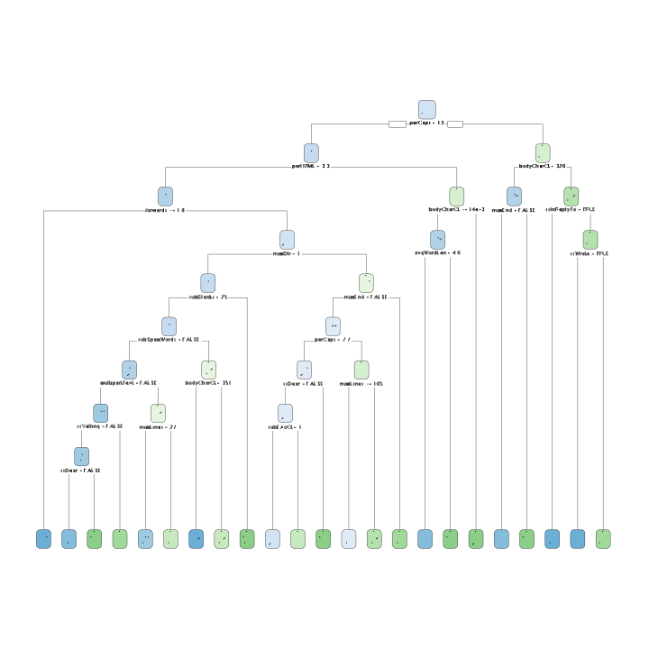
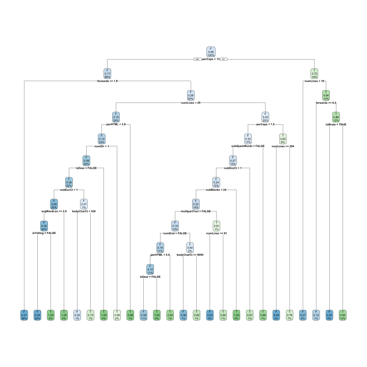

```r
library(rpart)
library(caret)
library(dplyr)
library(rpart.plot)
library(parallel)
library(doParallel)
library(foreach)
library(iterators)
```

# Introduction

Spam email is an ever present annoyance in most of modern day life. This case study is to examine the Spam Assassin dataset (http://spamassassin.apache.org) in which we evaluate 9000 emails with spam filters by classification tree's and recursive partitioning.  To do this, the libararies rpart is utilized and we attempt to improve upon default model classification accuracies by exploring the many parameters available in the rpart.control function.  


we've selected question 19 from the Nolan and Lang book for our analysis and exploration. The question states: 

Consider the other parameters that can be used to control the recursive partitioning process. Read the documentation for them in the rpart.control() documentation. Also, carry out an Internet search for more information on how to tweak the rpart() tuning parameters. Experiment with values for these parameters. Do the trees that result make sense with your understanding of how the parameters are used? Can you improve the prediction using them?

# Background

The spam assassin dataset is contrived of 9000 emails each comprised of a header, message body and attachments.  The first goal is to understand the design of the email structure in order to correctly identify what portion of the email is the header, message body and attachments.  After dropping attachments, the headers and message bodies are processed for characteristics that possibly could mark an email as spam.  Looking for characteristics such as capitolization, punctuation or word counts of known spam words that can be found within.  


```r
# we are starting from here, the code used to create the RDA will be shown
# in the appendix, it seems to run fine on windows but crash on linux so
# this was a good compromise without digging too deeply into the web of
# lapplys

emailDFrp <- read.csv("https://raw.githubusercontent.com/Landcruiser87/7333_QTW/master/CaseStudy6/Data/data.csv")
emailDFrp$X <- NULL
# load(./Data/data.rda)
emails <- emailDFrp

str(emails$isSpam)
```

```
#>  logi [1:9348] FALSE FALSE FALSE FALSE FALSE FALSE ...
```

```r
setupRnum = function(data) {
    logicalVars = which(sapply(data, is.logical))
    facVars = lapply(data[, logicalVars], function(x) {
        x = as.factor(x)
    })
    cbind(facVars, data[, -logicalVars])
}

emails = setupRnum(emails)
emails[is.na(emails)] <- 0

df_process <- emails
levels(df_process$isSpam) <- c("F", "T")
```

# Analysis

To start off the analysis, we've used the methods provided in Nolan and Lang [1] for importing a clean dataset that can be parsed for examples of spam or ham messages and the generated features about each email message.  We're to answer the question of exploring the rpart.control function so we will import the generated dataset from the starter RMD that was provided by Dr. Slater.  See the appendix for the code that contains all processing functions and setup of the data.

In order to properly quantify the decision tree's performance we now define the metrics we use to evaluate results.  Since this is a classification problem, our metrics will be accuracy, precision, recall and F1-Score. Our goal is to minimize the amount of false positives, and false negatives within the resulting confusion matrix's.  


```r
pander::pander(list(Accuracy = "Accuracy is defined as the number of correct predictions divided by the total number of predictions.", 
    list("(True Positive + False Negatives)/Total amount of samples"), Precision = "Precision is defined as the ratio of correctly predicted positives to the total number of predicted positive observations.", 
    list("True Positives/(True Positives + False Positives)"), Recall = "Recall is defined as the ratio of correct positives to all the observations in the class", 
    list("True Positives/(True Positives + False Positives"), `F1-Score` = "F1 score is defined as a weighted average of Precision and Recall. This metric is more useful when you have uneven class balances but it sometimes useful as it includes false postivies and false negatives. ", 
    list("2x(Recall x Precision)/(Recall + Position)")))
```


  * **Accuracy**: Accuracy is defined as the number of correct predictions divided by the total number of predictions.
  *

      * (True Positive + False Negatives)/Total amount of samples

  * **Precision**: Precision is defined as the ratio of correctly predicted positives to the total number of predicted positive observations.
  *

      * True Positives/(True Positives + False Positives)

  * **Recall**: Recall is defined as the ratio of correct positives to all the observations in the class
  *

      * True Positives/(True Positives + False Positives

  * **F1-Score**: F1 score is defined as a weighted average of Precision and Recall. This metric is more useful when you have uneven class balances but it sometimes useful as it includes false postivies and false negatives.
  *

      * 2x(Recall x Precision)/(Recall + Position)


<!-- end of list -->

Our next step is to explore the recursive partitioning algotithm to pass it various parameters that may improve its classification accuracy.  The parameters that we're going to explore are listed below.  


```r
pander::pander(list(`cp-complexity` = "This parameter is meant to improve computing efficiency in order to avoid uncessary splits if there isn't an increase in R-squared value.", 
    minsplit = "Seeing as a tree is the result of the rpart classification.  The minsplit parameter defintes the number of observations necessary in an a parent node in order to quality that branch to be split.  We chose to 3:1 ratio of minsplit to minbucket.", 
    minbucket = "This parameter controls the lowest number of observations that can exist in an end/terminal node.", 
    maxdepth = "This parameter defines how deep a final tree can be built by limiting the amount of levels of nodes that can be created.  The help files suggest not going too deep in a tree as it will result in overfitting.  Therefore we won't build a tree greater than 30 levels."))
```


  * **cp-complexity**: This parameter is meant to improve computing efficiency in order to avoid uncessary splits if there isn't an increase in R-squared value.
  * **minsplit**: Seeing as a tree is the result of the rpart classification.  The minsplit parameter defintes the number of observations necessary in an a parent node in order to quality that branch to be split.  We chose to 3:1 ratio of minsplit to minbucket.
  * **minbucket**: This parameter controls the lowest number of observations that can exist in an end/terminal node.
  * **maxdepth**: This parameter defines how deep a final tree can be built by limiting the amount of levels of nodes that can be created.  The help files suggest not going too deep in a tree as it will result in overfitting.  Therefore we won't build a tree greater than 30 levels.

<!-- end of list -->


Now that we've defined some of the available rpart.control functions, its time to start buiding decision tree's.  To start, we'll show what the decision tree output looks like with the default values for rpart.  Afterwords, we expand the parameters to a gridsearch of the available configurations in order to improve the models accuracy and classification.  


## Default parameters decision tree


```r
set.seed(54)
# Get a count for spam and ham
is_Spam_ct <- table(df_process$isSpam)["T"]
is_Ham_ct <- table(df_process$isSpam)["F"]

# Sample the indexes note createdatapartition is stratified
train_idx <- createDataPartition(df_process$isSpam, p = 0.66, list = F)
spam_train <- df_process[train_idx, ]
spam_test <- df_process[-train_idx, ]


# Fitting the regression tree.
rpart_fit = rpart(isSpam ~ ., data = spam_train, minsplit = 2, method = "class")
# Plot it with either prp or rpart.plot prp(rpart_fit, extra = 106)
rpart.plot(rpart_fit)
```


```r
# Now lets make some predictions.  We'll predict on the df_test_rpart, with
# the fit we just achieved directly above.
rp_predict <- predict(rpart_fit, newdata = spam_test, type = "class")

confusion_mat <- function(preds, truth) {
    return(table(preds, truth))
}
accuracy <- function(preds, truth = spam_test$isSpam) {
    cm <- confusion_mat(preds, truth)
    sum(diag(cm))/sum(cm)
}
precision <- function(preds, truth = spam_test$isSpam) {
    cm <- confusion_mat(preds, truth)
    diag(cm)/colSums(cm)
}
recall <- function(preds, truth = spam_test$isSpam) {
    cm <- confusion_mat(preds, truth)
    diag(cm)/rowSums(cm)
}
f1 <- function(preds, truth = spam_test$isSpam, positive.class = "T") {
    precision <- precision(preds, truth)
    recall <- recall(preds, truth)
    f1 <- ifelse(precision + recall == 0, 0, 2 * precision * recall/(precision + 
        recall))
    # Assuming that F1 is zero when it's not possible compute it
    f1[is.na(f1)] <- 0
    # Binary F1 or Multi-class macro-averaged F1
    ifelse(nlevels(truth) == 2, f1[positive.class], mean(f1))
}
metrics <- list(accuracy = accuracy, precision = precision, recall = recall, 
    f1_score = f1)
get_metrics <- function(preds, truth = spam_test$isSpam) {
    unlist(lapply(metrics, function(f) f(preds)))
}

get_depth <- function(fit) {
    nodes <- as.numeric(rownames(fit$frame))
    max(rpart:::tree.depth(nodes))
}

get_leaves <- function(fit) {
    sum(fit$frame$var == "<leaf>")
}

make_metric_frame <- function(fit, pred) {
    out = c(leaves = get_leaves(fit), depth = get_depth(fit), get_metrics(pred))
    return(data.frame(t(out)))
}

result_0 <- make_metric_frame(rpart_fit, rp_predict)
result_0
```

<div data-pagedtable="false">
  <script data-pagedtable-source type="application/json">
{"columns":[{"label":["leaves"],"name":[1],"type":["dbl"],"align":["right"]},{"label":["depth"],"name":[2],"type":["dbl"],"align":["right"]},{"label":["accuracy"],"name":[3],"type":["dbl"],"align":["right"]},{"label":["precision.F"],"name":[4],"type":["dbl"],"align":["right"]},{"label":["precision.T"],"name":[5],"type":["dbl"],"align":["right"]},{"label":["recall.F"],"name":[6],"type":["dbl"],"align":["right"]},{"label":["recall.T"],"name":[7],"type":["dbl"],"align":["right"]},{"label":["f1_score"],"name":[8],"type":["dbl"],"align":["right"]}],"data":[{"1":"17","2":"9","3":"0.92","4":"0.96","5":"0.79","6":"0.93","7":"0.87","8":"0.83"}],"options":{"columns":{"min":{},"max":[10]},"rows":{"min":[10],"max":[10]},"pages":{}}}
  </script>
</div>


```r
# #Setting up parameters for the rpart.control gridsearch cp <-
# c(cp=c(0.00001,.0001,.005,.001)) max_depth <- c(max_depth =
# round(seq(3,30,length=10),0)) min_split <- c(min_split = round(seq(2, 100,
# length=30),0) + (round(seq(2, 100, length=30),0)%%2)) min_bucket
# <-c(min_split/2) params <- expand.grid(cp=cp, max_depth=max_depth,
# min_split=min_split, min_bucket=min_bucket) combo_count <- nrow(params)
```

## Tree Exploration


```r
# First Tree combination

rpart_tree1 <- rpart(isSpam ~ ., data = spam_train, na.action = na.rpart, method = "class", 
    control = rpart.control(minsplit = 3, maxdepth = 30, minbucket = 2, cp = 0.01))

rpart.plot(rpart_tree1)
```


```r
rp_predict1 <- predict(rpart_tree1, newdata = spam_test, type = "class")


result_1 <- make_metric_frame(rpart_tree1, rp_predict1)
result_1
```

<div data-pagedtable="false">
  <script data-pagedtable-source type="application/json">
{"columns":[{"label":["leaves"],"name":[1],"type":["dbl"],"align":["right"]},{"label":["depth"],"name":[2],"type":["dbl"],"align":["right"]},{"label":["accuracy"],"name":[3],"type":["dbl"],"align":["right"]},{"label":["precision.F"],"name":[4],"type":["dbl"],"align":["right"]},{"label":["precision.T"],"name":[5],"type":["dbl"],"align":["right"]},{"label":["recall.F"],"name":[6],"type":["dbl"],"align":["right"]},{"label":["recall.T"],"name":[7],"type":["dbl"],"align":["right"]},{"label":["f1_score"],"name":[8],"type":["dbl"],"align":["right"]}],"data":[{"1":"17","2":"9","3":"0.92","4":"0.96","5":"0.79","6":"0.93","7":"0.87","8":"0.83"}],"options":{"columns":{"min":{},"max":[10]},"rows":{"min":[10],"max":[10]},"pages":{}}}
  </script>
</div>

```r
# result_1 <-
# data.frame(t(c('depth'=get_depth(rpart_tree1),get_metrics(rp_predict1))))
# result_1
```


```r
# 2nd Tree combination
rpart_tree2 <- rpart(isSpam ~ ., data = spam_train, na.action = na.rpart, method = "class", 
    control = rpart.control(minsplit = 3, maxdepth = 2, minbucket = 2, cp = 0.01))

rpart.plot(rpart_tree2)
```


```r
rp_predict2 <- predict(rpart_tree2, newdata = spam_test, type = "class")


# result_2 <-
# data.frame(t(c('depth'=get_depth(rpart_tree2),get_metrics(rp_predict2))))
# result_2
result_2 <- make_metric_frame(rpart_tree2, rp_predict2)
result_2
```

<div data-pagedtable="false">
  <script data-pagedtable-source type="application/json">
{"columns":[{"label":["leaves"],"name":[1],"type":["dbl"],"align":["right"]},{"label":["depth"],"name":[2],"type":["dbl"],"align":["right"]},{"label":["accuracy"],"name":[3],"type":["dbl"],"align":["right"]},{"label":["precision.F"],"name":[4],"type":["dbl"],"align":["right"]},{"label":["precision.T"],"name":[5],"type":["dbl"],"align":["right"]},{"label":["recall.F"],"name":[6],"type":["dbl"],"align":["right"]},{"label":["recall.T"],"name":[7],"type":["dbl"],"align":["right"]},{"label":["f1_score"],"name":[8],"type":["dbl"],"align":["right"]}],"data":[{"1":"4","2":"2","3":"0.85","4":"0.95","5":"0.56","6":"0.86","7":"0.79","8":"0.66"}],"options":{"columns":{"min":{},"max":[10]},"rows":{"min":[10],"max":[10]},"pages":{}}}
  </script>
</div>


```r
# 3rd Tree combination
rpart_tree3 <- rpart(isSpam ~ ., data = spam_train, na.action = na.rpart, method = "class", 
    control = rpart.control(minsplit = 3, maxdepth = 30, minbucket = 2, cp = 0.005))

rpart.plot(rpart_tree3)
```


```r
rp_predict3 <- predict(rpart_tree3, newdata = spam_test, type = "class")


result_3 <- make_metric_frame(rpart_tree3, rp_predict3)
result_3
```

<div data-pagedtable="false">
  <script data-pagedtable-source type="application/json">
{"columns":[{"label":["leaves"],"name":[1],"type":["dbl"],"align":["right"]},{"label":["depth"],"name":[2],"type":["dbl"],"align":["right"]},{"label":["accuracy"],"name":[3],"type":["dbl"],"align":["right"]},{"label":["precision.F"],"name":[4],"type":["dbl"],"align":["right"]},{"label":["precision.T"],"name":[5],"type":["dbl"],"align":["right"]},{"label":["recall.F"],"name":[6],"type":["dbl"],"align":["right"]},{"label":["recall.T"],"name":[7],"type":["dbl"],"align":["right"]},{"label":["f1_score"],"name":[8],"type":["dbl"],"align":["right"]}],"data":[{"1":"23","2":"9","3":"0.93","4":"0.97","5":"0.81","6":"0.94","7":"0.89","8":"0.85"}],"options":{"columns":{"min":{},"max":[10]},"rows":{"min":[10],"max":[10]},"pages":{}}}
  </script>
</div>


```r
# 4rd Tree combination
rpart_tree4 <- rpart(isSpam ~ ., data = spam_train, na.action = na.rpart, method = "class", 
    control = rpart.control(minsplit = 3, maxdepth = 2, minbucket = 2, cp = 0.005))

rpart.plot(rpart_tree4)
```



```r
rp_predict4 <- predict(rpart_tree4, newdata = spam_test, type = "class")


result_4 <- make_metric_frame(rpart_tree4, rp_predict4)
result_4
```

<div data-pagedtable="false">
  <script data-pagedtable-source type="application/json">
{"columns":[{"label":["leaves"],"name":[1],"type":["dbl"],"align":["right"]},{"label":["depth"],"name":[2],"type":["dbl"],"align":["right"]},{"label":["accuracy"],"name":[3],"type":["dbl"],"align":["right"]},{"label":["precision.F"],"name":[4],"type":["dbl"],"align":["right"]},{"label":["precision.T"],"name":[5],"type":["dbl"],"align":["right"]},{"label":["recall.F"],"name":[6],"type":["dbl"],"align":["right"]},{"label":["recall.T"],"name":[7],"type":["dbl"],"align":["right"]},{"label":["f1_score"],"name":[8],"type":["dbl"],"align":["right"]}],"data":[{"1":"4","2":"2","3":"0.85","4":"0.95","5":"0.56","6":"0.86","7":"0.79","8":"0.66"}],"options":{"columns":{"min":{},"max":[10]},"rows":{"min":[10],"max":[10]},"pages":{}}}
  </script>
</div>


```r
# 4rd Tree combination
rpart_tree5 <- rpart(isSpam ~ ., data = spam_train, na.action = na.rpart, method = "class", 
    control = rpart.control(minsplit = 1, maxdepth = 30, minbucket = 1, cp = 1e-07))

rpart.plot(rpart_tree5)
```



```r
rp_predict5 <- predict(rpart_tree5, newdata = spam_test, type = "class")

result_5 <- make_metric_frame(rpart_tree5, rp_predict5)
result_5
```

<div data-pagedtable="false">
  <script data-pagedtable-source type="application/json">
{"columns":[{"label":["leaves"],"name":[1],"type":["dbl"],"align":["right"]},{"label":["depth"],"name":[2],"type":["dbl"],"align":["right"]},{"label":["accuracy"],"name":[3],"type":["dbl"],"align":["right"]},{"label":["precision.F"],"name":[4],"type":["dbl"],"align":["right"]},{"label":["precision.T"],"name":[5],"type":["dbl"],"align":["right"]},{"label":["recall.F"],"name":[6],"type":["dbl"],"align":["right"]},{"label":["recall.T"],"name":[7],"type":["dbl"],"align":["right"]},{"label":["f1_score"],"name":[8],"type":["dbl"],"align":["right"]}],"data":[{"1":"265","2":"30","3":"0.96","4":"0.98","5":"0.91","6":"0.97","7":"0.93","8":"0.92"}],"options":{"columns":{"min":{},"max":[10]},"rows":{"min":[10],"max":[10]},"pages":{}}}
  </script>
</div>


Minsplit vs ntrees and accuracy/related metrics

## Ratio of minsplit and minbuxkets
normally its 3:1, see what happens

## Complexity and interaction with minsplit

### Lots o trees

### Few o trees

## Maxdepth

### Deep and wide

### Deep and narrow

### Short and wide

### Short and narrow

## Surragets
maybe
##xval
maybe

# Conclusion

Use cases for interesitng chouces

## References
[1] D. Lang and D. Nolan, Data Science in R: A Case Studies Approach to Computation Reasoning and Problem Solving. New York, New York: CRC Press. 

