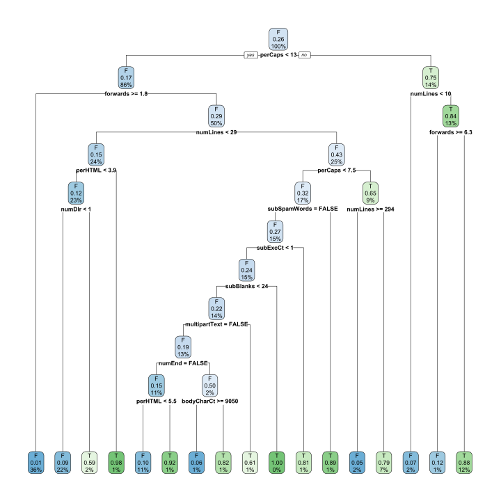

```r
library(rpart)
library(caret)
library(dplyr)
library(rpart.plot)
library(parallel)
library(doParallel)
library(foreach)
library(iterators)

counter <- function() {
  x <- 0
  return (
          function() {
            x <<- x+1
            return(x)
          }

  )
}

cnt <- counter()

cap <- function(str) {
  paste("**Figure", cnt(), ":**",str)
}
```

# Introduction

Spam email is an ever present annoyance in most of modern day life. This case study is to examine the Spam Assassin dataset (http://spamassassin.apache.org) in which we evaluate 9000 emails with spam filters by classification tree's and recursive partitioning.  To do this, the library `rpart` is utilized and we attempt to improve upon default model classification accuracies by exploring the many parameters available in the rpart.control function.  

We've selected question 19 from the Nolan and Lang book for our analysis and exploration. The question states: 

Consider the other parameters that can be used to control the recursive partitioning process. Read the documentation for them in the rpart.control() documentation. Also, carry out an Internet search for more information on how to tweak the rpart() tuning parameters. Experiment with values for these parameters. Do the trees that result make sense with your understanding of how the parameters are used? Can you improve the prediction using them?

Thus, we will determine how the complexity (meaning depth and number of leaves) of a recursive partitioning tree affects the performance of the model, using various metrics.

# Background

The spam assassin dataset is contrived of 9000 emails each comprised of a header, message body and attachments.  The first goal is to understand the design of the email structure in order to correctly identify what portion of the email is the header, message body and attachments.  After dropping attachments, the headers and message bodies are processed for characteristics that possibly could mark an email as spam.  Looking for characteristics such as capitalization, punctuation or word counts of known spam words that can be found within.  


```r
# we are starting from here, the code used to create the RDA will be shown
# in the appendix, it seems to run fine on windows but crash on linux so
# this was a good compromise without digging too deeply into the web of
# lapplys

emailDFrp <- read.csv("https://raw.githubusercontent.com/Landcruiser87/7333_QTW/master/CaseStudy6/Data/data.csv")
emailDFrp$X <- NULL
# load(./Data/data.rda)
emails <- emailDFrp

# str(emails$isSpam)

setupRnum = function(data) {
    logicalVars = which(sapply(data, is.logical))
    facVars = lapply(data[, logicalVars], function(x) {
        x = as.factor(x)
    })
    cbind(facVars, data[, -logicalVars])
}

emails = setupRnum(emails)
emails[is.na(emails)] <- 0

df_process <- emails
levels(df_process$isSpam) <- c("F", "T")
```

# Analysis

To start off the analysis, we've used the methods provided in Nolan and Lang [1] for importing a clean dataset that can be parsed for examples of spam or ham messages and the generated features about each email message.  We're to answer the question of exploring the rpart.control function so we will import the generated dataset from the starter code that was provided by Dr. Slater.  See the appendix for the code that contains all processing functions and setup of the data.

In order to properly quantify the decision tree's performance we now define the metrics we use to evaluate results.  Since this is a classification problem, our metrics will be accuracy, precision, recall and F1-Score. Our goal is to minimize the amount of false positives, and false negatives within the resulting confusion matrix's.  


```r
pander::pander(list(Accuracy = "Accuracy is defined as the number of correct predictions divided by the total number of predictions.", 
    list("(True Positive + False Negatives)/Total amount of samples"), Precision = "Precision is defined as the ratio of correctly predicted positives to the total number of predicted positive observations.", 
    list("True Positives/(True Positives + False Positives)"), Recall = "Recall is defined as the ratio of correct positives to all the observations in the class", 
    list("True Positives/(True Positives + False Positives"), `F1-Score` = "F1 score is defined as the harmonic average of Precision and Recall. This metric is more useful when you have uneven class balances but it sometimes useful as it includes false postivies and false negatives. ", 
    list("2x(Recall x Precision)/(Recall + Position)")))
```


  * **Accuracy**: Accuracy is defined as the number of correct predictions divided by the total number of predictions.
  *

      * (True Positive + False Negatives)/Total amount of samples

  * **Precision**: Precision is defined as the ratio of correctly predicted positives to the total number of predicted positive observations.
  *

      * True Positives/(True Positives + False Positives)

  * **Recall**: Recall is defined as the ratio of correct positives to all the observations in the class
  *

      * True Positives/(True Positives + False Positives

  * **F1-Score**: F1 score is defined as the harmonic average of Precision and Recall. This metric is more useful when you have uneven class balances but it sometimes useful as it includes false postivies and false negatives.
  *

      * 2x(Recall x Precision)/(Recall + Position)


<!-- end of list -->

Our next step is to explore the recursive partitioning algorithm to pass it various parameters that may improve its classification accuracy.  The parameters that we're going to explore are listed below.  


```r
pander::pander(list(`cp-complexity` = "This parameter is meant to improve computing efficiency in order to avoid uncessary splits if there isn't an increase in R-squared value.", 
    minsplit = "Seeing as a tree is the result of the rpart classification.  The minsplit parameter defintes the number of observations necessary in an a parent node in order to quality that branch to be split.  We chose to 3:1 ratio of minsplit to minbucket.", 
    minbucket = "This parameter controls the lowest number of observations that can exist in an end/terminal node.", 
    maxdepth = "This parameter defines how deep a final tree can be built by limiting the amount of levels of nodes that can be created.  The help files suggest not going too deep in a tree as it will result in overfitting.  Therefore we won't build a tree greater than 30 levels."))
```


  * **cp-complexity**: This parameter is meant to improve computing efficiency in order to avoid uncessary splits if there isn't an increase in R-squared value.
  * **minsplit**: Seeing as a tree is the result of the rpart classification.  The minsplit parameter defintes the number of observations necessary in an a parent node in order to quality that branch to be split.  We chose to 3:1 ratio of minsplit to minbucket.
  * **minbucket**: This parameter controls the lowest number of observations that can exist in an end/terminal node.
  * **maxdepth**: This parameter defines how deep a final tree can be built by limiting the amount of levels of nodes that can be created.  The help files suggest not going too deep in a tree as it will result in overfitting.  Therefore we won't build a tree greater than 30 levels.

<!-- end of list -->

Now that we've defined some of the available rpart.control functions, its time to start building decision tree's.  To start, we'll show what the decision tree output looks like with the default values for rpart.  Afterwords, we move the values to build extreme cases of the tree size, from very shallow to massive. We use these extremities to infer the relationship between tree size and model performance (as the relationship between parameters and tree size is at this point well known).


## Default parameters decision tree

First, we split the data into stratified train and test samples, using the caret `createDataPartition` function. To see the code, simply click the code button on the right!


```r
set.seed(54)
# Get a count for spam and ham
is_Spam_ct <- table(df_process$isSpam)["T"]
# T 2397
is_Ham_ct <- table(df_process$isSpam)["F"]
# F 6951

# Sample the indexes note createdatapartition is stratified
train_idx <- createDataPartition(df_process$isSpam, p = 0.66, list = F)
spam_train <- df_process[train_idx, ]
spam_test <- df_process[-train_idx, ]
```

Next, lets fit and plot a standard decision tree. This tree uses a minsplit of 2, and everything else is set to the default value.


```r
# Fitting the regression tree.
rpart_fit = rpart(isSpam ~ ., data = spam_train, minsplit = 2, method = "class")
# Plot it with either prp or rpart.plot prp(rpart_fit, extra = 106)
rpart.plot(rpart_fit)
```

<div class="figure" style="text-align: center">

<p class="caption">**Figure 2 :** Figure :A standard decision tree</p>
</div>

As a baseline, lets also check how this tree performs. We will use Accuracy, Precision, Recall, and F1 Score(using spam or "T" as the positive class). Given a confusion matrix of predictions vs truth, $M$, we can get these values in the following manner:

\begin{align}
\mathrm{acc} = \left(\mathop{\sum_{j}\sum_{i}}_{i=j} M\right) / \left(\mathop{\sum_{j}\sum_{i}} M\right)\\
\mathrm{precision} = \mathrm{diag}(M) / \left(\mathop{\sum_{j}} M\right)\\
\mathrm{recall} = \mathrm{diag}(M) / \left(\mathop{\sum_{i}} M\right)\\
\mathrm{f1} = \frac{2(\mathrm{precision})(\mathrm{recall})}{\mathrm{precision} + \mathrm{recall}}
\end{align}

We also count the number of leaves and the depth of a tree. Lets see how this tree did:


```r
# Now lets make some predictions.  We'll predict on the df_test_rpart, with
# the fit we just achieved directly above.
rp_predict <- predict(rpart_fit, newdata = spam_test, type = "class")

confusion_mat <- function(preds, truth) {
    return(table(preds, truth))
}
accuracy <- function(preds, truth = spam_test$isSpam) {
    cm <- confusion_mat(preds, truth)
    sum(diag(cm))/sum(cm)
}
precision <- function(preds, truth = spam_test$isSpam) {
    cm <- confusion_mat(preds, truth)
    diag(cm)/colSums(cm)
}
recall <- function(preds, truth = spam_test$isSpam) {
    cm <- confusion_mat(preds, truth)
    diag(cm)/rowSums(cm)
}
f1 <- function(preds, truth = spam_test$isSpam, positive.class = "T") {
    precision <- precision(preds, truth)
    recall <- recall(preds, truth)
    f1 <- ifelse(precision + recall == 0, 0, 2 * precision * recall/(precision + 
        recall))
    # Assuming that F1 is zero when it's not possible compute it
    f1[is.na(f1)] <- 0
    # Binary F1 or Multi-class macro-averaged F1
    ifelse(nlevels(truth) == 2, f1[positive.class], mean(f1))
}
metrics <- list(accuracy = accuracy, precision = precision, recall = recall, 
    f1_score = f1)
get_metrics <- function(preds, truth = spam_test$isSpam) {
    unlist(lapply(metrics, function(f) f(preds)))
}

get_depth <- function(fit) {
    nodes <- as.numeric(rownames(fit$frame))
    max(rpart:::tree.depth(nodes))
}

get_leaves <- function(fit) {
    sum(fit$frame$var == "<leaf>")
}

make_metric_frame <- function(fit, pred) {
    out = c(leaves = get_leaves(fit), depth = get_depth(fit), get_metrics(pred))
    return(data.frame(t(out)))
}

result_0 <- make_metric_frame(rpart_fit, rp_predict)
result_0
```

<div data-pagedtable="false">
  <script data-pagedtable-source type="application/json">
{"columns":[{"label":["leaves"],"name":[1],"type":["dbl"],"align":["right"]},{"label":["depth"],"name":[2],"type":["dbl"],"align":["right"]},{"label":["accuracy"],"name":[3],"type":["dbl"],"align":["right"]},{"label":["precision.F"],"name":[4],"type":["dbl"],"align":["right"]},{"label":["precision.T"],"name":[5],"type":["dbl"],"align":["right"]},{"label":["recall.F"],"name":[6],"type":["dbl"],"align":["right"]},{"label":["recall.T"],"name":[7],"type":["dbl"],"align":["right"]},{"label":["f1_score"],"name":[8],"type":["dbl"],"align":["right"]}],"data":[{"1":"17","2":"9","3":"0.92","4":"0.96","5":"0.79","6":"0.93","7":"0.87","8":"0.83"}],"options":{"columns":{"min":{},"max":[10]},"rows":{"min":[10],"max":[10]},"pages":{}}}
  </script>
</div>

A moderately strong baseline. Lets now fiddle with the tree structure a bit and see what happens.


## Tree Exploration


### Small, Shallow Tree

We expect this to perform significantly worse than the moderately sized tree observed in the previous section. First, lets build the tree. We use a minsplit of 3, cp of 0.01, and minbucket of 2, however all these are really overridden by the maxdepth of 2.

```r
# 2nd Tree combination
rpart_tree2 <- rpart(isSpam ~ ., data = spam_train, na.action = na.rpart, method = "class", 
    control = rpart.control(minsplit = 3, maxdepth = 2, minbucket = 2, cp = 0.01))

rpart.plot(rpart_tree2)
```

<div class="figure" style="text-align: center">

<p class="caption">**Figure 3 :** A small, short tree</p>
</div>

This tree is very small, similar to those used in boosting algorithms (closer to a stump than a tree). It will likely not have very strong predictive power. Lets see!

```r
rp_predict2 <- predict(rpart_tree2, newdata = spam_test, type = "class")


# result_2 <-
# data.frame(t(c('depth'=get_depth(rpart_tree2),get_metrics(rp_predict2))))
# result_2
result_2 <- make_metric_frame(rpart_tree2, rp_predict2)
result_2
```

<div data-pagedtable="false">
  <script data-pagedtable-source type="application/json">
{"columns":[{"label":["leaves"],"name":[1],"type":["dbl"],"align":["right"]},{"label":["depth"],"name":[2],"type":["dbl"],"align":["right"]},{"label":["accuracy"],"name":[3],"type":["dbl"],"align":["right"]},{"label":["precision.F"],"name":[4],"type":["dbl"],"align":["right"]},{"label":["precision.T"],"name":[5],"type":["dbl"],"align":["right"]},{"label":["recall.F"],"name":[6],"type":["dbl"],"align":["right"]},{"label":["recall.T"],"name":[7],"type":["dbl"],"align":["right"]},{"label":["f1_score"],"name":[8],"type":["dbl"],"align":["right"]}],"data":[{"1":"4","2":"2","3":"0.85","4":"0.95","5":"0.56","6":"0.86","7":"0.79","8":"0.66"}],"options":{"columns":{"min":{},"max":[10]},"rows":{"min":[10],"max":[10]},"pages":{}}}
  </script>
</div>

Across the board, the small tree performed worse than the reasonably sized tree discussed earlier. It did an especially bad job in the case of the minority class (spam or "T"), with a precision just over 0.56. That means only about 50% of the time the model predicted an email was spam, it was correct. Lets now try a slightly larger tree.

### Moderately Large Tree

We expect this tree to perform better than the all the previous trees. We no longer hinder the tree by depth, setting maxdepth to 30 (the maximum value for the rpart function), a minimum split of 3 samples, a minimum bucket size of 2, and a complexity parameter of 0.005. Lets first check the tree out.


```r
# 3rd Tree combination
rpart_tree3 <- rpart(isSpam ~ ., data = spam_train, na.action = na.rpart, method = "class", 
    control = rpart.control(minsplit = 3, maxdepth = 30, minbucket = 2, cp = 0.005))

rpart.plot(rpart_tree3)
```

<div class="figure" style="text-align: center">

<p class="caption">**Figure 4 :** A moderately large tree</p>
</div>

Lets also check out how this model did. Since it is slightly bigger than the first tree, it should perform slightly better, but by how much is the question.


```r
rp_predict3 <- predict(rpart_tree3, newdata = spam_test, type = "class")


result_3 <- make_metric_frame(rpart_tree3, rp_predict3)
result_3
```

<div data-pagedtable="false">
  <script data-pagedtable-source type="application/json">
{"columns":[{"label":["leaves"],"name":[1],"type":["dbl"],"align":["right"]},{"label":["depth"],"name":[2],"type":["dbl"],"align":["right"]},{"label":["accuracy"],"name":[3],"type":["dbl"],"align":["right"]},{"label":["precision.F"],"name":[4],"type":["dbl"],"align":["right"]},{"label":["precision.T"],"name":[5],"type":["dbl"],"align":["right"]},{"label":["recall.F"],"name":[6],"type":["dbl"],"align":["right"]},{"label":["recall.T"],"name":[7],"type":["dbl"],"align":["right"]},{"label":["f1_score"],"name":[8],"type":["dbl"],"align":["right"]}],"data":[{"1":"23","2":"9","3":"0.93","4":"0.97","5":"0.81","6":"0.94","7":"0.89","8":"0.85"}],"options":{"columns":{"min":{},"max":[10]},"rows":{"min":[10],"max":[10]},"pages":{}}}
  </script>
</div>

As expected, the slightly larger tree performed slightly better across the board. 

### Extremely Large Tree

We will now expand our analysis, and attempt to construct the largest tree possible. We use a minsplit of 1 sample, a minbucket of 1, a maximum depth of 30, and a complexity parameter of $1*10^{-7}$. This tree should perform very well, however it is doubtful it will generalize to new data, as it is likely overfit to our data.


```r
# 4rd Tree combination
rpart_tree5 <- rpart(isSpam ~ ., data = spam_train, na.action = na.rpart, method = "class", 
    control = rpart.control(minsplit = 1, maxdepth = 30, minbucket = 1, cp = 1e-07))

rpart.plot(rpart_tree5)
```

<div class="figure" style="text-align: center">

<p class="caption">**Figure 5 :** A massive tree!</p>
</div>

This is a massive, likely overfit  tree, typical of what you would see in a random forest. Lets see how much better it did than the previous iterations.


```r
rp_predict5 <- predict(rpart_tree5, newdata = spam_test, type = "class")

result_5 <- make_metric_frame(rpart_tree5, rp_predict5)
result_5
```

<div data-pagedtable="false">
  <script data-pagedtable-source type="application/json">
{"columns":[{"label":["leaves"],"name":[1],"type":["dbl"],"align":["right"]},{"label":["depth"],"name":[2],"type":["dbl"],"align":["right"]},{"label":["accuracy"],"name":[3],"type":["dbl"],"align":["right"]},{"label":["precision.F"],"name":[4],"type":["dbl"],"align":["right"]},{"label":["precision.T"],"name":[5],"type":["dbl"],"align":["right"]},{"label":["recall.F"],"name":[6],"type":["dbl"],"align":["right"]},{"label":["recall.T"],"name":[7],"type":["dbl"],"align":["right"]},{"label":["f1_score"],"name":[8],"type":["dbl"],"align":["right"]}],"data":[{"1":"265","2":"30","3":"0.96","4":"0.98","5":"0.91","6":"0.97","7":"0.93","8":"0.92"}],"options":{"columns":{"min":{},"max":[10]},"rows":{"min":[10],"max":[10]},"pages":{}}}
  </script>
</div>

This tree clearly outperformed the rest, with very high scores across the board. However, I would be wary of using it in production on new data, given the naturally high bias of large decision trees. It would be best to combine a large ensemble of these in a random forest.

# Conclusion

Lets first look at all of the model metrics on top of each other, so we can easily compare models in a single paragraph:


```r
rbind(default = result_0, small = result_2, large = result_3, giant = result_5)
```

<div data-pagedtable="false">
  <script data-pagedtable-source type="application/json">
{"columns":[{"label":[""],"name":["_rn_"],"type":[""],"align":["left"]},{"label":["leaves"],"name":[1],"type":["dbl"],"align":["right"]},{"label":["depth"],"name":[2],"type":["dbl"],"align":["right"]},{"label":["accuracy"],"name":[3],"type":["dbl"],"align":["right"]},{"label":["precision.F"],"name":[4],"type":["dbl"],"align":["right"]},{"label":["precision.T"],"name":[5],"type":["dbl"],"align":["right"]},{"label":["recall.F"],"name":[6],"type":["dbl"],"align":["right"]},{"label":["recall.T"],"name":[7],"type":["dbl"],"align":["right"]},{"label":["f1_score"],"name":[8],"type":["dbl"],"align":["right"]}],"data":[{"1":"17","2":"9","3":"0.92","4":"0.96","5":"0.79","6":"0.93","7":"0.87","8":"0.83","_rn_":"default"},{"1":"4","2":"2","3":"0.85","4":"0.95","5":"0.56","6":"0.86","7":"0.79","8":"0.66","_rn_":"small"},{"1":"23","2":"9","3":"0.93","4":"0.97","5":"0.81","6":"0.94","7":"0.89","8":"0.85","_rn_":"large"},{"1":"265","2":"30","3":"0.96","4":"0.98","5":"0.91","6":"0.97","7":"0.93","8":"0.92","_rn_":"giant"}],"options":{"columns":{"min":{},"max":[10]},"rows":{"min":[10],"max":[10]},"pages":{}}}
  </script>
</div>

The area most strongly affected by tree size it seems is the precision of the minority class. This intuitively makes sense, as a small tree does not look at the data at a very granular level; it will not detect the subtle patterns of the minority class. A larger tree however will be easily able to see and find rules which allow it to properly fit the minority class. The results of this study overall are not too interesting theoretically, it is well known that small trees are "weak predictors" and large trees are strong (often overfit) predictors.


## References
[1] D. Lang and D. Nolan, Data Science in R: A Case Studies Approach to Computation Reasoning and Problem Solving. New York, New York: CRC Press. 

