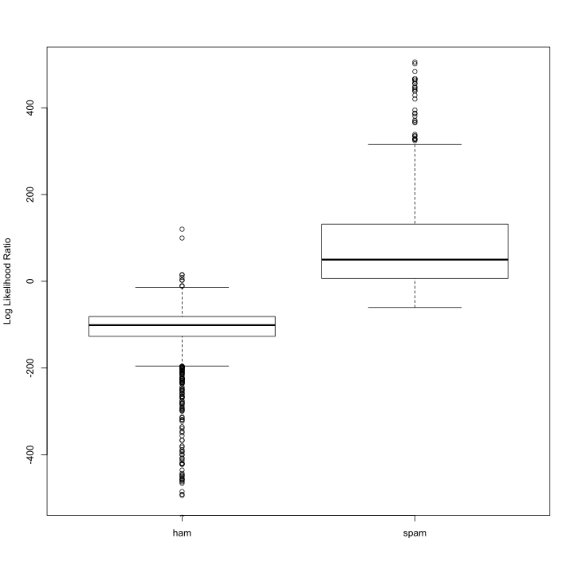
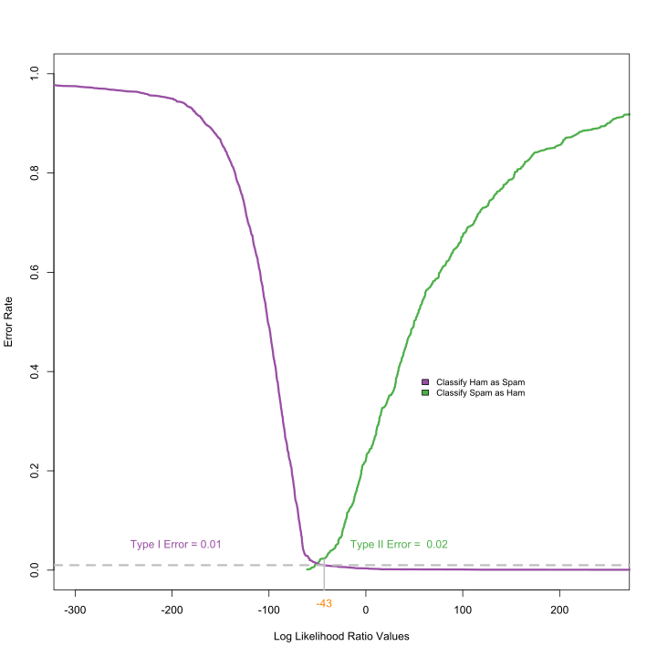
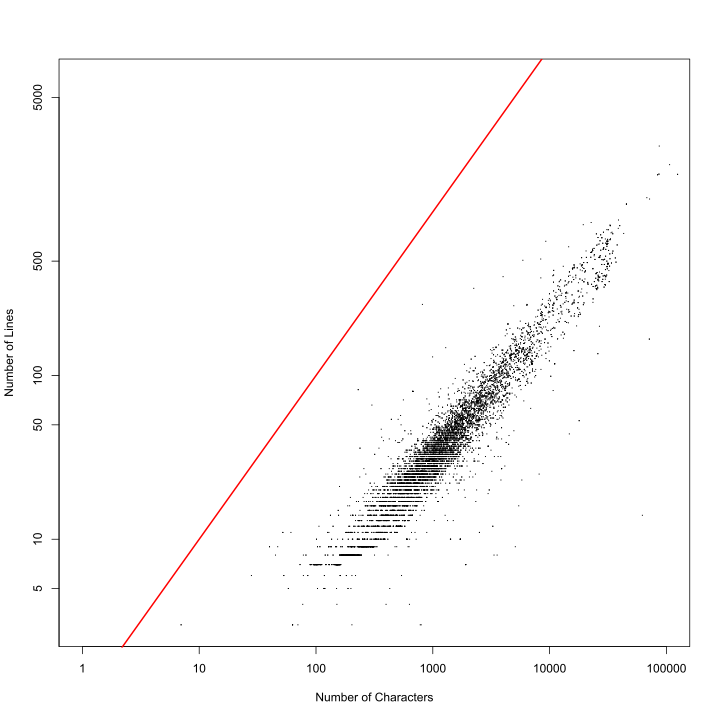
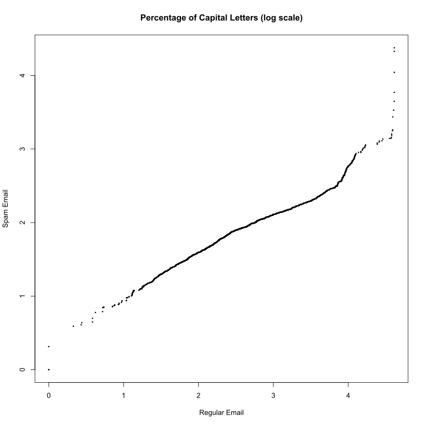
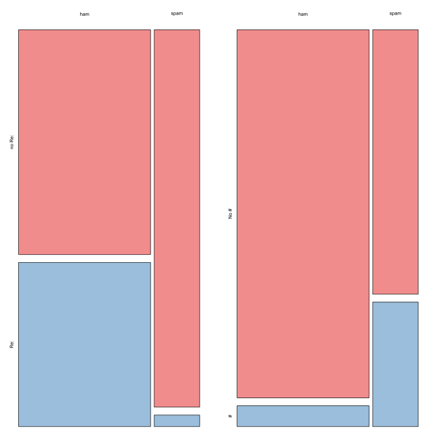
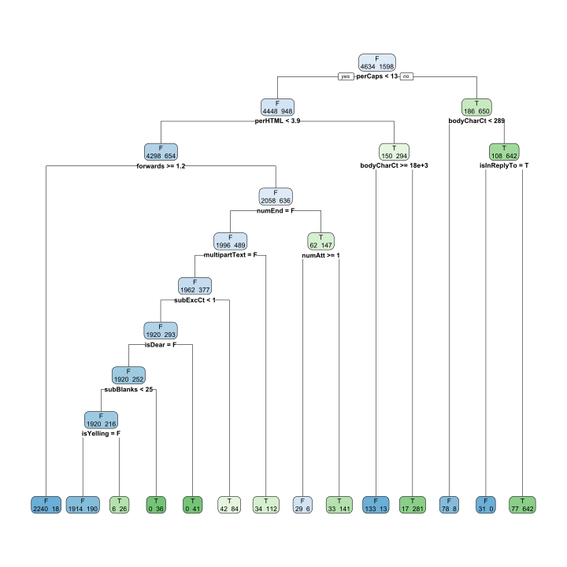
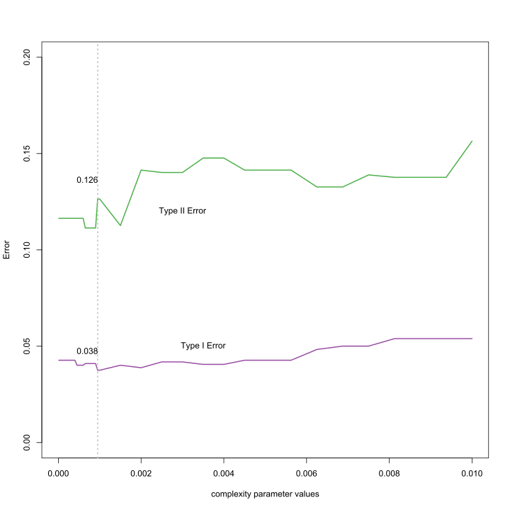

```r
# spamPath = system.file(package = 'RSpamData') spamPath =
# '/Users/nolan/RPackages/RSpamData'spamPath = '.'
spamPath = "../Data/spam/"
# list.dirs(spamPath, full.names = FALSE)
```


```r
list.files(path = paste(spamPath, "messages", sep = .Platform$file.sep))
```

```
#> [1] "easy_ham"   "easy_ham_2" "hard_ham"   "spam"       "spam_2"
```


```r
f = list.files(path = paste(spamPath, "messages/spam", sep = .Platform$file.sep))
length(f)
```

```
#> [1] 1001
```


```r
head(list.files(path = paste(spamPath, "messages", "spam_2", sep = .Platform$file.sep)))
```

```
#> [1] "00001.317e78fa8ee2f54cd4890fdc09ba8176"
#> [2] "00002.9438920e9a55591b18e60d1ed37d992b"
#> [3] "00003.590eff932f8704d8b0fcbe69d023b54d"
#> [4] "00004.bdcc075fa4beb5157b5dd6cd41d8887b"
#> [5] "00005.ed0aba4d386c5e62bc737cf3f0ed9589"
#> [6] "00006.3ca1f399ccda5d897fecb8c57669a283"
```

```r
dirNames = list.files(path = paste(spamPath, "messages", sep = .Platform$file.sep))
length(list.files(paste(spamPath, "messages", dirNames, sep = .Platform$file.sep)))
```

```
#> [1] 9353
```

```r
sapply(paste(spamPath, "messages", dirNames, sep = .Platform$file.sep), function(dir) length(list.files(dir)))
```

```
#>   ../Data/spam//messages/easy_ham ../Data/spam//messages/easy_ham_2 
#>                              5052                              1401 
#>   ../Data/spam//messages/hard_ham       ../Data/spam//messages/spam 
#>                               501                              1001 
#>     ../Data/spam//messages/spam_2 
#>                              1398
```

```r
fullDirNames = paste(spamPath, "messages", dirNames, sep = .Platform$file.sep)
```


```r
fileNames = list.files(fullDirNames[1], full.names = TRUE)
fileNames[1]
```

```
#> [1] "../Data/spam//messages/easy_ham/00001.7c53336b37003a9286aba55d2945844c"
```

```r
msg = readLines(fileNames[1])
head(msg)
```

```
#> [1] "From exmh-workers-admin@redhat.com  Thu Aug 22 12:36:23 2002"     
#> [2] "Return-Path: <exmh-workers-admin@spamassassin.taint.org>"         
#> [3] "Delivered-To: zzzz@localhost.netnoteinc.com"                      
#> [4] "Received: from localhost (localhost [127.0.0.1])"                 
#> [5] "\tby phobos.labs.netnoteinc.com (Postfix) with ESMTP id D03E543C36"
#> [6] "\tfor <zzzz@localhost>; Thu, 22 Aug 2002 07:36:16 -0400 (EDT)"
```

```r
indx = c(1:5, 15, 27, 68, 69, 329, 404, 427, 516, 852, 971)
fn = list.files(fullDirNames[1], full.names = TRUE)[indx]
sampleEmail = sapply(fn, readLines)

msg = sampleEmail[[1]]
which(msg == "")[1]
```

```
#> [1] 63
```

```r
match("", msg)
```

```
#> [1] 63
```

```r
splitPoint = match("", msg)

msg[(splitPoint - 2):(splitPoint + 6)]
```

```
#> [1] "List-Archive: <https://listman.spamassassin.taint.org/mailman/private/exmh-workers/>"
#> [2] "Date: Thu, 22 Aug 2002 18:26:25 +0700"                                               
#> [3] ""                                                                                    
#> [4] "    Date:        Wed, 21 Aug 2002 10:54:46 -0500"                                    
#> [5] "    From:        Chris Garrigues <cwg-dated-1030377287.06fa6d@DeepEddy.Com>"         
#> [6] "    Message-ID:  <1029945287.4797.TMDA@deepeddy.vircio.com>"                         
#> [7] ""                                                                                    
#> [8] ""                                                                                    
#> [9] "  | I can't reproduce this error."
```

```r
header = msg[1:(splitPoint - 1)]
body = msg[-(1:splitPoint)]

splitMessage = function(msg) {
    splitPoint = match("", msg)
    header = msg[1:(splitPoint - 1)]
    body = msg[-(1:splitPoint)]
    return(list(header = header, body = body))
}

sampleSplit = lapply(sampleEmail, splitMessage)
```


```r
header = sampleSplit[[1]]$header
grep("Content-Type", header)
```

```
#> [1] 46
```

```r
grep("multi", tolower(header[46]))
```

```
#> integer(0)
```

```r
header[46]
```

```
#> [1] "Content-Type: text/plain; charset=us-ascii"
```

```r
headerList = lapply(sampleSplit, function(msg) msg$header)
CTloc = sapply(headerList, grep, pattern = "Content-Type")
CTloc
```

```
#> $`../Data/spam//messages/easy_ham/00001.7c53336b37003a9286aba55d2945844c`
#> [1] 46
#> 
#> $`../Data/spam//messages/easy_ham/00002.9c4069e25e1ef370c078db7ee85ff9ac`
#> [1] 45
#> 
#> $`../Data/spam//messages/easy_ham/00003.860e3c3cee1b42ead714c5c874fe25f7`
#> [1] 42
#> 
#> $`../Data/spam//messages/easy_ham/00004.864220c5b6930b209cc287c361c99af1`
#> [1] 30
#> 
#> $`../Data/spam//messages/easy_ham/00005.bf27cdeaf0b8c4647ecd61b1d09da613`
#> [1] 44
#> 
#> $`../Data/spam//messages/easy_ham/00014.cb20e10b2bfcb8210a1c310798532a57`
#> [1] 54
#> 
#> $`../Data/spam//messages/easy_ham/00025.d685245bdc4444f44fa091e6620b20b3`
#> integer(0)
#> 
#> $`../Data/spam//messages/easy_ham/00062.009f5a1a8fa88f0b38299ad01562bb37`
#> [1] 21
#> 
#> $`../Data/spam//messages/easy_ham/00063.0acbc484a73f0e0b727e06c100d8df7b`
#> [1] 17
#> 
#> $`../Data/spam//messages/easy_ham/0030.77828e31de08ebb58b583688b87524cc`
#> [1] 52
#> 
#> $`../Data/spam//messages/easy_ham/00368.f86324a03e7ae7070cc40f302385f5d3`
#> [1] 31
#> 
#> $`../Data/spam//messages/easy_ham/00389.8606961eaeef7b921ce1c53773248d69`
#> [1] 52
#> 
#> $`../Data/spam//messages/easy_ham/0047.5c3e049737a2813d4ac6f13f02362fb1`
#> [1] 52
#> 
#> $`../Data/spam//messages/easy_ham/00775.0e012f373467846510d9db297e99a008`
#> [1] 27
#> 
#> $`../Data/spam//messages/easy_ham/00883.c44a035e7589e83076b7f1fed8fa97d5`
#> [1] 31
```

```r
sapply(headerList, function(header) {
    CTloc = grep("Content-Type", header)
    if (length(CTloc) == 0) 
        return(NA)
    CTloc
})
```

```
#> ../Data/spam//messages/easy_ham/00001.7c53336b37003a9286aba55d2945844c 
#>                                                                     46 
#> ../Data/spam//messages/easy_ham/00002.9c4069e25e1ef370c078db7ee85ff9ac 
#>                                                                     45 
#> ../Data/spam//messages/easy_ham/00003.860e3c3cee1b42ead714c5c874fe25f7 
#>                                                                     42 
#> ../Data/spam//messages/easy_ham/00004.864220c5b6930b209cc287c361c99af1 
#>                                                                     30 
#> ../Data/spam//messages/easy_ham/00005.bf27cdeaf0b8c4647ecd61b1d09da613 
#>                                                                     44 
#> ../Data/spam//messages/easy_ham/00014.cb20e10b2bfcb8210a1c310798532a57 
#>                                                                     54 
#> ../Data/spam//messages/easy_ham/00025.d685245bdc4444f44fa091e6620b20b3 
#>                                                                     NA 
#> ../Data/spam//messages/easy_ham/00062.009f5a1a8fa88f0b38299ad01562bb37 
#>                                                                     21 
#> ../Data/spam//messages/easy_ham/00063.0acbc484a73f0e0b727e06c100d8df7b 
#>                                                                     17 
#>  ../Data/spam//messages/easy_ham/0030.77828e31de08ebb58b583688b87524cc 
#>                                                                     52 
#> ../Data/spam//messages/easy_ham/00368.f86324a03e7ae7070cc40f302385f5d3 
#>                                                                     31 
#> ../Data/spam//messages/easy_ham/00389.8606961eaeef7b921ce1c53773248d69 
#>                                                                     52 
#>  ../Data/spam//messages/easy_ham/0047.5c3e049737a2813d4ac6f13f02362fb1 
#>                                                                     52 
#> ../Data/spam//messages/easy_ham/00775.0e012f373467846510d9db297e99a008 
#>                                                                     27 
#> ../Data/spam//messages/easy_ham/00883.c44a035e7589e83076b7f1fed8fa97d5 
#>                                                                     31
```

```r
hasAttach = sapply(headerList, function(header) {
    CTloc = grep("Content-Type", header)
    if (length(CTloc) == 0) 
        return(FALSE)
    grepl("multi", tolower(header[CTloc]))
})

hasAttach
```

```
#> ../Data/spam//messages/easy_ham/00001.7c53336b37003a9286aba55d2945844c 
#>                                                                  FALSE 
#> ../Data/spam//messages/easy_ham/00002.9c4069e25e1ef370c078db7ee85ff9ac 
#>                                                                  FALSE 
#> ../Data/spam//messages/easy_ham/00003.860e3c3cee1b42ead714c5c874fe25f7 
#>                                                                  FALSE 
#> ../Data/spam//messages/easy_ham/00004.864220c5b6930b209cc287c361c99af1 
#>                                                                  FALSE 
#> ../Data/spam//messages/easy_ham/00005.bf27cdeaf0b8c4647ecd61b1d09da613 
#>                                                                  FALSE 
#> ../Data/spam//messages/easy_ham/00014.cb20e10b2bfcb8210a1c310798532a57 
#>                                                                   TRUE 
#> ../Data/spam//messages/easy_ham/00025.d685245bdc4444f44fa091e6620b20b3 
#>                                                                  FALSE 
#> ../Data/spam//messages/easy_ham/00062.009f5a1a8fa88f0b38299ad01562bb37 
#>                                                                   TRUE 
#> ../Data/spam//messages/easy_ham/00063.0acbc484a73f0e0b727e06c100d8df7b 
#>                                                                   TRUE 
#>  ../Data/spam//messages/easy_ham/0030.77828e31de08ebb58b583688b87524cc 
#>                                                                   TRUE 
#> ../Data/spam//messages/easy_ham/00368.f86324a03e7ae7070cc40f302385f5d3 
#>                                                                   TRUE 
#> ../Data/spam//messages/easy_ham/00389.8606961eaeef7b921ce1c53773248d69 
#>                                                                   TRUE 
#>  ../Data/spam//messages/easy_ham/0047.5c3e049737a2813d4ac6f13f02362fb1 
#>                                                                   TRUE 
#> ../Data/spam//messages/easy_ham/00775.0e012f373467846510d9db297e99a008 
#>                                                                   TRUE 
#> ../Data/spam//messages/easy_ham/00883.c44a035e7589e83076b7f1fed8fa97d5 
#>                                                                   TRUE
```

```r
header = sampleSplit[[6]]$header
boundaryIdx = grep("boundary=", header)
header[boundaryIdx]
```

```
#> [1] "    boundary=\"==_Exmh_-1317289252P\";"
```

```r
sub(".*boundary=\"(.*)\";.*", "\\1", header[boundaryIdx])
```

```
#> [1] "==_Exmh_-1317289252P"
```

```r
header2 = headerList[[9]]
boundaryIdx2 = grep("boundary=", header2)
header2[boundaryIdx2]
```

```
#> [1] "Content-Type: multipart/alternative; boundary=Apple-Mail-2-874629474"
```


```r
sub(".*boundary=\"(.*)\";.*", "\\1", header2[boundaryIdx2])
```

```
#> [1] "Content-Type: multipart/alternative; boundary=Apple-Mail-2-874629474"
```

```r
boundary2 = gsub("\"", "", header2[boundaryIdx2])

sub(".*boundary= *(.*);?.*", "\\1", boundary2)
```

```
#> [1] "Apple-Mail-2-874629474"
```

```r
boundary = gsub("\"", "", header[boundaryIdx])
sub(".*boundary= *(.*);?.*", "\\1", boundary)
```

```
#> [1] "==_Exmh_-1317289252P;"
```

```r
sub(".*boundary= *([^;]*);?.*", "\\1", boundary)
```

```
#> [1] "==_Exmh_-1317289252P"
```

```r
getBoundary = function(header) {
    boundaryIdx = grep("boundary=", header)
    boundary = gsub("\"", "", header[boundaryIdx])
    gsub(".*boundary= *([^;]*);?.*", "\\1", boundary)
}

sampleSplit[[6]]$body
```

```
#>  [1] "--==_Exmh_-1317289252P"                                                           
#>  [2] "Content-Type: text/plain; charset=us-ascii"                                       
#>  [3] ""                                                                                 
#>  [4] "> From:  Chris Garrigues <cwg-exmh@DeepEddy.Com>"                                 
#>  [5] "> Date:  Wed, 21 Aug 2002 10:40:39 -0500"                                         
#>  [6] ">"                                                                                
#>  [7] "> > From:  Chris Garrigues <cwg-exmh@DeepEddy.Com>"                               
#>  [8] "> > Date:  Wed, 21 Aug 2002 10:17:45 -0500"                                       
#>  [9] "> >"                                                                              
#> [10] "> > Ouch...I'll get right on it."                                                 
#> [11] "> > "                                                                             
#> [12] "> > > From:  Robert Elz <kre@munnari.OZ.AU>"                                      
#> [13] "> > > Date:  Wed, 21 Aug 2002 19:30:01 +0700"                                     
#> [14] "> > >"                                                                            
#> [15] "> > > Any chance of having that lengthen instead?   I like all my exmh stuff"     
#> [16] "> > > in nice columns (fits the display better).   That is, I use the detache"    
#> [17] "> d"                                                                              
#> [18] "> > > folder list, one column.   The main exmh window takes up full screen,"      
#> [19] "> > > top to bottom, but less than half the width, etc..."                        
#> [20] "> "                                                                               
#> [21] "> I thought about that.  The first order approximation would be to just add "     
#> [22] "> using pack .... -side top instead of pack ... -side left, however, since their "
#> [23] "> each a different width, it would look funny."                                   
#> [24] ""                                                                                 
#> [25] "I've done this.  It's not as pretty as I think it should be, but it works.  "     
#> [26] "I'm going to leave the cosmetic issues to others.  When I update the "            
#> [27] "documentation, I'll add this to the exmh.TODO file."                              
#> [28] ""                                                                                 
#> [29] "I'm leaving for a 2 1/2 week vacation in a week, so this is the last new "        
#> [30] "functionality I'm going to add for a while.  Also, I now have pretty much "       
#> [31] "everything in there that I want for my own use, so I'm probably pretty much "     
#> [32] "done.  I'll work on bug fixes and documentation before my vacation, and "         
#> [33] "hopefully do nothing more afterwards."                                            
#> [34] ""                                                                                 
#> [35] "Chris"                                                                            
#> [36] ""                                                                                 
#> [37] "-- "                                                                              
#> [38] "Chris Garrigues                 http://www.DeepEddy.Com/~cwg/"                    
#> [39] "virCIO                          http://www.virCIO.Com"                            
#> [40] "716 Congress, Suite 200"                                                          
#> [41] "Austin, TX  78701\t\t+1 512 374 0500"                                               
#> [42] ""                                                                                 
#> [43] "  World War III:  The Wrong-Doers Vs. the Evil-Doers."                            
#> [44] ""                                                                                 
#> [45] ""                                                                                 
#> [46] ""                                                                                 
#> [47] ""                                                                                 
#> [48] "--==_Exmh_-1317289252P"                                                           
#> [49] "Content-Type: application/pgp-signature"                                          
#> [50] ""                                                                                 
#> [51] "-----BEGIN PGP SIGNATURE-----"                                                    
#> [52] "Version: GnuPG v1.0.6 (GNU/Linux)"                                                
#> [53] "Comment: Exmh version 2.2_20000822 06/23/2000"                                    
#> [54] ""                                                                                 
#> [55] "iD8DBQE9ZQJ/K9b4h5R0IUIRAiPuAJwL4mUus5whLNQZC8MsDlGpEdKNrACcDfZH"                 
#> [56] "PcGgN9frLIM+C5Z3vagi2wE="                                                         
#> [57] "=qJoJ"                                                                            
#> [58] "-----END PGP SIGNATURE-----"                                                      
#> [59] ""                                                                                 
#> [60] "--==_Exmh_-1317289252P--"                                                         
#> [61] ""                                                                                 
#> [62] ""                                                                                 
#> [63] ""                                                                                 
#> [64] "_______________________________________________"                                  
#> [65] "Exmh-workers mailing list"                                                        
#> [66] "Exmh-workers@redhat.com"                                                          
#> [67] "https://listman.redhat.com/mailman/listinfo/exmh-workers"                         
#> [68] ""
```

```r
boundary = getBoundary(headerList[[15]])
body = sampleSplit[[15]]$body

bString = paste("--", boundary, sep = "")
bStringLocs = which(bString == body)
bStringLocs
```

```
#> [1]  2 35
```

```r
eString = paste("--", boundary, "--", sep = "")
eStringLoc = which(eString == body)
eStringLoc
```

```
#> [1] 77
```

```r
msg = body[(bStringLocs[1] + 1):(bStringLocs[2] - 1)]
tail(msg)
```

```
#> [1] ">"     ">Yuck" ">  "   ">"     ""      ""
```

```r
msg = c(msg, body[(eStringLoc + 1):length(body)])
tail(msg)
```

```
#> [1] ">  " ">"   ""    ""    ""    ""
```


```r
dropAttach = function(body, boundary) {
    
    bString = paste("--", boundary, sep = "")
    bStringLocs = which(bString == body)
    
    if (length(bStringLocs) <= 1) 
        return(body)
    
    eString = paste("--", boundary, "--", sep = "")
    eStringLoc = which(eString == body)
    if (length(eStringLoc) == 0) 
        return(body[(bStringLocs[1] + 1):(bStringLocs[2] - 1)])
    
    n = length(body)
    if (eStringLoc < n) 
        return(body[c((bStringLocs[1] + 1):(bStringLocs[2] - 1), ((eStringLoc + 
            1):n))])
    
    return(body[(bStringLocs[1] + 1):(bStringLocs[2] - 1)])
}

head(sampleSplit[[1]]$body)
```

```
#> [1] "    Date:        Wed, 21 Aug 2002 10:54:46 -0500"                           
#> [2] "    From:        Chris Garrigues <cwg-dated-1030377287.06fa6d@DeepEddy.Com>"
#> [3] "    Message-ID:  <1029945287.4797.TMDA@deepeddy.vircio.com>"                
#> [4] ""                                                                           
#> [5] ""                                                                           
#> [6] "  | I can't reproduce this error."
```

```r
msg = sampleSplit[[3]]$body
head(msg)
```

```
#> [1] "Man Threatens Explosion In Moscow "                                        
#> [2] ""                                                                          
#> [3] "Thursday August 22, 2002 1:40 PM"                                          
#> [4] "MOSCOW (AP) - Security officers on Thursday seized an unidentified man who"
#> [5] "said he was armed with explosives and threatened to blow up his truck in"  
#> [6] "front of Russia's Federal Security Services headquarters in Moscow, NTV"
```

```r
msg[c(1, 3, 26, 27)]
```

```
#> [1] "Man Threatens Explosion In Moscow "                      
#> [2] "Thursday August 22, 2002 1:40 PM"                        
#> [3] "4 DVDs Free +s&p Join Now"                               
#> [4] "http://us.click.yahoo.com/pt6YBB/NXiEAA/mG3HAA/7gSolB/TM"
```

```r
cleanMsg = tolower(gsub("[[:punct:]0-9[:blank:]]+", " ", msg))
cleanMsg[c(1, 3, 26, 27)]
```

```
#> [1] "man threatens explosion in moscow "                   
#> [2] "thursday august pm"                                   
#> [3] " dvds free s p join now"                              
#> [4] "http us click yahoo com pt ybb nxieaa mg haa gsolb tm"
```

```r
library(tm)
stopWords = stopwords()
cleanSW = tolower(gsub("[[:punct:]0-9[:blank:]]+", " ", stopWords))
SWords = unlist(strsplit(cleanSW, "[[:blank:]]+"))
SWords = SWords[nchar(SWords) > 1]
stopWords = unique(SWords)
```


```r
words = unlist(strsplit(cleanMsg, "[[:blank:]]+"))

words = words[nchar(words) > 1]

words = words[!(words %in% stopWords)]
head(words)
```

```
#> [1] "man"       "threatens" "explosion" "moscow"    "thursday"  "august"
```

```r
cleanText = function(msg) {
    tolower(gsub("[[:punct:]0-9[:space:][:blank:]]+", " ", msg))
}

findMsgWords = function(msg, stopWords) {
    if (is.null(msg)) 
        return(character())
    
    words = unique(unlist(strsplit(cleanText(msg), "[[:blank:]\t]+")))
    
    # drop empty and 1 letter words
    words = words[nchar(words) > 1]
    words = words[!(words %in% stopWords)]
    invisible(words)
}
```


```r
processAllWords = function(dirName, stopWords) {
    # read all files in the directory
    fileNames = list.files(dirName, full.names = TRUE)
    # drop files that are not email, i.e., cmds
    notEmail = grep("cmds$", fileNames)
    if (length(notEmail) > 0) 
        fileNames = fileNames[-notEmail]
    
    messages = lapply(fileNames, readLines, encoding = "utf-8")
    
    # split header and body
    emailSplit = lapply(messages, splitMessage)
    # put body and header in own lists
    bodyList = lapply(emailSplit, function(msg) msg$body)
    headerList = lapply(emailSplit, function(msg) msg$header)
    rm(emailSplit)
    
    # determine which messages have attachments
    hasAttach = sapply(headerList, function(header) {
        CTloc = grep("Content-Type", header)
        if (length(CTloc) == 0) 
            return(0)
        multi = grep("multi", tolower(header[CTloc]))
        if (length(multi) == 0) 
            return(0)
        multi
    })
    
    hasAttach = which(hasAttach > 0)
    
    # find boundary strings for messages with attachments
    boundaries = sapply(headerList[hasAttach], getBoundary)
    
    # drop attachments from message body
    bodyList[hasAttach] = mapply(dropAttach, bodyList[hasAttach], boundaries, 
        SIMPLIFY = FALSE)
    
    # extract words from body
    msgWordsList = lapply(bodyList, findMsgWords, stopWords)
    
    invisible(msgWordsList)
}
```


```r
msgWordsList = lapply(fullDirNames, processAllWords, stopWords = stopWords)
```


```r
numMsgs = sapply(msgWordsList, length)
numMsgs
```

```
#> [1] 5051 1400  500 1000 1397
```


```r
isSpam = rep(c(FALSE, FALSE, FALSE, TRUE, TRUE), numMsgs)

msgWordsList = unlist(msgWordsList, recursive = FALSE)

numEmail = length(isSpam)
numSpam = sum(isSpam)
numHam = numEmail - numSpam

set.seed(418910)

testSpamIdx = sample(numSpam, size = floor(numSpam/3))
testHamIdx = sample(numHam, size = floor(numHam/3))

testMsgWords = c((msgWordsList[isSpam])[testSpamIdx], (msgWordsList[!isSpam])[testHamIdx])
trainMsgWords = c((msgWordsList[isSpam])[-testSpamIdx], (msgWordsList[!isSpam])[-testHamIdx])

testIsSpam = rep(c(TRUE, FALSE), c(length(testSpamIdx), length(testHamIdx)))
trainIsSpam = rep(c(TRUE, FALSE), c(numSpam - length(testSpamIdx), numHam - 
    length(testHamIdx)))

bow = unique(unlist(trainMsgWords))

length(bow)
```

```
#> [1] 80059
```

```r
spamWordCounts = rep(0, length(bow))

names(spamWordCounts) = bow

tmp = lapply(trainMsgWords[trainIsSpam], unique)
tt = table(unlist(tmp))
spamWordCounts[names(tt)] = tt
```


```r
computeFreqs = function(wordsList, spam, bow = unique(unlist(wordsList))) {
    # create a matrix for spam, ham, and log odds
    wordTable = matrix(0.5, nrow = 4, ncol = length(bow), dimnames = list(c("spam", 
        "ham", "presentLogOdds", "absentLogOdds"), bow))
    
    # For each spam message, add 1 to counts for words in message
    counts.spam = table(unlist(lapply(wordsList[spam], unique)))
    wordTable["spam", names(counts.spam)] = counts.spam + 0.5
    
    # Similarly for ham messages
    counts.ham = table(unlist(lapply(wordsList[!spam], unique)))
    wordTable["ham", names(counts.ham)] = counts.ham + 0.5
    
    
    # Find the total number of spam and ham
    numSpam = sum(spam)
    numHam = length(spam) - numSpam
    
    # Prob(word|spam) and Prob(word | ham)
    wordTable["spam", ] = wordTable["spam", ]/(numSpam + 0.5)
    wordTable["ham", ] = wordTable["ham", ]/(numHam + 0.5)
    
    # log odds
    wordTable["presentLogOdds", ] = log(wordTable["spam", ]) - log(wordTable["ham", 
        ])
    wordTable["absentLogOdds", ] = log((1 - wordTable["spam", ])) - log((1 - 
        wordTable["ham", ]))
    
    invisible(wordTable)
}
```


```r
trainTable = computeFreqs(trainMsgWords, trainIsSpam)

newMsg = testMsgWords[[1]]

newMsg = newMsg[!is.na(match(newMsg, colnames(trainTable)))]

present = colnames(trainTable) %in% newMsg

sum(trainTable["presentLogOdds", present]) + sum(trainTable["absentLogOdds", 
    !present])
```

```
#> [1] 255
```

```r
newMsg = testMsgWords[[which(!testIsSpam)[1]]]
newMsg = newMsg[!is.na(match(newMsg, colnames(trainTable)))]
present = (colnames(trainTable) %in% newMsg)
sum(trainTable["presentLogOdds", present]) + sum(trainTable["absentLogOdds", 
    !present])
```

```
#> [1] -124
```

```r
computeMsgLLR = function(words, freqTable) {
    # Discards words not in training data.
    words = words[!is.na(match(words, colnames(freqTable)))]
    
    # Find which words are present
    present = colnames(freqTable) %in% words
    
    sum(freqTable["presentLogOdds", present]) + sum(freqTable["absentLogOdds", 
        !present])
}

testLLR = sapply(testMsgWords, computeMsgLLR, trainTable)

tapply(testLLR, testIsSpam, summary)
```

```
#> $`FALSE`
#>    Min. 1st Qu.  Median    Mean 3rd Qu.    Max. 
#>   -1362    -127    -101    -116     -81     700 
#> 
#> $`TRUE`
#>    Min. 1st Qu.  Median    Mean 3rd Qu.    Max. 
#>     -61       6      50     138     132   23518
```


```r
#pdf("SP_Boxplot.pdf", width = 6, height = 6)
spamLab = c("ham", "spam")[1 + testIsSpam]
boxplot(testLLR ~ spamLab, ylab = "Log Likelihood Ratio",
      #  main = "Log Likelihood Ratio for Randomly Chosen Test Messages",
        ylim=c(-500, 500))
```



```r
#dev.off()
```


```r
typeIErrorRate = function(tau, llrVals, spam) {
    classify = llrVals > tau
    sum(classify & !spam)/sum(!spam)
}

typeIErrorRate(0, testLLR, testIsSpam)
```

```
#> [1] 0.0035
```

```r
typeIErrorRate(-20, testLLR, testIsSpam)
```

```
#> [1] 0.0056
```

```r
typeIErrorRates = function(llrVals, isSpam) {
    o = order(llrVals)
    llrVals = llrVals[o]
    isSpam = isSpam[o]
    
    idx = which(!isSpam)
    N = length(idx)
    list(error = (N:1)/N, values = llrVals[idx])
}
```


```r
typeIIErrorRates = function(llrVals, isSpam) {
    
    o = order(llrVals)
    llrVals = llrVals[o]
    isSpam = isSpam[o]
    
    
    idx = which(isSpam)
    N = length(idx)
    list(error = (1:(N))/N, values = llrVals[idx])
}

xI = typeIErrorRates(testLLR, testIsSpam)
xII = typeIIErrorRates(testLLR, testIsSpam)
tau01 = round(min(xI$values[xI$error <= 0.01]))
t2 = max(xII$error[xII$values < tau01])
```


```r
# pdf('LinePlotTypeI+IIErrors.pdf', width = 8, height = 6)

library(RColorBrewer)
cols = brewer.pal(9, "Set1")[c(3, 4, 5)]
plot(xII$error ~ xII$values, type = "l", col = cols[1], lwd = 3, xlim = c(-300, 
    250), ylim = c(0, 1), xlab = "Log Likelihood Ratio Values", ylab = "Error Rate")
points(xI$error ~ xI$values, type = "l", col = cols[2], lwd = 3)
legend(x = 50, y = 0.4, fill = c(cols[2], cols[1]), legend = c("Classify Ham as Spam", 
    "Classify Spam as Ham"), cex = 0.8, bty = "n")
abline(h = 0.01, col = "grey", lwd = 3, lty = 2)
text(-250, 0.05, pos = 4, "Type I Error = 0.01", col = cols[2])

mtext(tau01, side = 1, line = 0.5, at = tau01, col = cols[3])
segments(x0 = tau01, y0 = -0.5, x1 = tau01, y1 = t2, lwd = 2, col = "grey")
text(tau01 + 20, 0.05, pos = 4, paste("Type II Error = ", round(t2, digits = 2)), 
    col = cols[1])
```



```r
# dev.off()
```


```r
k = 5
numTrain = length(trainMsgWords)
partK = sample(numTrain)
tot = k * floor(numTrain/k)
partK = matrix(partK[1:tot], ncol = k)

testFoldOdds = NULL
for (i in 1:k) {
    foldIdx = partK[, i]
    trainTabFold = computeFreqs(trainMsgWords[-foldIdx], trainIsSpam[-foldIdx])
    testFoldOdds = c(testFoldOdds, sapply(trainMsgWords[foldIdx], computeMsgLLR, 
        trainTabFold))
}

testFoldSpam = NULL
for (i in 1:k) {
    foldIdx = partK[, i]
    testFoldSpam = c(testFoldSpam, trainIsSpam[foldIdx])
}

xFoldI = typeIErrorRates(testFoldOdds, testFoldSpam)
xFoldII = typeIIErrorRates(testFoldOdds, testFoldSpam)
tauFoldI = round(min(xFoldI$values[xFoldI$error <= 0.01]))
tFold2 = xFoldII$error[xFoldII$values < tauFoldI]

smallNums = rep((1/2)^40, 2e+06)
```


```r
largeNum = 10000

print(sum(smallNums), digits = 20)
```

```
#> [1] 1.8189894035458565e-06
```

```r
print(largeNum + sum(smallNums), digits = 20)
```

```
#> [1] 10000.000001818989
```

```r
for (i in 1:length(smallNums)) {
    largeNum = largeNum + smallNums[i]
}
print(largeNum, digits = 20)
```

```
#> [1] 10000
```

```r
sampleSplit = lapply(sampleEmail, splitMessage)

header = sampleSplit[[1]]$header
header[1:12]
```

```
#>  [1] "From exmh-workers-admin@redhat.com  Thu Aug 22 12:36:23 2002"                                      
#>  [2] "Return-Path: <exmh-workers-admin@spamassassin.taint.org>"                                          
#>  [3] "Delivered-To: zzzz@localhost.netnoteinc.com"                                                       
#>  [4] "Received: from localhost (localhost [127.0.0.1])"                                                  
#>  [5] "\tby phobos.labs.netnoteinc.com (Postfix) with ESMTP id D03E543C36"                                 
#>  [6] "\tfor <zzzz@localhost>; Thu, 22 Aug 2002 07:36:16 -0400 (EDT)"                                      
#>  [7] "Received: from phobos [127.0.0.1]"                                                                 
#>  [8] "\tby localhost with IMAP (fetchmail-5.9.0)"                                                         
#>  [9] "\tfor zzzz@localhost (single-drop); Thu, 22 Aug 2002 12:36:16 +0100 (IST)"                          
#> [10] "Received: from listman.spamassassin.taint.org (listman.spamassassin.taint.org [66.187.233.211]) by"
#> [11] "    dogma.slashnull.org (8.11.6/8.11.6) with ESMTP id g7MBYrZ04811 for"                            
#> [12] "    <zzzz-exmh@spamassassin.taint.org>; Thu, 22 Aug 2002 12:34:53 +0100"
```

```r
header[1] = sub("^From", "Top-From:", header[1])
header[1]
```

```
#> [1] "Top-From: exmh-workers-admin@redhat.com  Thu Aug 22 12:36:23 2002"
```


```r
headerPieces = read.dcf(textConnection(header), all = TRUE)

headerPieces[, "Delivered-To"]
```

```
#> [[1]]
#> [1] "zzzz@localhost.netnoteinc.com"              
#> [2] "exmh-workers@listman.spamassassin.taint.org"
```

```r
headerVec = unlist(headerPieces)
dupKeys = sapply(headerPieces, function(x) length(unlist(x)))
names(headerVec) = rep(colnames(headerPieces), dupKeys)

headerVec[which(names(headerVec) == "Delivered-To")]
```

```
#>                                  Delivered-To 
#>               "zzzz@localhost.netnoteinc.com" 
#>                                  Delivered-To 
#> "exmh-workers@listman.spamassassin.taint.org"
```

```r
length(headerVec)
```

```
#> [1] 36
```

```r
length(unique(names(headerVec)))
```

```
#> [1] 26
```

```r
processHeader = function(header) {
    # modify the first line to create a key:value pair
    header[1] = sub("^From", "Top-From:", header[1])
    
    headerMat = read.dcf(textConnection(header), all = TRUE)
    headerVec = unlist(headerMat)
    
    dupKeys = sapply(headerMat, function(x) length(unlist(x)))
    names(headerVec) = rep(colnames(headerMat), dupKeys)
    
    return(headerVec)
}
```


```r
headerList = lapply(sampleSplit, function(msg) {
    processHeader(msg$header)
})

contentTypes = sapply(headerList, function(header) header["Content-Type"])
names(contentTypes) = NULL
contentTypes
```

```
#>  [1] "text/plain; charset=us-ascii"                                                                                   
#>  [2] "text/plain; charset=US-ASCII"                                                                                   
#>  [3] "text/plain; charset=US-ASCII"                                                                                   
#>  [4] "text/plain; charset=\"us-ascii\""                                                                               
#>  [5] "text/plain; charset=US-ASCII"                                                                                   
#>  [6] "multipart/signed;\nboundary=\"==_Exmh_-1317289252P\";\nmicalg=pgp-sha1;\nprotocol=\"application/pgp-signature\""
#>  [7] NA                                                                                                               
#>  [8] "multipart/alternative;\nboundary=\"----=_NextPart_000_00C1_01C25017.F2F04E20\""                                 
#>  [9] "multipart/alternative; boundary=Apple-Mail-2-874629474"                                                         
#> [10] "multipart/signed;\nboundary=\"==_Exmh_-518574644P\";\nmicalg=pgp-sha1;\nprotocol=\"application/pgp-signature\"" 
#> [11] "multipart/related;\nboundary=\"------------090602010909000705010009\""                                          
#> [12] "multipart/signed;\nboundary=\"==_Exmh_-451422450P\";\nmicalg=pgp-sha1;\nprotocol=\"application/pgp-signature\"" 
#> [13] "multipart/signed;\nboundary=\"==_Exmh_267413022P\";\nmicalg=pgp-sha1;\nprotocol=\"application/pgp-signature\""  
#> [14] "multipart/mixed;\nboundary=\"----=_NextPart_000_0005_01C26412.7545C1D0\""                                       
#> [15] "multipart/alternative;\nboundary=\"------------080209060700030309080805\""
```

```r
hasAttach = grep("^ *multi", tolower(contentTypes))
hasAttach
```

```
#> [1]  6  8  9 10 11 12 13 14 15
```

```r
boundaries = getBoundary(contentTypes[hasAttach])
boundaries
```

```
#> [1] "==_Exmh_-1317289252P"                     
#> [2] "----=_NextPart_000_00C1_01C25017.F2F04E20"
#> [3] "Apple-Mail-2-874629474"                   
#> [4] "==_Exmh_-518574644P"                      
#> [5] "------------090602010909000705010009"     
#> [6] "==_Exmh_-451422450P"                      
#> [7] "==_Exmh_267413022P"                       
#> [8] "----=_NextPart_000_0005_01C26412.7545C1D0"
#> [9] "------------080209060700030309080805"
```

```r
boundary = boundaries[9]
body = sampleSplit[[15]]$body

bString = paste("--", boundary, sep = "")
bStringLocs = which(bString == body)
bStringLocs
```

```
#> [1]  2 35
```

```r
eString = paste("--", boundary, "--", sep = "")
eStringLoc = which(eString == body)
eStringLoc
```

```
#> [1] 77
```

```r
diff(c(bStringLocs[-1], eStringLoc))
```

```
#> [1] 42
```


```r
### This code has mistakes in it - and we fix them later!
processAttach = function(body, contentType) {
    
    boundary = getBoundary(contentType)
    
    bString = paste("--", boundary, "$", sep = "")
    bStringLocs = grep(bString, body)
    
    eString = paste("--", boundary, "--$", sep = "")
    eStringLoc = grep(eString, body)
    
    n = length(body)
    
    if (length(eStringLoc) == 0) 
        eStringLoc = n + 1
    if (length(bStringLocs) == 1) 
        attachLocs = NULL else attachLocs = c(bStringLocs[-1], eStringLoc)
    
    msg = body[(bStringLocs[1] + 1):min(n, (bStringLocs[2] - 1), na.rm = TRUE)]
    
    if (eStringLoc < n) 
        msg = c(msg, body[(eStringLoc + 1):n])
    
    if (!is.null(attachLocs)) {
        attachLens = diff(attachLocs, lag = 1)
        attachTypes = mapply(function(begL, endL) {
            contentTypeLoc = grep("[Cc]ontent-[Tt]ype", body[(begL + 1):(endL - 
                1)])
            contentType = body[begL + contentTypeLoc]
            contentType = gsub("\"", "", contentType)
            MIMEType = sub(" *Content-Type: *([^;]*);?.*", "\\1", contentType)
            return(MIMEType)
        }, attachLocs[-length(attachLocs)], attachLocs[-1])
    }
    
    if (is.null(attachLocs)) 
        return(list(body = msg, attachInfo = NULL)) else return(list(body = msg, attachDF = data.frame(aLen = attachLens, aType = attachTypes, 
        stringsAsFactors = FALSE)))
}
```


```r
bodyList = lapply(sampleSplit, function(msg) msg$body)
attList = mapply(processAttach, bodyList[hasAttach], contentTypes[hasAttach], 
    SIMPLIFY = FALSE)

lens = sapply(attList, function(processedA) processedA$attachDF$aLen)
head(lens)  # will cause an error with the first message. its ok.
```

```
#> $`../Data/spam//messages/easy_ham/00014.cb20e10b2bfcb8210a1c310798532a57`
#> [1] 12
#> 
#> $`../Data/spam//messages/easy_ham/00062.009f5a1a8fa88f0b38299ad01562bb37`
#> [1] 44 44
#> 
#> $`../Data/spam//messages/easy_ham/00063.0acbc484a73f0e0b727e06c100d8df7b`
#> [1] 83
#> 
#> $`../Data/spam//messages/easy_ham/0030.77828e31de08ebb58b583688b87524cc`
#> [1] 12
#> 
#> $`../Data/spam//messages/easy_ham/00368.f86324a03e7ae7070cc40f302385f5d3`
#> NULL
#> 
#> $`../Data/spam//messages/easy_ham/00389.8606961eaeef7b921ce1c53773248d69`
#> [1] 12
```

```r
attList[[2]]$attachDF
```

<div data-pagedtable="false">
  <script data-pagedtable-source type="application/json">
{"columns":[{"label":["aLen"],"name":[1],"type":["int"],"align":["right"]},{"label":["aType"],"name":[2],"type":["chr"],"align":["left"]}],"data":[{"1":"44","2":"text/html"},{"1":"44","2":"<META http-equiv=3DContent-Type content=3Dtext/html; ="}],"options":{"columns":{"min":{},"max":[10]},"rows":{"min":[10],"max":[10]},"pages":{}}}
  </script>
</div>

```r
body = bodyList[hasAttach][[2]]
length(body)
```

```
#> [1] 86
```

```r
body[35:45]
```

```
#>  [1] ""                                                                
#>  [2] "------=_NextPart_000_00C1_01C25017.F2F04E20"                     
#>  [3] "Content-Type: text/html;"                                        
#>  [4] "\tcharset=\"Windows-1252\""                                       
#>  [5] "Content-Transfer-Encoding: quoted-printable"                     
#>  [6] ""                                                                
#>  [7] "<!DOCTYPE HTML PUBLIC \"-//W3C//DTD HTML 4.0 Transitional//EN\">"
#>  [8] "<HTML><HEAD>"                                                    
#>  [9] "<META http-equiv=3DContent-Type content=3D\"text/html; ="        
#> [10] "charset=3Dwindows-1252\">"                                       
#> [11] "<META content=3D\"MSHTML 6.00.2716.2200\" name=3DGENERATOR>"
```


```r
processAttach = function(body, contentType) {
    
    n = length(body)
    boundary = getBoundary(contentType)
    
    bString = paste("--", boundary, sep = "")
    bStringLocs = which(bString == body)
    eString = paste("--", boundary, "--", sep = "")
    eStringLoc = which(eString == body)
    
    if (length(eStringLoc) == 0) 
        eStringLoc = n
    if (length(bStringLocs) <= 1) {
        attachLocs = NULL
        msgLastLine = n
        if (length(bStringLocs) == 0) 
            bStringLocs = 0
    } else {
        attachLocs = c(bStringLocs[-1], eStringLoc)
        msgLastLine = bStringLocs[2] - 1
    }
    
    msg = body[(bStringLocs[1] + 1):msgLastLine]
    if (eStringLoc < n) 
        msg = c(msg, body[(eStringLoc + 1):n])
    
    if (!is.null(attachLocs)) {
        attachLens = diff(attachLocs, lag = 1)
        attachTypes = mapply(function(begL, endL) {
            CTloc = grep("^[Cc]ontent-[Tt]ype", body[(begL + 1):(endL - 1)])
            if (length(CTloc) == 0) {
                MIMEType = NA
            } else {
                CTval = body[begL + CTloc[1]]
                CTval = gsub("\"", "", CTval)
                MIMEType = sub(" *[Cc]ontent-[Tt]ype: *([^;]*);?.*", "\\1", 
                  CTval)
            }
            return(MIMEType)
        }, attachLocs[-length(attachLocs)], attachLocs[-1])
    }
    
    if (is.null(attachLocs)) 
        return(list(body = msg, attachDF = NULL))
    return(list(body = msg, attachDF = data.frame(aLen = attachLens, aType = unlist(attachTypes), 
        stringsAsFactors = FALSE)))
}

readEmail = function(dirName) {
    # retrieve the names of files in directory
    fileNames = list.files(dirName, full.names = TRUE)
    # drop files that are not email
    notEmail = grep("cmds$", fileNames)
    if (length(notEmail) > 0) 
        fileNames = fileNames[-notEmail]
    
    # read all files in the directory
    lapply(fileNames, readLines, encoding = "latin1")
}
```


```r
processAllEmail = function(dirName, isSpam = FALSE) {
    # read all files in the directory
    messages = readEmail(dirName)
    fileNames = names(messages)
    n = length(messages)
    
    # split header from body
    eSplit = lapply(messages, splitMessage)
    rm(messages)
    
    # process header as named character vector
    headerList = lapply(eSplit, function(msg) processHeader(msg$header))
    
    # extract content-type key
    contentTypes = sapply(headerList, function(header) header["Content-Type"])
    
    # extract the body
    bodyList = lapply(eSplit, function(msg) msg$body)
    rm(eSplit)
    
    # which email have attachments
    hasAttach = grep("^ *multi", tolower(contentTypes))
    
    # get summary stats for attachments and the shorter body
    attList = mapply(processAttach, bodyList[hasAttach], contentTypes[hasAttach], 
        SIMPLIFY = FALSE)
    
    bodyList[hasAttach] = lapply(attList, function(attEl) attEl$body)
    
    attachInfo = vector("list", length = n)
    attachInfo[hasAttach] = lapply(attList, function(attEl) attEl$attachDF)
    
    # prepare return structure
    emailList = mapply(function(header, body, attach, isSpam) {
        list(isSpam = isSpam, header = header, body = body, attach = attach)
    }, headerList, bodyList, attachInfo, rep(isSpam, n), SIMPLIFY = FALSE)
    names(emailList) = fileNames
    
    invisible(emailList)
}
```


```r
emailStruct = mapply(processAllEmail, fullDirNames, isSpam = rep(c(FALSE, TRUE), 
    3:2))
emailStruct = unlist(emailStruct, recursive = FALSE)

sampleStruct = emailStruct[indx]

save(emailStruct, file = "emailXX.rda")

header = sampleStruct[[1]]$header
subject = header["Subject"]
els = strsplit(subject, "")
all(els %in% LETTERS)
```

```
#> [1] FALSE
```

```r
testSubject = c("DEAR MADAME", "WINNER!", "")

els = strsplit(testSubject, "")
sapply(els, function(subject) all(subject %in% LETTERS))
```

```
#> [1] FALSE FALSE  TRUE
```

```r
gsub("[[:punct:] ]", "", testSubject)
```

```
#> [1] "DEARMADAME" "WINNER"     ""
```

```r
gsub("[^[:alpha:]]", "", testSubject)
```

```
#> [1] "DEARMADAME" "WINNER"     ""
```


```r
isYelling = function(msg) {
    if ("Subject" %in% names(msg$header)) {
        el = gsub("[^[:alpha:]]", "", msg$header["Subject"])
        if (nchar(el) > 0) 
            nchar(gsub("[A-Z]", "", el)) < 1 else FALSE
    } else NA
}

perCaps = function(msg) {
    body = paste(msg$body, collapse = "")
    
    # Return NA if the body of the message is 'empty'
    if (length(body) == 0 || nchar(body) == 0) 
        return(NA)
    
    # Eliminate non-alpha characters
    body = gsub("[^[:alpha:]]", "", body)
    capText = gsub("[^A-Z]", "", body)
    100 * nchar(capText)/nchar(body)
}
```


```r
sapply(sampleStruct, perCaps)
```

```
#>   ../Data/spam//messages/easy_ham1   ../Data/spam//messages/easy_ham2 
#>                                4.5                                7.5 
#>   ../Data/spam//messages/easy_ham3   ../Data/spam//messages/easy_ham4 
#>                                7.4                                5.1 
#>   ../Data/spam//messages/easy_ham5  ../Data/spam//messages/easy_ham15 
#>                                6.1                                7.7 
#>  ../Data/spam//messages/easy_ham27  ../Data/spam//messages/easy_ham68 
#>                                5.5                               10.1 
#>  ../Data/spam//messages/easy_ham69 ../Data/spam//messages/easy_ham329 
#>                               10.9                                6.5 
#> ../Data/spam//messages/easy_ham404 ../Data/spam//messages/easy_ham427 
#>                                9.6                               12.0 
#> ../Data/spam//messages/easy_ham516 ../Data/spam//messages/easy_ham852 
#>                                9.2                                1.7 
#> ../Data/spam//messages/easy_ham971 
#>                                6.4
```

```r
funcList = list(isRe = function(msg) {
    "Subject" %in% names(msg$header) && length(grep("^[ \t]*Re:", msg$header[["Subject"]])) > 
        0
}, numLines = function(msg) length(msg$body), isYelling = function(msg) {
    if ("Subject" %in% names(msg$header)) {
        el = gsub("[^[:alpha:]]", "", msg$header["Subject"])
        if (nchar(el) > 0) nchar(gsub("[A-Z]", "", el)) < 1 else FALSE
    } else NA
}, perCaps = function(msg) {
    body = paste(msg$body, collapse = "")
    
    # Return NA if the body of the message is 'empty'
    if (length(body) == 0 || nchar(body) == 0) return(NA)
    
    # Eliminate non-alpha characters
    body = gsub("[^[:alpha:]]", "", body)
    capText = gsub("[^A-Z]", "", body)
    100 * nchar(capText)/nchar(body)
})
```


```r
lapply(funcList, function(func) sapply(sampleStruct, function(msg) func(msg)))
```

```
#> $isRe
#>   ../Data/spam//messages/easy_ham1   ../Data/spam//messages/easy_ham2 
#>                               TRUE                              FALSE 
#>   ../Data/spam//messages/easy_ham3   ../Data/spam//messages/easy_ham4 
#>                              FALSE                              FALSE 
#>   ../Data/spam//messages/easy_ham5  ../Data/spam//messages/easy_ham15 
#>                               TRUE                               TRUE 
#>  ../Data/spam//messages/easy_ham27  ../Data/spam//messages/easy_ham68 
#>                               TRUE                              FALSE 
#>  ../Data/spam//messages/easy_ham69 ../Data/spam//messages/easy_ham329 
#>                               TRUE                               TRUE 
#> ../Data/spam//messages/easy_ham404 ../Data/spam//messages/easy_ham427 
#>                               TRUE                               TRUE 
#> ../Data/spam//messages/easy_ham516 ../Data/spam//messages/easy_ham852 
#>                               TRUE                              FALSE 
#> ../Data/spam//messages/easy_ham971 
#>                               TRUE 
#> 
#> $numLines
#>   ../Data/spam//messages/easy_ham1   ../Data/spam//messages/easy_ham2 
#>                                 50                                 26 
#>   ../Data/spam//messages/easy_ham3   ../Data/spam//messages/easy_ham4 
#>                                 38                                 32 
#>   ../Data/spam//messages/easy_ham5  ../Data/spam//messages/easy_ham15 
#>                                 31                                 54 
#>  ../Data/spam//messages/easy_ham27  ../Data/spam//messages/easy_ham68 
#>                                 35                                 36 
#>  ../Data/spam//messages/easy_ham69 ../Data/spam//messages/easy_ham329 
#>                                 65                                 58 
#> ../Data/spam//messages/easy_ham404 ../Data/spam//messages/easy_ham427 
#>                                 70                                 31 
#> ../Data/spam//messages/easy_ham516 ../Data/spam//messages/easy_ham852 
#>                                 38                                 28 
#> ../Data/spam//messages/easy_ham971 
#>                                 34 
#> 
#> $isYelling
#>   ../Data/spam//messages/easy_ham1.Subject 
#>                                      FALSE 
#>   ../Data/spam//messages/easy_ham2.Subject 
#>                                      FALSE 
#>   ../Data/spam//messages/easy_ham3.Subject 
#>                                      FALSE 
#>   ../Data/spam//messages/easy_ham4.Subject 
#>                                      FALSE 
#>   ../Data/spam//messages/easy_ham5.Subject 
#>                                      FALSE 
#>  ../Data/spam//messages/easy_ham15.Subject 
#>                                      FALSE 
#>  ../Data/spam//messages/easy_ham27.Subject 
#>                                      FALSE 
#>  ../Data/spam//messages/easy_ham68.Subject 
#>                                      FALSE 
#>  ../Data/spam//messages/easy_ham69.Subject 
#>                                      FALSE 
#> ../Data/spam//messages/easy_ham329.Subject 
#>                                      FALSE 
#> ../Data/spam//messages/easy_ham404.Subject 
#>                                      FALSE 
#> ../Data/spam//messages/easy_ham427.Subject 
#>                                      FALSE 
#> ../Data/spam//messages/easy_ham516.Subject 
#>                                      FALSE 
#> ../Data/spam//messages/easy_ham852.Subject 
#>                                      FALSE 
#> ../Data/spam//messages/easy_ham971.Subject 
#>                                      FALSE 
#> 
#> $perCaps
#>   ../Data/spam//messages/easy_ham1   ../Data/spam//messages/easy_ham2 
#>                                4.5                                7.5 
#>   ../Data/spam//messages/easy_ham3   ../Data/spam//messages/easy_ham4 
#>                                7.4                                5.1 
#>   ../Data/spam//messages/easy_ham5  ../Data/spam//messages/easy_ham15 
#>                                6.1                                7.7 
#>  ../Data/spam//messages/easy_ham27  ../Data/spam//messages/easy_ham68 
#>                                5.5                               10.1 
#>  ../Data/spam//messages/easy_ham69 ../Data/spam//messages/easy_ham329 
#>                               10.9                                6.5 
#> ../Data/spam//messages/easy_ham404 ../Data/spam//messages/easy_ham427 
#>                                9.6                               12.0 
#> ../Data/spam//messages/easy_ham516 ../Data/spam//messages/easy_ham852 
#>                                9.2                                1.7 
#> ../Data/spam//messages/easy_ham971 
#>                                6.4
```

```r
createDerivedDF = function(email = emailStruct, operations = funcList, verbose = FALSE) {
    els = lapply(names(operations), function(id) {
        if (verbose) 
            print(id)
        e = operations[[id]]
        v = if (is.function(e)) 
            sapply(email, e) else sapply(email, function(msg) eval(e))
        v
    })
    
    df = as.data.frame(els)
    names(df) = names(operations)
    invisible(df)
}

sampleDF = createDerivedDF(sampleStruct)
head(sampleDF)
```

<div data-pagedtable="false">
  <script data-pagedtable-source type="application/json">
{"columns":[{"label":[""],"name":["_rn_"],"type":[""],"align":["left"]},{"label":["isRe"],"name":[1],"type":["lgl"],"align":["right"]},{"label":["numLines"],"name":[2],"type":["int"],"align":["right"]},{"label":["isYelling"],"name":[3],"type":["lgl"],"align":["right"]},{"label":["perCaps"],"name":[4],"type":["dbl"],"align":["right"]}],"data":[{"1":"TRUE","2":"50","3":"FALSE","4":"4.5","_rn_":"../Data/spam//messages/easy_ham1"},{"1":"FALSE","2":"26","3":"FALSE","4":"7.5","_rn_":"../Data/spam//messages/easy_ham2"},{"1":"FALSE","2":"38","3":"FALSE","4":"7.4","_rn_":"../Data/spam//messages/easy_ham3"},{"1":"FALSE","2":"32","3":"FALSE","4":"5.1","_rn_":"../Data/spam//messages/easy_ham4"},{"1":"TRUE","2":"31","3":"FALSE","4":"6.1","_rn_":"../Data/spam//messages/easy_ham5"},{"1":"TRUE","2":"54","3":"FALSE","4":"7.7","_rn_":"../Data/spam//messages/easy_ham15"}],"options":{"columns":{"min":{},"max":[10]},"rows":{"min":[10],"max":[10]},"pages":{}}}
  </script>
</div>


```r
funcList = list(
  isSpam =
    expression(msg$isSpam)
  ,
  isRe =
    function(msg) {
      # Can have a Fwd: Re:  ... but we are not looking for this here.
      # We may want to look at In-Reply-To field.
      "Subject" %in% names(msg$header) && 
        length(grep("^[ \t]*Re:", msg$header[["Subject"]])) > 0
    }
  ,
  numLines =
    function(msg) length(msg$body)
  ,
  bodyCharCt =
    function(msg)
      sum(nchar(msg$body))
  ,
  underscore =
    function(msg) {
      if(!"Reply-To" %in% names(msg$header))
        return(FALSE)
      
      txt <- msg$header[["Reply-To"]]
      length(grep("_", txt)) > 0  && 
        length(grep("[0-9A-Za-z]+", txt)) > 0
    }
  ,
  subExcCt = 
    function(msg) {
      x = msg$header["Subject"]
      if(length(x) == 0 || sum(nchar(x)) == 0 || is.na(x))
        return(NA)
      
      sum(nchar(gsub("[^!]","", x)))
    }
  ,
  subQuesCt =
    function(msg) {
      x = msg$header["Subject"]
      if(length(x) == 0 || sum(nchar(x)) == 0 || is.na(x))
        return(NA)
      
      sum(nchar(gsub("[^?]","", x)))
    }
  ,
  numAtt = 
    function(msg) {
      if (is.null(msg$attach)) return(0)
      else nrow(msg$attach)
    }
   
  ,
  priority =
    function(msg) {
      ans <- FALSE
      # Look for names X-Priority, Priority, X-Msmail-Priority
      # Look for high any where in the value
      ind = grep("priority", tolower(names(msg$header)))
      if (length(ind) > 0)  {
        ans <- length(grep("high", tolower(msg$header[ind]))) >0
      }
      ans
    }
  ,
  numRec =
    function(msg) {
      # unique or not.
      els = getMessageRecipients(msg$header)
      
      if(length(els) == 0)
        return(NA)
      
      # Split each line by ","  and in each of these elements, look for
      # the @ sign. This handles
      tmp = sapply(strsplit(els, ","), function(x) grep("@", x))
      sum(sapply(tmp, length))
    }
  ,
  perCaps =
    function(msg)
    {
      body = paste(msg$body, collapse = "")
      
      # Return NA if the body of the message is "empty"
      if(length(body) == 0 || nchar(body) == 0) return(NA)
      
      # Eliminate non-alpha characters and empty lines 
      body = gsub("[^[:alpha:]]", "", body)
      els = unlist(strsplit(body, ""))
      ctCap = sum(els %in% LETTERS)
      100 * ctCap / length(els)
    }
  ,
  isInReplyTo =
    function(msg)
    {
      "In-Reply-To" %in% names(msg$header)
    }
  ,
  sortedRec =
    function(msg)
    {
      ids = getMessageRecipients(msg$header)
      all(sort(ids) == ids)
    }
  ,
  subPunc =
    function(msg)
    {
      if("Subject" %in% names(msg$header)) {
        el = gsub("['/.:@-]", "", msg$header["Subject"])
        length(grep("[A-Za-z][[:punct:]]+[A-Za-z]", el)) > 0
      }
      else
        FALSE
    },
  hour =
    function(msg)
    {
      date = msg$header["Date"]
      if ( is.null(date) ) return(NA)
      # Need to handle that there may be only one digit in the hour
      locate = regexpr("[0-2]?[0-9]:[0-5][0-9]:[0-5][0-9]", date)
      
      if (locate < 0)
        locate = regexpr("[0-2]?[0-9]:[0-5][0-9]", date)
      if (locate < 0) return(NA)
      
      hour = substring(date, locate, locate+1)
      hour = as.numeric(gsub(":", "", hour))
      
      locate = regexpr("PM", date)
      if (locate > 0) hour = hour + 12
      
      locate = regexpr("[+-][0-2][0-9]00", date)
      if (locate < 0) offset = 0
      else offset = as.numeric(substring(date, locate, locate + 2))
      (hour - offset) %% 24
    }
  ,
  multipartText =
    function(msg)
    {
      if (is.null(msg$attach)) return(FALSE)
      numAtt = nrow(msg$attach)
      
      types = 
        length(grep("(html|plain|text)", msg$attach$aType)) > (numAtt/2)
    }
  ,
  hasImages =
    function(msg)
    {
      if (is.null(msg$attach)) return(FALSE)
      
      length(grep("^ *image", tolower(msg$attach$aType))) > 0
    }
  ,
  isPGPsigned =
    function(msg)
    {
      if (is.null(msg$attach)) return(FALSE)
      
      length(grep("pgp", tolower(msg$attach$aType))) > 0
    },
  perHTML =
    function(msg)
    {
      if(! ("Content-Type" %in% names(msg$header))) return(0)
      
      el = tolower(msg$header["Content-Type"]) 
      if (length(grep("html", el)) == 0) return(0)
      
      els = gsub("[[:space:]]", "", msg$body)
      totchar = sum(nchar(els))
      totplain = sum(nchar(gsub("<[^<]+>", "", els )))
      100 * (totchar - totplain)/totchar
    },
  subSpamWords =
    function(msg)
    {
      if("Subject" %in% names(msg$header))
        length(grep(paste(SpamCheckWords, collapse = "|"), 
                    tolower(msg$header["Subject"]))) > 0
      else
        NA
    }
  ,
  subBlanks =
    function(msg)
    {
      if("Subject" %in% names(msg$header)) {
        x = msg$header["Subject"]
        # should we count blank subject line as 0 or 1 or NA?
        if (nchar(x) == 1) return(0)
        else 100 *(1 - (nchar(gsub("[[:blank:]]", "", x))/nchar(x)))
      } else NA
    }
  ,
  noHost =
    function(msg)
    {
      # Or use partial matching.
      idx = pmatch("Message-", names(msg$header))
      
      if(is.na(idx)) return(NA)
      
      tmp = msg$header[idx]
      return(length(grep(".*@[^[:space:]]+", tmp)) ==  0)
    }
  ,
  numEnd =
    function(msg)
    {
      # If we just do a grep("[0-9]@",  )
      # we get matches on messages that have a From something like
      # " \"marty66@aol.com\" <synjan@ecis.com>"
      # and the marty66 is the "user's name" not the login
      # So we can be more precise if we want.
      x = names(msg$header)
      if ( !( "From" %in% x) ) return(NA)
      login = gsub("^.*<", "", msg$header["From"])
      if ( is.null(login) ) 
        login = gsub("^.*<", "", msg$header["X-From"])
      if ( is.null(login) ) return(NA)
      login = strsplit(login, "@")[[1]][1]
      length(grep("[0-9]+$", login)) > 0
    },
  isYelling =
    function(msg)
    {
      if ( "Subject" %in% names(msg$header) ) {
        el = gsub("[^[:alpha:]]", "", msg$header["Subject"])
        if (nchar(el) > 0) nchar(gsub("[A-Z]", "", el)) < 1
        else FALSE
      }
      else
        NA
    },
  forwards =
    function(msg)
    {
      x = msg$body
      if(length(x) == 0 || sum(nchar(x)) == 0)
        return(NA)
      
      ans = length(grep("^[[:space:]]*>", x))
      100 * ans / length(x)
    },
  isOrigMsg =
    function(msg)
    {
      x = msg$body
      if(length(x) == 0) return(NA)
      
      length(grep("^[^[:alpha:]]*original[^[:alpha:]]+message[^[:alpha:]]*$", 
                  tolower(x) ) ) > 0
    },
  isDear =
    function(msg)
    {
      x = msg$body
      if(length(x) == 0) return(NA)
      
      length(grep("^[[:blank:]]*dear +(sir|madam)\\>", 
                  tolower(x))) > 0
    },
  isWrote =
    function(msg)
    {
      x = msg$body
      if(length(x) == 0) return(NA)
      
      length(grep("(wrote|schrieb|ecrit|escribe):", tolower(x) )) > 0
    },
  avgWordLen =
    function(msg)
    {
      txt = paste(msg$body, collapse = " ")
      if(length(txt) == 0 || sum(nchar(txt)) == 0) return(0)
      
      txt = gsub("[^[:alpha:]]", " ", txt)
      words = unlist(strsplit(txt, "[[:blank:]]+"))
      wordLens = nchar(words)
      mean(wordLens[ wordLens > 0 ])
    }
  ,
  numDlr =
    function(msg)
    {
      x = paste(msg$body, collapse = "")
      if(length(x) == 0 || sum(nchar(x)) == 0)
        return(NA)
      
      nchar(gsub("[^$]","", x))
    }
)
```


```r
SpamCheckWords = c("viagra", "pounds", "free", "weight", "guarantee", "million", 
    "dollars", "credit", "risk", "prescription", "generic", "drug", "financial", 
    "save", "dollar", "erotic", "million", "barrister", "beneficiary", "easy", 
    "money back", "money", "credit card")


getMessageRecipients = function(header) {
    c(if ("To" %in% names(header)) header[["To"]] else character(0), if ("Cc" %in% 
        names(header)) header[["Cc"]] else character(0), if ("Bcc" %in% names(header)) header[["Bcc"]] else character(0))
}

emailDF = createDerivedDF(emailStruct)
dim(emailDF)
```

```
#> [1] 9348   30
```

```r
save(emailDF, file = "emailDF.rda")
```


```r
# load('Data/spamAssassinDerivedDF.rda')
dim(emailDF)
```

```
#> [1] 9348   30
```

```r
perCaps2 = function(msg) {
    body = paste(msg$body, collapse = "")
    
    # Return NA if the body of the message is 'empty'
    if (length(body) == 0 || nchar(body) == 0) 
        return(NA)
    
    # Eliminate non-alpha characters and empty lines
    body = gsub("[^[:alpha:]]", "", body)
    els = unlist(strsplit(body, ""))
    ctCap = sum(els %in% LETTERS)
    100 * ctCap/length(els)
}
```


```r
pC = sapply(emailStruct, perCaps)
pC2 = sapply(emailStruct, perCaps2)
identical(pC, pC2)
```

```
#> [1] TRUE
```

```r
indNA = which(is.na(emailDF$subExcCt))

indNoSubject = which(sapply(emailStruct, function(msg) !("Subject" %in% names(msg$header))))

all(indNA == indNoSubject)
```

```
#> [1] FALSE
```

```r
all(emailDF$bodyCharCt > emailDF$numLines)
```

```
#> [1] TRUE
```

```r
x.at = c(1, 10, 100, 1000, 10000, 1e+05)
y.at = c(1, 5, 10, 50, 100, 500, 5000)
nL = 1 + emailDF$numLines
nC = 1 + emailDF$bodyCharCt
```


```r
# pdf('ScatterPlotNumLinesNumChars.pdf', width = 6, height = 4.5)
plot(nL ~ nC, log = "xy", pch = ".", xlim = c(1, 1e+05), axes = FALSE, xlab = "Number of Characters", 
    ylab = "Number of Lines")
box()
axis(1, at = x.at, labels = formatC(x.at, digits = 0, format = "d"))
axis(2, at = y.at, labels = formatC(y.at, digits = 0, format = "d"))
abline(a = 0, b = 1, col = "red", lwd = 2)
```



```r
dev.off()
```

```
#> null device 
#>           1
```

```r
# pdf('SPAM_boxplotsPercentCaps.pdf', width = 5, height = 5)

percent = emailDF$perCaps
isSpamLabs = factor(emailDF$isSpam, labels = c("ham", "spam"))
boxplot(log(1 + percent) ~ isSpamLabs, ylab = "Percent Capitals (log)")

# dev.off()
```


```r
logPerCapsSpam = log(1 + emailDF$perCaps[emailDF$isSpam])
logPerCapsHam = log(1 + emailDF$perCaps[!emailDF$isSpam])

qqplot(logPerCapsSpam, logPerCapsHam, xlab = "Regular Email", ylab = "Spam Email", 
    main = "Percentage of Capital Letters (log scale)", pch = 19, cex = 0.3)
```




```r
# pdf('SPAM_scatterplotPercentCapsTotChars.pdf', width = 8, height = 6)

colI = c("#4DAF4A80", "#984EA380")
logBodyCharCt = log(1 + emailDF$bodyCharCt)
logPerCaps = log(1 + emailDF$perCaps)
plot(logPerCaps ~ logBodyCharCt, xlab = "Total Characters (log)", ylab = "Percent Capitals (log)", 
    col = colI[1 + emailDF$isSpam], xlim = c(2, 12), pch = 19, cex = 0.5)
```


```r
# dev.off()

table(emailDF$numAtt, isSpamLabs)
```

```
#>     isSpamLabs
#>       ham spam
#>   0  6624 2158
#>   1   314  230
#>   2    11    6
#>   4     0    1
#>   5     1    2
#>   18    1    0
```

```r
# pdf('SPAM_mosaicPlots.pdf', width = 8, height = 4)

oldPar = par(mfrow = c(1, 2), mar = c(1, 1, 1, 1))

colM = c("#E41A1C80", "#377EB880")
isRe = factor(emailDF$isRe, labels = c("no Re:", "Re:"))
mosaicplot(table(isSpamLabs, isRe), main = "", xlab = "", ylab = "", color = colM)

fromNE = factor(emailDF$numEnd, labels = c("No #", "#"))
mosaicplot(table(isSpamLabs, fromNE), color = colM, main = "", xlab = "", ylab = "")
```



```r
par(oldPar)

# dev.off()

library(rpart)

setupRpart = function(data) {
    logicalVars = which(sapply(data, is.logical))
    facVars = lapply(data[, logicalVars], function(x) {
        x = as.factor(x)
        levels(x) = c("F", "T")
        x
    })
    cbind(facVars, data[, -logicalVars])
}

emailDFrp = setupRpart(emailDF)
```


```r
set.seed(418910)
testSpamIdx = sample(numSpam, size = floor(numSpam/3))
testHamIdx = sample(numHam, size = floor(numHam/3))

testDF = rbind(emailDFrp[emailDFrp$isSpam == "T", ][testSpamIdx, ], emailDFrp[emailDFrp$isSpam == 
    "F", ][testHamIdx, ])
trainDF = rbind(emailDFrp[emailDFrp$isSpam == "T", ][-testSpamIdx, ], emailDFrp[emailDFrp$isSpam == 
    "F", ][-testHamIdx, ])

rpartFit = rpart(isSpam ~ ., data = trainDF, method = "class")
```


```r
library(rpart.plot)
library(RColorBrewer)
# prp(rpartFit, extra = 1)


# pdf('SPAM_rpartTree.pdf', width = 7, height = 7)

rpart.plot(rpartFit, extra = 1)
```



```r
# dev.off()

predictions = predict(rpartFit, newdata = testDF[, names(testDF) != "isSpam"], 
    type = "class")

predsForHam = predictions[testDF$isSpam == "F"]
summary(predsForHam)
```

```
#>    F    T 
#> 2192  125
```

```r
sum(predsForHam == "T")/length(predsForHam)
```

```
#> [1] 0.054
```

```r
predsForSpam = predictions[testDF$isSpam == "T"]
sum(predsForSpam == "F")/length(predsForSpam)
```

```
#> [1] 0.16
```

```r
complexityVals = c(seq(1e-05, 1e-04, length = 19), seq(1e-04, 0.001, length = 19), 
    seq(0.001, 0.005, length = 9), seq(0.005, 0.01, length = 9))
```


```r
fits = lapply(complexityVals, function(x) {
    rpartObj = rpart(isSpam ~ ., data = trainDF, method = "class", control = rpart.control(cp = x))
    
    predict(rpartObj, newdata = testDF[, names(testDF) != "isSpam"], type = "class")
})

spam = testDF$isSpam == "T"
numSpam = sum(spam)
numHam = sum(!spam)
errs = sapply(fits, function(preds) {
    typeI = sum(preds[!spam] == "T")/numHam
    typeII = sum(preds[spam] == "F")/numSpam
    c(typeI = typeI, typeII = typeII)
})
```


```r
# pdf('SPAM_rpartTypeIandII.pdf', width = 8, height = 7)
library(RColorBrewer)
cols = brewer.pal(9, "Set1")[c(3, 4, 5)]
plot(errs[1, ] ~ complexityVals, type = "l", col = cols[2], lwd = 2, ylim = c(0, 
    0.2), xlim = c(0, 0.01), ylab = "Error", xlab = "complexity parameter values")
points(errs[2, ] ~ complexityVals, type = "l", col = cols[1], lwd = 2)

text(x = c(0.003, 0.0035), y = c(0.12, 0.05), labels = c("Type II Error", "Type I Error"))

minI = which(errs[1, ] == min(errs[1, ]))[1]
abline(v = complexityVals[minI], col = "grey", lty = 3, lwd = 2)

text(7e-04, errs[1, minI] + 0.01, formatC(errs[1, minI], digits = 2))
text(7e-04, errs[2, minI] + 0.01, formatC(errs[2, minI], digits = 3))
```



```r
# dev.off()
```


```r
save(emailDFrp, file = "data.Rda")
```


```r
library(caret)
setupRnum = function(data) {
    logicalVars = which(sapply(data, is.logical))
    facVars = lapply(data[, logicalVars], function(x) {
        x = as.numeric(x)
    })
    cbind(facVars, data[, -logicalVars])
}

emailDFnum = setupRnum(emailDF)

emailDFnum[is.na(emailDFnum)] <- 0
```


```r
cv_folds <- createFolds(emailDFnum$isSpam, k = 5, list = TRUE, returnTrain = TRUE)
lengths(cv_folds)
```

```
#> Fold1 Fold2 Fold3 Fold4 Fold5 
#>  7478  7478  7479  7479  7478
```


```r
library(MLmetrics)
f1 <- function(data, lev = NULL, model = NULL) {
    f1_val <- F1_Score(y_pred = data$pred, y_true = data$obs, positive = lev[1])
    p <- Precision(y_pred = data$pred, y_true = data$obs, positive = lev[1])
    r <- Recall(y_pred = data$pred, y_true = data$obs, positive = lev[1])
    fp <- sum(data$pred == 0 & data$obs == 1)/length(data$pred)
    
    fn <- sum(data$pred == 1 & data$obs == 0)/length(data$pred)
    c(F1 = f1_val, prec = p, rec = r, Type_I_err = fp, Type_II_err = fn)
}
```


```r
library(naivebayes)
library(e1071)
nb_grid <- expand.grid(laplace = c(0, 0.1, 0.3, 0.5, 1), usekernel = c(T, F), 
    adjust = c(T, F))
train_control <- trainControl(method = "cv", number = 3, savePredictions = "final", 
    summaryFunction = f1)
model_nb <- caret::train(as.factor(isSpam) ~ ., data = emailDFnum, trControl = train_control, 
    method = "naive_bayes", tuneGrid = nb_grid)
model_nb
```

```
#> Naive Bayes 
#> 
#> 9348 samples
#>   29 predictor
#>    2 classes: '0', '1' 
#> 
#> No pre-processing
#> Resampling: Cross-Validated (3 fold) 
#> Summary of sample sizes: 6232, 6232, 6232 
#> Resampling results across tuning parameters:
#> 
#>   laplace  usekernel  adjust  F1    prec  rec   Type_I_err  Type_II_err
#>   0.0      FALSE      FALSE   0.91  0.94  0.89  0.045       0.0817     
#>   0.0      FALSE       TRUE   0.91  0.94  0.89  0.045       0.0817     
#>   0.0       TRUE      FALSE    NaN   NaN   NaN    NaN          NaN     
#>   0.0       TRUE       TRUE   0.89  0.81  1.00  0.178       0.0019     
#>   0.1      FALSE      FALSE   0.91  0.94  0.89  0.045       0.0817     
#>   0.1      FALSE       TRUE   0.91  0.94  0.89  0.045       0.0817     
#>   0.1       TRUE      FALSE    NaN   NaN   NaN    NaN          NaN     
#>   0.1       TRUE       TRUE   0.89  0.81  1.00  0.178       0.0019     
#>   0.3      FALSE      FALSE   0.91  0.94  0.89  0.045       0.0817     
#>   0.3      FALSE       TRUE   0.91  0.94  0.89  0.045       0.0817     
#>   0.3       TRUE      FALSE    NaN   NaN   NaN    NaN          NaN     
#>   0.3       TRUE       TRUE   0.89  0.81  1.00  0.178       0.0019     
#>   0.5      FALSE      FALSE   0.91  0.94  0.89  0.045       0.0817     
#>   0.5      FALSE       TRUE   0.91  0.94  0.89  0.045       0.0817     
#>   0.5       TRUE      FALSE    NaN   NaN   NaN    NaN          NaN     
#>   0.5       TRUE       TRUE   0.89  0.81  1.00  0.178       0.0019     
#>   1.0      FALSE      FALSE   0.91  0.94  0.89  0.045       0.0817     
#>   1.0      FALSE       TRUE   0.91  0.94  0.89  0.045       0.0817     
#>   1.0       TRUE      FALSE    NaN   NaN   NaN    NaN          NaN     
#>   1.0       TRUE       TRUE   0.89  0.81  1.00  0.178       0.0019     
#> 
#> F1 was used to select the optimal model using the largest value.
#> The final values used for the model were laplace = 0, usekernel =
#>  FALSE and adjust = FALSE.
```
